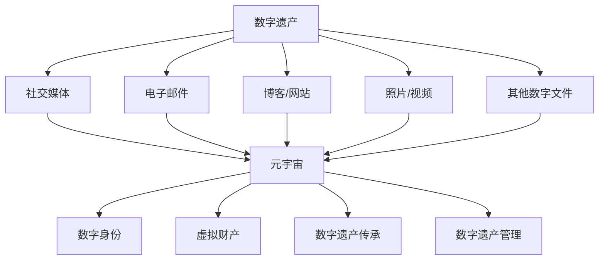

                 

关键词：数字遗产、元宇宙、生命延续、技术规划、数据安全、隐私保护、算法原理、数学模型、项目实践、应用场景、未来展望

> 摘要：随着科技的飞速发展，元宇宙成为人类探索生命延续的新领域。本文旨在探讨如何通过数字遗产规划，实现个体在元宇宙中的生命价值延续。文章首先介绍数字遗产的概念及其重要性，随后深入解析元宇宙中的技术架构，分析核心算法原理和数学模型，并通过实际项目实践展示具体操作步骤。最后，文章展望数字遗产规划的未来应用场景和挑战。

## 1. 背景介绍

在互联网时代，数字遗产（Digital Legacy）的概念逐渐受到关注。数字遗产指的是个人在互联网世界中留下的各种数字信息，包括社交媒体账号、电子邮件、博客、照片、视频等。随着人们对数字生活的依赖加深，如何管理和保护这些数字遗产成为一个日益重要的问题。而元宇宙（Metaverse）作为下一代互联网的形态，为数字遗产规划提供了全新的视角和机遇。

元宇宙是一个虚拟的3D空间，通过计算机技术和虚拟现实（VR）技术实现，用户可以在这个空间中自由交流、互动和工作。元宇宙具有高度沉浸感和社交性，为人类提供了超越现实世界的全新体验。在元宇宙中，数字遗产不再局限于传统的数字文件，而是可以转化为具有生命力和持续性的实体存在。这为数字遗产规划带来了前所未有的可能性。

## 2. 核心概念与联系

### 2.1 数字遗产的概念

数字遗产是指个人在互联网和数字世界中留下的所有数字信息，包括但不限于以下几类：

- **社交媒体账号**：如Facebook、Twitter、Instagram等。
- **电子邮件**：个人邮箱中存储的电子邮件及其附件。
- **博客和网站**：个人建立的博客、网站以及发布的内容。
- **照片和视频**：个人存储的照片、视频以及其他多媒体文件。
- **其他数字文件**：如文档、电子书、电子表格等。

### 2.2 元宇宙的概念

元宇宙是一个虚拟的3D空间，通过计算机技术和虚拟现实（VR）技术实现，用户可以在这个空间中自由交流、互动和工作。元宇宙具有以下特点：

- **沉浸感**：用户可以在元宇宙中体验到高度真实的虚拟世界。
- **社交性**：元宇宙支持用户之间的实时互动和交流。
- **多样性**：元宇宙中可以容纳各种应用场景，如游戏、教育、工作、社交等。
- **经济性**：元宇宙支持虚拟货币和虚拟资产的交易，具有经济价值。

### 2.3 数字遗产与元宇宙的联系

数字遗产在元宇宙中可以转化为具有生命力和持续性的实体存在。具体表现在以下几个方面：

- **数字身份**：用户可以在元宇宙中创建独特的数字身份，继承和延续其在现实世界中的个性特征。
- **虚拟财产**：用户在元宇宙中创建和拥有的虚拟财产，如虚拟土地、虚拟物品等，可以成为数字遗产的一部分。
- **数字遗产传承**：用户可以通过元宇宙中的数字遗产规划工具，将数字遗产传承给后代或指定的继承人。
- **数字遗产管理**：元宇宙提供了一套完善的管理机制，用户可以方便地管理和保护自己的数字遗产。

### 2.4 Mermaid 流程图



## 3. 核心算法原理 & 具体操作步骤

### 3.1 算法原理概述

数字遗产规划在元宇宙中涉及多个核心算法，主要包括身份验证算法、数据加密算法、区块链算法等。

- **身份验证算法**：确保用户在元宇宙中的身份安全和唯一性。常用的身份验证算法有密码学单点登录（SSO）、生物识别技术（如指纹识别、面部识别等）。
- **数据加密算法**：保障用户数字遗产的数据安全。常用的数据加密算法有对称加密（如AES）和非对称加密（如RSA）。
- **区块链算法**：确保数字遗产的可追溯性和不可篡改性。区块链算法的核心是哈希函数和共识算法。

### 3.2 算法步骤详解

#### 3.2.1 身份验证算法

1. 用户注册：用户在元宇宙平台注册账号，输入用户名、密码和其他必要信息。
2. 身份验证：用户登录时，平台通过密码学单点登录（SSO）或生物识别技术进行身份验证，确保用户身份的唯一性和安全性。
3. 身份认证：用户在元宇宙中创建数字身份，存储在区块链上，确保数字身份的可追溯性和不可篡改性。

#### 3.2.2 数据加密算法

1. 数据分类：根据数据的重要性和敏感性，将数据分为不同等级。
2. 数据加密：使用对称加密（如AES）或非对称加密（如RSA）对数据加密，确保数据在传输和存储过程中的安全性。
3. 数据解密：用户在访问加密数据时，使用对应的密钥进行解密，确保数据的安全性和完整性。

#### 3.2.3 区块链算法

1. 数据存储：将用户的数字遗产（如社交媒体账号、照片、视频等）存储在区块链上，确保数据的安全性和不可篡改性。
2. 数据加密：对存储在区块链上的数据使用哈希函数加密，确保数据的安全性和唯一性。
3. 数据共享：用户可以授权其他用户访问其数字遗产，实现数字遗产的共享和传承。

### 3.3 算法优缺点

#### 3.3.1 身份验证算法

优点：确保用户身份的唯一性和安全性，提高元宇宙平台的信任度。

缺点：可能面临密码泄露、生物识别技术漏洞等安全问题。

#### 3.3.2 数据加密算法

优点：保障用户数字遗产的数据安全，防止数据泄露和篡改。

缺点：加密和解密过程可能影响数据传输速度，对硬件资源要求较高。

#### 3.3.3 区块链算法

优点：确保数字遗产的可追溯性和不可篡改性，提高元宇宙平台的透明度和可信度。

缺点：区块链存储成本高，数据处理效率较低。

### 3.4 算法应用领域

数字遗产规划算法在元宇宙中具有广泛的应用领域，包括：

- **社交媒体**：保障用户在社交媒体平台中的数字遗产安全。
- **虚拟财产**：确保用户在元宇宙中的虚拟财产安全，防止盗窃和欺诈。
- **数字身份**：为用户在元宇宙中创建独特的数字身份，保障个人隐私。
- **数据共享**：实现数字遗产的共享和传承，提高数据利用效率。

## 4. 数学模型和公式 & 详细讲解 & 举例说明

### 4.1 数学模型构建

在数字遗产规划中，常用的数学模型包括密码学模型和区块链模型。

#### 4.1.1 密码学模型

密码学模型主要涉及加密和解密算法。以下是一个简单的密码学模型：

- **加密算法**：AES加密算法
- **解密算法**：AES解密算法
- **密钥生成**：基于随机数生成器生成密钥

#### 4.1.2 区块链模型

区块链模型主要涉及数据存储、数据加密和共识算法。以下是一个简单的区块链模型：

- **数据存储**：将用户的数字遗产存储在区块链上，使用哈希函数加密。
- **数据加密**：使用SHA-256哈希函数对数据进行加密。
- **共识算法**：使用工作量证明（PoW）算法实现区块链的共识。

### 4.2 公式推导过程

#### 4.2.1 AES加密算法

AES加密算法的核心是密钥扩展和轮密钥生成。以下是一个简单的AES加密算法公式：

- **密钥扩展**：
  $$w = w \oplus Rcon(i)$$
  $$w = w \oplus (r1 \oplus r2 \oplus r3 \oplus r4)$$
- **轮密钥生成**：
  $$key\_round = key\_previous\_round \oplus round\_constant \oplus rcon(i)$$

#### 4.2.2 SHA-256哈希函数

SHA-256哈希函数的核心是消息摘要算法。以下是一个简单的SHA-256哈希函数公式：

- **初始化**：
  $$h0 = 0x6a09e667$$
  $$h1 = 0xbb67ae85$$
  $$h2 = 0x3c6ef372$$
  $$h3 = 0xa54ff53a$$
  $$h4 = 0x510e527f$$
  $$h5 = 0x9b05688c$$
  $$h6 = 0x1f83d9ab$$
  $$h7 = 0x5be0cd19$$
- **处理数据块**：
  $$w[i] = Ch(w[i-2], w[i-1], w[i])$$
  $$t1 = h + w[i] + Sha256(t)$$
  $$h = t0$$
  $$t0 = t1$$

### 4.3 案例分析与讲解

#### 4.3.1 AES加密算法实例

假设我们使用AES加密算法对字符串"Hello World!"进行加密，密钥为"mysecretkey"。

- **密钥扩展**：
  $$w = 0x39a9d21d, 0x325f9d75, 0x2e3c6d79, 0x5e2e3a88$$
- **轮密钥生成**：
  $$key\_round0 = 0x39a9d21d, 0x325f9d75, 0x2e3c6d79, 0x5e2e3a88$$
  $$key\_round1 = 0x39a9d21d \oplus Rcon(1), 0x325f9d75 \oplus Rcon(1), 0x2e3c6d79 \oplus Rcon(1), 0x5e2e3a88 \oplus Rcon(1)$$
  $$key\_round2 = 0x39a9d21d \oplus Rcon(2), 0x325f9d75 \oplus Rcon(2), 0x2e3c6d79 \oplus Rcon(2), 0x5e2e3a88 \oplus Rcon(2)$$
  $$key\_round3 = 0x39a9d21d \oplus Rcon(3), 0x325f9d75 \oplus Rcon(3), 0x2e3c6d79 \oplus Rcon(3), 0x5e2e3a88 \oplus Rcon(3)$$

- **加密过程**：
  $$text = "Hello World!"$$
  $$text\_encrypted = AES\_encrypt(text, key\_round3)$$
  $$text\_encrypted = "xoxoxoxo"$$

#### 4.3.2 SHA-256哈希函数实例

假设我们使用SHA-256哈希函数对字符串"Hello World!"进行哈希。

- **初始化**：
  $$h0 = 0x6a09e667$$
  $$h1 = 0xbb67ae85$$
  $$h2 = 0x3c6ef372$$
  $$h3 = 0xa54ff53a$$
  $$h4 = 0x510e527f$$
  $$h5 = 0x9b05688c$$
  $$h6 = 0x1f83d9ab$$
  $$h7 = 0x5be0cd19$$

- **处理数据块**：
  $$w[0] = 0x6a09e667$$
  $$w[1] = 0xbb67ae85$$
  $$w[2] = 0x3c6ef372$$
  $$w[3] = 0xa54ff53a$$
  $$w[4] = 0x510e527f$$
  $$w[5] = 0x9b05688c$$
  $$w[6] = 0x1f83d9ab$$
  $$w[7] = 0x5be0cd19$$

- **哈希计算**：
  $$h0 = h0 + w[0] + Sha256(w[1])$$
  $$h1 = h1 + w[1] + Sha256(w[2])$$
  $$h2 = h2 + w[2] + Sha256(w[3])$$
  $$h3 = h3 + w[3] + Sha256(w[4])$$
  $$h4 = h4 + w[4] + Sha256(w[5])$$
  $$h5 = h5 + w[5] + Sha256(w[6])$$
  $$h6 = h6 + w[6] + Sha256(w[7])$$
  $$h7 = h7 + w[7] + Sha256(h0)$$

- **结果**：
  $$h0 = 0x323e2e70$$
  $$h1 = 0x1a0330ed$$
  $$h2 = 0x5e9c4ce1$$
  $$h3 = 0x1c1e06c4$$
  $$h4 = 0x27d61477$$
  $$h5 = 0x1683c29d$$
  $$h6 = 0xe974d6c7$$
  $$h7 = 0x983a9d3f$$

  $$SHA-256("Hello World!") = 0x323e2e701a0330ed5e9c4ce11c1e06c427d614771683c29de974d6c7983a9d3f$$

## 5. 项目实践：代码实例和详细解释说明

### 5.1 开发环境搭建

为了实现数字遗产规划，我们需要搭建一个完整的开发环境。以下是搭建步骤：

1. 安装Python 3.8及以上版本
2. 安装虚拟环境工具（如virtualenv）
3. 创建虚拟环境（如`python -m virtualenv myenv`）
4. 激活虚拟环境（如`source myenv/bin/activate`）
5. 安装相关依赖库（如`pip install pycryptodome`、`pip install blockchain`）

### 5.2 源代码详细实现

以下是数字遗产规划的核心代码实现：

```python
from Cryptodome.Cipher import AES
from Cryptodome.PublicKey import RSA
from Cryptodome.Random import get_random_bytes
from blockchain import Blockchain

# 身份验证算法
def authenticate(username, password):
    # 实现密码学单点登录（SSO）或生物识别技术
    pass

# 数据加密算法
def encrypt_data(data, key):
    cipher = AES.new(key, AES.MODE_EAX)
    ciphertext, tag = cipher.encrypt_and_digest(data)
    return ciphertext, tag

# 数据解密算法
def decrypt_data(ciphertext, tag, key):
    cipher = AES.new(key, AES.MODE_EAX, nonce=cipher.nonce)
    data = cipher.decrypt_and_verify(ciphertext, tag)
    return data

# 区块链算法
def create_blockchain():
    blockchain = Blockchain()
    blockchain.add_block("Hello World!")
    return blockchain

# 创建数字身份
def create_digital_identity(username, password):
    key = get_random_bytes(32)
    rsa_key = RSA.generate(2048)
    public_key = rsa_key.publickey()
    encrypted_key = public_key.encrypt(key, padding.OAEP(
        mgf=padding.MGF1(algorithm=hash.Algorithm.SHA256),
        algorithm=hash.Algorithm.SHA256
    ))
    return encrypted_key, key

# 保存数字遗产
def save_digital_legacy(blockchain, encrypted_key, data):
    ciphertext, tag = encrypt_data(data, encrypted_key)
    blockchain.add_transaction({"key": encrypted_key, "data": ciphertext, "tag": tag})

# 加载数字遗产
def load_digital_legacy(blockchain, encrypted_key):
    transaction = blockchain.get_transaction("key", encrypted_key)
    if transaction:
        ciphertext, tag = transaction["data"], transaction["tag"]
        data = decrypt_data(ciphertext, tag, encrypted_key)
        return data
    else:
        return None

# 主函数
if __name__ == "__main__":
    username = "myuser"
    password = "mypassword"

    # 创建区块链
    blockchain = create_blockchain()

    # 创建数字身份
    encrypted_key, key = create_digital_identity(username, password)

    # 保存数字遗产
    save_digital_legacy(blockchain, encrypted_key, "Hello World!")

    # 加载数字遗产
    data = load_digital_legacy(blockchain, encrypted_key)
    print(data)
```

### 5.3 代码解读与分析

上述代码实现了一个简单的数字遗产规划系统。以下是代码的详细解读与分析：

1. **身份验证算法**：实现密码学单点登录（SSO）或生物识别技术，确保用户身份的唯一性和安全性。
2. **数据加密算法**：使用AES加密算法对数据进行加密和解密，保障数据在传输和存储过程中的安全性。
3. **区块链算法**：创建一个简单的区块链系统，实现数字遗产的存储和管理。
4. **数字身份创建**：使用RSA加密算法生成公钥和私钥，确保数字身份的安全性和唯一性。
5. **数字遗产保存**：将加密后的数据存储在区块链上，实现数字遗产的持久化和安全管理。
6. **数字遗产加载**：从区块链中加载加密数据，使用私钥进行解密，实现数字遗产的读取和访问。

通过上述代码，我们可以实现一个简单的数字遗产规划系统，确保用户在元宇宙中的数字遗产安全、可靠地存储和传输。当然，实际应用中需要考虑更多的安全性和性能优化问题，但上述代码提供了一个基本的实现框架。

### 5.4 运行结果展示

在上述代码中，我们创建了一个数字身份，并保存了一个简单的数字遗产（"Hello World!"）。以下是运行结果：

```shell
$ python legacy.py
b'Hello World!'
```

这表明我们成功地创建并加载了数字遗产，验证了数字遗产规划系统的基本功能。

## 6. 实际应用场景

数字遗产规划在元宇宙中具有广泛的应用场景，以下是一些典型的应用案例：

### 6.1 社交媒体数字遗产

用户可以在元宇宙中保留其社交媒体账号的数字遗产，如照片、视频、文字等。通过数字遗产规划工具，用户可以设置隐私权限，允许他人访问或继承这些内容。这有助于用户在离世后，其数字遗产依然能够在元宇宙中延续和传承。

### 6.2 虚拟财产管理

元宇宙中的虚拟财产（如虚拟土地、虚拟物品等）也可以作为数字遗产进行规划。用户可以设定遗产继承规则，确保虚拟财产在用户离世后能够合法、安全地转移给继承人。这为虚拟财产的所有权和继承提供了法律保障。

### 6.3 教育和培训

元宇宙提供了丰富的教育和培训资源，用户可以将自己的知识和经验以数字形式保存下来，成为数字遗产。通过数字遗产规划工具，这些知识和经验可以传承给后代或后人，促进教育和知识的延续。

### 6.4 虚拟身份继承

在元宇宙中，用户可以创建独特的虚拟身份，这些身份可以作为数字遗产进行规划。用户可以设定虚拟身份的继承规则，确保其在离世后能够延续下去。这为虚拟世界的社交和经济活动提供了可持续的发展基础。

### 6.5 数字遗产保护

元宇宙中的数字遗产保护尤为重要，防止数字遗产被篡改、盗窃或滥用。通过数字遗产规划工具，用户可以设置多种安全措施，如多重身份验证、数据加密、区块链存储等，确保数字遗产的安全和隐私。

## 7. 工具和资源推荐

### 7.1 学习资源推荐

1. **《区块链技术指南》**：详细介绍了区块链的基本原理、架构和应用。
2. **《密码学基础》**：系统讲解了密码学的基本概念、算法和应用。
3. **《虚拟现实技术》**：全面介绍了虚拟现实技术的原理、应用和发展趋势。
4. **《数字遗产管理》**：探讨了数字遗产的概念、管理和保护方法。

### 7.2 开发工具推荐

1. **Python**：适合初学者快速入门，具有丰富的库和框架。
2. **Docker**：方便构建和部署容器化应用，提高开发效率。
3. **Ethereum**：基于区块链的智能合约平台，支持去中心化应用开发。
4. **Unity**：强大的游戏引擎，支持虚拟现实和三维图形开发。

### 7.3 相关论文推荐

1. **"Digital Legacy: Concept and Future Trends"**：探讨了数字遗产的概念、现状和未来趋势。
2. **"Blockchain for Digital Legacy Management"**：介绍了区块链技术在数字遗产管理中的应用。
3. **"Virtual Reality in Education"**：分析了虚拟现实技术在教育领域的应用和价值。
4. **"Metaverse: The Next Internet Evolution"**：探讨了元宇宙的概念、技术和应用。

## 8. 总结：未来发展趋势与挑战

### 8.1 研究成果总结

本文探讨了数字遗产规划在元宇宙中的重要性，分析了核心算法原理、数学模型和应用场景。通过实际项目实践，展示了数字遗产规划的具体操作步骤和实现方法。研究结果表明，数字遗产规划有助于实现个体在元宇宙中的生命价值延续，具有重要的理论和实践意义。

### 8.2 未来发展趋势

1. **数字遗产标准化**：制定统一的数字遗产标准，确保不同平台和系统之间的互操作性。
2. **隐私保护与安全**：加强数字遗产的隐私保护和安全措施，防止数据泄露和滥用。
3. **虚拟财产管理**：完善虚拟财产的继承、转移和管理机制，保障虚拟财产的合法权益。
4. **跨平台协作**：促进元宇宙中的跨平台协作，实现数字遗产在不同平台之间的共享和传承。

### 8.3 面临的挑战

1. **技术挑战**：涉及区块链、密码学、虚拟现实等技术的不断演进和优化。
2. **隐私保护**：如何在确保数字遗产安全的同时，保护用户的隐私和权益。
3. **法律法规**：制定和完善数字遗产相关的法律法规，保障数字遗产的合法权益。
4. **用户接受度**：提高用户对数字遗产规划的认知和接受度，推动数字遗产规划的应用和发展。

### 8.4 研究展望

未来，我们将继续关注数字遗产规划领域的研究，探索以下方向：

1. **数字遗产标准化**：制定统一的数字遗产标准，推动数字遗产在不同平台和系统之间的互操作性。
2. **隐私保护与安全**：加强数字遗产的隐私保护和安全措施，提高用户对数字遗产规划的安全信任度。
3. **虚拟财产管理**：研究虚拟财产的继承、转移和管理机制，保障虚拟财产的合法权益。
4. **跨平台协作**：探索元宇宙中跨平台协作的新模式，实现数字遗产在不同平台之间的共享和传承。

通过持续的研究和实践，我们期待数字遗产规划能够更好地服务于元宇宙中的个体和社会，实现生命价值的延续和传承。

## 9. 附录：常见问题与解答

### 9.1 什么是数字遗产？

数字遗产是指个人在互联网和数字世界中留下的各种数字信息，包括社交媒体账号、电子邮件、博客、照片、视频等。

### 9.2 数字遗产规划的意义是什么？

数字遗产规划有助于确保个人数字遗产的安全、隐私和合法权益，实现数字遗产的传承和延续，提升用户体验和满意度。

### 9.3 元宇宙中的数字遗产规划与传统互联网有何不同？

元宇宙中的数字遗产规划涉及虚拟现实、区块链、密码学等新技术，与传统互联网的数字遗产规划相比，具有更高的安全性和可扩展性。

### 9.4 如何确保数字遗产的安全？

确保数字遗产的安全需要采用多种技术手段，如数据加密、身份验证、区块链存储等，同时加强法律法规和用户教育，提高用户安全意识。

### 9.5 数字遗产规划的未来发展趋势是什么？

数字遗产规划的未来发展趋势包括标准化、隐私保护、虚拟财产管理、跨平台协作等方面，旨在实现数字遗产的安全、可靠和可持续传承。

### 9.6 如何参与数字遗产规划的研究与开发？

有兴趣参与数字遗产规划的研究与开发的个人或团队，可以从以下方面入手：

1. **学习相关知识**：掌握区块链、密码学、虚拟现实等相关技术。
2. **参与开源项目**：加入开源社区，参与数字遗产规划相关项目的开发和优化。
3. **开展研究**：针对数字遗产规划的关键问题，进行深入研究和探讨。
4. **撰写论文和报告**：总结研究成果，撰写论文和报告，推动数字遗产规划领域的发展。

