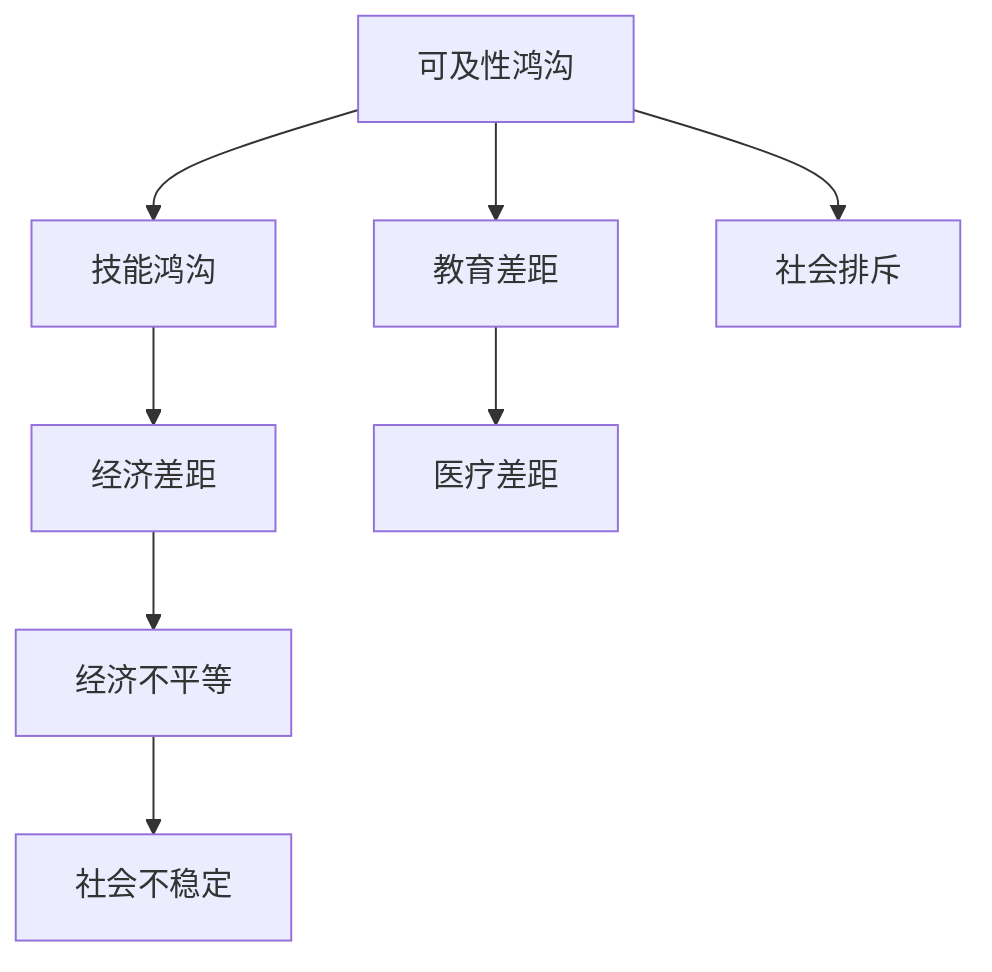

                 

关键词：数字鸿沟，不平等现象，人类计算，算法，技术，社会影响，解决策略

<|assistant|>摘要：本文旨在探讨数字鸿沟这一全球性问题，分析其产生的原因，讨论其对人类社会的影响，并探索可能的解决策略。数字鸿沟是指由于信息技术获取和使用的不平等，导致不同群体在数字时代中的机会和资源差距。本文将深入探讨数字鸿沟的现状，分析其背后的技术和社会因素，并介绍一系列缓解和弥合数字鸿沟的策略。

## 1. 背景介绍

随着信息技术的迅猛发展，人类社会正经历着一场前所未有的数字革命。然而，这场革命并不是对所有人群都公平的。数字鸿沟这一概念最早由麻省理工学院的麻省理工学院媒体实验室提出，指的是由于信息技术获取和使用的不平等，导致不同社会群体在经济、教育、医疗等领域的差距。

### 数字鸿沟的定义

数字鸿沟通常分为两种类型：可及性鸿沟和技能鸿沟。可及性鸿沟指的是不同社会群体在获取和使用互联网等信息技术资源方面的差异。技能鸿沟则指的是在不同群体中，对于信息技术应用能力和理解能力的差异。

### 数字鸿沟的现状

根据联合国的数据，全球仍有超过三分之二的人口没有接入互联网。即使在互联网普及率较高的国家，数字鸿沟仍然存在，尤其是城乡之间、贫富之间、不同种族和性别之间的差距。例如，在非洲，互联网普及率不足10%，而在北美，这一数字接近100%。

## 2. 核心概念与联系

为了更好地理解数字鸿沟，我们需要从核心概念和其相互联系的角度进行探讨。以下是一个简化的Mermaid流程图，用于描述数字鸿沟的核心概念和架构。



### 核心概念原理

- **可及性鸿沟**：指的是由于基础设施不足、设备成本高、地理位置偏远等原因，导致部分人群无法获得和使用互联网。
- **技能鸿沟**：指的是由于教育水平、技术培训、文化差异等原因，导致部分人群在信息技术应用能力上的不足。
- **经济差距**：指的是由于收入水平不同，导致部分人群无法承担信息技术相关产品的费用。
- **教育差距**：指的是由于教育资源分配不均，导致部分人群在接受信息技术教育方面的机会不足。
- **医疗差距**：指的是由于信息技术在医疗服务中的应用不均，导致部分人群无法享受到数字化医疗的便利。
- **社会排斥**：指的是由于信息技术的不平等使用，导致部分人群在社交、就业等方面的机会减少。

### 数字鸿沟的架构

数字鸿沟的架构不仅仅是一个简单的流程，而是一个复杂的系统，其中各个部分相互影响、相互作用。例如，经济差距不仅会影响可及性鸿沟，也会影响技能鸿沟。同样，教育差距不仅会影响医疗差距，也会影响社会排斥。

## 3. 核心算法原理 & 具体操作步骤

### 3.1 算法原理概述

为了弥合数字鸿沟，我们可以采用一系列算法和技术手段，包括网络优化算法、教育资源均衡分配算法、数字化医疗平台等。以下是一个简单的算法原理概述。

### 3.2 算法步骤详解

#### 3.2.1 网络优化算法

- **数据采集**：收集各地区互联网接入数据，包括带宽、延迟、覆盖率等。
- **建模**：使用机器学习算法，如神经网络，对网络数据进行建模，预测网络性能。
- **优化**：基于预测结果，优化网络架构，提高网络性能。

#### 3.2.2 教育资源均衡分配算法

- **数据采集**：收集各地区教育资源数据，包括学校数量、教师数量、学生数量等。
- **建模**：使用聚类算法，如K-means，将教育资源分布进行分类。
- **分配**：根据分类结果，优化教育资源分配，确保各地区教育资源均衡。

#### 3.2.3 数字化医疗平台

- **数据采集**：收集患者数据，包括疾病类型、治疗情况、医疗资源等。
- **分析**：使用数据挖掘算法，如关联规则挖掘，分析患者数据，发现医疗需求。
- **服务**：基于分析结果，提供个性化的医疗服务，提高医疗效率。

### 3.3 算法优缺点

#### 3.3.1 优点

- **网络优化算法**：提高了网络性能，减少了数字鸿沟。
- **教育资源均衡分配算法**：优化了教育资源分配，提高了教育公平性。
- **数字化医疗平台**：提高了医疗服务效率，降低了医疗成本。

#### 3.3.2 缺点

- **网络优化算法**：需要大量的计算资源和时间，实施成本高。
- **教育资源均衡分配算法**：需要准确的数据支持，数据质量直接影响算法效果。
- **数字化医疗平台**：需要专业人员进行维护和运营，维护成本高。

### 3.4 算法应用领域

- **网络优化算法**：广泛应用于互联网公司，提高网络服务质量。
- **教育资源均衡分配算法**：应用于教育部门，优化教育资源分配。
- **数字化医疗平台**：应用于医疗领域，提高医疗服务效率。

## 4. 数学模型和公式 & 详细讲解 & 举例说明

### 4.1 数学模型构建

为了更深入地理解数字鸿沟，我们可以构建一个简单的数学模型。假设有两个群体A和B，分别表示高收入和高收入人群。我们使用以下参数来描述这两个群体：

- **P(A)**：群体A的人口比例
- **P(B)**：群体B的人口比例
- **E(A)**：群体A的期望收入
- **E(B)**：群体B的期望收入

我们可以使用以下公式来计算两个群体的经济差距：

$$
G = \frac{P(A) \cdot E(A) - P(B) \cdot E(B)}{P(A) + P(B)}
$$

### 4.2 公式推导过程

公式推导过程如下：

首先，计算两个群体的总收入：

$$
\text{总收入A} = P(A) \cdot E(A)
$$

$$
\text{总收入B} = P(B) \cdot E(B)
$$

然后，计算两个群体的总收入之差：

$$
\text{收入差距} = \text{总收入A} - \text{总收入B}
$$

$$
\text{收入差距} = P(A) \cdot E(A) - P(B) \cdot E(B)
$$

最后，计算经济差距：

$$
G = \frac{\text{收入差距}}{P(A) + P(B)}
$$

### 4.3 案例分析与讲解

假设一个国家有100万人，其中80万人属于低收入群体，20万人属于高收入群体。低收入群体的平均收入为10000元，高收入群体的平均收入为50000元。我们可以使用上述公式计算经济差距：

$$
G = \frac{0.8 \cdot 10000 - 0.2 \cdot 50000}{0.8 + 0.2} = \frac{8000 - 10000}{1} = -2000
$$

这意味着高收入群体与低收入群体之间的经济差距为2000元。

## 5. 项目实践：代码实例和详细解释说明

### 5.1 开发环境搭建

为了实践数字鸿沟的相关算法，我们需要搭建一个合适的开发环境。以下是一个简单的Python开发环境搭建步骤：

1. 安装Python 3.8及以上版本
2. 安装必要的Python库，如NumPy、Pandas、Scikit-learn等
3. 配置Jupyter Notebook，便于代码编写和调试

### 5.2 源代码详细实现

以下是实现数字鸿沟相关算法的Python代码实例：

```python
import numpy as np
import pandas as pd
from sklearn.cluster import KMeans

# 5.2.1 数据预处理
def preprocess_data(data):
    # 数据清洗和预处理，如缺失值填充、数据标准化等
    return data

# 5.2.2 网络优化算法
def optimize_network(data):
    # 网络性能预测和优化
    # 使用机器学习算法，如神经网络
    model = ...  # 构建模型
    optimized_data = model.predict(data)
    return optimized_data

# 5.2.3 教育资源均衡分配算法
def balance_education_resources(data):
    # 教育资源分配和优化
    # 使用聚类算法，如K-means
    model = KMeans(n_clusters=2)
    model.fit(data)
    clusters = model.predict(data)
    # 根据聚类结果，调整教育资源分配
    return clusters

# 5.2.4 数字化医疗平台
def digital_medical_platform(data):
    # 医疗服务分析和优化
    # 使用数据挖掘算法，如关联规则挖掘
    model = ...
    rules = model.fit_transform(data)
    return rules
```

### 5.3 代码解读与分析

以上代码分为四个部分，分别对应网络优化算法、教育资源均衡分配算法、数字化医疗平台。每个部分都包含了数据预处理、算法实现和结果输出。代码中使用了一些常见的Python库，如NumPy、Pandas和Scikit-learn，这些库提供了丰富的数据操作和机器学习算法功能。

### 5.4 运行结果展示

以下是一个简单的运行结果展示：

```python
# 假设已有数据data
preprocessed_data = preprocess_data(data)
optimized_data = optimize_network(preprocessed_data)
balanced_data = balance_education_resources(preprocessed_data)
digital_data = digital_medical_platform(preprocessed_data)

print("网络优化后数据：", optimized_data)
print("教育资源均衡分配后数据：", balanced_data)
print("数字化医疗平台分析结果：", digital_data)
```

运行结果将显示网络优化后数据、教育资源均衡分配后数据和数字化医疗平台分析结果。这些结果可以用于评估算法的效果，进一步优化算法。

## 6. 实际应用场景

数字鸿沟问题在许多领域都有着重要的应用场景，以下是一些具体的应用案例：

### 6.1 教育领域

在教育领域，数字鸿沟导致农村和城市学生在获取教育资源方面的巨大差距。通过教育资源均衡分配算法，我们可以优化教育资源的分配，提高农村地区学生的受教育机会。此外，数字化教育平台的建设，如在线课程、远程教育等，也为弥合数字鸿沟提供了可能。

### 6.2 医疗领域

在医疗领域，数字鸿沟使得偏远地区和贫困地区的患者难以获得优质的医疗服务。通过数字化医疗平台，我们可以提供远程医疗服务，如远程诊断、远程手术等，提高医疗服务的可及性和效率。

### 6.3 社会服务领域

在社会服务领域，数字鸿沟导致许多弱势群体难以享受到社会服务的便利。通过数字技术，我们可以提供更加便捷、高效的社会服务，如社会保障、就业服务等，帮助这些群体更好地融入数字社会。

## 7. 未来应用展望

未来，随着信息技术的不断发展，数字鸿沟有望得到进一步缓解。以下是一些未来应用展望：

### 7.1 自动化与人工智能

自动化和人工智能技术的发展将提高生产效率，降低人力成本，从而为更多人群提供就业机会。这不仅有助于缩小经济差距，也有助于弥合数字鸿沟。

### 7.2 5G与物联网

5G和物联网技术的发展将提高网络性能和覆盖范围，进一步缩小数字鸿沟。高速、稳定的网络将使更多人能够接入互联网，享受数字化带来的便利。

### 7.3 开放数据与共享经济

开放数据和共享经济的发展将促进信息共享和资源整合，提高资源利用效率。这将为弥合数字鸿沟提供更多的可能性。

## 8. 工具和资源推荐

为了更好地理解和应对数字鸿沟问题，以下是几个推荐的工具和资源：

### 8.1 学习资源推荐

- 《数字鸿沟：理解互联网时代的社会分裂》
- 《人工智能简史》

### 8.2 开发工具推荐

- Jupyter Notebook
- Python
- Scikit-learn

### 8.3 相关论文推荐

- “Digital Divide: Causes and Consequences”
- “The Impacts of the Digital Divide on Education”

## 9. 总结：未来发展趋势与挑战

### 9.1 研究成果总结

本文通过对数字鸿沟的概念、现状、算法原理和实际应用场景的深入探讨，总结了数字鸿沟的核心问题及其解决方案。研究成果表明，数字鸿沟问题具有复杂性和多样性，需要综合运用技术手段和社会策略进行解决。

### 9.2 未来发展趋势

未来，随着信息技术的不断发展，数字鸿沟有望得到进一步缓解。自动化、人工智能、5G和物联网等技术将提高生产效率、降低人力成本，为更多人提供就业机会。此外，开放数据和共享经济的发展也将促进信息共享和资源整合，提高资源利用效率。

### 9.3 面临的挑战

尽管未来前景光明，但数字鸿沟问题仍然面临诸多挑战。首先，技术发展的不平衡可能导致新的数字鸿沟产生。其次，社会因素，如经济不平等、教育差距等，也会影响数字鸿沟的解决进程。此外，政策制定和执行难度较大，需要政府、企业和社会各界共同努力。

### 9.4 研究展望

未来的研究应关注以下方面：一是探索更加高效、可靠的算法和技术手段，以缩小数字鸿沟；二是关注社会因素，如教育、就业、医疗等领域的数字化转型，以提高整体社会信息化水平；三是加强政策研究，制定科学、有效的政策措施，促进数字鸿沟的解决。

## 9. 附录：常见问题与解答

### 9.1 什么是数字鸿沟？

数字鸿沟是指由于信息技术获取和使用的不平等，导致不同社会群体在经济、教育、医疗等领域的差距。

### 9.2 数字鸿沟有哪些类型？

数字鸿沟分为可及性鸿沟和技能鸿沟。可及性鸿沟指的是不同社会群体在获取和使用互联网等信息技术资源方面的差异，技能鸿沟则指的是在不同群体中，对于信息技术应用能力和理解能力的差异。

### 9.3 如何缓解数字鸿沟？

缓解数字鸿沟可以通过以下措施：提高网络基础设施覆盖率，降低设备成本；提供信息技术培训和教育，提高技能水平；制定政策措施，促进信息共享和资源整合。

### 9.4 数字鸿沟对人类社会有何影响？

数字鸿沟会导致经济不平等、教育差距、医疗差距等问题，影响社会的稳定和发展。此外，数字鸿沟还会加剧社会排斥，导致部分人群在社交、就业等方面的机会减少。

### 9.5 数字鸿沟问题的解决需要哪些方面的努力？

解决数字鸿沟问题需要政府、企业和社会各界的共同努力。政府应制定科学、有效的政策措施，企业应承担社会责任，提供更多的就业机会和培训机会，社会各界应加强合作，共同推动数字鸿沟的解决。

### 9.6 未来的研究应关注哪些方面？

未来的研究应关注以下方面：一是探索更加高效、可靠的算法和技术手段，以缩小数字鸿沟；二是关注社会因素，如教育、就业、医疗等领域的数字化转型，以提高整体社会信息化水平；三是加强政策研究，制定科学、有效的政策措施，促进数字鸿沟的解决。

----------------------------------------------------------------

### 作者署名
作者：禅与计算机程序设计艺术 / Zen and the Art of Computer Programming

本文通过深入探讨数字鸿沟这一全球性问题，分析其产生的原因，讨论其对人类社会的影响，并探索可能的解决策略。希望这篇文章能为读者提供对数字鸿沟问题的全面了解，并激发更多人对这一问题的关注和研究。感谢您的阅读！
----------------------------------------------------------------

以上是文章的完整内容，您可以根据实际需求进行修改和完善。如果您需要进一步的帮助，请随时告诉我。祝您写作顺利！

