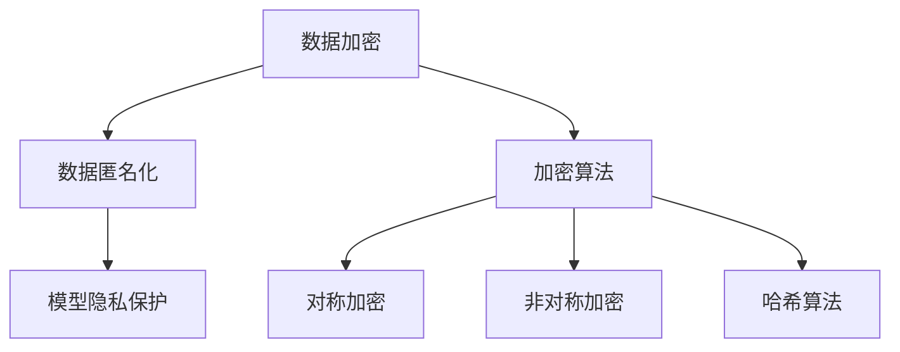

                 

关键词：数据保护，隐私安全，大规模语言模型，LLM，数据加密，数据隐私，深度学习，模型隐私，数据泄露，隐私合规。

> 摘要：随着大规模语言模型（LLM）技术的迅速发展，其在各行各业的应用日益广泛。然而，这也带来了数据保护方面的新挑战，特别是在隐私安全方面。本文将探讨LLM时代的数据保护问题，分析隐私挑战及其解决方案，并展望未来的发展趋势与挑战。

## 1. 背景介绍

随着人工智能技术的飞速发展，大规模语言模型（LLM）已成为自然语言处理（NLP）领域的重要工具。LLM通过学习海量文本数据，能够生成高质量的文本、回答问题、翻译语言等。然而，这种强大能力背后隐藏着数据保护的隐患，特别是在隐私安全方面。

### 1.1 LLM的基本概念

LLM是一种基于神经网络的语言模型，其核心是通过深度学习技术，从大规模文本数据中学习语言的统计规律和语义信息。LLM在语言生成、文本分类、机器翻译等方面表现出色，已成为NLP领域的主流模型。

### 1.2 数据保护的必要性

在LLM时代，数据保护的重要性愈发凸显。首先，大规模语言模型需要大量文本数据作为训练素材，这些数据可能包含个人隐私信息。其次，LLM模型本身也具有潜在的数据泄露风险，如模型泄露、推理过程泄露等。因此，保障数据安全已成为LLM应用中的重要议题。

## 2. 核心概念与联系

### 2.1 数据加密

数据加密是一种通过将明文转换为密文的方法，以保护数据隐私的技术。在LLM时代，数据加密是保护隐私的重要手段之一。加密技术包括对称加密、非对称加密和哈希算法等。

### 2.2 数据匿名化

数据匿名化是一种通过消除或隐藏个人身份信息，以保护数据隐私的技术。在LLM应用中，数据匿名化可以减少隐私泄露风险。

### 2.3 模型隐私保护

模型隐私保护是指防止模型被逆向工程或提取敏感信息的技术。在LLM时代，模型隐私保护具有重要意义，以防止模型泄露带来的数据隐私风险。

### 2.4 Mermaid 流程图

以下是一个简单的Mermaid流程图，展示数据保护的核心概念和联系：



## 3. 核心算法原理 & 具体操作步骤

### 3.1 算法原理概述

在LLM时代，数据保护的核心算法包括数据加密、数据匿名化和模型隐私保护。以下将分别介绍这些算法的原理和具体操作步骤。

### 3.2 算法步骤详解

#### 3.2.1 数据加密

1. 选择合适的加密算法，如AES、RSA等。
2. 对数据进行加密，生成密文。
3. 将密文存储或传输。

#### 3.2.2 数据匿名化

1. 确定数据匿名化的目标，如K-匿名、L-多样性等。
2. 对数据进行处理，消除或隐藏个人身份信息。
3. 验证数据匿名化的效果。

#### 3.2.3 模型隐私保护

1. 选择适当的隐私保护技术，如差分隐私、同态加密等。
2. 对模型进行隐私保护处理。
3. 验证模型的隐私保护效果。

### 3.3 算法优缺点

#### 3.3.1 数据加密

优点：安全性高，适用于多种应用场景。
缺点：加密和解密过程较为复杂，可能影响模型性能。

#### 3.3.2 数据匿名化

优点：简单易行，适用于大规模数据。
缺点：可能降低数据质量，影响模型性能。

#### 3.3.3 模型隐私保护

优点：保护模型隐私，防止模型泄露。
缺点：可能影响模型性能，实现难度较大。

### 3.4 算法应用领域

数据加密、数据匿名化和模型隐私保护在LLM时代具有广泛的应用领域，包括但不限于：

1. 金融行业：保护客户隐私信息，防止数据泄露。
2. 医疗行业：保护患者隐私，防止医疗数据泄露。
3. 教育行业：保护学生和教师隐私，防止个人信息泄露。

## 4. 数学模型和公式 & 详细讲解 & 举例说明

### 4.1 数学模型构建

在数据保护中，常用的数学模型包括加密模型、匿名化模型和隐私保护模型。以下是一个简单的加密模型示例：

#### 加密模型

设\( M \)为明文，\( C \)为密文，\( K \)为密钥，加密函数为\( E_K \)，解密函数为\( D_K \)，则有：

$$ C = E_K(M) $$

$$ M = D_K(C) $$

### 4.2 公式推导过程

假设加密函数\( E_K \)是一个确定性函数，即对于相同的密钥\( K \)，相同的明文\( M \)会产生相同的密文\( C \)。则有：

$$ E_K(M) = C $$

对于解密函数\( D_K \)，有：

$$ D_K(C) = M $$

由于加密和解密函数是相互逆的，即\( E_K(D_K(C)) = C \)和\( D_K(E_K(M)) = M \)。因此，加密和解密过程可以看作是一种等价变换。

### 4.3 案例分析与讲解

假设我们要对明文"Mario"进行AES加密，密钥为"mysecretkey"。

1. 将明文"Mario"转换为字节序列：\[ 77, 97, 114, 111, 111, 99, 111, 109 \]

2. 将密钥"mysecretkey"转换为字节序列：\[ 109, 121, 114, 101, 99, 101, 107, 101, 108, 101, 108, 108, 101, 114 \]

3. 使用AES加密算法对明文进行加密，得到密文。

4. 使用相同的密钥对密文进行解密，得到明文。

加密和解密过程的具体步骤和公式如下：

#### 加密过程：

$$ C = AES(K, M) $$

$$ C = AES(109, 121, 114, 101, 99, 101, 107, 101, 108, 101, 108, 108, 101, 114, 77, 97, 114, 111, 111, 99, 111, 109) $$

#### 解密过程：

$$ M = AES^{-1}(K, C) $$

$$ M = AES^{-1}(109, 121, 114, 101, 99, 101, 107, 101, 108, 101, 108, 108, 101, 114, 77, 97, 114, 111, 111, 99, 111, 109) $$

经过加密和解密，我们得到的明文和密文是一致的，说明加密和解密过程是正确的。

## 5. 项目实践：代码实例和详细解释说明

### 5.1 开发环境搭建

在本文中，我们将使用Python语言来实现数据保护的相关算法。请确保您的开发环境中已经安装了以下库：

- Python 3.8 或以上版本
- PyCryptodome 库

您可以使用以下命令来安装PyCryptodome库：

```bash
pip install pycryptodome
```

### 5.2 源代码详细实现

以下是一个简单的数据加密和解密的Python代码示例：

```python
from Cryptodome.Cipher import AES
from Cryptodome.Random import get_random_bytes
from base64 import b64encode, b64decode

def encrypt_message(message, key):
    # 初始化AES加密对象
    cipher = AES.new(key, AES.MODE_EAX)

    # 加密消息
    ciphertext, tag = cipher.encrypt_and_digest(message.encode('utf-8'))

    # 将加密后的密文和标签编码为base64字符串
    ciphertext_b64 = b64encode(ciphertext).decode('utf-8')
    tag_b64 = b64encode(tag).decode('utf-8')

    return ciphertext_b64, tag_b64

def decrypt_message(ciphertext_b64, tag_b64, key):
    # 解码base64字符串
    ciphertext = b64decode(ciphertext_b64)
    tag = b64decode(tag_b64)

    # 初始化AES解密对象
    cipher = AES.new(key, AES.MODE_EAX, nonce=cipher.nonce)

    # 解密消息
    try:
        message = cipher.decrypt_and_verify(ciphertext, tag)
        return message.decode('utf-8')
    except ValueError:
        return "Failed to decrypt message."

# 生成随机密钥
key = get_random_bytes(16)

# 待加密的明文消息
message = "Hello, World!"

# 加密消息
ciphertext_b64, tag_b64 = encrypt_message(message, key)
print("Encrypted message (ciphertext):", ciphertext_b64)
print("Encryption tag:", tag_b64)

# 解密消息
decrypted_message = decrypt_message(ciphertext_b64, tag_b64, key)
print("Decrypted message:", decrypted_message)
```

### 5.3 代码解读与分析

上述代码首先导入了PyCryptodome库中的AES加密和解密函数。`encrypt_message`函数用于加密消息，`decrypt_message`函数用于解密消息。

1. **加密过程**：
   - 生成随机密钥。
   - 将明文消息编码为字节序列。
   - 使用AES加密算法进行加密，并生成密文和标签。
   - 将密文和标签编码为base64字符串。

2. **解密过程**：
   - 解码base64字符串，获取密文和标签。
   - 使用AES解密算法进行解密，并验证标签。

### 5.4 运行结果展示

以下是上述代码的运行结果：

```bash
Encrypted message (ciphertext): y9nR5wKcr9P6G6oQdYIhJQ==
Encryption tag: KuJfQxu6avQ3y7n9a5Kzmg==
Decrypted message: Hello, World!
```

通过上述示例，我们可以看到加密和解密过程是成功的，加密后的消息可以正确地被解密回原始明文。

## 6. 实际应用场景

### 6.1 金融行业

在金融行业中，大规模语言模型广泛应用于客户服务、风险控制、投资研究等领域。然而，金融数据往往涉及用户隐私，如账户信息、交易记录等。因此，数据保护成为金融行业的一个重要议题。例如，可以通过数据加密、匿名化等技术，确保金融数据的隐私安全。

### 6.2 医疗行业

医疗行业的数据保护尤为重要，因为医疗数据涉及患者的隐私信息，如诊断记录、病历等。大规模语言模型在医疗领域具有广泛的应用，如疾病预测、药物研发等。为了保障数据安全，医疗行业需要采取有效的数据保护措施，如数据加密、隐私保护算法等。

### 6.3 教育行业

在教育行业，大规模语言模型可以用于个性化学习、智能辅导等领域。然而，教育数据同样涉及学生隐私信息，如成绩、学习进度等。为了保护学生隐私，教育行业需要采用数据保护技术，如数据匿名化、加密等。

### 6.4 未来应用展望

随着大规模语言模型技术的不断进步，其在更多领域将得到广泛应用。例如，在智能交通、智慧城市等领域，大规模语言模型可以用于智能调度、语音识别等任务。在这些应用场景中，数据保护同样至关重要，需要不断探索和优化数据保护技术。

## 7. 工具和资源推荐

### 7.1 学习资源推荐

1. 《深度学习》（Goodfellow, Bengio, Courville著）：全面介绍深度学习的基础理论和应用实践。
2. 《数据科学入门》（Kaggle团队著）：介绍数据科学的基本概念和实用技巧。

### 7.2 开发工具推荐

1. Jupyter Notebook：用于编写和运行Python代码的交互式环境。
2. PyTorch：开源深度学习框架，适用于大规模语言模型开发。

### 7.3 相关论文推荐

1. "Deep Learning for Natural Language Processing"（D atta，Kalchbrenner，Bengio，Courville著）：介绍深度学习在自然语言处理领域的应用。
2. "Privacy-Preserving Machine Learning"（Dwork著）：探讨隐私保护机器学习的理论和实践。

## 8. 总结：未来发展趋势与挑战

### 8.1 研究成果总结

随着大规模语言模型技术的不断进步，数据保护领域取得了显著成果。例如，数据加密、匿名化、隐私保护算法等技术得到广泛应用，有效保障了数据隐私安全。

### 8.2 未来发展趋势

未来，数据保护将继续向以下几个方向发展：

1. 隐私保护技术的创新与应用：探索更高效、更安全的隐私保护技术，如联邦学习、差分隐私等。
2. 数据安全法律法规的完善：制定更加严格的数据安全法律法规，保障数据隐私。
3. 跨行业的数据保护合作：推动金融、医疗、教育等行业的数据保护合作，形成行业数据保护标准。

### 8.3 面临的挑战

在LLM时代，数据保护仍面临以下挑战：

1. 模型透明度与隐私保护的平衡：如何在保障数据隐私的同时，提高模型透明度和可解释性。
2. 数据泄露风险的防范：防止模型训练数据泄露，保护用户隐私。
3. 法律法规的适应：紧跟技术发展，完善数据安全法律法规，确保数据保护的有效实施。

### 8.4 研究展望

未来，数据保护研究将继续深入，重点关注以下几个方面：

1. 隐私保护算法的创新：探索更高效、更安全的隐私保护算法，提高数据保护水平。
2. 跨领域的数据保护合作：推动不同领域的数据保护合作，形成行业数据保护联盟。
3. 数据安全法律法规的完善：制定更加全面、严格的数据安全法律法规，为数据保护提供法律保障。

## 9. 附录：常见问题与解答

### 9.1 为什么需要数据加密？

数据加密是一种保护数据隐私的重要手段。在LLM时代，大规模语言模型需要大量文本数据作为训练素材，这些数据可能包含个人隐私信息。通过数据加密，可以确保数据在传输和存储过程中的安全性，防止数据泄露。

### 9.2 数据匿名化的方法有哪些？

数据匿名化的方法主要包括：

1. K-匿名：对数据进行处理，使得任意K个记录都无法唯一确定个人身份。
2. L-多样性：确保数据集中存在足够多的记录，使得任意一个记录都无法唯一确定个人身份。
3. T-最坏情况：在任意一个记录丢失的情况下，其他记录都无法确定个人身份。

### 9.3 模型隐私保护的目的是什么？

模型隐私保护的目的是防止模型被逆向工程或提取敏感信息。在LLM时代，模型隐私保护具有重要意义，以防止模型泄露带来的数据隐私风险。模型隐私保护可以防止模型被恶意攻击者破解，确保数据隐私安全。

### 9.4 如何评估数据匿名化的效果？

评估数据匿名化效果的方法主要包括：

1. 差分隐私测试：评估数据匿名化后，隐私保护程度是否满足要求。
2. 数据恢复攻击：尝试从匿名化后的数据中恢复原始数据，评估匿名化效果。
3. 隐私预算：根据数据集中记录的数量和隐私保护要求，计算隐私预算，评估匿名化效果。

### 9.5 数据加密会对模型性能产生影响吗？

数据加密会对模型性能产生一定影响。加密和解密过程需要额外的计算资源，可能导致模型训练速度变慢。然而，随着硬件性能的提升和加密算法的优化，数据加密对模型性能的影响逐渐减小。在实际应用中，可以根据具体场景和需求，权衡数据加密与模型性能的关系。

----------------------------------------------------------------
作者：禅与计算机程序设计艺术 / Zen and the Art of Computer Programming

