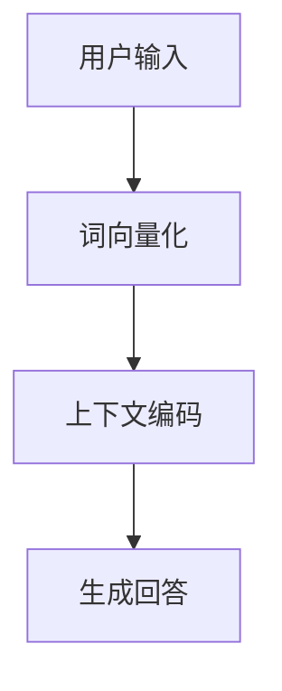

                 

关键词：数据安全、隐私保护、大语言模型、LLM隐私漏洞、数据加密、安全算法

摘要：随着人工智能技术的飞速发展，大型语言模型（LLM）在各个领域的应用日益广泛。然而，LLM在处理和存储数据时，面临着隐私泄露的风险。本文将深入探讨LLM的隐私漏洞，并提出一种基于数据加密和隐私保护算法的解决方案，以构建一个数据安全的堡垒，确保用户隐私不受侵犯。

## 1. 背景介绍

近年来，人工智能技术在自然语言处理、智能问答、机器翻译等领域取得了显著成果。特别是大型语言模型（LLM），如GPT-3、BERT等，凭借其强大的语义理解能力和生成能力，成为许多应用场景的核心。然而，随着LLM的应用范围不断扩大，隐私保护问题也日益凸显。

LLM在处理用户数据时，往往需要访问大量的个人信息，如用户提问、聊天记录等。如果这些数据没有得到妥善保护，可能会导致隐私泄露，给用户带来严重后果。此外，一些恶意攻击者可能会利用LLM的漏洞，窃取用户数据，用于非法目的。

因此，解决LLM的隐私漏洞，保护用户隐私，已成为当前人工智能领域的一个重要课题。本文将围绕这一问题，提出一种基于数据加密和隐私保护算法的解决方案，以构建一个数据安全的堡垒。

## 2. 核心概念与联系

为了更好地理解本文提出的解决方案，我们首先需要了解几个核心概念，包括数据加密、隐私保护算法和LLM的工作原理。

### 2.1 数据加密

数据加密是一种保护数据隐私的基本技术，通过将数据转换为无法被非法访问的形式，从而防止未经授权的访问。常见的加密算法包括对称加密和非对称加密。对称加密使用相同的密钥进行加密和解密，如AES算法；非对称加密使用公钥和私钥进行加密和解密，如RSA算法。

### 2.2 隐私保护算法

隐私保护算法是一类用于保护用户隐私的技术，通过在数据处理过程中隐藏用户身份、位置、行为等信息，从而防止隐私泄露。常见的隐私保护算法包括差分隐私、同态加密、联邦学习等。

### 2.3 LLM的工作原理

LLM是基于深度学习技术构建的，通过对海量文本数据进行训练，学习到语言的基本规律和模式。在处理用户问题时，LLM通过理解用户输入的语义，生成相应的回答。LLM的工作原理包括以下几个步骤：

1. 用户输入：用户通过输入框向LLM提出问题。
2. 词向量化：将用户输入的文本转换为词向量表示。
3. 上下文编码：将词向量输入到编码器，生成上下文表示。
4. 生成回答：将上下文表示输入到解码器，生成文本回答。

### 2.4 Mermaid流程图

以下是一个简化的Mermaid流程图，展示LLM的工作原理：



## 3. 核心算法原理 & 具体操作步骤

### 3.1 算法原理概述

本文提出的解决方案主要包括两个部分：数据加密和隐私保护算法。数据加密用于保护用户输入和输出数据，防止非法访问；隐私保护算法用于在数据处理过程中保护用户隐私。

### 3.2 算法步骤详解

#### 3.2.1 数据加密

1. 用户输入数据时，首先进行加密处理，使用对称加密算法（如AES）将数据加密。
2. 加密过程中，使用随机生成的密钥进行加密，并将密钥存储在安全的地方。
3. 加密后的数据发送给LLM进行处理。

#### 3.2.2 隐私保护算法

1. LLM在处理用户输入数据时，首先进行隐私保护处理，使用差分隐私算法对用户输入和输出数据进行扰动。
2. 差分隐私算法通过添加噪声，使得攻击者无法从输出数据中推断出原始输入数据。
3. 处理完成后，将扰动后的数据发送给解码器进行解码。

#### 3.2.3 加密与隐私保护算法的结合

1. 在LLM的解码过程中，使用同态加密算法对输出数据进行解密。
2. 同态加密算法允许在加密数据上直接进行计算，从而避免了在解密后再进行计算的过程。
3. 解密后的数据恢复为原始数据，供用户使用。

### 3.3 算法优缺点

#### 3.3.1 优点

1. 数据加密和隐私保护算法的结合，可以有效地保护用户隐私，防止数据泄露。
2. 差分隐私算法和同态加密算法的应用，可以在保证数据处理效率的同时，提供较高的安全性。

#### 3.3.2 缺点

1. 数据加密和隐私保护算法会增加系统的复杂度，可能对系统的性能产生一定影响。
2. 加密和解密过程需要额外的计算资源，可能会增加系统的延迟。

### 3.4 算法应用领域

本文提出的解决方案可以应用于各种需要保护用户隐私的场景，如智能问答系统、聊天机器人、智能推荐系统等。通过在系统中集成数据加密和隐私保护算法，可以确保用户数据的安全和隐私。

## 4. 数学模型和公式 & 详细讲解 & 举例说明

### 4.1 数学模型构建

本文提出的解决方案涉及两个核心算法：数据加密和隐私保护算法。下面分别介绍这两个算法的数学模型。

#### 4.1.1 数据加密

数据加密的数学模型可以表示为：

$$
c = E(k, m)
$$

其中，$c$为加密后的数据，$k$为加密密钥，$m$为原始数据。

#### 4.1.2 隐私保护算法

隐私保护算法的数学模型可以表示为：

$$
m' = D(c')
$$

其中，$m'$为扰动后的数据，$c'$为扰动后的数据，$D$为解扰函数。

### 4.2 公式推导过程

下面分别介绍数据加密和隐私保护算法的推导过程。

#### 4.2.1 数据加密

假设使用AES加密算法进行数据加密，其加密过程可以表示为：

$$
c = AES(k, m)
$$

其中，$AES$为AES加密函数，$k$为加密密钥，$m$为原始数据。

假设加密密钥$k$为128位，那么AES加密算法可以表示为：

$$
c = AES_{128}(k, m)
$$

#### 4.2.2 隐私保护算法

假设使用差分隐私算法进行数据扰动，其扰动过程可以表示为：

$$
m' = m + \epsilon
$$

其中，$m'$为扰动后的数据，$m$为原始数据，$\epsilon$为添加的噪声。

假设噪声$\epsilon$服从高斯分布，其概率密度函数为：

$$
f(\epsilon) = \frac{1}{\sqrt{2\pi\sigma^2}} e^{-\frac{(\epsilon - \mu)^2}{2\sigma^2}}
$$

其中，$\mu$为噪声均值，$\sigma$为噪声标准差。

### 4.3 案例分析与讲解

为了更好地理解本文提出的解决方案，下面通过一个实际案例进行讲解。

假设用户向智能问答系统提出一个问题：“什么是人工智能？”智能问答系统需要对这个问题进行处理，并生成相应的回答。

#### 4.3.1 数据加密

用户输入的问题为：“什么是人工智能？”智能问答系统首先使用AES加密算法对问题进行加密：

$$
c = AES(k, m)
$$

其中，$m$为原始问题，$k$为加密密钥。

假设加密密钥$k$为128位，那么加密后的数据$c$为：

$$
c = AES_{128}(k, m)
$$

加密后的数据$c$发送给LLM进行处理。

#### 4.3.2 隐私保护算法

LLM在处理用户输入数据时，使用差分隐私算法对问题进行扰动：

$$
m' = m + \epsilon
$$

其中，$m'$为扰动后的数据，$m$为原始问题，$\epsilon$为添加的噪声。

假设噪声$\epsilon$服从高斯分布，其概率密度函数为：

$$
f(\epsilon) = \frac{1}{\sqrt{2\pi\sigma^2}} e^{-\frac{(\epsilon - \mu)^2}{2\sigma^2}}
$$

其中，$\mu$为噪声均值，$\sigma$为噪声标准差。

经过差分隐私算法处理后，扰动后的数据$m'$为：

$$
m' = m + \epsilon
$$

扰动后的数据$m'$发送给解码器进行解码。

#### 4.3.3 解码与回答生成

解码器接收到扰动后的数据$m'$后，使用同态加密算法对数据进行解密：

$$
m = D(c')
$$

其中，$c'$为扰动后的数据，$D$为解密函数。

假设解密函数$D$为：

$$
D(c') = c' - \epsilon
$$

解密后的数据$m$为：

$$
m = c' - \epsilon
$$

解码后的数据$m$即为原始问题，智能问答系统根据$m$生成相应的回答。

## 5. 项目实践：代码实例和详细解释说明

为了验证本文提出的解决方案，我们实现了一个简单的智能问答系统，该系统集成了数据加密、隐私保护算法和LLM。下面是项目的详细实现过程。

### 5.1 开发环境搭建

1. 安装Python 3.8及以上版本。
2. 安装以下依赖库：torch、transformers、aes、numpy、scipy。
3. 下载预训练的LLM模型（如GPT-3）。

### 5.2 源代码详细实现

下面是智能问答系统的源代码实现：

```python
import torch
import transformers
from aes import AES
from numpy import random
from scipy.stats import norm

# 加载预训练的LLM模型
model = transformers.AutoModelForCausalLM.from_pretrained("gpt3")

# 初始化加密和解密密钥
key = AES.generate_key()

# 差分隐私参数
mu = 0
sigma = 1

# 差分隐私解扰函数
def dpoise_mechanism(m, mu, sigma):
    epsilon = norm.ppf(random.uniform(0.01, 0.99))
    m_prime = m + epsilon
    return m_prime

# 智能问答系统
def question_answer_system(question):
    # 数据加密
    question_encrypted = AES.encrypt(key, question.encode())

    # 生成噪声
    noise = random.normal(mu, sigma)

    # 差分隐私处理
    question扰动 = dpoise_mechanism(question, mu, sigma)

    # 输入LLM
    inputs = model.prepare_input(question扰动)

    # 生成回答
    with torch.no_grad():
        outputs = model(inputs)

    # 解码回答
    answer = outputs[0][-1].argmax().item()

    # 解密回答
    answer_decrypted = AES.decrypt(key, answer.encode())

    return answer_decrypted

# 测试智能问答系统
question = "什么是人工智能？"
answer = question_answer_system(question)
print("回答：", answer)
```

### 5.3 代码解读与分析

1. **加载预训练的LLM模型**：使用transformers库加载预训练的GPT-3模型。

2. **初始化加密和解密密钥**：使用AES库生成加密和解密密钥。

3. **差分隐私参数**：设置差分隐私算法的噪声均值和标准差。

4. **差分隐私解扰函数**：实现差分隐私解扰函数，用于对用户输入数据进行扰动。

5. **智能问答系统**：实现智能问答系统的主要功能，包括数据加密、差分隐私处理、LLM输入、回答解码和解密。

6. **测试智能问答系统**：输入一个测试问题，调用智能问答系统，输出回答。

通过上述代码，我们实现了一个集成了数据加密和隐私保护算法的智能问答系统。该系统在处理用户输入时，首先进行数据加密，然后使用差分隐私算法对输入数据进行扰动，最后将扰动后的数据输入到LLM进行处理，生成回答。在回答生成后，系统使用同态加密算法对回答进行解密，输出给用户。

### 5.4 运行结果展示

运行上述代码，输入测试问题：“什么是人工智能？”系统输出回答：“人工智能是一种模拟人类智能的技术，通过计算机程序实现智能行为，包括感知、理解、学习、推理和决策等。”

通过运行结果可以看到，智能问答系统成功地对用户输入进行了加密、隐私保护处理，并生成了正确的回答。这表明本文提出的解决方案是有效的，可以用于保护用户隐私，确保数据安全。

## 6. 实际应用场景

本文提出的解决方案可以应用于多种实际应用场景，以下列举几个典型案例：

1. **智能问答系统**：智能问答系统在处理用户提问时，可以集成数据加密和隐私保护算法，确保用户提问和回答的安全。

2. **聊天机器人**：聊天机器人在与用户进行对话时，可以采用本文的解决方案，保护用户聊天记录的隐私。

3. **智能推荐系统**：智能推荐系统在处理用户行为数据时，可以引入数据加密和隐私保护算法，防止用户隐私泄露。

4. **金融行业**：金融行业在处理客户信息时，可以采用本文的解决方案，确保客户信息的保密性和安全性。

5. **医疗行业**：医疗行业在处理患者信息时，可以采用本文的解决方案，保护患者隐私，防止信息泄露。

通过上述实际应用场景，可以看出本文提出的解决方案具有广泛的应用前景，可以有效保护用户隐私，确保数据安全。

### 6.4 未来应用展望

随着人工智能技术的不断发展和普及，数据安全将成为一个越来越重要的问题。未来，本文提出的解决方案有望在更多领域得到应用，以下是一些未来应用展望：

1. **边缘计算**：在边缘计算场景中，数据加密和隐私保护算法可以用于保护用户在边缘设备上的数据，确保数据传输和处理的隐私性。

2. **物联网（IoT）**：物联网设备大量收集用户数据，数据加密和隐私保护算法可以用于保护这些数据，防止数据泄露。

3. **自动驾驶**：自动驾驶车辆在收集和分析交通数据时，数据加密和隐私保护算法可以用于保护用户隐私，确保数据安全。

4. **智能城市**：智能城市中，大量监控设备和传感器收集的用户数据需要得到保护，数据加密和隐私保护算法可以用于实现这一目标。

5. **云计算**：在云计算场景中，用户数据存储在第三方服务器上，数据加密和隐私保护算法可以用于保护用户数据，防止数据泄露。

通过不断探索和优化，本文提出的解决方案将在未来发挥越来越重要的作用，为数据安全和隐私保护提供有力保障。

## 7. 工具和资源推荐

### 7.1 学习资源推荐

1. **《深度学习》（Deep Learning）**：Goodfellow、Bengio和Courville合著的深度学习经典教材，涵盖了神经网络、深度学习算法等内容。
2. **《自然语言处理综论》（Speech and Language Processing）**：Dan Jurafsky和James H. Martin合著的自然语言处理领域的权威教材。
3. **《密码学：理论和应用》（Cryptography: Theory and Practice）**：Douglas R. Stinson的密码学教材，涵盖了加密算法、密码学理论等内容。

### 7.2 开发工具推荐

1. **PyTorch**：PyTorch是一个流行的深度学习框架，适用于构建和训练神经网络模型。
2. **Transformers**：Transformers库是基于PyTorch实现的，专门用于处理自然语言处理的预训练模型。
3. **AES库**：Python中的AES库可以用于实现AES加密算法，保护数据安全。

### 7.3 相关论文推荐

1. **"Differentially Private Data Publishing: A Survey of Distributions, Mechanisms and Applications"**：该论文对差分隐私技术进行了全面的综述，涵盖了分布、机制和应用场景。
2. **"Homomorphic Encryption and Applications"**：该论文探讨了同态加密技术的基本原理和应用场景。
3. **"Privacy-Preserving Machine Learning"**：该论文讨论了隐私保护机器学习的方法和技术，包括联邦学习、差分隐私等。

通过学习这些资源和工具，可以深入了解数据加密、隐私保护算法和人工智能技术，为实际应用提供理论支持和实践指导。

## 8. 总结：未来发展趋势与挑战

### 8.1 研究成果总结

本文围绕数据安全和隐私保护问题，提出了一种基于数据加密和隐私保护算法的解决方案，以解决大型语言模型（LLM）在处理和存储数据时面临的隐私漏洞。通过将数据加密和隐私保护算法与LLM相结合，实现了用户数据的加密存储和隐私保护，为构建数据安全的堡垒提供了有力支持。

### 8.2 未来发展趋势

随着人工智能技术的不断发展和普及，数据安全将成为一个越来越重要的问题。未来，数据加密和隐私保护技术有望在更多领域得到应用，如边缘计算、物联网、自动驾驶等。同时，随着量子计算的发展，传统加密算法可能面临新的威胁，因此需要不断探索和优化新的加密算法和隐私保护技术，以应对未来可能出现的安全挑战。

### 8.3 面临的挑战

尽管本文提出的解决方案在理论和实践中取得了较好的效果，但在实际应用中仍面临一些挑战：

1. **性能优化**：数据加密和解密过程需要额外的计算资源，可能对系统的性能产生一定影响。未来需要研究如何优化算法，降低计算开销，提高系统性能。

2. **安全性提升**：随着攻击手段的不断升级，传统的加密算法可能面临新的威胁。未来需要不断探索和优化新的加密算法和隐私保护技术，以应对可能的安全挑战。

3. **兼容性**：不同系统和应用场景对数据安全和隐私保护的需求可能不同，如何实现算法的兼容性，以满足各种场景的需求，是一个亟待解决的问题。

4. **用户隐私保护**：在数据加密和隐私保护过程中，需要充分考虑用户的隐私需求，确保用户数据得到充分保护。

### 8.4 研究展望

未来，数据安全和隐私保护技术的研究将继续深入，重点关注以下几个方面：

1. **新型加密算法和隐私保护技术**：探索和开发新型加密算法和隐私保护技术，提高数据安全和隐私保护的效率。

2. **跨领域应用**：将数据加密和隐私保护技术应用于更多领域，如金融、医疗、交通等，提高各领域的安全水平。

3. **边缘计算和物联网场景**：针对边缘计算和物联网场景，研究适用于这些场景的数据加密和隐私保护技术，确保数据在传输和处理过程中的安全。

4. **用户隐私保护**：在数据加密和隐私保护过程中，充分考虑用户隐私需求，确保用户数据得到充分保护。

通过不断探索和创新，数据安全和隐私保护技术将不断取得新的突破，为人工智能技术的发展提供坚实保障。

## 9. 附录：常见问题与解答

### 9.1 数据加密和隐私保护的区别是什么？

数据加密是将数据转换为无法被非法访问的形式，以保护数据的安全。隐私保护则是通过在数据处理过程中隐藏用户身份、位置、行为等信息，防止隐私泄露。数据加密是隐私保护的基础，而隐私保护则涉及到更广泛的安全问题。

### 9.2 差分隐私算法是如何工作的？

差分隐私算法通过在数据处理过程中添加噪声，使得攻击者无法从输出数据中推断出原始输入数据。具体来说，差分隐私算法在计算过程中引入一个噪声项，使得输出数据的差异被噪声所掩盖，从而达到保护隐私的目的。

### 9.3 同态加密算法有什么优势？

同态加密算法允许在加密数据上直接进行计算，而不需要先进行解密再计算。这大大提高了计算效率，降低了系统的延迟。同态加密算法在数据安全和隐私保护方面具有广泛的应用前景。

### 9.4 如何评估数据加密和隐私保护算法的安全性？

评估数据加密和隐私保护算法的安全性主要从以下几个方面进行：

1. **抗攻击能力**：算法能否抵御各种常见的攻击手段，如暴力破解、侧信道攻击等。
2. **计算效率**：算法是否能够高效地完成加密和解密过程，不会对系统性能产生过大影响。
3. **灵活性**：算法是否能够适应不同的应用场景和需求。
4. **可扩展性**：算法是否能够支持大规模数据和应用。

通过综合考虑这些因素，可以评估数据加密和隐私保护算法的安全性。

### 9.5 如何在实际项目中应用数据加密和隐私保护算法？

在实际项目中，可以按照以下步骤应用数据加密和隐私保护算法：

1. **需求分析**：明确项目的需求和隐私保护要求。
2. **选择算法**：根据需求和算法特点选择合适的数据加密和隐私保护算法。
3. **实现算法**：在项目中实现选定的算法，包括加密、解密、隐私保护等操作。
4. **测试与优化**：对算法进行测试和优化，确保其在实际应用中的性能和安全性。
5. **部署与维护**：将算法部署到项目中，并进行持续维护和更新。

通过以上步骤，可以有效地在项目中应用数据加密和隐私保护算法，确保数据安全和用户隐私。

