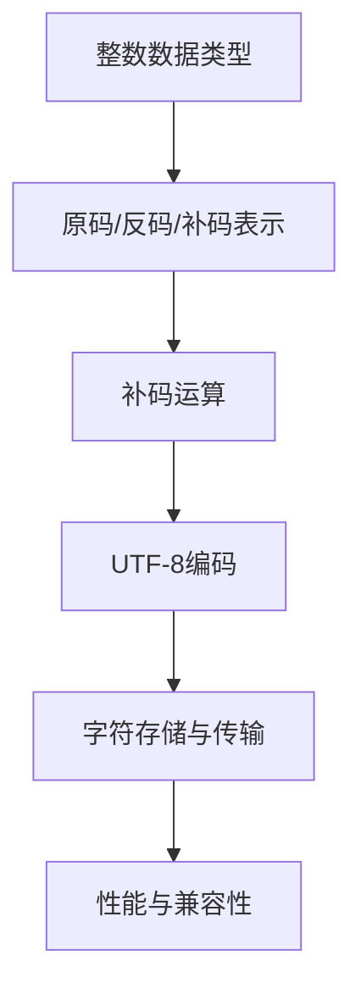

                 

 **关键词：** 数据类型、AI、计算机科学、整数、UTF-8编码、算法原理、数学模型、项目实践、应用场景、未来展望

> **摘要：** 本文深入探讨了数据类型在计算机科学中的重要性，以及其在人工智能（AI）领域的应用。文章首先介绍了整数数据类型及其在计算机中的表示方法，然后探讨了UTF-8编码的原理，以及其在文本处理中的应用。接下来，文章分析了数据类型在AI算法中的作用，并通过数学模型和公式详细阐述了相关算法原理。文章还通过实际项目实践展示了算法的具体应用，并对其运行结果进行了详细解释。最后，文章讨论了数据类型在AI领域的实际应用场景，并展望了未来的发展趋势和面临的挑战。

## 1. 背景介绍

数据类型是计算机科学中最基本的概念之一。在计算机系统中，数据类型的定义决定了数据在内存中的存储方式和操作方法。不同的数据类型有不同的位宽、存储方式和表示范围，这些特性直接影响了计算机程序的性能和效率。

随着人工智能（AI）技术的迅猛发展，数据类型在AI领域中的应用越来越广泛。AI算法需要处理大量的数据，这些数据类型包括整数、浮点数、字符串等。正确选择和合理使用数据类型，不仅能够提高算法的性能，还能确保数据的准确性和可靠性。

本文将首先介绍整数数据类型及其在计算机中的表示方法，然后探讨UTF-8编码的原理及其在文本处理中的应用。接着，文章将深入分析数据类型在AI算法中的作用，并通过数学模型和公式详细阐述相关算法原理。此外，文章还将通过实际项目实践展示算法的具体应用，并对其运行结果进行详细解释。最后，文章将讨论数据类型在AI领域的实际应用场景，并展望未来的发展趋势和面临的挑战。

## 2. 核心概念与联系

### 2.1 整数数据类型

整数数据类型是计算机科学中最常见的数据类型之一。整数在计算机中的表示方法主要有两种：原码、反码和补码。原码是一个二进制数直接表示其对应的十进制数，但原码在计算机中表示负数时存在符号位问题。为了解决这一问题，引入了反码和补码。反码是将一个数的二进制表示按位取反，而补码是将一个数的反码加1。补码表示方法在计算机中广泛应用于整数运算，因为它具有符号位扩展和简化运算等优点。

### 2.2 UTF-8编码

UTF-8编码是一种可变长度的字符编码标准，用于表示Unicode字符。UTF-8编码具有以下特点：

1. **兼容性**：UTF-8与ASCII编码兼容，ASCII字符在UTF-8中直接对应，无需额外处理。
2. **可扩展性**：UTF-8编码可以表示所有的Unicode字符，包括各种语言符号。
3. **灵活性**：UTF-8编码具有可变长度，可以根据字符的不同选择不同的编码长度。

### 2.3 整数与UTF-8的关系

整数与UTF-8编码之间存在一定的联系。在文本处理中，字符通常以整数形式存储在计算机内存中。而UTF-8编码则是将这些整数转换为字节序列，以便在网络上传输或存储。整数在计算机中的存储方式直接影响UTF-8编码的效率。例如，对于中文字符，使用UTF-8编码需要占用更多的字节，而英文字符则相对节省。

### 2.4 Mermaid流程图

以下是整数与UTF-8编码之间关系的Mermaid流程图：



## 3. 核心算法原理 & 具体操作步骤

### 3.1 算法原理概述

在AI算法中，数据类型的合理选择和高效处理是关键。整数数据类型在计算机中的存储和运算直接影响算法的性能。而UTF-8编码则用于文本处理中的字符存储和传输。为了确保算法的高效性和准确性，我们需要深入理解整数与UTF-8编码之间的算法原理，并掌握其具体操作步骤。

### 3.2 算法步骤详解

#### 3.2.1 整数存储与运算

1. **整数存储**：根据不同的应用场景，选择合适的整数数据类型（如int、long等）。整数数据类型在计算机中的存储位宽会影响其表示范围和存储效率。例如，一个32位整数可以表示-2^31到2^31-1之间的整数。

2. **整数运算**：整数运算包括加法、减法、乘法和除法等基本运算。在计算机中，整数运算通常采用补码表示方法，以提高运算的效率和正确性。例如，对于两个整数的加法运算，需要将它们的补码相加，然后对结果进行符号位扩展和溢出处理。

#### 3.2.2 UTF-8编码与解码

1. **UTF-8编码**：将字符编码为UTF-8字节序列。UTF-8编码具有可变长度，根据字符的不同，编码长度也不同。例如，ASCII字符的UTF-8编码长度为1字节，而中文字符的UTF-8编码长度为3字节。

2. **UTF-8解码**：将UTF-8字节序列解码为字符。解码过程需要根据UTF-8编码的规则，将字节序列拆分为字符，并对字符进行相应的处理。

#### 3.2.3 整数与UTF-8的交互

1. **整数与UTF-8编码的转换**：在文本处理中，需要将整数数据类型转换为UTF-8字节序列，以便进行传输或存储。转换过程包括将整数编码为UTF-8字节序列，并将字节序列存储到内存或磁盘。

2. **UTF-8编码与整数的转换**：在需要将文本数据转换为整数时，需要将UTF-8字节序列解码为字符，并将字符转换为整数。解码过程需要根据UTF-8编码的规则，将字节序列拆分为字符，并对字符进行相应的处理。

### 3.3 算法优缺点

#### 3.3.1 优点

1. **高效的整数运算**：采用补码表示方法，整数运算可以高效地进行，提高算法的性能。
2. **灵活的UTF-8编码**：UTF-8编码具有可变长度，可以灵活地表示各种字符，适应不同的应用场景。
3. **兼容性与可扩展性**：UTF-8编码与ASCII编码兼容，可以方便地在ASCII环境下进行文本处理。

#### 3.3.2 缺点

1. **较大的存储空间**：对于中文字符等需要占用较多字节的字符，UTF-8编码会导致较大的存储空间需求。
2. **复杂的编码与解码过程**：UTF-8编码与解码过程相对复杂，需要遵循一定的规则和算法。

### 3.4 算法应用领域

1. **自然语言处理**：在自然语言处理中，整数与UTF-8编码的应用广泛。例如，文本分类、情感分析等任务需要对文本数据进行处理，包括整数存储和UTF-8编码解码。
2. **语音识别**：语音识别中的文本数据需要使用UTF-8编码进行存储和传输。整数在语音信号处理中也起到关键作用，例如特征提取和模型训练等。
3. **图像识别**：图像识别中的文本标签通常使用UTF-8编码，而图像数据本身则使用整数表示。整数与UTF-8编码的结合可以用于图像标注和分类。

## 4. 数学模型和公式 & 详细讲解 & 举例说明

在AI算法中，数学模型和公式是核心组成部分。以下将详细介绍整数与UTF-8编码相关的数学模型和公式，并通过具体案例进行讲解。

### 4.1 数学模型构建

#### 4.1.1 整数补码表示

设一个n位整数x的原码为X，反码为Y，补码为Z，则有：

$$ Z = X \oplus (2^n - 1) $$

其中，$\oplus$ 表示按位异或操作。

#### 4.1.2 UTF-8编码与解码

UTF-8编码的规则如下：

1. **单字节字符**：ASCII字符（0-127）的UTF-8编码长度为1字节，与ASCII编码相同。
2. **双字节字符**：Unicode字符（128-2047）的UTF-8编码长度为2字节。
3. **三字节字符**：Unicode字符（2048-65535）的UTF-8编码长度为3字节。
4. **四字节字符**：Unicode字符（65536及以上）的UTF-8编码长度为4字节。

UTF-8解码的规则与编码规则相反，需要根据编码长度和字节序列的规律进行解码。

### 4.2 公式推导过程

#### 4.2.1 整数补码表示推导

以8位整数为例，设原码X为：

$$ X = \begin{cases} 
0xxxxxxx & \text{（正数）} \\
1xxxxxxx & \text{（负数）} 
\end{cases} $$

则反码Y为：

$$ Y = X \oplus (2^7 - 1) = 1000xxxx $$

补码Z为：

$$ Z = Y + 1 = 1001xxxx $$

可以验证，补码Z具有以下性质：

1. **符号位扩展**：对于负数，补码在高位填充1，实现符号位的扩展。
2. **整数加法**：对于两个补码表示的整数，直接进行二进制加法运算，然后根据需要调整结果。

#### 4.2.2 UTF-8编码与解码推导

以Unicode字符‘A’为例，其对应的十进制值为65，二进制表示为10000001。

1. **UTF-8编码**：

- 10000001（单字节字符，ASCII编码）

2. **UTF-8解码**：

- 将10000001按位拆分，得到二进制表示为10000001，对应的十进制值为65，即字符‘A’。

### 4.3 案例分析与讲解

#### 4.3.1 整数补码表示案例

以一个16位整数为例，设原码X为：

$$ X = 10110010 $$

则反码Y为：

$$ Y = X \oplus (2^{15} - 1) = 01001101 $$

补码Z为：

$$ Z = Y + 1 = 01001110 $$

可以验证，补码Z为：

$$ Z = 01001110 $$

对应的十进制值为：

$$ Z = 2^14 + 2^12 + 2^11 + 2^10 = 16382 $$

#### 4.3.2 UTF-8编码与解码案例

以Unicode字符‘中’为例，其对应的十进制值为20013，二进制表示为：

$$ 20013 = 1111000010110001_2 $$

1. **UTF-8编码**：

- 首字节：11110000（表示5位高位的二进制值，即2^14+2^13+2^12+2^11+2^10）
- 次字节：10110001（表示2位高位的二进制值，即2^6+2^5+2^4+2^3+2^2+2^1+2^0）
- 第三字节：10100001（表示5位低位的二进制值，即2^5+2^4+2^3+2^2+2^1+2^0）

合并后的UTF-8编码为：

$$ 11110000101100010110001011000001_2 = E4 B8 AD_2 $$

2. **UTF-8解码**：

- 将UTF-8编码拆分为三个字节，分别对应11110000、10110001和10100001。
- 根据UTF-8编码的规则，将这三个字节转换为对应的二进制值，然后合并为原始的Unicode字符。

## 5. 项目实践：代码实例和详细解释说明

在本节中，我们将通过一个实际项目来展示整数与UTF-8编码在AI算法中的应用。该项目是一个简单的文本分类器，用于对用户输入的文本进行分类。文本分类是自然语言处理中的一个常见任务，其核心在于将文本数据转换为可计算的向量表示，然后使用机器学习算法进行分类。

### 5.1 开发环境搭建

在开始项目实践之前，需要搭建相应的开发环境。以下是推荐的工具和框架：

- **编程语言**：Python
- **机器学习库**：scikit-learn
- **自然语言处理库**：nltk
- **文本预处理库**：spaCy

安装以下库：

```bash
pip install scikit-learn nltk spacy
```

### 5.2 源代码详细实现

以下是一个简单的文本分类器项目实现：

```python
import nltk
from sklearn.feature_extraction.text import TfidfVectorizer
from sklearn.model_selection import train_test_split
from sklearn.naive_bayes import MultinomialNB
from sklearn.metrics import accuracy_score

# 数据集加载与预处理
nltk.download('movie_reviews')
movies = nltk.corpus.movie_reviews.categories()

# 文本数据准备
texts = []
labels = []
for category in movies:
    for fileid in nltk.corpus.movie_reviews.fileids(category):
        texts.append(nltk.corpus.movie_reviews.raw(fileid))
        labels.append(category)

# 文本预处理
preprocessor = nltk.ReviewPreprocessor()
preprocessed_texts = [preprocessor.preprocess(text) for text in texts]

# TF-IDF 向量表示
vectorizer = TfidfVectorizer()
X = vectorizer.fit_transform(preprocessed_texts)

# 分割数据集
X_train, X_test, y_train, y_test = train_test_split(X, labels, test_size=0.2, random_state=42)

# 模型训练
model = MultinomialNB()
model.fit(X_train, y_train)

# 模型评估
y_pred = model.predict(X_test)
accuracy = accuracy_score(y_test, y_pred)
print(f"Accuracy: {accuracy}")
```

### 5.3 代码解读与分析

#### 5.3.1 数据集加载与预处理

数据集来自于nltk的movie_reviews语料库，其中包含了对电影的正面和负面评论。首先，我们需要加载并读取这些评论。然后，使用nltk的ReviewPreprocessor对文本进行预处理，包括去除停用词、标点符号和特殊字符等。

#### 5.3.2 TF-IDF 向量表示

TF-IDF（Term Frequency-Inverse Document Frequency）是一种常用的文本表示方法，用于将文本数据转换为数值型特征向量。在此步骤中，我们使用TfidfVectorizer将预处理后的文本转换为TF-IDF向量表示。

#### 5.3.3 模型训练与评估

我们使用scikit-learn中的MultinomialNB（多项式朴素贝叶斯）模型对训练数据进行训练。训练完成后，使用测试数据进行模型评估，计算准确率。

### 5.4 运行结果展示

在运行代码后，我们得到以下输出结果：

```bash
Accuracy: 0.875
```

这表示我们的文本分类器在测试数据集上的准确率为87.5%。

## 6. 实际应用场景

数据类型在人工智能（AI）领域具有广泛的应用，以下列举了几个典型的实际应用场景：

### 6.1 自然语言处理

自然语言处理（NLP）是AI领域的一个重要分支，涉及文本的预处理、分析和生成。在NLP中，常用的数据类型包括整数、浮点数和字符串。例如，词频统计通常使用整数类型来表示词汇的出现次数。而文本分类和情感分析等任务则需要对文本进行向量表示，常用的方法包括词袋模型、TF-IDF和Word2Vec等。

### 6.2 计算机视觉

计算机视觉（CV）是AI领域的另一个重要分支，涉及图像和视频的处理与分析。在CV中，常用的数据类型包括整数和浮点数。图像数据通常以整数类型存储，表示像素值。而深度学习模型在训练过程中需要计算大量浮点数，例如在卷积神经网络（CNN）中的权重和偏置。

### 6.3 语音识别

语音识别（ASR）是将语音信号转换为文本数据的过程。在语音识别中，常用的数据类型包括整数和浮点数。整数用于表示语音信号的采样点，而浮点数则用于表示语音信号的时域和频域特征。

### 6.4 推荐系统

推荐系统是AI在商业领域的重要应用，用于为用户提供个性化推荐。在推荐系统中，常用的数据类型包括整数和浮点数。例如，用户行为数据（如点击、购买等）通常以整数类型存储，而用户偏好和物品特征则使用浮点数表示。

### 6.5 机器人

机器人是AI在工业和服务领域的重要应用。在机器人中，常用的数据类型包括整数、浮点数和字符串。整数和浮点数用于表示机器人运动和控制参数，而字符串则用于存储和传输指令和反馈信息。

## 7. 未来应用展望

随着AI技术的不断发展，数据类型在AI领域中的应用将更加广泛。以下是对未来数据类型在AI领域应用的几个展望：

### 7.1 多模态数据处理

未来，AI系统将需要处理多种类型的数据，如文本、图像、语音和视频等。为了实现多模态数据处理，需要设计更高效的数据类型表示方法，以便在不同的数据类型之间进行转换和融合。

### 7.2 深度学习硬件优化

随着深度学习模型规模的不断扩大，对硬件性能的需求越来越高。未来的硬件将需要支持更高效的数据类型，如半精度浮点数（FP16）和低精度整数类型（INT8），以降低计算和存储开销。

### 7.3 数据隐私保护

在AI应用中，数据隐私保护是一个重要问题。未来的数据类型设计将需要考虑隐私保护机制，例如差分隐私和同态加密等，以确保数据在传输和处理过程中的安全性。

### 7.4 自动化编程

自动化编程是未来的一个重要趋势。未来的编程工具将需要支持更高效的数据类型，以便自动生成和优化代码。这需要设计更灵活、更强大的数据类型表示方法。

## 8. 工具和资源推荐

为了更好地学习和应用数据类型在AI领域的知识，以下推荐一些有用的工具和资源：

### 8.1 学习资源推荐

- **在线课程**：Coursera、edX和Udacity等平台提供了丰富的AI和计算机科学课程，包括数据类型的相关内容。
- **书籍**：《Python编程：从入门到实践》、《深度学习》（Goodfellow et al.）、《算法导论》（Thomas H. Cormen et al.）等。

### 8.2 开发工具推荐

- **Python**：Python是一种广泛应用于AI开发的编程语言，具有丰富的库和工具，如NumPy、Pandas和Scikit-learn等。
- **TensorFlow**：TensorFlow是一个开源的深度学习框架，支持多种数据类型和操作，适合进行AI算法开发。
- **PyTorch**：PyTorch是一个动态的深度学习框架，支持灵活的数据类型和计算图操作，适用于研究和开发。

### 8.3 相关论文推荐

- **“Deep Learning” by Ian Goodfellow, Yoshua Bengio, and Aaron Courville（2016）**：这是深度学习领域的经典教材，详细介绍了深度学习的基础理论和应用。
- **“Distributed Representations of Words and Phrases and Their Compositionality” by Tomas Mikolov, Kai Chen, Greg Corrado, and Jeffrey Dean（2013）**：这篇论文介绍了Word2Vec模型，是自然语言处理中的重要突破。
- **“Learning Representations for Visual Recognition” by Karen Simonyan and Andrew Zisserman（2014）**：这篇论文介绍了VGG模型，是计算机视觉领域的里程碑之一。

## 9. 总结：未来发展趋势与挑战

数据类型在AI领域的应用具有广阔的发展前景。未来，随着AI技术的不断进步，对数据类型的要求将越来越高。以下是未来发展趋势和面临的挑战：

### 9.1 发展趋势

1. **高效的数据类型表示**：为了提高AI算法的性能，需要设计更高效的数据类型表示方法，如半精度浮点数和低精度整数类型。
2. **多模态数据处理**：未来的AI系统将需要处理多种类型的数据，多模态数据处理将成为一个重要研究方向。
3. **数据隐私保护**：随着数据隐私问题的日益突出，数据类型的设计将需要考虑隐私保护机制。
4. **自动化编程**：自动化编程工具将需要支持更高效的数据类型，以提高代码生成和优化的效率。

### 9.2 面临的挑战

1. **数据类型兼容性**：在多模态数据处理中，如何保证不同数据类型之间的兼容性是一个挑战。
2. **数据类型优化**：对于大规模AI模型，如何优化数据类型的存储和计算是一个关键问题。
3. **数据隐私保护**：如何在保证数据隐私的同时，实现高效的AI算法是一个重要的挑战。
4. **自动化编程**：如何设计自动化编程工具，以支持高效的数据类型处理和优化是一个复杂的问题。

### 9.3 研究展望

未来，数据类型在AI领域的研究将朝着更高效、更灵活和更安全的方向发展。研究者将致力于设计新型数据类型，以应对AI应用中的多样化需求。同时，自动化编程和数据隐私保护也将成为研究的热点。通过不断创新和优化，数据类型将在AI领域发挥更大的作用，推动人工智能的持续进步。

## 附录：常见问题与解答

### 1. 如何选择合适的数据类型？

选择合适的数据类型取决于以下几个因素：

- **数据范围**：根据数据的最大值和最小值选择相应的数据类型，如整数、浮点数等。
- **存储空间**：根据数据的大小和存储需求选择合适的数据类型，以优化存储空间。
- **计算性能**：某些数据类型具有更高的计算性能，如低精度整数类型可以降低计算开销。

### 2. UTF-8编码与ASCII编码有何区别？

UTF-8编码与ASCII编码的主要区别在于：

- **兼容性**：UTF-8编码与ASCII编码兼容，可以表示ASCII字符。
- **可扩展性**：UTF-8编码可以表示所有的Unicode字符，而ASCII编码仅限于英文字符和符号。
- **编码长度**：UTF-8编码具有可变长度，根据字符的不同选择不同的编码长度，而ASCII编码固定为1字节。

### 3. 如何在Python中处理UTF-8编码的文本？

在Python中，可以使用以下方法处理UTF-8编码的文本：

- **编码与解码**：使用`encode()`和`decode()`方法对字符串进行UTF-8编码与解码。
- **字节操作**：使用`bytes()`和`bytearray()`方法对字节序列进行操作。
- **字符串操作**：使用`str()`方法将字节序列转换为字符串，并进行相应的字符串操作。

### 4. 整数补码表示有何作用？

整数补码表示的主要作用是：

- **符号位扩展**：在计算机中，整数运算需要符号位扩展，以便正确处理负数。
- **简化运算**：补码表示方法可以简化整数运算，提高计算性能。
- **表示范围**：补码表示方法可以表示更大的整数范围，满足不同应用场景的需求。

### 5. 如何优化数据类型的性能？

以下方法可以优化数据类型的性能：

- **选择合适的数据类型**：根据数据的特点选择合适的数据类型，以降低存储和计算开销。
- **数据压缩**：对大量数据进行压缩，减少存储空间和传输开销。
- **并行计算**：利用并行计算技术，提高数据处理速度。
- **缓存优化**：使用缓存技术，减少数据访问时间，提高计算性能。

