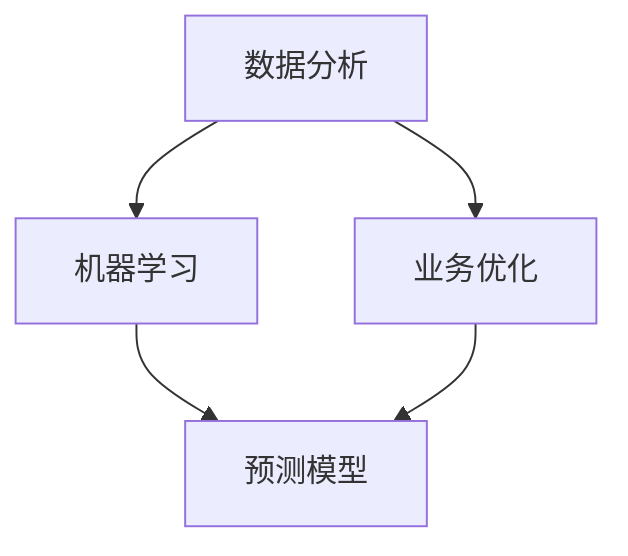

                 

关键词：数据驱动决策、现代管理者、数据分析、机器学习、业务优化

> 摘要：本文将探讨数据驱动决策的重要性，以及如何运用数据分析、机器学习和业务优化等现代技术手段，帮助管理者做出更加精准、高效和可持续的业务决策。通过具体案例和实践经验，本文将为现代管理者提供一套完整的决策方法论和工具集，以应对日益复杂的市场环境。

## 1. 背景介绍

在过去的几十年里，信息技术的发展带来了海量的数据，这些数据不仅改变了我们的生活方式，也深刻影响了企业的运营和管理。现代企业面临着激烈的市场竞争和快速变化的环境，传统的管理方法已经无法满足需求。数据驱动决策应运而生，它强调通过数据分析和机器学习等技术手段，提取数据中的有价值信息，从而指导业务决策。

### 1.1 数据驱动决策的定义

数据驱动决策（Data-Driven Decision Making）是一种以数据为基础，通过分析数据来指导决策的方法。与基于经验和直觉的传统决策方法不同，数据驱动决策更加科学和客观，能够帮助企业更好地应对不确定性，提高决策效率和效果。

### 1.2 数据驱动决策的重要性

- **提升决策准确性**：通过数据分析和预测模型，管理者可以更准确地评估不同决策方案的结果，从而做出更加明智的选择。
- **提高决策效率**：自动化和优化的数据驱动决策流程可以大大减少人工处理时间和错误，提高决策效率。
- **增强业务灵活性**：数据驱动决策使企业能够快速响应市场变化，调整战略和战术，保持竞争优势。
- **支持可持续发展**：通过分析历史数据和趋势，企业可以制定更加可持续和长期的业务计划。

## 2. 核心概念与联系

### 2.1 数据分析

数据分析（Data Analysis）是数据驱动决策的基础。它涉及从原始数据中提取信息，进行整理、分析和可视化，以支持决策。

### 2.2 机器学习

机器学习（Machine Learning）是一种利用算法从数据中学习模式和规律的技术，它能够自动化数据分析和预测任务。

### 2.3 业务优化

业务优化（Business Optimization）是指通过改进流程、策略和技术手段，提高企业的运营效率和业务成果。

### 2.4 Mermaid 流程图

以下是一个简单的 Mermaid 流程图，展示了数据驱动决策的核心概念和联系：



## 3. 核心算法原理 & 具体操作步骤

### 3.1 算法原理概述

数据驱动决策的核心算法包括数据分析、机器学习和业务优化算法。以下将分别介绍这些算法的基本原理。

#### 3.1.1 数据分析算法

数据分析算法主要包括数据清洗、数据转换、数据聚合等步骤。其核心目标是提取数据的潜在价值，为后续分析提供基础。

#### 3.1.2 机器学习算法

机器学习算法包括监督学习、无监督学习和强化学习等类型。监督学习算法通过已有数据训练模型，预测新数据的结果；无监督学习算法则通过数据自身特征发现模式和关联；强化学习算法则通过试错和奖励机制优化策略。

#### 3.1.3 业务优化算法

业务优化算法包括线性规划、动态规划、遗传算法等。它们通过数学模型和算法优化，找出最佳决策方案。

### 3.2 算法步骤详解

#### 3.2.1 数据分析步骤

1. 数据收集：从各种数据源收集所需的数据。
2. 数据清洗：处理数据中的缺失值、异常值和噪声。
3. 数据转换：将数据转换为适合分析的格式。
4. 数据聚合：对数据进行分组、汇总和统计。

#### 3.2.2 机器学习步骤

1. 数据准备：清洗和格式化数据，为模型训练做好准备。
2. 特征工程：提取和构造有助于模型训练的特征。
3. 模型选择：选择适合问题的机器学习算法。
4. 模型训练：使用训练数据训练模型。
5. 模型评估：评估模型性能和泛化能力。

#### 3.2.3 业务优化步骤

1. 问题建模：将业务问题转化为数学模型。
2. 算法选择：选择适合问题的优化算法。
3. 模型求解：求解模型，得到最优解。
4. 决策制定：基于优化结果制定业务决策。

### 3.3 算法优缺点

#### 3.3.1 数据分析算法

- **优点**：数据处理能力强大，能够发现数据中的潜在价值。
- **缺点**：对数据质量和数据量有较高要求，处理过程可能复杂。

#### 3.3.2 机器学习算法

- **优点**：能够自动学习和发现数据中的模式，适应性强。
- **缺点**：对数据质量和特征工程有较高要求，解释性较弱。

#### 3.3.3 业务优化算法

- **优点**：能够通过数学模型优化决策，提高业务效率。
- **缺点**：对业务问题和数据有较强依赖，可能需要调整模型。

### 3.4 算法应用领域

数据驱动决策算法广泛应用于金融、医疗、零售、制造业等领域。以下是一些典型应用案例：

- **金融领域**：通过数据分析预测股票价格，制定投资策略。
- **医疗领域**：通过机器学习诊断疾病，提高诊断准确率。
- **零售领域**：通过业务优化优化库存管理，降低库存成本。
- **制造业**：通过数据分析优化生产流程，提高生产效率。

## 4. 数学模型和公式 & 详细讲解 & 举例说明

### 4.1 数学模型构建

数据驱动决策中的数学模型通常包括预测模型和优化模型。以下是一个简单的预测模型示例：

$$
y = \beta_0 + \beta_1 \cdot x_1 + \beta_2 \cdot x_2 + ... + \beta_n \cdot x_n
$$

其中，$y$ 是预测结果，$x_1, x_2, ..., x_n$ 是输入特征，$\beta_0, \beta_1, ..., \beta_n$ 是模型参数。

### 4.2 公式推导过程

以线性回归模型为例，公式推导过程如下：

1. **模型假设**：假设 $y$ 与 $x_1, x_2, ..., x_n$ 之间存在线性关系。
2. **损失函数**：定义损失函数 $L(\theta)$，衡量预测值与真实值之间的差距。
3. **梯度下降**：通过梯度下降法优化模型参数，使损失函数最小。

### 4.3 案例分析与讲解

#### 案例背景

某电商公司希望预测未来一周的销售额，以便优化库存和营销策略。公司收集了过去三个月的销售额数据，包括每日销售额、促销活动、天气状况等特征。

#### 模型构建

1. **数据预处理**：处理缺失值和异常值，标准化特征。
2. **特征工程**：选择有助于预测的特征，如促销活动、天气状况等。
3. **模型选择**：选择线性回归模型。
4. **模型训练**：使用过去三个月的数据训练模型。

#### 模型评估

1. **训练集评估**：使用训练集数据评估模型性能，计算均方误差（MSE）。
2. **测试集评估**：使用测试集数据评估模型泛化能力，计算MSE。

#### 模型应用

1. **预测未来一周销售额**：使用训练好的模型预测未来一周的销售额。
2. **决策制定**：根据预测结果调整库存和营销策略。

## 5. 项目实践：代码实例和详细解释说明

### 5.1 开发环境搭建

1. 安装 Python 3.8 及以上版本。
2. 安装 pandas、numpy、scikit-learn、matplotlib 等常用库。

### 5.2 源代码详细实现

```python
import pandas as pd
import numpy as np
from sklearn.linear_model import LinearRegression
from sklearn.model_selection import train_test_split
from sklearn.metrics import mean_squared_error

# 数据预处理
data = pd.read_csv('sales_data.csv')
data.dropna(inplace=True)
data['Promotion'] = data['Promotion'].map({0: -1, 1: 1})
data['Temperature'] = data['Temperature'] / 100

# 特征工程
X = data[['Sales', 'Promotion', 'Temperature']]
y = data['Target']

# 模型训练
X_train, X_test, y_train, y_test = train_test_split(X, y, test_size=0.2, random_state=42)
model = LinearRegression()
model.fit(X_train, y_train)

# 模型评估
y_pred = model.predict(X_test)
mse = mean_squared_error(y_test, y_pred)
print(f'MSE: {mse}')

# 预测未来一周销售额
future_data = pd.DataFrame({'Sales': [1000], 'Promotion': [0], 'Temperature': [20]})
future_pred = model.predict(future_data)
print(f'Future Sales Prediction: {future_pred}')
```

### 5.3 代码解读与分析

1. **数据预处理**：读取数据，处理缺失值和异常值，将促销活动转换为数值特征，对温度进行归一化处理。
2. **特征工程**：选择销售金额、促销活动和温度等特征。
3. **模型训练**：使用线性回归模型训练模型。
4. **模型评估**：使用测试集评估模型性能，计算均方误差。
5. **预测未来一周销售额**：使用训练好的模型预测未来一周的销售额。

## 6. 实际应用场景

### 6.1 金融领域

- **股票市场预测**：通过数据分析预测股票价格，制定投资策略。
- **风险管理**：通过机器学习评估风险，优化投资组合。

### 6.2 医疗领域

- **疾病诊断**：通过机器学习诊断疾病，提高诊断准确率。
- **个性化治疗**：通过数据分析制定个性化治疗方案。

### 6.3 零售领域

- **需求预测**：通过业务优化优化库存管理，降低库存成本。
- **客户分析**：通过数据分析分析客户行为，制定营销策略。

### 6.4 未来应用展望

- **人工智能决策**：结合人工智能技术，实现更加智能化和自动化的决策。
- **数据隐私保护**：在数据驱动决策过程中，加强数据隐私保护和合规性。

## 7. 工具和资源推荐

### 7.1 学习资源推荐

- **书籍**：
  - 《数据科学入门：从基础到实践》（作者：贾瑞波）
  - 《机器学习实战》（作者：Peter Harrington）
- **在线课程**：
  - Coursera - 数据科学专业课程
  - edX - 机器学习专业课程

### 7.2 开发工具推荐

- **Python**：强大的编程语言，适用于数据分析、机器学习和业务优化。
- **Jupyter Notebook**：便捷的数据分析工具，支持多种编程语言。

### 7.3 相关论文推荐

- **金融领域**：
  - "Deep Learning for Stock Market Prediction"（作者：Yan Zhang，等）
  - "Risk Parity Portfolio Optimization with Machine Learning"（作者：Changcheng Li，等）
- **医疗领域**：
  - "Deep Learning for Medical Image Analysis"（作者：Quanzhong Li，等）
  - "Personalized Treatment via Deep Learning"（作者：Yi Liu，等）

## 8. 总结：未来发展趋势与挑战

### 8.1 研究成果总结

- **数据驱动决策技术**：在数据分析、机器学习和业务优化等方面取得了显著成果，为现代管理者提供了有力支持。
- **实际应用场景**：数据驱动决策已在金融、医疗、零售等多个领域得到广泛应用。

### 8.2 未来发展趋势

- **人工智能决策**：结合人工智能技术，实现更加智能化和自动化的决策。
- **数据隐私保护**：加强数据隐私保护和合规性，推动数据驱动决策的可持续发展。

### 8.3 面临的挑战

- **数据质量和特征工程**：高质量的数据和合理的特征工程是数据驱动决策的关键，需要进一步研究和优化。
- **模型解释性**：随着模型复杂度的增加，提高模型的可解释性成为一大挑战。

### 8.4 研究展望

- **跨领域研究**：结合不同领域的知识，推动数据驱动决策技术的创新和发展。
- **数据驱动决策伦理**：关注数据驱动决策的伦理和社会影响，确保其可持续发展。

## 9. 附录：常见问题与解答

### 9.1 什么是数据驱动决策？

数据驱动决策是一种基于数据分析、机器学习和业务优化等现代技术手段，以数据为基础进行决策的方法。

### 9.2 数据驱动决策有哪些优点？

数据驱动决策具有以下优点：

- 提升决策准确性。
- 提高决策效率。
- 增强业务灵活性。
- 支持可持续发展。

### 9.3 如何构建数学模型？

构建数学模型通常包括以下步骤：

- 模型假设。
- 损失函数定义。
- 模型优化。

### 9.4 数据驱动决策在哪些领域有应用？

数据驱动决策广泛应用于金融、医疗、零售、制造业等领域。

### 9.5 如何学习数据驱动决策技术？

可以参考以下学习资源：

- 书籍：《数据科学入门》、《机器学习实战》等。
- 在线课程：Coursera、edX 等。

### 9.6 数据驱动决策面临哪些挑战？

数据驱动决策面临的挑战包括：

- 数据质量和特征工程。
- 模型解释性。
- 跨领域研究。

作者：禅与计算机程序设计艺术 / Zen and the Art of Computer Programming
```

