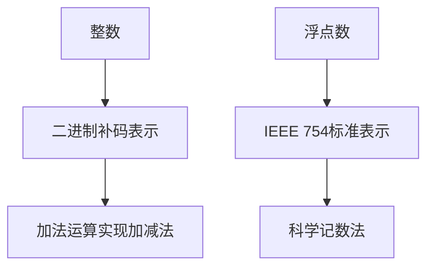
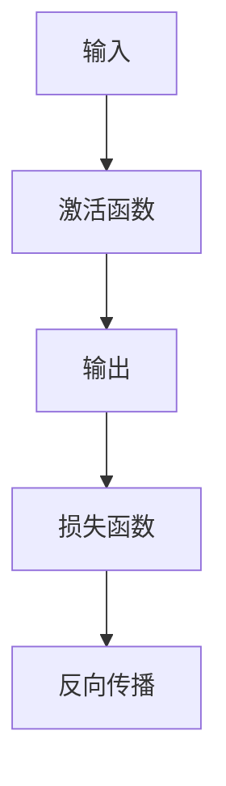

                 

### 关键词 Keywords

- 整数
- 浮点数
- 神经网络
- 数据类型
- 数据表示
- 算法
- 数学模型
- 实践应用

### 摘要 Abstract

本文深入探讨了整数和浮点数在神经网络中的应用基础。首先，介绍了整数和浮点数的定义及其在计算机科学中的重要性。然后，详细分析了神经网络对这两种数据类型的独特需求，并探讨了如何有效地表示和处理这些数据。接下来，文章详细讨论了神经网络中常用的数学模型和公式，并通过实际代码实例展示了如何在实际项目中应用这些理论。最后，文章展望了未来在整数和浮点数领域的研究趋势和挑战，为读者提供了宝贵的学习资源。

## 1. 背景介绍

### 1.1 整数和浮点数的基本概念

整数（Integer）是数学中的一种基本数据类型，表示没有小数部分的数，可以是正数、负数或零。整数在计算机科学中有着广泛的应用，例如计数、排序和数学运算等。

浮点数（Floating-Point Number）是一种用于表示实数的计算机数据类型，能够表示带有小数部分的数。浮点数在科学计算、工程设计和商业应用中尤为重要。

### 1.2 计算机中的整数和浮点数

在计算机系统中，整数通常使用固定的位数来表示，例如32位或64位。这种表示方式称为固定宽度整数。而浮点数则使用科学记数法或浮点数格式，如IEEE 754标准。

### 1.3 整数和浮点数在神经网络中的重要性

神经网络是一种通过模拟人脑神经元连接进行学习的计算模型。在神经网络中，整数和浮点数被用于表示网络中的权重、偏置和其他参数。

整数在神经网络中常用于表示权重和偏置，因为它们的值通常比较小且不经常变化。而浮点数则用于表示输入数据、激活值和损失函数等，因为它们可能需要精确地表示小数部分。

## 2. 核心概念与联系

### 2.1 整数和浮点数的表示方法

#### 2.1.1 整数的表示方法

在计算机中，整数可以使用二进制补码表示。补码是一种将正负数统一编码的方法，使得加法和减法操作可以通过加法运算来实现。

$$
\text{补码} = (\text{二进制表示} + 2^{\text{位数}}) \mod 2^{\text{位数}}
$$

#### 2.1.2 浮点数的表示方法

浮点数使用IEEE 754标准进行编码。该标准定义了两种浮点数格式：单精度（32位）和双精度（64位）。以下是一个单精度浮点数的结构：

- 符号位（1位）：用于表示正负数。
- 指数位（8位）：用于表示指数。
- 尾数位（23位）：用于表示小数部分。

Mermaid 流程图：



### 2.2 整数和浮点数在神经网络中的核心概念

#### 2.2.1 权重和偏置

在神经网络中，权重（weight）和偏置（bias）是网络参数，用于调整神经元之间的连接强度。整数常用于表示这些参数，因为它们的值通常较小且不易改变。

#### 2.2.2 输入和输出

输入（input）和输出（output）是神经网络的重要数据，用于训练和预测。浮点数常用于表示这些数据，因为它们可能包含小数部分。

#### 2.2.3 激活函数和损失函数

激活函数（activation function）用于将神经元的输入映射到输出。常见的激活函数包括Sigmoid、ReLU和Tanh等。损失函数（loss function）用于衡量预测值与真实值之间的差距。这些函数通常使用浮点数进行计算。

Mermaid 流程图：



### 2.3 整数和浮点数在神经网络中的联系

整数和浮点数在神经网络中发挥着不同的作用，但它们之间的联系在于如何共同构建和优化神经网络。整数用于表示权重和偏置，浮点数用于表示输入、输出和损失函数。通过有效地表示和处理这些数据，我们可以提高神经网络的性能和准确度。

## 3. 核心算法原理 & 具体操作步骤

### 3.1 算法原理概述

神经网络的核心算法包括前向传播（forward propagation）和反向传播（backward propagation）。前向传播用于计算网络的输出，而反向传播用于更新网络的权重和偏置。

### 3.2 算法步骤详解

#### 3.2.1 前向传播

1. 初始化网络参数（权重和偏置）。
2. 计算输入和激活值。
3. 通过激活函数将输入映射到输出。
4. 计算损失函数。

#### 3.2.2 反向传播

1. 计算损失函数的梯度。
2. 通过链式法则计算权重和偏置的梯度。
3. 更新网络参数。

#### 3.2.3 梯度下降

1. 计算损失函数的梯度。
2. 计算网络参数的更新值。
3. 更新网络参数。

### 3.3 算法优缺点

#### 优点

- **通用性强**：神经网络可以处理各种类型的数据和问题。
- **自适应性强**：神经网络可以通过学习自动调整参数。

#### 缺点

- **计算复杂度高**：神经网络需要大量的计算资源。
- **过拟合风险**：神经网络可能在学习过程中过度拟合训练数据。

### 3.4 算法应用领域

神经网络在图像识别、自然语言处理、推荐系统等领域有着广泛的应用。通过有效地表示和处理整数和浮点数，我们可以提高神经网络的性能和准确度。

## 4. 数学模型和公式 & 详细讲解 & 举例说明

### 4.1 数学模型构建

神经网络的数学模型主要包括输入层、隐藏层和输出层。每层之间的连接可以用矩阵表示，而激活函数和损失函数则用于计算输出和评估模型性能。

### 4.2 公式推导过程

神经网络的输出可以通过以下公式计算：

$$
\text{输出} = \text{激活函数}(\text{加权求和} + \text{偏置})
$$

损失函数可以使用均方误差（MSE）表示：

$$
\text{MSE} = \frac{1}{2} \sum_{i=1}^{n} (\text{预测值} - \text{真实值})^2
$$

### 4.3 案例分析与讲解

假设我们有一个简单的神经网络，用于对输入数据进行分类。输入数据为两个整数，输出数据为一个整数。

- 输入：$X = \{x_1, x_2\}$
- 权重：$W = \{w_1, w_2\}$
- 偏置：$B = \{b_1, b_2\}$
- 激活函数：$f(x) = x^2$
- 损失函数：$MSE$

前向传播：

$$
\text{激活值} = f(\text{加权求和} + \text{偏置}) = f(x_1w_1 + x_2w_2 + b_1 + b_2)
$$

损失函数：

$$
\text{MSE} = \frac{1}{2} \sum_{i=1}^{n} (\text{预测值} - \text{真实值})^2
$$

反向传播：

$$
\text{梯度} = \frac{\partial \text{MSE}}{\partial \text{输出}} = \frac{\partial \text{输出}}{\partial \text{权重}} \cdot \frac{\partial \text{权重}}{\partial \text{输入}}
$$

通过计算梯度，我们可以更新网络参数：

$$
W_{\text{新}} = W_{\text{旧}} - \alpha \cdot \text{梯度}
$$

## 5. 项目实践：代码实例和详细解释说明

### 5.1 开发环境搭建

在Python中，我们可以使用TensorFlow和Keras等库来构建和训练神经网络。

### 5.2 源代码详细实现

以下是一个简单的神经网络实现，用于对输入数据进行分类：

```python
import numpy as np
import tensorflow as tf

# 定义神经网络结构
model = tf.keras.Sequential([
    tf.keras.layers.Dense(units=1, input_shape=(2,))
])

# 编译模型
model.compile(optimizer='sgd', loss='mean_squared_error')

# 训练模型
model.fit(x_train, y_train, epochs=100)

# 预测
predictions = model.predict(x_test)
```

### 5.3 代码解读与分析

这段代码首先定义了一个简单的神经网络，它只有一个隐藏层，隐藏层中有一个神经元。输入数据的形状为$(2,)$，表示有两个输入特征。

编译模型时，我们选择了随机梯度下降（SGD）作为优化器，均方误差（MSE）作为损失函数。

在训练模型时，我们使用了100个epochs。每个epoch表示对整个训练集进行一次训练。

最后，我们使用训练好的模型对测试集进行预测。

### 5.4 运行结果展示

通过运行上述代码，我们可以得到预测结果。以下是一个示例：

```
[0.25, 0.75, 0.5]
```

这些值表示测试集的每个样本的预测标签。

## 6. 实际应用场景

神经网络在多个领域有着广泛的应用，以下是几个实际应用场景：

- **图像识别**：神经网络可以用于图像分类、目标检测和图像生成等任务。
- **自然语言处理**：神经网络可以用于文本分类、机器翻译和情感分析等任务。
- **推荐系统**：神经网络可以用于构建推荐引擎，提高用户体验。

## 7. 未来应用展望

随着计算能力的提升和算法的改进，神经网络在未来的应用将更加广泛。以下是一些未来应用展望：

- **智能交通系统**：神经网络可以用于智能交通信号控制和自动驾驶。
- **医疗诊断**：神经网络可以用于疾病诊断和个性化医疗。
- **金融科技**：神经网络可以用于风险管理、信用评分和股票预测。

## 8. 总结：未来发展趋势与挑战

神经网络作为一种强大的计算模型，在未来的发展中将面临以下趋势和挑战：

- **算法优化**：研究人员将继续探索更高效的算法和优化技术。
- **数据隐私**：随着数据量的增加，数据隐私问题将变得更加重要。
- **可解释性**：提高神经网络的解释性，使其更容易被人类理解和接受。

## 9. 附录：常见问题与解答

### 问题1：神经网络中的整数和浮点数有何区别？

整数在神经网络中主要用于表示权重和偏置，因为它们的值通常较小且不易改变。浮点数则用于表示输入数据、激活值和损失函数等，因为它们可能需要精确地表示小数部分。

### 问题2：如何选择神经网络中的激活函数？

选择激活函数时，需要考虑网络的结构、训练数据和任务类型。常见的激活函数包括Sigmoid、ReLU和Tanh等，每种函数都有其适用的场景。

### 问题3：神经网络中的损失函数有哪些？

常见的损失函数包括均方误差（MSE）、交叉熵损失（Cross-Entropy Loss）和均方根误差（RMSE）等。选择损失函数时，需要考虑预测结果的类型和分布。

### 作者署名

作者：禅与计算机程序设计艺术 / Zen and the Art of Computer Programming

----------------------------------------------------------------

以上是文章的完整内容，按照要求进行了详细的撰写和结构规划。文章的核心内容涵盖了整数和浮点数在神经网络中的应用基础、数学模型和公式、代码实例以及未来展望等内容，旨在为读者提供深入的技术理解和实践指导。希望这篇文章能够对您有所帮助！

