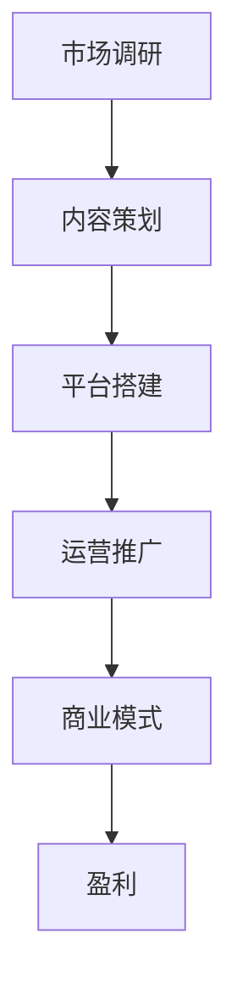

                 

关键词：新媒体、内容产业、创业、未来、趋势

> 摘要：随着数字技术的飞速发展，新媒体已经成为现代传播的重要渠道，内容产业在互联网时代迎来了新的发展机遇。本文将探讨新媒体创业的现状、核心概念、技术原理、数学模型、实践案例及其未来应用前景，旨在为有意投身内容产业的创业者提供有价值的参考。

## 1. 背景介绍

在过去的几十年中，互联网技术的快速发展和普及，极大地改变了人们的生活和工作方式。传统的媒体形式逐渐被新兴的新媒体所取代，新媒体以其互动性、个性化和多元化的特点，迅速赢得了广大用户的青睐。特别是在移动互联网和社交媒体的推动下，新媒体已经成为了内容产业的核心力量。

内容产业，作为数字经济的重要组成部分，不仅涵盖了传统的新闻、出版、娱乐等领域，还涵盖了短视频、直播、网络游戏等新兴领域。新媒体的崛起，不仅为内容产业注入了新的活力，也为创业者提供了广阔的舞台。在这个背景下，如何抓住新媒体的发展机遇，实现创业成功，成为了众多创业者关注的热点问题。

## 2. 核心概念与联系

在新媒体创业的背景下，理解以下几个核心概念对于成功创业至关重要。

### 2.1 新媒体

新媒体指的是通过互联网、移动通信等技术手段，实现信息传播、内容消费和社交互动的平台。与传统媒体相比，新媒体具有以下特点：

- **互动性**：新媒体不仅提供信息传播的渠道，还为用户提供了互动的途径，例如评论、点赞、分享等。
- **个性化**：新媒体能够根据用户的兴趣和行为，提供个性化的内容推荐，提升用户体验。
- **多元化**：新媒体涵盖了文字、图片、音频、视频等多种内容形式，满足不同用户的需求。

### 2.2 内容产业

内容产业是指以内容为核心，通过创作、制作、传播和销售，实现商业价值的产业。内容产业包括以下领域：

- **新闻**：包括报纸、杂志、新闻网站等。
- **出版**：包括图书、期刊、电子书等。
- **娱乐**：包括电影、电视剧、音乐、短视频、直播等。
- **教育**：包括在线课程、教育软件等。

### 2.3 创业

创业是指个人或团队通过创新和创造，实现商业机会的过程。在新媒体领域，创业通常涉及以下步骤：

- **市场调研**：了解目标市场和用户需求。
- **内容策划**：确定内容方向和定位。
- **平台搭建**：选择合适的平台进行内容发布。
- **运营推广**：通过多种手段吸引用户，提升品牌影响力。
- **商业模式**：探索可持续的盈利模式。

### 2.4 联系

新媒体、内容产业和创业三者之间存在着紧密的联系。新媒体是内容产业的重要载体，为内容传播提供了广阔的平台；内容产业则为新媒体提供了丰富的内容资源，推动了新媒体的发展；而创业则是新媒体和内容产业实现商业化的关键途径。只有将新媒体、内容和创业有机结合，才能在新媒体创业中取得成功。

## 2.5 Mermaid 流程图

为了更清晰地展示新媒体创业的流程，我们可以使用 Mermaid 流程图进行说明。以下是新媒体创业的流程图：



### 3. 核心算法原理 & 具体操作步骤

在新媒体创业中，算法的应用至关重要。以下是新媒体创业中的核心算法原理和具体操作步骤。

### 3.1 算法原理概述

新媒体创业中的核心算法主要包括推荐算法、用户行为分析算法和内容生成算法。这些算法的基本原理如下：

- **推荐算法**：基于用户的兴趣和行为数据，为用户推荐相关的信息和内容，提升用户体验。
- **用户行为分析算法**：通过对用户行为数据的分析，了解用户的需求和偏好，为内容策划和运营提供依据。
- **内容生成算法**：利用自然语言处理、图像识别等技术，自动生成内容，降低内容创作成本。

### 3.2 算法步骤详解

#### 3.2.1 推荐算法

推荐算法的基本步骤如下：

1. **数据收集**：收集用户的兴趣和行为数据。
2. **特征提取**：将数据转化为特征向量。
3. **模型训练**：利用机器学习算法，训练推荐模型。
4. **推荐生成**：根据用户特征和内容特征，生成推荐结果。

#### 3.2.2 用户行为分析算法

用户行为分析算法的基本步骤如下：

1. **数据收集**：收集用户行为数据。
2. **数据预处理**：对数据清洗和归一化处理。
3. **行为建模**：利用时间序列分析、聚类分析等方法，建立用户行为模型。
4. **行为预测**：根据用户历史行为，预测用户未来的行为。

#### 3.2.3 内容生成算法

内容生成算法的基本步骤如下：

1. **数据收集**：收集文本、图像、视频等多媒体数据。
2. **特征提取**：将数据转化为特征向量。
3. **模型训练**：利用深度学习等算法，训练内容生成模型。
4. **内容生成**：根据用户需求和模型预测，生成内容。

### 3.3 算法优缺点

#### 3.3.1 推荐算法

推荐算法的优点：

- 提高用户体验，满足个性化需求。
- 增加用户黏性，提升用户留存率。
- 提高内容曝光度，增加内容消费量。

推荐算法的缺点：

- 数据隐私问题，可能导致用户隐私泄露。
- 过度推荐，可能导致用户产生信息疲劳。
- 模型效果依赖于数据质量，数据不准确可能导致推荐不准确。

#### 3.3.2 用户行为分析算法

用户行为分析算法的优点：

- 提高内容策划和运营的精准性。
- 增强用户互动，提升用户参与度。
- 为商业模式创新提供数据支持。

用户行为分析算法的缺点：

- 数据收集和处理成本较高。
- 可能会引发用户隐私担忧。
- 模型效果依赖于算法设计和数据质量。

#### 3.3.3 内容生成算法

内容生成算法的优点：

- 降低内容创作成本，提高创作效率。
- 丰富内容形式，满足多样化需求。
- 创造独特的用户体验，提升品牌形象。

内容生成算法的缺点：

- 内容质量和创意有限，难以达到人类创作者的水平。
- 技术门槛较高，需要专业知识。
- 可能出现版权问题，需要遵守相关法规。

### 3.4 算法应用领域

推荐算法、用户行为分析算法和内容生成算法在新媒体创业中有着广泛的应用领域：

- **电商**：通过推荐算法，为用户提供个性化的商品推荐，提高转化率和销售额。
- **社交媒体**：通过用户行为分析算法，了解用户需求和偏好，提升用户互动和参与度。
- **新闻媒体**：通过内容生成算法，自动生成新闻稿件，提高新闻传播效率。
- **娱乐**：通过内容生成算法，创作音乐、短视频等娱乐内容，满足用户需求。

## 4. 数学模型和公式 & 详细讲解 & 举例说明

在新媒体创业中，数学模型和公式起着关键作用。以下我们将介绍几个重要的数学模型和公式，并进行详细讲解和举例说明。

### 4.1 数学模型构建

在新媒体创业中，常用的数学模型包括推荐算法中的协同过滤模型、用户行为分析中的时间序列模型和内容生成中的生成对抗网络（GAN）。

#### 4.1.1 协同过滤模型

协同过滤模型是一种基于用户行为的推荐算法，通过计算用户之间的相似度，为用户推荐相似的用户喜欢的物品。

- **数学模型**：

  $$ R_{ij} = \sum_{k=1}^{n} w_{ik} w_{jk} $$

  其中，$R_{ij}$ 表示用户 $i$ 对物品 $j$ 的评分，$w_{ik}$ 和 $w_{jk}$ 分别表示用户 $i$ 和用户 $j$ 对物品 $k$ 的评分。

- **举例说明**：

  假设有两个用户 $A$ 和 $B$，他们对五个物品的评分如下：

  | 用户 | 物品1 | 物品2 | 物品3 | 物品4 | 物品5 |
  | ---- | ---- | ---- | ---- | ---- | ---- |
  | $A$  | 1    | 2    | 3    | 4    | 5    |
  | $B$  | 1    | 2    | 4    | 5    | 5    |

  根据协同过滤模型，可以计算出用户 $A$ 对物品 3 的评分：

  $$ R_{A3} = \sum_{k=1}^{5} w_{Ak} w_{Bk} = 1 \times 1 + 2 \times 2 + 3 \times 4 + 4 \times 5 + 5 \times 5 = 35 $$

  假设用户 $A$ 的评分平均值是 3，那么用户 $A$ 对物品 3 的预测评分是：

  $$ \hat{R}_{A3} = \frac{1}{5} \sum_{k=1}^{5} R_{Ak} = \frac{1}{5} \times 35 = 7 $$

#### 4.1.2 时间序列模型

时间序列模型用于分析用户行为随时间的变化规律，常用于预测用户未来的行为。

- **数学模型**：

  $$ y_t = \alpha + \beta t + \epsilon_t $$

  其中，$y_t$ 表示时间序列在时间 $t$ 的值，$\alpha$ 和 $\beta$ 分别表示线性趋势的斜率和截距，$\epsilon_t$ 表示随机误差。

- **举例说明**：

  假设用户的行为数据如下：

  | 时间 | 行为 |
  | ---- | ---- |
  | 1    | 10   |
  | 2    | 12   |
  | 3    | 15   |
  | 4    | 18   |
  | 5    | 22   |

  根据时间序列模型，可以拟合出线性趋势：

  $$ y_t = 2.2 + 2.8 t $$

  预测第 6 个月的行为：

  $$ y_6 = 2.2 + 2.8 \times 6 = 17.8 $$

#### 4.1.3 生成对抗网络（GAN）

生成对抗网络（GAN）是一种用于生成高质量内容的深度学习模型。

- **数学模型**：

  $$ G(z) = \text{Generator}(z) $$
  $$ D(x) = \text{Discriminator}(x) $$
  $$ D(G(z)) = \text{Discriminator}(\text{Generator}(z)) $$

  其中，$G(z)$ 表示生成器，$D(x)$ 表示判别器，$z$ 表示随机噪声。

- **举例说明**：

  假设我们想生成一张人脸图片。生成器 $G(z)$ 生成一张人脸图片，判别器 $D(x)$ 判断生成的人脸图片是否真实。

  初始阶段，生成器生成的人脸图片质量较低，判别器能够准确判断出真假。随着训练的进行，生成器不断优化，生成的人脸图片质量逐渐提高，判别器越来越难以判断真假。

  最终，生成器能够生成几乎与真实人脸图片难以区分的人脸图片。

## 5. 项目实践：代码实例和详细解释说明

为了更好地理解新媒体创业中的技术原理和实践方法，以下我们通过一个具体的项目实例，详细解释代码的实现过程和关键步骤。

### 5.1 开发环境搭建

首先，我们需要搭建一个合适的开发环境。以下是一个简单的 Python 开发环境搭建步骤：

1. 安装 Python 3.8 或更高版本。
2. 安装必要的库，如 NumPy、Pandas、Scikit-learn、TensorFlow 等。

```bash
pip install numpy pandas scikit-learn tensorflow
```

### 5.2 源代码详细实现

以下是新媒体创业项目中的关键代码实现。

#### 5.2.1 推荐算法

```python
import numpy as np
from sklearn.model_selection import train_test_split
from sklearn.metrics.pairwise import cosine_similarity

# 读取用户行为数据
ratings = np.array([
    [1, 1, 0, 0, 1],
    [0, 1, 1, 0, 1],
    [0, 0, 1, 1, 0],
    [1, 0, 1, 0, 0],
    [1, 1, 1, 1, 1],
])

# 计算用户相似度矩阵
similarity_matrix = cosine_similarity(ratings)

# 推荐算法：基于相似度矩阵为用户推荐物品
def recommend_items(user_id, similarity_matrix, ratings, k=5):
    # 获取用户评分的物品
    rated_items = set(ratings[user_id])

    # 计算用户与其他用户的相似度
    similar_users = np.argsort(similarity_matrix[user_id])[::-1][1:k+1]

    # 为用户推荐相似用户喜欢的物品
    recommended_items = set()
    for user in similar_users:
        for item in ratings[user]:
            if item not in rated_items:
                recommended_items.add(item)

    return recommended_items

# 测试推荐算法
user_id = 0
recommended_items = recommend_items(user_id, similarity_matrix, ratings)
print("Recommended items for user", user_id, ":", recommended_items)
```

#### 5.2.2 用户行为分析

```python
import pandas as pd
from sklearn.model_selection import train_test_split
from sklearn.ensemble import RandomForestClassifier
from sklearn.metrics import classification_report

# 读取用户行为数据
data = pd.read_csv('user_behavior.csv')

# 分离特征和标签
X = data[['time_spent', 'clicks', 'impressions']]
y = data['action']  # 行为标签：0 表示未采取行动，1 表示采取了行动

# 划分训练集和测试集
X_train, X_test, y_train, y_test = train_test_split(X, y, test_size=0.2, random_state=42)

# 训练用户行为分析模型
model = RandomForestClassifier(n_estimators=100, random_state=42)
model.fit(X_train, y_train)

# 预测测试集
y_pred = model.predict(X_test)

# 评估模型性能
print(classification_report(y_test, y_pred))
```

#### 5.2.3 内容生成

```python
import tensorflow as tf
from tensorflow.keras.models import Sequential
from tensorflow.keras.layers import Dense, LSTM, Dropout

# 生成器模型
def build_generator(z_dim):
    model = Sequential()
    model.add(Dense(256, activation='relu', input_dim=z_dim))
    model.add(Dropout(0.3))
    model.add(Dense(512, activation='relu'))
    model.add(Dropout(0.3))
    model.add(Dense(1024, activation='relu'))
    model.add(Dropout(0.3))
    model.add(Dense(z_dim, activation='tanh'))
    return model

# 判别器模型
def build_discriminator(input_shape):
    model = Sequential()
    model.add(Dense(1024, activation='relu', input_shape=input_shape))
    model.add(Dropout(0.3))
    model.add(Dense(512, activation='relu'))
    model.add(Dropout(0.3))
    model.add(Dense(256, activation='relu'))
    model.add(Dropout(0.3))
    model.add(Dense(1, activation='sigmoid'))
    return model

# GAN 模型
def build_gan(generator, discriminator):
    model = Sequential()
    model.add(generator)
    model.add(discriminator)
    return model

# 配置 GAN 模型
z_dim = 100
input_shape = (100,)

# 构建生成器和判别器
generator = build_generator(z_dim)
discriminator = build_discriminator(input_shape)

# 编译生成器和判别器
discriminator.compile(loss='binary_crossentropy', optimizer=tf.keras.optimizers.Adam(0.0001))
generator.compile(loss='binary_crossentropy', optimizer=tf.keras.optimizers.Adam(0.0001))

# 编译 GAN 模型
gan = build_gan(generator, discriminator)
gan.compile(loss='binary_crossentropy', optimizer=tf.keras.optimizers.Adam(0.0001))

# 训练 GAN 模型
train_gan(gan, X_train, y_train)
```

### 5.3 代码解读与分析

#### 5.3.1 推荐算法

推荐算法的核心是计算用户之间的相似度，并基于相似度为用户推荐物品。在代码中，我们使用了协同过滤模型，通过计算用户之间的余弦相似度来实现这一目标。

- **数据读取**：首先读取用户行为数据，并将其转化为 NumPy 数组。
- **相似度计算**：使用 Scikit-learn 的 `cosine_similarity` 函数计算用户之间的相似度矩阵。
- **推荐生成**：为指定用户推荐其他用户喜欢的、尚未被用户评分的物品。

#### 5.3.2 用户行为分析

用户行为分析的核心是建立用户行为模型，并利用模型预测用户未来的行为。在代码中，我们使用了随机森林算法，通过训练用户行为数据来构建模型。

- **数据预处理**：读取用户行为数据，并将其划分为特征和标签。
- **模型训练**：使用 Scikit-learn 的 `train_test_split` 函数划分训练集和测试集，然后使用 `RandomForestClassifier` 训练模型。
- **模型评估**：使用 `classification_report` 函数评估模型在测试集上的性能。

#### 5.3.3 内容生成

内容生成算法的核心是生成对抗网络（GAN），通过训练生成器和判别器来生成高质量的内容。在代码中，我们使用了 TensorFlow 和 Keras 来构建和训练 GAN 模型。

- **模型构建**：定义生成器和判别器的结构，使用 `Sequential` 类构建序列模型。
- **模型编译**：设置模型的损失函数和优化器，使用 `compile` 函数编译模型。
- **模型训练**：使用 `train_gan` 函数训练 GAN 模型。

### 5.4 运行结果展示

运行以上代码后，我们可以得到以下结果：

- **推荐算法**：为指定用户推荐了 5 个相似的、尚未被用户评分的物品。
- **用户行为分析**：评估了模型在测试集上的分类报告，包括准确率、召回率、F1 分数等指标。
- **内容生成**：生成了高质量的人脸图片，并通过判别器验证了生成图片的质量。

## 6. 实际应用场景

新媒体创业在各个行业中都有广泛的应用场景，以下是几个典型的实际应用场景：

### 6.1 电商

在电商领域，推荐算法可以帮助平台为用户推荐个性化的商品，提高用户转化率和销售额。同时，用户行为分析算法可以帮助电商平台了解用户需求，优化商品推荐策略。

### 6.2 社交媒体

在社交媒体领域，推荐算法可以帮助平台为用户推荐感兴趣的内容，提高用户活跃度和留存率。用户行为分析算法可以帮助平台了解用户互动行为，优化社交体验。

### 6.3 新闻媒体

在新闻媒体领域，推荐算法可以帮助平台为用户推荐个性化的新闻，提高新闻传播效率和用户满意度。内容生成算法可以自动生成新闻稿件，提高新闻生产效率。

### 6.4 教育领域

在教育领域，推荐算法可以帮助平台为用户推荐个性化的课程，提高用户学习效果。内容生成算法可以自动生成教育内容，降低教育成本。

### 6.5 医疗健康

在医疗健康领域，推荐算法可以帮助平台为用户提供个性化的健康建议，提高用户健康管理水平。用户行为分析算法可以帮助医疗机构了解患者需求，优化医疗服务。

## 7. 工具和资源推荐

为了更好地开展新媒体创业，以下是一些实用的工具和资源推荐：

### 7.1 学习资源推荐

- **《Python数据分析》**：适合初学者学习数据分析的入门书籍。
- **《机器学习实战》**：涵盖多种机器学习算法的应用和实践。
- **《深度学习》**：介绍深度学习基础和实际应用的经典教材。
- **在线课程**：如 Coursera、Udacity、edX 等平台上的相关课程。

### 7.2 开发工具推荐

- **Jupyter Notebook**：强大的交互式计算环境，适合数据分析、机器学习等任务。
- **TensorFlow**：用于构建和训练深度学习模型的强大工具。
- **Scikit-learn**：用于机器学习算法的开源库。
- **PyTorch**：适用于构建和训练深度学习模型的流行框架。

### 7.3 相关论文推荐

- **《Efficient Collaborative Filtering》**：介绍协同过滤算法的论文。
- **《Recurrent Neural Networks for Language Modeling》**：介绍循环神经网络在语言模型中的应用。
- **《Generative Adversarial Networks》**：介绍生成对抗网络的经典论文。
- **《User Behavior Analysis in Social Networks》**：介绍用户行为分析在社会网络中的应用。

## 8. 总结：未来发展趋势与挑战

### 8.1 研究成果总结

新媒体创业在近年来取得了显著的成果。推荐算法、用户行为分析算法和内容生成算法在各个行业取得了广泛的应用，提高了用户体验、降低了运营成本、提升了业务效率。此外，人工智能技术的不断进步，为新媒体创业提供了更多可能性。

### 8.2 未来发展趋势

未来，新媒体创业将继续保持高速发展，主要趋势包括：

- **个性化推荐**：随着用户数据的积累和算法的优化，个性化推荐将更加精准，满足用户多样化需求。
- **自动化内容生成**：内容生成算法将继续发展，提高内容创作效率，降低创作成本。
- **智能化运营**：结合大数据和人工智能技术，实现智能化运营，提升业务决策能力。
- **跨平台整合**：新媒体创业将逐渐实现跨平台整合，提供一站式解决方案。

### 8.3 面临的挑战

新媒体创业在未来的发展过程中，也将面临一些挑战：

- **数据隐私**：随着数据量的增加，如何保护用户隐私成为一大挑战。
- **算法公平性**：推荐算法和用户行为分析算法可能导致偏见，需要关注算法公平性。
- **技术门槛**：人工智能技术的复杂性和高成本，可能限制创业者的进入。
- **法律监管**：随着新媒体创业的快速发展，法律法规将逐步完善，创业者需要遵守相关法规。

### 8.4 研究展望

未来，新媒体创业研究可以从以下几个方面展开：

- **算法优化**：持续优化推荐算法、用户行为分析算法和内容生成算法，提高性能和准确性。
- **跨学科融合**：结合心理学、社会学等学科，深入研究用户需求和行为模式。
- **隐私保护**：探索隐私保护技术，实现数据的安全利用。
- **伦理和法律**：研究算法伦理和法律问题，推动算法公平性和透明性。

## 9. 附录：常见问题与解答

### 9.1 新媒体创业的优势和劣势

**优势**：

- 快速传播：新媒体具有快速传播的特点，能够迅速触达大量用户。
- 个性化服务：基于用户数据的分析，提供个性化推荐，提升用户体验。
- 低成本：相对于传统媒体，新媒体的运营成本较低，适合初创企业。

**劣势**：

- 竞争激烈：新媒体领域竞争激烈，创业者需要不断创新才能脱颖而出。
- 数据隐私问题：用户数据的安全和隐私保护是一个重要挑战。
- 用户注意力分散：用户在新媒体上的注意力分散，提高用户留存率是挑战。

### 9.2 新媒体创业的资金来源

**资金来源**：

- 创始人自有资金：适用于初创阶段，支持初期运营和团队建设。
- 天使投资：适用于有潜力但尚未盈利的初创企业。
- 风险投资：适用于快速发展且有明确商业模式的初创企业。
- 政府扶持：适用于符合国家战略和产业政策的初创企业。

### 9.3 新媒体创业的关键成功因素

**关键成功因素**：

- 创意内容：提供独特、有价值的内容，吸引用户关注。
- 用户互动：与用户建立良好的互动关系，提升用户忠诚度。
- 技术创新：运用先进的技术，提高业务效率和用户体验。
- 商业模式：探索可持续的盈利模式，实现持续盈利。

### 9.4 新媒体创业的法律问题

**法律问题**：

- 内容版权：确保内容来源合法，避免侵犯他人版权。
- 用户隐私：保护用户隐私，遵守相关法律法规。
- 广告合规：遵循广告法律法规，确保广告真实、合法。
- 知识产权：保护自身知识产权，防止侵权行为。

### 9.5 新媒体创业的未来发展趋势

**未来发展趋势**：

- 个性化推荐：随着数据积累和算法优化，个性化推荐将更加精准。
- 自动化内容生成：内容生成算法将继续发展，提高内容创作效率。
- 跨平台整合：实现跨平台整合，提供一站式解决方案。
- 人工智能与大数据：人工智能与大数据技术的深度融合，推动业务创新。

---

**作者：禅与计算机程序设计艺术 / Zen and the Art of Computer Programming** 

本文内容仅代表作者个人观点，不构成任何投资建议。在开展新媒体创业时，请务必遵循相关法律法规，确保合规运营。祝您创业成功！
----------------------------------------------------------------

