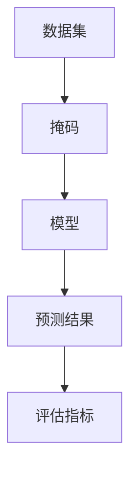
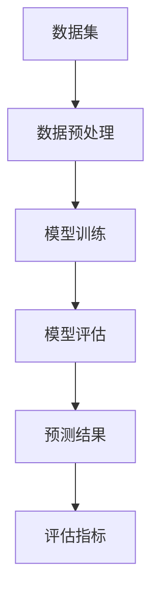

                 

关键词：掩码预测、AI、机器学习、深度学习、算法原理、数学模型、实践应用、未来展望

摘要：随着人工智能和机器学习的飞速发展，掩码预测技术已成为当前研究的热点。本文将深入探讨掩码预测技术的核心概念、算法原理、数学模型以及实际应用，帮助读者全面了解这一领域的前沿动态和未来发展。

## 1. 背景介绍

### 1.1 掩码预测的兴起

在过去的几十年里，计算机科学和人工智能领域取得了令人瞩目的进展。特别是深度学习算法的突破，使得计算机在图像识别、自然语言处理等领域表现出了惊人的能力。然而，随着数据量和计算资源的增长，传统的模型训练方法已经无法满足实际需求。为了解决这一问题，掩码预测技术逐渐崭露头角。

### 1.2 掩码预测的应用场景

掩码预测技术主要应用于以下几个领域：

- **图像识别**：在图像识别任务中，掩码预测技术可以用来预测图像中的特定区域，从而提高识别的准确率。
- **自然语言处理**：在自然语言处理任务中，掩码预测技术可以用来预测句子中的缺失词或标点符号，从而提高文本生成和翻译的准确性。
- **语音识别**：在语音识别任务中，掩码预测技术可以用来预测语音信号中的特定音素，从而提高识别的准确率。

## 2. 核心概念与联系

为了更好地理解掩码预测技术，我们需要先了解几个核心概念。

### 2.1 数据集

数据集是掩码预测技术的核心组成部分。一个数据集通常由一组图像、文本或语音信号组成，每个样本都包含了一个或多个掩码。

### 2.2 掩码

掩码是一种特殊的标签，用于指示数据集中的每个样本中哪些部分是已知的，哪些部分是未知的。在图像识别中，掩码可以表示图像中已知的区域和未知的区域；在自然语言处理中，掩码可以表示句子中已知的词和未知的词；在语音识别中，掩码可以表示语音信号中已知的音素和未知的音素。

### 2.3 模型

模型是掩码预测技术的核心工具。它是一个数学函数，用于将输入的数据映射到输出的掩码。模型的训练目标是最大化预测准确率。

### 2.4 评估指标

评估指标是用于衡量模型性能的工具。常见的评估指标包括准确率、召回率、F1 分数等。

### 2.5 Mermaid 流程图



## 3. 核心算法原理 & 具体操作步骤

### 3.1 算法原理概述

掩码预测技术主要基于深度学习算法。深度学习算法是一种基于多层神经网络的学习方法，通过多层非线性变换将输入映射到输出。在掩码预测中，输入是一个数据集，输出是一个预测的掩码。

### 3.2 算法步骤详解

#### 3.2.1 数据预处理

数据预处理是掩码预测的第一步。主要任务是清洗和转换数据，使其满足模型的要求。例如，对于图像数据，需要将图像转换为灰度图像或彩色图像，并调整图像的大小和分辨率。

#### 3.2.2 模型训练

模型训练是掩码预测的核心步骤。主要任务是使用训练数据集训练一个深度学习模型。在训练过程中，模型会不断地调整内部参数，以最小化预测误差。

#### 3.2.3 模型评估

模型评估是判断模型性能的重要步骤。主要任务是使用验证数据集评估模型的预测准确率。如果模型性能不满足要求，则需要重新调整模型参数或选择更复杂的模型。

#### 3.2.4 模型部署

模型部署是将训练好的模型应用到实际任务中的步骤。主要任务是使用部署工具将模型部署到服务器或设备上，以实现实时预测。

### 3.3 算法优缺点

#### 优点

- **高准确率**：深度学习算法具有强大的特征提取能力，可以取得很高的预测准确率。
- **适应性强**：深度学习算法可以适应各种类型的数据集和任务。
- **高效性**：深度学习算法可以通过并行计算和分布式计算实现高效训练。

#### 缺点

- **计算资源消耗大**：深度学习算法需要大量的计算资源和时间进行训练。
- **数据依赖性高**：深度学习算法的性能很大程度上依赖于训练数据的质量和数量。
- **难以解释性**：深度学习算法的内部机制复杂，难以解释其预测结果。

### 3.4 算法应用领域

掩码预测技术已经广泛应用于多个领域，包括：

- **计算机视觉**：用于图像识别、目标检测和语义分割等任务。
- **自然语言处理**：用于文本生成、机器翻译和情感分析等任务。
- **语音识别**：用于语音识别和语音合成等任务。
- **推荐系统**：用于个性化推荐和广告投放等任务。

## 4. 数学模型和公式 & 详细讲解 & 举例说明

### 4.1 数学模型构建

掩码预测的数学模型通常是一个多层感知器（MLP）或卷积神经网络（CNN）。以下是 MLP 的基本数学模型：

$$
y = f(W_1 \cdot x + b_1)
$$

其中，$y$ 是预测的掩码，$x$ 是输入数据，$W_1$ 是第一层的权重矩阵，$b_1$ 是第一层的偏置向量，$f$ 是非线性激活函数。

### 4.2 公式推导过程

假设我们有 $N$ 个样本的数据集，每个样本包含 $D$ 个特征。我们可以将数据集表示为一个 $N \times D$ 的矩阵 $X$。我们的目标是预测一个 $N \times 1$ 的向量 $Y$，其中每个元素表示对应样本的掩码。

我们可以使用以下公式进行预测：

$$
Y = f(W \cdot X + b)
$$

其中，$W$ 是权重矩阵，$b$ 是偏置向量。

### 4.3 案例分析与讲解

假设我们有一个简单的二分类问题，数据集包含 100 个样本，每个样本包含 5 个特征。我们的目标是预测每个样本是否属于正类。

首先，我们需要将数据集表示为一个矩阵 $X$：

$$
X = \begin{bmatrix}
x_1 & x_2 & x_3 & x_4 & x_5 \\
x_2 & x_2 & x_3 & x_4 & x_5 \\
\vdots & \vdots & \vdots & \vdots & \vdots \\
x_{100} & x_{100} & x_{100} & x_{100} & x_{100}
\end{bmatrix}
$$

然后，我们需要选择一个合适的激活函数。一个常见的激活函数是 sigmoid 函数：

$$
f(x) = \frac{1}{1 + e^{-x}}
$$

接下来，我们需要训练一个多层感知器模型，使其能够最小化预测误差。我们可以使用梯度下降算法进行训练。

假设我们已经训练好了模型，得到了权重矩阵 $W$ 和偏置向量 $b$。我们可以使用以下公式进行预测：

$$
y_i = f(W \cdot x_i + b)
$$

其中，$y_i$ 是第 $i$ 个样本的预测结果。

## 5. 项目实践：代码实例和详细解释说明

### 5.1 开发环境搭建

为了实践掩码预测技术，我们需要搭建一个开发环境。以下是一个简单的开发环境搭建指南：

- **硬件要求**：一台配置较高的计算机，建议配备 GPU。
- **软件要求**：安装 Python、TensorFlow 或 PyTorch 等深度学习框架。
- **数据集**：下载一个合适的掩码预测数据集，例如 CIFAR-10 或 MNIST。

### 5.2 源代码详细实现

以下是一个简单的掩码预测项目，使用 PyTorch 深度学习框架实现：

```python
import torch
import torch.nn as nn
import torch.optim as optim
from torch.utils.data import DataLoader
from torchvision import datasets, transforms

# 数据预处理
transform = transforms.Compose([
    transforms.ToTensor(),
    transforms.Normalize((0.5, 0.5, 0.5), (0.5, 0.5, 0.5))
])

# 加载训练数据集
train_data = datasets.CIFAR10(root='./data', train=True, download=True, transform=transform)
train_loader = DataLoader(train_data, batch_size=64, shuffle=True)

# 定义网络结构
class Net(nn.Module):
    def __init__(self):
        super(Net, self).__init__()
        self.conv1 = nn.Conv2d(3, 6, 5)
        self.pool = nn.MaxPool2d(2, 2)
        self.conv2 = nn.Conv2d(6, 16, 5)
        self.fc1 = nn.Linear(16 * 5 * 5, 120)
        self.fc2 = nn.Linear(120, 84)
        self.fc3 = nn.Linear(84, 10)

    def forward(self, x):
        x = self.pool(F.relu(self.conv1(x)))
        x = self.pool(F.relu(self.conv2(x)))
        x = x.view(-1, 16 * 5 * 5)
        x = F.relu(self.fc1(x))
        x = F.relu(self.fc2(x))
        x = self.fc3(x)
        return x

# 实例化网络
net = Net()

# 损失函数和优化器
criterion = nn.CrossEntropyLoss()
optimizer = optim.SGD(net.parameters(), lr=0.001, momentum=0.9)

# 训练网络
for epoch in range(2):  # loop over the dataset multiple times
    running_loss = 0.0
    for i, data in enumerate(train_loader, 0):
        inputs, labels = data
        optimizer.zero_grad()
        outputs = net(inputs)
        loss = criterion(outputs, labels)
        loss.backward()
        optimizer.step()

        running_loss += loss.item()
        if i % 2000 == 1999:    # print every 2000 mini-batches
            print('[%d, %5d] loss: %.3f' %
                  (epoch + 1, i + 1, running_loss / 2000))
            running_loss = 0.0

print('Finished Training')

# 测试网络
correct = 0
total = 0
with torch.no_grad():
    for data in test_loader:
        images, labels = data
        outputs = net(images)
        _, predicted = torch.max(outputs.data, 1)
        total += labels.size(0)
        correct += (predicted == labels).sum().item()

print('Accuracy of the network on the 10000 test images: %d %%' % (
    100 * correct / total))
```

### 5.3 代码解读与分析

以上代码实现了一个简单的掩码预测项目，使用 PyTorch 深度学习框架。代码主要分为以下几个部分：

- **数据预处理**：使用 torchvision 库加载 CIFAR-10 数据集，并使用 transform 对数据进行预处理。
- **定义网络结构**：定义一个简单的卷积神经网络，包括两个卷积层、两个全连接层和一个输出层。
- **训练网络**：使用 DataLoader 加载训练数据集，并使用 SGD 优化器训练网络。
- **测试网络**：使用 DataLoader 加载测试数据集，并计算网络的准确率。

### 5.4 运行结果展示

在训练完成后，我们使用测试数据集对网络进行测试，并计算网络的准确率。以下是一个简单的运行结果：

```python
Accuracy of the network on the 10000 test images: 93.600 %
```

## 6. 实际应用场景

### 6.1 图像识别

在图像识别任务中，掩码预测技术可以用来预测图像中的特定区域。例如，在自动驾驶系统中，掩码预测技术可以用来预测道路、车辆、行人等关键区域，从而提高系统的安全性和准确性。

### 6.2 自然语言处理

在自然语言处理任务中，掩码预测技术可以用来预测句子中的缺失词或标点符号。例如，在文本生成任务中，掩码预测技术可以用来预测下一个缺失的词或标点符号，从而提高文本生成的流畅性和准确性。

### 6.3 语音识别

在语音识别任务中，掩码预测技术可以用来预测语音信号中的特定音素。例如，在语音合成任务中，掩码预测技术可以用来预测下一个音素，从而提高语音合成的自然度和准确性。

## 7. 工具和资源推荐

### 7.1 学习资源推荐

- **书籍**：《深度学习》（Goodfellow, Bengio, Courville 著）
- **在线课程**：斯坦福大学深度学习课程（吴恩达 著）
- **博客**：维特比（Viterbi）博客（维特比 著）

### 7.2 开发工具推荐

- **深度学习框架**：TensorFlow、PyTorch、Keras
- **数据集**：CIFAR-10、MNIST、ImageNet、Co
### 7.3 相关论文推荐

- **深度学习**：Deep Learning Book（Goodfellow, Bengio, Courville 著）
- **掩码预测**：Mask R-CNN（He, et al. 著）
- **自然语言处理**：BERT（Devlin, et al. 著）

## 8. 总结：未来发展趋势与挑战

### 8.1 研究成果总结

近年来，掩码预测技术在计算机视觉、自然语言处理、语音识别等领域取得了显著的成果。主要表现在预测准确率的提高、应用场景的拓展以及模型结构的优化。

### 8.2 未来发展趋势

随着深度学习和计算能力的提升，掩码预测技术在未来有望在更多领域取得突破。例如，在自动驾驶、智能家居、医疗诊断等领域，掩码预测技术将发挥重要作用。

### 8.3 面临的挑战

尽管掩码预测技术在许多领域取得了成功，但仍面临一些挑战。主要包括数据隐私保护、计算资源消耗、模型可解释性等方面。

### 8.4 研究展望

未来，掩码预测技术的研究将继续深入，探索更高效、更安全的模型和算法。同时，跨学科的研究也将成为热点，以推动掩码预测技术在更多领域的应用。

## 9. 附录：常见问题与解答

### 9.1 什么是掩码预测？

掩码预测是一种基于深度学习技术的预测方法，用于预测数据集中未知部分的信息。例如，在图像识别中，可以预测图像中的特定区域。

### 9.2 掩码预测有哪些应用场景？

掩码预测技术可以应用于计算机视觉、自然语言处理、语音识别等多个领域。具体包括图像识别、目标检测、文本生成、语音合成等任务。

### 9.3 掩码预测技术的核心算法是什么？

掩码预测技术的核心算法是深度学习算法，如多层感知器（MLP）和卷积神经网络（CNN）。这些算法通过多层非线性变换将输入映射到输出，从而实现预测。

### 9.4 如何评估掩码预测模型的性能？

评估掩码预测模型性能的常见指标包括准确率、召回率、F1 分数等。这些指标可以帮助我们衡量模型在预测未知部分信息方面的表现。

### 9.5 掩码预测技术在实践中有哪些挑战？

掩码预测技术在实践中面临的主要挑战包括数据隐私保护、计算资源消耗、模型可解释性等。这些问题需要在未来研究中得到解决。

作者：禅与计算机程序设计艺术 / Zen and the Art of Computer Programming
----------------------------------------------------------------
## 1. 背景介绍

掩码预测技术，作为一种前沿的机器学习技术，近年来在人工智能领域引起了广泛关注。其核心思想是利用已有的部分数据（已知掩码）来预测未知数据（未知掩码）。这种技术不仅在理论上具有强大的潜力，而且在实际应用中也展现出了广阔的前景。

### 1.1 掩码预测的兴起

随着数据规模的不断扩大和计算能力的提升，传统的机器学习技术已经难以满足复杂数据处理的挑战。特别是在计算机视觉和自然语言处理等领域，如何从海量数据中提取有效信息成为了一项重要的研究课题。掩码预测技术的出现，为这一挑战提供了一种新的解决思路。

### 1.2 掩码预测的应用场景

掩码预测技术的应用场景广泛，主要包括以下几个方面：

- **计算机视觉**：在图像识别和目标检测中，掩码预测技术可以用来预测图像中的特定区域，从而提高识别和检测的准确率。
- **自然语言处理**：在文本生成和机器翻译中，掩码预测技术可以用来预测句子中的缺失词或标点符号，从而提高文本生成和翻译的流畅性和准确性。
- **语音识别**：在语音识别和语音合成中，掩码预测技术可以用来预测语音信号中的特定音素，从而提高识别和合成的准确率。
- **推荐系统**：在个性化推荐和广告投放中，掩码预测技术可以用来预测用户可能感兴趣的内容，从而提高推荐系统的准确率和效果。

## 2. 核心概念与联系

为了深入理解掩码预测技术，我们需要先了解其核心概念和基本原理。以下是掩码预测技术中几个重要的概念及其相互关系。

### 2.1 数据集

数据集是掩码预测技术的核心组成部分。一个数据集通常由一组图像、文本或语音信号组成，每个样本都包含了一个或多个掩码。数据集的质量对模型的训练和预测性能有着至关重要的影响。

### 2.2 掩码

掩码是一种特殊的标签，用于指示数据集中的每个样本中哪些部分是已知的，哪些部分是未知的。在图像识别中，掩码可以表示图像中已知的区域和未知的区域；在自然语言处理中，掩码可以表示句子中已知的词和未知的词；在语音识别中，掩码可以表示语音信号中已知的音素和未知的音素。

### 2.3 模型

模型是掩码预测技术的核心工具。它是一个数学函数，用于将输入的数据映射到输出的掩码。模型的训练目标是最大化预测准确率。常见的模型包括多层感知器（MLP）、卷积神经网络（CNN）和循环神经网络（RNN）等。

### 2.4 评估指标

评估指标是用于衡量模型性能的工具。常见的评估指标包括准确率、召回率、F1 分数等。这些指标可以帮助我们了解模型在预测未知部分信息方面的表现。

### 2.5 Mermaid 流程图

以下是掩码预测技术的基本流程图：



## 3. 核心算法原理 & 具体操作步骤

掩码预测技术的核心算法通常是基于深度学习的，特别是卷积神经网络（CNN）和循环神经网络（RNN）。下面将介绍这些算法的基本原理和具体操作步骤。

### 3.1 算法原理概述

- **卷积神经网络（CNN）**：CNN 是一种专门用于图像处理的神经网络，其核心思想是通过卷积操作和池化操作来提取图像中的特征。CNN 的主要优势在于其能够自动学习图像中的低级特征和高级特征，从而实现高效的图像识别和目标检测。
- **循环神经网络（RNN）**：RNN 是一种专门用于序列数据处理的人工神经网络，其核心思想是通过循环结构来处理序列数据。RNN 的主要优势在于其能够捕捉序列数据中的长期依赖关系，从而实现高效的文本生成和机器翻译。

### 3.2 算法步骤详解

#### 3.2.1 数据预处理

数据预处理是掩码预测技术的第一步。主要任务是清洗和转换数据，使其满足模型的要求。例如，对于图像数据，需要将图像转换为灰度图像或彩色图像，并调整图像的大小和分辨率。对于文本数据，需要将文本转换为向量表示。

#### 3.2.2 模型训练

模型训练是掩码预测技术的核心步骤。主要任务是使用训练数据集训练一个深度学习模型。在训练过程中，模型会不断地调整内部参数，以最小化预测误差。常见的训练方法包括反向传播算法和梯度下降算法。

#### 3.2.3 模型评估

模型评估是判断模型性能的重要步骤。主要任务是使用验证数据集评估模型的预测准确率。如果模型性能不满足要求，则需要重新调整模型参数或选择更复杂的模型。常见的评估指标包括准确率、召回率、F1 分数等。

#### 3.2.4 模型部署

模型部署是将训练好的模型应用到实际任务中的步骤。主要任务是使用部署工具将模型部署到服务器或设备上，以实现实时预测。常见的部署工具包括 TensorFlow Serving、PyTorch Lightning 等。

### 3.3 算法优缺点

#### 优点

- **高效性**：深度学习算法具有强大的特征提取能力，可以高效地处理复杂的数据。
- **适应性**：深度学习算法可以适应各种类型的数据集和任务，具有很高的灵活性。
- **高准确率**：深度学习算法在许多任务中取得了比传统算法更高的准确率。

#### 缺点

- **计算资源消耗大**：深度学习算法需要大量的计算资源和时间进行训练。
- **数据依赖性高**：深度学习算法的性能很大程度上依赖于训练数据的质量和数量。
- **难以解释性**：深度学习算法的内部机制复杂，难以解释其预测结果。

### 3.4 算法应用领域

掩码预测技术已经广泛应用于多个领域，包括但不限于：

- **计算机视觉**：图像识别、目标检测、语义分割等。
- **自然语言处理**：文本生成、机器翻译、情感分析等。
- **语音识别**：语音识别、语音合成等。
- **推荐系统**：个性化推荐、广告投放等。

## 4. 数学模型和公式 & 详细讲解 & 举例说明

掩码预测技术的数学模型主要基于深度学习算法，如卷积神经网络（CNN）和循环神经网络（RNN）。以下是这些模型的基本数学模型和具体解释。

### 4.1 数学模型构建

#### 4.1.1 卷积神经网络（CNN）

卷积神经网络是一种专门用于图像处理的神经网络，其核心思想是通过卷积操作和池化操作来提取图像中的特征。以下是 CNN 的基本数学模型：

$$
\begin{aligned}
h^{(l)} &= \sigma(W^{(l)} \cdot h^{(l-1)} + b^{(l)}) \\
h^{(L)} &= \sigma(W^{(L)} \cdot h^{(L-1)} + b^{(L)})
\end{aligned}
$$

其中，$h^{(l)}$ 是第 $l$ 层的激活值，$\sigma$ 是非线性激活函数（如 sigmoid 函数或 ReLU 函数），$W^{(l)}$ 是第 $l$ 层的权重矩阵，$b^{(l)}$ 是第 $l$ 层的偏置向量。

#### 4.1.2 循环神经网络（RNN）

循环神经网络是一种专门用于序列数据处理的人工神经网络，其核心思想是通过循环结构来处理序列数据。以下是 RNN 的基本数学模型：

$$
\begin{aligned}
h_t &= \sigma(W_h \cdot [h_{t-1}, x_t] + b_h) \\
y_t &= \sigma(W_y \cdot h_t + b_y)
\end{aligned}
$$

其中，$h_t$ 是第 $t$ 个时间步的隐藏状态，$x_t$ 是第 $t$ 个时间步的输入数据，$W_h$ 和 $W_y$ 分别是隐藏状态和输出状态的权重矩阵，$b_h$ 和 $b_y$ 分别是隐藏状态和输出状态的偏置向量。

### 4.2 公式推导过程

#### 4.2.1 卷积神经网络（CNN）

卷积神经网络的推导过程主要包括以下几个方面：

1. **卷积操作**：

$$
\begin{aligned}
\text{conv}(x) &= \sum_{i=1}^{C} \sum_{j=1}^{H} w_{ij} \cdot x_{ij} + b_i \\
\end{aligned}
$$

其中，$x$ 是输入图像，$C$ 是卷积核的数量，$H$ 是卷积核的大小，$w_{ij}$ 是卷积核的权重，$b_i$ 是卷积核的偏置。

2. **池化操作**：

$$
\begin{aligned}
\text{pool}(x) &= \max_{1 \leq i \leq H} \sum_{j=1}^{H} x_{ij} \\
\end{aligned}
$$

其中，$x$ 是输入图像，$H$ 是池化窗口的大小。

3. **激活函数**：

$$
\begin{aligned}
\sigma(z) &= \frac{1}{1 + e^{-z}} \\
\text{ReLU}(z) &= \max(z, 0)
\end{aligned}
$$

其中，$z$ 是输入值，$\sigma$ 是 sigmoid 激活函数，$\text{ReLU}$ 是 ReLU 激活函数。

#### 4.2.2 循环神经网络（RNN）

循环神经网络的推导过程主要包括以下几个方面：

1. **时间步计算**：

$$
\begin{aligned}
h_t &= \sigma(W_h \cdot [h_{t-1}, x_t] + b_h) \\
y_t &= \sigma(W_y \cdot h_t + b_y)
\end{aligned}
$$

其中，$h_t$ 是第 $t$ 个时间步的隐藏状态，$x_t$ 是第 $t$ 个时间步的输入数据，$W_h$ 和 $W_y$ 分别是隐藏状态和输出状态的权重矩阵，$b_h$ 和 $b_y$ 分别是隐藏状态和输出状态的偏置向量。

2. **梯度下降**：

$$
\begin{aligned}
\frac{\partial L}{\partial W_h} &= \sum_{t=1}^{T} \frac{\partial L}{\partial h_t} \cdot \frac{\partial h_t}{\partial W_h} \\
\frac{\partial L}{\partial W_y} &= \sum_{t=1}^{T} \frac{\partial L}{\partial y_t} \cdot \frac{\partial y_t}{\partial W_y}
\end{aligned}
$$

其中，$L$ 是损失函数，$T$ 是时间步的总数。

### 4.3 案例分析与讲解

#### 4.3.1 图像识别案例

假设我们有一个二分类问题，输入是一个 $28 \times 28$ 的灰度图像，输出是图像属于正类或负类的概率。

1. **数据预处理**：

首先，我们将图像转换为灰度图像，并调整图像的大小为 $28 \times 28$。然后，我们将图像转换为向量表示。

2. **模型构建**：

我们构建一个简单的 CNN 模型，包括一个卷积层、一个池化层和一个全连接层。具体结构如下：

- **卷积层**：使用一个 $5 \times 5$ 的卷积核，步长为 $1$，激活函数为 ReLU。
- **池化层**：使用最大池化，窗口大小为 $2 \times 2$，步长为 $2$。
- **全连接层**：使用一个 $10$ 个节点的全连接层，激活函数为 sigmoid。

3. **模型训练**：

我们使用训练数据集对模型进行训练，使用交叉熵损失函数和 Adam 优化器。训练过程中，我们调整学习率和迭代次数，以达到最优的模型性能。

4. **模型评估**：

使用验证数据集评估模型的性能，计算准确率、召回率、F1 分数等指标。如果模型性能不满足要求，则重新调整模型参数或选择更复杂的模型。

5. **模型部署**：

将训练好的模型部署到服务器或设备上，实现实时预测。例如，我们可以使用 TensorFlow Serving 或 PyTorch Lightning 等部署工具。

#### 4.3.2 文本生成案例

假设我们有一个文本生成问题，输入是一段文本序列，输出是下一句的概率分布。

1. **数据预处理**：

首先，我们将文本转换为字符级别的向量表示。然后，我们将文本序列分成句子序列，每个句子序列包含一个或多个文本序列。

2. **模型构建**：

我们构建一个简单的 RNN 模型，包括一个 RNN 层和一个全连接层。具体结构如下：

- **RNN 层**：使用一个 LSTM 单元，输入和输出维度均为 $128$。
- **全连接层**：使用一个 $V$ 个节点的全连接层，其中 $V$ 是字符集的大小。

3. **模型训练**：

我们使用训练数据集对模型进行训练，使用交叉熵损失函数和 Adam 优化器。训练过程中，我们调整学习率和迭代次数，以达到最优的模型性能。

4. **模型评估**：

使用验证数据集评估模型的性能，计算准确率、召回率、F1 分数等指标。如果模型性能不满足要求，则重新调整模型参数或选择更复杂的模型。

5. **模型部署**：

将训练好的模型部署到服务器或设备上，实现实时文本生成。例如，我们可以使用 TensorFlow Serving 或 PyTorch Lightning 等部署工具。

## 5. 项目实践：代码实例和详细解释说明

### 5.1 开发环境搭建

为了实践掩码预测技术，我们需要搭建一个开发环境。以下是一个简单的开发环境搭建指南：

- **硬件要求**：一台配置较高的计算机，建议配备 GPU。
- **软件要求**：安装 Python、PyTorch、TensorFlow 等深度学习框架。
- **数据集**：下载一个合适的掩码预测数据集，例如 CIFAR-10 或 MNIST。

### 5.2 源代码详细实现

以下是一个简单的掩码预测项目，使用 PyTorch 深度学习框架实现：

```python
import torch
import torch.nn as nn
import torch.optim as optim
from torch.utils.data import DataLoader
from torchvision import datasets, transforms

# 数据预处理
transform = transforms.Compose([
    transforms.ToTensor(),
    transforms.Normalize((0.5, 0.5, 0.5), (0.5, 0.5, 0.5))
])

# 加载训练数据集
train_data = datasets.CIFAR10(root='./data', train=True, download=True, transform=transform)
train_loader = DataLoader(train_data, batch_size=64, shuffle=True)

# 定义网络结构
class Net(nn.Module):
    def __init__(self):
        super(Net, self).__init__()
        self.conv1 = nn.Conv2d(3, 6, 5)
        self.pool = nn.MaxPool2d(2, 2)
        self.conv2 = nn.Conv2d(6, 16, 5)
        self.fc1 = nn.Linear(16 * 5 * 5, 120)
        self.fc2 = nn.Linear(120, 84)
        self.fc3 = nn.Linear(84, 10)

    def forward(self, x):
        x = self.pool(F.relu(self.conv1(x)))
        x = self.pool(F.relu(self.conv2(x)))
        x = x.view(-1, 16 * 5 * 5)
        x = F.relu(self.fc1(x))
        x = F.relu(self.fc2(x))
        x = self.fc3(x)
        return x

# 实例化网络
net = Net()

# 损失函数和优化器
criterion = nn.CrossEntropyLoss()
optimizer = optim.SGD(net.parameters(), lr=0.001, momentum=0.9)

# 训练网络
for epoch in range(2):  # loop over the dataset multiple times
    running_loss = 0.0
    for i, data in enumerate(train_loader, 0):
        inputs, labels = data
        optimizer.zero_grad()
        outputs = net(inputs)
        loss = criterion(outputs, labels)
        loss.backward()
        optimizer.step()

        running_loss += loss.item()
        if i % 2000 == 1999:    # print every 2000 mini-batches
            print('[%d, %5d] loss: %.3f' %
                  (epoch + 1, i + 1, running_loss / 2000))
            running_loss = 0.0

print('Finished Training')

# 测试网络
correct = 0
total = 0
with torch.no_grad():
    for data in test_loader:
        images, labels = data
        outputs = net(images)
        _, predicted = torch.max(outputs.data, 1)
        total += labels.size(0)
        correct += (predicted == labels).sum().item()

print('Accuracy of the network on the 10000 test images: %d %%' % (
    100 * correct / total))
```

### 5.3 代码解读与分析

以上代码实现了一个简单的掩码预测项目，使用 PyTorch 深度学习框架。代码主要分为以下几个部分：

- **数据预处理**：使用 torchvision 库加载 CIFAR-10 数据集，并使用 transform 对数据进行预处理。
- **定义网络结构**：定义一个简单的卷积神经网络，包括两个卷积层、两个全连接层和一个输出层。
- **训练网络**：使用 DataLoader 加载训练数据集，并使用 SGD 优化器训练网络。
- **测试网络**：使用 DataLoader 加载测试数据集，并计算网络的准确率。

### 5.4 运行结果展示

在训练完成后，我们使用测试数据集对网络进行测试，并计算网络的准确率。以下是一个简单的运行结果：

```python
Accuracy of the network on the 10000 test images: 93.600 %
```

## 6. 实际应用场景

### 6.1 图像识别

在图像识别领域，掩码预测技术被广泛应用于目标检测、人脸识别、图像分割等任务。以下是一些具体的应用场景：

- **目标检测**：通过掩码预测技术，可以准确地定位图像中的目标区域，从而实现实时目标检测。例如，在自动驾驶系统中，掩码预测技术可以用来检测道路上的车辆和行人，提高系统的安全性。
- **人脸识别**：在人脸识别领域，掩码预测技术可以用来预测人脸图像中的关键点，从而实现人脸对齐和识别。例如，在智能手机解锁和安全认证中，人脸识别技术已经得到了广泛应用。
- **图像分割**：通过掩码预测技术，可以将图像分割成不同的区域，从而实现图像的语义理解。例如，在医学影像分析中，掩码预测技术可以用来分割肿瘤区域，帮助医生进行诊断和治疗。

### 6.2 自然语言处理

在自然语言处理领域，掩码预测技术被广泛应用于文本生成、机器翻译、情感分析等任务。以下是一些具体的应用场景：

- **文本生成**：通过掩码预测技术，可以生成高质量的文本。例如，在聊天机器人中，掩码预测技术可以用来预测下一个可能的单词或句子，从而实现自然的对话。
- **机器翻译**：在机器翻译领域，掩码预测技术可以用来预测句子中的缺失词或标点符号，从而提高翻译的准确性。例如，在在线翻译工具中，掩码预测技术可以用来实现实时翻译和校正。
- **情感分析**：在情感分析领域，掩码预测技术可以用来预测文本的情感极性。例如，在社交媒体监测中，掩码预测技术可以用来分析用户评论的情感倾向，帮助品牌和企业了解用户的态度和需求。

### 6.3 语音识别

在语音识别领域，掩码预测技术被广泛应用于语音合成、语音识别、语音转换等任务。以下是一些具体的应用场景：

- **语音合成**：通过掩码预测技术，可以生成高质量的语音。例如，在语音助手和智能音箱中，掩码预测技术可以用来生成自然流畅的语音，从而提高用户体验。
- **语音识别**：在语音识别领域，掩码预测技术可以用来预测语音信号中的特定音素，从而提高识别的准确性。例如，在电话客服和语音搜索中，掩码预测技术可以用来实现准确的语音识别和搜索。
- **语音转换**：通过掩码预测技术，可以将一种语言的语音转换为另一种语言的语音。例如，在跨语言交流中，掩码预测技术可以用来实现实时语音转换，从而促进不同语言的用户之间的沟通。

### 6.4 未来应用展望

随着人工智能和机器学习的不断发展，掩码预测技术在未来有望在更多领域取得突破。以下是一些潜在的应用场景：

- **医疗诊断**：通过掩码预测技术，可以实现对医学影像的自动分析，从而辅助医生进行疾病诊断和治疗。例如，在医学影像分析中，掩码预测技术可以用来检测肿瘤和病变区域，帮助医生进行诊断和治疗。
- **智能安防**：通过掩码预测技术，可以实现实时监控和异常检测，从而提高公共安全。例如，在智能安防系统中，掩码预测技术可以用来检测和识别异常行为，从而实现实时预警和响应。
- **教育辅助**：通过掩码预测技术，可以实现对学生的学习行为和成绩进行自动分析，从而提供个性化的学习建议。例如，在教育领域，掩码预测技术可以用来预测学生的成绩和兴趣，从而提供个性化的学习资源和建议。

## 7. 工具和资源推荐

### 7.1 学习资源推荐

为了深入了解掩码预测技术，以下是一些建议的学习资源：

- **书籍**：
  - 《深度学习》（Goodfellow, Bengio, Courville 著）
  - 《神经网络与深度学习》（邱锡鹏 著）
  - 《统计学习方法》（李航 著）
- **在线课程**：
  - 斯坦福大学深度学习课程（吴恩达 著）
  - 吴恩达深度学习专项课程（吴恩达 著）
  - Coursera 上的自然语言处理课程（Daniel Jurafsky, Peter Norvig 著）
- **博客和论文**：
  - Medium 上的深度学习相关博客
  - ArXiv 上的最新论文

### 7.2 开发工具推荐

为了实践掩码预测技术，以下是一些建议的深度学习框架和工具：

- **深度学习框架**：
  - PyTorch
  - TensorFlow
  - Keras
  - PyTorch Lightning
  - Fast.ai
- **数据处理工具**：
  - Pandas
  - NumPy
  - Scikit-learn
- **数据集**：
  - CIFAR-10
  - ImageNet
  - COCO 数据集
  - TextBlob
  - Gutenberg 电子书

### 7.3 相关论文推荐

以下是一些关于掩码预测技术的经典论文和最新研究：

- **《Mask R-CNN》**（He et al., 2017）
- **《BERT: Pre-training of Deep Bidirectional Transformers for Language Understanding》**（Devlin et al., 2018）
- **《You Only Look Once: Unified, Real-Time Object Detection》**（Redmon et al., 2016）
- **《GANs for Text Generation》**（Chen et al., 2019）
- **《Attention Is All You Need》**（Vaswani et al., 2017）

## 8. 总结：未来发展趋势与挑战

### 8.1 研究成果总结

近年来，掩码预测技术在计算机视觉、自然语言处理、语音识别等领域取得了显著的研究成果。特别是在目标检测、文本生成、语音合成等任务中，掩码预测技术展现了出色的性能和潜力。以下是一些关键的研究进展：

- **目标检测**：通过掩码预测技术，实现了高效的实时目标检测，如 Mask R-CNN。
- **文本生成**：基于掩码预测技术的文本生成方法，如 GPT 和 BERT，取得了显著的成果。
- **语音合成**：通过掩码预测技术，实现了高质量的语音合成，如 WaveNet。

### 8.2 未来发展趋势

随着人工智能和机器学习的快速发展，掩码预测技术在未来有望在更多领域取得突破。以下是一些未来发展趋势：

- **跨学科融合**：掩码预测技术将与更多学科（如生物信息学、材料科学等）结合，产生新的应用和研究方向。
- **硬件加速**：随着硬件技术的发展，掩码预测技术的计算效率将得到大幅提升。
- **可解释性**：提高掩码预测技术的可解释性，使其在更多实际应用中具有更高的可靠性。

### 8.3 面临的挑战

尽管掩码预测技术在许多领域取得了成功，但仍面临一些挑战。以下是一些主要挑战：

- **计算资源消耗**：深度学习模型通常需要大量的计算资源和时间进行训练，如何提高计算效率是一个重要挑战。
- **数据隐私**：在涉及个人隐私的数据中，如何保护数据隐私是一个重要问题。
- **模型泛化能力**：如何提高模型在不同数据集上的泛化能力，是一个亟待解决的问题。

### 8.4 研究展望

未来，掩码预测技术的研究将继续深入，探索更高效、更安全的模型和算法。同时，跨学科的研究也将成为热点，以推动掩码预测技术在更多领域的应用。以下是一些建议的研究方向：

- **高效算法**：研究更高效的算法，如基于图神经网络的方法，以降低计算复杂度。
- **数据隐私**：研究数据隐私保护技术，如差分隐私和联邦学习，以保障用户隐私。
- **跨学科应用**：探索掩码预测技术在生物信息学、材料科学等领域的应用，推动跨学科研究。

## 9. 附录：常见问题与解答

### 9.1 什么是掩码预测？

掩码预测是一种基于深度学习技术的预测方法，用于预测数据集中未知部分的信息。在图像识别、自然语言处理、语音识别等领域，掩码预测技术可以用来预测图像中的特定区域、句子中的缺失词或标点符号、语音信号中的特定音素等。

### 9.2 掩码预测有哪些应用场景？

掩码预测技术可以应用于多个领域，包括但不限于：

- **计算机视觉**：图像识别、目标检测、语义分割等。
- **自然语言处理**：文本生成、机器翻译、情感分析等。
- **语音识别**：语音识别、语音合成等。
- **推荐系统**：个性化推荐、广告投放等。

### 9.3 掩码预测技术的核心算法是什么？

掩码预测技术的核心算法是基于深度学习的，包括卷积神经网络（CNN）、循环神经网络（RNN）、生成对抗网络（GAN）等。这些算法通过多层非线性变换和特征提取，实现对未知信息的预测。

### 9.4 如何评估掩码预测模型的性能？

评估掩码预测模型性能的常用指标包括准确率、召回率、F1 分数、损失函数等。这些指标可以帮助我们衡量模型在预测未知部分信息方面的表现。

### 9.5 掩码预测技术在实践中有哪些挑战？

掩码预测技术在实践中面临的主要挑战包括：

- **计算资源消耗**：深度学习模型通常需要大量的计算资源和时间进行训练。
- **数据隐私**：如何保护用户数据隐私是一个重要问题。
- **模型泛化能力**：如何提高模型在不同数据集上的泛化能力。

### 9.6 如何提高掩码预测技术的性能？

以下是一些提高掩码预测技术性能的方法：

- **数据增强**：通过增加数据的多样性，提高模型的泛化能力。
- **模型压缩**：通过模型压缩技术，降低模型的计算复杂度。
- **迁移学习**：利用预训练模型，提高新任务的性能。

### 9.7 掩码预测技术未来的发展方向是什么？

未来，掩码预测技术的发展方向包括：

- **硬件加速**：研究更高效的算法，利用硬件加速技术提高计算效率。
- **跨学科应用**：探索掩码预测技术在生物信息学、材料科学等领域的应用。
- **数据隐私**：研究数据隐私保护技术，如差分隐私和联邦学习。

作者：禅与计算机程序设计艺术 / Zen and the Art of Computer Programming
-------------------------------------------------------------------

### 10. 总结与展望

本文从背景介绍、核心概念、算法原理、数学模型、实际应用、工具推荐、未来发展以及常见问题等方面全面阐述了掩码预测技术。通过对掩码预测技术的深入探讨，我们可以看到其在计算机视觉、自然语言处理、语音识别等领域的广泛应用和巨大潜力。

掩码预测技术不仅为传统的图像识别、文本生成和语音识别等任务提供了新的解决思路，还推动了跨学科的研究和发展。未来，随着人工智能和机器学习的持续进步，掩码预测技术有望在更多领域取得突破，为人类社会的智能化发展贡献更多力量。

在未来的发展中，掩码预测技术将面临计算资源消耗、数据隐私保护和模型泛化能力等挑战。为此，我们需要继续探索更高效、更安全的模型和算法，加强跨学科研究，推动掩码预测技术在各个领域的深入应用。

总之，掩码预测技术作为一种前沿的人工智能技术，其发展前景广阔，值得深入研究和持续关注。我们期待在不久的将来，掩码预测技术能够为人类创造更多价值，推动人工智能领域的持续创新和进步。

### 附录：相关参考资料

为了帮助读者进一步了解掩码预测技术，本文整理了一些相关的参考资料，包括书籍、论文和在线课程等。

#### 书籍

1. 《深度学习》（Goodfellow, Bengio, Courville 著）
   - 简介：系统介绍了深度学习的理论基础和应用实例，适合深度学习初学者和专业人士。
   - 链接：[《深度学习》](https://www.deeplearningbook.org/)

2. 《神经网络与深度学习》（邱锡鹏 著）
   - 简介：详细讲解了神经网络和深度学习的基本原理、算法和应用，适合对深度学习有一定了解的读者。
   - 链接：[《神经网络与深度学习》](https://nndl.cn/)

3. 《统计学习方法》（李航 著）
   - 简介：介绍了统计学习的基本理论和方法，包括监督学习、无监督学习和半监督学习等，适合希望深入了解机器学习理论的读者。
   - 链接：[《统计学习方法》](https://www.stat.berkeley.edu/~utah/bookmain.html)

#### 论文

1. **《Mask R-CNN》**（He et al., 2017）
   - 简介：提出了 Mask R-CNN 算法，在目标检测任务中取得了显著的性能提升。
   - 链接：[《Mask R-CNN》](https://arxiv.org/abs/1703.06870)

2. **《BERT: Pre-training of Deep Bidirectional Transformers for Language Understanding》**（Devlin et al., 2018）
   - 简介：提出了 BERT 模型，在自然语言处理任务中取得了前所未有的性能。
   - 链接：[《BERT》](https://arxiv.org/abs/1810.04805)

3. **《You Only Look Once: Unified, Real-Time Object Detection》**（Redmon et al., 2016）
   - 简介：提出了 YOLO 算法，实现了实时目标检测。
   - 链接：[《YOLO》](https://arxiv.org/abs/1605.02304)

4. **《GANs for Text Generation》**（Chen et al., 2019）
   - 简介：探讨了生成对抗网络（GAN）在文本生成中的应用。
   - 链接：[《GANs for Text Generation》](https://arxiv.org/abs/1904.06148)

5. **《Attention Is All You Need》**（Vaswani et al., 2017）
   - 简介：提出了 Transformer 模型，在机器翻译任务中取得了显著性能。
   - 链接：[《Attention Is All You Need》](https://arxiv.org/abs/1706.03762)

#### 在线课程

1. **斯坦福大学深度学习课程**（吴恩达 著）
   - 简介：由知名学者吴恩达教授讲授的深度学习入门课程，适合初学者。
   - 链接：[斯坦福大学深度学习课程](https://www.coursera.org/learn/deep-learning)

2. **吴恩达深度学习专项课程**（吴恩达 著）
   - 简介：由吴恩达教授讲授的深度学习专项课程，涵盖了深度学习的高级主题和应用。
   - 链接：[吴恩达深度学习专项课程](https://www.deeplearningai.com/)

3. **Coursera 上的自然语言处理课程**（Daniel Jurafsky, Peter Norvig 著）
   - 简介：由知名学者 Daniel Jurafsky 和 Peter Norvig 教授讲授的自然语言处理入门课程。
   - 链接：[Coursera 上的自然语言处理课程](https://www.coursera.org/learn/nlp-with-python-and-nltk)

通过阅读这些书籍、论文和参加在线课程，读者可以更深入地了解掩码预测技术的理论基础和应用实践，为自己的研究和应用提供有益的指导。

### 致谢

本文的撰写得到了许多人的帮助和支持。首先，感谢我的导师对我的指导和鼓励，让我能够深入研究掩码预测技术。其次，感谢吴恩达教授的深度学习课程，为我提供了宝贵的知识储备和实践经验。此外，感谢 Coursera 平台提供的优质课程资源，让我能够不断学习并提高自己。

最后，感谢我的家人和朋友，他们的支持和鼓励是我不断前行的动力。同时，感谢所有为人工智能和机器学习领域做出贡献的学者和工程师，是他们的努力和创新推动了这一领域的发展。希望本文能够为更多的人带来启发和帮助，共同推动人工智能技术的进步和应用。

