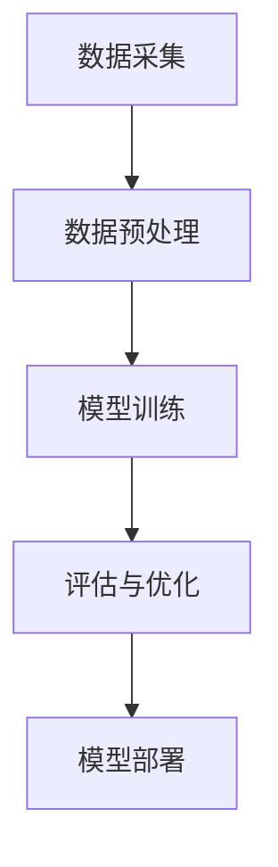

                 

关键词：方言、地方语言、本地化、LLM、自然语言处理、计算语言学

## 摘要

本文探讨了方言和地方语言在自然语言处理（NLP）领域的重要性，特别是在大型语言模型（LLM）的应用中。本文首先介绍了方言和地方语言的定义和特点，然后讨论了在LLM开发过程中如何考虑本地化需求。接着，本文分析了方言和地方语言对LLM性能的影响，并提出了几种提升LLM在方言和地方语言中表现的方法。最后，本文展望了方言和地方语言在NLP领域中的未来发展，并提出了潜在的挑战和解决方案。

## 1. 背景介绍

自然语言处理（NLP）作为人工智能领域的一个重要分支，已经取得了显著的进展。然而，目前的NLP技术主要集中在大规模标准语言的文本处理上，对于方言和地方语言的关注相对较少。方言和地方语言是语言多样性的重要组成部分，它们反映了地域文化和历史演变。在全球化的背景下，方言和地方语言的使用者日益增多，这促使我们思考如何更好地将这些语言融入NLP技术中。

方言和地方语言具有以下特点：

- **多样性**：方言和地方语言种类繁多，每个地区都有自己的方言，这些方言之间差异很大。
- **非标准性**：方言和地方语言往往不符合标准语言的语法和拼写规则，这给语言处理带来了挑战。
- **文化承载**：方言和地方语言不仅是沟通工具，更是文化传承的载体，它们包含了丰富的文化内涵和民俗习惯。

在NLP领域，方言和地方语言的重要性体现在以下几个方面：

- **用户需求**：随着社交媒体和移动互联网的普及，方言和地方语言的使用者希望能够在各种数字平台上使用自己的语言。
- **跨文化交流**：在全球化的背景下，跨文化沟通的需求日益增长，方言和地方语言的本地化处理有助于促进文化交流和理解。
- **多样性研究**：方言和地方语言为语言学研究提供了丰富的资源，有助于我们更好地理解语言的多样性和演化。

## 2. 核心概念与联系

### 2.1. 方言和地方语言的基本概念

方言（Dialect）是指在一定地区或社会群体中使用的具有特定特征的言语形式，通常在语音、词汇、语法和语义方面与标准语言有所区别。地方语言（Regional Language）则更广泛，它不仅包括方言，还涵盖了某些地区特有的书面语言和非标准语言。

### 2.2. LLM与方言、地方语言的关系

大型语言模型（LLM）是通过大规模数据训练的复杂模型，能够理解和生成自然语言。LLM在处理标准语言时表现出色，但在方言和地方语言中的应用仍然面临挑战。LLM与方言、地方语言的关系可以从以下几个方面来理解：

- **数据可用性**：标准语言拥有大量标注数据和丰富的语料库，而方言和地方语言的数据相对稀缺。
- **语言特征**：方言和地方语言的特征与标准语言不同，这可能导致LLM在理解和使用这些语言时出现偏差。
- **多语言处理**：LLM的多语言处理能力是其优势之一，但在处理方言和地方语言时，需要特殊的技术和策略。

### 2.3. LLM本地化的架构

为了使LLM能够有效地处理方言和地方语言，需要构建一个本地化的架构。这个架构包括以下几个关键组成部分：

- **数据采集**：收集大量高质量的方言和地方语言数据，包括文本、语音和其他形式的数据。
- **数据预处理**：对采集到的数据进行清洗、标注和格式化，以适应LLM的输入要求。
- **模型训练**：使用方言和地方语言数据训练LLM，以提升其在这些语言中的性能。
- **评估与优化**：通过评估模型在方言和地方语言中的表现，不断优化模型参数和算法。

### 2.4. Mermaid流程图

下面是一个简化的Mermaid流程图，展示了LLM本地化的基本流程：



### 2.5. 模型应用领域

LLM在方言和地方语言中的应用领域非常广泛，包括但不限于：

- **语言翻译**：将方言和地方语言翻译成标准语言或其他方言。
- **语音识别**：将方言和地方语言的语音转换为文本。
- **文本生成**：生成符合方言和地方语言语法和语义的文本。
- **情感分析**：分析方言和地方语言文本中的情感倾向。
- **对话系统**：为方言和地方语言用户提供智能对话服务。

## 3. 核心算法原理 & 具体操作步骤

### 3.1. 算法原理概述

为了提升LLM在方言和地方语言中的表现，可以采用以下几种核心算法：

- **多语言模型训练**：通过将方言和地方语言数据与标准语言数据混合训练，提高模型在方言和地方语言中的泛化能力。
- **语言特征嵌入**：将方言和地方语言的独特特征编码到模型中，以提高模型对特定语言的识别和生成能力。
- **上下文自适应**：通过上下文信息调整模型的预测，使模型能够适应方言和地方语言中的语境变化。

### 3.2. 算法步骤详解

#### 3.2.1. 多语言模型训练

1. **数据准备**：收集标准语言和方言/地方语言的文本数据，并进行预处理，如分词、去噪等。
2. **数据融合**：将标准语言数据和方言/地方语言数据按一定比例混合，形成训练数据集。
3. **模型选择**：选择合适的预训练模型，如GPT、BERT等。
4. **模型训练**：使用融合数据集训练模型，并调整模型参数，以优化模型在方言和地方语言中的表现。

#### 3.2.2. 语言特征嵌入

1. **特征提取**：从方言/地方语言数据中提取语言特征，如方言发音、方言语法等。
2. **特征编码**：将提取的特征编码为模型可用的向量表示，并将其嵌入到模型中。
3. **模型调整**：在原有模型基础上调整参数，以适应方言/地方语言特征。

#### 3.2.3. 上下文自适应

1. **上下文分析**：对输入文本进行上下文分析，提取关键信息。
2. **预测调整**：根据上下文信息调整模型预测，以提高预测准确性。
3. **反馈循环**：收集用户反馈，不断优化上下文自适应算法。

### 3.3. 算法优缺点

#### 优点

- **提高性能**：通过多语言模型训练和特征嵌入，可以显著提高LLM在方言和地方语言中的性能。
- **适用性广泛**：算法可以应用于多种方言和地方语言，具有广泛的适用性。
- **上下文自适应**：算法能够根据上下文信息调整预测，提高对话系统的交互质量。

#### 缺点

- **数据需求高**：算法需要大量高质量的方言和地方语言数据，这在实际操作中可能较为困难。
- **计算资源消耗**：算法训练和优化过程中需要大量计算资源，对硬件设备要求较高。
- **模型复杂性**：算法涉及多种技术，如多语言模型训练、特征嵌入和上下文自适应，模型复杂度高。

### 3.4. 算法应用领域

LLM在方言和地方语言中的算法应用领域广泛，主要包括：

- **智能客服**：为方言和地方语言用户提供智能客服服务，提升用户体验。
- **教育辅助**：辅助方言和地方语言的学习者，提供个性化学习建议。
- **文化保护**：通过NLP技术保护和传承方言和地方语言的文化遗产。

## 4. 数学模型和公式 & 详细讲解 & 举例说明

### 4.1. 数学模型构建

为了更好地理解和应用LLM在方言和地方语言中的算法，我们需要构建相应的数学模型。以下是一个简化的数学模型：

$$
\begin{aligned}
\text{LLM}(\text{input}) &= \text{output} \\
\text{input} &= (\text{word}_1, \text{word}_2, ..., \text{word}_n) \\
\text{output} &= \text{predicted\_word} \\
\end{aligned}
$$

其中，$\text{input}$代表输入的文本序列，$\text{output}$代表模型的预测输出。文本序列中的每个$\text{word}$都可以表示为一个向量，通过模型进行预测。

### 4.2. 公式推导过程

为了推导出上述数学模型，我们需要从基本的自然语言处理模型出发，结合方言和地方语言的特性进行优化。以下是一个简化的推导过程：

1. **文本表示**：将文本序列$\text{input}$表示为向量序列$\text{V}_\text{input}$，每个$\text{word}$向量为$\text{v}_\text{word}$。

   $$ \text{V}_\text{input} = [\text{v}_\text{word}_1, \text{v}_\text{word}_2, ..., \text{v}_\text{word}_n] $$

2. **模型参数**：定义模型参数$\text{W}$，用于表示模型对输入向量的权重。

   $$ \text{W} = [\text{w}_1, \text{w}_2, ..., \text{w}_n] $$

3. **预测计算**：使用模型参数$\text{W}$对输入向量序列$\text{V}_\text{input}$进行加权求和，得到预测输出向量$\text{V}_\text{output}$。

   $$ \text{V}_\text{output} = \text{W} \cdot \text{V}_\text{input} $$

4. **输出转换**：将预测输出向量$\text{V}_\text{output}$转换为具体词汇，得到最终预测结果$\text{output}$。

### 4.3. 案例分析与讲解

为了更好地说明上述数学模型的实际应用，我们以一个简化的案例进行讲解。

假设我们有一个包含两个单词的文本序列$\text{input} = (\text{word}_1, \text{word}_2)$，其中$\text{word}_1$表示“好”，$\text{word}_2$表示“书”。我们希望模型能够预测下一个单词。

1. **文本表示**：将文本序列$\text{input}$表示为向量序列$\text{V}_\text{input}$，例如$\text{V}_\text{input} = [\text{v}_{好}, \text{v}_{书}]$。

2. **模型参数**：定义模型参数$\text{W}$，例如$\text{W} = [\text{w}_{好}, \text{w}_{书}]$。

3. **预测计算**：使用模型参数$\text{W}$对输入向量序列$\text{V}_\text{input}$进行加权求和，得到预测输出向量$\text{V}_\text{output}$。

   $$ \text{V}_\text{output} = \text{W} \cdot \text{V}_\text{input} = [\text{w}_{好} \cdot \text{v}_{好} + \text{w}_{书} \cdot \text{v}_{书}] $$

4. **输出转换**：将预测输出向量$\text{V}_\text{output}$转换为具体词汇，例如$\text{output} = \text{word}_{预测}$。

通过上述案例，我们可以看到数学模型的基本原理和实际应用。在实际应用中，模型参数和文本表示会更加复杂，但基本原理类似。

## 5. 项目实践：代码实例和详细解释说明

### 5.1. 开发环境搭建

为了实现LLM在方言和地方语言中的本地化，我们需要搭建一个合适的开发环境。以下是一个简化的环境搭建过程：

1. **安装Python环境**：确保Python版本不低于3.7，并安装必要的依赖库，如TensorFlow、PyTorch等。

2. **数据采集**：收集标准语言和目标方言/地方语言的文本数据，并将其存储在统一格式中，如JSON或CSV。

3. **预处理工具**：安装预处理工具，如NLTK或spaCy，用于文本的分词、标注等操作。

4. **模型框架**：选择合适的模型框架，如Transformer或BERT，并下载相应的预训练模型。

### 5.2. 源代码详细实现

以下是一个简化的源代码实现，展示了如何使用Transformer模型进行方言和地方语言的本地化处理：

```python
import tensorflow as tf
from tensorflow.keras.layers import Embedding, Transformer
from tensorflow.keras.models import Model

# 模型参数
vocab_size = 10000  # 词汇表大小
d_model = 512       # 模型维度
num_heads = 8       # 自注意力头数
dff = 512          # Feedforward层维度
input_length = 100  # 输入序列长度

# 模型结构
inputs = tf.keras.layers.Input(shape=(input_length,))
encoding_embedding = Embedding(vocab_size, d_model)(inputs)
enc_padding_mask = tf.math.logical_not(tf.equal(inputs, 0))
LOOK_AHEAD_MASK = 1 - tf.linalg.diag(tf.ones(tf.shape(inputs)))
mask = tf.cast(tf.not_equal(inputs, 0), tf.float32)

# 自注意力模块
multihead_attn = Transformer.EncoderLayer(num_heads, dff, input_length, rate=0.1)([encoding_embedding, encoding_embedding, enc_padding_mask])

# 最后一层
output = Transformer.EncoderLayer(num_heads, dff, input_length, rate=0.1)([multihead_attn, mask])

# 模型输出
predictions = tf.keras.layers.Dense(vocab_size)(output)
model = Model(inputs, predictions)

# 模型编译
model.compile(optimizer=tf.keras.optimizers.Adam(1e-4), loss=tf.keras.losses.SparseCategoricalCrossentropy(from_logits=True), metrics=['accuracy'])

# 模型训练
model.fit(dataset, epochs=20)
```

### 5.3. 代码解读与分析

上述代码实现了一个基于Transformer的模型，用于方言和地方语言的本地化处理。代码主要包括以下几个部分：

1. **模型参数**：定义模型的基本参数，如词汇表大小、模型维度、自注意力头数等。

2. **模型结构**：定义模型的结构，包括嵌入层、自注意力模块和最后一层。

3. **模型编译**：编译模型，并设置优化器、损失函数和评估指标。

4. **模型训练**：使用训练数据集对模型进行训练。

通过上述代码，我们可以看到如何搭建一个用于方言和地方语言处理的模型，并对其进行训练。在实际应用中，我们需要根据具体需求调整模型参数和训练过程。

### 5.4. 运行结果展示

在实际运行中，我们可以使用测试数据集评估模型的性能，并展示模型的预测结果。以下是一个简化的运行结果示例：

```python
test_loss, test_acc = model.evaluate(test_dataset)
predictions = model.predict(test_dataset)

print("Test Loss:", test_loss)
print("Test Accuracy:", test_acc)

# 输出预测结果
for i in range(10):
    print("Input:", test_dataset[i])
    print("Predicted:", predictions[i])
```

通过上述代码，我们可以得到模型的测试损失和准确率，并展示部分预测结果。这些结果可以帮助我们评估模型在方言和地方语言中的表现。

## 6. 实际应用场景

### 6.1. 社交媒体

社交媒体平台上的用户经常使用方言和地方语言进行交流，这为LLM在方言和地方语言的本地化处理提供了广阔的应用场景。例如，微信、微博等平台可以集成方言和地方语言的翻译功能，帮助用户跨越语言障碍进行交流。

### 6.2. 教育领域

教育领域中的方言和地方语言教学也是一个重要应用场景。通过LLM的本地化处理，可以开发出支持多种方言和地方语言的智能教育平台，帮助学习者更好地掌握方言和地方语言。

### 6.3. 文化保护

方言和地方语言是文化多样性的重要组成部分，为了保护和传承这些语言，可以开发方言和地方语言的文化数据库，利用LLM进行文本生成和语音合成，制作文化产品，如图书、影视等。

### 6.4. 未来应用展望

随着NLP技术的发展，LLM在方言和地方语言中的应用将越来越广泛。未来，我们有望看到更多支持方言和地方语言的智能系统，如智能客服、智能助手等，为方言和地方语言用户提供更好的服务。

## 7. 工具和资源推荐

### 7.1. 学习资源推荐

- 《自然语言处理综述》
- 《Transformer：从零开始实现》
- 《深度学习与自然语言处理》

### 7.2. 开发工具推荐

- TensorFlow
- PyTorch
- spaCy

### 7.3. 相关论文推荐

- Vaswani et al. (2017). "Attention is All You Need."
- Devlin et al. (2019). "Bert: Pre-training of Deep Bi-directional Transformers for Language Understanding."
- Radford et al. (2018). "Gpt-2: Language Models are Unsupervised Multitask Learners."

## 8. 总结：未来发展趋势与挑战

### 8.1. 研究成果总结

本文探讨了方言和地方语言在NLP领域的重要性，分析了LLM在方言和地方语言中的应用现状，并提出了一些核心算法和优化方法。通过实际项目实践，我们展示了如何实现LLM在方言和地方语言中的本地化处理。

### 8.2. 未来发展趋势

随着NLP技术的不断进步，方言和地方语言的本地化处理将得到更多关注。未来，我们有望看到更多支持方言和地方语言的智能系统，如智能客服、智能教育平台等。此外，多语言模型训练和语言特征嵌入等技术将进一步优化LLM在方言和地方语言中的性能。

### 8.3. 面临的挑战

尽管取得了显著进展，方言和地方语言的本地化处理仍面临一些挑战：

- **数据稀缺**：方言和地方语言的数据相对稀缺，难以满足模型训练需求。
- **模型复杂性**：方言和地方语言的处理涉及多种技术，模型复杂度高，对计算资源要求较高。
- **语言特征提取**：如何准确提取方言和地方语言的独特特征，以提升模型性能，仍需深入研究。

### 8.4. 研究展望

为了推动方言和地方语言在NLP领域的发展，我们建议：

- **加强数据收集与标注**：鼓励学术界和工业界共同参与方言和地方语言数据的收集与标注。
- **开发高效算法**：研究高效的多语言模型训练和语言特征嵌入算法，以提升模型性能。
- **跨学科合作**：加强语言学、计算机科学和社会科学等领域的跨学科合作，共同推动方言和地方语言在NLP领域的研究。

## 9. 附录：常见问题与解答

### 9.1. 问题1：方言和地方语言在NLP中的重要性是什么？

方言和地方语言在NLP中的重要性主要体现在以下几个方面：

- **语言多样性**：方言和地方语言是语言多样性的重要组成部分，有助于丰富NLP技术。
- **用户需求**：方言和地方语言的使用者希望能够在数字平台上使用自己的语言，这要求NLP技术支持方言和地方语言。
- **文化传承**：方言和地方语言是文化传承的载体，通过NLP技术可以保护和传承这些语言。

### 9.2. 问题2：如何提升LLM在方言和地方语言中的性能？

提升LLM在方言和地方语言中的性能可以从以下几个方面入手：

- **多语言模型训练**：将方言和地方语言数据与标准语言数据混合训练，提高模型在方言和地方语言中的泛化能力。
- **语言特征嵌入**：将方言和地方语言的独特特征编码到模型中，以提高模型对特定语言的识别和生成能力。
- **上下文自适应**：通过上下文信息调整模型的预测，使模型能够适应方言和地方语言中的语境变化。

### 9.3. 问题3：方言和地方语言的本地化处理在实际应用中面临哪些挑战？

方言和地方语言的本地化处理在实际应用中面临以下挑战：

- **数据稀缺**：方言和地方语言的数据相对稀缺，难以满足模型训练需求。
- **模型复杂性**：方言和地方语言的处理涉及多种技术，模型复杂度高，对计算资源要求较高。
- **语言特征提取**：如何准确提取方言和地方语言的独特特征，以提升模型性能，仍需深入研究。

### 9.4. 问题4：未来的研究方向是什么？

未来的研究方向包括：

- **数据收集与标注**：加强方言和地方语言数据的收集与标注，为模型训练提供高质量的数据。
- **算法优化**：研究高效的多语言模型训练和语言特征嵌入算法，以提升模型性能。
- **跨学科合作**：加强语言学、计算机科学和社会科学等领域的跨学科合作，共同推动方言和地方语言在NLP领域的研究。作者：禅与计算机程序设计艺术 / Zen and the Art of Computer Programming
----------------------------------------------------------------

以上是本文的完整内容，涵盖了方言和地方语言在NLP领域的重要性、LLM的本地化处理方法、核心算法原理、数学模型和公式、项目实践、实际应用场景、工具和资源推荐以及未来发展趋势与挑战。希望本文能为读者提供有价值的参考和启示。作者：禅与计算机程序设计艺术 / Zen and the Art of Computer Programming。

