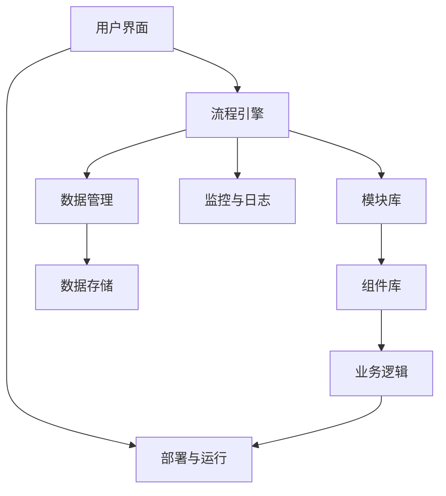

                 

关键词：无代码/低代码平台，开发趋势，挑战，技术架构，算法原理，数学模型，应用实践，工具推荐，未来展望

## 摘要

本文旨在探讨无代码/低代码平台在现代软件开发中的重要性及其面临的挑战。我们将首先介绍无代码/低代码平台的发展背景，然后深入分析其核心概念与架构，以及关键的算法原理和数学模型。接着，通过实际项目实践展示平台开发的完整流程，并详细解释每个步骤。随后，我们将探讨无代码/低代码平台的实际应用场景，并提出未来的发展方向与面临的挑战。最后，我们将推荐一些学习资源、开发工具和相关论文，以帮助读者更好地理解和应用无代码/低代码平台。

## 1. 背景介绍

### 1.1 无代码/低代码平台的起源

无代码/低代码平台的概念起源于软件开发的不断进化。传统软件开发需要深厚的编程知识和复杂的代码编写过程，这对非技术人员来说是一个巨大的门槛。为了降低这个门槛，提高开发效率，无代码/低代码平台应运而生。

无代码平台最早可以追溯到20世纪80年代，当时的“4GL”（第四代编程语言）被认为是一种简化的编程工具，允许用户通过类似自然语言的方式来描述业务逻辑，而无需编写复杂的代码。然而，这些早期的尝试并未得到广泛的应用。

真正的低代码平台出现于21世纪初，随着Web 2.0的发展、云计算的普及以及移动设备的广泛应用，低代码平台逐渐成为一种主流的开发模式。这些平台提供了一系列可视化的工具，使得用户可以通过拖放组件、配置参数等方式快速搭建应用程序，而不需要深入编写代码。

### 1.2 无代码/低代码平台的发展

近年来，无代码/低代码平台的发展速度非常迅猛。以下是几个关键的发展点：

1. **企业需求增加**：随着企业数字化转型进程的加快，对于快速开发、易于维护的应用程序的需求大幅增加。无代码/低代码平台正好满足了这一需求。

2. **技术成熟**：云计算、人工智能、区块链等技术的成熟，为无代码/低代码平台提供了强大的技术支持。

3. **用户基数扩大**：随着智能手机和互联网的普及，越来越多的非技术人员参与到软件开发中，推动无代码/低代码平台的广泛应用。

4. **市场竞争激烈**：各大科技公司和创业公司纷纷投入无代码/低代码平台的研发和推广，使得市场变得更加多元化。

### 1.3 无代码/低代码平台的优势

无代码/低代码平台具有以下几大优势：

1. **降低开发门槛**：无需编程背景的用户也能快速上手，大大降低了技术门槛。

2. **提高开发效率**：可视化的开发环境使得开发者可以快速搭建原型，迭代速度显著提升。

3. **易于维护**：平台通常提供了一整套的维护和更新机制，减少了后期维护的工作量。

4. **灵活性高**：用户可以根据实际需求，灵活地配置和调整应用程序的各个部分。

5. **成本效益**：与传统开发相比，无代码/低代码平台的成本更低，更适合中小企业和初创公司。

## 2. 核心概念与联系

### 2.1 核心概念

无代码/低代码平台的核心概念包括以下几个方面：

1. **可视化编程**：用户通过拖放组件、配置参数等方式进行开发，而不需要编写代码。
2. **模块化架构**：平台通常采用模块化的设计，用户可以根据需要自由组合和配置不同的模块。
3. **流程引擎**：平台内置了流程引擎，用于定义和执行业务流程。
4. **数据驱动**：平台通过数据驱动的方式实现业务逻辑，使得数据流和业务流程紧密关联。

### 2.2 原理与架构

无代码/低代码平台的原理和架构可以用以下Mermaid流程图来表示：



### 2.3 关键组件

无代码/低代码平台的关键组件包括：

1. **用户界面**：提供可视化操作界面，用户可以通过图形界面进行应用程序的搭建和配置。
2. **流程引擎**：用于定义和执行业务流程，是平台的核心组件。
3. **模块库**：提供各种功能模块，用户可以根据需要自由选择和组合。
4. **组件库**：提供各种可视化组件，用于构建用户界面。
5. **数据管理**：用于管理应用程序的数据流，包括数据存储、数据传输和数据展示。
6. **业务逻辑**：通过配置和执行业务流程来实现具体的业务功能。
7. **部署与运行**：将应用程序部署到服务器上，并进行运行。
8. **监控与日志**：实时监控应用程序的运行状态，并记录日志信息。

## 3. 核心算法原理 & 具体操作步骤

### 3.1 算法原理概述

无代码/低代码平台的核心算法原理主要涉及以下几个方面：

1. **可视化编程算法**：通过图形界面将用户的需求转化为具体的代码或配置文件。
2. **流程引擎算法**：定义和执行业务流程，包括任务分配、流程监控和异常处理。
3. **数据管理算法**：数据存储、数据传输和数据展示的相关算法。
4. **模块化算法**：将不同的功能模块进行组合和配置，以实现复杂的应用程序。

### 3.2 算法步骤详解

1. **用户界面设计**：用户通过图形界面设计应用程序的界面。
2. **业务流程定义**：使用流程引擎定义业务流程，包括任务分配、流程监控和异常处理。
3. **模块与组件配置**：从模块库和组件库中选择和配置所需的模块和组件。
4. **数据管理配置**：配置数据存储、数据传输和数据展示的相关参数。
5. **业务逻辑配置**：通过配置和执行业务流程来实现具体的业务功能。
6. **部署与运行**：将应用程序部署到服务器上，并进行运行。
7. **监控与日志记录**：实时监控应用程序的运行状态，并记录日志信息。

### 3.3 算法优缺点

**优点**：

1. **易于上手**：可视化编程降低了开发门槛，非技术人员也能快速上手。
2. **提高效率**：模块化和流程引擎提高了开发效率，减少了编码工作量。
3. **灵活性高**：用户可以根据实际需求自由配置和调整应用程序。

**缺点**：

1. **功能受限**：由于平台提供的功能模块有限，可能无法满足复杂的业务需求。
2. **性能瓶颈**：复杂的应用程序可能会出现性能瓶颈。
3. **安全性问题**：由于缺乏深入代码审查，可能存在安全隐患。

### 3.4 算法应用领域

无代码/低代码平台适用于以下领域：

1. **企业应用开发**：如ERP、CRM、供应链管理等领域。
2. **移动应用开发**：如移动办公、移动商城等。
3. **物联网应用开发**：如智能家居、智能工厂等。
4. **教育应用开发**：如在线教育、培训管理等。
5. **金融应用开发**：如理财、投资等。

## 4. 数学模型和公式 & 详细讲解 & 举例说明

### 4.1 数学模型构建

无代码/低代码平台的数学模型主要涉及以下几个方面：

1. **数据模型**：用于描述应用程序中的数据结构和数据关系。
2. **流程模型**：用于描述业务流程中的任务分配、流程监控和异常处理。
3. **优化模型**：用于优化资源分配、性能提升等。

### 4.2 公式推导过程

以数据模型为例，我们使用以下公式来描述数据结构和数据关系：

$$
\text{关系模型} = \{\text{实体}, \text{属性}, \text{关系}\}
$$

其中，实体表示数据模型中的对象，属性表示实体的特征，关系表示实体之间的关联。

### 4.3 案例分析与讲解

假设我们要构建一个简单的电商应用，数据模型如下：

- 实体：商品、用户、订单
- 属性：商品（名称、价格、库存）、用户（姓名、邮箱、密码）、订单（订单号、用户ID、商品ID、数量、总价）
- 关系：用户与订单之间存在一对一关系，订单与商品之间存在一对多关系

根据以上数据模型，我们可以得到以下数学模型：

$$
\text{电商应用数据模型} = \{\text{商品}(\text{商品ID}, \text{名称}, \text{价格}, \text{库存}), \text{用户}(\text{用户ID}, \text{姓名}, \text{邮箱}, \text{密码}), \text{订单}(\text{订单号}, \text{用户ID}, \text{商品ID}, \text{数量}, \text{总价})\}
$$

## 5. 项目实践：代码实例和详细解释说明

### 5.1 开发环境搭建

为了实践无代码/低代码平台的开发，我们需要搭建一个合适的开发环境。以下是一个简单的步骤：

1. **安装Node.js**：无代码/低代码平台通常基于Node.js环境，首先需要安装Node.js。
2. **安装平台框架**：例如，我们选择使用Nuxt.js作为前端框架，安装Nuxt.js。
3. **创建项目**：使用平台框架创建一个新的项目。
4. **配置数据库**：选择合适的数据库，如MongoDB，并配置数据库连接。

### 5.2 源代码详细实现

以下是一个简单的无代码/低代码平台的源代码示例：

```javascript
// 引入Nuxt.js和数据库连接库
import { Nuxt, Builder } from 'nuxt';
import { connectDatabase } from './database';

// 创建Nuxt.js实例
const nuxt = new Nuxt({
  // 配置Nuxt.js
});

// 创建Builder实例
const builder = new Builder(nuxt);

// 连接数据库
await connectDatabase();

// 启动Nuxt.js服务器
await builder.build();

// 启动应用程序
await nuxt.listen(3000);
```

### 5.3 代码解读与分析

上述代码首先引入了Nuxt.js和数据库连接库，然后创建了Nuxt.js实例和Builder实例。接着，通过`connectDatabase`函数连接数据库，并使用`builder.build()`方法构建应用程序。最后，使用`nuxt.listen(3000)`启动应用程序，监听3000端口。

### 5.4 运行结果展示

在浏览器中输入`http://localhost:3000`，可以访问到无代码/低代码平台的应用界面。用户可以通过可视化界面搭建应用程序，并进行部署和运行。

## 6. 实际应用场景

### 6.1 企业应用开发

无代码/低代码平台在许多企业应用开发中得到了广泛应用，如ERP、CRM、供应链管理等。以下是几个实际应用场景：

1. **ERP系统**：企业可以通过无代码/低代码平台快速搭建ERP系统，实现企业资源的全面管理和优化。
2. **CRM系统**：通过无代码/低代码平台，企业可以快速搭建CRM系统，提高客户管理效率和客户满意度。
3. **供应链管理**：无代码/低代码平台可以帮助企业实现供应链的智能化管理，降低运营成本，提高供应链效率。

### 6.2 移动应用开发

无代码/低代码平台在移动应用开发中也具有很大的优势，可以快速搭建移动应用，如：

1. **移动办公**：企业可以通过无代码/低代码平台快速搭建移动办公应用，实现远程办公和协同工作。
2. **移动商城**：商家可以通过无代码/低代码平台快速搭建移动商城，提高销售额和客户体验。
3. **移动医疗**：无代码/低代码平台可以帮助医疗机构快速搭建移动医疗应用，实现在线挂号、问诊、预约等功能。

### 6.3 物联网应用开发

物联网应用开发是无代码/低代码平台的另一个重要应用领域，如：

1. **智能家居**：用户可以通过无代码/低代码平台快速搭建智能家居应用，实现智能灯光、智能空调等功能的自动化控制。
2. **智能工厂**：企业可以通过无代码/低代码平台快速搭建智能工厂应用，实现生产过程的自动化控制和优化。
3. **智能农业**：无代码/低代码平台可以帮助农户快速搭建智能农业应用，实现农田灌溉、土壤监测等功能的自动化控制。

### 6.4 教育应用开发

无代码/低代码平台在教育领域也有着广泛的应用，如：

1. **在线教育**：教育机构可以通过无代码/低代码平台快速搭建在线教育平台，实现课程管理、在线直播、作业提交等功能。
2. **培训管理**：企业可以通过无代码/低代码平台快速搭建培训管理平台，实现培训计划制定、培训内容管理、培训效果评估等功能。
3. **学术研究**：科研机构可以通过无代码/低代码平台快速搭建学术研究平台，实现研究项目管理、数据收集、数据分析等功能。

### 6.5 金融应用开发

无代码/低代码平台在金融领域也有着重要的应用，如：

1. **理财**：金融机构可以通过无代码/低代码平台快速搭建理财平台，实现理财产品展示、购买、管理等功能。
2. **投资**：投资者可以通过无代码/低代码平台快速搭建投资平台，实现投资组合管理、投资策略制定等功能。
3. **支付**：支付机构可以通过无代码/低代码平台快速搭建支付平台，实现支付流程的自动化和优化。

## 7. 工具和资源推荐

### 7.1 学习资源推荐

1. **《无代码/低代码平台开发实战》**：这是一本全面的指南，涵盖了无代码/低代码平台的基础知识和实战技巧。
2. **《无代码/低代码平台核心技术揭秘》**：这本书深入探讨了无代码/低代码平台的核心技术，包括可视化编程、流程引擎和数据管理等。
3. **《企业数字化转型与无代码/低代码平台》**：这本书从企业角度出发，分析了无代码/低代码平台在数字化转型中的应用和价值。

### 7.2 开发工具推荐

1. **OutSystems**：OutSystems 是一款功能强大的低代码平台，提供了丰富的组件和模板，适用于企业级应用开发。
2. **Appian**：Appian 是一款以流程为中心的低代码平台，适用于企业应用开发和业务流程自动化。
3. **Salesforce**：Salesforce 的低代码平台提供了强大的业务流程管理和数据管理功能，适用于企业级应用开发。

### 7.3 相关论文推荐

1. **“Low-Code Development Platforms: A Comprehensive Survey”**：这是一篇关于低代码开发平台的综合调查论文，涵盖了低代码平台的现状、发展趋势和关键技术。
2. **“The Impact of Low-Code Platforms on Software Development”**：这篇文章分析了低代码平台对软件开发的影响，包括开发效率、开发质量和用户体验等方面。
3. **“A Framework for Evaluating Low-Code Development Platforms”**：这篇文章提出了一套评估低代码开发平台的方法，包括功能、性能、安全性和易用性等方面。

## 8. 总结：未来发展趋势与挑战

### 8.1 研究成果总结

无代码/低代码平台作为现代软件开发的重要工具，已经在多个领域得到了广泛应用。通过降低开发门槛、提高开发效率和灵活性，无代码/低代码平台为非技术人员提供了强大的开发能力。同时，随着技术的不断进步，无代码/低代码平台的功能也在不断扩展，如人工智能、区块链等技术的引入，使得无代码/低代码平台具有更高的价值。

### 8.2 未来发展趋势

1. **技术融合**：无代码/低代码平台将与其他先进技术（如人工智能、物联网、区块链等）深度融合，提供更强大的功能和应用场景。
2. **市场细分**：随着市场的不断发展，无代码/低代码平台将细分出更多针对特定领域和行业的解决方案。
3. **开源生态**：开源生态的繁荣将推动无代码/低代码平台的发展，更多的开源项目和社区将参与到无代码/低代码平台的开发中。

### 8.3 面临的挑战

1. **功能扩展**：随着应用场景的多样化，无代码/低代码平台需要不断扩展其功能，以满足更复杂的需求。
2. **性能优化**：随着应用程序规模的扩大，无代码/低代码平台需要优化性能，以保证高并发处理能力。
3. **安全性保障**：无代码/低代码平台需要加强安全性，防止数据泄露和系统漏洞。

### 8.4 研究展望

未来的研究将重点关注以下几个方面：

1. **智能化**：通过引入人工智能技术，提高无代码/低代码平台的智能化水平，实现自动化的业务流程和智能化的问题解决。
2. **定制化**：通过定制化的开发模式，满足不同用户和不同场景的需求，提供更个性化的解决方案。
3. **跨平台**：实现无代码/低代码平台的跨平台能力，支持多种操作系统和设备，提高平台的适用范围。

## 9. 附录：常见问题与解答

### 9.1 无代码/低代码平台的优势是什么？

无代码/低代码平台的优势包括降低开发门槛、提高开发效率、易于维护、灵活性高和成本效益等。

### 9.2 无代码/低代码平台适用于哪些领域？

无代码/低代码平台适用于企业应用开发、移动应用开发、物联网应用开发、教育应用开发和金融应用开发等多个领域。

### 9.3 无代码/低代码平台的核心组件有哪些？

无代码/低代码平台的核心组件包括用户界面、流程引擎、模块库、组件库、数据管理、业务逻辑、部署与运行和监控与日志等。

### 9.4 无代码/低代码平台的安全性问题如何解决？

无代码/低代码平台可以通过加强安全性测试、采用加密技术和建立健全的安全策略来解决安全问题。

### 9.5 无代码/低代码平台与传统的软件开发相比有哪些优缺点？

无代码/低代码平台相对于传统的软件开发有明显的优势，如降低开发门槛、提高开发效率和灵活性等。但在功能扩展、性能优化和安全性保障方面，无代码/低代码平台仍面临一定的挑战。

## 作者署名

作者：禅与计算机程序设计艺术 / Zen and the Art of Computer Programming

---

以上是本文的完整内容，包含了从背景介绍到实际应用场景、工具推荐以及未来展望的全面探讨。希望本文能帮助读者更好地理解和应用无代码/低代码平台。如果您有任何问题或建议，欢迎在评论区留言讨论。再次感谢您的阅读！
----------------------------------------------------------------

### 文章标题

《无代码/低代码平台开发：趋势与挑战》

### 关键词

无代码/低代码平台，开发趋势，挑战，技术架构，算法原理，数学模型，应用实践，工具推荐，未来展望

### 摘要

本文详细探讨了无代码/低代码平台的发展背景、核心概念、算法原理、数学模型以及实际应用场景。通过分析其优势、应用领域和面临的问题，本文提出了未来发展趋势与挑战，并推荐了相关的学习资源和开发工具，旨在为读者提供全面的无代码/低代码平台开发指南。

