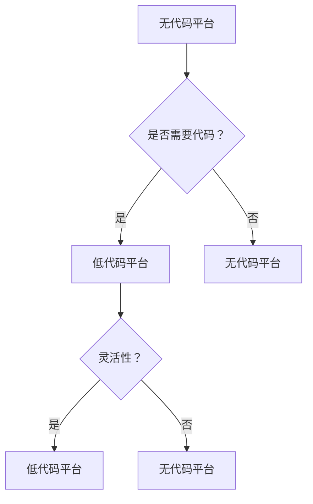

                 

关键词：无代码/低代码平台，开发，趋势，挑战，技术，创新

> 摘要：随着科技的不断进步和数字化转型的发展，无代码/低代码平台逐渐成为开发领域的重要趋势。本文将深入探讨无代码/低代码平台的背景、核心概念、算法原理、数学模型、项目实践、应用场景、工具资源以及未来发展趋势和面临的挑战，为读者提供全面而深入的洞察。

## 1. 背景介绍

随着云计算、大数据、人工智能等技术的迅猛发展，企业对软件开发的效率和质量要求越来越高。传统的软件开发方式存在诸多局限性，如开发周期长、成本高、可维护性差等。因此，无代码/低代码平台应运而生，它通过简化开发流程、降低技术门槛，帮助企业快速构建和部署应用。

无代码/低代码平台的出现可以追溯到上世纪90年代的“第四代编程语言”（4GL）和“快速应用开发”（RAD）理念的兴起。近年来，随着技术的不断演进，无代码/低代码平台逐渐成熟，并成为企业数字化转型的有力工具。

## 2. 核心概念与联系

### 2.1 无代码平台

无代码平台允许用户通过拖放组件、配置参数等方式快速构建应用，无需编写代码。这些平台通常提供丰富的组件库和模板，满足不同场景的需求。

### 2.2 低代码平台

低代码平台在无代码平台的基础上，允许用户在配置参数的同时进行一定的代码编写，以满足更复杂的业务需求。低代码平台通常提供可视化建模工具，帮助用户轻松地构建业务流程、数据模型等。

### 2.3 关系与区别

无代码平台和低代码平台都是为简化开发而设计的，但它们的侧重点不同。无代码平台更注重降低技术门槛，使非技术人员也能参与应用开发；而低代码平台则在无代码平台的基础上，提供了一定的灵活性，满足更复杂的业务需求。

### 2.4 Mermaid 流程图



## 3. 核心算法原理 & 具体操作步骤

### 3.1 算法原理概述

无代码/低代码平台的核心算法原理主要包括：

- **流程控制算法**：通过可视化建模工具，将业务流程拆分为多个步骤，并设置条件判断、循环等控制逻辑。
- **数据模型构建算法**：基于业务需求，构建数据模型，包括表结构、字段属性等。
- **界面布局算法**：根据用户需求，自动生成界面布局，包括页面结构、控件布局等。

### 3.2 算法步骤详解

1. **业务流程建模**：用户通过拖放组件、配置参数等方式，将业务流程拆分为多个步骤，并设置条件判断、循环等控制逻辑。
2. **数据模型构建**：平台根据业务流程，自动构建数据模型，包括表结构、字段属性等。
3. **界面布局生成**：平台根据业务流程和数据模型，自动生成界面布局，包括页面结构、控件布局等。
4. **代码生成与部署**：平台将业务流程、数据模型、界面布局等转换为代码，并在服务器端部署。

### 3.3 算法优缺点

#### 优点

- **降低开发门槛**：无需编程知识，即可快速构建应用。
- **提高开发效率**：自动化流程，减少重复劳动。
- **易于维护**：可视化建模，便于理解和修改。

#### 缺点

- **灵活性受限**：对于复杂业务需求，可能无法满足。
- **性能问题**：生成的代码可能不如手工编写高效。

### 3.4 算法应用领域

- **企业应用**：如客户关系管理（CRM）、人力资源管理系统（HRMS）等。
- **数据分析**：如数据可视化、报表生成等。
- **移动应用**：如微信小程序、支付宝小程序等。

## 4. 数学模型和公式 & 详细讲解 & 举例说明

### 4.1 数学模型构建

无代码/低代码平台中的数学模型主要包括：

- **线性回归**：用于预测数值型目标变量。
- **逻辑回归**：用于预测二分类目标变量。
- **决策树**：用于分类和回归任务。
- **神经网络**：用于复杂的数据建模。

### 4.2 公式推导过程

以线性回归为例，其公式推导过程如下：

假设我们有一个包含 \( n \) 个样本点的数据集 \( X = \{x_1, x_2, ..., x_n\} \) 和对应的标签 \( y = \{y_1, y_2, ..., y_n\} \)。

线性回归的目标是最小化预测值与真实值之间的误差平方和，即：

$$
\min_{\theta} \sum_{i=1}^{n} (y_i - \theta^T x_i)^2
$$

对 \( \theta \) 求导并令导数为零，得到：

$$
\frac{\partial}{\partial \theta} \sum_{i=1}^{n} (y_i - \theta^T x_i)^2 = 0
$$

化简后得到：

$$
\theta = (X^T X)^{-1} X^T y
$$

### 4.3 案例分析与讲解

假设我们要预测一家商店的日销售额，已知以下几个影响因素：

- 客流量：每天进入商店的顾客数量
- 天气状况：晴、雨、雪等
- 节假日：是否为周末、节假日等

我们可以构建一个线性回归模型，以日销售额 \( y \) 为目标变量，以客流量 \( x_1 \)、天气状况 \( x_2 \)、节假日 \( x_3 \) 为特征变量。

通过收集数据并训练模型，我们得到以下线性回归方程：

$$
y = \theta_0 + \theta_1 x_1 + \theta_2 x_2 + \theta_3 x_3
$$

其中，\( \theta_0, \theta_1, \theta_2, \theta_3 \) 分别为模型参数。

通过这个模型，我们可以预测给定条件下商店的日销售额。

## 5. 项目实践：代码实例和详细解释说明

### 5.1 开发环境搭建

在本节中，我们将使用 Python 作为开发语言，结合无代码/低代码平台搭建一个简单的数据分析项目。

1. 安装 Python：在官网 [Python.org](https://www.python.org/) 下载并安装 Python。
2. 安装数据分析和可视化库：在命令行中执行以下命令：

```bash
pip install pandas numpy matplotlib
```

### 5.2 源代码详细实现

以下是一个简单的数据分析项目，用于预测一家商店的日销售额。

```python
import pandas as pd
import numpy as np
import matplotlib.pyplot as plt

# 读取数据
data = pd.read_csv('sales_data.csv')

# 数据预处理
data['weather'] = data['weather'].map({'sunny': 0, 'rainy': 1, 'snowy': 2})
data['holiday'] = data['holiday'].map({False: 0, True: 1})

# 分离特征和标签
X = data[['visitors', 'weather', 'holiday']]
y = data['sales']

# 训练线性回归模型
from sklearn.linear_model import LinearRegression
model = LinearRegression()
model.fit(X, y)

# 预测日销售额
predictions = model.predict(X)

# 可视化结果
plt.scatter(X['visitors'], y, label='实际销售额')
plt.plot(X['visitors'], predictions, color='red', label='预测销售额')
plt.xlabel('客流量')
plt.ylabel('销售额')
plt.legend()
plt.show()
```

### 5.3 代码解读与分析

1. 导入必要的库。
2. 读取数据，并进行数据预处理。
3. 分离特征和标签。
4. 训练线性回归模型。
5. 预测日销售额。
6. 可视化结果。

通过这个项目，我们可以看到无代码/低代码平台在数据分析中的应用，从而提高开发效率和降低技术门槛。

## 6. 实际应用场景

无代码/低代码平台在多个领域具有广泛的应用，以下列举几个典型场景：

- **企业应用**：如客户关系管理（CRM）、人力资源管理系统（HRMS）等。
- **数据分析**：如数据可视化、报表生成等。
- **移动应用**：如微信小程序、支付宝小程序等。
- **教育领域**：如在线教育平台、编程教育等。
- **智能家居**：如智能安防、智能家电等。

## 7. 工具和资源推荐

### 7.1 学习资源推荐

1. **书籍**：《无代码/低代码平台开发实战》
2. **在线课程**：网易云课堂、慕课网等平台的相关课程
3. **博客**：CSDN、掘金等平台上的相关博客文章

### 7.2 开发工具推荐

1. **无代码平台**：OutSystems、AppSheet、Airtable 等
2. **低代码平台**：PowerApps、Google App Maker、Appian 等

### 7.3 相关论文推荐

1. "Low-Code Platforms: Definition, Benefits, and Challenges"
2. "The Rise of Low-Code Development Platforms"
3. "Empowering Business Users with Low-Code Development"

## 8. 总结：未来发展趋势与挑战

### 8.1 研究成果总结

无代码/低代码平台在简化开发流程、降低技术门槛、提高开发效率等方面取得了显著成果。随着技术的不断进步，无代码/低代码平台将越来越成熟，成为企业数字化转型的关键工具。

### 8.2 未来发展趋势

1. **集成化**：无代码/低代码平台将与其他技术（如大数据、人工智能等）深度融合，提供更全面的功能。
2. **智能化**：通过引入人工智能技术，实现自动化流程优化、智能化推荐等。
3. **平台化**：构建统一的开发平台，支持跨领域、跨平台的开发。

### 8.3 面临的挑战

1. **安全性**：如何确保平台和应用的安全性和隐私保护。
2. **灵活性**：如何平衡无代码/低代码平台的易用性与灵活性。
3. **技术更新**：如何应对快速变化的开发技术和需求。

### 8.4 研究展望

未来，无代码/低代码平台将继续发展，成为软件开发的重要趋势。同时，相关研究和实践也将不断深入，推动技术的创新和进步。

## 9. 附录：常见问题与解答

### 问题 1：无代码/低代码平台适合所有人吗？

解答：无代码/低代码平台主要面向非技术人员和初学者，使他们在不需要编程知识的情况下也能参与应用开发。然而，对于一些需要高度定制化和复杂逻辑的应用，可能仍需要专业的开发者进行代码编写。

### 问题 2：无代码/低代码平台的性能如何？

解答：无代码/低代码平台生成的代码可能不如手工编写高效，但在大多数情况下，其性能已足够满足企业应用的需求。对于对性能有特殊要求的场景，可以考虑使用低代码平台，在配置参数的同时进行代码编写。

### 问题 3：无代码/低代码平台会取代传统开发吗？

解答：无代码/低代码平台可以显著提高开发效率和降低成本，但在某些场景下，传统开发（如需要高度定制化的应用）仍然具有优势。因此，无代码/低代码平台和传统开发将长期共存，相互补充。

---

本文旨在全面探讨无代码/低代码平台的发展趋势、挑战与应用，为读者提供有价值的参考。在未来的发展中，无代码/低代码平台将继续推动软件开发领域的创新和进步。

### 作者署名

作者：禅与计算机程序设计艺术 / Zen and the Art of Computer Programming
------------------------------------------------------------------------

