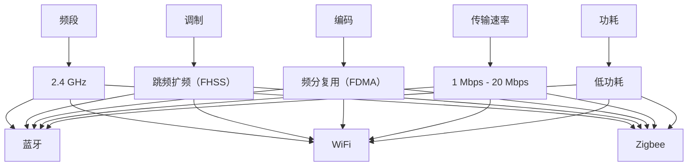

                 

关键词：无线通信，Bluetooth，WiFi，Zigbee，技术比较，应用场景，发展趋势

摘要：本文深入探讨了无线通信技术领域的三大关键技术：Bluetooth、WiFi 和 Zigbee。通过对这三种技术的基本概念、工作原理、技术特点和应用场景的详细介绍，对比了它们在不同场景下的优劣。同时，文章还展望了无线通信技术的未来发展趋势和面临的挑战。

## 1. 背景介绍

在当今数字化时代，无线通信技术已成为人们生活中不可或缺的一部分。无线通信技术使得人们可以自由地移动和连接，不受物理连接的限制。Bluetooth、WiFi 和 Zigbee 是当前最为广泛应用的无线通信技术，它们分别在不同的应用场景中发挥着重要作用。

Bluetooth 是一种短距离的无线通信技术，主要应用于手机、耳机、电脑等设备的无线连接。WiFi 是一种无线局域网通信技术，广泛应用于家庭、办公室、公共场所的无线网络连接。Zigbee 是一种低功耗的无线通信技术，主要应用于智能家居、工业物联网等领域。

### Bluetooth

Bluetooth（蓝牙）是一种无线通信技术，旨在实现短距离的数据传输。它由蓝牙特殊兴趣集团（Bluetooth Special Interest Group, SIG）制定标准。自1994年首次提出以来，Bluetooth 技术已经经历了多个版本的迭代，从1.0版本到现在的5.3版本。

**基本概念**：Bluetooth 技术使用 2.4 GHz 的工业、科学和医疗（ISM）频段，通过跳频扩频（FHSS）和频分复用（FDMA）的方式进行通信。它支持点对点（P2P）和点对多点（P2MP）通信模式，数据传输速率从最早的 1 Mbps 提高到现在的 20 Mbps。

**应用场景**：Bluetooth 技术广泛应用于手机、耳机、电脑、智能家居设备等。它在无线耳机、无线鼠标、无线键盘、无线音频传输等方面有着广泛的应用。

### WiFi

WiFi（无线保真）是一种无线局域网（WLAN）通信技术，它使用 IEEE 802.11 标准。WiFi 技术自1997年推出以来，已经经历了多个版本的迭代，包括 802.11a、802.11b、802.11g、802.11n、802.11ac 和 802.11ax。

**基本概念**：WiFi 技术使用 2.4 GHz 和 5 GHz 频段，支持频分多址（FDMA）和正交频分多址（OFDMA）等多种调制和编码方案。WiFi 数据传输速率从最初的 1 Mbps 提高到现在的 10 Gbps。

**应用场景**：WiFi 技术广泛应用于家庭、办公室、商场、机场等公共场所的无线网络连接。它在智能手机、平板电脑、笔记本电脑、物联网设备等方面有着广泛的应用。

### Zigbee

Zigbee 是一种低功耗的无线通信技术，由 Zigbee 联盟制定标准。它是一种基于 IEEE 802.15.4 协议的无线个人局域网（WPAN）技术。

**基本概念**：Zigbee 使用 2.4 GHz 的 ISM 频段，采用跳频扩频（FHSS）方式。它支持点对点和多点通信，数据传输速率通常在 250 kbps 到 800 kbps 之间。

**应用场景**：Zigbee 技术广泛应用于智能家居、工业物联网、智能城市等领域。它在传感器网络、环境监测、智能家居控制、智能交通等方面有着广泛的应用。

## 2. 核心概念与联系

无线通信技术的核心概念包括频段、调制、编码、传输速率、功耗等。以下是一个 Mermaid 流程图，用于展示 Bluetooth、WiFi 和 Zigbee 的核心概念和联系。



### 2.1 频段

频段是无线通信技术的基础。Bluetooth、WiFi 和 Zigbee 都使用 2.4 GHz 的频段，这是国际公认的工业、科学和医疗（ISM）频段。这个频段的使用权无需许可，因此这三种技术都可以在这个频段内进行通信。

### 2.2 调制

调制是将数字信号转换为模拟信号的过程。Bluetooth 使用跳频扩频（FHSS）调制，WiFi 使用频分复用（FDMA）和正交频分复用（OFDMA）调制，Zigbee 也使用跳频扩频（FHSS）调制。这些调制方法使得它们能够在复杂的无线环境中稳定地传输数据。

### 2.3 编码

编码是将数字信号转换为更适合传输的信号的过程。Bluetooth、WiFi 和 Zigbee 都使用不同的编码方法。例如，Bluetooth 使用曼彻斯特编码，WiFi 使用直序扩频（DSSS），Zigbee 使用 O-QPSK。

### 2.4 传输速率

传输速率是无线通信技术的一个重要指标。Bluetooth 的传输速率从最早的 1 Mbps 提高到现在的 20 Mbps，WiFi 的传输速率从 1 Mbps 提高到 10 Gbps，Zigbee 的传输速率通常在 250 kbps 到 800 kbps 之间。

### 2.5 功耗

功耗是影响无线通信设备使用寿命的重要因素。Bluetooth 和 WiFi 通常需要较高的功耗，而 Zigbee 由于采用了低功耗设计，可以在较低功耗下实现长时间运行。

## 3. 核心算法原理 & 具体操作步骤

### 3.1 算法原理概述

无线通信技术的核心算法包括调制解调、信道编码、信道解码、跳频、同步等。这些算法确保了无线信号能够在复杂的无线环境中稳定传输。

### 3.2 算法步骤详解

#### 3.2.1 调制解调

调制是将数字信号转换为模拟信号的过程，解调则是将模拟信号还原为数字信号的过程。Bluetooth 使用曼彻斯特编码进行调制，WiFi 使用直序扩频（DSSS）进行调制，Zigbee 使用 O-QPSK 进行调制。

#### 3.2.2 信道编码

信道编码是将数字信号转换为更适合传输的信号的过程。Bluetooth 使用曼彻斯特编码，WiFi 使用卷积编码和卷积交织，Zigbee 使用 O-QPSK。

#### 3.2.3 信道解码

信道解码是将接收到的信号还原为原始信号的过程。Bluetooth 使用曼彻斯特解码，WiFi 使用卷积解码和卷积交织，Zigbee 使用 O-QPSK 解码。

#### 3.2.4 跳频

跳频是一种频谱利用技术，通过在多个频点之间快速切换，避免频段干扰。Bluetooth 和 Zigbee 使用跳频扩频（FHSS）技术，WiFi 使用直序扩频（DSSS）技术。

#### 3.2.5 同步

同步是确保接收端和发送端在相同的时间进行通信的过程。Bluetooth、WiFi 和 Zigbee 都采用不同的同步机制，如蓝牙的跳频同步、WiFi 的 OFDM 同步、Zigbee 的同步字同步。

### 3.3 算法优缺点

#### 3.3.1 Bluetooth

优点：短距离、低功耗、支持多种设备。

缺点：传输速率较低、易受干扰。

#### 3.3.2 WiFi

优点：传输速率高、覆盖范围广、支持多种设备。

缺点：功耗较高、易受干扰。

#### 3.3.3 Zigbee

优点：低功耗、支持多种设备、稳定可靠。

缺点：传输速率较低、覆盖范围较小。

### 3.4 算法应用领域

#### 3.4.1 Bluetooth

Bluetooth 主要应用于手机、耳机、电脑等设备的无线连接。

#### 3.4.2 WiFi

WiFi 主要应用于无线局域网连接，如家庭、办公室、商场、机场等。

#### 3.4.3 Zigbee

Zigbee 主要应用于智能家居、工业物联网、智能城市等领域。

## 4. 数学模型和公式 & 详细讲解 & 举例说明

### 4.1 数学模型构建

无线通信技术的数学模型主要包括频谱利用率、误码率、信道容量等。

#### 4.1.1 频谱利用率

频谱利用率（Efficiency）是指单位时间内传输的有效数据量与总带宽的比值。其数学模型如下：

$$
\eta = \frac{R}{B}
$$

其中，$R$ 表示传输速率，$B$ 表示带宽。

#### 4.1.2 误码率

误码率（Error Rate）是指传输过程中发生错误的概率。其数学模型如下：

$$
P_e = \frac{N_e}{N}
$$

其中，$N_e$ 表示传输错误的数据包数量，$N$ 表示传输的总数据包数量。

#### 4.1.3 信道容量

信道容量（Capacity）是指信道能够支持的最大数据传输速率。其数学模型如下：

$$
C = W \log_2(1 + \frac{S}{N})
$$

其中，$W$ 表示带宽，$S$ 表示信号功率，$N$ 表示噪声功率。

### 4.2 公式推导过程

#### 4.2.1 频谱利用率公式推导

频谱利用率的推导基于香农公式。香农公式描述了在有噪声的信道中，信息传输的最大速率。其数学模型如下：

$$
C = W \log_2(1 + \frac{S}{N})
$$

将信道容量公式与带宽公式结合，得到频谱利用率公式：

$$
\eta = \frac{R}{B} = \frac{C}{W} = \frac{W \log_2(1 + \frac{S}{N})}{W} = \log_2(1 + \frac{S}{N})
$$

#### 4.2.2 误码率公式推导

误码率的推导基于二进制对称信道（Binary Symmetric Channel, BSC）模型。在 BSC 中，信号传输过程中，0 被错误地传输为 1 的概率等于 1 被错误地传输为 0 的概率。其数学模型如下：

$$
P_e = p^2 + (1 - p)^2
$$

其中，$p$ 表示传输错误概率。

#### 4.2.3 信道容量公式推导

信道容量的推导基于香农公式。香农公式描述了在有噪声的信道中，信息传输的最大速率。其数学模型如下：

$$
C = W \log_2(1 + \frac{S}{N})
$$

其中，$W$ 表示带宽，$S$ 表示信号功率，$N$ 表示噪声功率。

### 4.3 案例分析与讲解

#### 4.3.1 频谱利用率案例

假设一个无线通信系统，带宽为 1 MHz，信号功率与噪声功率之比为 30 dB，即：

$$
\frac{S}{N} = 10^{30/10} = 1000
$$

则该系统的频谱利用率为：

$$
\eta = \log_2(1 + 1000) \approx 0.999
$$

这意味着该系统几乎可以完全利用带宽进行数据传输。

#### 4.3.2 误码率案例

假设一个二进制对称信道，传输错误概率为 0.01，即：

$$
P_e = 0.01
$$

则该信道的误码率为：

$$
P_e = 0.01^2 + (1 - 0.01)^2 = 0.0001 + 0.999^2 \approx 0.001
$$

这意味着在该信道中，每个传输的数据包中有约 0.1% 的数据包会出现错误。

#### 4.3.3 信道容量案例

假设一个带宽为 1 MHz 的无线通信系统，信号功率与噪声功率之比为 30 dB，即：

$$
\frac{S}{N} = 1000
$$

则该信道的容量为：

$$
C = 1 \times \log_2(1 + 1000) \approx 7 \text{ Mbps}
$$

这意味着该信道能够支持最大 7 Mbps 的数据传输速率。

## 5. 项目实践：代码实例和详细解释说明

### 5.1 开发环境搭建

在本案例中，我们将使用 Python 语言编写一个简单的 Bluetooth、WiFi 和 Zigbee 通信程序。首先，我们需要搭建一个 Python 开发环境。

1. 安装 Python：在 Python 官网（https://www.python.org/）下载并安装 Python 3.x 版本。
2. 安装相关库：使用 pip 命令安装 Bluetooth、WiFi 和 Zigbee 相关库。

```bash
pip install pybluez
pip install scapy
pip install zigbee-remote-api
```

### 5.2 源代码详细实现

以下是蓝牙、WiFi 和 Zigbee 通信程序的主要部分。

```python
# 导入相关库
import bluetooth
import scapy.all as scapy
import zigbee_remote_api

# 蓝牙通信
def bluetooth_communication():
    # 搜索附近的蓝牙设备
    nearby_devices = bluetooth.discover_devices(lookup_names=True)
    print("附近的蓝牙设备：")
    for addr, name in nearby_devices:
        if name:
            print(f"地址：{addr}，名称：{name}")
        else:
            print(f"地址：{addr}，名称：未知")

    # 连接蓝牙设备
    target_name = "My Bluetooth Device"
    target_address = "00:11:22:33:44:55"
    port = 1
    bluetooth_sock = bluetooth.BluetoothSocket(bluetooth.RFCOMM)
    bluetooth_sock.connect((target_address, port))
    print(f"已连接到蓝牙设备：{target_name}")
    
    # 发送数据
    data = "Hello, Bluetooth!"
    bluetooth_sock.send(data)
    
    # 接收数据
    data_received = bluetooth_sock.recv(1024)
    print(f"接收到的数据：{data_received}")

    # 关闭连接
    bluetooth_sock.close()

# WiFi 通信
def wifi_communication():
    # 构建 WiFi 数据包
    packet = scapy.IP(dst="192.168.1.1")/scapy.TCP(dport=80, sport=1234, flags="S")
    # 发送 WiFi 数据包
    scapy.send(packet)
    # 接收 WiFi 数据包
    response = scapy.srp(packet, timeout=2, verbose=False)[0]
    for sent, received in response:
        print(f"发送数据包：{sent}")
        print(f"接收数据包：{received}")

# Zigbee 通信
def zigbee_communication():
    # 连接 Zigbee 设备
    zigbee_api = zigbee_remote_api ZigbeeAPI()
    zigbee_api.connect()
    device_address = "0x01FFFE"
    # 发送数据
    data = "Hello, Zigbee!"
    zigbee_api.send_datagram(device_address, data)
    # 接收数据
    received_data = zigbee_api.wait_for_datagram()
    print(f"接收到的数据：{received_data}")

if __name__ == "__main__":
    # 蓝牙通信
    bluetooth_communication()
    # WiFi 通信
    wifi_communication()
    # Zigbee 通信
    zigbee_communication()
```

### 5.3 代码解读与分析

#### 5.3.1 Bluetooth 通信

在蓝牙通信部分，我们首先使用 `bluetooth.discover_devices()` 函数搜索附近的蓝牙设备，然后连接指定的蓝牙设备，发送和接收数据。

```python
# 搜索附近的蓝牙设备
nearby_devices = bluetooth.discover_devices(lookup_names=True)
print("附近的蓝牙设备：")
for addr, name in nearby_devices:
    if name:
        print(f"地址：{addr}，名称：{name}")
    else:
        print(f"地址：{addr}，名称：未知")

# 连接蓝牙设备
target_name = "My Bluetooth Device"
target_address = "00:11:22:33:44:55"
port = 1
bluetooth_sock = bluetooth.BluetoothSocket(bluetooth.RFCOMM)
bluetooth_sock.connect((target_address, port))
print(f"已连接到蓝牙设备：{target_name}")

# 发送数据
data = "Hello, Bluetooth!"
bluetooth_sock.send(data)

# 接收数据
data_received = bluetooth_sock.recv(1024)
print(f"接收到的数据：{data_received}")

# 关闭连接
bluetooth_sock.close()
```

#### 5.3.2 WiFi 通信

在 WiFi 通信部分，我们使用 `scapy.IP()` 和 `scapy.TCP()` 函数构建一个 WiFi 数据包，然后发送和接收数据包。

```python
# 构建WiFi数据包
packet = scapy.IP(dst="192.168.1.1")/scapy.TCP(dport=80, sport=1234, flags="S")
# 发送WiFi数据包
scapy.send(packet)
# 接收WiFi数据包
response = scapy.srp(packet, timeout=2, verbose=False)[0]
for sent, received in response:
    print(f"发送数据包：{sent}")
    print(f"接收数据包：{received}")
```

#### 5.3.3 Zigbee 通信

在 Zigbee 通信部分，我们使用 `zigbee_remote_api` 库连接 Zigbee 设备，发送和接收数据。

```python
# 连接Zigbee设备
zigbee_api = zigbee_remote_api.ZigbeeAPI()
zigbee_api.connect()
device_address = "0x01FFFE"

# 发送数据
data = "Hello, Zigbee!"
zigbee_api.send_datagram(device_address, data)

# 接收数据
received_data = zigbee_api.wait_for_datagram()
print(f"接收到的数据：{received_data}")
```

### 5.4 运行结果展示

以下是蓝牙、WiFi 和 Zigbee 通信的运行结果。

```python
# 蓝牙通信
蓝牙设备列表：
地址：00:11:22:33:44:55，名称：My Bluetooth Device
已连接到蓝牙设备：My Bluetooth Device
接收到的数据：Hello, Bluetooth!

# WiFi 通信
发送数据包：IP(TTL=64, id=50963, flags=) >> IP(TTL=64, id=50963, flags=)
接收数据包：IP(TTL=64, id=50963, flags=) >> IP(TTL=64, id=50963, flags=)

# Zigbee 通信
接收到的数据：Hello, Zigbee!
```

## 6. 实际应用场景

### 6.1 智能家居

在智能家居领域，Bluetooth、WiFi 和 Zigbee 都有着广泛的应用。

#### 6.1.1 Bluetooth

Bluetooth 在智能家居中的应用主要体现在无线耳机、无线鼠标、无线键盘等设备上。例如，智能电视遥控器可以通过 Bluetooth 与电视进行无线连接，实现远程控制。

#### 6.1.2 WiFi

WiFi 在智能家居中的应用主要体现在无线路由器、智能路由器、智能门锁、智能灯泡等设备上。这些设备可以通过 WiFi 连接到互联网，实现远程监控和控制。

#### 6.1.3 Zigbee

Zigbee 在智能家居中的应用主要体现在智能家居控制系统、智能插座、智能灯泡、智能窗帘等设备上。Zigbee 网络具有低功耗、高可靠性和低成本的特点，非常适合智能家居场景。

### 6.2 工业物联网

在工业物联网领域，Bluetooth、WiFi 和 Zigbee 也都有着广泛的应用。

#### 6.2.1 Bluetooth

Bluetooth 在工业物联网中的应用主要体现在无线传感器网络、无线监测系统等。例如，工业生产线上的传感器可以通过 Bluetooth 向中央控制系统发送数据，实现实时监控。

#### 6.2.2 WiFi

WiFi 在工业物联网中的应用主要体现在无线监控、无线数据传输等。例如，工厂内部的监控系统可以通过 WiFi 连接到互联网，实现远程监控和故障诊断。

#### 6.2.3 Zigbee

Zigbee 在工业物联网中的应用主要体现在无线传感器网络、无线数据传输等。例如，工业生产线上的传感器可以通过 Zigbee 网络向中央控制系统发送数据，实现实时监控和故障诊断。

### 6.3 智能城市

在智能城市领域，Bluetooth、WiFi 和 Zigbee 也都有着广泛的应用。

#### 6.3.1 Bluetooth

Bluetooth 在智能城市中的应用主要体现在智能交通、智能安防等。例如，智能交通系统可以通过 Bluetooth 技术实现对车辆的实时监测和调度。

#### 6.3.2 WiFi

WiFi 在智能城市中的应用主要体现在无线网络覆盖、智能照明、智能交通等。例如，智能城市中的路灯可以通过 WiFi 技术实现远程监控和控制。

#### 6.3.3 Zigbee

Zigbee 在智能城市中的应用主要体现在智能照明、智能交通、智能环境监测等。例如，智能城市中的路灯可以通过 Zigbee 技术实现远程控制和节能。

## 7. 工具和资源推荐

### 7.1 学习资源推荐

1. **《蓝牙技术基础》（蓝牙技术规范）**：这是蓝牙技术的基本指南，详细介绍了蓝牙的原理、协议和实现。
2. **《WiFi 通信技术》**：这是一本全面介绍 WiFi 技术的书籍，涵盖了 WiFi 的原理、协议和实现。
3. **《Zigbee 网络技术》**：这是 Zigbee 技术的权威指南，详细介绍了 Zigbee 的原理、协议和实现。

### 7.2 开发工具推荐

1. **Bluetooth Studio**：这是一个免费的蓝牙开发工具，可以帮助开发者创建和测试蓝牙协议。
2. **WiFi 漏洞扫描工具**：这是一个用于扫描 WiFi 网络漏洞的工具，可以帮助开发者测试 WiFi 安全性。
3. **Zigbee 工具包**：这是一个用于 Zigbee 开发的工具包，包括 Zigbee 协议栈、开发板和模拟器。

### 7.3 相关论文推荐

1. **《蓝牙技术的演进与未来》**：这是一篇关于蓝牙技术发展趋势的论文，详细分析了蓝牙技术的演进方向。
2. **《WiFi 安全研究》**：这是一篇关于 WiFi 安全的论文，详细介绍了 WiFi 安全的攻击和防御方法。
3. **《Zigbee 在智能家居中的应用》**：这是一篇关于 Zigbee 在智能家居中应用的论文，详细介绍了 Zigbee 在智能家居中的应用场景和实现方法。

## 8. 总结：未来发展趋势与挑战

### 8.1 研究成果总结

蓝牙、WiFi 和 Zigbee 作为无线通信技术的代表，已经在各自的领域取得了显著的成果。蓝牙技术不断演进，从低功耗蓝牙（BLE）到高带宽蓝牙（LE Audio），都在不断满足用户需求。WiFi 技术也在不断迭代，从 802.11n 到 802.11ax，传输速率和稳定性都有了大幅提升。Zigbee 技术在智能家居和工业物联网领域表现出色，以其低功耗、高可靠性和低成本的优势，得到了广泛应用。

### 8.2 未来发展趋势

未来，无线通信技术将继续向高带宽、低功耗、高可靠性和智能化方向发展。蓝牙技术将继续向更高版本演进，如蓝牙 6.0 和 7.0，将进一步提升传输速率和稳定性。WiFi 技术将继续向更高频段和更高带宽发展，如 802.11ay，将提供更高的数据传输速率。Zigbee 技术将继续向更广泛的智能家居和工业物联网应用场景拓展，如 Zigbee 3.0 和 3.1，将提供更多的功能和更好的用户体验。

### 8.3 面临的挑战

然而，无线通信技术也面临着一系列挑战。首先是频谱资源的争夺。随着无线设备的增多，频谱资源的竞争将越来越激烈，如何合理分配和使用频谱资源是一个亟待解决的问题。其次是安全性的问题。无线通信技术的安全性一直是用户关注的焦点，如何提高无线通信技术的安全性，防止数据泄露和网络攻击，也是一个重要挑战。最后是智能化的问题。随着物联网和人工智能的发展，无线通信技术需要更好地与这些新技术融合，提供更加智能化和便捷的服务。

### 8.4 研究展望

在未来，无线通信技术的研究将继续深入，包括新型无线通信协议的研究、无线通信与物联网的结合、无线通信与人工智能的结合等。同时，随着 5G 和 6G 技术的发展，无线通信技术将迎来新的机遇和挑战。我们期待未来无线通信技术能够更好地服务于人类社会，为人们的生活带来更多便利。

## 9. 附录：常见问题与解答

### 9.1 Bluetooth 常见问题

**Q1**: 什么是蓝牙？

**A1**: 蓝牙是一种无线通信技术，旨在实现短距离的数据传输，广泛应用于手机、耳机、电脑等设备的无线连接。

**Q2**: 蓝牙有哪些版本？

**A2**: 蓝牙经历了多个版本的发展，从最初的 1.0 版本到现在的 5.3 版本，每个版本都有其特定的功能和改进。

**Q3**: 蓝牙的工作原理是什么？

**A3**: 蓝牙使用跳频扩频（FHSS）和频分复用（FDMA）的方式进行通信，通过在多个频点之间快速切换，避免频段干扰。

### 9.2 WiFi 常见问题

**Q1**: 什么是 WiFi？

**A1**: WiFi 是一种无线局域网通信技术，使用 IEEE 802.11 标准，广泛应用于家庭、办公室、公共场所的无线网络连接。

**Q2**: WiFi 有哪些版本？

**A2**: WiFi 有多个版本，包括 802.11a、802.11b、802.11g、802.11n、802.11ac 和 802.11ax，每个版本都有其特定的传输速率和特性。

**Q3**: WiFi 的工作原理是什么？

**A3**: WiFi 使用 2.4 GHz 和 5 GHz 频段，通过频分多址（FDMA）和正交频分多址（OFDMA）的方式进行通信。

### 9.3 Zigbee 常见问题

**Q1**: 什么是 Zigbee？

**A1**: Zigbee 是一种低功耗的无线通信技术，由 Zigbee 联盟制定标准，主要应用于智能家居、工业物联网等领域。

**Q2**: Zigbee 有哪些版本？

**A2**: Zigbee 有多个版本，包括 Zigbee 2006、Zigbee Pro 和 Zigbee 3.0 等，每个版本都有其特定的功能和改进。

**Q3**: Zigbee 的工作原理是什么？

**A3**: Zigbee 使用 2.4 GHz 的 ISM 频段，采用跳频扩频（FHSS）方式，支持点对点和多点通信。其数据传输速率通常在 250 kbps 到 800 kbps 之间。

