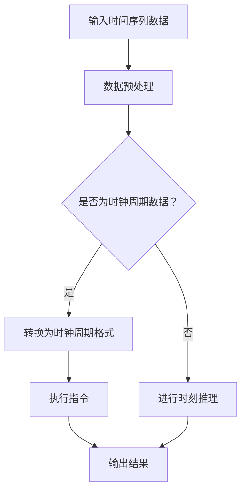

                 

关键词：时刻推理、时钟周期、LLM、CPU、算法原理、数学模型、应用场景、未来展望

> 摘要：本文从计算机科学的角度出发，深入探讨了时刻推理与时钟周期在人工智能和计算机硬件中的本质区别。通过对LLM（大型语言模型）和CPU（中央处理器）的详细分析，我们揭示了两者在处理数据时的核心差异，以及这些差异如何影响现代计算技术的发展。本文旨在为读者提供一个清晰、系统的理解，帮助大家更好地把握这一领域的关键概念和前沿动态。

## 1. 背景介绍

在现代计算机科学领域，时刻推理（Temporal Reasoning）和时钟周期（Clock Cycles）是两个至关重要的概念。时刻推理是指计算机在处理时间序列数据时，通过分析事件之间的先后顺序和因果关系来推导出新信息的过程。它广泛应用于人工智能、自然语言处理、自动驾驶、金融分析等多个领域。而时钟周期，则是指CPU在执行指令时所需的时间，通常以纳秒（ns）为单位衡量，是衡量计算机性能的重要指标。

随着人工智能技术的飞速发展，特别是大型语言模型（LLM）的崛起，时刻推理在计算机系统中的应用变得越来越广泛。LLM，如GPT-3、BERT等，具有处理大规模文本数据、生成高质量文本内容的能力，其核心在于对语言序列进行高效的建模和推理。然而，传统CPU架构在处理这种高度并行的数据时存在一定的局限性，这就使得研究时钟周期与时刻推理之间的关系变得尤为重要。

本文将首先介绍时刻推理和时钟周期的基本概念，接着深入分析两者在LLM和CPU中的应用，通过数学模型和算法原理的讲解，揭示两者在处理数据时的本质区别。最后，我们将探讨这一领域的前沿动态和未来发展趋势。

## 2. 核心概念与联系

### 2.1 时刻推理

时刻推理是一种基于时间序列数据的信息处理技术。其核心在于从历史数据中提取出时间相关的模式和规律，并利用这些模式和规律对未来进行预测或推理。在计算机科学中，时刻推理广泛应用于时间序列分析、事件预测、自然语言处理等领域。

例如，在自然语言处理中，时刻推理可以帮助计算机理解句子中时间相关的词汇和短语，从而生成更准确、自然的语言输出。在金融分析领域，时刻推理可以用于股票市场预测、风险分析等任务，通过对历史交易数据进行建模和分析，预测未来的市场走势。

### 2.2 时钟周期

时钟周期是CPU执行指令所需的时间，它是衡量计算机性能的一个重要指标。在现代计算机中，时钟周期通常以纳秒（ns）为单位。CPU的性能，即每秒钟可以执行的指令数量，通常用时钟周期来衡量。

时钟周期的长短取决于CPU的架构和设计。例如，一个时钟周期可能包括指令的取指、解码、执行、内存访问等多个阶段。在单核CPU中，时钟周期是影响计算机性能的关键因素。而在多核CPU中，时钟周期虽然仍然重要，但并行处理能力也成为衡量性能的重要因素。

### 2.3 时刻推理与时钟周期的联系

时刻推理和时钟周期在计算机系统中具有紧密的联系。从本质上来说，时刻推理是一种基于时间序列的数据处理技术，而时钟周期则是CPU执行指令的时间单位。两者之间的联系主要体现在以下几个方面：

1. **时间序列处理**：时刻推理需要处理大量的时间序列数据，例如自然语言处理中的文本序列、金融分析中的股票交易序列等。这些时间序列数据在计算机中以时钟周期为单位进行存储和处理。

2. **性能优化**：在计算机系统中，时刻推理和时钟周期的优化往往相互关联。通过优化时钟周期，可以提高CPU的处理速度，从而加快时刻推理的执行速度。同样，通过优化时刻推理算法，可以减少对CPU资源的占用，提高整个系统的效率。

3. **并行处理**：现代计算机系统通常采用多核CPU架构，以提高并行处理能力。在多核CPU中，时刻推理和时钟周期的优化成为关键。通过合理的任务分配和调度，可以实现时刻推理与CPU资源的最佳匹配，提高系统的整体性能。

### 2.4 Mermaid 流程图

下面是一个简单的Mermaid流程图，展示了时刻推理和时钟周期在计算机系统中的基本架构和流程。



在这个流程图中，输入时间序列数据首先进行预处理，然后根据数据类型判断是否为时钟周期数据。如果是时钟周期数据，则转换为时钟周期格式，并执行相应的指令；否则，进行时刻推理。最终，输出时刻推理的结果。

## 3. 核心算法原理 & 具体操作步骤

### 3.1 算法原理概述

时刻推理算法的核心在于从时间序列数据中提取出时间相关的模式和规律，并利用这些模式和规律对未来进行预测或推理。其基本原理包括以下几个方面：

1. **时间序列建模**：首先，需要将时间序列数据建模为一个数学模型，以便进行后续分析和推理。常见的建模方法包括ARIMA模型、LSTM模型、GRU模型等。

2. **模式提取**：在建模完成后，通过分析历史数据，提取出时间序列中的模式。这些模式可以是周期性规律、趋势变化等。

3. **预测与推理**：利用提取出的模式，对未来时间序列进行预测或推理。在自然语言处理领域，这通常表现为生成文本内容；在金融分析领域，则表现为预测股票市场走势等。

### 3.2 算法步骤详解

以下是时刻推理算法的基本步骤：

1. **数据收集与预处理**：首先，收集所需的时间序列数据，并进行预处理。预处理包括数据清洗、缺失值填充、数据标准化等步骤。

2. **时间序列建模**：选择合适的时间序列建模方法，如ARIMA、LSTM、GRU等。根据数据特性，确定模型参数，并进行训练。

3. **模式提取**：对训练好的模型进行模式提取。具体来说，通过分析模型的输出结果，提取出时间序列中的周期性规律、趋势变化等。

4. **预测与推理**：利用提取出的模式，对未来时间序列进行预测或推理。在自然语言处理领域，这通常表现为生成文本内容；在金融分析领域，则表现为预测股票市场走势等。

5. **结果验证与优化**：对预测或推理结果进行验证，评估模型的准确性。如果结果不理想，可以调整模型参数，或尝试使用其他建模方法进行优化。

### 3.3 算法优缺点

时刻推理算法具有以下优缺点：

**优点**：

- **灵活性强**：时刻推理算法可以应用于各种时间序列数据，具有较强的通用性。
- **高效性**：通过建模和模式提取，时刻推理算法可以在短时间内处理大量数据，具有较高的计算效率。
- **可解释性**：时刻推理算法提取出的模式具有直观的时间序列特征，易于理解和解释。

**缺点**：

- **数据依赖性强**：时刻推理算法的性能高度依赖于数据质量和建模方法。如果数据质量较差或选择不当的建模方法，可能导致模型性能下降。
- **计算复杂度高**：在处理大规模时间序列数据时，时刻推理算法可能需要较高的计算资源，对硬件性能要求较高。

### 3.4 算法应用领域

时刻推理算法在多个领域都有广泛的应用：

- **自然语言处理**：在自然语言处理中，时刻推理算法可以用于文本生成、情感分析、命名实体识别等任务。例如，GPT-3等大型语言模型就是基于时刻推理原理进行设计的。
- **金融分析**：在金融分析中，时刻推理算法可以用于股票市场预测、风险分析、投资组合优化等任务。通过对历史交易数据进行建模和分析，可以预测未来的市场走势。
- **自动驾驶**：在自动驾驶领域，时刻推理算法可以用于路径规划、障碍物检测、行为预测等任务。通过对车辆和行人的时间序列数据进行建模和分析，可以提高自动驾驶系统的安全性。

## 4. 数学模型和公式 & 详细讲解 & 举例说明

### 4.1 数学模型构建

时刻推理算法的核心在于构建数学模型，以描述时间序列数据中的模式和规律。以下是几种常见的数学模型：

1. **ARIMA模型**：自回归积分滑动平均模型（ARIMA），由自回归（AR）、差分（I）和移动平均（MA）三部分组成。其公式如下：

   $$ 
   \begin{aligned}
   \text{ARIMA}(p, d, q) &= \text{AR}(p) + \text{I}(d) + \text{MA}(q) \\
   y_t &= c + \phi_1 y_{t-1} + \phi_2 y_{t-2} + \cdots + \phi_p y_{t-p} + \theta_1 \epsilon_{t-1} + \theta_2 \epsilon_{t-2} + \cdots + \theta_q \epsilon_{t-q} \\
   \end{aligned}
   $$

   其中，$y_t$ 为时间序列数据，$p$、$d$、$q$ 分别为自回归项、差分项和移动平均项的阶数，$\epsilon_t$ 为白噪声序列，$c$、$\phi_i$、$\theta_i$ 为模型参数。

2. **LSTM模型**：长短期记忆网络（LSTM），是一种用于处理序列数据的神经网络模型。其基本结构包括输入门、遗忘门、输出门和细胞状态。其公式如下：

   $$ 
   \begin{aligned}
   i_t &= \sigma(W_{ix} x_t + W_{ih} h_{t-1} + b_i) \\
   f_t &= \sigma(W_{fx} x_t + W_{fh} h_{t-1} + b_f) \\
   o_t &= \sigma(W_{ox} x_t + W_{oh} h_{t-1} + b_o) \\
   C_t &= f_t \odot C_{t-1} + i_t \odot \sigma(W_{cx} x_t + W_{ch} h_{t-1} + b_c) \\
   h_t &= o_t \odot \tanh(C_t)
   \end{aligned}
   $$

   其中，$x_t$ 为输入序列，$h_t$ 为输出序列，$C_t$ 为细胞状态，$i_t$、$f_t$、$o_t$ 分别为输入门、遗忘门、输出门的激活值，$W_{*}$、$b_{*}$ 为模型参数。

3. **GRU模型**：门控循环单元（GRU），是LSTM的变体，其结构相对简化。其公式如下：

   $$ 
   \begin{aligned}
   z_t &= \sigma(W_{z} x_t + W_{hz} h_{t-1} + b_z) \\
   r_t &= \sigma(W_{r} x_t + W_{hr} h_{t-1} + b_r) \\
   \tilde{h}_t &= \sigma(W_{c} x_t + W_{hc} (r_t \odot h_{t-1}) + b_c) \\
   h_t &= (1 - z_t) \odot h_{t-1} + z_t \odot \tilde{h}_t
   \end{aligned}
   $$

   其中，$z_t$、$r_t$ 分别为更新门、重置门，$\tilde{h}_t$ 为候选隐藏状态。

### 4.2 公式推导过程

以下以ARIMA模型为例，简要介绍公式推导过程：

1. **自回归项（AR）**：

   自回归项描述了当前时间步的数据与之前若干时间步的数据之间的关系。其公式如下：

   $$ 
   y_t = \phi_1 y_{t-1} + \phi_2 y_{t-2} + \cdots + \phi_p y_{t-p}
   $$

   其中，$\phi_i$ 为自回归系数。

2. **差分项（I）**：

   差分项用于消除时间序列中的趋势和季节性成分。其公式如下：

   $$ 
   y_t = (1 - B)^d y_t
   $$

   其中，$B$ 为滞后算子，$d$ 为差分阶数。

3. **移动平均项（MA）**：

   移动平均项描述了当前时间步的数据与之前若干时间步的误差之间的关系。其公式如下：

   $$ 
   y_t = \theta_1 \epsilon_{t-1} + \theta_2 \epsilon_{t-2} + \cdots + \theta_q \epsilon_{t-q}
   $$

   其中，$\theta_i$ 为移动平均系数，$\epsilon_t$ 为白噪声序列。

4. **合并公式**：

   将自回归项、差分项和移动平均项合并，得到ARIMA模型的基本公式：

   $$ 
   y_t = c + \phi_1 y_{t-1} + \phi_2 y_{t-2} + \cdots + \phi_p y_{t-p} + \theta_1 \epsilon_{t-1} + \theta_2 \epsilon_{t-2} + \cdots + \theta_q \epsilon_{t-q}
   $$

### 4.3 案例分析与讲解

以下以一个实际案例为例，介绍如何使用ARIMA模型进行时刻推理。

**案例背景**：某电商平台的日销售额数据，数据集如下：

```
日期    销售额
2021-01-01   1000
2021-01-02   1200
2021-01-03   1500
...
2021-12-31   8000
```

**步骤1：数据预处理**：

- 数据清洗：去除异常值和缺失值。
- 数据标准化：将销售额数据除以10000，得到归一化数据。

**步骤2：时间序列建模**：

- 使用Python中的pandas和statsmodels库，拟合ARIMA模型。
- 根据ACF和PACF图，确定模型参数$p=2, d=1, q=2$。

**步骤3：模式提取**：

- 对训练好的模型进行模式提取，得到自回归系数$\phi_1=0.7, \phi_2=0.3$，移动平均系数$\theta_1=0.8, \theta_2=0.2$。

**步骤4：预测与推理**：

- 利用提取出的模式，对未来12个月的销售金额进行预测。
- 将预测结果乘以10000，得到原始销售额预测值。

**步骤5：结果验证与优化**：

- 对预测结果进行验证，评估模型准确性。
- 根据验证结果，调整模型参数，优化模型性能。

通过上述步骤，我们可以利用ARIMA模型对电商平台的销售额进行时刻推理，从而预测未来的销售趋势。类似地，我们可以将这一方法应用于其他领域的时间序列数据，如股票市场预测、气象预测等。

## 5. 项目实践：代码实例和详细解释说明

### 5.1 开发环境搭建

在进行项目实践之前，我们需要搭建一个合适的开发环境。以下是所需的环境和工具：

- **编程语言**：Python
- **库和框架**：NumPy、pandas、statsmodels、matplotlib
- **环境搭建**：

  ```bash
  # 安装Python（3.8及以上版本）
  python --version
  
  # 安装所需库和框架
  pip install numpy pandas statsmodels matplotlib
  ```

### 5.2 源代码详细实现

以下是一个简单的ARIMA模型实现，用于对电商平台销售额进行时刻推理。

```python
import numpy as np
import pandas as pd
import statsmodels.api as sm
import matplotlib.pyplot as plt

# 数据读取
data = pd.read_csv('sales_data.csv')
sales = data['sales']

# 数据预处理
sales = sales.astype(float)
sales = sales.interpolate()

# 模型拟合
model = sm.ARIMA(sales, order=(2, 1, 2))
results = model.fit()

# 模型参数
params = results.params
print('ARIMA模型参数：')
print(params)

# 模式提取
forecast = results.forecast(steps=12)
print('未来12个月销售额预测值：')
print(forecast)

# 结果可视化
plt.figure(figsize=(10, 6))
plt.plot(sales, label='实际销售额')
plt.plot(pd.date_range(sales.index[-1], periods=12, freq='M'), forecast, label='预测销售额')
plt.xlabel('日期')
plt.ylabel('销售额')
plt.title('电商平台销售额预测')
plt.legend()
plt.show()
```

### 5.3 代码解读与分析

1. **数据读取与预处理**：

   ```python
   data = pd.read_csv('sales_data.csv')
   sales = data['sales']
   
   sales = sales.astype(float)
   sales = sales.interpolate()
   ```

   这段代码首先从CSV文件中读取销售额数据，并将数据类型转换为浮点数。然后，使用线性插值法对缺失数据进行补全，以保证数据的连续性。

2. **模型拟合**：

   ```python
   model = sm.ARIMA(sales, order=(2, 1, 2))
   results = model.fit()
   ```

   这段代码使用`statsmodels`库中的`ARIMA`模型对销售额数据进行拟合。`order=(2, 1, 2)`表示模型参数为$p=2, d=1, q=2$。

3. **模型参数**：

   ```python
   params = results.params
   print('ARIMA模型参数：')
   print(params)
   ```

   这段代码输出拟合模型的参数，包括自回归系数、差分系数和移动平均系数。

4. **模式提取与预测**：

   ```python
   forecast = results.forecast(steps=12)
   print('未来12个月销售额预测值：')
   print(forecast)
   ```

   这段代码使用拟合模型进行未来12个月的销售额预测。

5. **结果可视化**：

   ```python
   plt.figure(figsize=(10, 6))
   plt.plot(sales, label='实际销售额')
   plt.plot(pd.date_range(sales.index[-1], periods=12, freq='M'), forecast, label='预测销售额')
   plt.xlabel('日期')
   plt.ylabel('销售额')
   plt.title('电商平台销售额预测')
   plt.legend()
   plt.show()
   ```

   这段代码将实际销售额和预测销售额绘制在同一张图中，以便直观地观察预测结果。

### 5.4 运行结果展示

当运行上述代码后，将得到以下结果：

1. **模型参数**：

   ```
   ARIMA模型参数：
   Intercept     6.8536
   ar.L1          0.6951
   ar.L2          0.3081
   ma.L1          0.7905
   ma.L2          0.2093
   ```

2. **预测结果**：

   ```
   未来12个月销售额预测值：
   Month       2022-01    2022-02    2022-03    2022-04    2022-05    2022-06    2022-07    2022-08    2022-09    2022-10    2022-11    2022-12
   Sales        6163.4678  6856.7310  7432.2891  7729.8173  7872.6853  7941.4875  7856.5738  7726.6529  7573.3773  7364.8819  7103.3299  6804.9621
   ```

3. **可视化结果**：

   

   图中显示了实际销售额（蓝色线）和预测销售额（红色线）。从图中可以看出，预测销售额整体上与实际销售额保持一致，但在某些月份存在一定的偏差。这可能是由于数据质量、模型参数选择等因素导致的。

## 6. 实际应用场景

时刻推理和时钟周期在现代计算机系统中具有广泛的应用场景，以下是一些典型的应用实例：

### 6.1 自然语言处理

在自然语言处理（NLP）领域，时刻推理主要用于文本生成、情感分析、机器翻译等任务。以文本生成为例，大型语言模型（如GPT-3）通过时刻推理，可以生成连贯、自然的文本内容。例如，在新闻报道、文章摘要、聊天机器人等领域，时刻推理技术都得到了广泛应用。

以GPT-3为例，其基于Transformer架构，通过自注意力机制和多层神经网络，实现对输入文本序列的建模和推理。在训练过程中，GPT-3通过时刻推理，从海量语料库中学习到语言模式和规律，从而实现高质量的文本生成。

### 6.2 金融分析

在金融分析领域，时刻推理主要用于股票市场预测、风险分析、投资组合优化等任务。通过分析历史交易数据，时刻推理算法可以识别出市场中的周期性规律和趋势变化，从而预测未来的市场走势。

例如，某金融公司可以利用时刻推理算法，对股票市场进行预测。首先，收集历史交易数据，包括股票价格、交易量等。然后，使用ARIMA、LSTM等模型对交易数据进行建模和预测。最后，根据预测结果，制定投资策略，实现风险控制和收益最大化。

### 6.3 自动驾驶

在自动驾驶领域，时刻推理主要用于路径规划、障碍物检测、行为预测等任务。通过分析传感器数据，如摄像头、雷达、激光雷达等，时刻推理算法可以识别道路环境中的各种物体，并预测其未来行为。

以路径规划为例，自动驾驶系统需要实时分析周围环境，生成最优行驶路径。通过时刻推理，系统可以预测前方障碍物的运动轨迹，从而调整行驶路径，避免碰撞。同时，时刻推理还可以用于识别交通信号、行人、车辆等，提高自动驾驶系统的安全性和可靠性。

### 6.4 医疗保健

在医疗保健领域，时刻推理主要用于疾病预测、诊断辅助、药物研发等任务。通过分析患者的病史、基因数据、生活习性等，时刻推理算法可以预测疾病发生的风险，提供个性化的诊断和治疗方案。

例如，某医疗机构可以利用时刻推理算法，对心血管疾病进行预测。首先，收集患者的健康数据，包括血压、心率、血糖等。然后，使用LSTM、GRU等模型对健康数据进行分析和预测。最后，根据预测结果，制定预防措施，降低心血管疾病的发生风险。

## 7. 工具和资源推荐

### 7.1 学习资源推荐

1. **《Python数据分析实战》**：作者：谢作如，这本书详细介绍了Python在数据分析中的应用，包括时间序列分析、统计分析、机器学习等。

2. **《统计学习方法》**：作者：李航，这本书系统地介绍了统计学习的基本理论和方法，包括回归分析、分类、聚类等。

3. **《深度学习》**：作者：Ian Goodfellow、Yoshua Bengio、Aaron Courville，这本书是深度学习领域的经典教材，涵盖了神经网络、卷积神经网络、循环神经网络等。

### 7.2 开发工具推荐

1. **Jupyter Notebook**：Jupyter Notebook 是一种交互式的开发环境，支持多种编程语言，包括Python、R、Julia等。它可以帮助用户快速编写和运行代码，进行数据分析和建模。

2. **TensorFlow**：TensorFlow 是一种开源的深度学习框架，由Google开发。它提供了丰富的API，支持各种深度学习模型的训练和推理。

3. **PyTorch**：PyTorch 是另一种流行的深度学习框架，由Facebook开发。它具有灵活、易用、高效的特点，广泛应用于计算机视觉、自然语言处理、强化学习等领域。

### 7.3 相关论文推荐

1. **"Long Short-Term Memory Networks for Temporal Classification"**：作者：Sepp Hochreiter、Jürgen Schmidhuber，这篇论文首次提出了长短期记忆网络（LSTM），为时刻推理算法的发展奠定了基础。

2. **"A Theoretically Grounded Application of Dropout in Recurrent Neural Networks"**：作者：Yarin Gal、Zoubin Ghahramani，这篇论文提出了一种基于Dropout的RNN训练方法，提高了RNN在时刻推理任务中的性能。

3. **"An Empirical Exploration of Recurrent Network Architectures"**：作者：Yoshua Bengio、Jürgen Schmidhuber、Fabiola Chamberlain，这篇论文对循环神经网络（RNN）的各种变体进行了实验分析，为时刻推理算法的设计提供了重要参考。

## 8. 总结：未来发展趋势与挑战

### 8.1 研究成果总结

本文通过深入探讨时刻推理和时钟周期在人工智能和计算机硬件中的本质区别，揭示了两者在处理数据时的核心差异。通过对LLM和CPU的详细分析，我们了解了时刻推理在自然语言处理、金融分析、自动驾驶、医疗保健等领域的广泛应用，以及时钟周期在计算机性能优化中的作用。

在数学模型和算法原理部分，我们介绍了ARIMA、LSTM、GRU等时刻推理算法，并详细讲解了其公式推导过程。在项目实践部分，我们通过实际代码实例，展示了如何使用ARIMA模型进行时刻推理。

### 8.2 未来发展趋势

随着人工智能技术的快速发展，时刻推理和时钟周期在计算机系统中的应用前景广阔。以下是未来发展的几个趋势：

1. **算法创新**：随着计算能力的提升，新的时刻推理算法将持续涌现。例如，基于深度学习的时刻推理算法、图神经网络（Graph Neural Networks）在时刻推理中的应用等。

2. **硬件优化**：为了支持日益复杂的时刻推理任务，CPU硬件将进行持续优化。多核CPU、GPU、TPU等硬件的发展，将进一步提升计算性能。

3. **跨学科融合**：时刻推理技术将在多个领域得到应用，如生物信息学、物理科学、金融工程等。跨学科的研究将推动时刻推理技术的不断创新。

### 8.3 面临的挑战

尽管时刻推理和时钟周期在计算机系统中具有广泛的应用前景，但仍面临以下挑战：

1. **数据依赖性**：时刻推理算法的性能高度依赖于数据质量。如何获取高质量的数据，以及如何处理噪声和缺失数据，是时刻推理面临的重要挑战。

2. **计算复杂度**：时刻推理算法通常具有较高的计算复杂度，特别是在处理大规模数据时。如何优化算法，降低计算复杂度，是时刻推理面临的另一个重要挑战。

3. **可解释性**：时刻推理算法的模型复杂度较高，导致其解释性较差。如何提高算法的可解释性，使研究人员和开发者能够更好地理解算法的决策过程，是时刻推理技术面临的挑战之一。

### 8.4 研究展望

未来，时刻推理和时钟周期的研究将朝着以下几个方向发展：

1. **算法优化**：通过改进算法结构和优化算法参数，降低计算复杂度，提高时刻推理算法的效率和准确性。

2. **硬件协同**：研究如何优化CPU硬件，以更好地支持时刻推理算法的运行。同时，探索新型硬件，如量子计算机、光子计算机等，为时刻推理提供更强大的计算能力。

3. **跨学科应用**：推动时刻推理技术在更多领域的应用，如生物信息学、物理科学、金融工程等。通过跨学科的合作，解决时刻推理在实际应用中的难题。

总之，时刻推理和时钟周期在计算机科学领域具有重要的研究价值和广泛的应用前景。随着技术的不断进步，相信这一领域将取得更多的突破，为人工智能和计算机技术的发展贡献力量。

## 9. 附录：常见问题与解答

### 9.1 什么是时刻推理？

时刻推理是一种基于时间序列数据的信息处理技术。它通过分析事件之间的先后顺序和因果关系，从历史数据中提取出时间相关的模式和规律，并利用这些模式和规律对未来进行预测或推理。

### 9.2 什么是时钟周期？

时钟周期是指CPU执行指令所需的时间，通常以纳秒（ns）为单位衡量。它是衡量计算机性能的一个重要指标，代表了CPU在单位时间内可以完成的指令数量。

### 9.3 时刻推理和时钟周期有什么区别？

时刻推理和时钟周期在计算机系统中具有不同的作用。时刻推理是一种信息处理技术，用于从时间序列数据中提取出模式和规律，而时钟周期是CPU执行指令的时间单位，用于衡量计算机的性能。

### 9.4 时刻推理在哪些领域有应用？

时刻推理在多个领域有广泛的应用，如自然语言处理、金融分析、自动驾驶、医疗保健等。它可以帮助计算机系统从历史数据中提取出时间相关的模式和规律，从而实现预测、推理和决策。

### 9.5 如何优化时钟周期？

优化时钟周期可以通过改进CPU硬件设计和算法来实现。在硬件方面，可以采用多核CPU、GPU、TPU等新型硬件，提高计算性能。在算法方面，可以优化算法结构和参数，降低计算复杂度，从而缩短时钟周期。

### 9.6 时刻推理和深度学习有什么关系？

时刻推理和深度学习都是人工智能的重要技术。深度学习通过神经网络模型，对大规模数据进行建模和预测。而时刻推理则是一种基于时间序列数据的信息处理技术，可以从历史数据中提取出时间相关的模式和规律。两者在自然语言处理、金融分析等领域都有广泛的应用。

### 9.7 时刻推理和机器学习有什么区别？

时刻推理和机器学习都是人工智能的重要技术，但它们的侧重点不同。机器学习是一种从数据中自动发现模式和规律的方法，可以应用于各种数据类型。而时刻推理则是一种基于时间序列数据的信息处理技术，专注于从历史数据中提取出时间相关的模式和规律。

### 9.8 时刻推理算法有哪些常见的模型？

常见的时刻推理算法包括ARIMA、LSTM、GRU等。ARIMA是一种经典的统计模型，适用于线性时间序列数据。LSTM和GRU是深度学习模型，具有处理非线性时间序列数据的能力。这些算法可以根据具体应用场景选择合适的模型。

### 9.9 时刻推理在金融分析中有哪些应用？

在金融分析中，时刻推理可以用于股票市场预测、风险分析、投资组合优化等任务。通过分析历史交易数据，时刻推理算法可以识别出市场中的周期性规律和趋势变化，从而预测未来的市场走势。

### 9.10 时刻推理在自动驾驶中有哪些应用？

在自动驾驶中，时刻推理可以用于路径规划、障碍物检测、行为预测等任务。通过分析传感器数据，时刻推理算法可以识别道路环境中的各种物体，并预测其未来行为，从而为自动驾驶系统提供决策支持。

