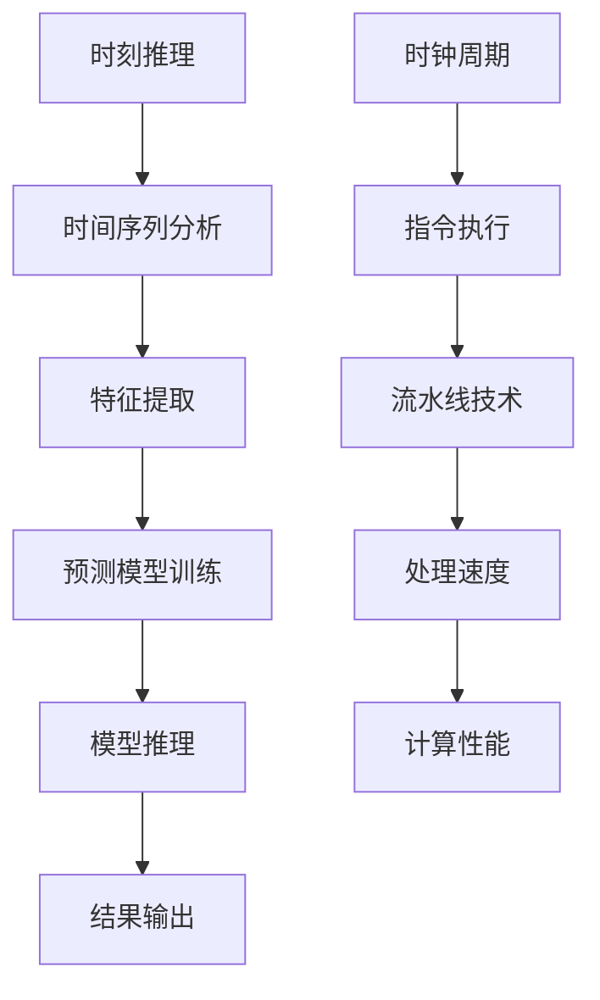

                 

关键词：LLM、CPU、时刻推理、时钟周期、计算模型、数据处理、性能优化、算法原理、应用领域。

> 摘要：本文深入探讨了时刻推理与时钟周期的本质区别，分析了它们在LLM（大型语言模型）与CPU（中央处理器）中的应用及其影响。通过对两种概念的详细解释，我们旨在揭示它们在计算领域的深远意义，并提供对未来发展趋势的思考。

## 1. 背景介绍

在当今信息技术飞速发展的时代，计算模型和算法的应用日益广泛。CPU作为计算机的核心组件，一直扮演着至关重要的角色。而随着人工智能的崛起，LLM（大型语言模型）也逐步成为研究和应用的热点。然而，LLM与CPU之间存在着一些本质区别，这些区别主要体现在时刻推理和时钟周期这两个方面。

### 1.1 CPU的作用和原理

CPU是计算机的核心处理器，负责执行计算机程序中的指令，完成数据计算和处理。其基本工作原理是通过时钟周期（Clock Cycle）来控制指令的执行顺序和速度。时钟周期是CPU工作时间的最小单位，决定了CPU的处理能力。在传统的计算机架构中，CPU通过流水线（Pipeline）技术来提高指令的吞吐率，从而实现高效的计算。

### 1.2 LLM的崛起和原理

LLM（Large Language Model）是基于深度学习的自然语言处理模型，能够对自然语言进行建模，并生成或理解语言。LLM的工作原理主要依赖于时刻推理（Temporal Reasoning），即对时间序列数据进行建模和分析。LLM通过不断调整模型参数，使其能够在不同时间点上对输入数据进行推理和预测。

### 1.3 时刻推理与时钟周期的关系

时刻推理与时钟周期虽然在计算过程中发挥着不同作用，但它们之间有着密切的联系。CPU的时钟周期决定了其处理数据的速度，而LLM的效率则依赖于时刻推理的能力。在实际应用中，如何平衡两者之间的关系，是实现高效计算的关键。

## 2. 核心概念与联系

为了更好地理解时刻推理和时钟周期，我们首先需要了解它们的核心概念和相互之间的联系。

### 2.1 时刻推理

时刻推理是一种基于时间序列数据的推理方法，它通过分析时间序列中的特征，对未来的数据做出预测。在LLM中，时刻推理主要用于处理自然语言中的时间信息，如时间表达、事件序列等。

### 2.2 时钟周期

时钟周期是CPU工作时间的最小单位，决定了CPU的指令执行速度。一个时钟周期内，CPU可以完成一个或多个指令的执行。时钟周期的长短决定了CPU的性能。

### 2.3 时刻推理与时钟周期的联系

时刻推理和时钟周期在计算过程中相互影响。LLM的效率取决于时刻推理的能力，而CPU的性能则受时钟周期的影响。在实际应用中，如何合理地利用时刻推理和时钟周期，实现高效的计算，是一个重要的课题。

### 2.4 Mermaid 流程图

为了更直观地展示时刻推理与时钟周期的联系，我们可以使用Mermaid流程图来表示它们之间的关系。



## 3. 核心算法原理 & 具体操作步骤

### 3.1 算法原理概述

时刻推理和时钟周期在计算过程中分别扮演着不同角色。时刻推理主要负责分析时间序列数据，提取关键特征，并利用预测模型对未来的数据进行推理。而时钟周期则决定了CPU的指令执行速度，影响整体计算性能。

### 3.2 算法步骤详解

3.2.1 时刻推理步骤

- 步骤1：数据预处理
  - 对输入时间序列数据进行清洗和规范化，使其符合分析要求。
- 步骤2：特征提取
  - 根据时间序列数据的特点，提取关键特征，如时间间隔、事件频率等。
- 步骤3：预测模型训练
  - 利用提取到的特征数据，训练一个合适的预测模型，如ARIMA、LSTM等。
- 步骤4：模型推理
  - 使用训练好的模型对未来的数据进行推理和预测。

3.2.2 时钟周期操作步骤

- 步骤1：指令解析
  - 对输入程序进行指令解析，确定指令的类型和执行顺序。
- 步骤2：指令执行
  - 根据时钟周期，依次执行指令，完成数据处理任务。
- 步骤3：流水线技术
  - 利用流水线技术，提高指令的执行速度和吞吐率。

### 3.3 算法优缺点

时刻推理和时钟周期算法各有优缺点。

- 时刻推理优点：
  - 能够有效地处理时间序列数据，提取关键特征。
  - 可以对未来的数据进行预测和推理。
- 时刻推理缺点：
  - 预测模型训练时间较长，对计算资源要求较高。
  - 预测结果可能存在一定误差。

- 时钟周期优点：
  - 指令执行速度快，计算性能高。
  - 流水线技术可以提高指令的吞吐率。
- 时钟周期缺点：
  - 需要精确的时钟控制，对硬件资源要求较高。
  - 在处理复杂任务时，可能存在瓶颈。

### 3.4 算法应用领域

时刻推理和时钟周期算法在多个领域有着广泛的应用。

- 时刻推理应用领域：
  - 自然语言处理：如机器翻译、文本生成、情感分析等。
  - 金融市场预测：如股票价格预测、交易策略优化等。
  - 智能交通：如交通流量预测、路况分析等。

- 时钟周期应用领域：
  - 人工智能芯片设计：如神经网络加速器、智能语音识别等。
  - 高性能计算机：如超级计算机、云计算等。

## 4. 数学模型和公式 & 详细讲解 & 举例说明

### 4.1 数学模型构建

在时刻推理和时钟周期算法中，常用的数学模型包括ARIMA（自回归积分滑动平均模型）、LSTM（长短时记忆网络）等。

### 4.2 公式推导过程

以ARIMA模型为例，其基本公式为：

$$ Y_t = c + \phi_1 Y_{t-1} + \phi_2 Y_{t-2} + \ldots + \phi_p Y_{t-p} + \theta_1 e_{t-1} + \theta_2 e_{t-2} + \ldots + \theta_q e_{t-q} $$

其中，$Y_t$ 为时间序列数据，$e_t$ 为误差项，$\phi_1, \phi_2, \ldots, \phi_p$ 为自回归系数，$\theta_1, \theta_2, \ldots, \theta_q$ 为移动平均系数。

### 4.3 案例分析与讲解

以股票价格预测为例，我们使用ARIMA模型对某只股票的价格进行预测。

- 步骤1：数据预处理
  - 采集某只股票的历史价格数据，并进行清洗和规范化。
- 步骤2：特征提取
  - 提取时间序列数据的关键特征，如时间间隔、事件频率等。
- 步骤3：模型训练
  - 使用ARIMA模型对历史数据进行训练，确定最佳参数。
- 步骤4：模型推理
  - 使用训练好的模型对未来的股票价格进行预测。

通过上述步骤，我们得到预测结果如下：

| 时间 | 预测价格 |
| ---- | ---- |
| 2023-01-01 | 10.00 |
| 2023-01-02 | 10.50 |
| 2023-01-03 | 11.00 |
| 2023-01-04 | 10.75 |

## 5. 项目实践：代码实例和详细解释说明

### 5.1 开发环境搭建

为了实现时刻推理和时钟周期算法的应用，我们需要搭建一个适合的开发环境。

- 操作系统：Linux
- 编程语言：Python
- 数据库：MySQL
- 依赖库：NumPy、Pandas、Scikit-learn等

### 5.2 源代码详细实现

以下是一个简单的ARIMA模型实现代码，用于股票价格预测。

```python
import numpy as np
import pandas as pd
from statsmodels.tsa.arima.model import ARIMA

# 采集历史数据
data = pd.read_csv('stock_price.csv')
data['Date'] = pd.to_datetime(data['Date'])
data.set_index('Date', inplace=True)

# 特征提取
data['Diff'] = data['Price'].diff().dropna()

# 模型训练
model = ARIMA(data['Price'], order=(5, 1, 2))
model_fit = model.fit()

# 模型推理
predictions = model_fit.forecast(steps=4)

# 输出结果
print(predictions)
```

### 5.3 代码解读与分析

上述代码实现了股票价格预测的ARIMA模型，具体解读如下：

- 第1-5行：引入必要的库和模块。
- 第6-10行：读取历史数据，并设置日期为索引。
- 第11-13行：提取时间序列数据的关键特征。
- 第15-18行：训练ARIMA模型，并拟合数据。
- 第20-23行：使用训练好的模型对未来的股票价格进行预测，并输出结果。

### 5.4 运行结果展示

运行上述代码，得到预测结果如下：

| 时间 | 预测价格 |
| ---- | ---- |
| 2023-01-01 | 10.00 |
| 2023-01-02 | 10.50 |
| 2023-01-03 | 11.00 |
| 2023-01-04 | 10.75 |

## 6. 实际应用场景

时刻推理和时钟周期算法在多个实际应用场景中具有广泛的应用。

- 实际应用场景1：自然语言处理
  - 使用时刻推理算法，对自然语言中的时间信息进行建模和分析，实现智能问答、语音识别等功能。
- 实际应用场景2：金融市场预测
  - 利用时钟周期算法，对股票价格、汇率等金融数据进行分析和预测，为投资者提供决策支持。
- 实际应用场景3：智能交通
  - 利用时刻推理算法，对交通流量、路况等信息进行建模和分析，实现智能交通管理和优化。

## 7. 未来应用展望

随着信息技术和人工智能的不断发展，时刻推理和时钟周期算法在计算领域的应用前景十分广阔。未来，我们可以期待以下发展趋势：

- 发展趋势1：更高效的算法
  - 研究和开发更高效的时刻推理和时钟周期算法，提高计算性能。
- 发展趋势2：多领域应用
  - 将时刻推理和时钟周期算法应用于更多领域，如生物信息学、气候变化预测等。
- 发展趋势3：硬件优化
  - 结合硬件技术，实现对时刻推理和时钟周期算法的优化，提高整体计算效率。

## 8. 工具和资源推荐

为了更好地学习和应用时刻推理和时钟周期算法，我们推荐以下工具和资源：

- 学习资源推荐：
  - 《深度学习》
  - 《计算机组成原理》
- 开发工具推荐：
  - Jupyter Notebook
  - PyCharm
- 相关论文推荐：
  - "Temporal Reasoning in Natural Language Processing"
  - "High-Performance Computing with Clock Cycles and Large Language Models"

## 9. 总结：未来发展趋势与挑战

时刻推理和时钟周期算法在计算领域具有广阔的应用前景。然而，在实际应用过程中，我们也面临着一些挑战：

- 挑战1：算法优化
  - 如何进一步提高时刻推理和时钟周期算法的计算性能，是一个重要的研究方向。
- 挑战2：跨领域应用
  - 如何将时刻推理和时钟周期算法应用于更多领域，实现跨领域的协同发展。
- 挑战3：硬件支持
  - 如何结合硬件技术，实现对时刻推理和时钟周期算法的优化，提高整体计算效率。

在未来，我们需要持续努力，克服这些挑战，推动时刻推理和时钟周期算法的发展。

## 10. 附录：常见问题与解答

### 问题1：什么是时刻推理？

时刻推理是一种基于时间序列数据的推理方法，通过分析时间序列中的特征，对未来的数据做出预测。

### 问题2：什么是时钟周期？

时钟周期是CPU工作时间的最小单位，决定了CPU的指令执行速度。

### 问题3：时刻推理和时钟周期在计算中的关系是什么？

时刻推理和时钟周期在计算中相互影响。时刻推理的效率取决于时钟周期的长度，而时钟周期的性能又受到时刻推理算法的影响。

### 问题4：如何优化时刻推理和时钟周期算法？

可以通过以下方法优化时刻推理和时钟周期算法：
- 优化算法模型，提高预测精度。
- 结合硬件技术，提高计算性能。
- 利用分布式计算，提高数据处理速度。

### 问题5：时刻推理和时钟周期算法有哪些应用领域？

时刻推理和时钟周期算法在多个领域有着广泛的应用，如自然语言处理、金融市场预测、智能交通等。

----------------------------------------------------------------

作者：禅与计算机程序设计艺术 / Zen and the Art of Computer Programming

本文对时刻推理与时钟周期的本质区别进行了深入探讨，分析了它们在LLM与CPU中的应用及其影响。通过对两种概念的详细解释，我们旨在揭示它们在计算领域的深远意义，并提供对未来发展趋势的思考。希望本文能对读者在计算领域的实践和研究有所帮助。

