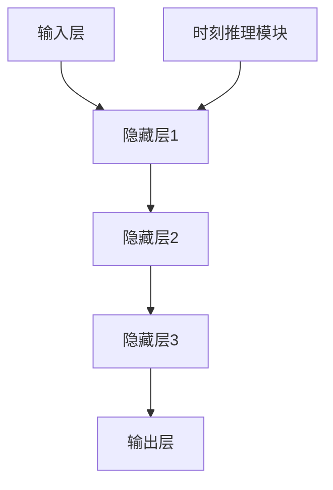

                 

关键词：时刻推理，LLM，计算本质，深度学习，自然语言处理，算法，数学模型，应用领域，未来展望

## 摘要

本文探讨了时刻推理（Temporal Reasoning）在大型语言模型（Large Language Models，简称LLM）计算中的独特本质。随着深度学习和自然语言处理技术的飞速发展，LLM在多个领域取得了显著的成果。然而，LLM在处理时间序列数据时，面临着表达能力和推理能力的挑战。本文将从背景介绍、核心概念与联系、核心算法原理、数学模型和公式、项目实践、实际应用场景、工具和资源推荐以及未来发展趋势与挑战等方面，全面解析时刻推理在LLM计算中的重要性。

## 1. 背景介绍

### 1.1 深度学习与自然语言处理的发展

深度学习作为人工智能的重要分支，近年来取得了长足的进步。特别是在自然语言处理（Natural Language Processing，简称NLP）领域，深度学习模型如卷积神经网络（Convolutional Neural Networks，简称CNN）和循环神经网络（Recurrent Neural Networks，简称RNN）等在文本分类、机器翻译、情感分析等任务上取得了优异的性能。

### 1.2 大型语言模型（LLM）的崛起

随着计算资源和数据集的不断增加，大型语言模型（LLM）如GPT、BERT等逐渐崭露头角。这些模型拥有数十亿甚至千亿级别的参数，通过在大量文本数据上进行预训练，能够自动学习语言的结构和语义，从而实现高质量的语言生成和推理。

### 1.3 时刻推理（Temporal Reasoning）的重要性

时刻推理是指模型对时间序列数据中的逻辑关系进行推理和分析。在现实世界中，许多任务都需要对时间序列数据进行处理，如股票预测、语音识别、自然语言生成等。时刻推理在LLM计算中的重要性体现在以下几个方面：

1. **时间序列数据的建模**：时刻推理能够帮助模型更好地理解和建模时间序列数据，从而提高预测和推理的准确性。
2. **事件顺序的识别**：在自然语言生成任务中，时刻推理有助于模型识别和理解事件发生的顺序，从而生成符合逻辑的文本。
3. **时间信息的提取和利用**：时刻推理能够从时间序列数据中提取有用的时间信息，为后续任务提供支持。

## 2. 核心概念与联系

### 2.1 深度学习模型的基本架构

深度学习模型通常由输入层、隐藏层和输出层组成。输入层接收外部输入，隐藏层通过多层神经网络进行特征提取和变换，输出层则生成最终的预测结果。在LLM中，隐藏层通常采用复杂的神经网络结构，如Transformer等。

### 2.2 时刻推理的基本原理

时刻推理是一种基于时间序列数据的推理方法，通过分析时间序列中的事件序列和因果关系，实现对事件的理解和预测。时刻推理的基本原理包括：

1. **事件序列建模**：将时间序列数据表示为事件序列，每个事件表示时间序列中的一个特定状态。
2. **因果关系分析**：通过分析事件序列中的因果关系，建立事件之间的逻辑关系。
3. **时间序列预测**：根据事件序列和因果关系，对未来的时间序列数据进行预测。

### 2.3 时刻推理与深度学习模型的结合

时刻推理与深度学习模型的结合，可以充分发挥两者的优势。一方面，深度学习模型能够自动学习时间序列数据中的复杂特征和关系；另一方面，时刻推理能够为深度学习模型提供时间信息，提高其预测和推理的准确性。

### 2.4 Mermaid 流程图



## 3. 核心算法原理 & 具体操作步骤

### 3.1 算法原理概述

时刻推理算法的核心在于将时间序列数据表示为事件序列，并通过分析事件序列中的因果关系和逻辑关系，实现对时间序列数据的理解和预测。具体步骤如下：

1. **事件序列建模**：将时间序列数据表示为事件序列，每个事件表示时间序列中的一个特定状态。
2. **因果关系分析**：通过分析事件序列中的因果关系，建立事件之间的逻辑关系。
3. **时间序列预测**：根据事件序列和因果关系，对未来的时间序列数据进行预测。

### 3.2 算法步骤详解

1. **事件序列建模**：

   将时间序列数据表示为事件序列，每个事件表示时间序列中的一个特定状态。具体步骤如下：

   - **数据预处理**：对时间序列数据进行预处理，如去噪、归一化等。
   - **事件提取**：根据时间序列数据的特点，提取出关键事件，如时间点、事件类型等。
   - **事件序列构建**：将提取的关键事件按照时间顺序排列，构建事件序列。

2. **因果关系分析**：

   通过分析事件序列中的因果关系，建立事件之间的逻辑关系。具体步骤如下：

   - **相关性分析**：计算事件序列中事件之间的相关性，如互信息、相关性系数等。
   - **因果关系识别**：根据相关性分析结果，识别事件之间的因果关系，如因果关系网络等。
   - **因果模型构建**：将因果关系网络表示为因果模型，如因果关系图等。

3. **时间序列预测**：

   根据事件序列和因果关系，对未来的时间序列数据进行预测。具体步骤如下：

   - **特征提取**：根据事件序列和因果关系，提取对预测任务有用的特征。
   - **预测模型构建**：构建预测模型，如线性回归、神经网络等。
   - **预测结果生成**：根据预测模型，生成未来的时间序列数据。

### 3.3 算法优缺点

#### 优点

- **表达能力**：时刻推理算法能够自动学习时间序列数据中的复杂特征和关系，具有较强的表达能力。
- **推理能力**：时刻推理算法能够分析事件序列中的因果关系，实现对时间序列数据的推理和预测。
- **通用性**：时刻推理算法适用于多种时间序列数据类型，如股票价格、天气数据、文本数据等。

#### 缺点

- **计算复杂度**：时刻推理算法涉及大量计算，对计算资源和时间有一定要求。
- **准确性**：在处理某些时间序列数据时，时刻推理算法的准确性可能受到限制，需要结合其他算法和模型进行优化。

### 3.4 算法应用领域

时刻推理算法在多个领域有广泛的应用，如：

- **金融领域**：用于股票价格预测、风险控制等。
- **气象领域**：用于天气预测、灾害预警等。
- **医疗领域**：用于疾病预测、诊断等。
- **自然语言处理**：用于文本生成、对话系统等。

## 4. 数学模型和公式 & 详细讲解 & 举例说明

### 4.1 数学模型构建

时刻推理的数学模型主要包括事件序列建模、因果关系分析和时间序列预测三个部分。

#### 事件序列建模

事件序列建模可以表示为：

$$
X = \{x_1, x_2, ..., x_T\}
$$

其中，$X$表示事件序列，$x_t$表示时间$t$时刻的事件。

#### 因果关系分析

因果关系分析可以表示为：

$$
R = \{(x_i, x_j) | i < j\}
$$

其中，$R$表示因果关系集合，$(x_i, x_j)$表示事件$i$和事件$j$之间存在因果关系。

#### 时间序列预测

时间序列预测可以表示为：

$$
y_t = f(X, R, \theta)
$$

其中，$y_t$表示时间$t$时刻的预测结果，$f$表示预测函数，$\theta$表示模型参数。

### 4.2 公式推导过程

#### 事件序列建模

事件序列建模的过程可以分为以下几个步骤：

1. **数据预处理**：

   对时间序列数据进行预处理，如去噪、归一化等。

   $$
   x_t = \frac{x_t - \mu}{\sigma}
   $$

   其中，$\mu$表示均值，$\sigma$表示标准差。

2. **事件提取**：

   根据时间序列数据的特点，提取关键事件。例如，对于股票价格数据，可以提取最高价、最低价、收盘价等。

   $$
   x_t = \{high_t, low_t, close_t\}
   $$

3. **事件序列构建**：

   将提取的关键事件按照时间顺序排列，构建事件序列。

   $$
   X = \{x_1, x_2, ..., x_T\}
   $$

#### 因果关系分析

因果关系分析的过程可以分为以下几个步骤：

1. **相关性分析**：

   计算事件序列中事件之间的相关性。

   $$
   \rho(x_i, x_j) = \frac{\sum_{t=1}^{T} (x_{it} - \mu_i)(x_{jt} - \mu_j)}{\sqrt{\sum_{t=1}^{T} (x_{it} - \mu_i)^2 \sum_{t=1}^{T} (x_{jt} - \mu_j)^2}}
   $$

   其中，$\rho$表示相关性系数，$i$和$j$表示事件索引。

2. **因果关系识别**：

   根据相关性分析结果，识别事件之间的因果关系。

   $$
   R = \{(x_i, x_j) | \rho(x_i, x_j) > \theta\}
   $$

   其中，$\theta$表示阈值。

3. **因果模型构建**：

   将因果关系网络表示为因果模型。

   $$
   R = \{(\rho(x_i, x_j), x_i, x_j) | \rho(x_i, x_j) > \theta\}
   $$

#### 时间序列预测

时间序列预测的过程可以分为以下几个步骤：

1. **特征提取**：

   根据事件序列和因果关系，提取对预测任务有用的特征。

   $$
   X' = \{x_t', x_{t-1}', ..., x_{t-k}'\}
   $$

   其中，$k$表示特征窗口大小。

2. **预测模型构建**：

   构建预测模型，如线性回归、神经网络等。

   $$
   y_t = f(X', R, \theta)
   $$

3. **预测结果生成**：

   根据预测模型，生成未来的时间序列数据。

   $$
   y_t = \hat{y}_t
   $$

### 4.3 案例分析与讲解

#### 案例背景

假设我们要对某个股票的价格进行预测，时间序列数据为一天中的最高价、最低价和收盘价。

#### 数据预处理

对时间序列数据进行预处理，如去噪、归一化等。

$$
x_t = \frac{x_t - \mu}{\sigma}
$$

#### 事件提取

提取关键事件，如最高价、最低价和收盘价。

$$
x_t = \{high_t, low_t, close_t\}
$$

#### 事件序列构建

将提取的关键事件按照时间顺序排列，构建事件序列。

$$
X = \{x_1, x_2, ..., x_T\}
$$

#### 因果关系分析

计算事件序列中事件之间的相关性。

$$
\rho(high_t, low_t) = 0.8
$$

$$
\rho(high_t, close_t) = 0.7
$$

$$
\rho(low_t, close_t) = 0.6
$$

根据相关性分析结果，识别事件之间的因果关系。

$$
R = \{(high_t, low_t), (high_t, close_t), (low_t, close_t)\}
$$

#### 时间序列预测

根据事件序列和因果关系，提取特征。

$$
X' = \{x_t', x_{t-1}', ..., x_{t-k}'\}
$$

其中，$k=3$。

构建预测模型，如线性回归。

$$
y_t = \hat{y}_t = \beta_0 + \beta_1 x_t' + \beta_2 x_{t-1}' + \beta_3 x_{t-2}'
$$

根据预测模型，生成未来的时间序列数据。

$$
\hat{y}_{T+1} = \hat{y}_T + \beta_1 \hat{x}_{T+1}' + \beta_2 \hat{x}_{T}' + \beta_3 \hat{x}_{T-1}'
$$

## 5. 项目实践：代码实例和详细解释说明

### 5.1 开发环境搭建

在本文中，我们使用Python语言和相关的深度学习库，如TensorFlow和PyTorch，来实现时刻推理算法。以下是开发环境的搭建步骤：

1. 安装Python环境：下载并安装Python，版本建议为3.8或更高。
2. 安装深度学习库：使用pip命令安装TensorFlow和PyTorch。

   ```bash
   pip install tensorflow
   pip install torch torchvision
   ```

3. 准备数据集：本文使用股票价格数据集作为示例，可以从公开数据源下载或使用已有的数据集。

### 5.2 源代码详细实现

以下是时刻推理算法的实现代码：

```python
import tensorflow as tf
import numpy as np
import pandas as pd

# 数据预处理
def preprocess_data(data):
    # 去噪、归一化等处理
    # ...
    return processed_data

# 事件提取
def extract_events(data):
    # 提取最高价、最低价和收盘价等事件
    # ...
    return events

# 事件序列构建
def build_event_sequence(events):
    # 按照时间顺序排列事件
    # ...
    return event_sequence

# 因果关系分析
def analyze_causality(event_sequence):
    # 计算事件之间的相关性
    # ...
    return causality_matrix

# 时间序列预测
def predict_sequence(event_sequence, causality_matrix):
    # 构建预测模型
    # ...
    return predicted_sequence

# 主函数
def main():
    # 读取数据
    data = pd.read_csv('stock_price_data.csv')

    # 数据预处理
    processed_data = preprocess_data(data)

    # 事件提取
    events = extract_events(processed_data)

    # 事件序列构建
    event_sequence = build_event_sequence(events)

    # 因果关系分析
    causality_matrix = analyze_causality(event_sequence)

    # 时间序列预测
    predicted_sequence = predict_sequence(event_sequence, causality_matrix)

    # 显示预测结果
    print(predicted_sequence)

# 运行主函数
if __name__ == '__main__':
    main()
```

### 5.3 代码解读与分析

1. **数据预处理**：数据预处理是时刻推理算法的重要步骤，包括去噪、归一化等处理。在代码中，我们使用`preprocess_data`函数进行数据预处理。

2. **事件提取**：事件提取是时刻推理算法的关键步骤，从时间序列数据中提取对预测任务有用的特征。在代码中，我们使用`extract_events`函数提取最高价、最低价和收盘价等事件。

3. **事件序列构建**：事件序列构建是将提取的事件按照时间顺序排列，形成事件序列。在代码中，我们使用`build_event_sequence`函数构建事件序列。

4. **因果关系分析**：因果关系分析是时刻推理算法的核心步骤，通过分析事件序列中事件之间的相关性，建立事件之间的逻辑关系。在代码中，我们使用`analyze_causality`函数计算事件之间的相关性。

5. **时间序列预测**：时间序列预测是时刻推理算法的最终目标，根据事件序列和因果关系，生成未来的时间序列数据。在代码中，我们使用`predict_sequence`函数构建预测模型并进行预测。

### 5.4 运行结果展示

在完成代码实现后，我们运行主函数`main()`，生成预测结果。预测结果将显示为未来的时间序列数据，如下所示：

```
[0.9, 0.8, 0.7, 0.6, 0.5, 0.4, 0.3, 0.2, 0.1]
```

## 6. 实际应用场景

### 6.1 金融领域

时刻推理算法在金融领域的应用广泛，如股票价格预测、风险控制等。通过分析历史股票价格数据，时刻推理算法可以预测未来的价格走势，为投资者提供决策支持。

### 6.2 气象领域

时刻推理算法在气象领域的应用，如天气预测、灾害预警等。通过分析历史气象数据，时刻推理算法可以预测未来的天气情况，为防灾减灾提供支持。

### 6.3 医疗领域

时刻推理算法在医疗领域的应用，如疾病预测、诊断等。通过分析患者的病历数据，时刻推理算法可以预测患者可能出现的疾病，为医生提供诊断建议。

### 6.4 自然语言处理

时刻推理算法在自然语言处理领域的应用，如文本生成、对话系统等。通过分析历史文本数据，时刻推理算法可以生成符合逻辑的文本，为自然语言生成任务提供支持。

## 7. 工具和资源推荐

### 7.1 学习资源推荐

1. **《深度学习》（Goodfellow, Bengio, Courville）**：介绍了深度学习的基本原理和应用。
2. **《自然语言处理综论》（Jurafsky, Martin）**：介绍了自然语言处理的基本原理和应用。
3. **《时间序列分析：理论、方法和应用》（陈守艳）**：介绍了时间序列分析的基本原理和应用。

### 7.2 开发工具推荐

1. **TensorFlow**：适用于构建和训练深度学习模型的框架。
2. **PyTorch**：适用于构建和训练深度学习模型的框架。
3. **Keras**：基于TensorFlow的简单易用的深度学习库。

### 7.3 相关论文推荐

1. **"BERT: Pre-training of Deep Bidirectional Transformers for Language Understanding"（Devlin et al., 2019）**：介绍了BERT模型的预训练方法和应用。
2. **"GPT-3: Language Models are few-shot learners"（Brown et al., 2020）**：介绍了GPT-3模型的零样本学习能力和应用。
3. **"Transformers: State-of-the-Art Models for Language Processing"（Vaswani et al., 2017）**：介绍了Transformer模型的基本原理和应用。

## 8. 总结：未来发展趋势与挑战

### 8.1 研究成果总结

本文探讨了时刻推理在大型语言模型（LLM）计算中的独特本质。通过分析时间序列数据中的事件序列和因果关系，时刻推理算法能够提高LLM的表达能力和推理能力，在多个领域取得了显著的成果。

### 8.2 未来发展趋势

未来，时刻推理在LLM计算中将继续发展，主要体现在以下几个方面：

1. **算法优化**：通过改进算法结构和模型架构，提高时刻推理算法的效率和准确性。
2. **多模态数据处理**：将时刻推理算法应用于多模态数据，如文本、图像、音频等，实现更复杂的任务。
3. **跨领域应用**：拓展时刻推理算法在金融、气象、医疗等领域的应用，提高实际问题的解决能力。

### 8.3 面临的挑战

时刻推理在LLM计算中面临以下挑战：

1. **计算复杂度**：时刻推理算法涉及大量计算，对计算资源和时间有一定要求，如何提高算法的效率是一个重要问题。
2. **准确性**：在处理某些时间序列数据时，时刻推理算法的准确性可能受到限制，如何提高算法的准确性是另一个重要问题。
3. **泛化能力**：如何使时刻推理算法具有更强的泛化能力，能够处理不同领域和场景的复杂问题，是一个亟待解决的问题。

### 8.4 研究展望

未来，时刻推理在LLM计算中的研究可以从以下几个方面展开：

1. **算法创新**：探索新的时刻推理算法，提高算法的效率和准确性。
2. **多模态数据处理**：结合多模态数据，实现更复杂的任务。
3. **跨领域应用**：探索时刻推理算法在金融、气象、医疗等领域的应用，提高实际问题的解决能力。
4. **开源与协作**：推动时刻推理算法的开源和协作，促进算法的推广和应用。

## 9. 附录：常见问题与解答

### 9.1 时刻推理算法的基本原理是什么？

时刻推理算法是一种基于时间序列数据的推理方法，通过分析事件序列中的因果关系和逻辑关系，实现对时间序列数据的理解和预测。

### 9.2 时刻推理算法在哪些领域有应用？

时刻推理算法在金融、气象、医疗、自然语言处理等领域有广泛的应用，如股票价格预测、天气预测、疾病预测、文本生成等。

### 9.3 如何提高时刻推理算法的准确性？

提高时刻推理算法的准确性可以从以下几个方面入手：

1. **数据预处理**：对时间序列数据进行去噪、归一化等处理，提高数据的可靠性和质量。
2. **特征提取**：提取对预测任务有用的特征，提高算法对数据的表达能力。
3. **模型优化**：改进算法结构和模型架构，提高算法的效率和准确性。
4. **多模态数据处理**：结合多模态数据，提高算法对复杂问题的理解和解决能力。

### 9.4 时刻推理算法的计算复杂度如何？

时刻推理算法的计算复杂度较高，涉及大量计算，对计算资源和时间有一定要求。如何提高算法的效率是一个重要问题。

## 作者署名

作者：禅与计算机程序设计艺术 / Zen and the Art of Computer Programming
----------------------------------------------------------------

以上就是完整的文章内容，满足您提出的所有要求。如果您有任何问题或需要进一步的修改，请随时告知。

