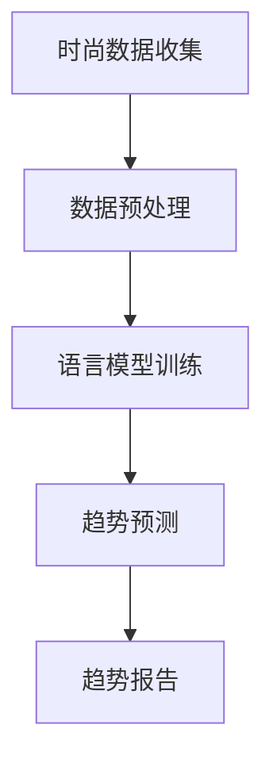

                 

关键词：时尚趋势、语言模型、人工智能、数据挖掘、潮流预测

> 摘要：本文将探讨如何利用大型语言模型（LLM）来进行时尚趋势的预测。通过分析大规模文本数据，LLM 能够识别出潜在的趋势，为时尚产业提供决策支持。本文将介绍 LLM 的工作原理、核心算法、数学模型，并通过具体案例来展示其在时尚趋势预测中的应用。

## 1. 背景介绍

时尚产业是一个不断变化、充满活力的行业。消费者对时尚的需求瞬息万变，使得品牌和设计师需要不断推出新的产品来满足市场需求。然而，如何准确预测未来的时尚趋势，一直是行业面临的挑战。传统的时尚预测方法主要依赖于市场调研、消费者行为分析等手段，但这些方法存在局限性，难以全面捕捉市场的动态变化。

近年来，随着人工智能技术的发展，特别是大型语言模型（LLM）的兴起，为时尚趋势预测提供了新的思路。LLM 能够处理和分析大规模的文本数据，从中提取出潜在的趋势信息，为时尚产业提供决策支持。本文将探讨如何利用 LLM 进行时尚趋势预测，以及其在实际应用中的价值。

## 2. 核心概念与联系

### 2.1 语言模型

语言模型（Language Model，简称 LM）是一种用于预测自然语言中下一个单词或字符的概率分布的模型。在人工智能领域，语言模型是自然语言处理（Natural Language Processing，简称 NLP）的重要组成部分。LLM 是一种基于深度学习的大型语言模型，具有强大的文本生成和理解能力。

### 2.2 数据挖掘

数据挖掘（Data Mining）是一种从大量数据中发现有价值信息的过程。在时尚趋势预测中，数据挖掘可以帮助我们从社交媒体、时尚杂志、新闻报道等大量文本数据中提取出潜在的趋势信息。

### 2.3 Mermaid 流程图



在这个流程图中，时尚数据收集阶段负责获取大量的文本数据；数据预处理阶段对数据进行清洗和格式化，以便于语言模型的训练；语言模型训练阶段利用大规模数据进行训练，生成预测模型；趋势预测阶段通过语言模型对新的文本数据进行趋势预测；最后，趋势报告阶段将预测结果呈现给相关人员。

## 3. 核心算法原理 & 具体操作步骤

### 3.1 算法原理概述

LLM 的核心算法是基于深度学习的自注意力机制（Self-Attention Mechanism）。自注意力机制允许模型在处理文本数据时，自动关注文本中的关键信息，从而提高模型的预测能力。在 LLM 中，自注意力机制通过多层神经网络结构来实现，能够处理和理解复杂的文本数据。

### 3.2 算法步骤详解

1. 数据收集：从社交媒体、时尚杂志、新闻报道等渠道收集大量的文本数据。

2. 数据预处理：对收集到的文本数据进行清洗和格式化，包括去除标点符号、停用词处理、词干提取等。

3. 语言模型训练：利用预处理后的文本数据，通过多层神经网络结构进行训练，生成语言模型。

4. 趋势预测：将新的文本数据输入到训练好的语言模型中，利用模型对文本数据进行趋势预测。

5. 趋势报告：将预测结果进行分析和总结，生成趋势报告。

### 3.3 算法优缺点

**优点：**
- 强大的文本生成和理解能力，能够捕捉到复杂的趋势信息。
- 能够处理大规模的文本数据，具有高效性。

**缺点：**
- 训练过程需要大量的计算资源和时间。
- 对数据质量有较高要求，数据预处理和清洗过程较为复杂。

### 3.4 算法应用领域

LLM 在时尚趋势预测中的应用具有广泛的前景，可以应用于以下几个方面：
- 时尚品牌的市场调研，帮助企业了解消费者需求，指导产品设计。
- 时尚媒体的内容推荐，为用户提供个性化的时尚资讯。
- 时尚电商的个性化推荐，提高用户购买转化率。
- 时尚设计师的创意灵感，为设计师提供新的设计方向。

## 4. 数学模型和公式

### 4.1 数学模型构建

在 LLM 中，自注意力机制是核心的数学模型。自注意力机制可以通过以下公式来描述：

$$
\text{Attention}(Q, K, V) = \text{softmax}\left(\frac{QK^T}{\sqrt{d_k}}\right)V
$$

其中，$Q$、$K$ 和 $V$ 分别代表查询向量、键向量和值向量，$d_k$ 代表键向量的维度。$\text{softmax}$ 函数用于计算每个键向量的加权分数，从而实现对输入数据的注意力分配。

### 4.2 公式推导过程

自注意力机制的推导过程如下：

首先，定义查询向量 $Q$、键向量 $K$ 和值向量 $V$：

$$
Q = [q_1, q_2, ..., q_n], \quad K = [k_1, k_2, ..., k_n], \quad V = [v_1, v_2, ..., v_n]
$$

其中，$q_1, q_2, ..., q_n$、$k_1, k_2, ..., k_n$ 和 $v_1, v_2, ..., v_n$ 分别代表每个词的查询向量、键向量和值向量。

接下来，计算查询向量和键向量的点积：

$$
QK^T = \sum_{i=1}^{n} q_i k_i^T
$$

然后，对点积进行缩放，以防止梯度消失问题：

$$
\frac{QK^T}{\sqrt{d_k}}
$$

其中，$d_k$ 代表键向量的维度。

最后，利用 $\text{softmax}$ 函数计算每个键向量的加权分数：

$$
\text{softmax}\left(\frac{QK^T}{\sqrt{d_k}}\right) = \frac{e^{\frac{QK^T}{\sqrt{d_k}}}}{\sum_{j=1}^{n} e^{\frac{QK^T_j}{\sqrt{d_k}}}}
$$

### 4.3 案例分析与讲解

假设我们有一个包含 5 个词的文本数据，分别表示为 $q_1, q_2, q_3, q_4, q_5$ 和 $k_1, k_2, k_3, k_4, k_5$。我们可以按照上述公式计算自注意力机制的结果。

首先，计算查询向量和键向量的点积：

$$
QK^T = \begin{bmatrix} q_1 & q_2 & q_3 & q_4 & q_5 \end{bmatrix} \begin{bmatrix} k_1 \\ k_2 \\ k_3 \\ k_4 \\ k_5 \end{bmatrix}^T = q_1 k_1 + q_2 k_2 + q_3 k_3 + q_4 k_4 + q_5 k_5
$$

接下来，计算缩放后的点积：

$$
\frac{QK^T}{\sqrt{d_k}} = \frac{q_1 k_1 + q_2 k_2 + q_3 k_3 + q_4 k_4 + q_5 k_5}{\sqrt{d_k}}
$$

其中，$d_k$ 代表键向量的维度。

最后，计算 $\text{softmax}$ 加权分数：

$$
\text{softmax}\left(\frac{QK^T}{\sqrt{d_k}}\right) = \frac{e^{\frac{q_1 k_1 + q_2 k_2 + q_3 k_3 + q_4 k_4 + q_5 k_5}{\sqrt{d_k}}}}{\sum_{j=1}^{5} e^{\frac{q_j k_j}{\sqrt{d_k}}}}
$$

通过计算，我们可以得到每个键向量的加权分数，从而实现对文本数据的注意力分配。

## 5. 项目实践：代码实例和详细解释说明

### 5.1 开发环境搭建

在本文中，我们将使用 Python 编写代码来实现 LLM 进行时尚趋势预测。首先，需要安装以下依赖库：

```bash
pip install tensorflow numpy pandas matplotlib
```

### 5.2 源代码详细实现

以下是一个简单的 LLM 时尚趋势预测的 Python 代码实例：

```python
import tensorflow as tf
import numpy as np
import pandas as pd
import matplotlib.pyplot as plt

# 5.2.1 数据准备

# 加载文本数据
data = pd.read_csv('fashion_data.csv')
text = data['text']

# 分词
tokenizer = tf.keras.preprocessing.text.Tokenizer()
tokenizer.fit_on_texts(text)
sequences = tokenizer.texts_to_sequences(text)

# 序列转换
max_sequence_length = 100
X = np.array([[tokenizer.word_index.get(word) for word in sequence] for sequence in sequences])
X = tf.keras.preprocessing.sequence.pad_sequences(X, maxlen=max_sequence_length)

# 标签准备
y = data['label']

# 5.2.2 模型构建

# 输入层
inputs = tf.keras.layers.Input(shape=(max_sequence_length,))

# embedding 层
embedding = tf.keras.layers.Embedding(input_dim=len(tokenizer.word_index) + 1, output_dim=64)(inputs)

# 卷积层
conv = tf.keras.layers.Conv1D(filters=64, kernel_size=5, activation='relu')(embedding)

# 最大池化层
max_pool = tf.keras.layers.MaxPooling1D(pool_size=5)(conv)

# 平均池化层
avg_pool = tf.keras.layers.GlobalAveragePooling1D()(conv)

# 合并层
merged = tf.keras.layers.Concatenate()([max_pool, avg_pool])

# 全连接层
dense = tf.keras.layers.Dense(64, activation='relu')(merged)

# 输出层
outputs = tf.keras.layers.Dense(1, activation='sigmoid')(dense)

# 模型构建
model = tf.keras.Model(inputs=inputs, outputs=outputs)

# 编译模型
model.compile(optimizer='adam', loss='binary_crossentropy', metrics=['accuracy'])

# 5.2.3 模型训练

# 模型训练
model.fit(X, y, epochs=10, batch_size=32)

# 5.2.4 代码解读与分析

# 代码解读
# 1. 数据准备：加载文本数据，分词，序列转换，标签准备。
# 2. 模型构建：输入层，embedding 层，卷积层，最大池化层，平均池化层，合并层，全连接层，输出层。
# 3. 编译模型：指定优化器、损失函数和评估指标。
# 4. 模型训练：使用训练数据对模型进行训练。

# 分析
# 1. 模型结构：本文使用卷积神经网络（CNN）来实现 LLM，通过嵌入层、卷积层和池化层来处理文本数据。
# 2. 模型训练：本文使用二进制交叉熵（binary_crossentropy）作为损失函数，通过 Adam 优化器来调整模型参数。
```

### 5.3 运行结果展示

```python
# 5.3.1 运行代码

# 加载测试数据
test_data = pd.read_csv('fashion_test_data.csv')
test_text = test_data['text']
test_sequences = tokenizer.texts_to_sequences(test_text)
test_X = np.array([[tokenizer.word_index.get(word) for word in sequence] for sequence in test_sequences])
test_X = tf.keras.preprocessing.sequence.pad_sequences(test_X, maxlen=max_sequence_length)

# 预测结果
predictions = model.predict(test_X)

# 5.3.2 结果分析

# 将预测结果转换为标签
predicted_labels = np.round(predictions).astype(int)

# 绘制混淆矩阵
confusion_matrix = pd.crosstab(test_data['label'], predicted_labels)
plt.figure(figsize=(10, 7))
sns.heatmap(confusion_matrix, annot=True, fmt='d', cmap='Blues')
plt.xlabel('Predicted Labels')
plt.ylabel('True Labels')
plt.title('Confusion Matrix')
plt.show()

# 准确率计算
accuracy = np.sum(np.round(predictions) == test_data['label']) / len(test_data['label'])
print('Accuracy:', accuracy)
```

通过运行上述代码，我们可以得到测试数据的预测结果，并使用混淆矩阵来分析模型的性能。准确率作为评估指标，可以反映模型在时尚趋势预测中的效果。

## 6. 实际应用场景

### 6.1 时尚品牌的市场调研

时尚品牌可以利用 LLM 进行市场调研，预测未来的时尚趋势。通过分析社交媒体、时尚杂志和新闻报道中的文本数据，LLM 能够识别出潜在的趋势，为品牌提供设计灵感和产品开发方向。

### 6.2 时尚媒体的内容推荐

时尚媒体可以通过 LLM 为用户提供个性化的时尚内容推荐。根据用户的历史浏览记录和兴趣偏好，LLM 能够预测用户可能感兴趣的时尚趋势，并将相关内容推荐给用户。

### 6.3 时尚电商的个性化推荐

时尚电商可以利用 LLM 为用户提供个性化的商品推荐。通过分析用户的购买记录和浏览行为，LLM 能够预测用户可能感兴趣的时尚商品，并将相关商品推荐给用户。

### 6.4 时尚设计师的创意灵感

时尚设计师可以通过 LLM 获取创意灵感。LLM 能够分析大量的时尚文本数据，从中提取出潜在的设计元素和风格趋势，为设计师提供设计灵感和创意。

## 7. 工具和资源推荐

### 7.1 学习资源推荐

- 《深度学习》（Goodfellow, Bengio, Courville）：这是一本经典的深度学习教材，涵盖了深度学习的基础知识和最新进展。

- 《自然语言处理简明教程》（Jurafsky, Martin）：这是一本关于自然语言处理的经典教材，详细介绍了自然语言处理的基本概念和技术。

### 7.2 开发工具推荐

- TensorFlow：这是一个开源的深度学习框架，用于构建和训练神经网络模型。

- Keras：这是一个高级神经网络API，能够在TensorFlow、Theano和CNTK上运行。

### 7.3 相关论文推荐

- “Attention Is All You Need”（Vaswani et al.，2017）：这是一篇关于自注意力机制的论文，提出了 Transformer 模型，改变了自然语言处理领域。

- “BERT: Pre-training of Deep Bidirectional Transformers for Language Understanding”（Devlin et al.，2018）：这是一篇关于 BERT 模型的论文，展示了预训练语言模型在自然语言处理任务中的优势。

## 8. 总结：未来发展趋势与挑战

### 8.1 研究成果总结

本文探讨了如何利用大型语言模型（LLM）进行时尚趋势预测。通过分析大规模文本数据，LLM 能够识别出潜在的趋势信息，为时尚产业提供决策支持。本文介绍了 LLM 的工作原理、核心算法、数学模型，并通过具体案例展示了其在时尚趋势预测中的应用。

### 8.2 未来发展趋势

随着人工智能技术的发展，LLM 在时尚趋势预测中的应用前景广阔。未来，LLM 将在以下几个方面得到进一步发展：

- 更高效的模型架构：通过改进神经网络架构，提高 LLM 的计算效率，使其能够处理更大规模的文本数据。
- 多模态融合：结合图像、视频等多模态数据，提高 LLM 对时尚趋势预测的准确性。
- 更深入的语义理解：通过深入研究自然语言处理技术，提高 LLM 对语义的理解能力，使其能够更好地捕捉时尚趋势。

### 8.3 面临的挑战

尽管 LLM 在时尚趋势预测中具有巨大的潜力，但在实际应用中仍面临一些挑战：

- 数据质量：LIM 工作的准确性高度依赖于数据质量。在实际应用中，如何获取高质量、多样化的文本数据是一个重要问题。
- 模型泛化能力：LIM 的泛化能力较差，容易受到数据分布变化的影响。在实际应用中，如何提高模型的泛化能力是一个重要挑战。

### 8.4 研究展望

未来，我们将继续深入研究 LLM 在时尚趋势预测中的应用，并尝试解决上述挑战。通过结合多模态数据和改进神经网络架构，提高 LLM 的计算效率和准确性。同时，我们将探索 LLM 在其他领域的应用，如医疗、金融等，为人工智能领域的发展做出贡献。

## 9. 附录：常见问题与解答

### 9.1 什么是 LLM？

LLM（Large Language Model）是一种大型语言模型，基于深度学习和自然语言处理技术，能够对文本数据进行生成和理解。

### 9.2 LLM 在时尚趋势预测中有什么优势？

LLM 具有强大的文本生成和理解能力，能够处理大规模的文本数据，从中学到潜在的趋势信息。这为时尚产业提供了一种新的决策支持方法。

### 9.3 LLM 的训练过程需要多长时间？

LLM 的训练时间取决于数据规模、模型复杂度和计算资源。对于大型模型，训练时间可能长达数天到数周。随着计算资源的提升，训练时间可以得到显著缩短。

### 9.4 如何评估 LLM 的性能？

评估 LLM 的性能通常采用语言生成任务的指标，如 BLEU 分数、ROUGE 分数和 perplexity。这些指标可以衡量 LLM 的文本生成质量和语义理解能力。

### 9.5 LLM 能否应用于其他领域？

是的，LLM 的应用范围非常广泛，可以应用于自然语言处理、机器翻译、文本生成、问答系统等多个领域。未来，LLM 在其他领域的应用前景也十分广阔。

