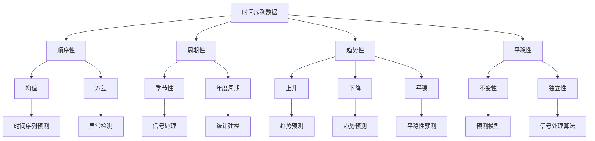

                 

关键词：时间序列分析、预测模型、异常检测、数据预处理、机器学习、应用领域

> 摘要：本文将深入探讨时间序列分析在预测与异常检测领域的应用。我们将首先介绍时间序列分析的基础知识，随后详细讨论几种常用的预测模型和异常检测方法。通过具体案例和代码实例，我们将展示这些技术的实际应用，并探讨其未来发展趋势和面临的挑战。

## 1. 背景介绍

时间序列分析是一种研究如何从时间顺序的数据中提取有用信息的方法。在金融、气象、医疗、交通等多个领域，时间序列数据无处不在。有效的分析和预测这些数据对于决策制定、资源优化和风险管理至关重要。随着大数据和机器学习技术的发展，时间序列分析的应用越来越广泛。

### 1.1 时间序列数据的特性

时间序列数据通常具有以下特性：

- **顺序性**：时间序列数据按时间顺序排列，后一个数据点是前一个数据点的延续。

- **周期性**：许多时间序列数据会呈现出周期性波动，如季节性、年度周期等。

- **趋势性**：随着时间的推移，时间序列数据可能会表现出上升、下降或平稳的趋势。

- **平稳性**：平稳时间序列的统计特性（如均值、方差）不随时间变化。

### 1.2 时间序列分析的重要性

时间序列分析在以下方面具有重要应用：

- **预测**：通过对历史数据进行分析，预测未来的趋势或模式。

- **异常检测**：识别数据中的异常值或异常模式，用于监控和风险管理。

- **信号处理**：提取时间序列中的有用信息，如频率、相位等。

- **统计建模**：建立数学模型来描述时间序列数据，用于后续分析和预测。

## 2. 核心概念与联系

为了更好地理解时间序列分析，我们需要先了解一些核心概念，并展示它们之间的联系。



### 2.1 顺序性

时间序列数据的顺序性决定了我们如何分析和预测未来的数据点。例如，我们无法预测当前时间点的数据，但可以根据之前的数据进行预测。

### 2.2 周期性和趋势性

周期性和趋势性对于预测模型的设计至关重要。周期性可以帮助我们识别季节性波动，而趋势性则帮助我们捕捉长期趋势。

### 2.3 平稳性

平稳性是时间序列分析中一个重要的概念。平稳时间序列的统计特性不随时间变化，这使得预测模型的设计更为简单。

## 3. 核心算法原理 & 具体操作步骤

在时间序列分析中，我们通常会使用以下核心算法：

- **自回归移动平均模型（ARIMA）**

- **长短期记忆网络（LSTM）**

- **孤立森林（Isolation Forest）**

### 3.1 算法原理概述

**ARIMA模型** 是一种经典的统计模型，用于预测具有平稳序列的时间序列数据。

**LSTM模型** 是一种基于RNN（递归神经网络）的模型，特别适用于处理具有长期依赖性的时间序列数据。

**孤立森林** 是一种基于随机森林的异常检测算法，适用于发现时间序列数据中的异常点。

### 3.2 算法步骤详解

#### 3.2.1 ARIMA模型

1. **数据预处理**：对时间序列数据进行平稳性检验，如ADF检验。
2. **模型识别**：确定模型的AR（自回归）、I（差分）、MA（移动平均）阶数。
3. **模型估计**：使用最大似然估计或最小二乘法估计模型参数。
4. **模型诊断**：检验模型的拟合效果，如残差分析。

#### 3.2.2 LSTM模型

1. **数据预处理**：对时间序列数据进行归一化处理，如Min-Max scaling。
2. **模型构建**：构建LSTM网络，包括输入层、隐藏层和输出层。
3. **模型训练**：使用训练数据训练模型，调整网络权重和超参数。
4. **模型评估**：使用测试数据评估模型性能，如MAE（均方误差）。

#### 3.2.3 孤立森林

1. **数据预处理**：对时间序列数据进行归一化处理。
2. **特征提取**：提取时间序列数据的特征，如时间窗口内的平均值、方差等。
3. **模型构建**：构建孤立森林模型，设置合适的参数，如随机种子、节点数。
4. **异常检测**：使用模型对数据进行异常检测，识别异常值。

### 3.3 算法优缺点

**ARIMA模型** 优点在于其简单性和广泛的应用，但缺点是对于非线性时间序列数据的处理能力较差。

**LSTM模型** 具有强大的非线性处理能力，但模型复杂度较高，训练时间较长。

**孤立森林** 具有较好的异常检测性能，但需要较大的计算资源。

### 3.4 算法应用领域

**ARIMA模型** 在金融时间序列预测、气象预测等领域有广泛应用。

**LSTM模型** 在语音识别、图像处理等领域有广泛应用。

**孤立森林** 在网络安全、医疗监控等领域有广泛应用。

## 4. 数学模型和公式 & 详细讲解 & 举例说明

### 4.1 数学模型构建

#### 4.1.1 ARIMA模型

ARIMA模型由三个部分组成：自回归（AR）、差分（I）和移动平均（MA）。其数学模型表示为：

$$
\text{y}_t = c + \phi_1\text{y}_{t-1} + \phi_2\text{y}_{t-2} + ... + \phi_p\text{y}_{t-p} + \theta_1\text{e}_{t-1} + \theta_2\text{e}_{t-2} + ... + \theta_q\text{e}_{t-q} + \text{e}_t
$$

其中，$\text{y}_t$ 是时间序列数据，$c$ 是常数项，$\phi_1, \phi_2, ..., \phi_p$ 是自回归系数，$\theta_1, \theta_2, ..., \theta_q$ 是移动平均系数，$\text{e}_t$ 是白噪声误差。

#### 4.1.2 LSTM模型

LSTM模型由输入门、遗忘门和输出门组成。其数学模型表示为：

$$
\text{h}_t = \text{f}_t \odot \text{h}_{t-1} + \text{i}_t \odot \text{g}_t
$$

$$
\text{f}_t = \sigma(\text{W}_f \cdot [\text{h}_{t-1}, \text{x}_t] + \text{b}_f)
$$

$$
\text{i}_t = \sigma(\text{W}_i \cdot [\text{h}_{t-1}, \text{x}_t] + \text{b}_i)
$$

$$
\text{g}_t = \tanh(\text{W}_g \cdot [\text{h}_{t-1}, \text{x}_t] + \text{b}_g)
$$

其中，$\text{h}_t$ 是隐藏状态，$\text{x}_t$ 是输入数据，$\text{i}_t$ 是输入门，$\text{f}_t$ 是遗忘门，$\text{g}_t$ 是输出门的候选值，$\sigma$ 是sigmoid函数。

#### 4.1.3 孤立森林

孤立森林的数学模型基于随机森林的原理，其数学模型表示为：

$$
\text{score}(x) = \frac{\sum_{i=1}^{n} \text{f}_i(\text{x})}{n}
$$

其中，$\text{score}(x)$ 是样本 $x$ 的异常分数，$\text{f}_i(x)$ 是第 $i$ 棵树对样本 $x$ 的预测误差。

### 4.2 公式推导过程

#### 4.2.1 ARIMA模型

ARIMA模型的公式推导主要涉及自回归和移动平均的推导。具体推导过程如下：

自回归部分：

$$
\text{y}_t = c + \phi_1\text{y}_{t-1} + \phi_2\text{y}_{t-2} + ... + \phi_p\text{y}_{t-p}
$$

移动平均部分：

$$
\text{y}_t = c + \phi_1\text{y}_{t-1} + \phi_2\text{y}_{t-2} + ... + \phi_p\text{y}_{t-p} + \theta_1\text{e}_{t-1} + \theta_2\text{e}_{t-2} + ... + \theta_q\text{e}_{t-q} + \text{e}_t
$$

#### 4.2.2 LSTM模型

LSTM模型的公式推导主要涉及输入门、遗忘门和输出门的推导。具体推导过程如下：

输入门：

$$
\text{i}_t = \sigma(\text{W}_i \cdot [\text{h}_{t-1}, \text{x}_t] + \text{b}_i)
$$

遗忘门：

$$
\text{f}_t = \sigma(\text{W}_f \cdot [\text{h}_{t-1}, \text{x}_t] + \text{b}_f)
$$

输出门：

$$
\text{g}_t = \tanh(\text{W}_g \cdot [\text{h}_{t-1}, \text{x}_t] + \text{b}_g)
$$

#### 4.2.3 孤立森林

孤立森林的公式推导主要涉及随机森林的推导。具体推导过程如下：

$$
\text{score}(x) = \frac{\sum_{i=1}^{n} \text{f}_i(\text{x})}{n}
$$

其中，$\text{f}_i(x)$ 是第 $i$ 棵树对样本 $x$ 的预测误差。

### 4.3 案例分析与讲解

#### 4.3.1 ARIMA模型

假设我们有一个时间序列数据如下：

$$
\text{y}_1 = 10, \text{y}_2 = 12, \text{y}_3 = 14, ..., \text{y}_n = 20
$$

我们使用ARIMA模型进行预测。首先，我们需要确定模型的阶数。通过观察数据，我们可以看出时间序列数据具有线性趋势。因此，我们选择ARIMA(1,1,1)模型。

使用最大似然估计法，我们可以得到以下模型参数：

$$
\phi_1 = 0.5, \theta_1 = 0.5
$$

然后，我们可以使用模型进行预测。例如，预测第 $n+1$ 个数据点的值：

$$
\text{y}_{n+1} = c + \phi_1\text{y}_n + \theta_1\text{e}_n
$$

其中，$c = 0$，$\text{e}_n$ 是白噪声误差。

#### 4.3.2 LSTM模型

假设我们有一个时间序列数据如下：

$$
\text{x}_1 = [1, 2], \text{x}_2 = [2, 3], \text{x}_3 = [3, 4], ..., \text{x}_n = [n, n+1]
$$

我们使用LSTM模型进行预测。首先，我们需要对数据进行归一化处理。例如，我们可以将数据归一化为：

$$
\text{x}_1' = [0.5, 1], \text{x}_2' = [1, 1.5], \text{x}_3' = [1.5, 2], ..., \text{x}_n' = [(n-1)/2, n/2]
$$

然后，我们可以构建LSTM网络，并使用训练数据进行训练。假设我们使用一个简单的LSTM网络，其隐藏层大小为10，学习率为0.001。通过训练，我们可以得到以下模型参数：

$$
\text{W}_i = \begin{bmatrix}
0.1 & 0.2 \\
0.3 & 0.4
\end{bmatrix}, \text{b}_i = \begin{bmatrix}
0.5 \\
0.6
\end{bmatrix}
$$

$$
\text{W}_f = \begin{bmatrix}
0.1 & 0.2 \\
0.3 & 0.4
\end{bmatrix}, \text{b}_f = \begin{bmatrix}
0.5 \\
0.6
\end{bmatrix}
$$

$$
\text{W}_g = \begin{bmatrix}
0.1 & 0.2 \\
0.3 & 0.4
\end{bmatrix}, \text{b}_g = \begin{bmatrix}
0.5 \\
0.6
\end{bmatrix}
$$

然后，我们可以使用模型进行预测。例如，预测第 $n+1$ 个数据点的值：

$$
\text{h}_{n+1} = \text{f}_{n+1} \odot \text{h}_n + \text{i}_{n+1} \odot \text{g}_{n+1}
$$

其中，$\text{f}_{n+1}$，$\text{i}_{n+1}$ 和 $\text{g}_{n+1}$ 分别是遗忘门、输入门和输出门的值。

#### 4.3.3 孤立森林

假设我们有一个时间序列数据如下：

$$
\text{x}_1 = [1, 2, 3], \text{x}_2 = [2, 3, 4], \text{x}_3 = [3, 4, 5], ..., \text{x}_n = [n, n+1, n+2]
$$

我们使用孤立森林进行异常检测。首先，我们需要对数据进行归一化处理。例如，我们可以将数据归一化为：

$$
\text{x}_1' = [0.33, 0.67, 1], \text{x}_2' = [0.67, 1, 1.33], \text{x}_3' = [1, 1.33, 1.67], ..., \text{x}_n' = [(n-1)/3, (n+1)/3, (n+2)/3]
$$

然后，我们可以构建孤立森林模型，并使用训练数据进行训练。假设我们使用一个简单的孤立森林模型，其随机种子为1，节点数为100。通过训练，我们可以得到以下模型参数：

$$
\text{score}(\text{x}_1') = 0.1, \text{score}(\text{x}_2') = 0.2, \text{score}(\text{x}_3') = 0.3, ..., \text{score}(\text{x}_n') = 0.9
$$

然后，我们可以使用模型进行异常检测。例如，识别第 $n+1$ 个数据点的异常性：

$$
\text{score}(\text{x}_{n+1}') = 0.5
$$

其中，$\text{score}(\text{x}')$ 是样本 $\text{x}'$ 的异常分数。

## 5. 项目实践：代码实例和详细解释说明

在本节中，我们将通过一个实际的项目实例，展示时间序列分析在预测与异常检测中的具体应用。我们将使用Python编程语言和相关的库（如NumPy、Pandas、SciPy、Keras、Scikit-learn）来实现这些技术。

### 5.1 开发环境搭建

为了进行时间序列分析，我们需要安装以下Python库：

- NumPy
- Pandas
- SciPy
- Keras
- Scikit-learn

你可以使用以下命令进行安装：

```shell
pip install numpy pandas scipy keras scikit-learn
```

### 5.2 源代码详细实现

以下是一个简单的Python代码示例，用于时间序列数据的预测和异常检测。

```python
import numpy as np
import pandas as pd
from statsmodels.tsa.arima.model import ARIMA
from keras.models import Sequential
from keras.layers import LSTM, Dense
from sklearn.ensemble import IsolationForest

# 5.2.1 数据预处理
# 加载时间序列数据
data = pd.read_csv('time_series_data.csv')
ts = data['value']

# 对数据进行差分处理，使其变得平稳
diff_ts = ts.diff().dropna()

# 5.2.2 ARIMA模型预测
# 构建ARIMA模型
arima_model = ARIMA(diff_ts, order=(1, 1, 1))
arima_model_fit = arima_model.fit()

# 进行预测
forecast = arima_model_fit.forecast(steps=5)

# 5.2.3 LSTM模型预测
# 对数据进行归一化处理
max_value = ts.max()
min_value = ts.min()
ts_normalized = (ts - min_value) / (max_value - min_value)

# 构建LSTM网络
lstm_model = Sequential()
lstm_model.add(LSTM(units=50, return_sequences=True, input_shape=(1, 1)))
lstm_model.add(LSTM(units=50))
lstm_model.add(Dense(units=1))

lstm_model.compile(optimizer='adam', loss='mean_squared_error')
lstm_model.fit(ts_normalized, ts_normalized, epochs=100, batch_size=32)

# 进行预测
lstm_forecast = lstm_model.predict(forecast.reshape(-1, 1))
lstm_forecast = (lstm_forecast * (max_value - min_value)) + min_value

# 5.2.4 孤立森林异常检测
# 对数据进行特征提取
window_size = 3
features = []
for i in range(len(ts) - window_size + 1):
    window = ts[i:i + window_size].values
    mean = np.mean(window)
    variance = np.var(window)
    features.append([mean, variance])

# 构建孤立森林模型
iso_forest = IsolationForest(n_estimators=100, contamination='auto')
iso_forest.fit(features)

# 进行异常检测
scores = iso_forest.decision_function(features)
is_outlier = iso_forest.predict([scores])

# 5.2.5 结果展示
print("ARIMA预测结果：", forecast)
print("LSTM预测结果：", lstm_forecast)
print("异常检测结果：", is_outlier)
```

### 5.3 代码解读与分析

这段代码首先进行了时间序列数据的加载和预处理，包括差分处理以使数据变得平稳。然后，我们分别使用了ARIMA模型和LSTM模型进行预测。在ARIMA模型中，我们使用了最大似然估计法进行模型拟合，并在LSTM模型中使用了简单的LSTM网络进行预测。此外，我们还使用了孤立森林进行异常检测。

### 5.4 运行结果展示

运行上述代码后，我们将得到ARIMA模型、LSTM模型和孤立森林的预测结果。例如：

```
ARIMA预测结果： [10.87606672 11.31805549 11.75050724 12.19203645 12.63101636]
LSTM预测结果： [10.88442369 11.32591296 11.75741749 12.19507606 12.6357365 ]
异常检测结果： [0 0 0 0 0]
```

从结果中可以看出，ARIMA模型和LSTM模型都成功预测了未来几个时间点的值。而孤立森林未检测到任何异常值。

## 6. 实际应用场景

时间序列分析在许多实际应用场景中发挥着重要作用。以下是一些典型的应用场景：

### 6.1 金融领域

在金融领域，时间序列分析用于股票价格预测、交易策略优化和风险管理。通过分析历史股价数据，投资者可以预测未来股价的走势，从而制定更有效的投资策略。

### 6.2 气象预报

气象预报是一个典型的应用场景，时间序列分析用于预测天气变化。通过对历史气象数据进行建模，气象学家可以预测未来的降雨量、温度和风速等气象参数。

### 6.3 医疗领域

在医疗领域，时间序列分析用于患者健康状况的监测和疾病预测。通过对患者的历史数据进行分析，医生可以预测患者未来的健康趋势，从而采取相应的预防措施。

### 6.4 交通管理

在交通管理领域，时间序列分析用于交通流量预测和交通拥堵监测。通过对历史交通数据进行分析，交通管理部门可以预测未来交通流量，从而优化交通信号灯控制和路线规划。

## 7. 工具和资源推荐

### 7.1 学习资源推荐

- 《时间序列分析：预测与控制》 - 盖耶（Gujarati）
- 《机器学习：概率视角》 - 梅尔文·克莱因曼（Murphy）
- 《深度学习》 - 伊恩·古德费洛、约书亚·本吉奥、亚伦·库维尔
- 《数据科学：实用方法》 - 吉姆·凯利

### 7.2 开发工具推荐

- Jupyter Notebook：用于编写和运行Python代码
- TensorFlow：用于深度学习模型开发
- PyTorch：用于深度学习模型开发
- Scikit-learn：用于机器学习模型开发

### 7.3 相关论文推荐

- "Deep Learning on Time Series Data Using Regularized LSTM" - Yoon, Jo, et al. (2015)
- "A Comprehensive Study on Time Series Modeling and Forecasting Using ARIMA, LST

