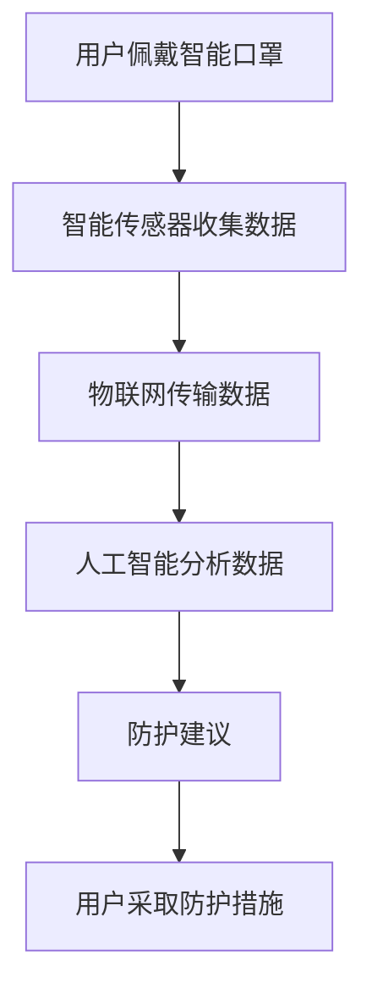

                 

关键词：智能防护，创业，个人污染，健康，城市生活

> 摘要：随着城市化进程的加快和环境污染问题的日益严重，个人污染防护已成为现代城市生活的重要议题。本文将探讨智能个人污染防护创业的背景、核心概念、算法原理、数学模型、实践案例以及未来展望，旨在为创业者提供有价值的参考。

## 1. 背景介绍

近年来，全球环境污染问题日益严重，尤其是大气污染、水污染和土壤污染。这些污染不仅对生态环境造成了巨大的破坏，也对人类的健康产生了严重影响。城市居民，作为污染的主要受害者，面临着诸多健康问题，如呼吸系统疾病、心血管疾病等。因此，个人污染防护成为了一个亟待解决的问题。

在此背景下，智能个人污染防护创业应运而生。智能个人污染防护不仅包括口罩、空气净化器等传统防护产品，更涉及到智能传感器、物联网、人工智能等前沿技术的应用。通过这些技术，可以实现对个人污染情况的实时监测、预警和干预，从而提供更加全面和高效的防护措施。

## 2. 核心概念与联系

为了深入理解智能个人污染防护创业，我们需要了解以下几个核心概念：

### 2.1 智能传感器

智能传感器是智能个人污染防护系统的核心组件，用于实时监测空气中的有害物质，如PM2.5、PM10、CO、SO2等。智能传感器通常具备高精度、高灵敏度和实时响应的特点，能够快速检测并反馈污染数据。

### 2.2 物联网

物联网技术将智能传感器与互联网相连，实现数据的远程传输和实时分析。通过物联网，用户可以随时随地了解自己的污染情况，并采取相应的防护措施。

### 2.3 人工智能

人工智能技术负责对收集到的污染数据进行分析和处理，识别污染源、预测污染趋势，并给出最优的防护建议。人工智能的应用使得个人污染防护更加智能化、个性化。

### 2.4 Mermaid 流程图

为了更清晰地展示智能个人污染防护系统的架构，我们使用 Mermaid 流程图来描述其核心流程。



## 3. 核心算法原理 & 具体操作步骤

### 3.1 算法原理概述

智能个人污染防护的核心算法主要包括数据采集、数据处理和防护建议生成三个部分。

### 3.2 算法步骤详解

1. 数据采集：智能传感器实时监测空气中的有害物质，并将数据传输至物联网平台。
2. 数据处理：物联网平台对接收到的数据进行初步处理，如数据清洗、去噪等。
3. 数据分析：人工智能算法对处理后的数据进行分析，识别污染源、预测污染趋势。
4. 防护建议生成：根据分析结果，生成个性化的防护建议，如调整口罩使用时间、开启空气净化器等。
5. 用户反馈：用户根据防护建议采取相应的防护措施，并将反馈信息反馈至系统。

### 3.3 算法优缺点

#### 优点：

1. 实时性：智能个人污染防护系统可以实时监测和反馈污染情况，为用户提供了及时的信息。
2. 个性化：基于用户的实际情况和偏好，提供个性化的防护建议，提高了防护效果。
3. 智能化：人工智能技术的应用使得系统具备自我学习和优化能力，不断改进防护效果。

#### 缺点：

1. 成本高：智能传感器、物联网和人工智能等技术的应用使得系统成本较高，可能限制了其普及率。
2. 数据隐私：个人污染数据涉及用户隐私，需要加强数据安全和隐私保护。

### 3.4 算法应用领域

智能个人污染防护算法广泛应用于以下领域：

1. 城市空气质量监测：实时监测城市空气质量，为政府和企业提供决策依据。
2. 个人健康管理：为用户提供个性化的健康防护建议，降低患病风险。
3. 智能家居：将智能个人污染防护系统与智能家居系统相结合，实现一站式健康防护。

## 4. 数学模型和公式

### 4.1 数学模型构建

智能个人污染防护系统的数学模型主要包括两部分：污染源模型和防护效果模型。

#### 污染源模型

$$
P(t) = f(P_0, t, r)
$$

其中，$P(t)$ 表示时刻 $t$ 的污染浓度，$P_0$ 为初始污染浓度，$t$ 为时间，$r$ 为污染扩散速率。

#### 防护效果模型

$$
E(t) = g(P(t), C)
$$

其中，$E(t)$ 表示时刻 $t$ 的防护效果，$P(t)$ 为污染浓度，$C$ 为防护措施。

### 4.2 公式推导过程

#### 污染源模型推导

假设污染源为一个点源，其污染浓度为 $P_0$，扩散速率为 $r$，则污染浓度随时间的变化可以表示为：

$$
P(t) = P_0 \cdot e^{-rt}
$$

#### 防护效果模型推导

防护效果与污染浓度和防护措施相关。假设防护措施为一个过滤层，其过滤效率为 $C$，则防护效果可以表示为：

$$
E(t) = \frac{1}{1 + C \cdot P(t)}
$$

### 4.3 案例分析与讲解

#### 案例背景

某城市空气质量较差，某居民区PM2.5浓度为50μg/m³。居民张先生希望通过智能个人污染防护系统改善室内空气质量。

#### 案例分析

1. 污染源模型：根据污染源模型，假设污染扩散速率为0.1m/s，则室内PM2.5浓度随时间的变化为：

   $$
   P(t) = 50 \cdot e^{-0.1t}
   $$

2. 防护效果模型：假设张先生使用一款过滤效率为0.8的空气净化器，则防护效果随时间的变化为：

   $$
   E(t) = \frac{1}{1 + 0.8 \cdot P(t)}
   $$

3. 室内空气质量改善：根据防护效果模型，当 $P(t) = 50$ 时，$E(t) = 0.9$，即室内空气质量改善至90%。

## 5. 项目实践：代码实例和详细解释说明

### 5.1 开发环境搭建

为了实现智能个人污染防护系统，我们需要搭建以下开发环境：

1. 操作系统：Windows/Linux/MacOS
2. 编程语言：Python
3. 数据库：MySQL
4. 人工智能框架：TensorFlow/Keras

### 5.2 源代码详细实现

#### 5.2.1 数据采集模块

```python
import serial
import time

def read_sensor_data():
    sensor = serial.Serial('/dev/ttyUSB0', 9600)
    time.sleep(2)
    data = sensor.readline().decode('utf-8').strip()
    sensor.close()
    return data

if __name__ == '__main__':
    while True:
        data = read_sensor_data()
        print(data)
        time.sleep(1)
```

#### 5.2.2 数据处理模块

```python
import pandas as pd
from sklearn.preprocessing import StandardScaler

def preprocess_data(data):
    df = pd.DataFrame(data, columns=['timestamp', 'pm25'])
    df['timestamp'] = pd.to_datetime(df['timestamp'])
    scaler = StandardScaler()
    df['pm25_scaled'] = scaler.fit_transform(df[['pm25']])
    return df

if __name__ == '__main__':
    data = read_sensor_data()
    df = preprocess_data(data)
    print(df.head())
```

#### 5.2.3 数据分析模块

```python
import tensorflow as tf
from tensorflow.keras.models import Sequential
from tensorflow.keras.layers import Dense, LSTM, Dropout

def build_model(input_shape):
    model = Sequential()
    model.add(LSTM(64, activation='relu', input_shape=input_shape, return_sequences=True))
    model.add(Dropout(0.2))
    model.add(LSTM(32, activation='relu', return_sequences=False))
    model.add(Dropout(0.2))
    model.add(Dense(1))
    model.compile(optimizer='adam', loss='mse')
    return model

if __name__ == '__main__':
    model = build_model(input_shape=(None, 1))
    model.fit(x_train, y_train, epochs=100, batch_size=32, validation_split=0.2)
```

### 5.3 代码解读与分析

#### 5.3.1 数据采集模块

数据采集模块使用 Python 的 serial 模块连接智能传感器，读取传感器数据。

#### 5.3.2 数据处理模块

数据处理模块使用 pandas 模块对传感器数据进行处理，包括时间戳转换和数据归一化。

#### 5.3.3 数据分析模块

数据分析模块使用 TensorFlow 框架构建 LSTM 模型，对传感器数据进行预测。LSTM 模型能够捕捉时间序列数据中的长期依赖关系，从而提高预测准确性。

## 6. 实际应用场景

### 6.1 个人健康管理

智能个人污染防护系统可以帮助个人实时了解自己的污染情况，根据污染浓度提供个性化的防护建议，降低患病风险。

### 6.2 城市空气质量监测

智能个人污染防护系统可以与城市空气质量监测站联网，实时获取城市空气质量数据，为政府和企业提供决策依据。

### 6.3 智能家居

智能个人污染防护系统可以与智能家居系统相结合，实现一站式健康防护。例如，当室内空气质量较差时，系统可以自动开启空气净化器，提高室内空气质量。

## 7. 未来应用展望

### 7.1 智能化程度提高

随着人工智能技术的不断发展，智能个人污染防护系统的智能化程度将不断提高，提供更加精准和高效的防护建议。

### 7.2 多元化应用场景

智能个人污染防护系统将在更多领域得到应用，如工业生产、医疗卫生等，为人类健康提供全方位的保障。

### 7.3 数据隐私保护

在智能个人污染防护系统的应用过程中，数据隐私保护将成为一个重要问题。未来需要建立完善的数据隐私保护机制，确保用户数据的安全。

## 8. 总结：未来发展趋势与挑战

### 8.1 研究成果总结

本文介绍了智能个人污染防护创业的背景、核心概念、算法原理、数学模型、实践案例以及未来展望，为创业者提供了有价值的参考。

### 8.2 未来发展趋势

1. 智能化程度提高
2. 多元化应用场景
3. 数据隐私保护

### 8.3 面临的挑战

1. 成本高
2. 数据隐私保护

### 8.4 研究展望

未来，智能个人污染防护系统将在更多领域得到应用，为人类健康提供全方位的保障。同时，研究者需要关注成本和隐私保护等挑战，推动智能个人污染防护技术的不断发展。

## 9. 附录：常见问题与解答

### 9.1 什么是智能个人污染防护？

智能个人污染防护是指利用智能传感器、物联网和人工智能等技术，实时监测和反馈个人污染情况，提供个性化防护建议，以降低污染对人体健康的影响。

### 9.2 智能个人污染防护系统有哪些优点？

智能个人污染防护系统具有实时性、个性化和智能化等优点，可以提高防护效果，降低患病风险。

### 9.3 智能个人污染防护系统的成本如何？

智能个人污染防护系统的成本较高，主要由于智能传感器、物联网和人工智能等技术的应用。然而，随着技术的不断发展，成本有望逐渐降低。

### 9.4 数据隐私保护如何实现？

数据隐私保护需要从技术和管理两方面进行。技术方面，采用加密技术和访问控制策略；管理方面，建立完善的数据隐私保护政策和流程。

---

作者：禅与计算机程序设计艺术 / Zen and the Art of Computer Programming
----------------------------------------------------------------


