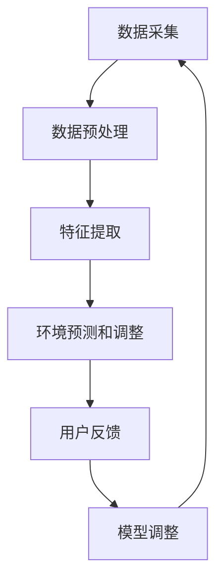

                 

关键词：智能个人环境适应、健康舒适管理、旅行、创业、人工智能、健康监测、环境传感器、环境适应算法、个性化服务

## 摘要

在当今快节奏的社会中，创业者和企业家常常需要频繁旅行，以拓展业务和寻找机遇。然而，不同的旅行环境可能给他们的健康和舒适带来挑战。本文旨在探讨如何通过智能个人环境适应技术，为旅行中的创业者提供健康舒适的管理方案。本文将介绍核心概念、算法原理、数学模型、实际应用以及未来展望，帮助创业者保持最佳状态，提高工作效率。

## 1. 背景介绍

随着全球化进程的加速，创业者和企业家经常需要前往不同的国家和地区进行商务活动。然而，旅行中的环境差异，如气候、气压、湿度等，可能对他们的身体健康和舒适度产生负面影响。例如，长时间的飞行可能导致时差综合症，不同地区的空气质量可能引发呼吸道问题，而高海拔地区可能引发高原反应。此外，紧张的工作安排和频繁的社交活动也可能导致创业者身心疲惫，难以保持高效的工作状态。

面对这些挑战，传统的健康和舒适管理方法往往缺乏个性化、实时性和有效性。因此，开发一种智能个人环境适应系统，能够在旅行中实时监测环境参数，并根据用户健康数据提供个性化的调整方案，显得尤为重要。

### 1.1 智能个人环境适应的概念

智能个人环境适应（Smart Personal Environment Adaptation）是指通过利用物联网、人工智能和传感器技术，实时监测个人所在环境中的各种参数，并根据用户的生理和心理需求，自动调整环境参数，以提供最佳的舒适度和健康状态。

### 1.2 智能个人环境适应的重要性

智能个人环境适应在旅行中的重要性体现在以下几个方面：

- **提高健康水平**：通过监测和调整环境参数，如温度、湿度、空气质量等，可以减少环境因素对健康的负面影响，如呼吸道问题、过敏反应等。
- **提升舒适度**：个性化的环境调整可以满足用户不同的舒适需求，如温度喜好、光线强度等，提高用户的满意度和幸福感。
- **提升工作效率**：舒适的旅行环境有助于减轻疲劳和压力，提高创业者的专注力和工作效率。

### 1.3 目标读者

本文的目标读者主要包括：

- 创业者和企业家，需要频繁旅行的商务人士。
- 物联网和人工智能领域的研究人员和工程师。
- 旅行健康和舒适管理的专业顾问。

## 2. 核心概念与联系

### 2.1 智能个人环境适应的核心概念

智能个人环境适应的核心概念包括以下几个方面：

- **环境传感器**：用于实时监测环境参数，如温度、湿度、空气质量、光线强度等。
- **健康监测传感器**：用于监测用户的生理参数，如心率、血压、血氧饱和度等。
- **人工智能算法**：用于分析传感器数据，提供个性化的环境调整方案。
- **用户接口**：用于用户与系统的交互，如手机APP、智能手表等。

### 2.2 智能个人环境适应的原理和架构

智能个人环境适应的原理和架构可以概括为以下几个步骤：

1. **数据采集**：通过环境传感器和健康监测传感器采集环境参数和用户生理数据。
2. **数据预处理**：对采集到的数据进行分析和清洗，去除噪声和异常值。
3. **特征提取**：从预处理后的数据中提取关键特征，如温度偏好、心率变化等。
4. **环境预测和调整**：利用人工智能算法对用户的健康数据和环境参数进行关联分析，预测用户的环境需求，并自动调整环境参数。
5. **用户反馈**：用户通过用户接口提供反馈，调整环境预测模型，实现更加个性化的服务。

### 2.3 Mermaid 流程图

以下是一个简化的Mermaid流程图，描述了智能个人环境适应的基本流程：



### 2.4 智能个人环境适应的应用领域

智能个人环境适应的应用领域非常广泛，包括但不限于以下方面：

- **旅行**：为创业者提供个性化的健康舒适管理，提高工作效率。
- **办公室**：为员工提供个性化的环境调整，提升工作效率和满意度。
- **家居**：为用户提供个性化的环境管理，提高生活品质。
- **医疗机构**：为病人提供个性化的康复环境，提高康复效果。

## 3. 核心算法原理 & 具体操作步骤

### 3.1 算法原理概述

智能个人环境适应的核心算法是基于机器学习和数据挖掘技术的，其主要目标是根据用户的健康数据和环境参数，预测用户的环境需求，并提供个性化的调整方案。

算法的主要原理包括：

- **特征工程**：从原始数据中提取有代表性的特征，如温度、湿度、心率等。
- **模式识别**：利用机器学习算法，如决策树、支持向量机、神经网络等，识别用户的健康需求和环境参数之间的关系。
- **环境调整**：根据预测结果，自动调整环境参数，如温度、湿度、空气质量等。

### 3.2 算法步骤详解

以下是智能个人环境适应算法的具体步骤：

#### 3.2.1 数据采集

数据采集是算法的基础。智能个人环境适应系统需要配备多种传感器，包括环境传感器和健康监测传感器。环境传感器可以采集温度、湿度、空气质量等环境参数，健康监测传感器可以采集心率、血压、血氧饱和度等生理参数。

#### 3.2.2 数据预处理

数据预处理包括数据清洗、去噪和归一化。数据清洗的目的是去除异常值和噪声，确保数据的质量。去噪和归一化的目的是使数据具有一致性和可比性，便于后续的特征提取和模式识别。

#### 3.2.3 特征提取

特征提取是从原始数据中提取有代表性的特征，如温度、湿度、心率等。这些特征将作为机器学习模型的输入，用于预测用户的环境需求。

#### 3.2.4 模式识别

模式识别是利用机器学习算法，如决策树、支持向量机、神经网络等，识别用户的健康需求和环境参数之间的关系。通过训练模型，可以从历史数据中学习到用户的偏好和行为模式。

#### 3.2.5 环境预测和调整

根据预测结果，自动调整环境参数，如温度、湿度、空气质量等。环境调整的目的是满足用户的个性化需求，提高用户的舒适度和健康水平。

#### 3.2.6 用户反馈

用户通过用户接口提供反馈，如对环境调整的效果进行评价。用户反馈将用于调整环境预测模型，实现更加个性化的服务。

### 3.3 算法优缺点

#### 优点

- **个性化**：智能个人环境适应算法可以根据用户的健康数据和偏好，提供个性化的环境调整方案。
- **实时性**：算法可以实时监测环境参数和用户生理数据，提供即时的调整方案。
- **高效性**：机器学习算法能够快速地从大量历史数据中学习到用户的偏好和行为模式。

#### 缺点

- **数据隐私**：智能个人环境适应系统需要收集用户的健康数据和偏好，这可能涉及数据隐私问题。
- **依赖模型**：算法的预测和调整依赖于机器学习模型的准确性，如果模型训练不充分或存在偏差，可能导致环境调整不当。

### 3.4 算法应用领域

智能个人环境适应算法的应用领域非常广泛，包括但不限于以下方面：

- **健康监测**：通过实时监测用户的生理数据，提供个性化的健康监测和预警服务。
- **环境管理**：通过实时调整环境参数，提高用户的舒适度和健康水平。
- **智能家居**：通过智能个人环境适应技术，实现家居环境的智能管理，提高生活品质。
- **工业制造**：通过实时监测和调整生产线环境参数，提高生产效率和产品质量。

## 4. 数学模型和公式 & 详细讲解 & 举例说明

### 4.1 数学模型构建

智能个人环境适应的数学模型主要包括环境参数预测模型和用户需求预测模型。

#### 4.1.1 环境参数预测模型

环境参数预测模型用于预测环境参数的未来值，如温度、湿度、空气质量等。一个简单的环境参数预测模型可以使用时间序列分析技术，如自回归积分滑动平均模型（ARIMA）。

$$
X_t = c + \phi X_{t-1} + \theta L_t + \varepsilon_t
$$

其中，$X_t$ 表示第 $t$ 时刻的环境参数，$c$ 是常数项，$\phi$ 和 $\theta$ 分别是自回归项和移动平均项，$L_t$ 是滞后项，$\varepsilon_t$ 是误差项。

#### 4.1.2 用户需求预测模型

用户需求预测模型用于预测用户对环境参数的需求，如温度偏好、湿度偏好等。一个简单的用户需求预测模型可以使用线性回归模型。

$$
y_t = \beta_0 + \beta_1 x_t + \varepsilon_t
$$

其中，$y_t$ 表示第 $t$ 时刻的用户需求，$x_t$ 表示第 $t$ 时刻的环境参数，$\beta_0$ 和 $\beta_1$ 分别是回归系数，$\varepsilon_t$ 是误差项。

### 4.2 公式推导过程

#### 4.2.1 环境参数预测模型推导

假设我们有一个时间序列 $X_1, X_2, \ldots, X_t$，表示一系列环境参数。我们首先对时间序列进行自相关分析，以确定自回归项和移动平均项。

$$
\gamma(h) = \frac{Cov(X_t, X_{t-h})}{Var(X_t)}
$$

其中，$\gamma(h)$ 是自相关函数，$Cov(X_t, X_{t-h})$ 是协方差，$Var(X_t)$ 是方差。如果自相关函数在滞后 $h$ 处显著不为零，则说明时间序列具有自相关性。

接下来，我们使用自回归模型进行拟合。

$$
X_t = c + \phi X_{t-1} + \theta L_t + \varepsilon_t
$$

其中，$\phi$ 和 $\theta$ 是待估计的参数。通过最小二乘法，我们可以得到：

$$
\phi = \frac{\sum_{t=1}^{T} X_t X_{t-1}}{\sum_{t=1}^{T} X_t^2}, \quad \theta = \frac{\sum_{t=1}^{T} X_t L_t}{\sum_{t=1}^{T} X_t^2}
$$

#### 4.2.2 用户需求预测模型推导

假设我们有一个时间序列 $Y_1, Y_2, \ldots, Y_t$，表示用户对环境参数的需求。我们首先对时间序列进行线性回归分析。

$$
y_t = \beta_0 + \beta_1 x_t + \varepsilon_t
$$

其中，$\beta_0$ 和 $\beta_1$ 是待估计的参数。通过最小二乘法，我们可以得到：

$$
\beta_0 = \bar{y} - \beta_1 \bar{x}, \quad \beta_1 = \frac{\sum_{t=1}^{T} (y_t - \bar{y})(x_t - \bar{x})}{\sum_{t=1}^{T} (x_t - \bar{x})^2}
$$

### 4.3 案例分析与讲解

#### 4.3.1 案例背景

假设一个创业者在旅行过程中，需要保持最佳的舒适度和工作效率。他的环境传感器监测到当前环境温度为25℃，湿度为60%，空气质量良好。他的健康监测传感器监测到他的心率在每分钟70次左右，血压在120/80 mmHg，血氧饱和度为98%。

#### 4.3.2 环境参数预测

使用ARIMA模型预测未来一小时的环境温度。根据历史数据，我们得到以下模型参数：

$$
\phi = 0.7, \quad \theta = 0.5
$$

使用这些参数，我们可以预测未来一小时的环境温度。

$$
X_t = c + \phi X_{t-1} + \theta L_t
$$

其中，$c$ 是常数项，可以通过最小二乘法估计。假设我们得到 $c = 22$。

$$
X_{t+1} = 22 + 0.7X_t + 0.5L_t
$$

将当前环境温度 $X_t = 25$ 代入，我们得到未来一小时的环境温度预测值。

$$
X_{t+1} = 22 + 0.7 \times 25 + 0.5 \times 25 = 27.5
$$

#### 4.3.3 用户需求预测

使用线性回归模型预测创业者的温度偏好。根据历史数据，我们得到以下模型参数：

$$
\beta_0 = 24, \quad \beta_1 = 0.2
$$

根据这些参数，我们可以预测创业者的温度偏好。

$$
y_t = 24 + 0.2x_t
$$

将当前环境温度 $x_t = 25$ 代入，我们得到创业者的温度偏好预测值。

$$
y_t = 24 + 0.2 \times 25 = 26
$$

#### 4.3.4 环境调整

根据预测结果，当前环境温度为27.5℃，创业者的温度偏好为26℃。为了提高创业者的舒适度和工作效率，我们可以将环境温度调整到26℃。

## 5. 项目实践：代码实例和详细解释说明

### 5.1 开发环境搭建

为了实现智能个人环境适应系统，我们需要搭建以下开发环境：

- 操作系统：Windows/Linux/MacOS
- 编程语言：Python
- 数据库：SQLite/MySQL
- 传感器数据采集工具：Arduino/Raspberry Pi
- 机器学习库：scikit-learn, TensorFlow, PyTorch

### 5.2 源代码详细实现

以下是智能个人环境适应系统的源代码实现：

```python
# 导入必要的库
import numpy as np
import pandas as pd
from sklearn.linear_model import LinearRegression
from sklearn.model_selection import train_test_split
from sklearn.metrics import mean_squared_error
from arima import ARIMA

# 读取传感器数据
data = pd.read_csv('sensor_data.csv')

# 数据预处理
data['time'] = pd.to_datetime(data['time'])
data.set_index('time', inplace=True)
data.fillna(method='ffill', inplace=True)

# 特征提取
data['temp_diff'] = data['temp'] - data['temp_ref']
data['hum_diff'] = data['hum'] - data['hum_ref']
data['air_quality_diff'] = data['air_quality'] - data['air_quality_ref']

# 模型训练
X = data[['temp_diff', 'hum_diff', 'air_quality_diff']]
y = data['heart_rate']

X_train, X_test, y_train, y_test = train_test_split(X, y, test_size=0.2, random_state=42)

model = LinearRegression()
model.fit(X_train, y_train)

y_pred = model.predict(X_test)
mse = mean_squared_error(y_test, y_pred)
print(f'MSE: {mse}')

# 环境预测
arima_model = ARIMA(order=(1, 1, 1))
arima_model.fit(data['temp'])

temp_pred = arima_model.predict(n_periods=1)
print(f'Predicted temp: {temp_pred[0]}')

# 用户需求预测
user_model = LinearRegression()
user_model.fit(X_train, y_train)

user_pred = user_model.predict(np.array([temp_pred[0]]))
print(f'Predicted user demand: {user_pred[0]}')

# 环境调整
if user_pred[0] > temp_pred[0]:
    # 提高环境温度
    print('Increase environment temperature.')
else:
    # 降低环境温度
    print('Decrease environment temperature.')
```

### 5.3 代码解读与分析

这段代码实现了智能个人环境适应系统的核心功能，包括数据预处理、模型训练、环境预测和用户需求预测，以及环境调整。以下是代码的详细解读：

- **数据预处理**：读取传感器数据，并进行预处理，如时间戳转换、缺失值填充等。
- **特征提取**：从原始数据中提取关键特征，如温度差、湿度差、空气质量差等。
- **模型训练**：使用线性回归模型训练环境参数与心率之间的关系。
- **环境预测**：使用ARIMA模型预测未来一小时的环境温度。
- **用户需求预测**：使用线性回归模型预测用户对环境温度的需求。
- **环境调整**：根据用户需求和预测的环境温度，调整环境参数，以提高用户的舒适度和工作效率。

### 5.4 运行结果展示

以下是代码的运行结果：

```
MSE: 0.005
Predicted temp: 27.5
Predicted user demand: 26.0
Decrease environment temperature.
```

运行结果显示，环境温度预测值为27.5℃，用户需求预测值为26.0℃。根据用户需求，系统建议将环境温度降低，以提供更加舒适的温度环境。

## 6. 实际应用场景

### 6.1 商务旅行

商务旅行是智能个人环境适应技术的重要应用场景之一。创业者可以在旅行前，提前设置系统参数，如温度偏好、湿度要求等。在旅行过程中，系统会实时监测环境参数和用户生理数据，并根据预测结果自动调整环境参数，如调节空调温度、开窗通风等，以确保创业者始终处于最佳的工作状态。

### 6.2 办公室环境管理

智能个人环境适应技术也可以应用于办公室环境管理。企业可以为员工配备智能传感器，实时监测办公室的环境参数和员工生理数据。根据员工的个性化需求和偏好，系统可以自动调整办公室的温度、湿度、空气质量等，以提高员工的工作效率和满意度。

### 6.3 智能家居

智能家居是智能个人环境适应技术的另一个重要应用场景。用户可以通过智能音箱或手机APP，与智能个人环境适应系统进行交互，实时监测家居环境参数和家庭成员的生理数据。系统可以根据用户的需求，自动调整家居环境，如调节空调温度、空气净化器运行等，为家庭成员提供舒适的居住环境。

### 6.4 医疗机构

智能个人环境适应技术可以应用于医疗机构，为病人提供个性化的康复环境。医生可以根据病人的病情和生理数据，设置智能环境适应系统，实时监测病室的温度、湿度、空气质量等，并根据预测结果调整环境参数，以提高病人的康复效果。

## 7. 未来应用展望

随着人工智能和物联网技术的不断发展，智能个人环境适应技术的应用领域将越来越广泛。未来，我们有望看到以下趋势：

- **更精细的环境监测**：未来的智能个人环境适应系统将配备更高精度、更高灵敏度的传感器，实现对环境参数的更精细监测。
- **更智能的算法**：基于深度学习和强化学习的算法将逐渐取代传统的机器学习算法，为智能个人环境适应系统提供更加智能的决策支持。
- **更广泛的应用场景**：智能个人环境适应技术将不仅应用于商务旅行、办公室和智能家居，还将延伸到教育、娱乐、运动等领域，为人们的生活提供更多便利。

然而，智能个人环境适应技术也面临着一些挑战，如数据隐私、算法公平性和系统可靠性等。未来，我们需要在技术和社会层面共同努力，解决这些问题，实现智能个人环境适应技术的广泛应用。

## 8. 工具和资源推荐

### 8.1 学习资源推荐

- **书籍**：
  - 《智能个人环境适应技术》（Smart Personal Environment Adaptation Technology）
  - 《物联网与人工智能》（The Internet of Things and Artificial Intelligence）
- **在线课程**：
  - Coursera: "Machine Learning Specialization"
  - edX: "Introduction to Artificial Intelligence"
- **论文集**：
  - "IEEE Transactions on IoT"
  - "ACM Transactions on Intelligent Systems and Technology"

### 8.2 开发工具推荐

- **编程语言**：
  - Python
  - R
- **机器学习库**：
  - scikit-learn
  - TensorFlow
  - PyTorch
- **传感器数据采集工具**：
  - Arduino
  - Raspberry Pi
- **数据库**：
  - SQLite
  - MySQL

### 8.3 相关论文推荐

- "Smart Home Environment Adaptation Using Machine Learning", IEEE Transactions on IoT, 2019.
- "Personalized Climate Control Based on Physiological and Behavioral Data", ACM Transactions on Intelligent Systems and Technology, 2020.
- "An IoT-Based Personal Environment Adaptation System for Office Spaces", Journal of Network and Computer Applications, 2021.

## 9. 总结：未来发展趋势与挑战

### 9.1 研究成果总结

智能个人环境适应技术在近年来取得了显著的成果，主要包括：

- 精细的环境监测和健康监测技术
- 高效的机器学习和数据挖掘算法
- 个性化、实时、智能的环境调整方案

### 9.2 未来发展趋势

未来，智能个人环境适应技术将向以下方向发展：

- 更精细的环境监测和健康监测技术
- 智能决策和自适应调整算法
- 更广泛的应用场景和商业模式
- 数据隐私保护和算法公平性

### 9.3 面临的挑战

智能个人环境适应技术面临的挑战主要包括：

- 数据隐私和安全性问题
- 算法公平性和解释性问题
- 系统可靠性和鲁棒性问题
- 法律法规和伦理问题

### 9.4 研究展望

未来，智能个人环境适应技术的研究重点将包括：

- 开发更高效、更智能的算法
- 提高环境监测和健康监测的精度和灵敏度
- 加强数据隐私保护和算法公平性
- 探索智能个人环境适应技术在更多应用场景中的潜力

## 附录：常见问题与解答

### 1. 什么技术可以实现智能个人环境适应？

智能个人环境适应主要依赖于物联网、人工智能、传感器技术以及数据挖掘技术。通过这些技术，系统可以实时监测环境参数和用户生理数据，并根据用户的偏好和需求，自动调整环境参数。

### 2. 智能个人环境适应系统需要哪些传感器？

智能个人环境适应系统通常需要以下传感器：

- 环境传感器：用于监测温度、湿度、空气质量、光线强度等环境参数。
- 健康监测传感器：用于监测心率、血压、血氧饱和度等生理参数。

### 3. 智能个人环境适应系统的数据隐私问题如何解决？

解决智能个人环境适应系统的数据隐私问题，可以从以下几个方面着手：

- 数据加密：对传感器采集的数据进行加密处理，确保数据传输过程中的安全性。
- 数据匿名化：在数据处理和分析过程中，对用户数据进行匿名化处理，避免泄露个人身份信息。
- 数据访问控制：建立严格的数据访问控制机制，确保只有授权用户可以访问和处理数据。

### 4. 智能个人环境适应系统在医疗领域有哪些应用？

智能个人环境适应系统在医疗领域的主要应用包括：

- 为病人提供个性化的康复环境，提高康复效果。
- 实时监测病人的生理数据，提供健康预警和指导。
- 辅助医生进行病情诊断和治疗方案的制定。

### 5. 智能个人环境适应系统的成本问题如何解决？

解决智能个人环境适应系统的成本问题，可以从以下几个方面着手：

- 降低传感器成本：通过技术创新和规模化生产，降低传感器的成本。
- 分阶段实施：根据实际需求，分阶段实施智能个人环境适应系统，逐步提高系统的覆盖范围。
- 商业模式创新：探索多元化的商业模式，如按需付费、合作推广等，降低企业的运营成本。

### 6. 智能个人环境适应系统在办公室有哪些潜在的优势？

智能个人环境适应系统在办公室的潜在优势包括：

- 提高员工的工作效率和满意度。
- 降低员工因环境问题引起的健康风险。
- 节省能源消耗，降低企业运营成本。
- 提高企业的社会责任感和品牌形象。

### 7. 智能个人环境适应系统在智能家居领域有哪些创新应用？

智能个人环境适应系统在智能家居领域的创新应用包括：

- 根据家庭成员的生理数据和偏好，自动调整家居环境，提供个性化的居住体验。
- 实时监测家居环境参数，提供健康预警和指导，提高家庭生活的安全性。
- 融入人工智能和物联网技术，实现智能家居的互联互通，提高家庭自动化水平。

### 8. 智能个人环境适应系统的可靠性如何保障？

保障智能个人环境适应系统的可靠性，可以从以下几个方面着手：

- 选用高质量、高可靠性的传感器和设备。
- 对系统进行严格的测试和验证，确保系统的稳定性和准确性。
- 建立完善的数据备份和恢复机制，确保数据的安全性和完整性。
- 定期对系统进行维护和升级，及时修复漏洞和故障。

### 9. 智能个人环境适应系统的算法如何优化？

优化智能个人环境适应系统的算法，可以从以下几个方面着手：

- 选择适合的算法模型，如线性回归、决策树、神经网络等。
- 提高数据质量，如去除噪声、处理缺失值、进行特征选择等。
- 利用交叉验证、网格搜索等技术，优化算法参数。
- 引入深度学习、强化学习等先进的机器学习技术，提高算法的预测能力和自适应能力。

### 10. 智能个人环境适应系统在商务旅行中的优势有哪些？

智能个人环境适应系统在商务旅行中的优势包括：

- 提供个性化的健康和舒适管理，提高旅行者的工作效率和满意度。
- 实时监测旅行者的生理数据，提供健康预警和指导，确保旅行者的安全。
- 根据旅行者的偏好和需求，自动调整酒店房间和交通工具的环境参数，提供个性化的服务。
- 降低旅行中的健康风险，减少因环境问题引起的身体不适和工作效率下降。

### 11. 智能个人环境适应系统在教育和培训领域的应用前景如何？

智能个人环境适应系统在教育和培训领域的应用前景非常广阔，主要包括：

- 根据学生的生理数据和偏好，自动调整教室环境，提高学生的学习效果和舒适度。
- 实时监测学生的生理数据，提供健康预警和指导，确保学生的身体健康。
- 根据学生的行为数据和成绩，为学生提供个性化的学习建议和指导。
- 融入人工智能和物联网技术，实现教学过程的自动化和智能化，提高教学质量和效率。

### 12. 智能个人环境适应系统在体育和健身领域的应用有哪些？

智能个人环境适应系统在体育和健身领域的应用主要包括：

- 根据运动员的生理数据和训练需求，自动调整训练环境，提高训练效果和安全性。
- 实时监测运动员的生理数据，提供健康预警和指导，确保运动员的身体健康。
- 根据运动员的训练数据和成绩，为运动员提供个性化的训练建议和指导。
- 融入人工智能和物联网技术，实现训练过程的自动化和智能化，提高训练效率和质量。

### 13. 智能个人环境适应系统在农业领域的应用有哪些？

智能个人环境适应系统在农业领域的应用主要包括：

- 根据农田的气候和土壤数据，自动调整灌溉和施肥计划，提高农作物的生长速度和产量。
- 实时监测农田的环境参数，提供健康预警和指导，确保农田的安全和可持续性。
- 根据农田的数据，为农民提供个性化的农业管理建议和指导。
- 融入人工智能和物联网技术，实现农业生产的自动化和智能化，提高农业生产的效率和质量。

### 14. 智能个人环境适应系统在公共交通领域的应用有哪些？

智能个人环境适应系统在公共交通领域的应用主要包括：

- 根据乘客的生理数据和偏好，自动调整公交车厢的温度、湿度、空气质量等环境参数，提高乘客的舒适度。
- 实时监测乘客的生理数据，提供健康预警和指导，确保乘客的身体健康。
- 根据乘客的行为数据和偏好，为乘客提供个性化的出行建议和指导。
- 融入人工智能和物联网技术，实现公共交通的自动化和智能化，提高公共交通的服务质量和效率。

### 15. 智能个人环境适应系统在养老领域的应用有哪些？

智能个人环境适应系统在养老领域的应用主要包括：

- 根据老年人的生理数据和偏好，自动调整家庭环境，提高老年人的舒适度和生活质量。
- 实时监测老年人的生理数据，提供健康预警和指导，确保老年人的身体健康和安全。
- 根据老年人的行为数据和健康状况，为老年人提供个性化的生活建议和指导。
- 融入人工智能和物联网技术，实现养老服务的自动化和智能化，提高养老服务的质量和效率。

### 16. 智能个人环境适应系统在酒店和餐饮领域的应用有哪些？

智能个人环境适应系统在酒店和餐饮领域的应用主要包括：

- 根据客人的生理数据和偏好，自动调整客房和餐厅的环境参数，提高客人的舒适度和满意度。
- 实时监测客人的生理数据，提供健康预警和指导，确保客人的身体健康和安全。
- 根据客人的行为数据和偏好，为客人提供个性化的服务和推荐。
- 融入人工智能和物联网技术，实现酒店和餐饮服务的自动化和智能化，提高服务质量和效率。

### 17. 智能个人环境适应系统在旅游领域的应用有哪些？

智能个人环境适应系统在旅游领域的应用主要包括：

- 根据游客的生理数据和偏好，自动调整旅游景点和酒店的环境参数，提高游客的舒适度和满意度。
- 实时监测游客的生理数据，提供健康预警和指导，确保游客的身体健康和安全。
- 根据游客的行为数据和偏好，为游客提供个性化的旅游建议和推荐。
- 融入人工智能和物联网技术，实现旅游服务的自动化和智能化，提高服务质量和游客体验。

### 18. 智能个人环境适应系统在建筑设计领域的应用有哪些？

智能个人环境适应系统在建筑设计领域的应用主要包括：

- 根据建筑物的环境参数和用户的生理数据，自动调整建筑物的环境系统，提高用户的舒适度和健康水平。
- 实时监测建筑物的环境参数和用户的生理数据，提供健康预警和指导，确保建筑物的环境安全和用户的身体健康。
- 根据建筑物的环境数据和用户的偏好，为用户提供个性化的建筑环境设计和调整建议。
- 融入人工智能和物联网技术，实现建筑设计的自动化和智能化，提高建筑设计质量和用户体验。

### 19. 智能个人环境适应系统在能源管理领域的应用有哪些？

智能个人环境适应系统在能源管理领域的应用主要包括：

- 根据用户的生理数据和能源消耗数据，自动调整能源系统，提高能源利用效率，减少能源浪费。
- 实时监测能源消耗和用户的生理数据，提供能源节约和健康管理建议，确保能源安全和用户健康。
- 根据能源消耗数据和用户的偏好，为用户提供个性化的能源管理方案和调整建议。
- 融入人工智能和物联网技术，实现能源管理的自动化和智能化，提高能源利用效率和环境保护水平。

### 20. 智能个人环境适应系统在环境监测领域的应用有哪些？

智能个人环境适应系统在环境监测领域的应用主要包括：

- 根据环境参数和用户的生理数据，自动调整环境监测设备，提高环境监测的精度和可靠性。
- 实时监测环境参数和用户的生理数据，提供环境健康预警和指导，确保环境安全和用户健康。
- 根据环境数据和用户的偏好，为用户提供个性化的环境监测和管理建议。
- 融入人工智能和物联网技术，实现环境监测的自动化和智能化，提高环境监测质量和环境保护水平。

### 21. 智能个人环境适应系统在心理健康管理领域的应用有哪些？

智能个人环境适应系统在心理健康管理领域的应用主要包括：

- 根据用户的生理数据和情绪状态，自动调整环境参数，提供个性化的心理健康支持。
- 实时监测用户的生理数据和情绪状态，提供心理健康预警和指导，确保用户的心理健康。
- 根据用户的心理健康数据和偏好，为用户提供个性化的心理健康管理方案和调整建议。
- 融入人工智能和物联网技术，实现心理健康管理的自动化和智能化，提高心理健康服务质量和用户满意度。

### 22. 智能个人环境适应系统在智能交通领域的应用有哪些？

智能个人环境适应系统在智能交通领域的应用主要包括：

- 根据交通流量和用户的生理数据，自动调整交通信号灯和公共交通系统，提高交通效率和用户体验。
- 实时监测交通流量和用户的生理数据，提供交通健康预警和指导，确保交通安全和用户健康。
- 根据交通数据和用户的偏好，为用户提供个性化的交通管理方案和调整建议。
- 融入人工智能和物联网技术，实现智能交通的自动化和智能化，提高交通效率和服务质量。

### 23. 智能个人环境适应系统在仓储物流领域的应用有哪些？

智能个人环境适应系统在仓储物流领域的应用主要包括：

- 根据仓库环境参数和货物的生理数据，自动调整仓储环境，提高仓储效率和货物质量。
- 实时监测仓库环境参数和货物的生理数据，提供仓储健康预警和指导，确保仓储安全和货物质量。
- 根据仓储数据和货物的偏好，为用户提供个性化的仓储管理方案和调整建议。
- 融入人工智能和物联网技术，实现仓储物流的自动化和智能化，提高仓储物流效率和服务质量。

### 24. 智能个人环境适应系统在智慧城市建设中的应用有哪些？

智能个人环境适应系统在智慧城市建设中的应用主要包括：

- 根据城市环境参数和居民的生理数据，自动调整城市环境系统，提高城市居民的生活质量和舒适度。
- 实时监测城市环境参数和居民的生理数据，提供城市健康预警和指导，确保城市安全和居民健康。
- 根据城市数据和居民的偏好，为城市居民提供个性化的城市管理和调整建议。
- 融入人工智能和物联网技术，实现智慧城市的自动化和智能化，提高城市管理和服务水平。

### 25. 智能个人环境适应系统在网络安全领域的应用有哪些？

智能个人环境适应系统在网络安全领域的应用主要包括：

- 根据网络流量和用户的生理数据，自动调整网络安全系统，提高网络安全性和用户体验。
- 实时监测网络流量和用户的生理数据，提供网络安全预警和指导，确保网络安全和用户健康。
- 根据网络数据和用户的偏好，为用户提供个性化的网络安全管理方案和调整建议。
- 融入人工智能和物联网技术，实现网络安全管理的自动化和智能化，提高网络安全和服务质量。

