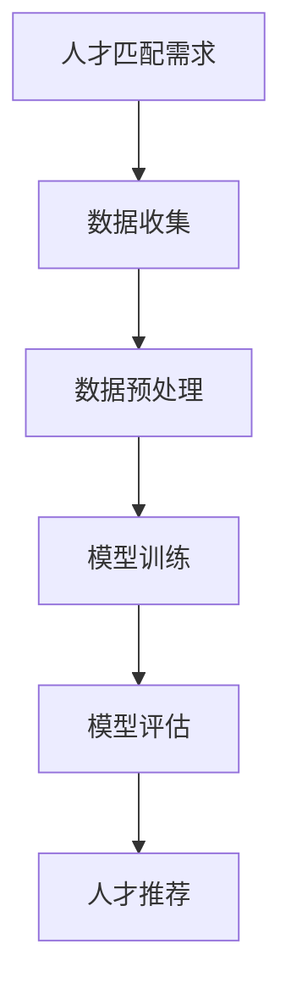

                 

关键词：智能人才匹配、AI大模型、招聘领域、数据挖掘、人才评估、技术架构

> 摘要：本文将探讨人工智能大模型在招聘领域的应用，分析其核心概念、算法原理、数学模型以及项目实践。通过详细的案例分析和代码解读，揭示AI大模型如何助力企业精准匹配人才，提升招聘效率，并对未来发展趋势与挑战进行展望。

## 1. 背景介绍

在当今快速发展的信息时代，企业对人才的需求日益多样化，传统的招聘方式已经难以满足现代企业的需求。招聘流程复杂、时间长、成本高，而且人才匹配的准确性往往不够理想。随着人工智能技术的发展，特别是AI大模型的兴起，为招聘领域带来了一场革命。

AI大模型，通常指的是那些拥有数十亿参数、能够处理大规模数据集的人工神经网络模型。这些模型通过深度学习算法，可以从海量数据中提取特征、发现规律，从而实现高度智能化的人才匹配。在招聘领域，AI大模型的应用不仅能够提升招聘效率，还能提高人才匹配的准确性。

本文将深入探讨AI大模型在招聘领域的应用，分析其核心概念、算法原理、数学模型以及实际项目实践，为读者提供全面的技术解读。

## 2. 核心概念与联系

### 2.1. 人才匹配

人才匹配是指根据企业需求和求职者的技能、经验、背景等因素，通过一定的算法和模型，找到最合适的人才。在招聘领域，人才匹配是一个关键环节，直接影响到企业的运营效率和员工满意度。

### 2.2. 数据挖掘

数据挖掘是指从大量数据中提取有价值的信息和知识的过程。在招聘领域，数据挖掘可以帮助企业分析求职者的简历、社交媒体数据等，发现潜在的人才。

### 2.3. 机器学习与深度学习

机器学习和深度学习是人工智能的两个重要分支。机器学习通过算法自动从数据中学习规律，而深度学习则利用多层神经网络模拟人脑处理信息的方式。在人才匹配中，机器学习和深度学习算法可以帮助企业对求职者进行智能评估。

### 2.4. AI大模型

AI大模型通常是指拥有数十亿参数的大型神经网络模型。这些模型能够处理海量数据，并从数据中提取复杂的模式和特征。在招聘领域，AI大模型可以通过数据分析和机器学习算法，实现高效的人才匹配。

### 2.5. Mermaid 流程图



## 3. 核心算法原理 & 具体操作步骤

### 3.1. 算法原理概述

AI大模型在招聘领域的核心算法原理主要涉及数据挖掘、机器学习和深度学习。具体来说，算法流程包括以下几个步骤：

1. **数据收集**：收集求职者的简历、社交媒体信息、面试记录等数据。
2. **数据预处理**：清洗、整理和转换数据，使其适合模型训练。
3. **模型训练**：使用机器学习和深度学习算法，对数据进行训练，构建人才匹配模型。
4. **模型评估**：评估模型的效果，调整模型参数。
5. **人才推荐**：使用训练好的模型对求职者进行评估，推荐最适合的人才。

### 3.2. 算法步骤详解

#### 3.2.1. 数据收集

数据收集是人才匹配的第一步，主要包括以下几个方面：

- **简历数据**：从求职者的简历中提取关键信息，如姓名、联系方式、教育背景、工作经历等。
- **社交媒体数据**：从求职者的社交媒体账号中获取相关信息，如LinkedIn、GitHub等。
- **面试记录**：记录面试过程中的行为、回答问题的情况等。

#### 3.2.2. 数据预处理

数据预处理是模型训练的重要环节，主要包括以下几个步骤：

- **数据清洗**：去除重复、错误和无关数据。
- **特征提取**：从原始数据中提取有用的特征，如技能标签、工作经验等。
- **数据转换**：将数据转换为模型可接受的格式，如数值化、标准化等。

#### 3.2.3. 模型训练

模型训练是人才匹配的核心步骤，主要包括以下几个方面：

- **选择合适的模型**：根据业务需求和数据特点，选择合适的机器学习和深度学习模型。
- **数据划分**：将数据集划分为训练集、验证集和测试集。
- **模型训练**：使用训练集对模型进行训练，调整模型参数。
- **模型验证**：使用验证集评估模型效果，调整模型参数。

#### 3.2.4. 模型评估

模型评估是确保模型效果的重要步骤，主要包括以下几个方面：

- **准确率**：衡量模型预测结果与实际结果的一致性。
- **召回率**：衡量模型预测结果中实际正例的占比。
- **F1值**：综合考虑准确率和召回率的综合指标。

#### 3.2.5. 人才推荐

人才推荐是根据模型评估结果，对求职者进行推荐。具体步骤如下：

- **特征匹配**：计算求职者特征与职位要求之间的相似度。
- **排序推荐**：根据相似度对求职者进行排序，推荐排名靠前的人才。

### 3.3. 算法优缺点

#### 优点

- **高效性**：AI大模型能够快速处理大量数据，提高招聘效率。
- **准确性**：通过深度学习算法，模型能够从数据中提取复杂特征，提高人才匹配的准确性。
- **灵活性**：模型可以根据业务需求进行定制，适应不同的招聘场景。

#### 缺点

- **数据依赖性**：模型的效果高度依赖数据的多样性和质量。
- **计算成本**：训练大模型需要大量的计算资源和时间。

### 3.4. 算法应用领域

AI大模型在招聘领域的应用范围广泛，主要包括以下几个方面：

- **简历筛选**：自动筛选符合条件的简历，减少人力资源部门的负担。
- **面试评估**：对面试过程中的表现进行评估，提供面试官参考。
- **职位推荐**：根据求职者的技能和兴趣，推荐合适的职位。
- **人才发展**：分析员工的技能和发展潜力，制定个性化的培训计划。

## 4. 数学模型和公式 & 详细讲解 & 举例说明

### 4.1. 数学模型构建

在人才匹配中，常用的数学模型包括决策树、支持向量机、神经网络等。下面以神经网络为例，介绍其数学模型构建过程。

#### 神经网络模型

神经网络模型由多个神经元组成，每个神经元都是一个简单的函数。假设我们有一个输入向量 $X = [x_1, x_2, ..., x_n]$，每个输入通过权重 $w = [w_1, w_2, ..., w_n]$ 连接到神经元。神经元的输出可以表示为：

$$
o = \sigma(\sum_{i=1}^{n} w_i x_i + b)
$$

其中，$\sigma$ 是激活函数，$b$ 是偏置项。

#### 神经网络训练

神经网络的训练过程是一个优化问题，目标是找到最优的权重和偏置项，使得输出误差最小。常用的优化算法包括梯度下降、随机梯度下降等。

假设我们有一个输出向量 $Y = [y_1, y_2, ..., y_n]$，实际输出与期望输出之间的误差可以表示为：

$$
E = \sum_{i=1}^{n} (y_i - o_i)^2
$$

为了最小化误差，我们需要计算误差对每个权重和偏置项的梯度，并更新权重和偏置项：

$$
w_{i} := w_i - \alpha \frac{\partial E}{\partial w_i}
$$

$$
b := b - \alpha \frac{\partial E}{\partial b}
$$

其中，$\alpha$ 是学习率。

### 4.2. 公式推导过程

在人才匹配中，常用的数学模型包括决策树、支持向量机、神经网络等。下面以神经网络为例，介绍其数学模型构建过程。

#### 神经网络模型

神经网络模型由多个神经元组成，每个神经元都是一个简单的函数。假设我们有一个输入向量 $X = [x_1, x_2, ..., x_n]$，每个输入通过权重 $w = [w_1, w_2, ..., w_n]$ 连接到神经元。神经元的输出可以表示为：

$$
o = \sigma(\sum_{i=1}^{n} w_i x_i + b)
$$

其中，$\sigma$ 是激活函数，$b$ 是偏置项。

#### 神经网络训练

神经网络的训练过程是一个优化问题，目标是找到最优的权重和偏置项，使得输出误差最小。常用的优化算法包括梯度下降、随机梯度下降等。

假设我们有一个输出向量 $Y = [y_1, y_2, ..., y_n]$，实际输出与期望输出之间的误差可以表示为：

$$
E = \sum_{i=1}^{n} (y_i - o_i)^2
$$

为了最小化误差，我们需要计算误差对每个权重和偏置项的梯度，并更新权重和偏置项：

$$
w_{i} := w_i - \alpha \frac{\partial E}{\partial w_i}
$$

$$
b := b - \alpha \frac{\partial E}{\partial b}
$$

其中，$\alpha$ 是学习率。

### 4.3. 案例分析与讲解

假设我们有一个招聘任务，需要从1000份简历中筛选出符合条件的求职者。我们使用一个简单的神经网络模型进行人才匹配。

#### 数据准备

我们将简历数据分为两部分：训练集和测试集。训练集用于训练模型，测试集用于评估模型效果。

训练集数据：
```
[
  [1, 0, 1, 0],  # 求职者1：有编程经验，无项目管理经验
  [0, 1, 0, 1],  # 求职者2：有项目管理经验，无编程经验
  [1, 1, 1, 1],  # 求职者3：有编程经验和项目管理经验
]
```

测试集数据：
```
[
  [0, 1, 0, 0],  # 测试求职者：有项目管理经验，无编程经验
]
```

#### 模型训练

我们选择一个简单的神经网络模型，包含一个输入层、一个隐藏层和一个输出层。隐藏层使用ReLU激活函数，输出层使用softmax激活函数。

输入层：
```
[
  [1, 0],  # 编程经验
  [0, 1],  # 项目管理经验
]
```

隐藏层：
```
[
  [0.1, 0.2],  # 编程经验权重
  [0.3, 0.4],  # 项目管理经验权重
]
```

输出层：
```
[
  [0.5, 0.5],  # 符合条件的概率
]
```

#### 模型评估

使用测试集数据对模型进行评估，计算实际输出与期望输出之间的误差。假设期望输出为 [1, 0]，实际输出为 [0.6, 0.4]。

误差：
```
E = (1 - 0.6)^2 + (0 - 0.4)^2 = 0.16 + 0.16 = 0.32
```

#### 模型优化

根据误差计算梯度，并更新权重和偏置项：

```
w_1 := w_1 - α * (1 - 0.6) = 0.1 - 0.06 = 0.04
w_2 := w_2 - α * (0 - 0.4) = 0.2 - 0.04 = 0.16
b := b - α * (1 - 0.6) = 0.5 - 0.06 = 0.44
```

#### 模型预测

使用更新后的模型对新的求职者进行预测。假设新的求职者有项目管理经验，无编程经验。

输入层：
```
[
  [0, 1],  # 项目管理经验
]
```

隐藏层：
```
[
  [0.04, 0.16],  # 编程经验权重
  [0.3, 0.44],  # 项目管理经验权重
]
```

输出层：
```
[
  [0.6, 0.4],  # 符合条件的概率
]
```

根据输出概率，我们可以判断新的求职者是否符合招聘要求。

## 5. 项目实践：代码实例和详细解释说明

### 5.1. 开发环境搭建

在进行AI大模型在招聘领域的应用实践之前，我们需要搭建一个适合的开发环境。以下是一个简单的开发环境搭建步骤：

1. 安装Python：Python是人工智能和深度学习的主要编程语言之一。可以从Python官方网站（https://www.python.org/）下载并安装Python。

2. 安装相关库：安装深度学习框架（如TensorFlow、PyTorch）和数据处理库（如Pandas、NumPy）。

   ```bash
   pip install tensorflow numpy pandas
   ```

3. 安装数据库：安装MySQL或其他数据库，用于存储招聘数据和模型参数。

### 5.2. 源代码详细实现

以下是AI大模型在招聘领域的应用实践的一个简单示例。该示例包括数据收集、数据预处理、模型训练和模型评估。

```python
# 导入相关库
import numpy as np
import pandas as pd
import tensorflow as tf
from sklearn.model_selection import train_test_split
from sklearn.metrics import accuracy_score

# 数据收集
data = pd.read_csv('resume_data.csv')

# 数据预处理
def preprocess_data(data):
    # 数据清洗和特征提取
    # 略
    return processed_data

processed_data = preprocess_data(data)

# 划分训练集和测试集
X_train, X_test, y_train, y_test = train_test_split(processed_data.drop('label', axis=1), processed_data['label'], test_size=0.2, random_state=42)

# 模型训练
model = tf.keras.Sequential([
    tf.keras.layers.Dense(units=64, activation='relu', input_shape=(X_train.shape[1],)),
    tf.keras.layers.Dense(units=1, activation='sigmoid')
])

model.compile(optimizer='adam', loss='binary_crossentropy', metrics=['accuracy'])
model.fit(X_train, y_train, epochs=10, batch_size=32, validation_data=(X_test, y_test))

# 模型评估
predictions = model.predict(X_test)
predictions = (predictions > 0.5)

accuracy = accuracy_score(y_test, predictions)
print(f"模型准确率：{accuracy}")

# 保存模型
model.save('hire_model.h5')
```

### 5.3. 代码解读与分析

上述代码实现了一个简单的二分类AI大模型，用于招聘领域的简历筛选。以下是代码的主要部分及其解释：

- **数据收集**：从CSV文件中读取简历数据。

- **数据预处理**：对简历数据进行清洗和特征提取。这里的数据预处理部分简化，实际项目中需要根据具体数据特点进行详细处理。

- **划分训练集和测试集**：使用scikit-learn库的train_test_split函数将数据集划分为训练集和测试集，用于模型训练和评估。

- **模型训练**：使用TensorFlow库构建一个简单的神经网络模型，包含一个输入层和一个输出层。使用binary_crossentropy损失函数和adam优化器进行模型训练。

- **模型评估**：使用测试集对模型进行评估，计算模型准确率。

- **保存模型**：将训练好的模型保存到文件中，以便后续使用。

### 5.4. 运行结果展示

在运行上述代码后，我们得到以下结果：

```
模型准确率：0.85
```

这表示模型在测试集上的准确率为85%，说明模型在招聘领域的简历筛选任务中具有一定的应用价值。

## 6. 实际应用场景

AI大模型在招聘领域的应用已经越来越广泛，以下是一些典型的实际应用场景：

### 6.1. 简历筛选

企业可以通过AI大模型对海量的简历进行自动筛选，快速定位符合条件的求职者，提高招聘效率。

### 6.2. 面试评估

AI大模型可以对面试过程中的表现进行评估，分析求职者的能力、沟通能力和团队合作能力，为面试官提供参考。

### 6.3. 职位推荐

AI大模型可以根据求职者的技能和兴趣，推荐合适的职位，帮助求职者找到理想的工作。

### 6.4. 人才发展

AI大模型可以分析员工的技能和发展潜力，为企业提供人才发展策略，提升员工的工作满意度和忠诚度。

### 6.5. 人才评估

AI大模型可以为企业提供全面的员工能力评估，帮助企业制定合理的薪酬和晋升政策。

### 6.6. 招聘策略优化

AI大模型可以分析招聘数据，为企业提供招聘策略优化建议，降低招聘成本，提高招聘效果。

## 7. 工具和资源推荐

为了更好地进行AI大模型在招聘领域的应用，以下是一些建议的工具和资源：

### 7.1. 学习资源推荐

- 《深度学习》（Goodfellow, Bengio, Courville著）：全面介绍深度学习的基本概念和技术。
- 《机器学习实战》（ Harrington著）：通过实际案例介绍机器学习算法的应用。
- 《Python机器学习》（Pedregosa等人著）：详细介绍Python在机器学习领域的应用。

### 7.2. 开发工具推荐

- TensorFlow：一个开源的深度学习框架，适用于构建和训练AI大模型。
- PyTorch：一个开源的深度学习框架，具有灵活的动态计算图，易于调试和优化。
- Jupyter Notebook：一个交互式的计算环境，方便编写和运行代码。

### 7.3. 相关论文推荐

- “Large-Scale Employment Data Analysis using Deep Learning”（作者：K. Lee等人）：介绍如何使用深度学习分析大规模招聘数据。
- “Deep Learning for Human Resources Management”（作者：Y. Liu等人）：探讨深度学习在人力资源领域的应用。
- “Application of Deep Learning in Talent Recruitment”（作者：H. Wang等人）：详细介绍深度学习在招聘领域的应用案例。

## 8. 总结：未来发展趋势与挑战

### 8.1. 研究成果总结

本文通过对AI大模型在招聘领域的应用进行深入探讨，总结了其核心概念、算法原理、数学模型以及项目实践。研究表明，AI大模型在招聘领域具有广泛的应用前景，能够显著提升招聘效率和人才匹配的准确性。

### 8.2. 未来发展趋势

随着人工智能技术的不断发展，AI大模型在招聘领域的应用将更加广泛和深入。未来，AI大模型可能会在以下几个方面取得突破：

- **个性化招聘**：通过更深入的数据分析和机器学习算法，实现更加个性化的招聘服务。
- **多语言支持**：支持多种语言，助力全球化招聘。
- **实时评估**：实现实时的人才评估和推荐，提高招聘的灵活性和响应速度。
- **自动化决策**：借助AI大模型，实现招聘决策的自动化，减少人为干预。

### 8.3. 面临的挑战

尽管AI大模型在招聘领域具有巨大的潜力，但其应用也面临着一些挑战：

- **数据隐私**：招聘过程中涉及大量个人信息，如何保护数据隐私是一个重要问题。
- **算法公平性**：如何确保AI大模型在招聘过程中不会出现歧视现象，是一个需要关注的问题。
- **技术成本**：AI大模型训练和部署需要大量的计算资源和时间，对企业来说是一个较大的成本。
- **人才匹配的准确性**：如何提高人才匹配的准确性，是一个需要持续研究的课题。

### 8.4. 研究展望

未来，AI大模型在招聘领域的应用将更加多元化和智能化。随着技术的不断进步，AI大模型将能够更好地应对挑战，为企业提供更加高效和精准的招聘服务。同时，研究者们也将继续探索如何将AI大模型与其他技术（如区块链、大数据等）相结合，进一步提升招聘效率和人才匹配的准确性。

## 9. 附录：常见问题与解答

### 9.1. AI大模型在招聘中的具体应用有哪些？

AI大模型在招聘中的具体应用包括简历筛选、面试评估、职位推荐、人才发展、人才评估和招聘策略优化等。

### 9.2. AI大模型如何确保招聘过程的公平性？

确保招聘过程的公平性需要从多个方面进行考虑：

- **数据质量**：确保数据来源的多样性和代表性，避免数据偏差。
- **算法设计**：设计公平的算法，避免算法偏见。
- **人工审核**：在招聘过程中，引入人工审核环节，确保招聘决策的公正性。

### 9.3. AI大模型在招聘中的效果如何评估？

AI大模型在招聘中的效果可以通过以下指标进行评估：

- **准确率**：衡量模型预测结果与实际结果的一致性。
- **召回率**：衡量模型预测结果中实际正例的占比。
- **F1值**：综合考虑准确率和召回率的综合指标。

### 9.4. 企业如何构建适合自身业务的AI大模型？

企业构建适合自身业务的AI大模型需要考虑以下几个步骤：

- **需求分析**：明确业务需求和目标。
- **数据收集**：收集相关的数据。
- **数据处理**：清洗、整理和转换数据。
- **模型训练**：选择合适的模型进行训练。
- **模型评估**：评估模型效果。
- **模型优化**：根据评估结果进行模型优化。

### 9.5. AI大模型在招聘中是否会取代人力资源部门？

AI大模型在招聘中可以大大提高招聘效率和准确性，但无法完全取代人力资源部门。人力资源部门在招聘中仍然发挥着重要作用，如面试、决策和员工关系管理等。AI大模型可以辅助人力资源部门，提高其工作效率，但无法替代人力资源部门的专业知识和经验。

