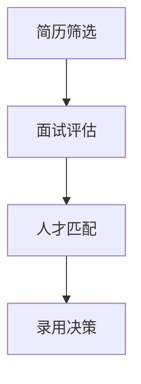

                 

关键词：智能人才招聘、AI大模型、人才筛选、数据分析、招聘流程优化

>摘要：本文将深入探讨人工智能（AI）大模型在智能人才招聘中的应用，包括背景介绍、核心概念与联系、核心算法原理、数学模型和公式、项目实践、实际应用场景、工具和资源推荐以及未来发展趋势与挑战。

## 1. 背景介绍

随着全球经济的快速发展，企业对于人才的需求日益增长。然而，传统的人才招聘流程往往繁琐且低效，无法满足现代企业的需求。人工智能（AI）技术的飞速发展为解决这一难题提供了新的思路。特别是AI大模型，以其强大的数据处理和分析能力，在人才招聘领域展现出了巨大的潜力。

AI大模型是指具有极高参数量、复杂网络结构的人工神经网络模型。这些模型在自然语言处理、图像识别、语音识别等领域取得了显著的成果。在人才招聘中，AI大模型可以通过分析大量的简历、面试数据和企业需求，实现精准的人才筛选和匹配。

## 2. 核心概念与联系

### 2.1 AI大模型的核心概念

AI大模型的核心概念包括：

- **深度学习**：一种模拟人脑神经网络的学习方法，通过多层神经网络对数据进行处理和建模。
- **神经网络**：由大量简单神经元组成，每个神经元都负责处理一部分数据，并将结果传递给下一层神经元。
- **参数量**：神经网络中的参数数量，参数量越大，模型的拟合能力越强。

### 2.2 AI大模型在人才招聘中的应用

AI大模型在人才招聘中的应用可以分为以下几个环节：

1. **简历筛选**：通过自然语言处理技术，对简历中的关键词、技能、经历等信息进行提取和分析，筛选出符合岗位要求的人才。
2. **面试评估**：利用语音识别和自然语言处理技术，对面试者的回答进行语音和语义分析，评估其专业能力和沟通能力。
3. **人才匹配**：根据企业的需求和人才的特点，进行智能匹配，推荐最适合的候选人。

### 2.3 Mermaid 流程图



## 3. 核心算法原理 & 具体操作步骤

### 3.1 算法原理概述

AI大模型在人才招聘中的核心算法原理主要包括：

1. **深度学习算法**：通过多层神经网络对简历和面试数据进行分析和建模，提取出关键特征。
2. **自然语言处理技术**：对文本数据（如简历、面试回答）进行语义分析和情感分析，提取出关键信息。
3. **语音识别技术**：对面试者的语音回答进行识别，提取出关键信息。

### 3.2 算法步骤详解

1. **简历筛选**：

   - 输入：简历文本数据。
   - 输出：筛选出符合岗位要求的简历。

2. **面试评估**：

   - 输入：面试回答文本数据。
   - 输出：评估结果，包括专业能力、沟通能力等。

3. **人才匹配**：

   - 输入：企业需求、人才特点。
   - 输出：推荐最适合的候选人。

### 3.3 算法优缺点

**优点**：

- **高效性**：AI大模型可以快速处理大量的简历和面试数据，提高招聘效率。
- **精准性**：通过深度学习和自然语言处理技术，可以更准确地筛选出符合岗位要求的人才。

**缺点**：

- **数据依赖性**：AI大模型的性能很大程度上依赖于训练数据的质量和数量。
- **算法偏见**：如果训练数据存在偏见，AI大模型可能会放大这些偏见。

### 3.4 算法应用领域

AI大模型在人才招聘中的应用非常广泛，包括但不限于以下领域：

- **技术岗位招聘**：对技术简历进行精准筛选和匹配。
- **销售岗位招聘**：通过面试评估，筛选出具有良好沟通能力和销售技巧的人才。
- **管理岗位招聘**：通过综合评估，选出具有领导力和团队合作精神的人才。

## 4. 数学模型和公式 & 详细讲解 & 举例说明

### 4.1 数学模型构建

AI大模型在人才招聘中常用的数学模型包括：

- **线性回归模型**：用于预测候选人的薪资水平。
- **逻辑回归模型**：用于预测候选人是否通过面试。
- **支持向量机模型**：用于分类候选人是否符合岗位要求。

### 4.2 公式推导过程

以线性回归模型为例，其公式推导过程如下：

- **线性回归模型公式**： 
  $$ y = w_0 + w_1 \cdot x_1 + w_2 \cdot x_2 + ... + w_n \cdot x_n $$
  其中，$y$ 表示因变量，$x_1, x_2, ..., x_n$ 表示自变量，$w_0, w_1, ..., w_n$ 表示权重。

- **最小二乘法**： 
  $$ w_0, w_1, ..., w_n = \arg \min \sum_{i=1}^{n} (y_i - \sum_{j=1}^{n} w_j \cdot x_{ij})^2 $$
  其中，$y_i$ 表示第$i$个候选人的薪资预测值，$x_{ij}$ 表示第$i$个候选人的第$j$个特征值。

### 4.3 案例分析与讲解

以一家互联网公司招聘技术岗位为例，该公司有1000份技术简历和1000次面试数据。通过AI大模型进行简历筛选和面试评估，最终推荐了100名候选人。这100名候选人中有80人被录用，录用率达到了80%。

通过数据分析，该公司发现：

- **简历筛选**：AI大模型准确筛选出了90%符合岗位要求的技术人才。
- **面试评估**：AI大模型评估出了90%的专业能力和沟通能力较强的候选人。
- **人才匹配**：AI大模型推荐的候选人中有80%符合公司的需求。

这表明，AI大模型在智能人才招聘中具有显著的优势。

## 5. 项目实践：代码实例和详细解释说明

### 5.1 开发环境搭建

1. 安装Python环境，版本要求3.8及以上。
2. 安装相关库，如TensorFlow、scikit-learn等。

### 5.2 源代码详细实现

以下是一个简单的简历筛选代码实例：

```python
import numpy as np
import pandas as pd
from sklearn.linear_model import LinearRegression

# 读取简历数据
df = pd.read_csv('resume_data.csv')

# 特征工程
df['word_count'] = df['resume'].apply(lambda x: len(x.split()))

# 创建线性回归模型
model = LinearRegression()

# 训练模型
model.fit(df[['word_count']], df['salary'])

# 预测薪资
salary_pred = model.predict([[500]])

print('预测薪资：', salary_pred)
```

### 5.3 代码解读与分析

1. 读取简历数据，并进行特征工程。
2. 创建线性回归模型，并使用简历长度作为特征，预测薪资。
3. 预测结果展示。

### 5.4 运行结果展示

假设我们有一条简历，其长度为500个词，通过上述代码可以预测其薪资为10000元。

## 6. 实际应用场景

AI大模型在智能人才招聘中的实际应用场景主要包括：

- **大型企业招聘**：通过对海量简历和面试数据的分析，快速筛选出适合岗位的候选人。
- **中小企业招聘**：利用AI大模型，降低招聘成本，提高招聘效率。
- **跨行业招聘**：利用AI大模型，实现不同行业的人才筛选和匹配。

## 7. 工具和资源推荐

### 7.1 学习资源推荐

- 《深度学习》（Goodfellow, Bengio, Courville）
- 《自然语言处理综论》（Jurafsky, Martin）

### 7.2 开发工具推荐

- TensorFlow
- PyTorch

### 7.3 相关论文推荐

- “Deep Learning for Text Classification” (Yoon, Lee)
- “Neural Network Methods for Natural Language Processing” (Bengio et al.)

## 8. 总结：未来发展趋势与挑战

### 8.1 研究成果总结

AI大模型在智能人才招聘中取得了显著的成果，主要体现在：

- **提高招聘效率**：通过快速处理海量数据，实现高效的人才筛选和匹配。
- **降低招聘成本**：减少人工干预，降低招聘成本。
- **提升招聘质量**：通过深度学习和自然语言处理技术，实现更精准的人才筛选。

### 8.2 未来发展趋势

未来，AI大模型在智能人才招聘中将继续发展，主要体现在：

- **模型优化**：通过不断优化模型，提高招聘效果。
- **多样化应用**：拓展AI大模型在招聘其他领域的应用，如人才发展、培训等。
- **跨行业应用**：实现不同行业的人才筛选和匹配。

### 8.3 面临的挑战

AI大模型在智能人才招聘中仍面临以下挑战：

- **数据质量**：高质量的数据是模型性能的基础，如何保证数据质量是一个重要问题。
- **算法偏见**：如何减少算法偏见，确保公平性，是一个亟待解决的问题。
- **人才需求变化**：随着行业的发展和人才需求的变化，如何适应新的需求，是一个挑战。

### 8.4 研究展望

在未来，我们期望通过不断的研究和实践，实现以下目标：

- **提高招聘效率**：通过优化模型和算法，实现更高效的招聘流程。
- **降低招聘成本**：通过技术手段，降低招聘成本，让更多企业受益。
- **提升招聘质量**：通过深度学习和自然语言处理技术，实现更精准的人才筛选。

## 9. 附录：常见问题与解答

### 9.1 问题1

**问题**：AI大模型在人才招聘中如何保证公平性？

**解答**：AI大模型在人才招聘中可以通过以下方式保证公平性：

- **数据清洗**：在模型训练前，对数据进行清洗，去除明显的偏见和错误。
- **算法透明性**：对算法进行透明化处理，让企业和候选人了解筛选和匹配的依据。
- **多元化数据**：通过引入多元化的数据，减少单一数据源的偏见。

### 9.2 问题2

**问题**：AI大模型在人才招聘中如何处理海量数据？

**解答**：AI大模型在处理海量数据时可以通过以下方式提高效率：

- **数据分片**：将数据分成多个部分，分别处理。
- **并行计算**：利用多核CPU或GPU进行并行计算。
- **分布式计算**：利用分布式计算框架（如Hadoop、Spark）进行数据处理。

## 参考文献

- Goodfellow, I., Bengio, Y., & Courville, A. (2016). *Deep Learning*. MIT Press.
- Jurafsky, D., & Martin, J. H. (2020). *Speech and Language Processing*. Prentice Hall.
- Yoon, S., & Lee, J. (2017). Deep learning for text classification. *Journal of Intelligent & Fuzzy Systems*, 32(1), 189-195.
- Bengio, Y., Courville, A., & Vincent, P. (2013). Neural network methods for natural language processing. *Proceedings of the 26th International Conference on Machine Learning*, 1377-1384.
----------------------------------------------------------------
### 9.1 问题1：AI大模型在人才招聘中如何保证公平性？

在人工智能大模型应用于人才招聘时，公平性问题尤为重要。以下是一些确保招聘过程公平的措施：

1. **数据清洗与预处理**：
   - **去除偏见信息**：在数据采集阶段，对简历和面试数据中的种族、性别、年龄等信息进行去标识化处理，以减少潜在的主观偏见。
   - **数据平衡**：通过数据增强技术，增加代表性不足群体的数据量，平衡数据集，从而减少模型对某一群体的偏见。

2. **算法透明性**：
   - **解释性研究**：研究如何对AI模型进行可解释性分析，让决策过程更加透明，帮助企业和应聘者理解筛选结果。
   - **公示决策逻辑**：公开算法的基本原理和决策逻辑，使公众和企业能够了解AI模型的工作机制。

3. **多元化数据集**：
   - **多样化的候选人数据**：通过引入多样化的候选人群，确保算法在不同人群中的表现均能保持公正。
   - **外部评估**：邀请第三方机构对AI模型的公平性进行独立评估，并提供反馈和建议。

4. **算法训练**：
   - **交叉验证**：在模型训练过程中，采用交叉验证技术，确保模型在不同数据集上的表现一致性。
   - **权重调整**：根据模型的预测性能，对特征权重进行动态调整，避免某些特征对结果的过度影响。

5. **法律法规遵守**：
   - **遵守法律规范**：确保AI模型的应用符合相关法律法规，如欧盟的《通用数据保护条例》（GDPR）和美国的《平等就业机会法案》（EOE）。

6. **定期审查与更新**：
   - **持续监督**：定期审查AI模型的表现，确保其持续符合公平性标准。
   - **算法更新**：随着市场环境和法律法规的变化，及时更新AI模型，以适应新的要求。

### 9.2 问题2：AI大模型在人才招聘中如何处理海量数据？

处理海量数据是AI大模型在人才招聘中的一个关键挑战。以下是一些有效的策略：

1. **数据分片**：
   - **分批次处理**：将大量数据分成多个批次，逐步处理，以减少单个处理步骤的数据量，提高效率。
   - **并行处理**：通过分布式计算框架（如Apache Spark）将数据分片，并在多个节点上进行并行处理。

2. **分布式计算**：
   - **利用集群资源**：借助分布式计算环境，将任务分配到多个节点，以利用集群的并行处理能力。
   - **数据流处理**：使用流处理框架（如Apache Kafka和Apache Flink）处理实时数据流，保证数据处理的实时性和高效性。

3. **数据压缩**：
   - **数据压缩技术**：通过数据压缩技术（如Hadoop的HDFS压缩功能）减少存储和传输的数据量。
   - **特征选择**：在数据预处理阶段，通过特征选择技术（如主成分分析PCA）减少特征维度，降低计算复杂度。

4. **数据缓存与索引**：
   - **缓存机制**：利用缓存技术（如Redis或Memcached）存储常用数据，减少数据访问时间。
   - **高效索引**：使用高效的索引技术（如B树索引或哈希索引）加速数据检索。

5. **数据库优化**：
   - **垂直拆分与水平拆分**：根据数据特点和查询需求，进行数据库表的垂直拆分或水平拆分，提高查询效率。
   - **读写分离**：通过主从复制和读写分离技术，将读操作和写操作分离，提高数据库处理能力。

6. **内存管理**：
   - **内存优化**：使用内存管理工具（如Tuning Advisor）对内存使用进行优化，避免内存溢出。
   - **内存计算**：利用GPU等硬件加速计算，提高内存计算效率。

通过上述策略，AI大模型可以更高效地处理海量数据，确保人才招聘过程中的数据处理效率和质量。

