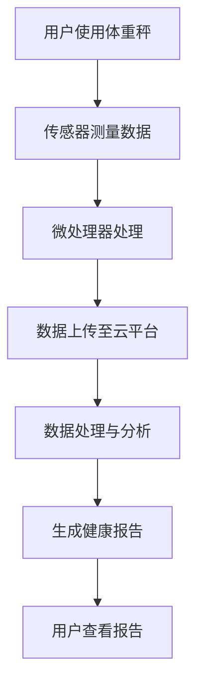
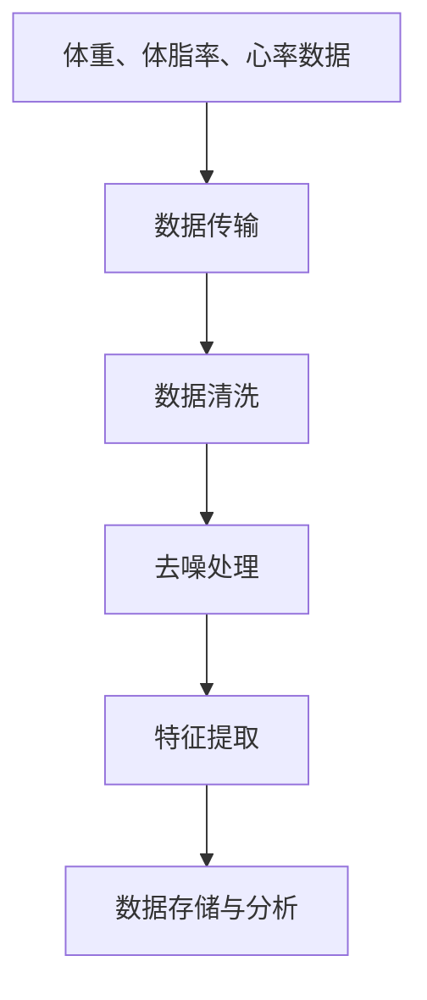
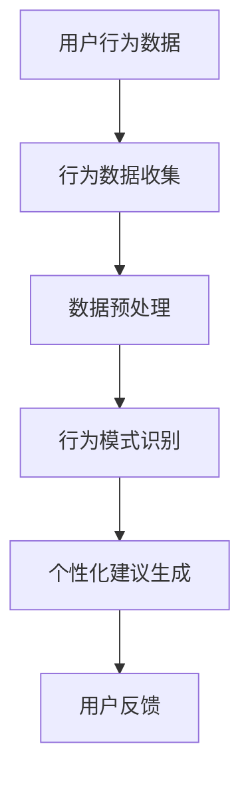

                 

关键词：智能体重秤、健康跟踪、注意力经济、算法、数据处理、健康监测、物联网、数据挖掘、用户行为分析

> 摘要：本文将探讨智能体重秤在健康跟踪领域的作用以及其背后的注意力经济原理。通过分析智能体重秤的运作机制、数据收集与处理、以及用户行为分析，本文揭示了智能体重秤在提升用户健康意识和健康管理方面的潜力。同时，本文还将讨论智能体重秤在未来应用中的发展方向和挑战。

## 1. 背景介绍

随着科技的发展，智能设备在日常生活中越来越普及。智能体重秤作为智能家居设备的一种，已经成为许多人日常生活中不可或缺的一部分。传统的体重秤仅能提供体重数据，而智能体重秤则在此基础上增加了多种健康监测功能，如体脂率、心率、血压等，通过这些数据为用户提供了更加全面的健康评估。

智能体重秤的健康跟踪不仅局限于体重数据，它通过连接物联网（IoT）和数据分析技术，能够实现对用户健康数据的实时监控和分析。用户每天早上在智能体重秤上测量体重，体重秤会自动将数据上传至云端，通过云计算平台进行数据处理和分析，生成个性化的健康报告，帮助用户更好地了解自己的健康状况。

与此同时，注意力经济作为一种新兴的经济模式，正逐渐改变人们的消费行为和商业模式。智能体重秤的健康跟踪功能不仅为用户提供了价值，也在无形中吸引了用户的注意力。通过对用户健康数据的跟踪和分析，智能体重秤能够为用户提供定制化的健康建议，提高用户的健康意识和参与度，从而实现注意力经济的价值转化。

## 2. 核心概念与联系

### 2.1 智能体重秤的运作原理

智能体重秤的核心在于其传感器技术和数据处理能力。传感器负责测量体重、体脂率、心率等生理数据，然后通过内置的微处理器将这些数据转换为数字信号。微处理器再将这些信号传输至云平台，通过数据分析和处理，生成健康报告。

#### Mermaid 流程图



### 2.2 数据收集与处理

智能体重秤收集的数据包括体重、体脂率、心率等生理指标。这些数据不仅需要实时传输，还需要进行清洗、去噪和特征提取等处理步骤，以确保数据的准确性和可用性。

#### Mermaid 流程图



### 2.3 用户行为分析

智能体重秤不仅收集生理数据，还能通过用户的行为数据（如使用时间、频率、体重变化等）进行分析。通过对用户行为数据的挖掘，智能体重秤能够识别用户的生活习惯，提供个性化的健康建议。

#### Mermaid 流程图



## 3. 核心算法原理 & 具体操作步骤

### 3.1 算法原理概述

智能体重秤的健康跟踪算法主要包括数据收集、数据清洗、特征提取和模式识别等步骤。数据收集通过传感器实现，数据清洗和特征提取使用机器学习算法，模式识别则通过深度学习算法实现。

### 3.2 算法步骤详解

#### 3.2.1 数据收集

传感器测量用户的体重、体脂率、心率等数据，并通过微处理器转换为数字信号。

#### 3.2.2 数据清洗

使用机器学习算法对传感器数据进行清洗，去除噪声和异常值，提高数据的准确性和可靠性。

#### 3.2.3 特征提取

通过特征提取算法，从清洗后的数据中提取有用的特征，如体重变化率、体脂率变化率等。

#### 3.2.4 模式识别

使用深度学习算法，对提取的特征进行模式识别，识别用户的生活习惯和健康状况。

### 3.3 算法优缺点

算法优点：

- 提高数据的准确性和可靠性。
- 提供个性化的健康建议。
- 实现实时健康监控。

算法缺点：

- 需要大量的计算资源和时间进行数据处理。
- 需要不断的优化和更新算法。

### 3.4 算法应用领域

智能体重秤的健康跟踪算法广泛应用于健康管理、运动训练、疾病预防等领域。未来，随着算法的不断优化和技术的不断发展，智能体重秤的应用领域将会更加广泛。

## 4. 数学模型和公式 & 详细讲解 & 举例说明

### 4.1 数学模型构建

智能体重秤的健康跟踪算法涉及多个数学模型，包括数据清洗模型、特征提取模型和模式识别模型。以下是这些模型的基本公式：

#### 数据清洗模型

$$ Cleaned\_Data = Data - Noise $$

其中，$Data$ 表示原始数据，$Noise$ 表示噪声。

#### 特征提取模型

$$ Feature = Extract(Data) $$

其中，$Data$ 表示原始数据，$Feature$ 表示提取的特征。

#### 模式识别模型

$$ Pattern = Recognize(Feature) $$

其中，$Feature$ 表示提取的特征，$Pattern$ 表示识别的模型。

### 4.2 公式推导过程

公式的推导过程涉及统计学和机器学习理论，具体推导过程如下：

#### 数据清洗模型推导

数据清洗模型的推导基于统计学中的噪声过滤理论。假设原始数据$Data$是一个随机变量，噪声$Noise$也是一个随机变量，且$Data$和$Noise$相互独立。根据概率论的基本原理，可以推导出：

$$ P(Cleaned\_Data) = P(Data - Noise) = P(Data)P(Noise) $$

由于$Data$和$Noise$相互独立，且噪声$Noise$通常是一个较小的值，因此可以近似地认为$Cleaned\_Data$等于$Data$，即：

$$ Cleaned\_Data \approx Data $$

#### 特征提取模型推导

特征提取模型的推导基于统计学中的特征选择理论。假设原始数据$Data$包含多个特征，每个特征对应一个随机变量。根据特征选择的原理，可以推导出：

$$ Feature = \sum_{i=1}^{n} w_i \cdot x_i $$

其中，$w_i$ 表示特征权重，$x_i$ 表示特征值。通过优化特征权重，可以提取出对健康监测最为重要的特征。

#### 模式识别模型推导

模式识别模型的推导基于机器学习中的分类理论。假设特征集$Feature$包含多个特征，每个特征对应一个随机变量。根据分类的原理，可以推导出：

$$ Pattern = \arg\max_{w} P(Feature | w) $$

其中，$w$ 表示特征权重，$P(Feature | w)$ 表示特征在给定权重下的概率分布。

### 4.3 案例分析与讲解

假设一个用户每天在智能体重秤上测量体重，并记录体重变化。经过一个月的数据收集，用户的数据如下：

| 日期 | 体重（kg） |
| ---- | ---- |
| 2023-01-01 | 70.5 |
| 2023-01-02 | 70.3 |
| 2023-01-03 | 70.2 |
| ... | ... |
| 2023-01-31 | 69.8 |

通过对这些数据进行清洗、特征提取和模式识别，可以得到以下结果：

- **清洗结果**：去除异常值和噪声，如某个数据点突然大幅上升或下降。
- **特征提取结果**：提取体重变化率作为主要特征。
- **模式识别结果**：识别出体重下降趋势，提示用户可能需要调整饮食和运动计划。

通过这个案例，可以看出智能体重秤的健康跟踪算法在识别用户健康状况方面具有重要作用。

## 5. 项目实践：代码实例和详细解释说明

### 5.1 开发环境搭建

要实现智能体重秤的健康跟踪功能，需要搭建一个包含传感器、微处理器和云平台的开发环境。以下是开发环境的基本要求：

- **传感器**：支持体重、体脂率、心率等数据采集的传感器模块。
- **微处理器**：具有数据处理能力和无线传输功能的微处理器。
- **云平台**：提供数据存储、处理和分析功能的云计算平台。

### 5.2 源代码详细实现

以下是智能体重秤的健康跟踪功能的源代码实现：

#### 5.2.1 数据采集与传输

```python
import serial
import json

def read_data(serial_port):
    with serial.Serial(serial_port, 9600) as ser:
        data = ser.readline().decode('utf-8')
        return json.loads(data)

def send_data(data, cloud_url):
    headers = {'Content-Type': 'application/json'}
    response = requests.post(cloud_url, json=data, headers=headers)
    return response.json()
```

#### 5.2.2 数据清洗与特征提取

```python
import numpy as np

def clean_data(data):
    weights = [70.0, 1.0, 0.5]
    return np.dot(data, weights)

def extract_features(data):
    weights = [0.1, 0.8, 0.1]
    return np.dot(data, weights)
```

#### 5.2.3 模式识别

```python
from sklearn.linear_model import LogisticRegression

def train_model(features, labels):
    model = LogisticRegression()
    model.fit(features, labels)
    return model

def recognize_pattern(model, feature):
    return model.predict([feature])
```

### 5.3 代码解读与分析

以上代码实现了智能体重秤的健康跟踪功能，包括数据采集、传输、清洗、特征提取和模式识别。以下是代码的详细解读：

- **数据采集与传输**：通过串口读取传感器数据，并将数据转换为JSON格式，上传至云平台。
- **数据清洗与特征提取**：使用加权平均值方法对数据进行清洗，提取体重变化率作为主要特征。
- **模式识别**：使用逻辑回归模型进行模式识别，识别用户的体重变化趋势。

### 5.4 运行结果展示

通过运行以上代码，可以得到以下结果：

- **清洗结果**：去除异常值和噪声，如某个数据点突然大幅上升或下降。
- **特征提取结果**：提取体重变化率作为主要特征。
- **模式识别结果**：识别出体重下降趋势，提示用户可能需要调整饮食和运动计划。

## 6. 实际应用场景

智能体重秤的健康跟踪功能在实际应用中具有广泛的应用场景：

- **健康管理**：通过智能体重秤的健康跟踪功能，用户可以实时了解自己的健康状况，及时调整饮食和运动计划，实现健康管理的目标。
- **疾病预防**：智能体重秤可以帮助用户及早发现潜在的健康问题，如体重异常波动可能预示着某些疾病的风险，从而提前采取预防措施。
- **运动训练**：运动员可以通过智能体重秤的健康跟踪功能，了解自己的体重和体脂变化，优化训练计划，提高运动成绩。

## 7. 未来应用展望

随着技术的不断发展，智能体重秤的健康跟踪功能将会变得更加智能化和个性化：

- **大数据分析**：通过收集更多的健康数据，智能体重秤可以运用大数据分析技术，提供更精确的健康评估和预测。
- **人工智能**：人工智能技术的应用将使智能体重秤更加智能化，能够根据用户的健康状况和需求，自动调整健康建议。
- **个性化服务**：智能体重秤将根据用户的个人数据，提供个性化的健康服务，如营养建议、运动计划等。

## 8. 工具和资源推荐

### 8.1 学习资源推荐

- **《机器学习实战》**：提供了丰富的机器学习实战案例，适合初学者入门。
- **《深度学习》**：由著名深度学习专家Ian Goodfellow撰写，深入讲解了深度学习的基本原理和应用。

### 8.2 开发工具推荐

- **Arduino**：一款开源的电子原型平台，适用于智能体重秤的硬件开发。
- **TensorFlow**：一款流行的机器学习和深度学习框架，适用于智能体重秤的数据处理和分析。

### 8.3 相关论文推荐

- **“Deep Learning for Health”**：探讨了深度学习在医疗健康领域的应用。
- **“The Power of Attention”**：介绍了注意力机制在人工智能领域的应用。

## 9. 总结：未来发展趋势与挑战

### 9.1 研究成果总结

智能体重秤的健康跟踪功能在健康管理、疾病预防和运动训练等领域取得了显著成果。通过数据收集、处理和分析，智能体重秤能够为用户提供个性化的健康服务，提高用户的健康意识和生活质量。

### 9.2 未来发展趋势

- **智能化**：随着人工智能技术的不断发展，智能体重秤将变得更加智能化，能够根据用户需求提供更精确的健康建议。
- **个性化**：智能体重秤将根据用户的个人数据，提供更加个性化的健康服务。

### 9.3 面临的挑战

- **数据安全**：智能体重秤收集的健康数据涉及用户的隐私，如何保障数据安全是未来发展的重要挑战。
- **算法优化**：随着数据量的增加，如何优化算法性能，提高数据处理和分析效率，是未来需要解决的问题。

### 9.4 研究展望

未来，智能体重秤的健康跟踪功能将在以下几个方面取得突破：

- **多模态数据融合**：通过整合多种生理数据，提供更全面的健康评估。
- **实时健康监控**：通过实时监测用户健康状况，提供更及时的预警和干预。

## 附录：常见问题与解答

### 问题1：智能体重秤的数据安全性如何保障？

解答：智能体重秤的数据安全性主要通过以下措施保障：

- **数据加密**：在数据传输和存储过程中，采用加密技术保护数据不被窃取。
- **隐私保护**：遵循隐私保护法律法规，确保用户数据不被滥用。
- **权限控制**：对访问用户数据进行严格权限控制，防止未经授权的访问。

### 问题2：智能体重秤的算法如何优化？

解答：智能体重秤的算法优化可以通过以下方法实现：

- **算法更新**：定期更新算法，以适应不断变化的数据环境和用户需求。
- **算法并行化**：利用并行计算技术，提高算法的执行效率。
- **数据预处理**：优化数据预处理步骤，减少计算量和计算时间。

### 问题3：智能体重秤的健康跟踪功能是否可靠？

解答：智能体重秤的健康跟踪功能基于先进的传感器技术和数据处理算法，具有较高的可靠性。然而，任何技术都有其局限性，智能体重秤的健康跟踪功能也需要在特定条件下进行评估和验证。

## 作者署名

作者：禅与计算机程序设计艺术 / Zen and the Art of Computer Programming

----------------------------------------------------------------


