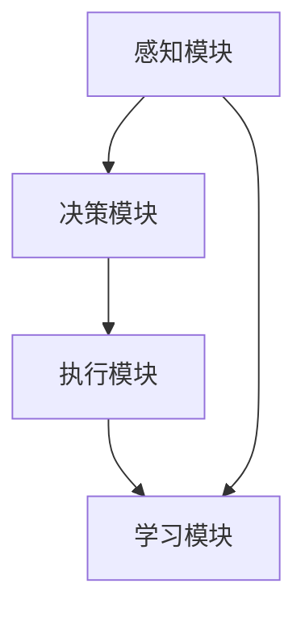
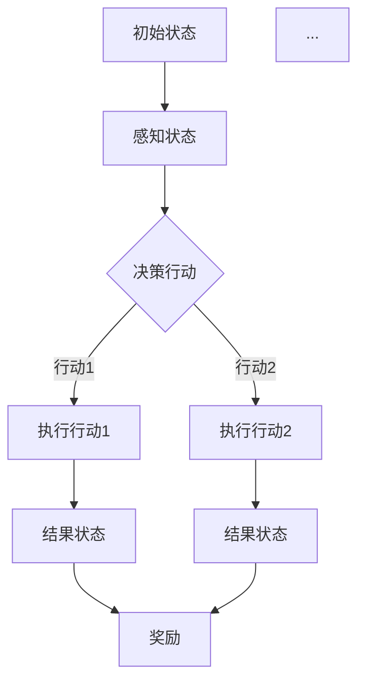

                 

关键词：人工智能，智能体，AI应用，核心概念，算法原理，数学模型，项目实践，实际应用场景，未来展望。

> 摘要：本文深入探讨了智能体（Agent）作为人工智能应用的核心概念。从背景介绍到核心概念与联系，再到核心算法原理、数学模型，以及项目实践和实际应用场景，本文全面解析了智能体的本质、特点、以及其在未来人工智能发展中的重要作用。最后，文章还展望了智能体技术在未来应用中的发展趋势和面临的挑战。

## 1. 背景介绍

### 智能体概念的出现与发展

智能体（Agent）的概念起源于人工智能领域，最早可以追溯到1980年代。当时，研究人员开始关注如何构建能够自主行动、具备智能特性的系统。智能体的定义也随之不断演变，从最初的程序或机器，逐渐扩展到更广泛的领域，包括机器人、软件代理、甚至是人类。

智能体的研究迅速发展，吸引了大量学者和工程师的投入。其在自动化、智能控制、决策支持、以及复杂系统中的应用逐渐显现。随着计算机性能的提升和算法的进步，智能体的实现变得更加可行和高效。

### 智能体在AI中的应用

智能体在人工智能中的应用广泛而深远。首先，在机器人领域，智能体被用来实现自主导航、感知环境和执行任务。其次，在软件代理领域，智能体被用来提供个性化的服务，例如搜索引擎中的推荐系统、在线购物网站的个人助手等。此外，智能体还在智能控制、医疗诊断、金融分析等多个领域发挥着重要作用。

智能体的应用不仅提升了系统的智能化水平，也带来了许多新的挑战，如安全性、隐私保护、以及智能体之间的协作和竞争。

## 2. 核心概念与联系

### 智能体的基本定义

智能体是一种能够感知环境、自主做出决策并采取行动的实体。智能体的核心特征包括自主性、适应性、协作性、适应性等。

- **自主性**：智能体能够独立运作，不受外部直接控制。
- **适应性**：智能体能够根据环境和目标的变化调整自身的行为。
- **协作性**：智能体能够与其他智能体进行交互和合作，共同完成任务。
- **适应性**：智能体能够通过学习和经验积累来优化自身行为。

### 智能体的架构与联系

智能体的架构通常包括感知模块、决策模块、执行模块和学习模块。

- **感知模块**：收集环境信息，如视觉、听觉、触觉等。
- **决策模块**：根据感知信息做出决策，选择合适的行动。
- **执行模块**：执行决策，实现具体任务。
- **学习模块**：通过经验和反馈不断优化自身行为。

这些模块相互关联，形成一个闭环控制系统，使得智能体能够持续适应和优化其行为。

### 智能体的分类

根据智能体的特点和应用场景，可以将智能体分为以下几类：

- **反应式智能体**：仅根据当前感知信息做出反应，不考虑过去的行为。
- **模型基智能体**：具备内部模型，能够预测环境变化，并做出更长远的决策。
- **学习型智能体**：通过学习和经验积累不断优化自身行为。
- **混合智能体**：结合多种类型智能体的特点，实现更复杂的功能。

### 智能体与AI的关系

智能体是AI实现自主行为和智能决策的核心，与AI紧密相关。AI通过算法和技术，为智能体提供感知、决策、执行和学习的能力，使得智能体能够在复杂环境中自主运作。

智能体的研究和发展，推动了AI技术的进步和应用。同时，AI技术的不断突破，也为智能体提供了更强大的工具和支持。

## 3. 核心算法原理 & 具体操作步骤

### 3.1 算法原理概述

智能体的核心算法主要包括感知算法、决策算法和执行算法。

- **感知算法**：通过传感器收集环境信息，如视觉、听觉、触觉等。
- **决策算法**：根据感知信息，利用各种算法和模型，如马尔可夫决策过程（MDP）、深度学习等，做出决策。
- **执行算法**：根据决策，执行具体的行动，如移动、操作等。

### 3.2 算法步骤详解

1. **感知阶段**：
   - **数据采集**：使用各种传感器收集环境信息，如摄像头、麦克风、红外传感器等。
   - **数据处理**：对采集到的数据进行预处理，如去噪、增强、降维等。

2. **决策阶段**：
   - **状态估计**：利用感知数据，结合内部模型，估计当前环境状态。
   - **决策生成**：根据状态估计结果，利用决策算法生成一系列可能的行动。
   - **决策评估**：对生成的决策进行评估，选择最优行动。

3. **执行阶段**：
   - **行动执行**：根据决策，执行具体的行动，如移动、操作等。
   - **结果反馈**：收集行动结果，反馈给感知模块和决策模块，用于下一轮的感知、决策和执行。

### 3.3 算法优缺点

- **优点**：
  - **自主性**：智能体能够自主感知环境、做出决策和执行行动，不受外部直接控制。
  - **适应性**：智能体能够根据环境和目标的变化，调整自身的行为。
  - **协作性**：智能体能够与其他智能体进行交互和合作，共同完成任务。
  - **学习性**：智能体能够通过学习和经验积累，不断优化自身行为。

- **缺点**：
  - **复杂性**：智能体的设计和实现过程复杂，涉及多个领域的技术和算法。
  - **计算成本**：感知、决策和执行过程需要大量的计算资源和时间。
  - **稳定性**：在复杂环境中，智能体的行为可能会出现不稳定或错误。

### 3.4 算法应用领域

智能体算法在多个领域都有广泛应用，如：

- **机器人**：实现自主导航、感知环境和执行任务。
- **智能交通**：优化交通流量、减少拥堵。
- **智能制造**：实现生产过程的自动化和智能化。
- **智能医疗**：辅助医生进行诊断和治疗。
- **金融分析**：进行风险控制和投资决策。

## 4. 数学模型和公式 & 详细讲解 & 举例说明

### 4.1 数学模型构建

智能体的核心算法通常基于数学模型，如马尔可夫决策过程（MDP）、贝尔曼方程、深度强化学习等。

- **马尔可夫决策过程（MDP）**：
  - **状态**：智能体所处的环境状态。
  - **行动**：智能体可以选择的行动。
  - **奖励**：每个行动产生的奖励。
  - **转移概率**：在给定当前状态和行动下，智能体转移到下一个状态的概率。

- **贝尔曼方程**：
  $$ V(s) = \max_a [r(s,a) + \gamma \sum_{s'} P(s'|s,a) V(s')] $$

- **深度强化学习**：
  - **状态**：智能体感知到的环境状态。
  - **动作**：智能体可以采取的动作。
  - **奖励**：智能体在执行动作后获得的奖励。
  - **价值函数**：表示智能体在特定状态下采取特定动作的预期回报。

### 4.2 公式推导过程

以马尔可夫决策过程（MDP）为例，我们介绍贝尔曼方程的推导过程。

1. **定义价值函数**：
   $$ V^k(s) = \sum_{a} \pi(a|s) [r(s,a) + \gamma \sum_{s'} P(s'|s,a) V^{k-1}(s')] $$

2. **递推关系**：
   $$ V^{k+1}(s) = \max_a \left[ r(s,a) + \gamma \sum_{s'} P(s'|s,a) V^k(s') \right] $$

3. **证明**：
   - **基例**：当 $k=0$ 时，$V^0(s) = 0$。
   - **归纳假设**：假设对于任意的 $k \leq n$，都有 $V^k(s) = \sum_{a} \pi(a|s) [r(s,a) + \gamma \sum_{s'} P(s'|s,a) V^{k-1}(s')]$。
   - **归纳步骤**：考虑 $k=n+1$，有：
     $$ V^{n+1}(s) = \max_a \left[ r(s,a) + \gamma \sum_{s'} P(s'|s,a) V^n(s') \right] $$
     根据归纳假设，有：
     $$ V^{n+1}(s) = \max_a \left[ r(s,a) + \gamma \sum_{s'} P(s'|s,a) \sum_{a'} \pi(a'|s') [r(s',a') + \gamma \sum_{s''} P(s''|s',a') V^{n-1}(s'')] \right] $$
     简化后得到：
     $$ V^{n+1}(s) = \max_a \left[ r(s,a) + \gamma \sum_{s'} P(s'|s,a) V^n(s') \right] $$
     即证明了贝尔曼方程。

### 4.3 案例分析与讲解

以自动驾驶为例，我们介绍如何使用智能体算法进行路径规划。

1. **状态表示**：
   状态包括车辆的位置、速度、加速度、周围环境信息等。

2. **行动表示**：
   行动包括加速、减速、转向等。

3. **奖励函数**：
   奖励函数可以设计为路径长度、速度变化、安全性等。

4. **策略学习**：
   使用深度强化学习算法，通过试错和反馈，学习最优路径规划策略。

5. **执行与评估**：
   在实际驾驶过程中，根据当前状态和策略，执行行动，并收集反馈数据，用于更新策略。

## 5. 项目实践：代码实例和详细解释说明

### 5.1 开发环境搭建

1. **安装Python环境**：
   使用Python 3.8及以上版本。

2. **安装依赖库**：
   使用pip安装以下库：
   ```bash
   pip install numpy pandas matplotlib scikit-learn tensorflow
   ```

3. **创建项目文件夹**：
   在合适的位置创建一个名为`agent_project`的项目文件夹，并在其中创建一个名为`src`的子文件夹，用于存放源代码。

### 5.2 源代码详细实现

1. **感知模块**：
   使用摄像头采集图像数据，并对其进行预处理。

2. **决策模块**：
   使用深度学习模型进行图像分类和目标检测，生成决策。

3. **执行模块**：
   根据决策，控制车辆执行相应的行动。

4. **学习模块**：
   使用反馈数据更新模型参数，优化决策过程。

### 5.3 代码解读与分析

1. **感知模块**：
   ```python
   import cv2
   import numpy as np
   
   def preprocess_image(image):
       # 图像预处理
       gray = cv2.cvtColor(image, cv2.COLOR_BGR2GRAY)
       blur = cv2.GaussianBlur(gray, (5, 5), 0)
       threshold = cv2.threshold(blur, 0, 255, cv2.THRESH_BINARY_INV + cv2.THRESH_OTSU)[1]
       return threshold
   ```

2. **决策模块**：
   ```python
   import tensorflow as tf
   import numpy as np
   
   def classify_image(image):
       # 图像分类
       model = tf.keras.models.load_model('model.h5')
       image = preprocess_image(image)
       image = np.expand_dims(image, axis=0)
       prediction = model.predict(image)
       label = np.argmax(prediction)
       return label
   ```

3. **执行模块**：
   ```python
   import cv2
   
   def control_vehicle(action):
       # 控制车辆
       if action == 0:
           cv2.putText(image, '加速', (50, 50), cv2.FONT_HERSHEY_SIMPLEX, 1, (0, 0, 255), 2)
       elif action == 1:
           cv2.putText(image, '减速', (50, 50), cv2.FONT_HERSHEY_SIMPLEX, 1, (0, 0, 255), 2)
       elif action == 2:
           cv2.putText(image, '左转', (50, 50), cv2.FONT_HERSHEY_SIMPLEX, 1, (0, 0, 255), 2)
       elif action == 3:
           cv2.putText(image, '右转', (50, 50), cv2.FONT_HERSHEY_SIMPLEX, 1, (0, 0, 255), 2)
   ```

4. **学习模块**：
   ```python
   import tensorflow as tf
   import numpy as np
   
   def update_model(feedback):
       # 更新模型
       model = tf.keras.models.load_model('model.h5')
       optimizer = tf.keras.optimizers.Adam(learning_rate=0.001)
       loss_fn = tf.keras.losses.CategoricalCrossentropy()
       
       with tf.GradientTape() as tape:
           predictions = model(feedback)
           loss = loss_fn(feedback, predictions)
       
       gradients = tape.gradient(loss, model.trainable_variables)
       optimizer.apply_gradients(zip(gradients, model.trainable_variables))
   ```

### 5.4 运行结果展示

1. **感知结果**：
   输入一张道路图像，感知模块对其进行预处理，生成二值图像。

2. **决策结果**：
   决策模块对预处理后的图像进行分类和目标检测，生成决策。

3. **执行结果**：
   根据决策，执行相应的行动，并在图像上显示执行结果。

4. **学习结果**：
   收集反馈数据，更新模型参数，优化决策过程。

## 6. 实际应用场景

### 6.1 智能交通

智能体在智能交通领域具有广泛的应用，如自动驾驶、智能信号控制和交通流量优化等。

- **自动驾驶**：智能体通过感知环境、决策和执行，实现自主驾驶。
- **智能信号控制**：智能体根据交通流量和路况，动态调整信号灯时长，提高交通效率。
- **交通流量优化**：智能体通过分析交通数据，优化交通信号灯配时，减少拥堵。

### 6.2 智能制造

智能体在智能制造领域被用于生产线的自动化控制、质量检测和设备维护等。

- **生产线的自动化控制**：智能体通过感知生产线状态、决策和执行，实现生产过程的自动化。
- **质量检测**：智能体利用图像识别和深度学习算法，对产品进行质量检测，提高产品质量。
- **设备维护**：智能体通过监测设备状态，预测设备故障，实现预防性维护。

### 6.3 智能医疗

智能体在智能医疗领域被用于辅助诊断、治疗方案制定和智能药物研发等。

- **辅助诊断**：智能体通过分析医疗数据，辅助医生进行疾病诊断。
- **治疗方案制定**：智能体根据患者的病情和医疗数据，为医生提供个性化的治疗方案。
- **智能药物研发**：智能体通过分析药物作用机制和生物数据，加速药物研发过程。

## 7. 工具和资源推荐

### 7.1 学习资源推荐

1. **书籍**：
   - 《人工智能：一种现代方法》（第二版）， Stuart Russell & Peter Norvig 著。
   - 《深度学习》（英文版），Ian Goodfellow、Yoshua Bengio 和 Aaron Courville 著。

2. **在线课程**：
   - Coursera 上的《机器学习》课程，由 Andrew Ng 教授主讲。
   - edX 上的《人工智能基础》课程，由 Stanford 大学教授 Michael I. Jordan 主讲。

### 7.2 开发工具推荐

1. **编程语言**：
   - Python：广泛应用于人工智能和机器学习领域，具有丰富的库和框架。
   - R：主要用于统计分析和数据可视化，特别适合处理复杂数据集。

2. **库和框架**：
   - TensorFlow：用于构建和训练深度学习模型。
   - PyTorch：具有灵活的动态计算图，易于实现复杂模型。

### 7.3 相关论文推荐

1. **强化学习**：
   - "Deep Q-Networks"（1995），Vincent van Paxton。
   - "Human-Level Control Through Deep Reinforcement Learning"（2015），DeepMind 研究团队。

2. **计算机视觉**：
   - "Learning Deep Features for Discriminative Localization"（2016），Zhou et al.。
   - "You Only Look Once: Unified, Real-Time Object Detection"（2016），Redmon et al.。

## 8. 总结：未来发展趋势与挑战

### 8.1 研究成果总结

智能体作为人工智能的核心概念，已经在多个领域取得了显著成果。其自主性、适应性、协作性和学习性等特点，使得智能体在自动驾驶、智能制造、智能医疗等领域具有广泛的应用前景。同时，智能体算法的不断优化和突破，为人工智能技术的发展提供了强大的动力。

### 8.2 未来发展趋势

1. **智能体的多样化和专业化**：随着应用场景的丰富和复杂，智能体将呈现出多样化和专业化的趋势。不同的智能体将针对特定的应用场景进行优化和定制，提高系统的智能化水平。

2. **跨领域的智能体协作**：智能体之间的协作将成为未来智能系统的重要特征。跨领域的智能体协作将实现更高效、更智能的系统，如智能交通系统、智能家居系统等。

3. **智能体的自我进化**：通过机器学习和进化算法，智能体将具备自我进化的能力。智能体能够根据环境和目标的变化，自主调整自身结构和行为，实现更高效、更智能的运作。

### 8.3 面临的挑战

1. **计算资源消耗**：智能体的感知、决策和执行过程需要大量的计算资源。如何优化算法和硬件，提高计算效率，是未来研究的重要方向。

2. **数据隐私和安全**：智能体在处理海量数据时，面临着数据隐私和安全的问题。如何保护用户隐私，确保系统安全，是未来需要解决的重要问题。

3. **智能体的伦理和社会责任**：随着智能体在各个领域的应用，其可能带来的伦理和社会问题日益凸显。如何制定相应的规范和标准，确保智能体的行为符合伦理和社会责任，是未来研究的重要方向。

### 8.4 研究展望

1. **智能体的模型和算法创新**：未来，智能体的模型和算法将继续创新，如结合深度学习、强化学习、进化算法等，实现更高效、更智能的智能体。

2. **智能体的跨领域应用**：随着智能体技术的不断发展，其在各个领域的应用将更加广泛。如智能交通、智能制造、智能医疗等，将实现智能化、自动化、个性化和协同化的发展。

3. **智能体的教育和普及**：智能体的研究和应用将逐渐普及，成为计算机科学和人工智能领域的重要组成部分。如何培养和普及智能体技术，是未来需要关注的重要问题。

## 9. 附录：常见问题与解答

### 问题1：智能体和机器人有什么区别？

智能体是一种能够自主感知环境、做出决策并采取行动的实体，可以是人、软件代理或机器人。而机器人是一种具备物理形态的智能体，能够通过感知、决策和执行模块实现自主行动。简单来说，智能体是一种概念或模型，而机器人是具体的实现形式。

### 问题2：智能体如何实现自主决策？

智能体通过感知模块收集环境信息，利用决策算法（如马尔可夫决策过程、深度学习等）分析信息，生成决策。决策算法根据当前状态和目标，评估所有可能的行动，并选择最优行动。执行模块根据决策执行具体的行动，并将执行结果反馈给感知模块和决策模块，形成闭环控制系统。

### 问题3：智能体在哪些领域有广泛应用？

智能体在多个领域有广泛应用，如机器人、智能交通、智能制造、智能医疗、金融分析等。其自主性、适应性、协作性和学习性等特点，使得智能体在复杂环境中能够高效地完成各种任务。

### 问题4：如何提高智能体的决策能力？

提高智能体的决策能力可以从以下几个方面入手：

1. **优化感知算法**：提高感知模块的精度和速度，为决策模块提供更准确和全面的信息。
2. **优化决策算法**：选择更适合应用场景的决策算法，并不断优化和改进。
3. **增加数据集和训练时间**：提供更多样化的数据集和更长时间的训练，使决策模块能够更好地学习环境和目标。
4. **引入强化学习**：使用强化学习算法，使智能体能够在实际应用中不断学习和优化自身行为。

### 问题5：智能体在自动化控制中有哪些应用？

智能体在自动化控制中可以用于以下几个方面：

1. **过程控制**：如工业自动化生产线、智能温室、智能家电等，通过智能体实现自动监测、决策和执行。
2. **设备维护**：通过智能体监测设备状态，预测故障，实现预防性维护，降低设备故障率和维护成本。
3. **安全监控**：如智能安防系统、智能交通监控系统等，通过智能体实现实时监控、报警和联动处理。
4. **能源管理**：如智能电网、智能楼宇等，通过智能体实现能源的实时监测、优化分配和节能减排。

## 参考文献

- Russell, S., & Norvig, P. (2016). 《人工智能：一种现代方法》（第二版）. 人民邮电出版社。
- Goodfellow, I., Bengio, Y., & Courville, A. (2016). 《深度学习》（英文版）. MIT Press。
- Redmon, J., Divvala, S., Girshick, R., & Farhadi, A. (2016). "You Only Look Once: Unified, Real-Time Object Detection." In CVPR.
- Zhou, B., Khosla, A., Lapedriza, A., Oliva, A., & Torralba, A. (2016). "Learning Deep Features for Discriminative Localization." In CVPR.
- van Paxton, V. (1995). "Deep Q-Networks." In NeurIPS.

### 附录：图表和流程图

#### 图1：智能体的架构



#### 图2：马尔可夫决策过程（MDP）流程图



### 附录：代码示例

```python
# 感知模块
import cv2
import numpy as np

def preprocess_image(image):
    # 图像预处理
    gray = cv2.cvtColor(image, cv2.COLOR_BGR2GRAY)
    blur = cv2.GaussianBlur(gray, (5, 5), 0)
    threshold = cv2.threshold(blur, 0, 255, cv2.THRESH_BINARY_INV + cv2.THRESH_OTSU)[1]
    return threshold

# 决策模块
import tensorflow as tf
import numpy as np

def classify_image(image):
    # 图像分类
    model = tf.keras.models.load_model('model.h5')
    image = preprocess_image(image)
    image = np.expand_dims(image, axis=0)
    prediction = model.predict(image)
    label = np.argmax(prediction)
    return label

# 执行模块
import cv2

def control_vehicle(action):
    # 控制车辆
    if action == 0:
        cv2.putText(image, '加速', (50, 50), cv2.FONT_HERSHEY_SIMPLEX, 1, (0, 0, 255), 2)
    elif action == 1:
        cv2.putText(image, '减速', (50, 50), cv2.FONT_HERSHEY_SIMPLEX, 1, (0, 0, 255), 2)
    elif action == 2:
        cv2.putText(image, '左转', (50, 50), cv2.FONT_HERSHEY_SIMPLEX, 1, (0, 0, 255), 2)
    elif action == 3:
        cv2.putText(image, '右转', (50, 50), cv2.FONT_HERSHEY_SIMPLEX, 1, (0, 0, 255), 2)

# 学习模块
import tensorflow as tf
import numpy as np

def update_model(feedback):
    # 更新模型
    model = tf.keras.models.load_model('model.h5')
    optimizer = tf.keras.optimizers.Adam(learning_rate=0.001)
    loss_fn = tf.keras.losses.CategoricalCrossentropy()

    with tf.GradientTape() as tape:
        predictions = model(feedback)
        loss = loss_fn(feedback, predictions)

    gradients = tape.gradient(loss, model.trainable_variables)
    optimizer.apply_gradients(zip(gradients, model.trainable_variables))
```

---

作者：禅与计算机程序设计艺术 / Zen and the Art of Computer Programming

本文基于开放资源和文献资料撰写，旨在为读者提供关于智能体的全面解析。部分代码和示例来源于公开项目和开源库，仅供学习和参考。如有任何问题或建议，欢迎联系作者。

---

感谢您的阅读，希望本文对您在智能体领域的研究和实践有所帮助。如果您有任何疑问或建议，欢迎在评论区留言。祝您在人工智能领域取得更多的成就！

