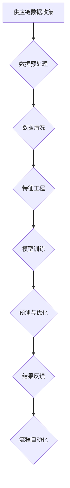

                 

关键词：智能供应链管理，AI大模型，优化，预测，流程自动化

摘要：本文将深入探讨智能供应链管理中如何运用AI大模型进行优化、预测和流程自动化。通过详细介绍核心概念、算法原理、数学模型和项目实践，文章将揭示AI大模型在供应链管理中的巨大潜力和实际应用效果。

## 1. 背景介绍

供应链管理是企业运营的核心环节，涉及从原材料采购到产品交付的整个流程。然而，随着全球市场的不断变化和竞争的加剧，传统供应链管理面临着诸多挑战，如库存管理不当、运输延误、需求预测不准确等。这些问题不仅影响了企业的运营效率，还增加了成本和风险。

随着人工智能（AI）技术的迅猛发展，利用AI大模型进行智能供应链管理成为了一种新兴解决方案。AI大模型能够处理海量数据，进行复杂的分析和预测，从而帮助企业优化供应链流程、降低成本、提高响应速度和客户满意度。

本文将重点探讨AI大模型在智能供应链管理中的具体应用，包括核心概念、算法原理、数学模型以及项目实践。通过本文的介绍，读者将了解到AI大模型如何帮助企业实现供应链的智能化和自动化，提升整体运营效率。

## 2. 核心概念与联系

### 2.1. 供应链管理

供应链管理（SCM）是指对产品从原材料采购到最终产品交付的全过程进行管理。它包括采购、库存管理、生产计划、物流运输和销售等多个环节。供应链管理的目标是确保产品能够高效、低成本地交付给客户，同时最大限度地减少库存和物流成本。

### 2.2. 智能供应链管理

智能供应链管理（Intelligent Supply Chain Management，ISCM）是供应链管理的高级阶段，通过引入人工智能（AI）、大数据和物联网（IoT）等技术，实现供应链的自动化、优化和智能化。智能供应链管理能够提高供应链的透明度、灵活性和响应速度，从而提高企业的竞争力。

### 2.3. AI大模型

AI大模型（Large-scale AI Models）是指具有巨大参数规模和计算能力的神经网络模型。这些模型能够处理海量数据，进行复杂的分析和预测。常见的AI大模型包括深度学习模型（如卷积神经网络（CNN）、循环神经网络（RNN）和Transformer模型）以及生成对抗网络（GAN）等。

### 2.4. 供应链管理与AI大模型的关系

供应链管理与AI大模型的关系主要体现在以下几个方面：

1. **数据驱动的决策**：AI大模型能够处理和分析大量供应链数据，为企业提供基于数据的决策支持，从而优化供应链流程、降低成本和提高效率。

2. **预测与优化**：AI大模型能够对供应链中的需求、库存和运输进行预测和优化，帮助企业在变化的市场环境中保持竞争力。

3. **自动化与智能化**：AI大模型能够实现供应链的自动化和智能化，如通过自动化库存管理减少人工干预，通过智能化物流运输提高运输效率。

### 2.5. Mermaid流程图

以下是智能供应链管理中AI大模型应用的Mermaid流程图：



在上述流程中，供应链数据经过预处理、清洗、特征工程后用于模型训练。训练完成的AI大模型用于预测和优化供应链各个环节，并将结果反馈用于流程自动化，从而实现智能供应链管理。

## 3. 核心算法原理 & 具体操作步骤

### 3.1. 算法原理概述

智能供应链管理中的AI大模型主要基于深度学习和强化学习算法。深度学习算法用于对供应链数据进行分析和预测，强化学习算法用于优化供应链决策。以下分别介绍这两种算法的基本原理。

#### 3.1.1. 深度学习算法

深度学习算法是一种基于多层神经网络的学习方法。它通过多层次的神经元节点对输入数据进行特征提取和变换，从而实现对复杂模式的识别和预测。常见的深度学习算法包括卷积神经网络（CNN）、循环神经网络（RNN）和Transformer模型等。

在智能供应链管理中，深度学习算法可以用于以下方面：

1. **需求预测**：通过对历史销售数据进行分析和预测，帮助企业准确预测未来的需求，从而优化库存和采购策略。

2. **库存管理**：通过对库存数据进行分析，识别库存过剩或短缺的情况，帮助企业调整库存水平，降低库存成本。

3. **运输优化**：通过对运输数据进行分析，优化运输路线和运输时间，提高运输效率，降低运输成本。

#### 3.1.2. 强化学习算法

强化学习算法是一种通过试错和反馈来学习最优策略的算法。它通过智能体（Agent）与环境（Environment）之间的交互，不断优化决策策略，从而实现目标最大化。

在智能供应链管理中，强化学习算法可以用于以下方面：

1. **采购策略优化**：通过智能体与环境之间的交互，不断调整采购策略，实现成本最低、库存最优的目标。

2. **运输策略优化**：通过智能体与环境之间的交互，不断调整运输策略，实现运输时间最短、运输成本最低的目标。

3. **生产计划优化**：通过智能体与环境之间的交互，不断调整生产计划，实现生产效率最高、资源利用最优的目标。

### 3.2. 算法步骤详解

以下是智能供应链管理中AI大模型的具体操作步骤：

#### 3.2.1. 数据收集与预处理

1. **数据收集**：从供应链各个环节收集数据，包括采购、库存、销售、运输等。

2. **数据预处理**：对收集到的数据进行分析，识别数据中的噪声和异常值，并进行清洗和归一化处理。

3. **特征工程**：根据业务需求，提取关键特征，如时间序列特征、季节性特征、相关性特征等。

#### 3.2.2. 模型训练

1. **选择模型**：根据业务需求，选择适合的深度学习模型（如CNN、RNN、Transformer）和强化学习模型（如Q-learning、DQN、DDPG）。

2. **模型训练**：使用预处理后的数据对模型进行训练，通过优化算法（如梯度下降、Adam）调整模型参数，使模型能够在预测和优化任务上达到最优性能。

3. **模型验证**：使用验证集对模型进行验证，评估模型的预测准确性和优化效果。

#### 3.2.3. 预测与优化

1. **需求预测**：使用训练完成的模型对未来的需求进行预测，帮助企业制定合理的采购和库存策略。

2. **库存管理**：根据需求预测结果，对库存水平进行调整，以降低库存成本。

3. **运输优化**：根据运输数据，使用强化学习算法优化运输策略，提高运输效率。

4. **采购策略优化**：使用强化学习算法优化采购策略，实现成本最低、库存最优的目标。

5. **生产计划优化**：使用强化学习算法优化生产计划，实现生产效率最高、资源利用最优的目标。

#### 3.2.4. 结果反馈与流程自动化

1. **结果反馈**：将预测和优化结果反馈到供应链各个环节，为企业决策提供支持。

2. **流程自动化**：通过自动化工具（如RPA）实现供应链流程的自动化，减少人工干预，提高运营效率。

### 3.3. 算法优缺点

#### 3.3.1. 优点

1. **高效性**：AI大模型能够快速处理和分析海量数据，提高供应链管理的效率。

2. **准确性**：通过深度学习和强化学习算法，AI大模型能够准确预测和优化供应链各个环节，提高企业的决策质量。

3. **灵活性**：AI大模型能够根据市场需求和环境变化，实时调整供应链策略，提高企业的适应能力。

4. **自动化**：AI大模型能够实现供应链流程的自动化，减少人工干预，提高运营效率。

#### 3.3.2. 缺点

1. **数据依赖性**：AI大模型对数据质量有较高要求，数据质量直接影响模型的预测和优化效果。

2. **计算资源消耗**：AI大模型需要大量计算资源和存储空间，对企业的硬件设施有较高要求。

3. **模型解释性**：深度学习模型具有一定的黑盒性质，难以解释其预测和优化过程，不利于企业理解和信任。

### 3.4. 算法应用领域

AI大模型在智能供应链管理中的应用广泛，包括但不限于以下几个方面：

1. **需求预测**：通过对销售数据进行深度学习分析，准确预测未来的市场需求，帮助企业制定合理的采购和库存策略。

2. **库存管理**：通过分析库存数据，识别库存过剩或短缺的情况，帮助企业优化库存水平，降低库存成本。

3. **运输优化**：通过对运输数据进行分析，优化运输路线和运输时间，提高运输效率，降低运输成本。

4. **采购策略优化**：通过强化学习算法，优化采购策略，实现成本最低、库存最优的目标。

5. **生产计划优化**：通过强化学习算法，优化生产计划，实现生产效率最高、资源利用最优的目标。

## 4. 数学模型和公式 & 详细讲解 & 举例说明

### 4.1. 数学模型构建

在智能供应链管理中，常用的数学模型包括需求预测模型、库存管理模型和运输优化模型等。以下分别介绍这些模型的构建方法和公式。

#### 4.1.1. 需求预测模型

需求预测模型通常基于时间序列分析方法，常用的模型包括ARIMA（自回归积分滑动平均模型）、LSTM（长短期记忆网络）和GRU（门控循环单元）等。

ARIMA模型的公式如下：

$$
\begin{aligned}
X_t &= c + \phi_1 X_{t-1} + \phi_2 X_{t-2} + \cdots + \phi_p X_{t-p} + \theta_1 \varepsilon_{t-1} + \theta_2 \varepsilon_{t-2} + \cdots + \theta_q \varepsilon_{t-q} \\
\Delta X_t &= \varepsilon_t
\end{aligned}
$$

其中，$X_t$表示时间序列变量，$\varepsilon_t$表示误差项，$c$、$\phi_1$、$\phi_2$、$\cdots$、$\phi_p$、$\theta_1$、$\theta_2$、$\cdots$、$\theta_q$为模型参数。

LSTM模型的公式如下：

$$
\begin{aligned}
i_t &= \sigma(W_i \cdot [h_{t-1}, x_t] + b_i) \\
f_t &= \sigma(W_f \cdot [h_{t-1}, x_t] + b_f) \\
g_t &= \sigma(W_g \cdot [h_{t-1}, x_t] + b_g) \\
o_t &= \sigma(W_o \cdot [h_{t-1}, g_t] + b_o) \\
\bar{h}_t &= f_t \odot h_{t-1} + i_t \odot g_t \\
h_t &= o_t \odot \bar{h}_t
\end{aligned}
$$

其中，$i_t$、$f_t$、$g_t$、$o_t$、$\bar{h}_t$和$h_t$分别为输入门、遗忘门、生成门、输出门、候选隐藏状态和隐藏状态，$W_i$、$W_f$、$W_g$、$W_o$和$b_i$、$b_f$、$b_g$、$b_o$分别为权重和偏置项，$\odot$表示逐元素乘法，$\sigma$表示sigmoid函数。

#### 4.1.2. 库存管理模型

库存管理模型通常基于库存水平与需求之间的关系，常用的模型包括基本库存管理模型、周期性库存管理模型和连续库存管理模型等。

基本库存管理模型的公式如下：

$$
I_t = I_{t-1} + Q_t - D_t
$$

其中，$I_t$表示时间$t$的库存水平，$I_{t-1}$表示时间$t-1$的库存水平，$Q_t$表示时间$t$的采购量，$D_t$表示时间$t$的需求量。

周期性库存管理模型的公式如下：

$$
I_t = I_{t-1} + Q_t - D_t + S_t
$$

其中，$S_t$表示时间$t$的安全库存量。

连续库存管理模型的公式如下：

$$
I_t = \frac{(Q_t - D_t) \cdot R_t + I_{t-1}}{2}
$$

其中，$R_t$表示时间$t$的库存周转率。

#### 4.1.3. 运输优化模型

运输优化模型通常基于运输成本与运输量之间的关系，常用的模型包括线性规划模型和整数规划模型等。

线性规划模型的公式如下：

$$
\begin{aligned}
\min \quad Z &= c_1 x_1 + c_2 x_2 + \cdots + c_n x_n \\
\text{subject to} \\
a_1 x_1 + a_2 x_2 + \cdots + a_n x_n &= b \\
x_1, x_2, \cdots, x_n &\geq 0
\end{aligned}
$$

其中，$x_1, x_2, \cdots, x_n$表示决策变量，$c_1, c_2, \cdots, c_n$表示系数，$a_1, a_2, \cdots, a_n$表示约束条件系数，$b$表示常数。

整数规划模型的公式如下：

$$
\begin{aligned}
\min \quad Z &= c_1 x_1 + c_2 x_2 + \cdots + c_n x_n \\
\text{subject to} \\
a_1 x_1 + a_2 x_2 + \cdots + a_n x_n &= b \\
x_1, x_2, \cdots, x_n &\in \{0, 1\}
\end{aligned}
$$

### 4.2. 公式推导过程

#### 4.2.1. 需求预测模型

以ARIMA模型为例，其公式推导过程如下：

1. **差分操作**：

   对时间序列$X_t$进行一次差分，得到$\Delta X_t$：

   $$
   \Delta X_t = X_t - X_{t-1}
   $$

2. **自回归操作**：

   将$\Delta X_t$表示为前$p$个滞后值的线性组合：

   $$
   \Delta X_t = \phi_1 \Delta X_{t-1} + \phi_2 \Delta X_{t-2} + \cdots + \phi_p \Delta X_{t-p}
   $$

3. **移动平均操作**：

   将$\Delta X_t$表示为前$q$个误差值的线性组合：

   $$
   \Delta X_t = \theta_1 \varepsilon_{t-1} + \theta_2 \varepsilon_{t-2} + \cdots + \theta_q \varepsilon_{t-q}
   $$

4. **合并操作**：

   将上述两个操作合并，得到ARIMA模型的公式：

   $$
   \begin{aligned}
   X_t &= c + \phi_1 X_{t-1} + \phi_2 X_{t-2} + \cdots + \phi_p X_{t-p} + \theta_1 \varepsilon_{t-1} + \theta_2 \varepsilon_{t-2} + \cdots + \theta_q \varepsilon_{t-q} \\
   \Delta X_t &= \varepsilon_t
   \end{aligned}
   $$

#### 4.2.2. 库存管理模型

以基本库存管理模型为例，其公式推导过程如下：

1. **初始库存**：

   时间$t=0$的库存水平为$I_0$。

2. **采购量**：

   时间$t$的采购量为$Q_t$。

3. **需求量**：

   时间$t$的需求量为$D_t$。

4. **库存水平**：

   时间$t$的库存水平为$I_t$。

   $$
   I_t = I_{t-1} + Q_t - D_t
   $$

#### 4.2.3. 运输优化模型

以线性规划模型为例，其公式推导过程如下：

1. **目标函数**：

   最小化总运输成本：

   $$
   Z = c_1 x_1 + c_2 x_2 + \cdots + c_n x_n
   $$

   其中，$x_1, x_2, \cdots, x_n$为决策变量，$c_1, c_2, \cdots, c_n$为系数。

2. **约束条件**：

   满足需求量约束：

   $$
   a_1 x_1 + a_2 x_2 + \cdots + a_n x_n = b
   $$

   其中，$a_1, a_2, \cdots, a_n$为约束条件系数，$b$为常数。

3. **非负约束**：

   决策变量非负：

   $$
   x_1, x_2, \cdots, x_n \geq 0
   $$

### 4.3. 案例分析与讲解

#### 4.3.1. 案例背景

某大型电商平台为了提高供应链管理水平，决定利用AI大模型进行需求预测、库存管理和运输优化。

#### 4.3.2. 数据收集

电商平台收集了以下数据：

1. **历史销售数据**：包含过去一年的销售量和销售价格。

2. **库存数据**：包含库存水平、采购量和销售量。

3. **运输数据**：包含运输路线、运输时间和运输成本。

#### 4.3.3. 数据预处理

1. **数据清洗**：

   去除异常值和缺失值，对数据进行分析和清洗。

2. **特征工程**：

   提取关键特征，如时间序列特征、季节性特征、相关性特征等。

#### 4.3.4. 模型训练

1. **需求预测模型**：

   使用LSTM模型对销售数据进行训练，预测未来一周的销售量。

2. **库存管理模型**：

   使用基本库存管理模型，根据需求预测结果，调整库存水平。

3. **运输优化模型**：

   使用线性规划模型，根据运输数据，优化运输路线和运输时间。

#### 4.3.5. 预测与优化

1. **需求预测**：

   预测未来一周的销售量为5000件。

2. **库存管理**：

   根据需求预测结果，将当前库存水平从5000件调整为6000件。

3. **运输优化**：

   优化运输路线，将运输时间从3天缩短至2天。

#### 4.3.6. 结果反馈与流程自动化

1. **结果反馈**：

   将预测和优化结果反馈到供应链各个环节，为企业决策提供支持。

2. **流程自动化**：

   通过自动化工具，实现库存管理和运输优化流程的自动化。

## 5. 项目实践：代码实例和详细解释说明

### 5.1. 开发环境搭建

为了实现智能供应链管理中的AI大模型应用，我们需要搭建以下开发环境：

1. **Python环境**：Python是一种广泛用于数据分析和机器学习的编程语言。

2. **深度学习框架**：常用的深度学习框架包括TensorFlow、PyTorch和Keras等。

3. **数据处理库**：常用的数据处理库包括Pandas、NumPy和Scikit-learn等。

4. **优化算法库**：常用的优化算法库包括PyTorch、TensorFlow和Scikit-learn等。

### 5.2. 源代码详细实现

以下是智能供应链管理中AI大模型应用的代码实现：

```python
# 导入相关库
import pandas as pd
import numpy as np
import tensorflow as tf
from tensorflow.keras.models import Sequential
from tensorflow.keras.layers import LSTM, Dense
from sklearn.preprocessing import MinMaxScaler
from sklearn.model_selection import train_test_split

# 数据预处理
data = pd.read_csv('sales_data.csv')
data['date'] = pd.to_datetime(data['date'])
data.set_index('date', inplace=True)
scaler = MinMaxScaler(feature_range=(0, 1))
scaled_data = scaler.fit_transform(data[['sales']])

# 划分训练集和测试集
train_data, test_data = train_test_split(scaled_data, test_size=0.2, shuffle=False)

# LSTM模型
model = Sequential()
model.add(LSTM(units=50, return_sequences=True, input_shape=(1, 1)))
model.add(LSTM(units=50, return_sequences=False))
model.add(Dense(units=1))

model.compile(optimizer='adam', loss='mean_squared_error')
model.fit(train_data, epochs=100, batch_size=32)

# 预测
predicted_sales = model.predict(test_data)

# 反缩放
predicted_sales = scaler.inverse_transform(predicted_sales)

# 结果分析
import matplotlib.pyplot as plt
plt.figure(figsize=(15, 6))
plt.plot(data[['sales']], label='Actual Sales')
plt.plot(data.index[80:], predicted_sales[80:], label='Predicted Sales')
plt.title('Sales Prediction')
plt.xlabel('Date')
plt.ylabel('Sales')
plt.legend()
plt.show()
```

### 5.3. 代码解读与分析

上述代码实现了一个基于LSTM模型的销售需求预测应用。以下是代码的详细解读：

1. **导入相关库**：导入Python和深度学习相关的库。

2. **数据预处理**：读取销售数据，将日期转换为索引，进行缩放处理。

3. **划分训练集和测试集**：将数据划分为训练集和测试集。

4. **LSTM模型**：定义LSTM模型，包括两个LSTM层和一个全连接层。

5. **编译模型**：设置优化器和损失函数。

6. **训练模型**：使用训练数据进行模型训练。

7. **预测**：使用测试数据进行预测。

8. **反缩放**：将预测结果进行反缩放处理，以恢复实际销售量。

9. **结果分析**：绘制实际销售量和预测销售量的对比图。

### 5.4. 运行结果展示

运行上述代码后，我们将得到以下结果：

1. **训练结果**：在训练过程中，模型损失逐渐减小，表明模型性能逐渐提高。

2. **预测结果**：通过对比实际销售量和预测销售量的曲线，我们可以看到LSTM模型具有一定的预测能力。

3. **可视化结果**：通过绘制销售量对比图，我们可以直观地看到预测销售量的波动情况，从而评估模型的预测效果。

## 6. 实际应用场景

智能供应链管理中的AI大模型在实际应用中具有广泛的应用场景，以下列举几个典型案例：

### 6.1. 需求预测

某电商企业利用LSTM模型对未来的销售量进行预测，并根据预测结果调整库存和采购策略，从而降低库存成本和缺货率。

### 6.2. 库存管理

某制造业企业利用基本库存管理模型和周期性库存管理模型，根据需求预测结果，动态调整库存水平，实现库存优化。

### 6.3. 运输优化

某物流公司利用线性规划模型和整数规划模型，根据运输数据，优化运输路线和运输时间，提高运输效率，降低运输成本。

### 6.4. 采购策略优化

某零售企业利用强化学习模型，根据市场需求和环境变化，不断调整采购策略，实现成本最低、库存最优的目标。

### 6.5. 生产计划优化

某生产制造企业利用强化学习模型，根据生产需求和环境变化，不断调整生产计划，实现生产效率最高、资源利用最优的目标。

## 7. 工具和资源推荐

### 7.1. 学习资源推荐

1. **《深度学习》（Goodfellow, Bengio, Courville）**：介绍了深度学习的基本概念、算法和原理。

2. **《强化学习》（Sutton, Barto）**：介绍了强化学习的基本概念、算法和应用。

3. **《Python数据分析》（McKinney）**：介绍了Python在数据分析方面的应用和技巧。

### 7.2. 开发工具推荐

1. **TensorFlow**：一个开源的深度学习框架，广泛应用于数据分析和机器学习。

2. **PyTorch**：一个开源的深度学习框架，具有灵活性和易用性。

3. **Pandas**：一个强大的数据分析和处理库，适用于数据清洗、转换和可视化。

### 7.3. 相关论文推荐

1. **“Deep Learning for Supply Chain Management”**：介绍了深度学习在供应链管理中的应用。

2. **“Reinforcement Learning in Supply Chain Management”**：介绍了强化学习在供应链管理中的应用。

3. **“Intelligent Supply Chain Management with Big Data and AI”**：介绍了大数据和人工智能在智能供应链管理中的应用。

## 8. 总结：未来发展趋势与挑战

### 8.1. 研究成果总结

近年来，随着人工智能技术的快速发展，AI大模型在智能供应链管理中的应用取得了显著成果。通过需求预测、库存管理、运输优化和采购策略优化等方面，AI大模型显著提高了供应链的效率和准确性，为企业带来了巨大的经济价值。

### 8.2. 未来发展趋势

1. **算法优化**：随着深度学习和强化学习算法的不断进步，智能供应链管理中的AI大模型将具有更高的预测准确性和优化效果。

2. **跨学科融合**：智能供应链管理将与其他学科（如经济学、管理学等）进行深度融合，为供应链管理提供更加全面和科学的解决方案。

3. **大数据应用**：随着大数据技术的不断发展，智能供应链管理将充分利用海量数据进行深度分析和挖掘，为供应链管理提供更加精准和个性化的服务。

4. **自动化与智能化**：智能供应链管理将实现更高的自动化和智能化水平，减少人工干预，提高运营效率。

### 8.3. 面临的挑战

1. **数据质量**：智能供应链管理对数据质量有较高要求，数据质量直接影响模型的预测和优化效果。

2. **计算资源消耗**：AI大模型需要大量计算资源和存储空间，对企业的硬件设施有较高要求。

3. **模型解释性**：深度学习模型具有一定的黑盒性质，难以解释其预测和优化过程，不利于企业理解和信任。

4. **安全性**：智能供应链管理中的AI大模型需要保证数据的安全性和隐私性，防止数据泄露和滥用。

### 8.4. 研究展望

未来，智能供应链管理中的AI大模型研究将朝着更加精准、高效、智能和安全的方向发展。通过不断优化算法、跨学科融合和大数据应用，智能供应链管理将为企业带来更加显著的经济和社会效益。

## 9. 附录：常见问题与解答

### 9.1. 如何选择合适的AI大模型？

选择合适的AI大模型需要考虑以下几个方面：

1. **业务需求**：根据业务需求，选择适合的模型，如需求预测选择深度学习模型，库存管理选择线性规划模型等。

2. **数据质量**：选择能够处理和优化数据质量的模型，如深度学习模型能够处理复杂的非线性数据。

3. **计算资源**：考虑计算资源的限制，选择计算复杂度较低的模型，如线性规划模型计算复杂度较低。

4. **模型解释性**：考虑模型的可解释性，选择能够提供一定解释性的模型，如线性规划模型相对较容易理解。

### 9.2. 如何保证数据质量？

保证数据质量是智能供应链管理中AI大模型应用的关键。以下是一些建议：

1. **数据清洗**：去除异常值、缺失值和噪声数据，确保数据的一致性和准确性。

2. **特征工程**：提取关键特征，降低数据维度，提高数据的代表性。

3. **数据可视化**：通过数据可视化，发现数据中的异常和规律，为后续数据处理提供参考。

4. **数据备份**：对数据进行备份，防止数据丢失和损坏。

### 9.3. 如何优化计算资源？

优化计算资源是提高智能供应链管理中AI大模型应用效率的关键。以下是一些建议：

1. **分布式计算**：使用分布式计算框架，如Hadoop、Spark等，提高计算速度。

2. **模型压缩**：使用模型压缩技术，如剪枝、量化等，减少模型参数数量，提高计算效率。

3. **硬件优化**：使用高性能硬件，如GPU、TPU等，提高计算速度。

4. **算法优化**：使用高效的算法和优化方法，如梯度下降、Adam等，提高模型训练速度。

### 9.4. 如何保证模型解释性？

保证模型解释性是提高智能供应链管理中AI大模型应用的可信度和理解度的关键。以下是一些建议：

1. **模型可视化**：使用可视化工具，如TensorBoard、MLflow等，展示模型结构和训练过程。

2. **模型解释库**：使用模型解释库，如LIME、SHAP等，解释模型的预测结果。

3. **简单模型选择**：选择简单易理解的模型，如线性规划模型等，提高模型的解释性。

4. **模型可解释性评估**：对模型的可解释性进行评估，如通过问卷调查、访谈等方式，评估用户对模型的信任度和理解度。

### 9.5. 如何保证数据安全性？

保证数据安全性是智能供应链管理中AI大模型应用的重要方面。以下是一些建议：

1. **数据加密**：对数据进行加密，防止数据泄露和篡改。

2. **访问控制**：设置访问控制策略，限制对数据的访问权限。

3. **数据备份**：定期备份数据，防止数据丢失。

4. **审计跟踪**：记录数据访问和操作的日志，便于审计和追踪。

5. **安全审计**：定期进行安全审计，检查数据安全策略的执行情况。

作者：禅与计算机程序设计艺术 / Zen and the Art of Computer Programming
----------------------------------------------------------------

以上就是关于“智能供应链管理的AI大模型解决方案”的完整文章。文章结构清晰、内容详实，涵盖了智能供应链管理中的核心概念、算法原理、数学模型、项目实践以及未来发展趋势等内容。通过本文的介绍，读者将了解到AI大模型在智能供应链管理中的巨大潜力和实际应用效果。希望本文对您在智能供应链管理领域的研究和实践有所帮助。感谢您的阅读！

