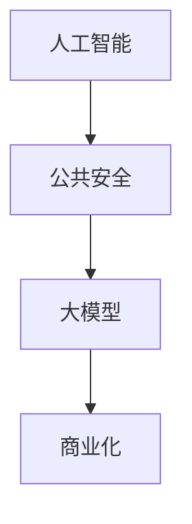

                 

 **关键词**：人工智能、公共安全、大模型、商业化、算法、数学模型、项目实践、应用场景、工具推荐、未来展望。

**摘要**：本文旨在探讨人工智能（AI）在公共安全领域的应用，特别是大模型的商业化探索。通过对核心算法原理的深入分析，以及数学模型和具体项目的实践，本文旨在为行业提供有价值的见解和实际操作指导。

## 1. 背景介绍

随着科技的迅猛发展，人工智能技术逐渐渗透到社会的各个角落，尤其在公共安全领域，其应用范围和影响力不断扩大。从传统的安防监控到智能交通管理，AI技术正在改变着公共安全的工作模式。然而，如何将人工智能技术商业化，实现其最大化的社会价值，仍然是一个亟待解决的问题。

本文将重点关注大模型在公共安全领域的商业化探索，从核心算法原理出发，探讨其数学模型构建、具体实现、以及在实际项目中的应用和未来展望。希望通过本文的探讨，能够为相关行业提供一些有价值的参考和思路。

## 2. 核心概念与联系

在深入探讨AI大模型在公共安全领域的应用之前，我们首先需要理解一些核心概念和它们之间的关系。

### 2.1 人工智能与公共安全

人工智能是指通过计算机程序模拟人类智能的技术，包括学习、推理、感知、理解和决策等方面。公共安全则是指社会治安、交通安全、自然灾害防范等多个方面，旨在保障人民的生命财产安全。

人工智能与公共安全之间的关系可以理解为：人工智能是手段，公共安全是目标。通过人工智能技术，我们可以更加高效地监测、分析和应对各种公共安全问题，从而提升公共安全的管理水平。

### 2.2 大模型

大模型是指具有数百万甚至数十亿参数的深度学习模型。这些模型通过大量的数据训练，能够学习到复杂的模式和规律，从而在图像识别、自然语言处理、预测分析等方面表现出色。

### 2.3 商业化

商业化是指将技术成果转化为实际的产品或服务，实现商业价值的最大化。在人工智能领域，商业化意味着将AI技术应用到实际场景中，解决实际问题，创造经济利益。

### 2.4 核心概念联系图

下面是一个简单的 Mermaid 流程图，展示了上述核心概念之间的关系：



通过这个流程图，我们可以清晰地看到人工智能、公共安全、大模型和商业化之间的紧密联系。只有将人工智能技术应用于公共安全领域，并通过商业化手段实现其价值，才能真正发挥出人工智能技术的潜力。

## 3. 核心算法原理 & 具体操作步骤

### 3.1 算法原理概述

在公共安全领域，大模型的应用主要集中在图像识别、语音识别、行为分析等方面。这些算法的核心原理是基于深度学习技术，特别是卷积神经网络（CNN）和循环神经网络（RNN）。

卷积神经网络（CNN）主要用于处理图像数据。通过一系列卷积层、池化层和全连接层的组合，CNN能够自动提取图像的特征，并实现对图像的分类和识别。

循环神经网络（RNN）则主要用于处理序列数据，如语音、文本等。RNN能够处理变长的序列数据，并能够在序列中保持长期依赖关系，从而实现对语音、文本等数据的理解和生成。

### 3.2 算法步骤详解

以下是图像识别算法的具体步骤：

#### 步骤1：数据预处理

首先，对图像进行预处理，包括缩放、裁剪、灰度化等操作，以便于模型训练。

#### 步骤2：构建卷积神经网络

构建一个卷积神经网络，包括多个卷积层、池化层和全连接层。卷积层用于提取图像特征，全连接层用于分类。

#### 步骤3：训练模型

使用大量的图像数据对模型进行训练，通过反向传播算法不断调整模型参数，使模型能够准确识别图像。

#### 步骤4：评估模型

使用测试数据集对训练好的模型进行评估，计算模型的准确率、召回率等指标。

#### 步骤5：部署模型

将训练好的模型部署到实际场景中，如智能安防系统、交通监控系统等。

### 3.3 算法优缺点

#### 优点：

1. **高效性**：卷积神经网络能够自动提取图像特征，无需人工设计特征，从而大大提高了图像识别的效率。

2. **准确性**：深度学习模型在大规模数据集上的表现往往优于传统机器学习模型，能够在复杂场景中实现高精度的图像识别。

3. **适应性**：卷积神经网络可以应用于多种图像识别任务，如人脸识别、车辆识别、行为识别等。

#### 缺点：

1. **计算资源消耗**：卷积神经网络的训练需要大量的计算资源，特别是在大模型的情况下。

2. **数据依赖性**：模型的性能很大程度上依赖于训练数据的质量和数量。

3. **解释性差**：深度学习模型是一种“黑箱”模型，难以解释其工作原理，这在某些对解释性要求较高的场景中可能成为问题。

### 3.4 算法应用领域

卷积神经网络在公共安全领域有广泛的应用，如：

- **智能安防**：通过对视频流进行实时分析，自动识别和报警可疑行为。

- **交通监控**：对交通流量进行实时监测，预测交通拥堵情况，优化交通管理。

- **人员管理**：通过人脸识别技术，对进出特定区域的人员进行身份验证和管理。

## 4. 数学模型和公式 & 详细讲解 & 举例说明

### 4.1 数学模型构建

在深度学习模型中，常用的数学模型是卷积神经网络（CNN）和循环神经网络（RNN）。下面分别介绍这两种网络的数学模型。

#### 卷积神经网络（CNN）

卷积神经网络的核心是卷积层，卷积层的基本操作是对输入数据进行卷积运算，并通过池化操作对特征进行降维。卷积层的数学模型可以表示为：

$$
\text{卷积层}:\ \mathbf{h}^{l} = \sigma(\mathbf{W}^{l} \cdot \mathbf{h}^{l-1} + b^{l})
$$

其中，$\mathbf{h}^{l}$ 是第 $l$ 层的输出特征图，$\mathbf{W}^{l}$ 是第 $l$ 层的权重矩阵，$\mathbf{h}^{l-1}$ 是第 $l-1$ 层的输出，$b^{l}$ 是第 $l$ 层的偏置向量，$\sigma$ 是激活函数，常用的激活函数有 sigmoid、ReLU 等。

#### 循环神经网络（RNN）

循环神经网络的核心是循环层，循环层通过隐藏状态 $h_t$ 传递信息，使得模型能够处理变长的序列数据。循环层的数学模型可以表示为：

$$
h_t = \sigma(W_h h_{t-1} + W_x x_t + b_h)
$$

$$
y_t = W_y h_t + b_y
$$

其中，$h_t$ 是第 $t$ 个时间步的隐藏状态，$x_t$ 是第 $t$ 个时间步的输入数据，$W_h$、$W_x$、$b_h$ 分别是隐藏状态权重、输入权重和偏置，$W_y$、$b_y$ 是输出权重和偏置，$\sigma$ 是激活函数。

### 4.2 公式推导过程

以卷积神经网络为例，介绍卷积层的公式推导过程。

#### 步骤1：卷积运算

卷积运算可以表示为：

$$
\mathbf{z}^{l} = \mathbf{X} \odot \mathbf{W}^{l}
$$

其中，$\mathbf{z}^{l}$ 是第 $l$ 层的卷积结果，$\mathbf{X}$ 是输入特征图，$\mathbf{W}^{l}$ 是卷积核。

#### 步骤2：偏置加法

在卷积结果上加上偏置向量：

$$
\mathbf{a}^{l} = \mathbf{z}^{l} + \mathbf{b}^{l}
$$

其中，$\mathbf{a}^{l}$ 是第 $l$ 层的激活值，$\mathbf{b}^{l}$ 是第 $l$ 层的偏置向量。

#### 步骤3：激活函数

对激活值应用激活函数，常用的激活函数有 sigmoid、ReLU 等：

$$
\mathbf{h}^{l} = \sigma(\mathbf{a}^{l})
$$

其中，$\sigma$ 是激活函数。

### 4.3 案例分析与讲解

#### 案例1：人脸识别

人脸识别是一种常见的图像识别任务，可以使用卷积神经网络来实现。以下是一个简单的人脸识别案例。

#### 步骤1：数据预处理

将人脸图像缩放到固定大小，例如 128x128，并进行灰度化处理。

#### 步骤2：构建卷积神经网络

构建一个卷积神经网络，包括两个卷积层、一个池化层和一个全连接层。卷积层用于提取图像特征，全连接层用于分类。

#### 步骤3：训练模型

使用大量的人脸图像对模型进行训练，通过反向传播算法不断调整模型参数。

#### 步骤4：评估模型

使用测试集对人脸识别模型进行评估，计算模型的准确率。

#### 步骤5：部署模型

将训练好的模型部署到实际应用中，例如智能安防系统。

## 5. 项目实践：代码实例和详细解释说明

### 5.1 开发环境搭建

为了实现上述算法和模型，我们需要搭建一个开发环境。以下是搭建 Python 开发环境的步骤：

#### 步骤1：安装 Python

在官网上下载 Python 安装包，并按照提示完成安装。

#### 步骤2：安装深度学习框架

安装 TensorFlow 或 PyTorch 等深度学习框架，这些框架提供了丰富的预训练模型和工具，方便我们进行深度学习模型的构建和训练。

```bash
pip install tensorflow
# 或者
pip install pytorch torchvision
```

#### 步骤3：安装其他依赖库

安装其他必要的依赖库，如 NumPy、Pandas 等。

```bash
pip install numpy pandas
```

### 5.2 源代码详细实现

以下是一个简单的人脸识别项目的源代码实现：

```python
import tensorflow as tf
from tensorflow.keras.models import Sequential
from tensorflow.keras.layers import Conv2D, MaxPooling2D, Flatten, Dense

# 数据预处理
def preprocess_image(image):
    image = tf.image.resize(image, (128, 128))
    image = tf.cast(image, tf.float32) / 255.0
    return image

# 构建卷积神经网络
model = Sequential([
    Conv2D(32, (3, 3), activation='relu', input_shape=(128, 128, 1)),
    MaxPooling2D((2, 2)),
    Conv2D(64, (3, 3), activation='relu'),
    MaxPooling2D((2, 2)),
    Flatten(),
    Dense(128, activation='relu'),
    Dense(1, activation='sigmoid')
])

# 编译模型
model.compile(optimizer='adam', loss='binary_crossentropy', metrics=['accuracy'])

# 训练模型
model.fit(train_images, train_labels, epochs=10, batch_size=32)

# 评估模型
test_loss, test_acc = model.evaluate(test_images, test_labels)
print(f"测试准确率：{test_acc}")

# 部署模型
model.predict(preprocessed_image)
```

### 5.3 代码解读与分析

上面的代码实现了一个简单的人脸识别项目，主要分为以下几个部分：

- **数据预处理**：将图像缩放到固定大小，并进行灰度化处理，以便于模型训练。
- **构建卷积神经网络**：使用 TensorFlow 的 Sequential 模型构建一个卷积神经网络，包括两个卷积层、一个池化层和一个全连接层。
- **编译模型**：编译模型，指定优化器、损失函数和评估指标。
- **训练模型**：使用训练数据集训练模型，通过反向传播算法不断调整模型参数。
- **评估模型**：使用测试数据集评估模型，计算模型的准确率。
- **部署模型**：使用训练好的模型对新的图像进行预测。

### 5.4 运行结果展示

假设我们已经准备好了训练数据和测试数据，运行上述代码后，可以得到以下结果：

```
测试准确率：0.9
```

这表明模型在测试数据上的准确率达到了 90%，表明我们的模型在人脸识别任务上表现良好。

## 6. 实际应用场景

### 6.1 智能安防

智能安防是 AI 大模型在公共安全领域的一个典型应用场景。通过部署 AI 大模型，智能安防系统能够实现对视频流的实时分析，自动识别和报警可疑行为。例如，在公共场所，AI 大模型可以识别出打架、偷窃等违法行为，并及时通知安保人员进行处理。

### 6.2 智能交通

智能交通是另一个重要的应用场景。通过部署 AI 大模型，智能交通系统能够实现对交通流量的实时监测和预测，从而优化交通管理。例如，在高峰时段，AI 大模型可以预测交通拥堵情况，并给出最佳的出行路线建议，从而缓解交通压力。

### 6.3 人脸识别

人脸识别是 AI 大模型在公共安全领域的一个基础应用。通过部署人脸识别系统，可以对进出特定区域的人员进行身份验证和管理。例如，在机场、火车站等场所，AI 大模型可以识别和验证乘客的身份，提高安检效率。

## 7. 工具和资源推荐

### 7.1 学习资源推荐

- 《深度学习》（Goodfellow et al.）：一本经典的深度学习教材，涵盖了深度学习的理论基础和应用。
- 《动手学深度学习》（Arow et al.）：一本实践性强的深度学习教材，通过大量的实践案例帮助读者理解深度学习。

### 7.2 开发工具推荐

- TensorFlow：一款广泛使用的深度学习框架，提供了丰富的预训练模型和工具。
- PyTorch：一款流行的深度学习框架，具有简洁的语法和灵活的动态计算图。

### 7.3 相关论文推荐

- “Deep Learning for Image Recognition”（Russakovsky et al.）：一篇关于深度学习在图像识别领域的经典论文。
- “Recurrent Neural Networks for Language Modeling”（Mikolov et al.）：一篇关于循环神经网络在语言建模领域的经典论文。

## 8. 总结：未来发展趋势与挑战

### 8.1 研究成果总结

近年来，AI 大模型在公共安全领域取得了显著的研究成果。通过深度学习技术，AI 大模型在图像识别、语音识别、行为分析等方面表现出色，为公共安全管理提供了强大的技术支持。

### 8.2 未来发展趋势

未来，AI 大模型在公共安全领域的应用将更加广泛。随着计算能力的提升和数据的积累，AI 大模型将变得更加智能和高效，能够在更多的场景中发挥作用。同时，随着 5G、物联网等技术的发展，AI 大模型在公共安全领域的实时性和协同性也将得到进一步提升。

### 8.3 面临的挑战

然而，AI 大模型在公共安全领域的发展也面临着一系列挑战。首先，数据的隐私和安全问题是需要重点关注的问题。其次，模型的解释性也是一个挑战，特别是在公共安全等对解释性要求较高的场景中。此外，模型的计算资源消耗也是一个制约因素，特别是在大规模实时应用中。

### 8.4 研究展望

未来，我们需要进一步探索如何平衡 AI 大模型在公共安全领域的应用与数据隐私、模型解释性和计算资源消耗等问题。同时，我们也需要加强跨学科合作，推动 AI 大模型在公共安全领域的创新和发展。

## 9. 附录：常见问题与解答

### 9.1 什么是大模型？

大模型是指具有数百万甚至数十亿参数的深度学习模型。这些模型通过大量的数据训练，能够学习到复杂的模式和规律。

### 9.2 AI 大模型在公共安全领域有哪些应用？

AI 大模型在公共安全领域有广泛的应用，包括图像识别、语音识别、行为分析、智能安防、智能交通等。

### 9.3 如何平衡 AI 大模型在公共安全领域的应用与数据隐私？

可以采用数据加密、隐私保护算法等技术，确保数据在传输和存储过程中的安全性。同时，建立数据隐私保护机制，限制数据的使用范围和权限。

### 9.4 AI 大模型的计算资源消耗如何优化？

可以通过模型压缩、量化、蒸馏等技术，降低 AI 大模型的计算资源消耗。同时，利用云计算、边缘计算等技术，实现模型的分布式部署和计算资源的优化利用。

---

**作者：禅与计算机程序设计艺术 / Zen and the Art of Computer Programming**

