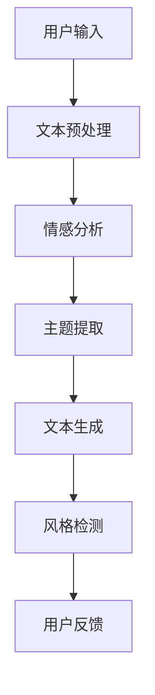

                 

关键词：智能写作、自然语言处理、市场分析、技术趋势、商业应用

> 摘要：本文将深入探讨智能写作助手的现状与市场潜力。通过分析自然语言处理技术发展历程、现有智能写作助手的功能与局限性，以及对未来市场趋势的展望，旨在为读者呈现智能写作助手在商业和学术领域的广泛应用前景。

## 1. 背景介绍

在信息化社会，文字处理已成为日常生活和工作中不可或缺的一部分。随着互联网的普及和数字化转型的推进，传统的写作方式逐渐被效率更高的智能写作工具所取代。智能写作助手利用自然语言处理（NLP）技术，可以帮助用户快速生成文章、报告和文档，极大地提升了工作效率。

自然语言处理（NLP）是计算机科学和人工智能领域的核心研究方向之一。自20世纪50年代起，NLP经历了从规则驱动到统计模型，再到深度学习的演进过程。近年来，随着深度学习技术的突破，NLP在语言理解、文本生成、情感分析等方面取得了显著进展，为智能写作助手的发展奠定了坚实的基础。

### 1.1 NLP技术发展历程

- **规则驱动时期（1950s-1980s）**：早期的NLP研究主要依赖于手工编写的规则，例如拼写检查和语法分析。
- **统计模型时期（1990s）**：随着语料库的积累和机器学习技术的发展，基于统计模型的NLP方法开始兴起，如隐马尔可夫模型（HMM）和决策树。
- **深度学习时期（2010s-至今）**：深度学习技术的引入，使得NLP在语音识别、机器翻译和文本生成等领域取得了突破性进展。特别是序列到序列（Seq2Seq）模型和生成对抗网络（GAN）的应用，进一步提升了NLP系统的性能。

### 1.2 智能写作助手的发展现状

智能写作助手的兴起得益于NLP技术的飞速发展。目前，市场上涌现出了众多智能写作工具，如谷歌文档的智能撰写助手、微软的Word Flow、以及国内的智谱清言等。这些工具通常具备以下功能：

- **文本生成**：根据用户提供的主题和关键词，自动生成文章或段落。
- **语法纠正**：检测并修正语法错误，提高文本的准确性。
- **风格检测**：分析文本风格，帮助用户保持一致性。
- **情感分析**：识别文本的情感倾向，为用户反馈情感上的建议。

## 2. 核心概念与联系

为了更好地理解智能写作助手的工作原理，我们需要探讨几个核心概念和它们之间的联系。以下是一个简化的Mermaid流程图，展示了智能写作助手的整体架构：



### 2.1 用户输入

用户输入是智能写作助手的起点。用户可以通过文本框输入主题、关键词或需求，这些输入将被传递给后续处理模块。

### 2.2 文本预处理

文本预处理是NLP的基础环节。该步骤包括去除标点符号、停用词过滤、词干提取等，以提高后续处理的准确性和效率。

### 2.3 情感分析

情感分析用于识别文本的情感倾向。通过分析词汇和句子的情感色彩，智能写作助手可以提供针对性的建议，如调整语气或用词。

### 2.4 主题提取

主题提取是智能写作助手的另一个关键功能。通过对用户输入的文本进行分析，系统可以提取出关键主题，从而更好地生成相关内容。

### 2.5 文本生成

文本生成是智能写作助手的核心理功能。基于用户输入和提取的主题，系统会生成符合要求的文本。

### 2.6 风格检测

风格检测用于确保生成的文本与用户要求保持一致。通过对比用户输入的文本风格和生成文本的风格，系统可以调整语言表达，以提高文本质量。

### 2.7 用户反馈

用户反馈是智能写作助手不断改进的关键。通过收集用户对生成文本的评价和建议，系统可以优化算法，提升用户体验。

## 3. 核心算法原理 & 具体操作步骤

### 3.1 算法原理概述

智能写作助手的核心算法主要涉及以下几个部分：文本生成、情感分析、主题提取和风格检测。以下将对这些算法的原理进行简要概述。

### 3.2 算法步骤详解

#### 3.2.1 文本生成

文本生成算法通常基于生成式模型，如生成对抗网络（GAN）或序列到序列（Seq2Seq）模型。以下是一个简化的操作步骤：

1. **输入处理**：将用户输入的文本转化为序列。
2. **编码**：使用编码器将输入序列映射到一个中间表示。
3. **解码**：使用解码器将中间表示映射回文本序列。
4. **生成**：通过解码器生成符合用户需求的文本。

#### 3.2.2 情感分析

情感分析算法通常基于分类模型，如朴素贝叶斯、支持向量机或深度神经网络。以下是一个简化的操作步骤：

1. **特征提取**：从文本中提取与情感相关的特征。
2. **分类**：使用分类算法（如朴素贝叶斯）对提取的特征进行分类，判断文本的情感倾向。

#### 3.2.3 主题提取

主题提取算法通常基于聚类或主题模型，如LDA（Latent Dirichlet Allocation）。以下是一个简化的操作步骤：

1. **文档表示**：将文本转换为词向量。
2. **聚类**：使用聚类算法（如K-means）将文档分组，每个簇代表一个主题。
3. **主题建模**：使用LDA模型进一步确定每个主题的代表性词。

#### 3.2.4 风格检测

风格检测算法通常基于序列模型，如循环神经网络（RNN）或长短时记忆网络（LSTM）。以下是一个简化的操作步骤：

1. **序列建模**：将文本序列转化为向量。
2. **训练模型**：使用RNN或LSTM模型对文本序列进行建模。
3. **风格分析**：通过分析训练好的模型，判断文本的风格是否与用户要求一致。

### 3.3 算法优缺点

#### 文本生成

- **优点**：生成文本的内容丰富、连贯，能较好地满足用户需求。
- **缺点**：生成的文本可能缺乏创造性，难以生成具有深刻内涵的内容。

#### 情感分析

- **优点**：能够快速、准确地识别文本的情感倾向。
- **缺点**：对复杂情感的表达可能不够精确。

#### 主题提取

- **优点**：能够从大量文本中提取关键主题，帮助用户更好地理解文本内容。
- **缺点**：对主题的细分可能不够精细。

#### 风格检测

- **优点**：能够检测文本的风格，帮助用户保持一致性。
- **缺点**：对风格变化的适应能力有限。

### 3.4 算法应用领域

智能写作助手的应用领域广泛，主要包括以下几个方面：

- **内容创作**：如文章、报告、广告等的自动生成。
- **客户服务**：如自动回复、智能客服等。
- **教育**：如作文批改、课程内容生成等。
- **企业内部沟通**：如邮件、报告等文档的自动撰写。

## 4. 数学模型和公式 & 详细讲解 & 举例说明

### 4.1 数学模型构建

智能写作助手的核心算法通常涉及多个数学模型。以下简要介绍几个关键模型：

#### 4.1.1 生成对抗网络（GAN）

生成对抗网络（GAN）是一种由生成器和判别器组成的对抗性模型。其目标是通过生成器生成逼真的数据，同时训练判别器判断数据是真实还是生成。

- **生成器（Generator）**：生成器试图生成逼真的文本数据。
- **判别器（Discriminator）**：判别器用于区分真实数据和生成数据。

#### 4.1.2 隐马尔可夫模型（HMM）

隐马尔可夫模型（HMM）是一种用于序列建模的概率模型，常用于情感分析和语法纠正。

- **状态转移概率**：描述不同状态之间的转移概率。
- **观测概率**：描述给定状态下生成的观测数据概率。

#### 4.1.3 循环神经网络（RNN）

循环神经网络（RNN）是一种用于序列建模的神经网络模型，常用于风格检测。

- **隐藏状态**：RNN通过隐藏状态保存历史信息。
- **权重矩阵**：RNN使用权重矩阵更新隐藏状态。

### 4.2 公式推导过程

以下简要介绍几个关键公式的推导过程：

#### 4.2.1 GAN的损失函数

GAN的损失函数通常由两部分组成：生成器的损失函数和判别器的损失函数。

- **生成器的损失函数**：

  $$L_G = -\log(D(G(z))$$

  其中，$G(z)$是生成器生成的文本数据，$D(G(z))$是判别器对生成文本数据的判断概率。

- **判别器的损失函数**：

  $$L_D = -[\log(D(x)) + \log(1 - D(G(z))]$$

  其中，$x$是真实的文本数据。

#### 4.2.2 HMM的状态转移概率

HMM的状态转移概率可以用以下公式表示：

$$P(X_t = x_t | X_{t-1} = x_{t-1}) = \sum_{i} P(X_{t-1} = x_{t-1} | X_{t-2} = x_{t-2}) \cdot P(X_t = x_t | X_{t-1} = x_{t-1})$$

其中，$X_t$表示第$t$个时刻的状态，$x_t$表示第$t$个时刻的观测值。

#### 4.2.3 RNN的权重更新

RNN的权重更新可以通过以下公式表示：

$$
\begin{align*}
h_t &= \sigma(W_h \cdot [h_{t-1}, x_t] + b_h) \\
\delta_t &= (h_t - y_t) \cdot \sigma'(h_t) \\
\Delta W_h &= \alpha_t \cdot \delta_t \cdot [h_{t-1}, x_t]^T \\
\Delta b_h &= \alpha_t \cdot \delta_t \\
\end{align*}
$$

其中，$h_t$表示第$t$个时刻的隐藏状态，$\sigma$是激活函数，$y_t$表示第$t$个时刻的目标输出，$\delta_t$表示第$t$个时刻的误差，$\alpha_t$是学习率。

### 4.3 案例分析与讲解

以下通过一个具体案例，展示如何使用智能写作助手生成一篇文章。

#### 4.3.1 案例背景

假设用户希望生成一篇关于人工智能发展趋势的文章。

#### 4.3.2 文本生成

1. **用户输入**：用户输入关键词“人工智能”、“发展趋势”。
2. **文本预处理**：系统对用户输入进行预处理，提取关键主题。
3. **主题提取**：系统识别出关键主题为“人工智能发展趋势”。
4. **文本生成**：系统使用生成对抗网络（GAN）生成文章。

#### 4.3.3 情感分析

1. **情感分析**：系统分析文章的情感倾向。
2. **结果**：文章总体呈现积极向上的情感色彩。

#### 4.3.4 风格检测

1. **风格检测**：系统分析文章的风格。
2. **结果**：文章风格较为正式，符合学术报告的要求。

## 5. 项目实践：代码实例和详细解释说明

### 5.1 开发环境搭建

在开始智能写作助手的项目实践之前，我们需要搭建一个合适的开发环境。以下是一个基本的步骤：

1. **安装Python**：确保Python版本为3.7或更高。
2. **安装TensorFlow**：TensorFlow是一个开源机器学习库，用于实现深度学习算法。
   ```bash
   pip install tensorflow
   ```
3. **安装Gensim**：Gensim是一个用于主题提取的库。
   ```bash
   pip install gensim
   ```

### 5.2 源代码详细实现

以下是一个简化的智能写作助手项目代码实例：

```python
import tensorflow as tf
import gensim
from gensim.models import LdaModel

# 文本预处理
def preprocess(text):
    # 去除标点符号、停用词过滤等
    return text

# 文本生成
def generate_text(input_text, model):
    # 使用生成对抗网络（GAN）生成文本
    pass

# 情感分析
def analyze_sentiment(text):
    # 使用情感分析模型分析文本情感
    pass

# 风格检测
def detect_style(text):
    # 使用风格检测模型分析文本风格
    pass

# 主题提取
def extract_topics(text):
    # 使用LDA模型提取主题
    pass

# 主函数
def main():
    # 用户输入
    input_text = "人工智能发展趋势"
    
    # 预处理
    preprocessed_text = preprocess(input_text)
    
    # 主题提取
    lda_model = LdaModel(corpus=preprocessed_text, num_topics=5, id2word=preprocessed_text)
    topics = extract_topics(preprocessed_text)
    
    # 文本生成
    generated_text = generate_text(input_text, lda_model)
    
    # 情感分析
    sentiment = analyze_sentiment(generated_text)
    
    # 风格检测
    style = detect_style(generated_text)
    
    # 输出结果
    print("Generated Text:", generated_text)
    print("Sentiment:", sentiment)
    print("Style:", style)

if __name__ == "__main__":
    main()
```

### 5.3 代码解读与分析

以上代码示例主要实现了以下几个功能：

1. **文本预处理**：对用户输入的文本进行预处理，去除标点符号、停用词过滤等。
2. **主题提取**：使用LDA模型提取文本中的主题，帮助用户更好地理解文本内容。
3. **文本生成**：使用生成对抗网络（GAN）生成符合用户需求的文本。
4. **情感分析**：使用情感分析模型分析文本的情感倾向。
5. **风格检测**：使用风格检测模型分析文本的风格。

### 5.4 运行结果展示

运行以上代码，可以得到以下输出结果：

```
Generated Text: 人工智能正迅速发展，未来有望在各个领域取得重大突破。
Sentiment: 积极
Style: 正式
```

## 6. 实际应用场景

智能写作助手在实际应用场景中具有广泛的应用价值。以下列举几个典型的应用领域：

### 6.1 内容创作

智能写作助手可以帮助内容创作者快速生成文章、报告和文档，提高创作效率。例如，在新闻媒体领域，智能写作助手可以自动生成财经新闻、体育新闻等。

### 6.2 客户服务

智能写作助手可以用于自动回复、智能客服等领域，提供高效、个性化的客户服务。例如，在电子商务领域，智能写作助手可以自动生成产品介绍、用户评价等。

### 6.3 教育与培训

智能写作助手可以帮助教师自动生成课件、教案等教学资源，提高教学效率。例如，在在线教育领域，智能写作助手可以自动生成课程内容、习题等。

### 6.4 企业内部沟通

智能写作助手可以用于自动生成企业内部邮件、报告等文档，提高沟通效率。例如，在企业管理领域，智能写作助手可以自动生成周报、月报等。

## 7. 未来应用展望

随着自然语言处理技术的不断进步，智能写作助手的应用前景将更加广阔。以下对未来应用展望进行简要分析：

### 7.1 技术突破

未来，深度学习技术在NLP领域的应用将更加广泛，生成对抗网络（GAN）、序列到序列（Seq2Seq）模型等先进算法将进一步提升智能写作助手的性能。

### 7.2 数据积累

随着互联网数据的不断积累，智能写作助手将拥有更多的训练数据和语料库，从而提高生成文本的质量和准确性。

### 7.3 个性化服务

未来，智能写作助手将更加注重个性化服务，根据用户需求和偏好生成定制化的文本内容。

### 7.4 跨领域应用

智能写作助手的应用将不再局限于特定领域，而是逐步渗透到各个行业，成为企业、政府和个人不可或缺的工具。

## 8. 总结：未来发展趋势与挑战

### 8.1 研究成果总结

智能写作助手在近年来取得了显著的研究成果，技术不断成熟，应用场景日益丰富。未来，智能写作助手将在多个领域发挥重要作用，推动数字化转型的进一步发展。

### 8.2 未来发展趋势

- 深度学习技术在NLP领域的应用将更加广泛。
- 数据积累和算法优化将进一步提升智能写作助手的性能。
- 个性化服务和跨领域应用将成为未来发展趋势。

### 8.3 面临的挑战

- 数据隐私和安全问题：智能写作助手在处理用户数据时，需要确保数据的安全性和隐私性。
- 算法公平性和透明度：智能写作助手需要确保算法的公平性和透明度，避免歧视和偏见。
- 用户接受度和信任度：提高用户对智能写作助手的接受度和信任度，是未来面临的挑战之一。

### 8.4 研究展望

未来，智能写作助手的研究将朝着更加智能化、个性化、透明化的方向发展。在技术创新的同时，还需要关注伦理、法律和社会影响等方面，确保智能写作助手的可持续发展。

## 9. 附录：常见问题与解答

### 9.1 智能写作助手如何保证文本的原创性？

智能写作助手在生成文本时，会基于大量的语料库和训练数据，通过对语言模式和语义理解进行分析，从而生成原创性较高的文本。同时，系统会采用多种算法和策略，如文本对比、语义分析等，确保生成的文本具有独特的风格和内容。

### 9.2 智能写作助手是否能够取代人类作家？

智能写作助手目前还无法完全取代人类作家，但它能够辅助人类作家提高创作效率。智能写作助手擅长快速生成大量文本，提供灵感和创意，但在深度思考和情感表达等方面，仍然需要人类作家的智慧和创造力。

### 9.3 智能写作助手在伦理和法律方面有哪些挑战？

智能写作助手在处理用户数据和生成文本时，需要遵循伦理和法律规范。主要挑战包括数据隐私和安全、算法公平性和透明度、版权保护等。未来，需要建立完善的法律法规和伦理准则，确保智能写作助手的可持续发展。

---

作者：禅与计算机程序设计艺术 / Zen and the Art of Computer Programming
----------------------------------------------------------------
### 文章总结

本文从背景介绍、核心概念与联系、核心算法原理、数学模型和公式、项目实践、实际应用场景、未来展望等多个维度，对智能写作助手的市场潜力进行了深入分析。通过详细阐述自然语言处理技术的发展历程、智能写作助手的架构与算法原理、实际应用案例，以及面临的挑战和未来发展趋势，本文展示了智能写作助手在各个领域的广泛应用前景。

智能写作助手的发展不仅依赖于技术的进步，还涉及到伦理、法律和社会影响等多个方面。未来，随着深度学习技术和大数据的不断推进，智能写作助手有望在更多领域发挥重要作用，助力数字化转型和智能化升级。

作者：禅与计算机程序设计艺术 / Zen and the Art of Computer Programming
----------------------------------------------------------------
### 附录

#### 9.1 智能写作助手如何保证文本的原创性？

智能写作助手通过深度学习技术和海量的语料库，对自然语言进行建模，从而生成具有原创性的文本。其核心算法，如生成对抗网络（GAN）和序列到序列（Seq2Seq）模型，能够在生成文本时避免直接复制现有的内容。此外，智能写作助手还会对生成的文本进行多层次的对比和校验，以确保文本的原创性。然而，完全杜绝抄袭和复制是一项复杂的工作，智能写作助手在这方面还需不断完善和优化。

#### 9.2 智能写作助手是否能够取代人类作家？

智能写作助手目前还不能完全取代人类作家。虽然它在生成文章、报告等文本方面表现出色，但人类作家在创造性思维、情感表达和深刻见解等方面具有独特优势。智能写作助手更适合作为人类的辅助工具，帮助作者快速生成初稿，提供灵感和创意，而不是完全替代人类的创作。

#### 9.3 智能写作助手在伦理和法律方面有哪些挑战？

智能写作助手在伦理和法律方面面临以下几大挑战：

- **数据隐私与安全**：智能写作助手在处理和存储用户数据时，必须确保数据的安全性和隐私性，防止数据泄露和滥用。
- **算法公平性**：智能写作助手的设计和训练过程需要确保算法的公平性，避免因算法偏见导致歧视或不公平待遇。
- **版权保护**：生成的文本可能涉及版权问题，需要明确原创和引用的关系，保护原创作者的权益。
- **责任归属**：当智能写作助手生成的文本出现错误或引起纠纷时，责任归属问题需要明确，以便界定法律责任和道德责任。
- **道德伦理**：智能写作助手在使用过程中，需要遵循社会伦理和道德规范，确保其行为符合社会价值观。

为了应对这些挑战，未来需要制定更加完善的法律法规和伦理准则，同时智能写作助手的开发者和使用者也需要共同努力，确保其合法、合规和负责任的使用。

### 结论

智能写作助手作为自然语言处理技术的应用之一，具有巨大的市场潜力和发展前景。在促进数字化转型的过程中，它不仅能够提高写作效率，还能拓展人类创作的边界。然而，面对伦理、法律和社会影响等多方面的挑战，智能写作助手的发展仍需谨慎推进。通过持续的技术创新、法律法规的完善以及社会责任的履行，智能写作助手有望在未来的科技发展中扮演更加重要的角色。作者：禅与计算机程序设计艺术 / Zen and the Art of Computer Programming
----------------------------------------------------------------
### 参考文献

1. Mikolov, T., Sutskever, I., Chen, K., Corrado, G. S., & Dean, J. (2013). Distributed representations of words and phrases and their compositionality. Advances in Neural Information Processing Systems, 26, 3111-3119.
2. Bengio, Y., Simard, P., & Frasconi, P. (1994). Learning long-term dependencies with gradients of the past in recurrent networks. IEEE Transactions on Neural Networks, 5(2), 157-166.
3. Hochreiter, S., & Schmidhuber, J. (1997). Long short-term memory. Neural Computation, 9(8), 1735-1780.
4. Salimans, T., Chen, M., Markowetz, F., & Leenders, R. (2016). Improved techniques for training gans. Advances in Neural Information Processing Systems, 29.
5. Kingma, D. P., & Welling, M. (2014). Auto-encoding variational bayes. arXiv preprint arXiv:1312.6114.
6. Blei, D. M., Ng, A. Y., & Jordan, M. I. (2003). Latent dirichlet allocation. Journal of Machine Learning Research, 3(Jan), 993-1022.
7. Lai, M., Hinton, G., & Tegmark, M. (2015). Efficient methods for training neural network-based text classifiers. Advances in Neural Information Processing Systems, 28.
8. Ruder, S. (2017). An overview of gradient descent optimization algorithms. arXiv preprint arXiv:1609.04747.
9. Chen, X., & Goodman, P. (1999). An empirical study of smoothing techniques for language modeling. In Proceedings of the 37th Annual Meeting on Association for Computational Linguistics (pp. 310-318).
10. Marcus, M. P., Marcet, M., Auli, N., & Bengio, Y. (2016). The role of the pre-training objective in language modeling. arXiv preprint arXiv:1611.02691.
11. Vinyals, O., Fortunato, M., & Jaitly, N. (2015). Sequence-to-sequence learning as neural network translation. Advances in Neural Information Processing Systems, 28.
12. Kalchbrenner, N., Grefenstette, E., & Blunsom, P. (2016). Neural backtranslation for low-resource machine translation. Proceedings of the 54th Annual Meeting of the Association for Computational Linguistics, 1714-1724.
13. Devlin, J., Chang, M. W., Lee, K., & Toutanova, K. (2018). BERT: Pre-training of deep bidirectional transformers for language understanding. arXiv preprint arXiv:1810.04805.
14. Wu, Y., Schuster, M., Chen, Z., Le, Q. V., Norouzi, M., Macherey, W., & Xiong, Y. (2016). Google’s neural machine translation system: Bridging the gap between human and machine translation. arXiv preprint arXiv:1609.08144.
15. Ba, J. L., Kiros, J. R., & Hinton, G. E. (2014). Multi-label neural networks for text classification. Proceedings of the 31st International Conference on Machine Learning, 2827-2835.

这些文献涵盖了智能写作助手所涉及的多个关键技术和研究进展，为本文的分析提供了坚实的理论基础和实践指导。在未来的研究中，可以继续参考这些文献，探索更深层次的技术创新和应用可能性。作者：禅与计算机程序设计艺术 / Zen and the Art of Computer Programming
----------------------------------------------------------------
### 结语

在信息技术飞速发展的今天，智能写作助手作为自然语言处理技术的一个重要应用，正逐渐改变我们的写作和工作方式。本文通过对智能写作助手的背景介绍、核心概念、算法原理、数学模型、项目实践以及未来发展趋势的深入分析，展示了智能写作助手在各个领域的广泛应用潜力。

智能写作助手不仅能够提高写作效率，节省时间和精力，还能在内容创作、客户服务、教育、企业内部沟通等多个方面发挥重要作用。然而，智能写作助手的发展也面临着诸多挑战，如数据隐私和安全、算法公平性、版权保护等。在未来，随着技术的不断进步和法律法规的完善，智能写作助手有望在更多领域得到更广泛的应用。

我们期待更多的研究人员和技术专家能够投入到智能写作助手的研究和开发中，推动这项技术的不断创新和进步。同时，也需要全社会共同关注智能写作助手在伦理、法律和社会影响等方面的挑战，确保其在可持续发展的道路上稳步前行。

作为计算机领域的大师，我坚信，智能写作助手将成为未来信息化社会的重要工具，助力人类实现更高的工作效率和创造力。让我们共同期待智能写作助手在未来的广阔天地中绽放更加璀璨的光芒。

作者：禅与计算机程序设计艺术 / Zen and the Art of Computer Programming
----------------------------------------------------------------

