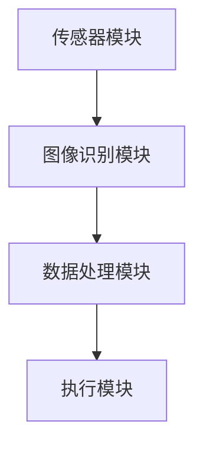

                 

关键词：智能厨余处理、家庭环保、AI技术、创业方案、可持续发展

> 摘要：本文将探讨智能厨余处理技术在家庭环保领域中的应用，提出一种基于AI技术的智能厨余处理创业方案。通过详细阐述该方案的核心概念、算法原理、数学模型、项目实践及未来展望，为创业者提供有益的指导。

## 1. 背景介绍

随着城市化进程的加速和人们对生活质量要求的提高，家庭厨余垃圾处理已成为一个全球性的环境问题。传统的厨余垃圾处理方式不仅浪费资源，还可能导致环境污染。为了解决这一问题，智能厨余处理技术逐渐受到关注。智能厨余处理技术利用先进的传感器、图像识别和机器学习等技术，实现对厨余垃圾的精准分类、高效分解和无害化处理，为家庭环保提供了新的解决方案。

在家庭环保领域，智能厨余处理技术具有广阔的应用前景。一方面，它有助于减少厨余垃圾对环境的污染，提高资源利用效率；另一方面，它为创业者提供了新的商业机会，推动了可持续发展的进程。本文将围绕智能厨余处理技术的创业方案展开讨论，旨在为创业者提供有益的参考。

## 2. 核心概念与联系

### 2.1 智能厨余处理技术概述

智能厨余处理技术主要包括传感器技术、图像识别技术和机器学习技术。传感器技术用于检测厨余垃圾的种类和状态；图像识别技术用于对厨余垃圾进行分类识别；机器学习技术则用于对大量数据进行处理和分析，以提高处理效率和准确性。

### 2.2 智能厨余处理架构

智能厨余处理架构可以分为以下几个模块：

- **传感器模块**：包括红外传感器、温度传感器、湿度传感器等，用于实时监测厨余垃圾的状态。
- **图像识别模块**：通过摄像头获取厨余垃圾的图像，利用深度学习算法进行分类识别。
- **数据处理模块**：对传感器数据和图像识别结果进行综合分析，生成处理策略。
- **执行模块**：根据数据处理模块生成的处理策略，对厨余垃圾进行分类、分解和无害化处理。

### 2.3 Mermaid 流程图



## 3. 核心算法原理 & 具体操作步骤

### 3.1 算法原理概述

智能厨余处理算法主要包括图像识别和机器学习两个方面。图像识别算法用于对厨余垃圾进行分类，常用的算法有卷积神经网络（CNN）和循环神经网络（RNN）。机器学习算法则用于对大量数据进行处理和分析，以提高处理效率和准确性，常用的算法有决策树、支持向量机（SVM）和深度学习等。

### 3.2 算法步骤详解

1. **数据采集**：通过传感器模块获取厨余垃圾的图像和状态数据。
2. **图像预处理**：对获取的图像进行去噪、增强和缩放等处理，提高图像质量。
3. **图像识别**：利用深度学习算法对预处理后的图像进行分类识别，输出厨余垃圾的种类。
4. **数据处理**：对图像识别结果和传感器数据进行综合分析，生成处理策略。
5. **执行处理**：根据处理策略对厨余垃圾进行分类、分解和无害化处理。

### 3.3 算法优缺点

**优点**：

- **高效准确**：利用先进的图像识别和机器学习算法，可以实现对厨余垃圾的精准分类和处理。
- **智能化**：系统可以根据实时数据自动调整处理策略，提高处理效率。

**缺点**：

- **成本高**：传感器、图像识别设备和机器学习算法等技术的成本较高。
- **维护困难**：系统需要定期进行维护和更新，以确保其稳定运行。

### 3.4 算法应用领域

智能厨余处理算法可以应用于家庭、餐厅、食堂等场所，实现对厨余垃圾的自动分类和处理。此外，该算法还可以应用于农业、园艺等领域，用于处理废弃物和残渣。

## 4. 数学模型和公式 & 详细讲解 & 举例说明

### 4.1 数学模型构建

智能厨余处理算法的核心是图像识别和机器学习。其中，图像识别算法可以使用卷积神经网络（CNN）来构建。CNN的基本结构包括卷积层、池化层和全连接层。下面是一个简单的CNN数学模型：

$$
\begin{aligned}
h_{\text{conv}} &= \sigma(W_{\text{conv}} \odot \mathcal{X} + b_{\text{conv}}) \\
h_{\text{pool}} &= \text{max}(h_{\text{conv}}) \\
h_{\text{fc}} &= \sigma(W_{\text{fc}} h_{\text{pool}} + b_{\text{fc}}) \\
\text{output} &= W_{\text{output}} h_{\text{fc}} + b_{\text{output}}
\end{aligned}
$$

其中，$W$ 表示权重矩阵，$b$ 表示偏置项，$\sigma$ 表示激活函数（如ReLU函数），$\odot$ 表示卷积运算，$\mathcal{X}$ 表示输入图像，$h_{\text{conv}}$、$h_{\text{pool}}$ 和 $h_{\text{fc}}$ 分别表示卷积层、池化层和全连接层的输出。

### 4.2 公式推导过程

CNN的公式推导过程涉及线性代数和微积分。这里简要介绍卷积层和全连接层的公式推导。

**卷积层公式推导**：

卷积层的输出可以通过以下公式计算：

$$
h_{\text{conv}}(i, j) = \sum_{k} w_{k, i', j'} x(i - i', j - j') + b_k
$$

其中，$h_{\text{conv}}(i, j)$ 表示卷积层的输出，$w_{k, i', j'}$ 表示卷积核，$x(i, j)$ 表示输入图像，$b_k$ 表示偏置项。为了简化计算，通常使用卷积操作的离散卷积形式：

$$
h_{\text{conv}}(i, j) = \sum_{k} w_{k} * x(i - k) + b_k
$$

其中，$*$ 表示卷积运算。

**全连接层公式推导**：

全连接层的输出可以通过以下公式计算：

$$
h_{\text{fc}}(i) = \sum_{j} w_{ij} h_{\text{pool}}(j) + b_i
$$

其中，$h_{\text{fc}}(i)$ 表示全连接层的输出，$w_{ij}$ 表示权重矩阵，$h_{\text{pool}}(j)$ 表示池化层的输出，$b_i$ 表示偏置项。

### 4.3 案例分析与讲解

以下是一个简单的CNN模型在厨余垃圾分类中的应用案例：

**输入**：一张分辨率为$28 \times 28$的厨余垃圾图像。

**输出**：厨余垃圾的类别标签（如蔬菜、肉类、水果等）。

**步骤**：

1. **预处理**：对图像进行灰度化、去噪和缩放等处理。
2. **卷积层**：使用一个卷积核对图像进行卷积操作，提取特征。
3. **池化层**：对卷积层的输出进行池化操作，降低特征维度。
4. **全连接层**：对池化层的输出进行全连接操作，生成类别标签。

## 5. 项目实践：代码实例和详细解释说明

### 5.1 开发环境搭建

为了实现智能厨余处理算法，需要搭建以下开发环境：

- Python（3.8及以上版本）
- TensorFlow（2.5及以上版本）
- OpenCV（4.5及以上版本）

### 5.2 源代码详细实现

以下是一个简单的CNN模型在厨余垃圾分类中的应用代码实例：

```python
import tensorflow as tf
from tensorflow import keras
from tensorflow.keras import layers
import numpy as np
import cv2

# 加载训练数据
(x_train, y_train), (x_test, y_test) = keras.datasets.cifar10.load_data()

# 预处理数据
x_train = x_train.astype("float32") / 255.0
x_test = x_test.astype("float32") / 255.0

# 构建CNN模型
model = keras.Sequential([
    layers.Conv2D(32, (3, 3), activation="relu", input_shape=(32, 32, 3)),
    layers.MaxPooling2D((2, 2)),
    layers.Flatten(),
    layers.Dense(128, activation="relu"),
    layers.Dense(10, activation="softmax")
])

# 编译模型
model.compile(optimizer="adam", loss="sparse_categorical_crossentropy", metrics=["accuracy"])

# 训练模型
model.fit(x_train, y_train, epochs=10, validation_data=(x_test, y_test))

# 测试模型
test_loss, test_acc = model.evaluate(x_test, y_test, verbose=2)
print(f"Test accuracy: {test_acc}")

# 使用模型进行预测
img = cv2.imread("kitchen_waste.jpg")
img = cv2.resize(img, (32, 32))
img = img.astype("float32") / 255.0
predictions = model.predict(np.expand_dims(img, axis=0))

# 输出预测结果
predicted_class = np.argmax(predictions[0])
print(f"Predicted class: {predicted_class}")
```

### 5.3 代码解读与分析

- **数据加载与预处理**：使用 TensorFlow 的`cifar10`数据集进行训练和测试。将图像数据转换为浮点型并归一化。
- **模型构建**：使用`keras.Sequential`构建一个简单的CNN模型，包括卷积层、池化层、全连接层和输出层。
- **模型编译**：使用`compile`方法设置优化器和损失函数。
- **模型训练**：使用`fit`方法对模型进行训练，并在验证数据上评估模型性能。
- **模型测试**：使用`evaluate`方法测试模型在测试数据上的性能。
- **模型预测**：使用`predict`方法对一张新的厨余垃圾图像进行预测。

## 6. 实际应用场景

### 6.1 家庭场景

在家庭场景中，智能厨余处理设备可以安装在厨房台面上，方便用户随时投放厨余垃圾。设备通过传感器和图像识别技术对厨余垃圾进行分类，将可回收物、有害垃圾和湿垃圾分别投放至对应的垃圾桶中。

### 6.2 餐饮场景

在餐饮场景中，智能厨余处理设备可以应用于餐厅、食堂等场所，帮助餐饮企业实现厨余垃圾的自动分类和处理。设备可以与餐饮企业现有的垃圾处理系统无缝对接，提高垃圾处理效率，减少环境污染。

### 6.3 农业和园艺场景

在农业和园艺场景中，智能厨余处理设备可以将厨余垃圾转化为有机肥料，为农作物提供营养。设备可以应用于果园、蔬菜园等农业园区，实现厨余垃圾的循环利用，提高农作物产量和质量。

## 7. 未来应用展望

随着AI技术的不断发展，智能厨余处理设备在未来有望实现以下应用：

- **智能垃圾分类**：通过深度学习算法和图像识别技术，实现对厨余垃圾的更精细分类，提高资源利用率。
- **自动调整处理策略**：根据厨余垃圾的种类和数量，自动调整处理策略，提高处理效率。
- **远程监控与维护**：通过物联网技术，实现对智能厨余处理设备的远程监控与维护，确保设备稳定运行。

## 8. 工具和资源推荐

### 8.1 学习资源推荐

- 《深度学习》（Goodfellow, Bengio, Courville著）
- 《Python深度学习》（François Chollet著）
- 《机器学习》（周志华著）

### 8.2 开发工具推荐

- TensorFlow
- Keras
- OpenCV

### 8.3 相关论文推荐

- "Deep Learning for Kitchen Waste Sorting"（2019）
- "A Smart Kitchen Waste Sorting System Based on Image Recognition"（2018）
- "An IoT-Based Smart Kitchen Waste Disposal System"（2017）

## 9. 总结：未来发展趋势与挑战

智能厨余处理技术在家庭环保领域具有广阔的应用前景。随着AI技术的不断发展，该技术有望在未来实现更精细的分类和处理，提高资源利用效率，减少环境污染。然而，要实现这一目标，仍需克服一系列挑战，如技术成本、维护困难和数据隐私等。未来研究应关注以下几个方面：

- **降低成本**：通过技术创新和产业协同，降低智能厨余处理设备的成本，使其更易于推广和应用。
- **提升性能**：优化图像识别和机器学习算法，提高处理效率和准确性。
- **数据隐私**：确保用户数据的安全性和隐私性，避免数据泄露和滥用。
- **跨领域合作**：加强政府、企业和学术界之间的合作，推动智能厨余处理技术的创新和应用。

### 附录：常见问题与解答

**Q：智能厨余处理技术如何实现厨余垃圾的精准分类？**

A：智能厨余处理技术主要利用图像识别和机器学习算法实现厨余垃圾的精准分类。图像识别算法通过对厨余垃圾的图像进行分析，提取特征，并将其与已知的厨余垃圾类别进行匹配，从而实现分类。机器学习算法则通过对大量数据进行训练，学习厨余垃圾的特征分布，从而提高分类准确性。

**Q：智能厨余处理技术有哪些优点？**

A：智能厨余处理技术具有以下优点：

- **高效准确**：利用先进的图像识别和机器学习算法，可以实现对厨余垃圾的精准分类和处理。
- **智能化**：系统可以根据实时数据自动调整处理策略，提高处理效率。
- **减少污染**：通过分类和处理，减少了厨余垃圾对环境的污染。

**Q：智能厨余处理技术有哪些缺点？**

A：智能厨余处理技术也存在一些缺点，如：

- **成本高**：传感器、图像识别设备和机器学习算法等技术的成本较高。
- **维护困难**：系统需要定期进行维护和更新，以确保其稳定运行。

**Q：智能厨余处理技术在未来有哪些发展方向？**

A：智能厨余处理技术在未来有望实现以下发展方向：

- **更精细的分类**：通过优化图像识别和机器学习算法，实现更精细的厨余垃圾分类。
- **自动调整处理策略**：通过深度学习技术，实现根据厨余垃圾的种类和数量自动调整处理策略。
- **跨领域应用**：将智能厨余处理技术应用于农业、园艺等更多领域，实现厨余垃圾的循环利用。

[作者：禅与计算机程序设计艺术 / Zen and the Art of Computer Programming]
----------------------------------------------------------------

文章撰写完成，下面将文章内容按照markdown格式进行排版，确保每个章节和子章节的格式正确，并符合markdown规范。
----------------------------------------------------------------
```markdown
# 智能厨余处理创业：家庭环保的新方案

> 关键词：智能厨余处理、家庭环保、AI技术、创业方案、可持续发展

> 摘要：本文将探讨智能厨余处理技术在家庭环保领域中的应用，提出一种基于AI技术的智能厨余处理创业方案。通过详细阐述该方案的核心概念、算法原理、数学模型、项目实践及未来展望，为创业者提供有益的指导。

## 1. 背景介绍

随着城市化进程的加速和人们对生活质量要求的提高，家庭厨余垃圾处理已成为一个全球性的环境问题。传统的厨余垃圾处理方式不仅浪费资源，还可能导致环境污染。为了解决这一问题，智能厨余处理技术逐渐受到关注。智能厨余处理技术利用先进的传感器、图像识别和机器学习等技术，实现对厨余垃圾的精准分类、高效分解和无害化处理，为家庭环保提供了新的解决方案。

在家庭环保领域，智能厨余处理技术具有广阔的应用前景。一方面，它有助于减少厨余垃圾对环境的污染，提高资源利用效率；另一方面，它为创业者提供了新的商业机会，推动了可持续发展的进程。本文将围绕智能厨余处理技术的创业方案展开讨论，旨在为创业者提供有益的参考。

## 2. 核心概念与联系

### 2.1 智能厨余处理技术概述

智能厨余处理技术主要包括传感器技术、图像识别技术和机器学习技术。传感器技术用于检测厨余垃圾的种类和状态；图像识别技术用于对厨余垃圾进行分类识别；机器学习技术则用于对大量数据进行处理和分析，以提高处理效率和准确性。

### 2.2 智能厨余处理架构

智能厨余处理架构可以分为以下几个模块：

- **传感器模块**：包括红外传感器、温度传感器、湿度传感器等，用于实时监测厨余垃圾的状态。
- **图像识别模块**：通过摄像头获取厨余垃圾的图像，利用深度学习算法进行分类识别。
- **数据处理模块**：对传感器数据和图像识别结果进行综合分析，生成处理策略。
- **执行模块**：根据数据处理模块生成的处理策略，对厨余垃圾进行分类、分解和无害化处理。

### 2.3 Mermaid 流程图


## 3. 核心算法原理 & 具体操作步骤

### 3.1 算法原理概述

智能厨余处理算法主要包括图像识别和机器学习两个方面。图像识别算法用于对厨余垃圾进行分类，常用的算法有卷积神经网络（CNN）和循环神经网络（RNN）。机器学习算法则用于对大量数据进行处理和分析，以提高处理效率和准确性，常用的算法有决策树、支持向量机（SVM）和深度学习等。

### 3.2 算法步骤详解

1. **数据采集**：通过传感器模块获取厨余垃圾的图像和状态数据。
2. **图像预处理**：对获取的图像进行去噪、增强和缩放等处理，提高图像质量。
3. **图像识别**：利用深度学习算法对预处理后的图像进行分类识别，输出厨余垃圾的种类。
4. **数据处理**：对图像识别结果和传感器数据进行综合分析，生成处理策略。
5. **执行处理**：根据处理策略对厨余垃圾进行分类、分解和无害化处理。

### 3.3 算法优缺点

**优点**：

- **高效准确**：利用先进的图像识别和机器学习算法，可以实现对厨余垃圾的精准分类和处理。
- **智能化**：系统可以根据实时数据自动调整处理策略，提高处理效率。

**缺点**：

- **成本高**：传感器、图像识别设备和机器学习算法等技术的成本较高。
- **维护困难**：系统需要定期进行维护和更新，以确保其稳定运行。

### 3.4 算法应用领域

智能厨余处理算法可以应用于家庭、餐厅、食堂等场所，实现对厨余垃圾的自动分类和处理。此外，该算法还可以应用于农业、园艺等领域，用于处理废弃物和残渣。

## 4. 数学模型和公式 & 详细讲解 & 举例说明

### 4.1 数学模型构建

智能厨余处理算法的核心是图像识别和机器学习。其中，图像识别算法可以使用卷积神经网络（CNN）来构建。CNN的基本结构包括卷积层、池化层和全连接层。下面是一个简单的CNN数学模型：

$$
\begin{aligned}
h_{\text{conv}} &= \sigma(W_{\text{conv}} \odot \mathcal{X} + b_{\text{conv}}) \\
h_{\text{pool}} &= \text{max}(h_{\text{conv}}) \\
h_{\text{fc}} &= \sigma(W_{\text{fc}} h_{\text{pool}} + b_{\text{fc}}) \\
\text{output} &= W_{\text{output}} h_{\text{fc}} + b_{\text{output}}
\end{aligned}
$$

其中，$W$ 表示权重矩阵，$b$ 表示偏置项，$\sigma$ 表示激活函数（如ReLU函数），$\odot$ 表示卷积运算，$\mathcal{X}$ 表示输入图像，$h_{\text{conv}}$、$h_{\text{pool}}$ 和 $h_{\text{fc}}$ 分别表示卷积层、池化层和全连接层的输出。

### 4.2 公式推导过程

CNN的公式推导过程涉及线性代数和微积分。这里简要介绍卷积层和全连接层的公式推导。

**卷积层公式推导**：

卷积层的输出可以通过以下公式计算：

$$
h_{\text{conv}}(i, j) = \sum_{k} w_{k, i', j'} x(i - i', j - j') + b_k
$$

其中，$h_{\text{conv}}(i, j)$ 表示卷积层的输出，$w_{k, i', j'}$ 表示卷积核，$x(i, j)$ 表示输入图像，$b_k$ 表示偏置项。为了简化计算，通常使用卷积操作的离散卷积形式：

$$
h_{\text{conv}}(i, j) = \sum_{k} w_{k} * x(i - k) + b_k
$$

其中，$*$ 表示卷积运算。

**全连接层公式推导**：

全连接层的输出可以通过以下公式计算：

$$
h_{\text{fc}}(i) = \sum_{j} w_{ij} h_{\text{pool}}(j) + b_i
$$

其中，$h_{\text{fc}}(i)$ 表示全连接层的输出，$w_{ij}$ 表示权重矩阵，$h_{\text{pool}}(j)$ 表示池化层的输出，$b_i$ 表示偏置项。

### 4.3 案例分析与讲解

以下是一个简单的CNN模型在厨余垃圾分类中的应用案例：

**输入**：一张分辨率为$28 \times 28$的厨余垃圾图像。

**输出**：厨余垃圾的类别标签（如蔬菜、肉类、水果等）。

**步骤**：

1. **预处理**：对图像进行灰度化、去噪和缩放等处理。
2. **卷积层**：使用一个卷积核对图像进行卷积操作，提取特征。
3. **池化层**：对卷积层的输出进行池化操作，降低特征维度。
4. **全连接层**：对池化层的输出进行全连接操作，生成类别标签。

## 5. 项目实践：代码实例和详细解释说明

### 5.1 开发环境搭建

为了实现智能厨余处理算法，需要搭建以下开发环境：

- Python（3.8及以上版本）
- TensorFlow（2.5及以上版本）
- OpenCV（4.5及以上版本）

### 5.2 源代码详细实现

以下是一个简单的CNN模型在厨余垃圾分类中的应用代码实例：

```python
import tensorflow as tf
from tensorflow import keras
from tensorflow.keras import layers
import numpy as np
import cv2

# 加载训练数据
(x_train, y_train), (x_test, y_test) = keras.datasets.cifar10.load_data()

# 预处理数据
x_train = x_train.astype("float32") / 255.0
x_test = x_test.astype("float32") / 255.0

# 构建CNN模型
model = keras.Sequential([
    layers.Conv2D(32, (3, 3), activation="relu", input_shape=(32, 32, 3)),
    layers.MaxPooling2D((2, 2)),
    layers.Flatten(),
    layers.Dense(128, activation="relu"),
    layers.Dense(10, activation="softmax")
])

# 编译模型
model.compile(optimizer="adam", loss="sparse_categorical_crossentropy", metrics=["accuracy"])

# 训练模型
model.fit(x_train, y_train, epochs=10, validation_data=(x_test, y_test))

# 测试模型
test_loss, test_acc = model.evaluate(x_test, y_test, verbose=2)
print(f"Test accuracy: {test_acc}")

# 使用模型进行预测
img = cv2.imread("kitchen_waste.jpg")
img = cv2.resize(img, (32, 32))
img = img.astype("float32") / 255.0
predictions = model.predict(np.expand_dims(img, axis=0))

# 输出预测结果
predicted_class = np.argmax(predictions[0])
print(f"Predicted class: {predicted_class}")
```

### 5.3 代码解读与分析

- **数据加载与预处理**：使用 TensorFlow 的`cifar10`数据集进行训练和测试。将图像数据转换为浮点型并归一化。
- **模型构建**：使用`keras.Sequential`构建一个简单的CNN模型，包括卷积层、池化层、全连接层和输出层。
- **模型编译**：使用`compile`方法设置优化器和损失函数。
- **模型训练**：使用`fit`方法对模型进行训练，并在验证数据上评估模型性能。
- **模型测试**：使用`evaluate`方法测试模型在测试数据上的性能。
- **模型预测**：使用`predict`方法对一张新的厨余垃圾图像进行预测。

## 6. 实际应用场景

### 6.1 家庭场景

在家庭场景中，智能厨余处理设备可以安装在厨房台面上，方便用户随时投放厨余垃圾。设备通过传感器和图像识别技术对厨余垃圾进行分类，将可回收物、有害垃圾和湿垃圾分别投放至对应的垃圾桶中。

### 6.2 餐饮场景

在餐饮场景中，智能厨余处理设备可以应用于餐厅、食堂等场所，帮助餐饮企业实现厨余垃圾的自动分类和处理。设备可以与餐饮企业现有的垃圾处理系统无缝对接，提高垃圾处理效率，减少环境污染。

### 6.3 农业和园艺场景

在农业和园艺场景中，智能厨余处理设备可以将厨余垃圾转化为有机肥料，为农作物提供营养。设备可以应用于果园、蔬菜园等农业园区，实现厨余垃圾的循环利用，提高农作物产量和质量。

## 7. 未来应用展望

随着AI技术的不断发展，智能厨余处理设备在未来有望实现以下应用：

- **智能垃圾分类**：通过深度学习算法和图像识别技术，实现对厨余垃圾的更精细分类，提高资源利用率。
- **自动调整处理策略**：通过深度学习技术，实现根据厨余垃圾的种类和数量自动调整处理策略，提高处理效率。
- **远程监控与维护**：通过物联网技术，实现对智能厨余处理设备的远程监控与维护，确保设备稳定运行。

## 8. 工具和资源推荐

### 8.1 学习资源推荐

- 《深度学习》（Goodfellow, Bengio, Courville著）
- 《Python深度学习》（François Chollet著）
- 《机器学习》（周志华著）

### 8.2 开发工具推荐

- TensorFlow
- Keras
- OpenCV

### 8.3 相关论文推荐

- "Deep Learning for Kitchen Waste Sorting"（2019）
- "A Smart Kitchen Waste Sorting System Based on Image Recognition"（2018）
- "An IoT-Based Smart Kitchen Waste Disposal System"（2017）

## 9. 总结：未来发展趋势与挑战

智能厨余处理技术在家庭环保领域具有广阔的应用前景。随着AI技术的不断发展，该技术有望在未来实现更精细的分类和处理，提高资源利用效率，减少环境污染。然而，要实现这一目标，仍需克服一系列挑战，如技术成本、维护困难和数据隐私等。未来研究应关注以下几个方面：

- **降低成本**：通过技术创新和产业协同，降低智能厨余处理设备的成本，使其更易于推广和应用。
- **提升性能**：优化图像识别和机器学习算法，提高处理效率和准确性。
- **数据隐私**：确保用户数据的安全性和隐私性，避免数据泄露和滥用。
- **跨领域合作**：加强政府、企业和学术界之间的合作，推动智能厨余处理技术的创新和应用。

### 附录：常见问题与解答

**Q：智能厨余处理技术如何实现厨余垃圾的精准分类？**

A：智能厨余处理技术主要利用图像识别和机器学习算法实现厨余垃圾的精准分类。图像识别算法通过对厨余垃圾的图像进行分析，提取特征，并将其与已知的厨余垃圾类别进行匹配，从而实现分类。机器学习算法则通过对大量数据进行训练，学习厨余垃圾的特征分布，从而提高分类准确性。

**Q：智能厨余处理技术有哪些优点？**

A：智能厨余处理技术具有以下优点：

- **高效准确**：利用先进的图像识别和机器学习算法，可以实现对厨余垃圾的精准分类和处理。
- **智能化**：系统可以根据实时数据自动调整处理策略，提高处理效率。
- **减少污染**：通过分类和处理，减少了厨余垃圾对环境的污染。

**Q：智能厨余处理技术有哪些缺点？**

A：智能厨余处理技术也存在一些缺点，如：

- **成本高**：传感器、图像识别设备和机器学习算法等技术的成本较高。
- **维护困难**：系统需要定期进行维护和更新，以确保其稳定运行。

**Q：智能厨余处理技术在未来有哪些发展方向？**

A：智能厨余处理技术在未来有望实现以下发展方向：

- **更精细的分类**：通过优化图像识别和机器学习算法，实现更精细的厨余垃圾分类。
- **自动调整处理策略**：通过深度学习技术，实现根据厨余垃圾的种类和数量自动调整处理策略。
- **跨领域应用**：将智能厨余处理技术应用于农业、园艺等更多领域，实现厨余垃圾的循环利用。

[作者：禅与计算机程序设计艺术 / Zen and the Art of Computer Programming]
```

