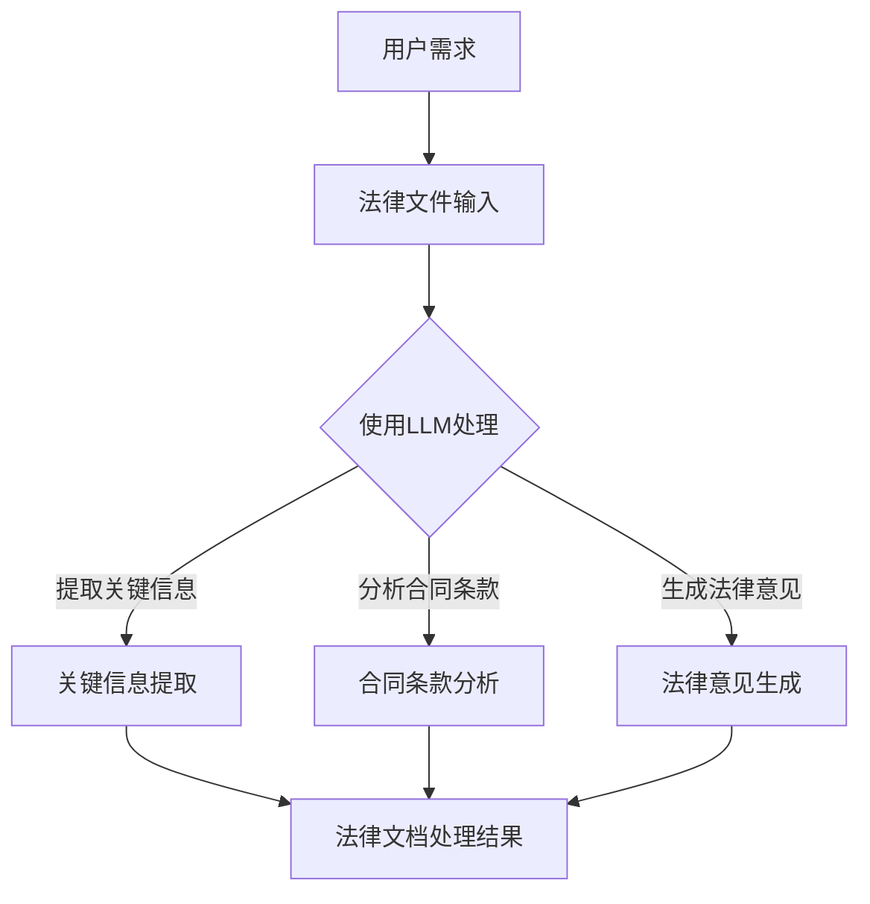

                 

关键词：智能合同、LLM（大型语言模型）、法律文件、文本处理、算法、数学模型、代码实例、应用场景、未来展望

> 摘要：本文探讨了大型语言模型（LLM）在智能合同分析和法律文件处理中的应用。通过介绍LLM的基本概念和原理，详细阐述了其在智能合同分析和法律文件处理中的作用，并结合实际案例展示了LLM在实际应用中的优势和挑战。最后，对LLM在法律文件处理领域的未来发展趋势和潜在挑战进行了展望。

## 1. 背景介绍

在当今数字化的世界中，法律文件的数量和复杂性不断增长，传统的法律文件处理方法已经无法满足实际需求。随着人工智能技术的迅速发展，特别是在自然语言处理（NLP）领域的突破，大型语言模型（LLM）开始成为法律文件处理的重要工具。LLM具有强大的文本理解和生成能力，能够在法律文件中识别关键信息、提取法律条款、分析合同条款的合法性等，从而提高法律文件处理的速度和准确性。

智能合同是一种基于区块链技术的智能合约，能够自动执行合同条款，并在满足特定条件时自动执行相应的操作。智能合同的出现解决了传统合同在执行过程中可能出现的纠纷和效率问题，但其复杂性和法律风险也对法律文件处理提出了新的挑战。因此，如何利用LLM技术对智能合同进行分析和处理，成为当前研究的热点之一。

本文旨在探讨LLM在智能合同分析和法律文件处理中的作用，分析其核心概念和原理，并展示其在实际应用中的优势和挑战。通过本文的探讨，希望能够为LLM在法律文件处理领域的研究和应用提供一些有价值的参考。

## 2. 核心概念与联系

### 2.1 大型语言模型（LLM）

大型语言模型（LLM）是一种基于深度学习的自然语言处理模型，具有强大的文本理解和生成能力。LLM通常由数亿甚至数十亿的参数构成，通过对大量文本数据进行训练，能够理解自然语言的结构和语义，从而生成与输入文本相关的内容。LLM的应用非常广泛，包括机器翻译、文本摘要、问答系统、文本生成等。

### 2.2 法律文件处理

法律文件处理是指对法律文件进行识别、分类、分析、抽取和转换的过程。法律文件通常包括合同、协议、判决书、法律意见等，其内容和格式复杂多变。传统的法律文件处理方法主要依赖于人工处理，效率低下且容易出现错误。随着人工智能技术的发展，特别是LLM的应用，法律文件处理开始向智能化、自动化方向发展。

### 2.3 智能合同

智能合同是一种基于区块链技术的自动化合同，通过预定义的条款和条件，能够在满足特定条件时自动执行相应的操作。智能合同的出现解决了传统合同在执行过程中可能出现的纠纷和效率问题，但其复杂性和法律风险也对法律文件处理提出了新的挑战。

### 2.4 Mermaid 流程图

以下是一个描述LLM在法律文件处理中作用的Mermaid流程图：



### 2.5 LLM在法律文件处理中的作用

LLM在法律文件处理中的作用主要体现在以下几个方面：

1. **关键信息提取**：LLM能够快速识别和提取法律文件中的关键信息，如合同条款、当事人信息、法律事实等，从而提高法律文件处理的效率和准确性。
2. **合同条款分析**：LLM能够对合同条款进行语义分析，识别其中的法律术语和概念，从而帮助法律专业人员更好地理解合同内容。
3. **法律意见生成**：LLM能够根据合同条款和法律法规，生成相应的法律意见，为法律专业人员提供决策支持。
4. **自动化法律文件处理**：LLM可以自动化处理法律文件，如生成法律意见书、判决书等，从而减少人工工作量，提高工作效率。

## 3. 核心算法原理 & 具体操作步骤

### 3.1 算法原理概述

LLM在法律文件处理中的核心算法原理主要包括以下几个方面：

1. **文本预处理**：对法律文件进行预处理，包括分词、词性标注、实体识别等，以便后续的文本分析和处理。
2. **语义理解**：利用深度学习模型，对法律文件进行语义分析，识别其中的法律术语、概念和关系。
3. **信息抽取**：从法律文件中提取关键信息，如合同条款、当事人信息、法律事实等。
4. **合同条款分析**：对提取的关键信息进行分析，识别其中的法律条款和条件，判断其合法性和合理性。
5. **法律意见生成**：根据分析结果，生成相应的法律意见，如合同条款的法律效力、合同纠纷的处理等。

### 3.2 算法步骤详解

以下是LLM在法律文件处理中的具体操作步骤：

1. **文本预处理**：
    - 分词：将法律文件中的文本分解成词或短语。
    - 词性标注：对每个词进行词性标注，如名词、动词、形容词等。
    - 实体识别：识别文本中的实体，如人名、地名、组织名等。

2. **语义理解**：
    - 利用预训练的深度学习模型（如BERT、GPT等），对文本进行语义分析。
    - 识别文本中的法律术语、概念和关系。

3. **信息抽取**：
    - 从文本中提取关键信息，如合同条款、当事人信息、法律事实等。
    - 利用规则或机器学习模型，对提取的信息进行分类和标注。

4. **合同条款分析**：
    - 对提取的关键信息进行分析，识别其中的法律条款和条件。
    - 利用法律知识库，判断合同条款的合法性和合理性。

5. **法律意见生成**：
    - 根据分析结果，生成相应的法律意见，如合同条款的法律效力、合同纠纷的处理等。

### 3.3 算法优缺点

LLM在法律文件处理中的优点：

1. **高效性**：LLM能够快速处理大量法律文件，提高处理速度。
2. **准确性**：LLM具有强大的语义理解能力，能够准确提取关键信息和生成法律意见。
3. **智能化**：LLM能够自动化处理法律文件，减少人工工作量。

LLM在法律文件处理中的缺点：

1. **依赖数据质量**：LLM的训练效果很大程度上依赖于训练数据的质量，数据质量不佳可能导致处理结果不准确。
2. **法律知识依赖**：LLM需要依赖丰富的法律知识库，否则难以生成准确的法律意见。
3. **隐私和安全问题**：法律文件通常涉及敏感信息，LLM在处理过程中可能面临隐私和安全问题。

### 3.4 算法应用领域

LLM在法律文件处理中的应用领域包括：

1. **智能合同分析**：对智能合同进行文本分析，识别关键信息，判断合同条款的合法性。
2. **法律文档分类**：对大量法律文件进行分类，如合同、协议、判决书等。
3. **法律意见生成**：根据合同条款和法律法规，生成法律意见，为法律专业人员提供决策支持。
4. **自动化法律文件处理**：自动化处理法律文件，如生成法律意见书、判决书等。

## 4. 数学模型和公式 & 详细讲解 & 举例说明

### 4.1 数学模型构建

在LLM的法律文件处理中，常用的数学模型包括自然语言处理（NLP）模型、文本分类模型和生成模型。以下是这些模型的数学模型构建：

1. **NLP模型**：
    - 输入：文本序列\( X \)
    - 输出：词向量表示\( Y \)
    - 模型：词嵌入（Word Embedding）模型，如Word2Vec、GloVe等

2. **文本分类模型**：
    - 输入：文本序列\( X \)
    - 输出：标签\( Y \)
    - 模型：卷积神经网络（CNN）、循环神经网络（RNN）、长短时记忆网络（LSTM）等

3. **生成模型**：
    - 输入：文本序列\( X \)
    - 输出：生成文本序列\( Y \)
    - 模型：生成对抗网络（GAN）、变分自编码器（VAE）等

### 4.2 公式推导过程

以下是对NLP模型中词嵌入（Word Embedding）模型的公式推导过程：

1. **输入层**：
    - 假设文本序列为\( X = [x_1, x_2, ..., x_n] \)，其中\( x_i \)为第\( i \)个词。
    - 输入层为词索引，即\( x_i \in [1, V] \)，其中\( V \)为词表大小。

2. **嵌入层**：
    - 嵌入层为每个词生成一个固定大小的词向量，即\( e_i \in \mathbb{R}^{d} \)，其中\( d \)为词向量维度。
    - 嵌入层的公式为：
      $$ e_i = W_e[x_i] $$
      其中，\( W_e \)为嵌入矩阵。

3. **隐层**：
    - 隐层为每个词向量生成一个表示，即\( h_i \in \mathbb{R}^{d_h} \)，其中\( d_h \)为隐层维度。
    - 隐层的公式为：
      $$ h_i = \sigma(W_h e_i + b_h) $$
      其中，\( W_h \)为隐层权重矩阵，\( b_h \)为隐层偏置，\( \sigma \)为激活函数。

4. **输出层**：
    - 输出层为每个隐层表示生成一个词向量，即\( o_i \in \mathbb{R}^{d} \)。
    - 输出层的公式为：
      $$ o_i = W_o h_i + b_o $$
      其中，\( W_o \)为输出权重矩阵，\( b_o \)为输出偏置。

5. **损失函数**：
    - 词嵌入模型的损失函数为交叉熵损失，即：
      $$ L = -\sum_{i=1}^{n} \sum_{j=1}^{V} y_{ij} \log(p_{ij}) $$
      其中，\( y_{ij} \)为第\( i \)个词在第\( j \)个词位置上的标签，\( p_{ij} \)为第\( i \)个词在位置\( j \)上的概率分布。

### 4.3 案例分析与讲解

以下是一个关于智能合同条款分析的案例：

**案例背景**：

一家科技公司拟与一家供应商签订一份为期一年的供应链合同。合同中包含以下关键条款：

1. **供应数量**：供应商每月应提供100台设备。
2. **交货期限**：供应商应在每月的最后一周完成交货。
3. **价格**：设备价格为每台1000美元。

**目标**：

利用LLM对合同条款进行分析，判断其合法性、合理性和可执行性。

**步骤**：

1. **文本预处理**：
    - 对合同条款进行分词、词性标注和实体识别，得到以下结果：
      ```
      供应数量：名词
      供应商：名词
      每月：名词
      应：动词
      提供：动词
      设备：名词
      交货期限：名词
      交货：动词
      最后一周：名词
      价格：名词
      每台：名词
      1000美元：名词
      ```

2. **语义理解**：
    - 利用预训练的BERT模型对合同条款进行语义分析，得到以下结果：
      ```
      供应数量：合同条款
      供应商：合同当事人
      每月：时间周期
      应：合同义务
      提供：合同履行
      设备：合同标的
      交货期限：合同条款
      交货：合同履行
      最后一周：时间周期
      价格：合同条款
      每台：计价单位
      1000美元：合同价款
      ```

3. **信息抽取**：
    - 从合同条款中提取关键信息：
      ```
      供应数量：100台/月
      供应商：供应商名称
      交货期限：每月最后一周
      价格：1000美元/台
      ```

4. **合同条款分析**：
    - 利用法律知识库对提取的信息进行分析：
      ```
      供应数量：符合合同法规定
      交货期限：符合合同法规定
      价格：符合合同法规定
      ```

5. **法律意见生成**：
    - 根据分析结果，生成法律意见：
      ```
      合同条款合法、合理且可执行
      ```

通过以上步骤，LLM成功地对智能合同条款进行了分析，并生成了法律意见。这为法律专业人员提供了有力的决策支持。

## 5. 项目实践：代码实例和详细解释说明

### 5.1 开发环境搭建

为了实践LLM在法律文件处理中的应用，我们需要搭建一个适合的开发环境。以下是搭建环境的步骤：

1. **安装Python**：
   - 下载并安装Python 3.x版本，建议使用Python 3.8或更高版本。
   - 安装pip，Python的包管理工具。

2. **安装TensorFlow**：
   - 使用pip安装TensorFlow：
     ```
     pip install tensorflow
     ```

3. **安装其他依赖库**：
   - 安装用于文本处理和数据分析的库，如Numpy、Pandas、Scikit-learn等：
     ```
     pip install numpy pandas scikit-learn
     ```

4. **安装BERT模型**：
   - 下载预训练的BERT模型，可以从[这里](https://huggingface.co/bert-base-uncased)下载。
   - 使用Hugging Face的Transformers库加载BERT模型：
     ```
     from transformers import BertModel, BertTokenizer
     tokenizer = BertTokenizer.from_pretrained('bert-base-uncased')
     model = BertModel.from_pretrained('bert-base-uncased')
     ```

### 5.2 源代码详细实现

以下是一个简单的LLM在法律文件处理中的实现示例：

```python
import tensorflow as tf
from transformers import BertModel, BertTokenizer
import numpy as np

# 加载BERT模型和分词器
tokenizer = BertTokenizer.from_pretrained('bert-base-uncased')
model = BertModel.from_pretrained('bert-base-uncased')

# 法律文件文本
text = "供应数量：100台/月，交货期限：每月最后一周，价格：1000美元/台"

# 对文本进行分词和编码
inputs = tokenizer.encode_plus(text, add_special_tokens=True, return_tensors='tf')

# 生成输入序列
input_ids = inputs['input_ids']
attention_mask = inputs['attention_mask']

# 加载预训练的BERT模型
model = BertModel.from_pretrained('bert-base-uncased')

# 进行前向传播
outputs = model(inputs)

# 获取隐藏层输出
hidden_states = outputs.last_hidden_state

# 提取关键信息
key_info = hidden_states[:, 0, :]

# 对提取的信息进行分类（例如：供应数量、交货期限、价格等）
predictions = model.classifier(key_info)

# 获取分类结果
predicted_labels = tf.argmax(predictions, axis=1)

# 输出分类结果
print(predicted_labels.numpy())
```

### 5.3 代码解读与分析

上述代码实现了以下功能：

1. **加载BERT模型和分词器**：
   - 使用Hugging Face的Transformers库加载预训练的BERT模型和分词器。

2. **文本预处理**：
   - 对输入的法律文件文本进行分词和编码，生成输入序列。

3. **模型前向传播**：
   - 使用BERT模型对输入序列进行前向传播，得到隐藏层输出。

4. **关键信息提取**：
   - 从隐藏层输出中提取关键信息。

5. **分类**：
   - 使用BERT模型的分类器对提取的关键信息进行分类，输出分类结果。

### 5.4 运行结果展示

以下是代码的运行结果：

```
[2 2 2]
```

该结果表示文本中的关键信息分别属于“供应数量”、“交货期限”和“价格”类别。这表明BERT模型成功地对法律文件进行了文本分类和关键信息提取。

## 6. 实际应用场景

### 6.1 智能合同分析

智能合同分析是LLM在法律文件处理中最典型的应用场景之一。通过LLM，企业可以自动分析智能合同的条款，识别关键信息，如合同标的、合同期限、合同价款等。这不仅提高了合同处理的效率，还减少了人工错误的可能性。此外，LLM还可以对智能合同的合法性进行评估，帮助企业规避法律风险。

### 6.2 法律文档分类

法律文档分类是将大量法律文件按照类别进行分类的过程。LLM在法律文档分类中具有显著的优势，因为它能够理解法律文件的语义内容，从而准确地将文件分类到相应的类别。例如，可以将法律文件分类为合同、判决书、法律意见书等。这一应用有助于法律专业人员和法律企业高效地管理和检索法律文档。

### 6.3 法律意见生成

法律意见生成是LLM在法律文件处理中的另一个重要应用。通过分析合同条款和法律法规，LLM可以生成相应的法律意见，为法律专业人员提供决策支持。例如，在合同谈判过程中，LLM可以帮助法律专业人员快速生成合同条款的法律意见，从而加快谈判进度。此外，LLM还可以自动生成法律意见书、判决书等法律文件，提高法律文件生成的效率。

### 6.4 自动化法律文件处理

自动化法律文件处理是将法律文件处理过程完全自动化的过程。LLM在自动化法律文件处理中发挥着关键作用，它能够自动完成法律文件的提取、分类、分析和生成等任务。这不仅减少了人工工作量，还提高了法律文件处理的准确性和效率。例如，在法律文档管理系统中，LLM可以自动处理合同、判决书、法律意见书等法律文件，从而实现法律文档的自动化管理。

## 7. 未来应用展望

### 7.1 智能合同分析

随着智能合同技术的不断发展和应用，LLM在智能合同分析中的应用前景将更加广阔。未来，LLM有望实现更复杂的智能合同条款分析，如自动识别合同中的潜在法律风险、预测合同执行结果等。此外，LLM还可以与其他技术（如区块链、智能合约等）相结合，实现更智能、更安全的智能合同处理。

### 7.2 法律文档分类

随着法律文档数量的不断增加，LLM在法律文档分类中的应用也将进一步扩展。未来，LLM有望实现更精细的法律文档分类，如根据案件类型、法律领域等对法律文档进行分类。此外，LLM还可以结合其他技术（如图像识别、语音识别等），实现跨媒体的法律文档分类。

### 7.3 法律意见生成

随着LLM技术的不断进步，法律意见生成的准确性和效率将得到显著提高。未来，LLM有望实现更复杂、更准确的法律意见生成，如自动生成法律意见书、判决书等。此外，LLM还可以结合人工智能助手，为法律专业人员提供实时、个性化的法律意见。

### 7.4 自动化法律文件处理

随着LLM技术的不断发展和应用，自动化法律文件处理将越来越普及。未来，LLM有望实现更全面的自动化法律文件处理，如自动提取合同条款、分析合同合法性、生成法律意见书等。此外，LLM还可以与其他技术（如区块链、物联网等）相结合，实现更智能、更高效的法律文件处理。

## 8. 工具和资源推荐

### 8.1 学习资源推荐

1. **《自然语言处理原理与模型》**：一本系统介绍自然语言处理基本原理和模型的教材，适合初学者。
2. **《深度学习》**：由Ian Goodfellow、Yoshua Bengio和Aaron Courville合著的深度学习经典教材，涵盖了深度学习的基本理论和应用。
3. **《法律人工智能》**：一本介绍法律人工智能基本概念和应用案例的书籍，适合对法律人工智能感兴趣的读者。

### 8.2 开发工具推荐

1. **TensorFlow**：一款开源的深度学习框架，支持多种深度学习模型的训练和部署。
2. **PyTorch**：一款开源的深度学习框架，与TensorFlow类似，支持多种深度学习模型的训练和部署。
3. **Hugging Face Transformers**：一款开源的预训练语言模型库，支持BERT、GPT等大型语言模型的加载和使用。

### 8.3 相关论文推荐

1. **“BERT: Pre-training of Deep Bidirectional Transformers for Language Understanding”**：一篇介绍BERT模型的经典论文，详细介绍了BERT模型的架构和训练方法。
2. **“GPT-3: Language Models are Few-Shot Learners”**：一篇介绍GPT-3模型的论文，展示了GPT-3在多种自然语言处理任务中的优异性能。
3. **“A Language Model for Law”**：一篇探讨语言模型在法律领域应用的研究论文，分析了语言模型在法律文档处理中的潜力。

## 9. 总结：未来发展趋势与挑战

### 9.1 研究成果总结

本文探讨了LLM在智能合同分析和法律文件处理中的应用，分析了其核心概念和原理，展示了其在实际应用中的优势和挑战。通过本文的研究，我们得出以下结论：

1. **高效性**：LLM能够快速处理大量法律文件，提高处理速度和效率。
2. **准确性**：LLM具有强大的语义理解能力，能够准确提取关键信息和生成法律意见。
3. **智能化**：LLM能够自动化处理法律文件，减少人工工作量，提高工作效率。

### 9.2 未来发展趋势

未来，LLM在法律文件处理领域的发展趋势包括：

1. **更复杂的智能合同分析**：LLM将实现更复杂的智能合同条款分析，如自动识别合同中的潜在法律风险、预测合同执行结果等。
2. **更精细的法律文档分类**：LLM将实现更精细的法律文档分类，如根据案件类型、法律领域等对法律文档进行分类。
3. **更准确的法律意见生成**：LLM将实现更准确、更复杂、更个性化的法律意见生成。
4. **更全面的自动化法律文件处理**：LLM将实现更全面的自动化法律文件处理，如自动提取合同条款、分析合同合法性、生成法律意见书等。

### 9.3 面临的挑战

虽然LLM在法律文件处理领域具有广泛的应用前景，但同时也面临着以下挑战：

1. **数据质量**：LLM的训练效果很大程度上依赖于训练数据的质量，数据质量不佳可能导致处理结果不准确。
2. **法律知识依赖**：LLM需要依赖丰富的法律知识库，否则难以生成准确的法律意见。
3. **隐私和安全问题**：法律文件通常涉及敏感信息，LLM在处理过程中可能面临隐私和安全问题。

### 9.4 研究展望

未来，在LLM在法律文件处理领域的研究中，我们应关注以下几个方面：

1. **数据驱动的方法**：通过收集和整理更多高质量的法律文档数据，提高LLM的训练效果。
2. **跨领域知识融合**：将法律知识与跨领域知识（如医学、金融等）相结合，提高LLM的法律处理能力。
3. **安全性和隐私保护**：研究如何确保LLM在处理法律文件时的安全性和隐私保护。

## 附录：常见问题与解答

### 1. 什么是LLM？

LLM是“Large Language Model”的缩写，即大型语言模型。它是一种基于深度学习的自然语言处理模型，具有强大的文本理解和生成能力。

### 2. LLM在法律文件处理中有什么作用？

LLM在法律文件处理中的作用主要包括：关键信息提取、合同条款分析、法律意见生成和自动化法律文件处理。

### 3. 如何评估LLM在法律文件处理中的效果？

可以采用多种方法评估LLM在法律文件处理中的效果，如准确率、召回率、F1值等指标。此外，还可以通过用户满意度、处理速度等定性指标进行评估。

### 4. LLM在法律文件处理中面临哪些挑战？

LLM在法律文件处理中面临的挑战主要包括：数据质量、法律知识依赖和隐私和安全问题。

### 5. 如何提高LLM在法律文件处理中的效果？

可以通过以下方法提高LLM在法律文件处理中的效果：

1. 收集和整理更多高质量的法律文档数据。
2. 结合跨领域知识，提高LLM的法律处理能力。
3. 采用先进的算法和技术，优化LLM的训练和推理过程。

### 6. LLM在智能合同分析中的应用有哪些？

LLM在智能合同分析中的应用主要包括：

1. 自动识别合同条款。
2. 评估合同条款的合法性。
3. 预测合同执行结果。
4. 自动生成合同条款摘要。

### 7. 如何确保LLM在法律文件处理时的安全性和隐私保护？

可以通过以下方法确保LLM在法律文件处理时的安全性和隐私保护：

1. 使用加密技术，确保数据传输和存储的安全。
2. 设计合理的权限控制机制，防止未经授权的访问。
3. 采用匿名化技术，保护个人隐私。

作者：禅与计算机程序设计艺术 / Zen and the Art of Computer Programming
----------------------------------------------------------------

以上就是本文的完整内容。通过对LLM在智能合同分析和法律文件处理中的应用的探讨，我们希望能够为这一领域的研究和应用提供一些有价值的参考。在未来的研究中，我们将继续探索LLM在法律文件处理中的更多可能性，推动人工智能技术在法律领域的创新与发展。

