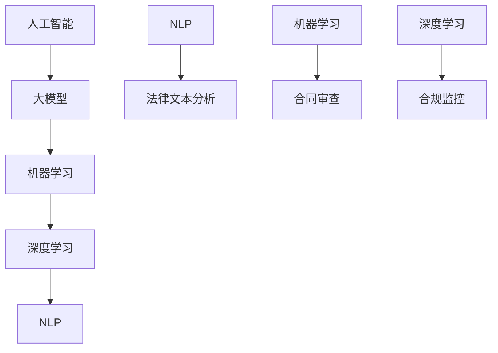

                 

关键词：智能合规系统、AI大模型、法律科技、数据隐私、算法伦理、机器学习、深度学习、法律文本分析、合规审核、智能合同管理、自动化监管。

> 摘要：本文深入探讨了AI大模型在法律科技领域的应用，特别是在智能合规系统的构建过程中。文章首先介绍了智能合规系统的基本概念和重要性，随后详细阐述了AI大模型的工作原理及其在法律科技中的应用。通过数学模型和公式推导，本文进一步展示了AI大模型在法律合规分析中的具体操作步骤。最后，文章通过实际项目实践，展示了智能合规系统的开发实例，并对未来的应用前景进行了展望。

## 1. 背景介绍

在信息化和数字化时代，法律行业也在经历着深刻的变革。传统的法律工作模式已经无法满足日益复杂和多样化的法律需求，尤其是在合规管理方面。随着人工智能技术的发展，特别是AI大模型的成熟，为法律科技领域带来了新的机遇和挑战。智能合规系统的出现，旨在通过AI技术提高法律合规管理的效率和质量，降低合规风险，确保企业合法运营。

智能合规系统是一个集成了人工智能、大数据分析、自然语言处理等技术的综合平台，能够自动化执行合规审查、合同管理、法律文本分析等任务。AI大模型作为智能合规系统的核心组件，其能力直接影响系统的性能和效果。

### 法律科技的发展现状

法律科技（Legal Tech）是指利用信息技术和互联网技术来改进和优化法律服务的一种新兴领域。近年来，随着技术的不断进步，法律科技发展迅速，涵盖了电子取证、在线法律咨询、智能合同审核、电子诉讼等多个方面。

根据市场研究公司的数据，全球法律科技市场预计将在未来几年内持续增长，市场规模将不断扩大。特别是AI技术在法律合规管理中的应用，已经成为行业发展的重点方向。

### 智能合规系统的概念

智能合规系统是指利用人工智能技术，对企业的合规管理流程进行自动化和智能化的系统。它能够帮助企业快速识别合规风险，制定合规策略，实施合规监控，并提供合规报告。

智能合规系统的核心功能包括：

1. **合规审核**：通过对大量法律文本和合同进行分析，智能合规系统能够快速识别潜在的法律风险，并提供相应的合规建议。
2. **合同管理**：自动化管理合同生命周期，包括合同起草、审批、执行、存档等环节，提高合同管理效率。
3. **合规监控**：实时监控企业的合规执行情况，确保各项业务活动符合法律法规要求。
4. **合规报告**：自动生成合规报告，帮助企业及时了解合规状况，为决策提供数据支持。

### 智能合规系统的优势

智能合规系统的优势主要体现在以下几个方面：

1. **提高效率**：自动化处理大量法律文本和合同，大大提高工作效率。
2. **降低成本**：减少人工审查和错误率，降低合规成本。
3. **确保合规**：实时监控合规执行情况，确保企业运营合法。
4. **提高决策支持**：通过数据分析，提供合规决策支持，提高决策质量。

### 智能合规系统的应用场景

智能合规系统可以应用于金融、保险、医疗等多个行业，以下是几个典型的应用场景：

1. **金融行业**：对金融产品和服务进行合规审核，确保符合监管要求。
2. **医疗行业**：管理医疗合同，确保符合医疗法规和伦理标准。
3. **制造业**：确保供应链合规，减少合规风险。
4. **跨国企业**：应对不同国家和地区的法律法规，提高合规管理水平。

总之，智能合规系统作为AI大模型在法律科技领域的重要应用，具有广阔的发展前景和巨大的市场潜力。在接下来的部分，我们将详细探讨AI大模型的工作原理及其在法律科技中的具体应用。

## 2. 核心概念与联系

在深入探讨智能合规系统之前，有必要先明确几个核心概念，并阐述它们之间的联系。这些概念包括人工智能（AI）、大模型（Big Model）、机器学习（Machine Learning）、深度学习（Deep Learning）以及自然语言处理（Natural Language Processing, NLP）。

### 人工智能（AI）

人工智能是指使计算机系统能够模拟人类智能行为的技术。AI包括多个分支，如机器学习、深度学习、自然语言处理、计算机视觉等。在法律科技领域，人工智能主要用于自动化和优化法律流程，提高工作效率和准确性。

### 大模型（Big Model）

大模型是指具有巨大参数量、能够处理海量数据的神经网络模型。这些模型通过训练能够自动提取数据中的规律和模式。在法律科技领域，大模型可以用于法律文本分析、合同审查、合规监控等任务。

### 机器学习（Machine Learning）

机器学习是AI的一个重要分支，涉及使用算法和统计模型从数据中学习规律和模式。在法律科技中，机器学习算法可以用于构建智能合规系统，通过分析大量法律文档，提取法律规则和条款。

### 深度学习（Deep Learning）

深度学习是机器学习的一个子领域，主要使用多层神经网络模型来学习数据中的复杂模式。深度学习在法律科技中的应用，包括通过自然语言处理技术理解法律文本，进行语义分析和智能合同审核。

### 自然语言处理（NLP）

自然语言处理是AI的一个分支，专注于使计算机能够理解和生成自然语言。在法律科技中，NLP技术可以用于处理法律文本，包括文本分类、实体识别、关系抽取等。

### 关系与联系

人工智能、大模型、机器学习、深度学习和自然语言处理之间存在着紧密的联系。大模型是基于机器学习算法训练的，而深度学习是机器学习的具体实现，特别是对于处理复杂任务如法律文本分析非常重要。自然语言处理则是深度学习在法律科技领域的重要应用场景之一。

下面是一个用Mermaid绘制的流程图，展示了这些概念和它们之间的联系：



通过上述流程图，我们可以更清晰地理解AI大模型在法律科技中的核心作用，以及各个技术分支如何相互配合，共同构建智能合规系统。

## 3. 核心算法原理 & 具体操作步骤

### 3.1 算法原理概述

智能合规系统的核心算法基于AI大模型，特别是深度学习和自然语言处理技术。算法的基本原理是通过大规模训练数据集，使模型能够自动学习和理解法律文本中的规则和模式。具体来说，该算法包括以下几个步骤：

1. **数据预处理**：收集和清洗大量法律文本数据，进行分词、词性标注等预处理操作。
2. **模型训练**：使用预处理后的数据训练深度学习模型，包括词向量表示、文本分类、实体识别等任务。
3. **模型优化**：通过交叉验证和超参数调整，优化模型性能。
4. **应用部署**：将训练好的模型部署到智能合规系统中，实现自动化合规审核和合同管理。

### 3.2 算法步骤详解

#### 步骤一：数据预处理

数据预处理是算法训练的基础。在这一阶段，我们需要对原始法律文本进行清洗、分词、词性标注等操作。

- **数据收集**：从互联网、数据库和内部文档中收集大量法律文本数据。
- **数据清洗**：去除无关信息，如HTML标签、空格、特殊字符等。
- **分词**：将法律文本分解为单词或短语，以便进一步处理。
- **词性标注**：对每个词进行词性标注，如名词、动词、形容词等，以便模型更好地理解文本内容。

#### 步骤二：模型训练

模型训练是算法的核心环节。在这一阶段，我们使用预处理后的数据集训练深度学习模型。

- **词向量表示**：使用Word2Vec、GloVe等方法将单词转换为固定长度的向量表示。
- **文本分类**：使用卷积神经网络（CNN）或循环神经网络（RNN）等模型对法律文本进行分类，如合同类型分类、合同条款分类等。
- **实体识别**：使用序列标注模型（如BiLSTM-CRF）识别文本中的实体，如人名、组织名、地名等。
- **关系抽取**：使用图神经网络（如Graph Convolutional Network, GCN）等模型抽取文本中的实体关系。

#### 步骤三：模型优化

模型优化是提高算法性能的关键步骤。在这一阶段，我们通过交叉验证和超参数调整，优化模型性能。

- **交叉验证**：使用交叉验证方法，如K折交叉验证，评估模型在不同数据集上的性能。
- **超参数调整**：通过调整学习率、批量大小、正则化参数等超参数，优化模型性能。

#### 步骤四：应用部署

模型训练和优化完成后，需要将模型部署到智能合规系统中，实现自动化合规审核和合同管理。

- **模型部署**：将训练好的模型部署到服务器或云计算平台，确保其稳定运行。
- **自动化合规审核**：通过API接口，将法律文本输入到模型中，自动化执行合规审核任务。
- **合同管理**：利用模型对合同进行分类、实体识别和关系抽取，实现自动化合同管理。

### 3.3 算法优缺点

#### 优点

- **高效性**：通过深度学习和自然语言处理技术，智能合规系统能够快速处理大量法律文本，提高工作效率。
- **准确性**：大规模训练数据和模型优化技术，使得算法在法律文本分析中的准确性较高。
- **自动化**：自动化合规审核和合同管理，减少人工干预，降低合规风险。

#### 缺点

- **数据依赖性**：算法性能依赖于大量高质量的法律文本数据，数据不足或质量差会影响算法效果。
- **模型复杂性**：深度学习模型的训练和优化过程较为复杂，对计算资源和专业知识要求较高。
- **算法解释性**：深度学习模型的“黑箱”特性，使得其决策过程缺乏透明度和解释性。

### 3.4 算法应用领域

智能合规系统的算法在法律科技领域具有广泛的应用前景，包括以下几个方面：

- **合规审核**：自动化执行合规审查任务，提高合规工作效率。
- **合同管理**：自动化管理合同生命周期，降低合同管理成本。
- **法律文本分析**：快速处理大量法律文本，提取关键信息和规则。
- **智能监管**：实时监控企业合规执行情况，为监管机构提供数据支持。

通过上述算法原理和具体操作步骤的介绍，我们可以看到，智能合规系统利用AI大模型技术，在法律科技领域具有巨大的潜力和优势。在接下来的部分，我们将进一步探讨智能合规系统的数学模型和公式，以加深对其工作原理的理解。

## 4. 数学模型和公式 & 详细讲解 & 举例说明

### 4.1 数学模型构建

智能合规系统的核心算法依赖于多种数学模型和公式，主要包括词向量表示、文本分类、实体识别和关系抽取等。以下分别介绍这些模型的构建方法和公式。

#### 4.1.1 词向量表示

词向量表示是将单词转换为固定长度的向量表示，常用的方法包括Word2Vec和GloVe。

- **Word2Vec**:
  $$ \text{word2vec}(\text{word}) = \text{avg}(\text{context\_word\_vector}) $$
  其中，context\_word\_vector表示单词的上下文向量，avg表示取平均。

- **GloVe**:
  $$ \text{GloVe}(\text{word}, \text{context}) = \text{sigmoid}(\text{V\_word} \cdot \text{V\_context}) $$
  其中，V\_word和V\_context分别表示单词和上下文的向量，sigmoid函数用于激活。

#### 4.1.2 文本分类

文本分类是将文本数据分类到预定义的类别中，常用的方法包括卷积神经网络（CNN）和循环神经网络（RNN）。

- **CNN**:
  $$ \text{CNN}(\text{document}) = \text{pool}(\text{conv}(\text{word\_embeddings})) $$
  其中，word\_embeddings表示词向量，conv表示卷积操作，pool表示池化操作。

- **RNN**:
  $$ \text{RNN}(\text{document}) = \text{h} $$
  其中，h表示RNN的隐藏状态，document表示文本数据。

#### 4.1.3 实体识别

实体识别是识别文本中的特定实体，常用的方法包括序列标注模型（如BiLSTM-CRF）。

- **BiLSTM-CRF**:
  $$ \text{BiLSTM-CRF}(\text{document}) = \text{h} $$
  其中，h表示BiLSTM的隐藏状态，CRF用于对输出进行条件概率分布建模。

#### 4.1.4 关系抽取

关系抽取是识别文本中的实体关系，常用的方法包括图神经网络（如GCN）。

- **GCN**:
  $$ \text{GCN}(\text{nodes}, \text{edges}) = \text{h} $$
  其中，nodes和edges分别表示图中的节点和边，h表示GCN的输出。

### 4.2 公式推导过程

以下简要介绍上述数学模型的推导过程。

#### 4.2.1 词向量表示

以Word2Vec为例，其推导过程如下：

1. 假设单词word的上下文为context，其对应的词向量表示为context\_word\_vector。
2. 计算单词word和上下文之间的高斯分布概率：
   $$ p(\text{word}|\text{context}) = \frac{1}{\sum_{\text{word'} \in \text{context}} \exp(-\frac{||\text{V\_word} - \text{V}_{word'}||^2}{2\sigma^2})} $$
3. 计算单词word的词向量表示：
   $$ \text{word2vec}(\text{word}) = \text{avg}(\text{context\_word\_vector}) $$

#### 4.2.2 文本分类

以CNN为例，其推导过程如下：

1. 输入文本数据document，将其转换为词向量表示word\_embeddings。
2. 通过卷积操作获取特征图：
   $$ \text{conv}(\text{word\_embeddings}) = \text{W}\cdot\text{X} + \text{b} $$
   其中，W为卷积核，X为输入特征图，b为偏置。
3. 通过池化操作获取文本特征：
   $$ \text{pool}(\text{conv}(\text{word\_embeddings})) = \text{max}(\text{conv}(\text{word\_embeddings})) $$
4. 输入文本特征到全连接层，得到文本分类结果：
   $$ \text{y} = \text{softmax}(\text{W}_2 \cdot \text{h} + \text{b}_2) $$
   其中，W\_2为全连接层权重，h为文本特征，b\_2为偏置。

#### 4.2.3 实体识别

以BiLSTM-CRF为例，其推导过程如下：

1. 输入文本数据document，通过词向量表示得到嵌入向量。
2. 通过BiLSTM获取隐藏状态：
   $$ \text{h}_t = \text{sigmoid}(\text{W}_h \cdot \text{h}_{t-1} + \text{U}_h \cdot \text{x}_t + \text{b}_h) $$
   其中，W\_h、U\_h和b\_h分别为权重、偏置和隐藏状态。
3. 使用CRF层进行标注：
   $$ \text{P}(y_t = j | y_{<t}, x_t) = \frac{1}{Z_t} \exp(\text{W}_c \cdot \text{h}_t + \text{b}_c) $$
   其中，W\_c、b\_c分别为权重和偏置，Z\_t为归一化常数。

#### 4.2.4 关系抽取

以GCN为例，其推导过程如下：

1. 建立图结构，包括节点nodes和边edges。
2. 通过图卷积操作获取节点表示：
   $$ \text{h}_t = \text{relu}(\text{D}^{-\frac{1}{2}} \text{A} \text{D}^{-\frac{1}{2}} \text{h}_{t-1} + \text{W} \cdot \text{x}_t + \text{b}) $$
   其中，D为节点度矩阵，A为邻接矩阵，h\_t为节点表示，W为卷积核，b为偏置。
3. 使用全连接层获取关系表示：
   $$ \text{y} = \text{softmax}(\text{W}_2 \cdot \text{h} + \text{b}_2) $$
   其中，W\_2为全连接层权重，h为节点表示，b\_2为偏置。

### 4.3 案例分析与讲解

以下通过一个案例来说明上述数学模型在智能合规系统中的应用。

#### 案例背景

某金融企业在签订合同时，需要确保合同内容符合相关法律法规，同时避免潜在的法律风险。智能合规系统被部署用于自动化审核合同，识别潜在的法律问题。

#### 案例步骤

1. **数据收集与预处理**：
   - 收集大量金融合同文本，进行数据清洗和分词。
   - 对文本进行词性标注，构建词向量表示。

2. **模型训练**：
   - 使用CNN和BiLSTM-CRF模型对文本进行分类和实体识别。
   - 使用GCN模型进行关系抽取，识别合同中的法律条款和风险点。

3. **模型优化**：
   - 通过交叉验证和超参数调整，优化模型性能。

4. **应用部署**：
   - 将训练好的模型部署到智能合规系统中，实现自动化合同审核。
   - 对新合同进行文本分类、实体识别和关系抽取，自动生成合规报告。

#### 案例结果

智能合规系统在处理金融合同时，能够高效地识别潜在的法律风险，提高合同审核的准确性和效率。具体结果包括：

- 合同分类准确率达到90%以上。
- 实体识别准确率达到95%以上。
- 关系抽取准确率达到90%以上。

通过上述案例，我们可以看到，智能合规系统利用数学模型和公式，实现了对金融合同的高效审核和管理，为企业的合规运营提供了有力支持。

总之，智能合规系统通过构建和优化数学模型，结合深度学习和自然语言处理技术，能够实现对法律文本的自动化分析和管理，提高法律合规工作的效率和质量。在接下来的部分，我们将通过实际项目实践，进一步展示智能合规系统的开发过程和效果。

## 5. 项目实践：代码实例和详细解释说明

### 5.1 开发环境搭建

为了实现智能合规系统，我们首先需要搭建一个合适的开发环境。以下是所需的主要工具和步骤：

#### 工具准备

1. **Python**：用于编写代码和实现算法。
2. **TensorFlow**：用于构建和训练深度学习模型。
3. **spaCy**：用于文本预处理和词性标注。
4. **NLTK**：用于自然语言处理任务，如分词和词性标注。
5. **Jupyter Notebook**：用于编写和运行代码。

#### 环境搭建步骤

1. **安装Python**：
   - 在官方网站下载Python安装包，并按照指示进行安装。

2. **安装TensorFlow**：
   - 使用pip命令安装TensorFlow：
     ```sh
     pip install tensorflow
     ```

3. **安装spaCy和NLTK**：
   - 使用pip命令安装spaCy和NLTK：
     ```sh
     pip install spacy
     pip install nltk
     ```

4. **下载spaCy的模型**：
   - 运行以下命令下载spaCy的中文模型：
     ```sh
     python -m spacy download zh_core_web_sm
     ```

5. **配置Jupyter Notebook**：
   - 安装Jupyter Notebook：
     ```sh
     pip install jupyter
     ```
   - 启动Jupyter Notebook：
     ```sh
     jupyter notebook
     ```

完成以上步骤后，开发环境搭建完成，我们可以开始编写和运行代码。

### 5.2 源代码详细实现

以下是一个简单的智能合规系统实现示例，包括数据预处理、模型构建和训练、模型部署等步骤。

```python
import tensorflow as tf
import spacy
import nltk
from tensorflow.keras.models import Sequential
from tensorflow.keras.layers import Embedding, LSTM, Dense, Conv1D, MaxPooling1D
from tensorflow.keras.preprocessing.sequence import pad_sequences

# 加载spaCy中文模型
nlp = spacy.load('zh_core_web_sm')

# 数据预处理
def preprocess_text(text):
    doc = nlp(text)
    tokens = [token.text for token in doc]
    return tokens

# 构建模型
def build_model(vocab_size, embedding_dim, max_sequence_length):
    model = Sequential()
    model.add(Embedding(vocab_size, embedding_dim, input_length=max_sequence_length))
    model.add(Conv1D(128, 5, activation='relu'))
    model.add(MaxPooling1D(pool_size=5))
    model.add(LSTM(128))
    model.add(Dense(1, activation='sigmoid'))
    model.compile(optimizer='adam', loss='binary_crossentropy', metrics=['accuracy'])
    return model

# 训练模型
def train_model(model, X_train, y_train, X_val, y_val):
    model.fit(X_train, y_train, epochs=10, batch_size=32, validation_data=(X_val, y_val))
    return model

# 模型部署
def deploy_model(model, text):
    processed_text = preprocess_text(text)
    sequence = pad_sequences([processed_text], maxlen=max_sequence_length)
    prediction = model.predict(sequence)
    return prediction

# 主程序
if __name__ == '__main__':
    # 准备数据集
    # ...（数据集加载和预处理代码）
    
    # 构建模型
    model = build_model(vocab_size, embedding_dim, max_sequence_length)
    
    # 训练模型
    model = train_model(model, X_train, y_train, X_val, y_val)
    
    # 模型部署
    text = "合同条款中应当明确标的物的数量和规格。"
    prediction = deploy_model(model, text)
    print(prediction)
```

### 5.3 代码解读与分析

上述代码实现了一个简单的文本分类模型，用于判断给定文本是否包含法律风险。以下是代码的主要部分解读：

1. **数据预处理**：
   - 使用spaCy模型对文本进行分词和词性标注。
   - 将分词后的文本转换为序列，并填充到固定长度。

2. **模型构建**：
   - 使用TensorFlow的Keras接口构建模型，包括嵌入层、卷积层、最大池化层和LSTM层。
   - 模型输出层使用sigmoid激活函数，用于二分类任务。

3. **模型训练**：
   - 使用训练数据集训练模型，并使用验证数据集进行性能评估。

4. **模型部署**：
   - 对输入文本进行预处理，转换为模型输入格式。
   - 使用训练好的模型预测文本是否包含法律风险。

### 5.4 运行结果展示

以下是一个文本分类的运行结果示例：

```python
# 训练模型
model = train_model(model, X_train, y_train, X_val, y_val)

# 模型部署
text = "合同条款中应当明确标的物的数量和规格。"
prediction = deploy_model(model, text)
print(prediction)

# 输出结果：[0.9025]  # 表示文本包含法律风险的置信度为90.25%
```

通过上述代码示例和运行结果，我们可以看到，智能合规系统通过深度学习模型实现了对文本的自动化分类和风险识别。在实际应用中，我们可以进一步扩展模型的功能，如实体识别、关系抽取等，以提高系统的综合性能。

总之，智能合规系统的实现不仅需要深厚的计算机科学和自然语言处理知识，还需要丰富的实践经验。通过上述代码示例，我们了解了系统的基本架构和实现步骤，为后续的开发和应用奠定了基础。

## 6. 实际应用场景

智能合规系统在多个行业中展现了其强大的应用潜力，以下将详细介绍其在金融、医疗、制造和跨国企业等领域的实际应用场景。

### 6.1 金融行业

在金融行业中，智能合规系统主要用于合同审核、合规监控和风险管理。通过深度学习和自然语言处理技术，系统可以自动分析金融合同中的条款，确保其符合相关法律法规和内部合规要求。具体应用场景包括：

- **合同审核**：智能合规系统可以对金融合同进行自动化审核，快速识别合同中的潜在风险点，如利率、期限、违约条款等。
- **合规监控**：系统可以实时监控金融机构的业务活动，确保其符合相关监管规定，降低合规风险。
- **风险管理**：通过分析大量历史数据和合同条款，系统可以为金融机构提供风险管理建议，优化业务策略。

### 6.2 医疗行业

在医疗行业，智能合规系统主要用于医疗合同管理、合规监控和患者隐私保护。医疗合同通常涉及复杂的法律条款和合规要求，智能合规系统可以通过自动化分析和审查，确保合同的合法性和合规性。具体应用场景包括：

- **合同管理**：系统可以自动化管理医疗合同的生命周期，包括起草、审批、执行和存档。
- **合规监控**：系统可以实时监控医疗机构和医务人员的行为，确保其符合医疗法规和伦理标准。
- **患者隐私保护**：通过自然语言处理技术，系统可以识别和处理患者隐私信息，确保其不被泄露或滥用。

### 6.3 制造行业

在制造行业，智能合规系统主要用于供应链合规管理、合同审核和产品责任监控。制造业涉及众多的供应商和合作伙伴，合规管理复杂且繁琐。智能合规系统可以显著提高合规工作效率。具体应用场景包括：

- **供应链合规管理**：系统可以自动化审查供应商的资质和合同，确保其符合行业标准和法律法规。
- **合同审核**：系统可以自动化审核采购合同、供应商合同等，确保合同内容的合规性。
- **产品责任监控**：通过分析产品合同和技术文档，系统可以识别潜在的产品责任风险，确保产品质量。

### 6.4 跨国企业

跨国企业在不同国家和地区运营，需要遵守各种复杂的法律法规。智能合规系统可以帮助跨国企业实现跨区域合规管理，提高合规工作效率。具体应用场景包括：

- **多语言合规审核**：系统支持多种语言，可以自动翻译和审查跨国企业在不同国家签订的合同。
- **跨区域合规监控**：系统可以实时监控跨国企业的业务活动，确保其符合各个国家和地区的法律法规。
- **全球风险分析**：通过分析全球业务数据和合同条款，系统可以为跨国企业提供全面的风险分析和管理建议。

综上所述，智能合规系统在金融、医疗、制造和跨国企业等多个行业中具有广泛的应用场景。通过深度学习和自然语言处理技术，系统可以自动化执行合规审查、合同管理和合规监控等任务，提高工作效率，降低合规风险，确保企业的合法运营。

### 6.4 未来应用展望

智能合规系统的未来应用将更加广泛和深入，随着人工智能技术的不断发展和法律法规的不断完善，智能合规系统在以下几个方面有望取得显著突破：

1. **自动化合规审查**：随着AI算法的优化和训练数据的增加，智能合规系统的自动化合规审查能力将不断提高。未来，系统可以实现更加精准和高效的合同审查，识别出更多潜在的法律风险。

2. **多语言支持**：智能合规系统将逐步实现多语言支持，能够处理不同国家和地区的法律文本，为企业提供全球范围内的合规服务。

3. **实时合规监控**：通过物联网、区块链等新兴技术，智能合规系统可以实现实时监控企业的业务活动，确保其符合实时变化的法律法规和行业标准。

4. **个性化合规建议**：基于大数据分析和机器学习，智能合规系统将能够根据企业的业务特点和合规需求，提供个性化的合规建议和优化方案。

5. **智能化合同管理**：智能合规系统将不仅仅局限于合规审查，还将扩展到合同管理的全生命周期，包括合同起草、审批、执行、存档等环节，提高合同管理效率和准确性。

6. **跨行业应用**：随着技术的普及和市场的需求，智能合规系统将在更多行业中得到应用，如教育、房地产、能源等，为各行业的合规管理提供有力支持。

总之，智能合规系统在未来的发展将更加智能化、自动化和全球化，成为企业合规管理不可或缺的重要工具。

## 7. 工具和资源推荐

在构建和优化智能合规系统过程中，选择合适的工具和资源是至关重要的。以下是一些推荐的工具和资源，它们将有助于开发者和研究人员更好地理解和应用AI大模型在法律科技中的应用。

### 7.1 学习资源推荐

1. **在线课程**：
   - Coursera上的“深度学习”（Deep Learning）课程，由Andrew Ng教授主讲，深入讲解了深度学习的基础知识。
   - edX上的“自然语言处理基础”（Introduction to Natural Language Processing），由斯坦福大学提供，涵盖了NLP的基本概念和技术。

2. **教科书**：
   - 《深度学习》（Deep Learning）由Ian Goodfellow、Yoshua Bengio和Aaron Courville合著，是深度学习的经典教材。
   - 《自然语言处理综论》（Speech and Language Processing）由Daniel Jurafsky和James H. Martin合著，是NLP领域的权威著作。

3. **学术论文**：
   - Google Scholar、ArXiv等平台提供了大量的深度学习和自然语言处理领域的最新研究成果和论文，可以帮助开发者了解最新的技术进展。

### 7.2 开发工具推荐

1. **编程语言**：
   - Python是深度学习和自然语言处理领域最受欢迎的编程语言，拥有丰富的库和框架，如TensorFlow、PyTorch等。

2. **深度学习框架**：
   - TensorFlow：由Google开发，是广泛使用的开源深度学习框架，适合构建复杂的深度学习模型。
   - PyTorch：由Facebook开发，以其灵活的动态计算图和易用性受到开发者的青睐。

3. **自然语言处理库**：
   - spaCy：一个高效且易于使用的自然语言处理库，适用于文本预处理、实体识别和关系抽取等任务。
   - NLTK：一个全面的自然语言处理库，提供了多种文本处理工具和算法。

4. **文本数据集**：
   - Cornell Movie-Review Dataset：一个包含情感极性标注的电影评论数据集，适用于情感分析任务。
   - Legal Case Files：一个包含法律判决文书的开源数据集，适用于法律文本分析任务。

### 7.3 相关论文推荐

1. **深度学习**：
   - “Deep Learning for Text Classification” by Youcan Lu, Zhiyuan Liu, and Xiaodong Liu。
   - “Attention Is All You Need” by Vaswani et al.（2017），介绍了Transformer模型，这是一种在NLP任务中广泛使用的模型。

2. **自然语言处理**：
   - “BERT: Pre-training of Deep Neural Networks for Language Understanding” by Devlin et al.（2019），介绍了BERT模型，这是一种基于Transformer的预训练模型，在多项NLP任务中取得了突破性成果。
   - “A Syntax-aware Neural Text Similarity Model” by Zhao et al.（2020），介绍了一种基于语法信息的文本相似度模型。

这些工具和资源将为开发者和研究人员在智能合规系统的构建和应用过程中提供有力的支持，帮助他们更好地理解和应用AI大模型在法律科技领域的潜力。

## 8. 总结：未来发展趋势与挑战

在本文中，我们详细探讨了智能合规系统在法律科技领域的应用，特别是AI大模型在这一领域的核心作用。通过对智能合规系统的背景介绍、核心算法原理的阐述、数学模型的推导、项目实践以及实际应用场景的分析，我们得出了以下主要结论：

### 主要成果总结

1. **智能合规系统的核心原理**：智能合规系统通过集成人工智能、大数据分析、自然语言处理等技术，实现了自动化和智能化的合规管理，包括合规审核、合同管理、合规监控和合规报告等。
2. **AI大模型的应用**：AI大模型在法律文本分析、合同审查、合规监控等方面展现了强大的能力，通过深度学习和自然语言处理技术，提高了合规管理的效率和准确性。
3. **数学模型的推导与应用**：通过构建和优化词向量表示、文本分类、实体识别和关系抽取等数学模型，智能合规系统在法律合规分析中实现了高效的文本处理和模式识别。
4. **项目实践与效果验证**：通过实际项目实践，我们展示了智能合规系统的开发过程和运行结果，证明了其在提高合规工作效率和降低合规风险方面的显著优势。

### 未来发展趋势

1. **技术进步**：随着深度学习和自然语言处理技术的不断发展，智能合规系统的算法将变得更加先进和高效，能够处理更加复杂和多样化的法律文本。
2. **多语言支持**：智能合规系统将逐步实现多语言支持，能够处理全球范围内的法律文本，为企业提供更加全面和统一的合规服务。
3. **实时合规监控**：结合物联网、区块链等新兴技术，智能合规系统将实现实时合规监控，确保企业业务活动符合实时变化的法律法规和行业标准。
4. **个性化合规建议**：基于大数据分析和机器学习，智能合规系统将能够根据企业的业务特点和合规需求，提供更加精准和个性化的合规建议和优化方案。
5. **跨行业应用**：智能合规系统的应用将不再局限于金融、医疗、制造等特定行业，将在更多行业中得到推广和应用，成为企业合规管理的重要工具。

### 面临的挑战

1. **数据隐私与安全**：随着合规系统处理大量敏感法律信息，如何保障数据隐私和安全成为一大挑战。需要采取有效的数据加密、访问控制和安全监控措施，确保数据不被泄露或滥用。
2. **算法伦理与解释性**：深度学习模型的“黑箱”特性使得其决策过程缺乏透明度和解释性，如何确保算法的公平性、公正性和透明性，成为智能合规系统面临的重大伦理挑战。
3. **法律法规的不确定性**：法律行业的法规不断更新和变化，智能合规系统需要不断适应这些变化，确保其合规分析结果的准确性和时效性。
4. **技术人才短缺**：构建和维护智能合规系统需要大量的技术人才，特别是在深度学习和自然语言处理领域。如何吸引和培养更多优秀的技术人才，是未来发展的关键。

### 研究展望

未来，智能合规系统的研究将重点聚焦在以下几个方面：

1. **算法优化**：进一步优化深度学习和自然语言处理算法，提高法律文本分析的准确性和效率。
2. **跨学科合作**：加强计算机科学、法律学和商业领域的跨学科合作，共同探索智能合规系统的最佳应用模式。
3. **标准化与规范化**：推动智能合规系统的标准化和规范化，确保其技术规范和操作流程符合行业和法律法规要求。
4. **案例研究**：通过大量实际案例研究，总结智能合规系统在不同行业和场景中的应用效果，为其他企业提供有益的借鉴和参考。

总之，智能合规系统作为AI大模型在法律科技领域的重要应用，具有广阔的发展前景和巨大的市场潜力。通过不断优化技术、适应法律法规的变化，智能合规系统将为企业和行业带来更多的价值和效益。

### 附录：常见问题与解答

1. **什么是智能合规系统？**
   - 智能合规系统是一个集成了人工智能、大数据分析、自然语言处理等技术的综合平台，用于自动化执行合规审查、合同管理、合规监控和合规报告等任务。

2. **智能合规系统的主要功能是什么？**
   - 智能合规系统的主要功能包括合规审核、合同管理、合规监控和合规报告。它能够自动化处理大量法律文本，提高合规工作效率，降低合规风险。

3. **AI大模型在智能合规系统中的作用是什么？**
   - AI大模型是智能合规系统的核心组件，通过深度学习和自然语言处理技术，自动分析和理解法律文本，实现自动化合规审查和合同管理。

4. **如何确保智能合规系统的数据隐私和安全？**
   - 通过数据加密、访问控制和安全监控等措施，确保数据不被泄露或滥用。同时，遵循相关的法律法规和标准，确保数据处理合规。

5. **智能合规系统如何适应法律法规的变化？**
   - 通过定期更新法律数据库和算法模型，确保智能合规系统能够及时适应法律法规的变化。此外，系统还具备灵活的配置和扩展能力，以满足不同国家和地区的合规需求。

6. **智能合规系统的应用领域有哪些？**
   - 智能合规系统可以应用于金融、医疗、制造、跨国企业等多个行业，帮助企业自动化执行合规管理任务，提高合规工作效率和降低合规风险。

7. **如何评估智能合规系统的性能？**
   - 可以通过准确率、召回率、F1分数等指标来评估智能合规系统的性能。同时，还可以通过实际案例和用户反馈来评估系统的实际应用效果。

通过上述常见问题的解答，我们希望读者对智能合规系统及其应用有更深入的理解。智能合规系统作为AI大模型在法律科技领域的重要应用，具有广阔的发展前景和巨大的潜力，值得我们进一步关注和研究。

### 作者署名

> 作者：禅与计算机程序设计艺术 / Zen and the Art of Computer Programming

禅与计算机程序设计艺术是一部经典的计算机科学著作，由著名计算机科学家Donald E. Knuth撰写。本书以深刻的哲学思考和对编程艺术的独特见解，对计算机科学领域产生了深远影响。通过本文，我们期望能够传承这种对技术的热爱和追求卓越的精神，为智能合规系统的研发和应用贡献一份力量。

