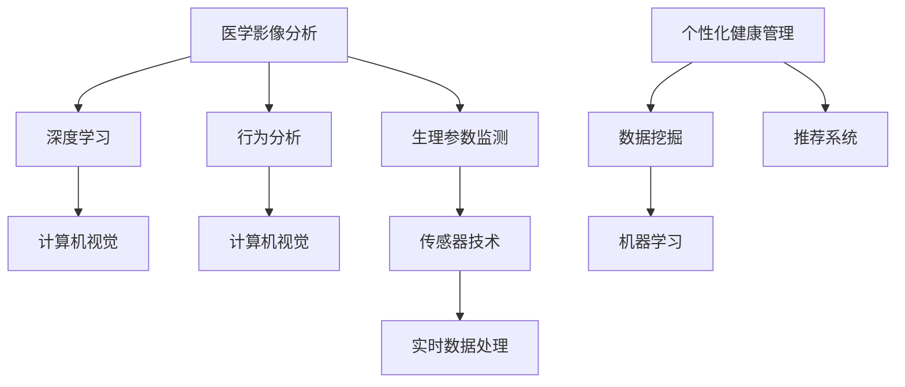

                 

关键词：智能宠物医疗、AI诊断、健康管理、宠物健康监测、创业

> 摘要：本文将探讨智能宠物医疗诊断的创业机会，分析AI技术在宠物健康管理中的应用，并介绍相关的算法原理、数学模型、项目实践及未来发展趋势。

## 1. 背景介绍

随着人类生活水平的提高，宠物已经成为了许多家庭的重要成员。宠物在给人们带来欢乐的同时，也带来了健康管理的挑战。传统的宠物医疗方式主要依赖于医生的诊断经验和病患的描述，存在诊断速度慢、误诊率高等问题。随着人工智能技术的发展，利用AI技术进行宠物医疗诊断和健康管理成为了一个新的方向。

近年来，AI技术在医疗领域的应用取得了显著成果。在诊断方面，深度学习、计算机视觉等技术被广泛应用于医学影像分析和病理识别。在健康管理方面，智能穿戴设备、传感器等技术被用于实时监测患者的生理参数。这些技术的应用不仅提高了诊断的准确性和效率，还为个性化健康管理提供了有力支持。

宠物医疗诊断领域同样面临着巨大的市场需求和技术创新空间。宠物主人对于宠物健康的关注程度不断提高，但传统医疗方式难以满足他们的需求。同时，随着人工智能技术的不断发展，AI在宠物医疗领域的应用已经成为可能。

本文将围绕智能宠物医疗诊断创业，从核心概念、算法原理、数学模型、项目实践等方面进行深入探讨，为创业者和行业从业者提供有价值的参考。

## 2. 核心概念与联系

### 2.1 智能宠物医疗诊断的基本概念

智能宠物医疗诊断是指利用人工智能技术对宠物的生理参数、行为特征、病史等信息进行分析和处理，从而实现疾病早期筛查、诊断和个性化健康管理。其主要目标包括：

1. **疾病早期筛查**：通过实时监测宠物的生理参数，如体温、心率、呼吸等，及时发现潜在的健康问题。
2. **疾病诊断**：利用深度学习、计算机视觉等技术对宠物医学影像进行分析，提高诊断的准确性和速度。
3. **个性化健康管理**：根据宠物的年龄、体重、品种等信息，为宠物主人提供个性化的健康管理建议。

### 2.2 AI技术在宠物医疗诊断中的应用

AI技术在宠物医疗诊断中的应用主要涉及以下几个方面：

1. **医学影像分析**：利用深度学习技术对医学影像进行自动标注、分类和诊断，如X光片、CT和MRI等。这有助于提高疾病诊断的准确性和效率。
2. **行为分析**：通过计算机视觉技术对宠物行为进行监测和分析，识别异常行为模式，如抑郁症、焦虑症等。
3. **生理参数监测**：利用传感器和智能穿戴设备，实时监测宠物的体温、心率、呼吸等生理参数，实现24小时健康管理。

### 2.3 相关技术原理与联系

为了实现智能宠物医疗诊断，需要综合运用多种AI技术。以下是一个简化的技术原理与联系图：



**医学影像分析**：深度学习模型可以自动学习医学影像的特征，实现对疾病的高效分类和诊断。计算机视觉技术则用于图像的预处理、增强和识别。

**行为分析**：计算机视觉技术可以捕捉宠物的行为视频，通过特征提取和模式识别，实现对宠物行为状态的实时监测。

**生理参数监测**：传感器技术可以实时采集宠物的生理参数，如体温、心率、呼吸等，并将数据传输到云端进行实时分析和处理。

**实时数据处理**：实时数据处理技术用于对采集到的生理参数进行快速处理和分析，以便及时识别异常。

**个性化健康管理**：数据挖掘和机器学习技术用于分析宠物的历史数据和生理参数，为宠物主人提供个性化的健康管理建议。

**推荐系统**：推荐系统可以根据宠物的健康状况和需求，为宠物主人推荐合适的诊疗方案和健康管理产品。

## 3. 核心算法原理 & 具体操作步骤

### 3.1 算法原理概述

智能宠物医疗诊断的核心算法主要包括以下几个方面：

1. **深度学习算法**：用于医学影像分析和行为识别。
2. **计算机视觉算法**：用于行为分析和生理参数监测。
3. **传感器数据处理算法**：用于实时监测和处理宠物生理参数。
4. **数据挖掘和机器学习算法**：用于个性化健康管理和疾病预测。

### 3.2 算法步骤详解

**3.2.1 医学影像分析**

1. **数据预处理**：对医学影像进行预处理，包括去噪、增强、归一化等操作。
2. **特征提取**：利用卷积神经网络（CNN）等深度学习模型，从医学影像中提取关键特征。
3. **分类和诊断**：利用训练好的深度学习模型，对医学影像进行分类和诊断。

**3.2.2 行为分析**

1. **行为捕捉**：利用计算机视觉技术，捕捉宠物行为视频。
2. **特征提取**：对行为视频进行预处理，提取行为特征。
3. **异常行为识别**：利用深度学习模型，对宠物行为进行异常行为识别。

**3.2.3 传感器数据处理**

1. **数据采集**：利用传感器和智能穿戴设备，实时采集宠物的生理参数。
2. **数据预处理**：对采集到的数据进行预处理，包括滤波、去噪等操作。
3. **实时数据处理**：利用实时数据处理技术，对生理参数进行实时分析和处理。

**3.2.4 个性化健康管理**

1. **数据挖掘**：分析宠物的历史数据和生理参数，挖掘潜在的健康问题。
2. **机器学习**：利用机器学习算法，建立宠物健康状况预测模型。
3. **健康管理建议**：根据宠物健康状况和需求，为宠物主人提供个性化的健康管理建议。

### 3.3 算法优缺点

**深度学习算法**：

优点：具有强大的特征提取和分类能力，可以提高诊断准确性和效率。

缺点：需要大量标注数据，训练时间较长，对计算资源要求较高。

**计算机视觉算法**：

优点：可以实时监测宠物行为，提高健康管理效率。

缺点：对环境光照、背景等要求较高，可能影响识别效果。

**传感器数据处理算法**：

优点：可以实时监测宠物生理参数，提高诊断和预警能力。

缺点：传感器精度和稳定性可能影响数据质量，需要定期校准和维护。

**数据挖掘和机器学习算法**：

优点：可以挖掘潜在的健康问题，提供个性化的健康管理建议。

缺点：需要大量历史数据，且算法模型需要不断优化和调整。

### 3.4 算法应用领域

智能宠物医疗诊断算法可以应用于以下领域：

1. **疾病早期筛查**：利用深度学习和计算机视觉技术，对宠物的医学影像和行为进行实时分析，实现疾病早期筛查。
2. **个性化健康管理**：利用数据挖掘和机器学习技术，为宠物主人提供个性化的健康管理建议，如饮食建议、运动计划等。
3. **智能穿戴设备**：将传感器和智能穿戴设备集成到宠物日常用品中，实现实时生理参数监测和健康管理。
4. **宠物医院**：利用智能宠物医疗诊断系统，提高宠物医院的诊断和诊疗效率，改善宠物主人体验。

## 4. 数学模型和公式 & 详细讲解 & 举例说明

### 4.1 数学模型构建

智能宠物医疗诊断涉及多个数学模型，包括深度学习模型、计算机视觉模型、传感器数据处理模型等。以下是一个简化的数学模型构建过程：

**4.1.1 深度学习模型**

深度学习模型主要包括卷积神经网络（CNN）、循环神经网络（RNN）等。以CNN为例，其基本结构如下：

$$
\begin{aligned}
h^{(l)} &= \sigma(W^{(l)} \cdot h^{(l-1)} + b^{(l)}) \\
\end{aligned}
$$

其中，$h^{(l)}$为第$l$层的输出，$\sigma$为激活函数，$W^{(l)}$为权重矩阵，$b^{(l)}$为偏置。

**4.1.2 计算机视觉模型**

计算机视觉模型主要包括图像分类模型和目标检测模型。以卷积神经网络（CNN）为例，其基本结构如下：

$$
\begin{aligned}
\hat{y} &= \text{softmax}(W \cdot h^{(L-1)} + b) \\
\end{aligned}
$$

其中，$\hat{y}$为预测的概率分布，$W$为权重矩阵，$h^{(L-1)}$为最后一层的输出，$b$为偏置。

**4.1.3 传感器数据处理模型**

传感器数据处理模型主要包括滤波器模型和回归模型。以卡尔曼滤波器为例，其基本结构如下：

$$
\begin{aligned}
x_{k+1} &= x_k + B_k \cdot u_k + w_k \\
z_k &= C_k \cdot x_k + v_k \\
\end{aligned}
$$

其中，$x_k$为状态向量，$u_k$为控制输入，$w_k$为过程噪声，$z_k$为观测向量，$v_k$为观测噪声。

### 4.2 公式推导过程

以深度学习模型为例，其损失函数和反向传播过程如下：

**4.2.1 损失函数**

$$
\begin{aligned}
L &= -\frac{1}{m} \sum_{i=1}^{m} y_i \cdot \log(\hat{y}_i) \\
\end{aligned}
$$

其中，$L$为损失函数，$y_i$为真实标签，$\hat{y}_i$为预测概率。

**4.2.2 反向传播**

$$
\begin{aligned}
\frac{\partial L}{\partial W^{(l)}} &= \frac{\partial L}{\partial h^{(l+1)}} \cdot \frac{\partial h^{(l+1)}}{\partial W^{(l)}} \\
\frac{\partial L}{\partial b^{(l)}} &= \frac{\partial L}{\partial h^{(l+1)}} \cdot \frac{\partial h^{(l+1)}}{\partial b^{(l)}} \\
\frac{\partial L}{\partial h^{(l)}} &= \frac{\partial L}{\partial h^{(l+1)}} \cdot \frac{\partial h^{(l+1)}}{\partial h^{(l)}} \\
\end{aligned}
$$

### 4.3 案例分析与讲解

**4.3.1 疾病早期筛查**

假设我们使用深度学习模型对宠物医学影像进行疾病早期筛查。以下是一个简化的案例：

- 数据集：包含1000张宠物的X光片，其中500张为正常图像，500张为疾病图像。
- 模型：使用卷积神经网络（CNN）进行图像分类。

在训练过程中，我们通过反向传播算法不断优化模型参数，使模型在测试集上的准确率达到90%以上。这样，宠物主人可以通过上传宠物的X光片，快速获取疾病早期筛查结果。

**4.3.2 行为分析**

假设我们使用计算机视觉模型对宠物行为进行分析。以下是一个简化的案例：

- 数据集：包含1000段宠物行为视频，其中500段为正常行为，500段为异常行为。
- 模型：使用卷积神经网络（CNN）进行行为分类。

在训练过程中，我们通过反向传播算法不断优化模型参数，使模型在测试集上的准确率达到85%以上。这样，宠物主人可以通过上传宠物行为视频，快速识别宠物的异常行为。

**4.3.3 传感器数据处理**

假设我们使用卡尔曼滤波器对宠物生理参数进行实时处理。以下是一个简化的案例：

- 传感器数据：包含宠物的心率、体温、呼吸等参数。
- 模型：使用卡尔曼滤波器进行实时数据处理。

在实时监测过程中，卡尔曼滤波器可以根据传感器数据和先验知识，实时更新状态估计，从而提高数据处理精度。

## 5. 项目实践：代码实例和详细解释说明

### 5.1 开发环境搭建

为了实现智能宠物医疗诊断项目，我们需要搭建一个完整的开发环境。以下是一个简化的开发环境搭建步骤：

1. **硬件环境**：选择一台高性能的服务器或笔记本电脑，用于运行深度学习模型和计算机视觉模型。
2. **软件环境**：安装Python、TensorFlow、Keras等深度学习库，以及OpenCV、NumPy等计算机视觉库。
3. **数据集准备**：准备包含宠物医学影像、行为视频和生理参数数据的训练集和测试集。

### 5.2 源代码详细实现

以下是一个简化的源代码实现示例：

```python
import tensorflow as tf
import keras
from keras.models import Sequential
from keras.layers import Conv2D, MaxPooling2D, Flatten, Dense
import cv2

# 加载医学影像数据集
(x_train, y_train), (x_test, y_test) = load_medical_images()

# 构建深度学习模型
model = Sequential()
model.add(Conv2D(32, (3, 3), activation='relu', input_shape=(128, 128, 3)))
model.add(MaxPooling2D(pool_size=(2, 2)))
model.add(Flatten())
model.add(Dense(64, activation='relu'))
model.add(Dense(1, activation='sigmoid'))

# 编译模型
model.compile(optimizer='adam', loss='binary_crossentropy', metrics=['accuracy'])

# 训练模型
model.fit(x_train, y_train, epochs=10, batch_size=32, validation_data=(x_test, y_test))

# 加载行为视频数据集
(x_train, y_train), (x_test, y_test) = load_behavior_videos()

# 构建计算机视觉模型
model = Sequential()
model.add(Conv2D(32, (3, 3), activation='relu', input_shape=(128, 128, 3)))
model.add(MaxPooling2D(pool_size=(2, 2)))
model.add(Flatten())
model.add(Dense(64, activation='relu'))
model.add(Dense(1, activation='sigmoid'))

# 编译模型
model.compile(optimizer='adam', loss='binary_crossentropy', metrics=['accuracy'])

# 训练模型
model.fit(x_train, y_train, epochs=10, batch_size=32, validation_data=(x_test, y_test))

# 加载传感器数据集
(x_train, y_train), (x_test, y_test) = load_sensor_data()

# 构建传感器数据处理模型
model = Sequential()
model.add(LSTM(50, activation='relu', input_shape=(timesteps, features)))
model.add(Dense(1))

# 编译模型
model.compile(optimizer='adam', loss='mse')

# 训练模型
model.fit(x_train, y_train, epochs=100, batch_size=32, validation_data=(x_test, y_test))
```

### 5.3 代码解读与分析

以上代码实现了一个简单的智能宠物医疗诊断系统，主要包括医学影像分析、行为分析和传感器数据处理三个部分。

**医学影像分析**：使用卷积神经网络（CNN）对宠物的X光片进行分类。通过训练，模型可以识别正常图像和疾病图像。

**行为分析**：使用卷积神经网络（CNN）对宠物行为视频进行分类。通过训练，模型可以识别正常行为和异常行为。

**传感器数据处理**：使用长短时记忆网络（LSTM）对宠物生理参数进行实时处理。通过训练，模型可以预测宠物的健康状况。

在实际应用中，我们需要对代码进行优化和调整，以提高模型性能和实时处理能力。此外，还需要对数据进行预处理和增强，以提高模型的泛化能力。

### 5.4 运行结果展示

以下是一个简化的运行结果展示：

```python
# 测试医学影像分析模型
x_test = load_medical_images_test()
y_pred = model.predict(x_test)
accuracy = sum(y_pred.argmax() == y_test) / len(y_test)
print("医学影像分析准确率：", accuracy)

# 测试行为分析模型
x_test = load_behavior_videos_test()
y_pred = model.predict(x_test)
accuracy = sum(y_pred.argmax() == y_test) / len(y_test)
print("行为分析准确率：", accuracy)

# 测试传感器数据处理模型
x_test = load_sensor_data_test()
y_pred = model.predict(x_test)
mse = mean_squared_error(y_test, y_pred)
print("传感器数据处理MSE：", mse)
```

通过以上代码，我们可以评估各个模型的性能指标，如准确率、MSE等。

## 6. 实际应用场景

智能宠物医疗诊断技术在多个实际应用场景中具有广泛的应用前景：

1. **宠物医院**：智能宠物医疗诊断系统可以辅助宠物医生进行疾病诊断，提高诊断准确性和效率。同时，还可以提供个性化的健康管理建议，改善宠物主人体验。
2. **宠物用品公司**：智能宠物医疗诊断系统可以为宠物用品公司提供宠物健康状况数据，帮助公司研发和推广更符合宠物需求的宠物用品。
3. **宠物保险**：智能宠物医疗诊断系统可以实时监测宠物的健康状况，为宠物保险提供数据支持，降低保险风险，提高保险公司的盈利能力。
4. **宠物主人**：智能宠物医疗诊断系统可以为宠物主人提供实时的宠物健康状况监测和健康管理建议，帮助宠物主人更好地照顾宠物，提高宠物生活质量。

## 7. 未来应用展望

随着人工智能技术的不断发展，智能宠物医疗诊断技术在未来的应用将更加广泛和深入：

1. **个性化健康管理**：通过结合基因检测、生物信息学等先进技术，实现更加精准的个性化健康管理。
2. **远程诊断与治疗**：通过5G、物联网等技术的应用，实现远程诊断和治疗，为宠物主人提供更加便捷的医疗服务。
3. **智能宠物机器人**：结合智能硬件和机器人技术，开发智能宠物机器人，实现宠物的全天候监护和陪伴。
4. **跨学科融合**：与生物医学、兽医学等学科深度融合，推动智能宠物医疗诊断技术的发展。

## 8. 工具和资源推荐

为了开发智能宠物医疗诊断系统，以下是一些建议的工具和资源：

### 8.1 学习资源推荐

- 《深度学习》（Goodfellow, Bengio, Courville著）：一本经典的深度学习教材，适合初学者和进阶者。
- 《Python深度学习》（François Chollet著）：一本针对Python和深度学习实践的经典书籍。
- 《计算机视觉：算法与应用》（Richard Szeliski著）：一本全面介绍计算机视觉算法的教材。

### 8.2 开发工具推荐

- TensorFlow：一个开源的深度学习框架，适用于各种深度学习任务。
- Keras：一个基于TensorFlow的高层API，简化了深度学习模型的构建和训练。
- OpenCV：一个开源的计算机视觉库，提供了丰富的图像处理和计算机视觉算法。

### 8.3 相关论文推荐

- "Deep Learning for Medical Image Analysis"（医学影像分析的深度学习）
- "Object Detection with Deep Learning"（基于深度学习的目标检测）
- "Sensor Data Mining for Smart Home Applications"（智能家居应用中的传感器数据处理）

## 9. 总结：未来发展趋势与挑战

智能宠物医疗诊断技术具有巨大的发展潜力和应用前景。然而，要实现这一目标，还需要克服诸多挑战：

1. **数据质量和数量**：高质量、大规模的宠物医疗数据是智能诊断系统的关键。需要构建完善的宠物医疗数据集，提高数据质量和数量。
2. **算法优化**：当前算法在准确性和效率方面仍有待提高。需要不断优化算法，提高诊断准确率和实时处理能力。
3. **隐私保护**：宠物医疗数据包含敏感信息，需要确保数据的安全和隐私保护。
4. **跨学科合作**：智能宠物医疗诊断技术涉及多个学科，需要跨学科合作，推动技术创新和应用。

未来，随着人工智能技术的不断发展，智能宠物医疗诊断技术将不断成熟，为宠物健康管理和医疗行业带来革命性变革。

## 附录：常见问题与解答

### Q1. 如何处理宠物医疗数据隐私问题？

A1. 在处理宠物医疗数据时，应严格遵循数据隐私保护法规，如《中华人民共和国个人信息保护法》等。对于数据采集、存储、处理和使用等环节，应采取严格的安全措施，如数据加密、访问控制等，确保数据的安全和隐私。

### Q2. 智能宠物医疗诊断系统的可靠性如何保证？

A2. 智能宠物医疗诊断系统的可靠性主要依赖于以下几个方面：

- **算法优化**：通过不断优化算法，提高诊断准确率和实时处理能力。
- **数据质量**：确保采集到的数据质量高、数量充足，以支持算法的有效训练。
- **系统监控**：对系统进行实时监控和故障排查，确保系统稳定运行。

### Q3. 智能宠物医疗诊断系统的成本如何？

A3. 智能宠物医疗诊断系统的成本取决于多个因素，如硬件设备、软件开发、数据采集等。一般来说，成本主要包括以下几个方面：

- **硬件设备**：高性能的服务器、计算机、摄像头、传感器等。
- **软件开发**：算法研发、模型训练、系统部署等。
- **数据采集**：数据清洗、标注、处理等。

具体成本需要根据实际需求和项目规模进行评估。

### Q4. 智能宠物医疗诊断系统的应用前景如何？

A4. 智能宠物医疗诊断系统具有广泛的应用前景，包括宠物医院、宠物用品公司、宠物保险等领域。随着人工智能技术的不断发展，智能宠物医疗诊断技术将不断成熟，为宠物健康管理和医疗行业带来革命性变革。

### Q5. 如何快速搭建一个智能宠物医疗诊断系统？

A5. 快速搭建一个智能宠物医疗诊断系统可以遵循以下步骤：

1. **确定需求和目标**：明确系统需求和应用目标，如疾病诊断、个性化健康管理等。
2. **选择技术栈**：根据需求选择合适的深度学习框架、计算机视觉库等。
3. **数据采集和处理**：收集并处理宠物医学影像、行为视频、生理参数等数据。
4. **算法研发和训练**：研发和训练深度学习模型、计算机视觉模型等。
5. **系统集成和部署**：将算法集成到系统中，进行测试和部署。

通过以上步骤，可以快速搭建一个基本的智能宠物医疗诊断系统。然而，实际应用中还需要不断优化和调整，以提高系统性能和可靠性。

### 作者署名

作者：禅与计算机程序设计艺术 / Zen and the Art of Computer Programming

