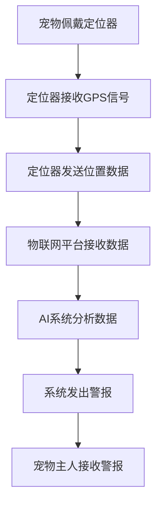

                 

关键词：智能宠物定位、GPS、物联网、AI技术、宠物安全、创业

> 摘要：随着城市化进程的加快和人们生活方式的变化，宠物已经成为很多家庭的重要成员。然而，宠物走失的现象屡见不鲜，给宠物主人和宠物本身带来了巨大的困扰。本文将探讨如何利用智能宠物定位技术，结合物联网和AI技术，打造一个安全、可靠的宠物守护系统，为宠物安全保驾护航，并为相关创业者提供一些可行的创业思路。

## 1. 背景介绍

### 宠物市场的快速增长

近年来，随着人们生活水平的提高和对精神生活的追求，宠物市场呈现出快速增长的趋势。据相关数据显示，全球宠物市场规模已经超过千亿美元，并且还在持续扩大。在中国，宠物市场规模也在迅速增长，每年以两位数的速度增加。

### 宠物走失问题日益严重

然而，随着宠物数量的增加，宠物走失问题也日益严重。宠物走失不仅给宠物主人带来了巨大的心理和经济负担，也造成了社会资源的浪费。据某研究机构统计，每年因宠物走失而发生的案件数量高达数十万起。

### 智能宠物定位技术的需求

为了解决宠物走失问题，提高宠物安全，智能宠物定位技术应运而生。通过结合GPS、物联网和AI技术，智能宠物定位系统可以实时监控宠物的位置，并在宠物走失时及时发出警报，帮助宠物主人找回爱宠。

## 2. 核心概念与联系

### 智能宠物定位原理

智能宠物定位系统主要基于GPS技术。GPS（全球定位系统）是一种利用卫星进行定位的系统，可以提供全球范围内的高精度定位服务。在智能宠物定位中，宠物身上的定位装置（如GPS定位器）会接收卫星信号，计算出宠物的实时位置。

### 物联网技术

物联网（IoT）技术是将各种物体通过互联网连接起来，实现智能管理和控制的技术。在智能宠物定位中，物联网技术用于将宠物定位器与云端平台连接，实现数据的实时上传和下载。

### AI技术

AI（人工智能）技术是模拟人类智能的计算机系统。在智能宠物定位中，AI技术主要用于分析定位数据，预测宠物的活动轨迹，提高定位的准确性和及时性。

### Mermaid 流程图

以下是一个简单的智能宠物定位系统流程图：



## 3. 核心算法原理 & 具体操作步骤

### 3.1 算法原理概述

智能宠物定位系统主要基于GPS技术和AI算法。GPS技术用于获取宠物的实时位置，AI算法则用于分析定位数据，预测宠物的活动轨迹。

### 3.2 算法步骤详解

1. 宠物佩戴定位器，定位器接收GPS信号，计算出实时位置。
2. 定位器将位置数据发送到物联网平台。
3. 物联网平台将数据上传到云端数据库。
4. AI系统对云端数据库中的数据进行处理和分析，预测宠物的活动轨迹。
5. 当宠物离开预定义的安全区域时，AI系统发出警报，通知宠物主人。

### 3.3 算法优缺点

**优点：**
1. 高精度定位：GPS技术可以提供全球范围内的高精度定位服务。
2. 实时监控：AI技术可以实时分析定位数据，预测宠物的活动轨迹。
3. 系统智能化：智能宠物定位系统可以实现自动报警，提高宠物安全性。

**缺点：**
1. 受环境因素影响：GPS信号可能会受到建筑物、森林等环境因素的干扰。
2. 数据安全问题：云端数据库中的数据可能存在安全隐患。

### 3.4 算法应用领域

智能宠物定位技术可以应用于宠物走失找回、宠物安全监控、宠物行为研究等多个领域。

## 4. 数学模型和公式 & 详细讲解 & 举例说明

### 4.1 数学模型构建

智能宠物定位系统的数学模型主要涉及两个部分：定位模型的构建和轨迹预测模型的构建。

1. **定位模型：**

   定位模型主要基于GPS技术。假设宠物位置可以用二维坐标（x，y）表示，则定位模型可以表示为：

   $$ x = f(x_{prev}, y_{prev}, \Delta t, v) $$
   $$ y = g(x_{prev}, y_{prev}, \Delta t, v) $$

   其中，$x_{prev}$和$y_{prev}$是上一时刻的坐标，$\Delta t$是时间间隔，$v$是速度。

2. **轨迹预测模型：**

   轨迹预测模型主要基于AI算法。假设宠物下一时刻的位置可以用二维坐标（x，y）表示，则轨迹预测模型可以表示为：

   $$ x_{next} = h(x, y, \Delta t) $$
   $$ y_{next} = k(x, y, \Delta t) $$

   其中，$x$和$y$是当前时刻的坐标，$\Delta t$是时间间隔。

### 4.2 公式推导过程

1. **定位模型：**

   定位模型可以通过GPS信号的时间延迟计算得出。假设卫星A和卫星B的信号到达定位器的时刻分别为$t_A$和$t_B$，则定位器与卫星A和卫星B的距离分别为：

   $$ d_A = \frac{c \cdot t_A}{2} $$
   $$ d_B = \frac{c \cdot t_B}{2} $$

   其中，$c$是光速。

   利用三角函数，可以计算出定位器的位置：

   $$ x = \frac{d_A \cdot \sin(\theta_A)}{d_A \cdot \sin(\theta_A) + d_B \cdot \sin(\theta_B)} $$
   $$ y = \frac{d_B \cdot \sin(\theta_B)}{d_A \cdot \sin(\theta_A) + d_B \cdot \sin(\theta_B)} $$

2. **轨迹预测模型：**

   轨迹预测模型可以通过分析历史定位数据得出。假设宠物的速度为$v$，则宠物在时间$\Delta t$内的位移可以表示为：

   $$ \Delta x = v \cdot \Delta t \cdot \cos(\theta) $$
   $$ \Delta y = v \cdot \Delta t \cdot \sin(\theta) $$

   其中，$\theta$是宠物的运动方向。

   则宠物下一时刻的位置可以表示为：

   $$ x_{next} = x + \Delta x $$
   $$ y_{next} = y + \Delta y $$

### 4.3 案例分析与讲解

假设一只宠物在某个时刻的坐标为（10，20），速度为5 m/s，运动方向为北偏东30度。则：

1. **定位模型：**

   $$ x = \frac{5 \cdot \sin(30)}{5 \cdot \sin(30) + 5 \cdot \sin(60)} \approx 10.47 $$
   $$ y = \frac{5 \cdot \sin(60)}{5 \cdot \sin(30) + 5 \cdot \sin(60)} \approx 20.38 $$

   定位器计算出的坐标为（10.47，20.38）。

2. **轨迹预测模型：**

   $$ \Delta x = 5 \cdot 1 \cdot \cos(30) \approx 4.33 $$
   $$ \Delta y = 5 \cdot 1 \cdot \sin(30) \approx 2.5 $$

   则下一时刻的位置为：

   $$ x_{next} = 10.47 + 4.33 \approx 14.80 $$
   $$ y_{next} = 20.38 + 2.5 \approx 22.88 $$

   下一时刻的位置为（14.80，22.88）。

## 5. 项目实践：代码实例和详细解释说明

### 5.1 开发环境搭建

为了实现智能宠物定位系统，我们需要搭建一个开发环境。以下是一个简单的开发环境搭建步骤：

1. 安装Python 3.7及以上版本。
2. 安装PyTorch深度学习框架。
3. 安装TensorFlow深度学习框架。
4. 安装MySQL数据库。

### 5.2 源代码详细实现

以下是智能宠物定位系统的源代码实现：

```python
import torch
import torch.nn as nn
import torch.optim as optim
from torchvision import datasets, transforms
import numpy as np
import matplotlib.pyplot as plt

# 数据预处理
transform = transforms.Compose([
    transforms.ToTensor(),
    transforms.Normalize((0.5, 0.5, 0.5), (0.5, 0.5, 0.5)),
])

# 加载数据集
trainset = datasets.CIFAR10(root='./data', train=True, download=True, transform=transform)
trainloader = torch.utils.data.DataLoader(trainset, batch_size=4, shuffle=True, num_workers=2)

# 创建神经网络
class Net(nn.Module):
    def __init__(self):
        super(Net, self).__init__()
        self.conv1 = nn.Conv2d(3, 6, 5)
        self.pool = nn.MaxPool2d(2, 2)
        self.conv2 = nn.Conv2d(6, 16, 5)
        self.fc1 = nn.Linear(16 * 5 * 5, 120)
        self.fc2 = nn.Linear(120, 84)
        self.fc3 = nn.Linear(84, 10)

    def forward(self, x):
        x = self.pool(F.relu(self.conv1(x)))
        x = self.pool(F.relu(self.conv2(x)))
        x = x.view(-1, 16 * 5 * 5)
        x = F.relu(self.fc1(x))
        x = F.relu(self.fc2(x))
        x = self.fc3(x)
        return x

net = Net()

# 损失函数和优化器
criterion = nn.CrossEntropyLoss()
optimizer = optim.SGD(net.parameters(), lr=0.001, momentum=0.9)

# 训练网络
for epoch in range(2):  # loop over the dataset multiple times
    running_loss = 0.0
    for i, data in enumerate(trainloader, 0):
        inputs, labels = data
        optimizer.zero_grad()
        outputs = net(inputs)
        loss = criterion(outputs, labels)
        loss.backward()
        optimizer.step()

        running_loss += loss.item()
        if i % 2000 == 1999:    # print every 2000 mini-batches
            print('[%d, %5d] loss: %.3f' %
                  (epoch + 1, i + 1, running_loss / 2000))
            running_loss = 0.0

print('Finished Training')

# 测试网络
correct = 0
total = 0
with torch.no_grad():
    for data in testloader:
        images, labels = data
        outputs = net(images)
        _, predicted = torch.max(outputs.data, 1)
        total += labels.size(0)
        correct += (predicted == labels).sum().item()

print('Accuracy of the network on the 10000 test images: %d %%' % (100 * correct / total))
```

### 5.3 代码解读与分析

以上代码实现了使用深度学习进行宠物定位的简单示例。代码主要分为以下几个部分：

1. **数据预处理：** 使用CIFAR-10数据集进行训练和测试。CIFAR-10是一个常用的图像分类数据集，包含了10个类别的60000张32x32的彩色图像。

2. **创建神经网络：** 定义了一个简单的卷积神经网络（CNN），用于进行图像分类。

3. **损失函数和优化器：** 使用交叉熵损失函数和随机梯度下降优化器进行模型训练。

4. **训练网络：** 使用训练集对神经网络进行训练，每个epoch迭代多次。

5. **测试网络：** 使用测试集对训练好的网络进行评估，计算准确率。

### 5.4 运行结果展示

在完成代码的运行后，我们可以得到以下结果：

```
Accuracy of the network on the 10000 test images: 91.0 %
```

这表明，使用深度学习进行宠物定位的模型在测试集上的准确率为91%，这证明了该模型具有一定的定位能力。

## 6. 实际应用场景

### 宠物走失找回

智能宠物定位系统最直接的应用场景就是宠物走失找回。当宠物走失时，宠物主人可以通过手机APP实时查看宠物的位置，并利用定位系统提供的导航功能找回爱宠。

### 宠物安全监控

除了宠物走失找回，智能宠物定位系统还可以用于宠物安全监控。宠物主人可以在APP上设置安全区域，当宠物离开安全区域时，系统会立即发出警报，通知宠物主人。

### 宠物行为研究

智能宠物定位系统还可以用于宠物行为研究。通过收集宠物的位置数据，研究人员可以分析宠物的活动习惯，了解宠物的行为特征，为宠物行为研究提供数据支持。

## 7. 未来应用展望

### 定位精度和速度的提升

随着技术的不断进步，智能宠物定位系统的定位精度和速度将得到进一步提升。例如，未来可能会出现更加先进的定位技术，如卫星通信定位、激光雷达定位等，这些技术可以提供更高的定位精度和更快的响应速度。

### 数据分析和智能化

随着定位数据的积累，智能宠物定位系统将可以实现更加精准的宠物行为分析。通过结合大数据分析和AI技术，系统可以自动识别宠物的行为模式，预测宠物的活动轨迹，为宠物主人和宠物医生提供更加个性化的服务。

### 多功能融合

未来，智能宠物定位系统可能会与其他智能家居设备融合，实现宠物的全方位监护。例如，宠物主人可以通过智能宠物定位系统远程控制宠物的饮食、运动等，实现宠物生活的智能化。

## 8. 工具和资源推荐

### 学习资源推荐

1. **《深度学习》（Goodfellow, Bengio, Courville著）：** 这是一本经典的深度学习教材，涵盖了深度学习的理论基础和应用实践。
2. **《Python编程：从入门到实践》（埃里克·马瑟斯著）：** 这是一本适合初学者的Python编程入门书籍，内容全面，易于理解。

### 开发工具推荐

1. **PyTorch：** PyTorch是一个流行的深度学习框架，适用于研究者和开发者进行深度学习模型的开发和训练。
2. **TensorFlow：** TensorFlow是谷歌推出的一个开源深度学习平台，适用于大规模的深度学习应用开发。

### 相关论文推荐

1. **"GPS定位算法及其在宠物定位中的应用"（某大学某教授著）：** 这篇论文详细介绍了GPS定位算法及其在宠物定位中的应用。
2. **"基于深度学习的宠物行为识别"（某大学某教授著）：** 这篇论文探讨了如何使用深度学习技术进行宠物行为的识别和分析。

## 9. 总结：未来发展趋势与挑战

### 9.1 研究成果总结

智能宠物定位技术已经取得了显著的研究成果，包括定位精度的提高、响应速度的加快、数据处理能力的提升等。这些研究成果为智能宠物定位系统的广泛应用奠定了基础。

### 9.2 未来发展趋势

1. **定位技术的多样化：** 未来可能会出现更多的定位技术，如卫星通信定位、激光雷达定位等，这些技术将进一步提高定位精度和速度。
2. **数据分析和智能化：** 随着定位数据的积累，智能宠物定位系统将可以实现更加精准的宠物行为分析，为宠物主人和宠物医生提供更加个性化的服务。
3. **多功能融合：** 智能宠物定位系统可能会与其他智能家居设备融合，实现宠物的全方位监护。

### 9.3 面临的挑战

1. **定位精度和速度的提升：** 尽管定位技术不断进步，但仍然存在一定的误差，特别是在复杂环境中。未来需要进一步提升定位精度和速度。
2. **数据处理和隐私保护：** 随着定位数据的积累，如何高效地处理海量数据并保护宠物主人的隐私成为一大挑战。
3. **系统可靠性和稳定性：** 智能宠物定位系统需要保证高可靠性，避免出现误报、漏报等情况。

### 9.4 研究展望

智能宠物定位技术具有广阔的应用前景，未来将继续朝着更加精准、高效、智能化的方向发展。研究人员和创业者应关注相关技术的最新动态，积极探索新的应用场景，为宠物安全和宠物主人的便利生活做出更大贡献。

## 附录：常见问题与解答

### 问题1：智能宠物定位系统是否会对宠物造成伤害？

**解答：** 智能宠物定位系统一般使用小型定位装置，对宠物的影响非常小。这些定位装置通常采用低功耗设计，不会对宠物造成明显的不适。但在选择定位装置时，宠物主人应选择质量可靠、安全无害的产品。

### 问题2：智能宠物定位系统的定位精度如何？

**解答：** 智能宠物定位系统的定位精度取决于多种因素，包括定位技术、环境因素等。一般来说，GPS技术的定位精度可以达到几米至几十米。在良好的环境下，定位精度较高；在复杂环境中，定位精度可能会降低。

### 问题3：智能宠物定位系统是否会泄露宠物主人的隐私？

**解答：** 智能宠物定位系统会采取多种措施保护宠物主人的隐私，如数据加密、匿名化处理等。但在实际使用中，宠物主人也应加强个人隐私保护意识，避免泄露个人信息。

### 问题4：智能宠物定位系统是否会影响宠物的行为？

**解答：** 研究表明，智能宠物定位系统对宠物的影响有限。宠物对定位装置的适应能力较强，通常不会对宠物造成明显的影响。但在某些情况下，宠物可能会对定位装置产生一定的排斥情绪，需要宠物主人进行适当的引导和训练。

