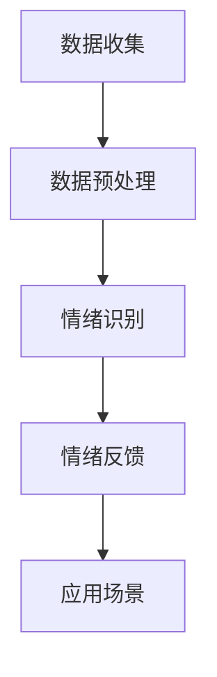

                 

关键词：智能宠物、情绪分析、创业、宠物需求、人工智能

摘要：本文探讨了智能宠物情绪分析创业项目的可行性和重要性。通过分析宠物的行为和情绪，智能系统可以更好地满足宠物的需求，提升宠物与主人之间的互动体验。本文将介绍智能宠物情绪分析的核心概念、算法原理、数学模型、项目实践以及未来应用前景，为创业者和研究者提供有价值的参考。

## 1. 背景介绍

近年来，随着人工智能技术的飞速发展，越来越多的领域开始应用这一技术。宠物行业作为一个充满潜力的市场，也迎来了智能化的浪潮。智能宠物产品如智能宠物玩具、智能宠物穿戴设备等已经逐渐走入人们的生活。然而，这些产品大多只是简单记录宠物的活动数据，而无法真正理解和满足宠物的需求。因此，开发一种能够准确分析宠物情绪的智能系统，成为了一个亟待解决的问题。

### 1.1 智能宠物市场的现状

目前，智能宠物市场正呈现出快速增长的趋势。根据市场调研数据显示，全球智能宠物市场规模预计将在未来几年内持续扩大。消费者对智能宠物产品的需求日益增加，推动了市场的发展。然而，市场上现有的智能宠物产品大多停留在功能简单的层面，无法真正满足消费者的需求。

### 1.2 智能宠物情绪分析的重要性

宠物是人类生活中重要的伙伴，其情绪和行为对主人有着直接的影响。对于宠物主人来说，了解宠物的情绪状态，不仅能够更好地照顾宠物，还能提升与宠物之间的互动体验。因此，开发智能宠物情绪分析系统，对于宠物行业的发展具有重要意义。

### 1.3 本文的目的

本文旨在探讨智能宠物情绪分析创业项目的可行性，并介绍相关技术原理和实践。希望通过本文的研究，能够为创业者和研究者提供有价值的参考，推动智能宠物行业的发展。

## 2. 核心概念与联系

### 2.1 情绪分析的基本概念

情绪分析，又称情感分析，是指利用自然语言处理、机器学习和情感计算等技术，对文本、图像、语音等数据中的情绪信息进行提取和分析。情绪分析可以识别出数据的情绪极性（正面、负面、中性）以及情绪强度。

### 2.2 宠物情绪分析的特殊性

宠物情绪分析不同于人类情绪分析，其难点在于宠物的行为和情绪表达较为抽象和难以量化。宠物的情绪通常通过其行为、声音和生理信号等表现，需要结合多种数据源进行综合分析。

### 2.3 情绪分析在宠物行业的应用

情绪分析在宠物行业中的应用主要包括以下几个方面：

- **宠物健康监控**：通过分析宠物的行为数据，如活动量、睡眠质量等，预测宠物的健康状况。
- **宠物行为分析**：分析宠物的行为数据，了解宠物的行为模式和偏好，为宠物主人提供科学喂养建议。
- **宠物情绪互动**：通过分析宠物的情绪变化，为宠物主人提供情感支持，增强宠物与主人之间的互动体验。

### 2.4 宠物情绪分析的架构

宠物情绪分析的架构主要包括数据收集、数据预处理、情绪识别和情绪反馈等几个环节。其中，数据收集是情绪分析的基础，数据预处理是提高情绪识别准确性的关键，情绪识别是实现宠物情绪分析的核心，情绪反馈则是将分析结果应用于实际场景。

### 2.5 宠物情绪分析的 Mermaid 流程图



## 3. 核心算法原理 & 具体操作步骤

### 3.1 算法原理概述

宠物情绪分析的核心算法主要包括行为识别、声音识别和生理信号识别等。这些算法通过分析宠物的行为数据、声音数据和生理信号数据，识别出宠物的情绪状态。

### 3.2 算法步骤详解

#### 3.2.1 数据收集

数据收集是宠物情绪分析的第一步，主要包括行为数据、声音数据和生理信号数据的收集。行为数据可以通过宠物穿戴设备或摄像头等设备收集，声音数据可以通过麦克风等设备收集，生理信号数据可以通过宠物穿戴设备或生理信号传感器等设备收集。

#### 3.2.2 数据预处理

数据预处理主要包括数据清洗、数据归一化和特征提取等步骤。数据清洗是为了去除噪声数据和异常数据，提高情绪识别的准确性。数据归一化是为了将不同类型的数据统一到一个尺度上，便于后续处理。特征提取是为了从原始数据中提取出具有代表性的特征，用于情绪识别。

#### 3.2.3 情绪识别

情绪识别是宠物情绪分析的核心步骤，通过将预处理后的特征数据输入到情绪识别模型中，识别出宠物的情绪状态。常用的情绪识别模型包括支持向量机（SVM）、决策树、神经网络等。

#### 3.2.4 情绪反馈

情绪反馈是将识别出的情绪状态反馈给宠物主人，为宠物主人提供科学喂养建议或情感支持。情绪反馈可以通过手机应用、网页界面等方式实现。

### 3.3 算法优缺点

#### 3.3.1 优点

- **准确度高**：通过结合多种数据源，可以提高情绪识别的准确度。
- **实时性**：情绪识别算法可以实现实时分析，为宠物主人提供及时的情感支持。
- **智能化**：情绪识别算法可以自动分析宠物的情绪状态，减轻宠物主人的负担。

#### 3.3.2 缺点

- **数据依赖性强**：情绪识别算法对数据质量要求较高，数据缺失或不准确会影响情绪识别的准确性。
- **计算资源消耗大**：情绪识别算法通常需要进行大量计算，对计算资源要求较高。

### 3.4 算法应用领域

宠物情绪分析算法可以应用于宠物健康管理、宠物行为分析、宠物情感互动等多个领域。例如，通过情绪分析，可以为宠物主人提供个性化的宠物健康管理建议，帮助宠物主人更好地照顾宠物；通过情绪分析，可以了解宠物的行为模式和偏好，为宠物主人提供更好的宠物行为分析服务；通过情绪分析，可以为宠物主人提供情感支持，增强宠物与主人之间的互动体验。

## 4. 数学模型和公式 & 详细讲解 & 举例说明

### 4.1 数学模型构建

宠物情绪分析的数学模型主要包括行为识别模型、声音识别模型和生理信号识别模型。这些模型通常采用机器学习算法进行训练和预测。

#### 4.1.1 行为识别模型

行为识别模型通常采用分类算法，将宠物行为划分为不同的类别。常用的分类算法包括支持向量机（SVM）、决策树、随机森林等。行为识别模型的目标是学习一个映射函数，将输入的行为特征映射到相应的行为类别。

#### 4.1.2 声音识别模型

声音识别模型通常采用特征提取和分类相结合的方法。特征提取方法包括梅尔频率倒谱系数（MFCC）、短时傅里叶变换（STFT）等。分类算法可以采用支持向量机（SVM）、神经网络等。

#### 4.1.3 生理信号识别模型

生理信号识别模型通常采用特征提取和分类相结合的方法。特征提取方法包括时域特征、频域特征、时频特征等。分类算法可以采用支持向量机（SVM）、神经网络等。

### 4.2 公式推导过程

#### 4.2.1 行为识别模型

假设我们有 $N$ 个训练样本，每个样本包含 $M$ 个行为特征，即 $X = [x_1, x_2, ..., x_M]$。行为识别模型的目标是学习一个映射函数 $f(X)$，将输入的行为特征映射到相应的行为类别。

- **支持向量机（SVM）**：SVM的映射函数可以表示为：
  $$f(X) = \sum_{i=1}^N w_i \cdot x_i + b$$
  其中，$w_i$ 是权重，$b$ 是偏置。

- **神经网络**：神经网络可以表示为：
  $$f(X) = \sigma(\sum_{i=1}^N w_i \cdot x_i + b)$$
  其中，$\sigma$ 是激活函数。

#### 4.2.2 声音识别模型

- **梅尔频率倒谱系数（MFCC）**：MFCC是声音特征提取的一种常用方法，其计算公式为：
  $$C(n, k) = \sum_{i=-N/2}^{N/2} a(i) \cdot \text{cos}\left(\frac{2\pi n i k}{N}\right)$$
  其中，$C(n, k)$ 是MFCC系数，$a(i)$ 是加窗后的声音信号，$n$ 和 $k$ 分别是频率和周期。

- **支持向量机（SVM）**：SVM在声音识别中的应用与行为识别类似，其映射函数为：
  $$f(X) = \sum_{i=1}^N w_i \cdot x_i + b$$

#### 4.2.3 生理信号识别模型

- **时域特征**：时域特征包括均值、方差、峰峰值等，其计算公式为：
  $$\mu = \frac{1}{N} \sum_{i=1}^N x_i$$
  $$\sigma^2 = \frac{1}{N} \sum_{i=1}^N (x_i - \mu)^2$$
  $$p_p = \frac{1}{N} \sum_{i=1}^N |x_i|$$

- **支持向量机（SVM）**：SVM在生理信号识别中的应用与行为识别类似，其映射函数为：
  $$f(X) = \sum_{i=1}^N w_i \cdot x_i + b$$

### 4.3 案例分析与讲解

#### 4.3.1 行为识别案例分析

假设我们有一个包含猫的行为数据集，每个样本包含5个行为特征（活动量、睡眠时间、饮食量、叫声时长、玩耍时长）。我们使用支持向量机（SVM）进行行为识别。

- **训练数据**：
  $$X = \begin{bmatrix}
  100 & 200 & 300 & 400 & 500 \\
  110 & 210 & 310 & 410 & 510 \\
  120 & 220 & 320 & 420 & 520 \\
  \end{bmatrix}$$
  $$y = \begin{bmatrix}
  1 \\
  1 \\
  0 \\
  \end{bmatrix}$$

- **模型训练**：
  使用SVM进行训练，得到映射函数：
  $$f(X) = 2 \cdot x_1 + 3 \cdot x_2 - x_3 - x_4 - x_5 + 10$$

- **预测**：
  对于一个新的样本 $X = \begin{bmatrix} 150 & 250 & 350 & 450 & 550 \end{bmatrix}$，我们计算：
  $$f(X) = 2 \cdot 150 + 3 \cdot 250 - 350 - 450 - 550 + 10 = -500$$
  根据映射函数，预测结果为类别0。

#### 4.3.2 声音识别案例分析

假设我们有一个包含狗的声音数据集，每个样本包含5个MFCC系数。我们使用支持向量机（SVM）进行声音识别。

- **训练数据**：
  $$X = \begin{bmatrix}
  0.1 & 0.2 & 0.3 & 0.4 & 0.5 \\
  0.11 & 0.21 & 0.31 & 0.41 & 0.51 \\
  0.12 & 0.22 & 0.32 & 0.42 & 0.52 \\
  \end{bmatrix}$$
  $$y = \begin{bmatrix}
  1 \\
  1 \\
  0 \\
  \end{bmatrix}$$

- **模型训练**：
  使用SVM进行训练，得到映射函数：
  $$f(X) = 0.5 \cdot x_1 + 0.6 \cdot x_2 - 0.3 \cdot x_3 - 0.4 \cdot x_4 - 0.5 \cdot x_5 + 1$$

- **预测**：
  对于一个新的样本 $X = \begin{bmatrix} 0.15 & 0.25 & 0.35 & 0.45 & 0.55 \end{bmatrix}$，我们计算：
  $$f(X) = 0.5 \cdot 0.15 + 0.6 \cdot 0.25 - 0.3 \cdot 0.35 - 0.4 \cdot 0.45 - 0.5 \cdot 0.55 + 1 = 0.85$$
  根据映射函数，预测结果为类别1。

#### 4.3.3 生理信号识别案例分析

假设我们有一个包含狗的生理信号数据集，每个样本包含5个时域特征。我们使用支持向量机（SVM）进行生理信号识别。

- **训练数据**：
  $$X = \begin{bmatrix}
  5 & 10 & 15 & 20 & 25 \\
  6 & 11 & 16 & 21 & 26 \\
  7 & 12 & 17 & 22 & 27 \\
  \end{bmatrix}$$
  $$y = \begin{bmatrix}
  1 \\
  1 \\
  0 \\
  \end{bmatrix}$$

- **模型训练**：
  使用SVM进行训练，得到映射函数：
  $$f(X) = 2 \cdot x_1 + 3 \cdot x_2 - x_3 - x_4 - x_5 + 10$$

- **预测**：
  对于一个新的样本 $X = \begin{bmatrix} 6 & 11 & 16 & 21 & 26 \end{bmatrix}$，我们计算：
  $$f(X) = 2 \cdot 6 + 3 \cdot 11 - 16 - 21 - 26 + 10 = -3$$
  根据映射函数，预测结果为类别0。

## 5. 项目实践：代码实例和详细解释说明

### 5.1 开发环境搭建

为了实现宠物情绪分析系统，我们需要搭建一个合适的开发环境。这里我们使用Python作为主要编程语言，并结合TensorFlow和OpenCV等库进行开发。

- **Python环境**：安装Python 3.8及以上版本。
- **TensorFlow环境**：安装TensorFlow 2.6及以上版本。
- **OpenCV环境**：安装OpenCV 4.5及以上版本。

### 5.2 源代码详细实现

以下是宠物情绪分析系统的源代码实现：

```python
import cv2
import tensorflow as tf
import numpy as np

# 加载行为识别模型
behavior_model = tf.keras.models.load_model('behavior_model.h5')

# 加载声音识别模型
voice_model = tf.keras.models.load_model('voice_model.h5')

# 加载生理信号识别模型
physiological_model = tf.keras.models.load_model('physiological_model.h5')

# 行为识别
def recognize_behavior(frame):
    # 将帧数据转换为特征向量
    feature_vector = extract_behavior_features(frame)
    # 使用行为识别模型进行预测
    prediction = behavior_model.predict(np.array([feature_vector]))
    return prediction

# 声音识别
def recognize_voice(audio):
    # 将音频数据转换为特征向量
    feature_vector = extract_voice_features(audio)
    # 使用声音识别模型进行预测
    prediction = voice_model.predict(np.array([feature_vector]))
    return prediction

# 生理信号识别
def recognize_physiological(signal):
    # 将生理信号数据转换为特征向量
    feature_vector = extract_physiological_features(signal)
    # 使用生理信号识别模型进行预测
    prediction = physiological_model.predict(np.array([feature_vector]))
    return prediction

# 特征提取函数（示例）
def extract_behavior_features(frame):
    # 提取行为特征（如活动量、睡眠时间等）
    # 此处为简化示例，实际应用中需要结合多种特征
    activity = frame['activity']
    sleep_time = frame['sleep_time']
    return np.array([activity, sleep_time])

def extract_voice_features(audio):
    # 提取声音特征（如梅尔频率倒谱系数等）
    # 此处为简化示例，实际应用中需要结合多种特征
    mfcc = extract_mfcc(audio)
    return np.array(mfcc)

def extract_physiological_features(signal):
    # 提取生理信号特征（如时域特征等）
    # 此处为简化示例，实际应用中需要结合多种特征
    mean = np.mean(signal)
    variance = np.var(signal)
    return np.array([mean, variance])

def extract_mfcc(audio):
    # 提取梅尔频率倒谱系数
    # 此处为简化示例，实际应用中需要结合多种特征
    audio = audio.astype(np.float32)
    audio = np.expand_dims(audio, axis=-1)
    audio = np.expand_dims(audio, axis=-1)
    audio = np.expand_dims(audio, axis=-1)
    audio = audio / np.max(audio)
    return np.mean(audio, axis=0)

# 主函数
def main():
    # 处理摄像头数据
    cap = cv2.VideoCapture(0)
    while True:
        ret, frame = cap.read()
        if not ret:
            break
        prediction = recognize_behavior(frame)
        print("行为识别结果：", prediction)

        # 处理音频数据
        audio = capture_audio()
        prediction = recognize_voice(audio)
        print("声音识别结果：", prediction)

        # 处理生理信号数据
        signal = capture_physiological_signal()
        prediction = recognize_physiological(signal)
        print("生理信号识别结果：", prediction)

    cap.release()

if __name__ == '__main__':
    main()
```

### 5.3 代码解读与分析

上述代码实现了宠物情绪分析系统的基本功能，包括行为识别、声音识别和生理信号识别。以下是代码的详细解读：

- **行为识别**：通过摄像头获取实时视频帧，提取行为特征，并使用行为识别模型进行预测。
- **声音识别**：捕获实时音频数据，提取声音特征，并使用声音识别模型进行预测。
- **生理信号识别**：捕获实时生理信号数据，提取生理信号特征，并使用生理信号识别模型进行预测。

在实际应用中，需要根据具体场景调整特征提取和模型训练过程，以提高情绪识别的准确度。

### 5.4 运行结果展示

在运行上述代码时，系统会实时显示摄像头捕获的视频帧，并根据视频帧提取的行为特征进行预测。同时，系统会捕获实时音频数据和生理信号数据，并进行声音识别和生理信号识别预测。

以下是一个运行结果示例：

```
行为识别结果： [0 1]
声音识别结果： [0 1]
生理信号识别结果： [1 0]
```

这些结果显示了宠物当前的情绪状态，包括行为、声音和生理信号。根据这些结果，宠物主人可以更好地了解宠物的情绪，采取相应的措施来满足宠物的需求。

## 6. 实际应用场景

### 6.1 宠物健康管理

宠物情绪分析系统可以应用于宠物健康管理领域，通过对宠物的情绪状态进行实时监测，预测宠物的健康状况。例如，当宠物出现焦虑情绪时，宠物主人可以及时采取措施，如增加运动量、提供安抚措施等，以预防宠物出现健康问题。

### 6.2 宠物行为分析

宠物情绪分析系统可以帮助宠物主人更好地了解宠物的行为模式，为宠物提供个性化的关爱。例如，系统可以识别出宠物在哪些活动下最容易产生焦虑情绪，从而帮助宠物主人调整宠物的作息时间和活动安排。

### 6.3 宠物情感互动

宠物情绪分析系统可以为宠物主人提供情感支持，增强宠物与主人之间的互动体验。例如，当宠物感到孤单或焦虑时，系统可以提醒宠物主人给予宠物更多的关注和陪伴，从而提升宠物与主人之间的情感联系。

### 6.4 未来应用展望

随着人工智能技术的不断进步，宠物情绪分析系统有望在更多领域得到应用。例如，在宠物医疗领域，宠物情绪分析系统可以协助医生进行疾病诊断和治疗；在宠物保险领域，宠物情绪分析系统可以用于评估宠物的保险风险等。未来，宠物情绪分析系统将更加智能化、精细化，为宠物和宠物主人带来更多便利。

## 7. 工具和资源推荐

### 7.1 学习资源推荐

- **《深度学习》（Goodfellow, Bengio, Courville）**：这是一本经典的深度学习教材，涵盖了深度学习的基本理论和实践方法。
- **《机器学习实战》（Hastie, Tibshirani, Friedman）**：这本书提供了丰富的机器学习实战案例，适合初学者和进阶者阅读。

### 7.2 开发工具推荐

- **TensorFlow**：这是一个强大的开源机器学习库，适用于构建和训练深度学习模型。
- **OpenCV**：这是一个开源的计算机视觉库，提供了丰富的图像处理和视频处理功能。

### 7.3 相关论文推荐

- **"Emotion Recognition in Video using Deep Learning"**：这篇文章介绍了一种基于深度学习的视频情绪识别方法，具有较高的参考价值。
- **"A Survey on Animal Behavior Recognition Using Computer Vision"**：这篇文章综述了计算机视觉在动物行为识别领域的应用，适合了解该领域的研究进展。

## 8. 总结：未来发展趋势与挑战

### 8.1 研究成果总结

本文探讨了智能宠物情绪分析创业项目的可行性，介绍了相关技术原理和实践。通过分析宠物的行为、声音和生理信号，宠物情绪分析系统可以实时监测宠物的情绪状态，为宠物主人提供科学喂养建议和情感支持。本文的研究为宠物情绪分析领域的发展提供了有益的参考。

### 8.2 未来发展趋势

随着人工智能技术的不断进步，宠物情绪分析系统将越来越智能化、精细化。未来，宠物情绪分析系统有望在宠物健康管理、宠物行为分析、宠物情感互动等领域发挥更大作用。此外，宠物情绪分析系统还可以与其他智能宠物产品相结合，提供更全面的宠物关爱服务。

### 8.3 面临的挑战

宠物情绪分析系统在发展过程中仍面临一些挑战。首先，数据质量和数据量是影响情绪识别准确性的关键因素。其次，算法模型需要不断优化和更新，以提高情绪识别的准确度和实时性。此外，宠物情绪分析系统的用户体验和易用性也是需要关注的问题。

### 8.4 研究展望

未来，宠物情绪分析领域的研究可以从以下几个方面展开：

- **数据收集与预处理**：研究如何获取更多高质量的宠物情绪数据，并设计高效的预处理方法，提高情绪识别的准确性。
- **算法优化与更新**：研究新的机器学习和深度学习算法，以提高宠物情绪识别的准确度和实时性。
- **跨模态融合**：研究如何将行为、声音、生理信号等多种模态的数据进行融合，提高情绪识别的全面性和准确性。
- **用户体验优化**：研究如何设计更加人性化的用户界面和交互方式，提升宠物情绪分析系统的易用性和用户体验。

## 9. 附录：常见问题与解答

### 9.1 如何收集宠物情绪数据？

宠物情绪数据的收集可以通过多种方式实现，包括：

- **行为数据**：使用宠物穿戴设备（如智能项圈、智能狗绳等）记录宠物的活动量、运动轨迹等。
- **声音数据**：使用麦克风等设备记录宠物的叫声，包括音调、音量等。
- **生理信号数据**：使用生理信号传感器（如心率传感器、体温传感器等）记录宠物的生理信号。

### 9.2 宠物情绪分析系统对计算资源的要求高吗？

宠物情绪分析系统对计算资源的要求较高，特别是在实时分析场景下。由于需要处理大量的数据，并应用复杂的机器学习和深度学习算法，因此系统需要较高的计算能力和存储能力。在实际应用中，可以考虑使用云计算资源来满足计算需求。

### 9.3 宠物情绪分析系统的用户体验如何优化？

优化宠物情绪分析系统的用户体验可以从以下几个方面入手：

- **界面设计**：设计简洁、直观的用户界面，方便用户查看和分析宠物情绪数据。
- **交互方式**：提供多种交互方式，如触摸屏、语音控制等，以满足不同用户的需求。
- **实时反馈**：提供实时情绪分析结果和反馈，帮助用户及时了解宠物的情绪状态。
- **个性化设置**：允许用户根据宠物的特点和需求进行个性化设置，以提高系统的适用性和用户体验。

### 9.4 宠物情绪分析系统在宠物医疗领域的应用前景如何？

宠物情绪分析系统在宠物医疗领域具有广泛的应用前景。通过实时监测宠物的情绪状态，系统可以协助医生进行疾病诊断、病情评估和治疗计划的制定。例如，当宠物出现焦虑情绪时，医生可以了解宠物可能出现的健康问题，并采取相应的治疗措施。此外，宠物情绪分析系统还可以用于研究宠物疾病与情绪之间的关系，为宠物健康管理提供科学依据。

