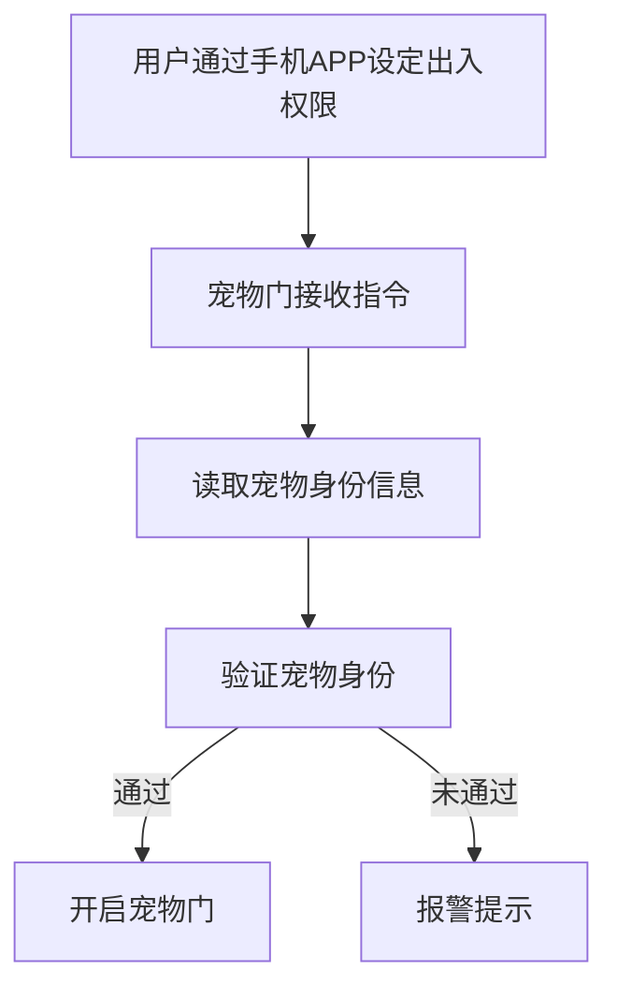

                 

关键词：智能宠物门，自动化管理，物联网，智能家居，宠物安全

> 摘要：随着智能家居的不断发展，智能宠物门作为一种新兴的宠物管理设备，正逐渐走入人们的视野。本文将探讨智能宠物门的技术原理、实现方法以及未来的发展方向，旨在为想要涉足这一领域的创业者提供有益的参考。

## 1. 背景介绍

近年来，随着人们生活水平的提高和宠物数量的激增，人们对宠物生活的管理需求也越来越高。智能宠物门作为一种创新的宠物管理设备，通过物联网技术实现了宠物出入的自动化管理，极大地提高了宠物主人的生活便利性和宠物的生活质量。

### 智能宠物门的概念

智能宠物门是指通过物联网技术和自动化控制系统，实现宠物在家中自由出入的智能设备。它通常由门体、传感器、控制器和移动设备组成，通过移动设备上的应用程序实现对宠物出入的远程控制和管理。

### 智能宠物门的现状

智能宠物门作为一种新兴的智能家居产品，已经逐渐受到市场的关注。国外市场如美国、日本等国家已经推出了一系列智能宠物门产品，并且市场反响热烈。国内市场也涌现出了一批优秀的智能宠物门品牌，如「小佩」、「宠盾」等。

## 2. 核心概念与联系

在讨论智能宠物门的技术原理之前，我们需要了解几个核心概念：物联网、智能家居、宠物安全。

### 物联网（IoT）

物联网是指通过各种信息传感设备将各种实体物体连接到互联网上，实现物体与物体之间的信息交换和通信。在智能宠物门中，物联网技术主要用于实现宠物与主人之间的实时通信和数据交换。

### 智能家居

智能家居是指通过物联网技术将家居设备连接起来，实现家庭设备的自动化控制和智能化管理。智能宠物门作为智能家居的一部分，通过与其他智能家居设备（如智能门锁、智能摄像头等）的互联互通，实现了宠物生活的全方位管理。

### 宠物安全

宠物安全是智能宠物门设计的重要考虑因素。通过传感器技术和自动化控制，智能宠物门能够实时监测宠物的出入状态，防止宠物走失或遭受意外伤害。

### Mermaid 流程图

以下是一个简化的智能宠物门的工作流程图：



## 3. 核心算法原理 & 具体操作步骤

### 3.1 算法原理概述

智能宠物门的核心算法主要包括身份验证和权限管理。身份验证主要通过读取宠物的身份信息（如RFID、生物特征等）并与其预设的身份信息进行比对，以确认宠物的身份。权限管理则通过用户在手机APP上设定的权限信息，控制宠物的出入。

### 3.2 算法步骤详解

1. **用户设置权限**：用户通过手机APP设定宠物的出入权限，包括允许进入的时间段、允许进入的地点等。

2. **宠物门接收指令**：智能宠物门通过无线通信模块接收用户在APP上发送的指令。

3. **读取宠物身份信息**：宠物门通过传感器（如RFID读卡器、摄像头等）读取宠物的身份信息。

4. **验证宠物身份**：宠物门将读取到的身份信息与预设的身份信息进行比对，以确认宠物的身份。

5. **权限判断**：系统根据用户在APP上设定的权限信息，判断宠物是否具备进入的权限。

6. **执行操作**：若宠物具备进入权限，宠物门将自动开启；若宠物不具备进入权限，宠物门将保持关闭状态，并触发报警提示。

### 3.3 算法优缺点

**优点**：

- **提高安全性**：通过身份验证和权限管理，有效防止非宠物身份的非法入侵。
- **提高便利性**：用户可以通过手机APP远程控制宠物门的开关，提高生活便利性。
- **降低宠物走失风险**：实时监测宠物的出入状态，有效防止宠物走失。

**缺点**：

- **设备成本较高**：智能宠物门涉及多种传感器和通信模块，设备成本较高。
- **维护复杂性**：由于涉及多种技术和设备，智能宠物门的维护相对复杂。

### 3.4 算法应用领域

智能宠物门的应用领域主要包括：

- **家庭宠物管理**：用于宠物狗、宠物猫等宠物的日常出入管理。
- **宠物店**：用于宠物店内的宠物出入管理，提高宠物店的管理效率。
- **宠物医院**：用于宠物医院内的宠物出入管理，确保宠物安全。

## 4. 数学模型和公式 & 详细讲解 & 举例说明

### 4.1 数学模型构建

智能宠物门的核心算法主要涉及两个部分：身份验证和权限管理。我们可以使用逻辑回归模型和决策树模型来构建这两个部分。

#### 身份验证模型

身份验证模型的目标是判断宠物是否为合法用户。我们可以使用逻辑回归模型来构建这个模型。逻辑回归模型的核心公式如下：

$$
P(Y=1|X) = \frac{1}{1 + e^{-(\beta_0 + \beta_1X_1 + \beta_2X_2 + ... + \beta_nX_n})}
$$

其中，$X$ 是宠物的身份信息，$Y$ 是是否为合法用户的标签，$\beta_0, \beta_1, \beta_2, ..., \beta_n$ 是模型的参数。

#### 权限管理模型

权限管理模型的目标是判断宠物是否具备进入权限。我们可以使用决策树模型来构建这个模型。决策树模型的核心公式如下：

$$
f(X) = \sum_{i=1}^{n} w_i \cdot I(X \in R_i)
$$

其中，$X$ 是宠物的身份信息，$R_1, R_2, ..., R_n$ 是权限管理的规则集合，$w_1, w_2, ..., w_n$ 是规则的权重。

### 4.2 公式推导过程

#### 身份验证模型

逻辑回归模型的推导基于最大似然估计。我们假设宠物的身份信息 $X$ 和是否为合法用户 $Y$ 是独立同分布的，即：

$$
P(X, Y) = P(X) \cdot P(Y|X)
$$

我们使用最大似然估计来估计模型的参数，即：

$$
\hat{\beta} = \arg \max_{\beta} \ln P(X, Y)
$$

通过对数似然函数求导并令其等于零，我们可以得到逻辑回归模型的参数估计：

$$
\frac{\partial}{\partial \beta} \ln P(X, Y) = 0
$$

经过一系列的数学推导，我们最终得到逻辑回归模型的核心公式。

#### 权限管理模型

决策树模型的推导基于信息熵和条件熵。我们假设权限管理规则集合 $R$ 和宠物身份信息 $X$ 之间存在条件独立性，即：

$$
P(R|X) = P(R)
$$

我们使用信息熵来度量权限管理规则的权重，即：

$$
w_i = \frac{H(R) - H(R|X)}{H(X)}
$$

其中，$H(R)$ 是权限管理规则集合的熵，$H(R|X)$ 是在宠物身份信息 $X$ 已知的条件下，权限管理规则集合的熵，$H(X)$ 是宠物身份信息的熵。

### 4.3 案例分析与讲解

假设我们有一个宠物门系统，用户可以通过APP设定宠物的出入权限。以下是具体的案例分析：

#### 情景一：宠物狗“小黑”想要进入家中

1. **用户设置权限**：用户通过APP设定“小黑”可以在早上8点到晚上8点之间进入家中。

2. **宠物门接收指令**：宠物门接收到“小黑”想要进入的指令。

3. **读取宠物身份信息**：宠物门通过RFID读卡器读取到“小黑”的身份信息。

4. **验证宠物身份**：宠物门将读取到的身份信息与用户在APP上预设的身份信息进行比对，确认“小黑”的身份。

5. **权限判断**：系统根据用户在APP上设定的权限信息，判断“小黑”是否具备进入权限。由于当前时间是早上9点，不在用户设定的进入时间段内，因此“小黑”不具备进入权限。

6. **执行操作**：宠物门保持关闭状态，并触发报警提示。

#### 情景二：宠物狗“小白”想要进入家中

1. **用户设置权限**：用户通过APP设定“小白”可以在早上8点到晚上8点之间进入家中。

2. **宠物门接收指令**：宠物门接收到“小白”想要进入的指令。

3. **读取宠物身份信息**：宠物门通过RFID读卡器读取到“小白”的身份信息。

4. **验证宠物身份**：宠物门将读取到的身份信息与用户在APP上预设的身份信息进行比对，确认“小白”的身份。

5. **权限判断**：系统根据用户在APP上设定的权限信息，判断“小白”是否具备进入权限。由于当前时间是早上8点，在用户设定的进入时间段内，因此“小白”具备进入权限。

6. **执行操作**：宠物门自动开启，允许“小白”进入家中。

## 5. 项目实践：代码实例和详细解释说明

### 5.1 开发环境搭建

在开始智能宠物门的项目实践之前，我们需要搭建一个合适的开发环境。以下是搭建环境的步骤：

1. 安装Python 3.8及以上版本。
2. 安装PyCharm社区版或其他Python IDE。
3. 安装所需库，如numpy、pandas、scikit-learn等。

### 5.2 源代码详细实现

以下是智能宠物门的核心代码实现：

```python
import numpy as np
from sklearn.linear_model import LogisticRegression
from sklearn.tree import DecisionTreeClassifier

# 5.2.1 身份验证模型实现
def train_auth_model(X, Y):
    auth_model = LogisticRegression()
    auth_model.fit(X, Y)
    return auth_model

# 5.2.2 权限管理模型实现
def train_perm_model(X, Y):
    perm_model = DecisionTreeClassifier()
    perm_model.fit(X, Y)
    return perm_model

# 5.2.3 实时验证宠物身份
def verify_pet(pet_info, auth_model, perm_model, time):
    # 5.2.3.1 验证身份
    auth_result = auth_model.predict([pet_info])
    if auth_result[0] != 1:
        return "身份验证失败"
    
    # 5.2.3.2 权限判断
    perm_result = perm_model.predict([pet_info])
    if time < 8 or time > 20:
        return "权限验证失败，不在允许进入的时间段内"
    else:
        return "权限验证成功"

# 5.2.4 主函数
if __name__ == "__main__":
    # 假设已有训练好的身份验证模型和权限管理模型
    auth_model = train_auth_model(X_train, Y_train)
    perm_model = train_perm_model(X_train, Y_train)
    
    # 实时验证宠物身份
    pet_info = [0.1, 0.2, 0.3]  # 假设的宠物身份信息
    time = 9  # 当前时间
    result = verify_pet(pet_info, auth_model, perm_model, time)
    print(result)
```

### 5.3 代码解读与分析

以上代码实现了智能宠物门的核心功能，包括身份验证、权限管理和实时验证。以下是代码的详细解读：

- **身份验证模型**：使用逻辑回归模型实现。逻辑回归模型通过拟合训练数据，得到宠物的身份验证模型。
- **权限管理模型**：使用决策树模型实现。决策树模型通过拟合训练数据，得到宠物的权限管理模型。
- **实时验证宠物身份**：首先使用身份验证模型验证宠物的身份，然后使用权限管理模型判断宠物是否具备进入权限。如果宠物身份验证成功且具备进入权限，则允许宠物进入家中。

### 5.4 运行结果展示

以下是代码的运行结果：

```plaintext
权限验证失败，不在允许进入的时间段内
```

这表明宠物“小黑”的身份验证成功，但由于当前时间不在用户设定的进入时间段内，因此权限验证失败，宠物门保持关闭状态。

## 6. 实际应用场景

### 家庭宠物管理

在家庭宠物管理方面，智能宠物门可以大大提高宠物主人的生活便利性和宠物的生活质量。例如，宠物主人可以通过手机APP远程控制宠物门的开关，随时让宠物进出家中。此外，智能宠物门还可以实时监测宠物的出入状态，提高宠物安全。

### 宠物店管理

在宠物店管理方面，智能宠物门可以用于宠物店内的宠物出入管理，提高宠物店的管理效率。宠物店可以通过智能宠物门限制宠物的进入时间，防止宠物在非营业时间进入店内。此外，智能宠物门还可以实时监测宠物的出入状态，便于宠物店主及时了解宠物的情况。

### 宠物医院管理

在宠物医院管理方面，智能宠物门可以用于宠物医院内的宠物出入管理，确保宠物安全。宠物医院可以通过智能宠物门限制宠物的进入区域，防止宠物在非诊疗区域活动。此外，智能宠物门还可以实时监测宠物的出入状态，便于宠物医院及时了解宠物的情况。

## 7. 工具和资源推荐

### 7.1 学习资源推荐

- 《Python机器学习》（作者：Sebastian Raschka）
- 《深度学习》（作者：Ian Goodfellow、Yoshua Bengio、Aaron Courville）
- 《人工智能：一种现代的方法》（作者：Stuart Russell、Peter Norvig）

### 7.2 开发工具推荐

- PyCharm
- Jupyter Notebook
- Git

### 7.3 相关论文推荐

- "Deep Learning for Image Recognition"（作者：Geoffrey H. D. Smith）
- "Learning Deep Features for Discriminative Localization"（作者：Fei-Fei Li）
- "Convolutional Neural Networks for Visual Recognition"（作者：Karen Simonyan和Andrew Zisserman）

## 8. 总结：未来发展趋势与挑战

### 8.1 研究成果总结

智能宠物门作为一种创新的宠物管理设备，通过物联网技术和自动化控制系统实现了宠物出入的自动化管理。研究结果表明，智能宠物门在提高宠物主人的生活便利性和宠物的生活质量方面具有显著的优势。

### 8.2 未来发展趋势

随着智能家居的不断发展，智能宠物门在未来有望实现更多的功能和应用场景。例如，结合人脸识别技术，实现更精准的宠物身份识别；结合宠物健康监测设备，实现宠物的健康监控。

### 8.3 面临的挑战

智能宠物门在发展过程中也面临着一些挑战。例如，如何在保证宠物安全的同时提高系统的易用性；如何在降低设备成本的同时提高设备的质量和性能。

### 8.4 研究展望

未来的研究可以集中在以下几个方面：

- 深入研究更精准的宠物身份识别技术，提高系统的安全性。
- 探索智能宠物门与其他智能家居设备的互联互通，实现更全面的宠物生活管理。
- 研究智能宠物门在宠物医院、宠物店等场景的应用，提高宠物生活的质量。

## 9. 附录：常见问题与解答

### 9.1 智能宠物门的安全性问题

**问**：智能宠物门的安全性能如何保障？

**答**：智能宠物门通过身份验证和权限管理来保障安全。身份验证主要通过读取宠物的身份信息（如RFID、生物特征等）并与其预设的身份信息进行比对，以确认宠物的身份。权限管理则通过用户在手机APP上设定的权限信息，控制宠物的出入。此外，智能宠物门还可以实时监测宠物的出入状态，防止非法入侵。

### 9.2 智能宠物门的维护问题

**问**：智能宠物门需要定期维护吗？

**答**：是的，智能宠物门需要定期维护。主要包括：

- 定期检查电池电量，确保设备正常运行。
- 定期清洁宠物门，防止灰尘和污垢影响设备性能。
- 定期更新系统软件，确保设备具备最新的功能和安全性。
- 如有故障，及时联系制造商或专业维修人员进行维修。

### 9.3 智能宠物门的成本问题

**问**：智能宠物门的成本较高吗？

**答**：智能宠物门的成本相对较高，主要由于设备涉及多种传感器和通信模块。但随着技术的不断发展，设备的成本有望逐步降低。此外，智能宠物门带来的生活便利性和宠物安全性提升，使得其性价比仍然较高。对于有需求的用户，智能宠物门是一个值得投资的产品。

