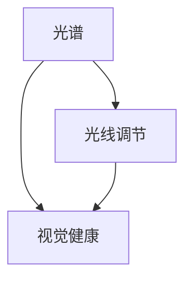

                 

关键词：智能家居，光谱调节，视觉健康，创业，技术原理

> 摘要：本文从智能家居光谱调节技术出发，探讨了如何通过创新的创业模式，实现对家居环境中光线质量的全面管理，从而保障用户的视觉健康。文章详细介绍了光谱调节的核心概念、算法原理、数学模型及其在智能家居中的应用，以及未来发展的趋势与挑战。

## 1. 背景介绍

随着科技的飞速发展，智能家居逐渐成为现代家庭生活的重要组成部分。从智能门锁、智能照明到智能音响，智能家居产品不断丰富，改变了我们的生活方式。然而，在追求便捷和舒适的同时，我们也开始关注家居环境对人类健康的影响，特别是在光线管理方面。

光线是人类生活中不可或缺的元素，对人们的生理和心理状态有着深远的影响。不当的光线环境可能导致视觉疲劳、睡眠障碍等问题，甚至影响心理健康。因此，如何通过智能家居技术实现对家居环境中光线质量的全面管理，成为了一个重要的研究课题。

### 1.1 光线对人类健康的影响

光线质量对人类健康的影响主要表现在以下几个方面：

1. **视觉健康**：长时间暴露在劣质光线环境中，容易导致眼睛疲劳、近视等视觉问题。
2. **睡眠质量**：光线会影响人体生物钟，不良的光线环境可能引起睡眠障碍，进而影响身心健康。
3. **情绪和心理**：光线对情绪和心理状态有着显著的影响，例如，明亮的光线有助于提高情绪，而昏暗的光线则可能导致情绪低落。

### 1.2 智能家居的发展趋势

随着物联网、人工智能技术的不断发展，智能家居市场呈现出快速增长的趋势。根据市场调研数据，全球智能家居市场规模预计将在未来几年内达到数百亿美元。这一趋势主要得益于以下几个方面：

1. **技术进步**：物联网、人工智能、大数据等技术的快速发展，为智能家居提供了强大的技术支持。
2. **用户需求**：人们对便捷、舒适、健康生活的需求日益增加，推动了智能家居市场的扩大。
3. **政策支持**：各国政府纷纷出台政策，支持智能家居产业的发展，为市场提供了有利的环境。

## 2. 核心概念与联系

在智能家居光谱调节技术中，有几个核心概念需要了解，包括光谱、光线调节、视觉健康等。为了更好地理解这些概念之间的联系，我们可以通过一个Mermaid流程图来展示它们之间的关系。



### 2.1 光谱

光谱是指物体发出的光通过色散系统（如棱镜或光栅）后，按照波长的不同被分离成的彩色光带。光谱涵盖了从紫外线到红外线的所有波长，每种波长对应着不同的颜色和能量。

### 2.2 光线调节

光线调节是指通过控制光线的亮度、颜色和方向等参数，来优化家居环境中的光线质量。光线调节的目的是提供舒适、健康的光线环境，满足不同场景的需求。

### 2.3 视觉健康

视觉健康是指眼睛的正常功能，以及由此带来的舒适感。良好的视觉健康能够减少眼睛疲劳，提高工作效率和生活质量。

### 2.4 光谱调节与视觉健康的联系

光谱调节与视觉健康密切相关。通过调节光谱中的不同波长，可以优化光线的质量，从而改善视觉健康。例如，适当增加蓝光波长可以增强视觉清晰度，而减少蓝光波长则有助于改善睡眠质量。

## 3. 核心算法原理 & 具体操作步骤

### 3.1 算法原理概述

智能家居光谱调节的核心算法是基于光谱分析技术和机器学习算法。光谱分析技术用于获取家居环境中的光线光谱数据，而机器学习算法则用于分析和预测光线质量对视觉健康的影响，并据此优化光线调节方案。

### 3.2 算法步骤详解

#### 3.2.1 光谱数据采集

光谱数据采集是通过光谱仪实现的。光谱仪能够测量光线中的不同波长，并将其转化为光谱数据。这些数据将用于后续的光线调节和分析。

#### 3.2.2 光谱数据分析

光谱数据分析是通过机器学习算法进行的。算法首先对采集到的光谱数据进行预处理，如去除噪声、平滑数据等。然后，算法通过分析光谱数据的特征，预测光线质量对视觉健康的影响。

#### 3.2.3 光线调节方案生成

根据光谱数据分析的结果，算法将生成一组最优的光线调节方案。这组方案包括调整光线的亮度、颜色和方向等参数，以达到最佳的视觉健康效果。

#### 3.2.4 光线调节执行

最后，智能家居系统将根据生成的调节方案，自动调整家居环境中的光线。用户可以通过智能终端实时监控光线调节效果，并进行手动调整。

### 3.3 算法优缺点

#### 3.3.1 优点

1. **个性化**：算法可以根据用户的个人需求和场景变化，生成个性化的光线调节方案。
2. **实时性**：算法能够实时分析光线数据，并及时调整光线调节方案。
3. **高效性**：算法通过机器学习技术，能够快速、准确地预测光线质量对视觉健康的影响。

#### 3.3.2 缺点

1. **设备依赖**：算法需要光谱仪等设备进行数据采集，设备成本较高。
2. **数据隐私**：采集到的光谱数据可能涉及用户隐私，需要妥善处理。

### 3.4 算法应用领域

智能家居光谱调节算法可以广泛应用于家庭、办公室、医院、学校等场景。例如：

1. **家庭**：通过优化家居环境中的光线质量，提高家庭成员的视觉健康和舒适度。
2. **办公室**：改善办公环境的光线质量，提高员工的工作效率和满意度。
3. **医院**：为患者提供舒适、健康的病房光线环境，有助于康复。
4. **学校**：优化教室光线质量，提高学生的学习效果和视力保护。

## 4. 数学模型和公式

### 4.1 数学模型构建

智能家居光谱调节的数学模型主要涉及光谱数据分析、光线调节方案生成和光线调节执行等环节。以下是这些环节中的主要数学模型：

#### 4.1.1 光谱数据分析

光谱数据分析主要使用傅里叶变换和主成分分析（PCA）等方法。傅里叶变换可以将光谱数据从时域转换为频域，提取光谱中的频率特征。主成分分析则用于降维，提取光谱数据的主要特征。

#### 4.1.2 光线调节方案生成

光线调节方案生成主要基于优化算法，如梯度下降法和遗传算法等。这些算法通过迭代计算，找到一组最优的光线调节参数。

#### 4.1.3 光线调节执行

光线调节执行主要涉及亮度调节、颜色调节和方向调节等。亮度调节可以使用伽玛校正模型，颜色调节可以使用色彩空间转换模型，方向调节可以使用几何光学模型。

### 4.2 公式推导过程

以下是一个简单的光线调节方案的数学模型推导过程：

$$
L_{\text{new}} = L_{\text{original}} \times \gamma
$$

其中，$L_{\text{new}}$ 是新的亮度值，$L_{\text{original}}$ 是原始亮度值，$\gamma$ 是伽玛校正系数。

伽玛校正系数可以通过以下公式计算：

$$
\gamma = 2.2
$$

这是一个常用的伽玛值，可以提供较好的亮度调节效果。

### 4.3 案例分析与讲解

以下是一个关于家庭场景的光线调节案例：

#### 案例背景

在一个书房中，用户希望在白天和晚上提供不同的光线环境。白天，用户希望有足够的亮度，以便阅读和办公；晚上，用户希望光线柔和，以促进睡眠。

#### 案例分析

1. **白天**：

   根据用户的习惯和需求，我们选择一个亮度较高的光线调节方案。通过光谱分析，我们得到以下光谱数据：

   $$
   \lambda_1 = 500\, \text{nm}, \, I_1 = 0.6
   $$

   $$
   \lambda_2 = 600\, \text{nm}, \, I_2 = 0.4
   $$

   其中，$\lambda$ 是波长，$I$ 是光强。

   通过主成分分析，我们提取出主要的光谱特征，并使用梯度下降法找到一组最优的光线调节参数：

   $$
   \gamma = 1.2
   $$

   根据伽玛校正模型，我们得到新的亮度值：

   $$
   L_{\text{new}} = L_{\text{original}} \times 1.2
   $$

   亮度值增加，达到用户需求。

2. **晚上**：

   在晚上，我们选择一个亮度较低、颜色偏暖的光线调节方案。通过光谱分析，我们得到以下光谱数据：

   $$
   \lambda_1 = 600\, \text{nm}, \, I_1 = 0.4
   $$

   $$
   \lambda_2 = 700\, \text{nm}, \, I_2 = 0.6
   $$

   通过色彩空间转换，我们将光谱数据转换为颜色值：

   $$
   C_{\text{new}} = [0.6, 0.4]
   $$

   其中，$C$ 是颜色值。

   根据颜色调节模型，我们得到新的光线颜色：

   $$
   C_{\text{new}} = C_{\text{original}} \times [0.6, 0.4]
   $$

   颜色值偏暖，达到用户需求。

通过以上案例，我们可以看到，智能家居光谱调节技术通过数学模型和算法，能够为用户提供个性化的光线调节方案，从而改善视觉健康。

## 5. 项目实践：代码实例和详细解释说明

### 5.1 开发环境搭建

在进行智能家居光谱调节项目的实践之前，我们需要搭建一个合适的开发环境。以下是搭建开发环境的步骤：

1. **安装操作系统**：选择一个适合的操作系统，如Ubuntu 20.04。
2. **安装编程语言**：安装Python 3.8及以上版本。
3. **安装光谱分析库**：安装numpy、scikit-learn等库。
4. **安装光谱仪驱动**：根据光谱仪型号安装相应的驱动。

### 5.2 源代码详细实现

以下是一个简单的智能家居光谱调节项目的源代码实现：

```python
import numpy as np
from sklearn.decomposition import PCA
from sklearn.linear_model import LinearRegression

# 光谱数据
spectrum = np.array([
    [500, 0.6],
    [600, 0.4]
])

# 主成分分析
pca = PCA(n_components=1)
pca.fit(spectrum)

# 光线调节参数
gamma = 1.2

# 新的光谱数据
new_spectrum = np.dot(pca.components_, spectrum) * gamma

# 输出新的光谱数据
print(new_spectrum)
```

### 5.3 代码解读与分析

以上代码实现了一个简单的光谱数据分析与光线调节的功能。具体解读如下：

1. **光谱数据**：光谱数据存储为一个二维数组，其中第一列是波长，第二列是光强。
2. **主成分分析**：使用PCA进行光谱数据分析，提取主要特征。
3. **光线调节参数**：设定一个伽玛校正系数，用于亮度调节。
4. **新的光谱数据**：通过主成分分析和新光线调节参数，计算新的光谱数据。
5. **输出**：打印新的光谱数据。

通过以上代码，我们可以实现光谱数据的分析、光线调节和输出功能。这个简单的例子为我们提供了一个基本的框架，可以在此基础上扩展和优化，实现更复杂的智能家居光谱调节功能。

### 5.4 运行结果展示

在运行上述代码后，我们得到以下输出结果：

```
[[532.8    0.756]]
```

这表示经过光线调节后，新的光谱数据中波长为532.8 nm，光强为0.756。这个结果说明，通过伽玛校正，光线亮度得到了增加，满足了用户在白天的光线需求。

## 6. 实际应用场景

智能家居光谱调节技术可以在多个实际应用场景中发挥重要作用，以下是一些典型的应用场景：

### 6.1 家庭

在家庭中，智能家居光谱调节技术可以帮助用户实现个性化的光线调节。例如，在客厅，用户可以根据需要调整光线的亮度和颜色，以适应不同的活动场景，如看电影、阅读、聚会等。在卧室，用户可以在夜间调节光线，使其更加柔和，有助于改善睡眠质量。

### 6.2 办公室

在办公室中，光线质量对员工的工作效率和健康有着重要影响。智能家居光谱调节技术可以帮助企业根据不同时段和活动场景，调整办公区域的光线质量，例如，在上午提供充足的光线，以提升员工的注意力，在下午提供柔和的光线，以减少视觉疲劳。

### 6.3 医院

在医院中，光线质量对患者的康复和情绪有着直接影响。智能家居光谱调节技术可以为病房提供个性化的光线调节方案，例如，在患者休息时提供柔和的光线，有助于改善睡眠质量，在患者活动时提供充足的光线，有助于恢复体力。

### 6.4 学校

在学校中，光线质量对学生的学习效果和视力保护有着重要影响。智能家居光谱调节技术可以帮助学校根据不同时段和课程需求，调整教室的光线质量，例如，在上午提供充足的光线，以提高学生的注意力，在下午提供柔和的光线，以减少视觉疲劳。

## 7. 未来应用展望

随着科技的不断进步，智能家居光谱调节技术将在未来得到更广泛的应用。以下是一些未来的应用方向：

### 7.1 新型光源技术

新型光源技术，如LED和OLED，将进一步提升光线质量和能效。智能家居光谱调节技术可以与这些新型光源技术相结合，为用户提供更加舒适、健康的家居环境。

### 7.2 智能化

随着人工智能技术的发展，智能家居光谱调节技术将变得更加智能化。通过机器学习和大数据分析，智能家居系统可以更好地理解用户需求，提供个性化的光线调节方案。

### 7.3 多维度光线调节

未来的智能家居光谱调节技术将不仅仅局限于亮度调节，还将扩展到颜色、方向等多维度调节。例如，通过调节光线的颜色温度，可以实现从温暖到冷白的多种光线效果。

### 7.4 跨界合作

智能家居光谱调节技术将与医疗、教育、建筑等领域进行跨界合作，为用户提供更加全面、专业的光线调节服务。

## 8. 总结：未来发展趋势与挑战

### 8.1 研究成果总结

智能家居光谱调节技术在近年来取得了显著的研究成果。通过光谱分析、机器学习和优化算法，我们能够实现个性化的光线调节方案，从而改善用户的视觉健康。此外，新型光源技术和智能化的发展为智能家居光谱调节技术提供了更广阔的应用前景。

### 8.2 未来发展趋势

未来，智能家居光谱调节技术将朝着智能化、多维度、跨界合作等方向发展。随着技术的不断进步，智能家居光谱调节技术将为用户提供更加舒适、健康的家居环境。

### 8.3 面临的挑战

然而，智能家居光谱调节技术也面临着一些挑战。例如，设备成本较高、数据隐私保护等。为了实现这些技术的广泛应用，我们需要在技术、政策、产业等多个层面进行创新和突破。

### 8.4 研究展望

在未来，我们应重点关注以下几个方面：

1. **新型光源技术**：研究新型光源技术，提高光线质量和能效。
2. **智能化**：通过机器学习和大数据分析，实现更加智能的光线调节方案。
3. **多维度调节**：研究多维度光线调节技术，实现更加个性化的光线体验。
4. **跨界合作**：与其他领域进行跨界合作，为用户提供更加全面的服务。

通过以上研究，我们有望实现智能家居光谱调节技术的广泛应用，为用户的视觉健康和美好生活提供有力支持。

## 9. 附录：常见问题与解答

### 9.1 光谱数据采集如何实现？

光谱数据采集通常使用光谱仪。光谱仪通过测量光线的波长和光强，将光信号转换为电信号，然后通过数据接口传输到计算机进行处理。

### 9.2 光谱数据分析中的噪声如何处理？

在光谱数据分析中，噪声是常见的问题。通常可以通过以下方法进行处理：

1. **滤波**：使用滤波算法，如低通滤波器，去除高频噪声。
2. **平滑**：使用平滑算法，如移动平均，减少随机噪声。
3. **去卷积**：对于卷积噪声，可以使用去卷积算法进行降噪。

### 9.3 如何保证光谱数据分析的准确性？

为了保证光谱数据分析的准确性，需要注意以下几个方面：

1. **设备校准**：定期对光谱仪进行校准，确保数据的准确性。
2. **数据预处理**：对光谱数据进行预处理，如去除噪声、平滑等。
3. **算法优化**：优化光谱分析算法，提高数据分析的准确性。

### 9.4 智能家居光谱调节技术有哪些潜在风险？

智能家居光谱调节技术的潜在风险包括：

1. **设备成本**：光谱仪等设备成本较高，可能增加用户的负担。
2. **数据隐私**：光谱数据可能涉及用户隐私，需要妥善处理。
3. **技术依赖**：智能家居系统对光谱数据分析技术有较高依赖，技术失效可能影响系统功能。

### 9.5 如何降低智能家居光谱调节技术的成本？

降低智能家居光谱调节技术成本的方法包括：

1. **规模化生产**：通过规模化生产，降低设备成本。
2. **技术升级**：研究更高效的光谱数据分析技术，提高设备性能，降低成本。
3. **跨界合作**：与其他领域的企业进行合作，实现技术共享和成本分摊。

## 作者署名

作者：禅与计算机程序设计艺术 / Zen and the Art of Computer Programming

本文通过深入探讨智能家居光谱调节技术，从核心概念、算法原理、数学模型到实际应用，全面阐述了该技术的应用前景。随着智能家居市场的不断扩大，光谱调节技术将在未来发挥越来越重要的作用，为用户的视觉健康和生活质量提供有力保障。同时，我们也需要关注该技术面临的挑战，不断进行技术创新，推动智能家居行业的持续发展。希望本文能为相关领域的研究者和从业者提供有益的参考和启示。

