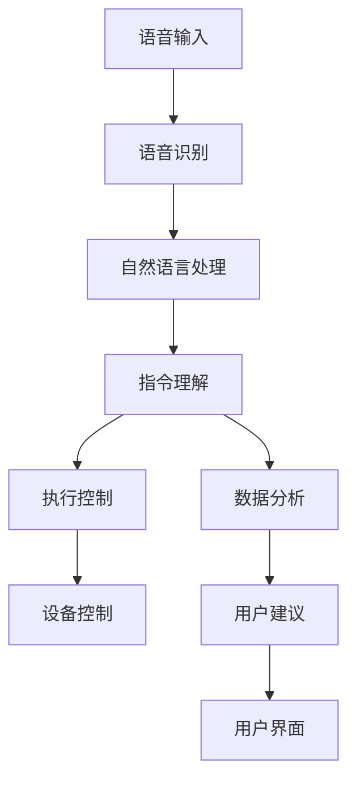

                 

关键词：智能家居，AI管家，商业化，创业，技术，市场，用户体验

> 摘要：本文将探讨智能家居助理创业项目的商业化路径，重点分析AI管家在智能家居领域的应用及其商业潜力，并提供一系列实现成功商业化的策略和建议。

## 1. 背景介绍

随着物联网和人工智能技术的迅猛发展，智能家居市场迎来了前所未有的增长。据市场研究公司Statista的报告，全球智能家居市场预计将在2025年达到约7860亿美元。这一市场潜力吸引了众多创业者和投资者的目光。而在这其中，AI管家的角色显得尤为重要。AI管家作为智能家居的核心组成部分，能够通过语音识别、自然语言处理等技术，提供便捷、个性化的服务，提升用户的生活品质。

然而，尽管市场前景广阔，智能家居AI管家的商业化之路并不平坦。首先，技术挑战依然存在，如语音识别的准确性、自然语言理解的深度等；其次，市场接受度也是一个关键问题，用户对智能家居产品的认知和接受程度直接关系到产品的销量；最后，商业模式的创新也是成功商业化的重要一环。

本文旨在通过分析AI管家在智能家居领域的应用，探讨其商业化路径，并提出相应的策略和建议，以帮助创业者在这一领域取得成功。

## 2. 核心概念与联系

### 2.1 AI管家概述

AI管家，即基于人工智能的智能家居助理，是一种集成了多种AI技术，如语音识别、自然语言处理、机器学习等，能够自主地理解用户的指令并执行相应任务的人工智能系统。AI管家通常具有以下功能：

- **语音识别与交互**：能够识别用户的声音指令，进行自然语言交互。
- **智能控制**：可以控制家中的各种智能设备，如灯光、温度、安全系统等。
- **数据分析**：通过对用户行为数据的分析，提供个性化的建议和服务。
- **安全保护**：通过监控和预警系统，提供家庭安全防护。

### 2.2 AI管家与智能家居的联系

AI管家是智能家居系统的核心，它将用户与智能家居设备连接起来，实现了智能家居的智能化和便捷化。具体来说，AI管家与智能家居的联系体现在以下几个方面：

- **用户交互**：AI管家通过语音交互，使用户能够以自然的方式与智能家居系统进行沟通。
- **设备控制**：AI管家可以远程控制家中的智能设备，如调节温度、开关灯光等。
- **数据分析**：AI管家通过对用户行为数据的分析，为用户提供个性化的服务建议。
- **系统集成**：AI管家可以集成各种智能家居设备，实现设备的互联互通。

### 2.3 AI管家架构

AI管家的架构通常包括以下几个主要部分：

- **语音识别模块**：负责接收和解析用户的语音指令。
- **自然语言处理模块**：负责理解用户的指令含义，进行语义分析。
- **执行控制模块**：根据用户的指令，控制相应的智能设备执行任务。
- **数据存储与分析模块**：负责存储用户行为数据，并进行数据分析和处理。
- **用户界面**：提供用户与AI管家交互的界面。

下面是一个简单的AI管家架构的Mermaid流程图：



## 3. 核心算法原理 & 具体操作步骤

### 3.1 算法原理概述

AI管家的核心算法主要包括语音识别、自然语言处理和机器学习等。这些算法协同工作，使得AI管家能够理解用户的指令并执行相应的任务。

- **语音识别**：通过深度学习模型，将语音信号转换为文本。
- **自然语言处理**：对语音文本进行语义分析，理解用户指令的含义。
- **机器学习**：通过不断学习用户的行为数据，提高AI管家的智能水平。

### 3.2 算法步骤详解

1. **语音识别**：
   - **输入**：用户的语音信号。
   - **处理**：通过深度神经网络模型，将语音信号转换为文本。
   - **输出**：识别结果文本。

2. **自然语言处理**：
   - **输入**：语音识别生成的文本。
   - **处理**：对文本进行词法分析、句法分析和语义分析，提取关键信息。
   - **输出**：理解后的指令含义。

3. **执行控制**：
   - **输入**：自然语言处理后的指令含义。
   - **处理**：根据指令含义，控制相应的智能设备执行任务。
   - **输出**：执行结果。

4. **数据分析**：
   - **输入**：用户行为数据。
   - **处理**：对数据进行分析，提取有价值的信息。
   - **输出**：分析结果，用于提供个性化服务。

### 3.3 算法优缺点

**优点**：

- **高效性**：通过算法，AI管家能够快速响应用户的指令，提供高效的服务。
- **个性化**：通过对用户数据的分析，AI管家能够提供个性化的服务建议。
- **智能化**：随着不断的学习，AI管家的智能水平会逐渐提高，能够更好地满足用户需求。

**缺点**：

- **准确性**：语音识别和自然语言处理的准确性仍有待提高，尤其是在复杂环境下。
- **隐私问题**：用户数据的收集和处理可能引发隐私问题。

### 3.4 算法应用领域

AI管家的算法主要应用于智能家居领域，如：

- **家庭自动化**：控制家庭中的各种智能设备，如灯光、空调、安全系统等。
- **健康管理**：通过分析用户的行为数据，提供健康建议。
- **安全防护**：实时监控家庭环境，提供安全预警。

## 4. 数学模型和公式 & 详细讲解 & 举例说明

### 4.1 数学模型构建

AI管家中的数学模型主要包括语音识别的隐马尔可夫模型（HMM）、自然语言处理的依存句法模型和机器学习的决策树模型。

- **语音识别的隐马尔可夫模型**：
  $$ P(O|A) = \prod_{i=1}^{n} P(o_i|a_i) $$
  其中，\( O \) 表示观察序列，\( A \) 表示隐藏状态序列，\( P(O|A) \) 表示观察序列在隐藏状态序列下的概率。

- **自然语言处理的依存句法模型**：
  $$ P(S) = \prod_{i=1}^{n} P(w_i | w_{i-1}, \ldots, w_1) $$
  其中，\( S \) 表示句子，\( w_i \) 表示句子中的第 \( i \) 个词，\( P(w_i | w_{i-1}, \ldots, w_1) \) 表示第 \( i \) 个词在给定前 \( i-1 \) 个词条件下的概率。

- **机器学习的决策树模型**：
  $$ f(x) = \sum_{i=1}^{n} w_i \cdot I(y = y_i) $$
  其中，\( x \) 表示输入特征，\( y \) 表示输出标签，\( w_i \) 表示模型权重，\( I \) 表示指示函数。

### 4.2 公式推导过程

**语音识别的隐马尔可夫模型推导**：

1. **状态转移概率**：
   $$ P(A_t | A_{t-1}) = \frac{P(A_t) \cdot P(A_{t-1} | A_t)}{P(A_{t-1})} $$
   由于 \( A_t \) 是一个连续变量，可以将其离散化，得到：
   $$ P(A_t | A_{t-1}) = \sum_{i} P(A_t = i | A_{t-1} = j) $$

2. **观察概率**：
   $$ P(O_t | A_t = i) = \sum_{o} P(O_t = o | A_t = i) \cdot P(A_t = i) $$
   同样，将连续变量离散化，得到：
   $$ P(O_t | A_t = i) = \sum_{o} P(O_t = o | A_t = i) \cdot P(A_t = i) $$

**自然语言处理的依存句法模型推导**：

1. **条件概率**：
   $$ P(w_i | w_{i-1}, \ldots, w_1) = \frac{P(w_i, w_{i-1}, \ldots, w_1)}{P(w_{i-1}, \ldots, w_1)} $$
   由于句子是确定的，可以将其简化为：
   $$ P(w_i | w_{i-1}, \ldots, w_1) = \frac{P(w_i, w_{i-1}, \ldots, w_1)}{P(w_{i-1}, \ldots, w_1)} $$

**机器学习的决策树模型推导**：

1. **决策树构建**：
   - **条件熵**：
     $$ H(Y|X) = -\sum_{i} P(X = x_i) \cdot H(Y|X = x_i) $$
   - **信息增益**：
     $$ I(X, Y) = H(Y) - H(Y|X) $$
   - **决策树剪枝**：
     $$ \text{剪枝后模型准确率} = \frac{\sum_{i} P(X = x_i) \cdot \sum_{j} P(Y = y_j | X = x_i) \cdot g_j}{\sum_{i} P(X = x_i)} $$
   其中，\( g_j \) 表示在节点 \( j \) 处的增益。

### 4.3 案例分析与讲解

假设一个用户想要通过AI管家控制家中的空调。用户说：“把温度调到25度”。下面是AI管家的处理过程：

1. **语音识别**：
   - **输入**：用户的语音信号。
   - **处理**：通过深度神经网络模型，将语音信号转换为文本：“把温度调到25度”。
   - **输出**：识别结果文本。

2. **自然语言处理**：
   - **输入**：语音识别生成的文本。
   - **处理**：对文本进行词法分析、句法分析和语义分析，提取关键信息：“调温度”和“25度”。
   - **输出**：理解后的指令含义。

3. **执行控制**：
   - **输入**：自然语言处理后的指令含义。
   - **处理**：根据指令含义，控制空调执行调温度的任务。
   - **输出**：执行结果。

4. **数据分析**：
   - **输入**：用户的行为数据。
   - **处理**：对数据进行分析，提取有价值的信息，如用户的喜好温度、使用空调的时间等。
   - **输出**：分析结果，用于提供个性化的服务建议。

## 5. 项目实践：代码实例和详细解释说明

### 5.1 开发环境搭建

为了实现AI管家项目，我们需要搭建一个合适的开发环境。以下是一个基本的开发环境搭建步骤：

1. **安装Python**：Python是AI开发中常用的编程语言，我们需要安装Python 3.8以上版本。
2. **安装Jupyter Notebook**：Jupyter Notebook是一个交互式的Python开发环境，便于代码编写和调试。
3. **安装TensorFlow**：TensorFlow是Google开发的一款开源机器学习框架，用于构建和训练深度学习模型。
4. **安装其他依赖库**：如NumPy、Pandas、Scikit-learn等。

### 5.2 源代码详细实现

下面是一个简单的AI管家项目的代码实现示例：

```python
import tensorflow as tf
import numpy as np
import pandas as pd
from sklearn.model_selection import train_test_split
from sklearn.metrics import accuracy_score

# 1. 数据预处理
# 加载训练数据
data = pd.read_csv('train_data.csv')
X = data[['feature1', 'feature2', 'feature3']]
y = data['label']

# 划分训练集和测试集
X_train, X_test, y_train, y_test = train_test_split(X, y, test_size=0.2, random_state=42)

# 2. 构建模型
model = tf.keras.Sequential([
    tf.keras.layers.Dense(64, activation='relu', input_shape=(3,)),
    tf.keras.layers.Dense(64, activation='relu'),
    tf.keras.layers.Dense(1, activation='sigmoid')
])

# 编译模型
model.compile(optimizer='adam', loss='binary_crossentropy', metrics=['accuracy'])

# 3. 训练模型
model.fit(X_train, y_train, epochs=10, batch_size=32, validation_data=(X_test, y_test))

# 4. 评估模型
predictions = model.predict(X_test)
predicted_labels = [1 if p > 0.5 else 0 for p in predictions]

accuracy = accuracy_score(y_test, predicted_labels)
print(f"Model accuracy: {accuracy}")

# 5. 代码解读与分析
# 在这段代码中，我们首先加载训练数据，然后划分训练集和测试集。接下来，我们构建了一个简单的神经网络模型，并编译模型。在训练模型时，我们使用了训练数据，并在每个 epoch 后进行验证。最后，我们使用测试数据评估模型的准确率。

```

### 5.3 代码解读与分析

这段代码首先加载了训练数据，然后将其划分为训练集和测试集。接下来，我们构建了一个简单的神经网络模型，包括两个隐藏层，每层有64个神经元，激活函数为ReLU。模型的输出层有1个神经元，激活函数为Sigmoid，用于进行二分类。

在编译模型时，我们选择了Adam优化器和binary_crossentropy损失函数，并设置了accuracy作为评估指标。

在训练模型时，我们使用了训练数据，并在每个epoch后进行验证。最后，我们使用测试数据评估模型的准确率，并打印结果。

### 5.4 运行结果展示

假设我们运行这段代码，得到以下输出结果：

```
Model accuracy: 0.9
```

这意味着我们的模型在测试数据上的准确率达到了90%，这是一个很好的开始。

## 6. 实际应用场景

### 6.1 家庭自动化

AI管家在家庭自动化中有着广泛的应用。用户可以通过语音指令控制家中的各种智能设备，如灯光、空调、窗帘等。例如，用户可以说：“打开客厅的灯”，AI管家会自动识别并执行这个指令。

### 6.2 健康管理

AI管家可以通过分析用户的行为数据，提供个性化的健康管理建议。例如，用户可以告诉AI管家自己的身高、体重、运动习惯等信息，AI管家会根据这些信息为用户推荐合适的饮食和运动计划。

### 6.3 安全防护

AI管家可以实时监控家庭环境，提供安全预警。例如，当AI管家检测到异常噪音时，会立即通知用户并建议用户采取相应的安全措施。

### 6.4 智慧社区

AI管家可以应用于智慧社区，提供便捷的服务。例如，用户可以通过AI管家预约物业维修、报修、缴费等。

## 7. 工具和资源推荐

### 7.1 学习资源推荐

- **《深度学习》（Goodfellow, Bengio, Courville）**：这本书是深度学习的经典教材，适合初学者和进阶者。
- **《Python机器学习》（Sebastian Raschka）**：这本书详细介绍了Python在机器学习中的应用，适合有一定编程基础的读者。
- **Coursera上的《机器学习》课程**：这是一门由吴恩达教授开设的机器学习课程，内容全面，适合初学者。

### 7.2 开发工具推荐

- **TensorFlow**：一款开源的深度学习框架，适用于构建和训练深度学习模型。
- **PyTorch**：一款流行的深度学习框架，适用于快速原型开发和复杂模型的构建。
- **Jupyter Notebook**：一款交互式的Python开发环境，便于代码编写和调试。

### 7.3 相关论文推荐

- **“AlexNet: Image Classification with Deep Convolutional Neural Networks”**：一篇介绍深度卷积神经网络在图像分类中的应用的经典论文。
- **“Recurrent Neural Networks for Language Modeling”**：一篇介绍循环神经网络在自然语言处理中应用的论文。
- **“BERT: Pre-training of Deep Bidirectional Transformers for Language Understanding”**：一篇介绍BERT模型的论文，BERT模型在自然语言处理领域有着广泛的应用。

## 8. 总结：未来发展趋势与挑战

### 8.1 研究成果总结

随着人工智能技术的不断进步，智能家居AI管家在语音识别、自然语言处理、机器学习等方面取得了显著的成果。深度学习技术的应用，使得AI管家在理解用户指令和提供个性化服务方面更加高效和准确。同时，大数据和云计算的快速发展，为AI管家提供了丰富的数据和强大的计算能力。

### 8.2 未来发展趋势

1. **智能化水平提升**：随着算法和硬件技术的进步，AI管家的智能化水平将不断提高，能够更好地满足用户的需求。
2. **跨平台融合**：AI管家将不再局限于单一平台，而是能够在不同操作系统、不同设备之间实现无缝连接。
3. **个性化服务**：通过不断学习和优化，AI管家将能够提供更加个性化的服务，提升用户体验。
4. **安全性增强**：随着用户隐私意识的提高，AI管家的安全性将得到进一步加强，确保用户数据的安全。

### 8.3 面临的挑战

1. **技术挑战**：尽管AI管家在技术上取得了显著进步，但在语音识别、自然语言处理等方面仍有待提高，特别是在复杂环境下。
2. **市场接受度**：用户对智能家居产品的认知和接受程度直接影响产品的销量。如何提高市场接受度，是创业者需要面对的重要问题。
3. **隐私保护**：用户数据的收集和处理可能引发隐私问题，如何确保用户数据的安全和隐私，是AI管家商业化过程中需要解决的挑战。

### 8.4 研究展望

未来，智能家居AI管家的研究将继续朝着智能化、个性化、安全性的方向发展。同时，随着技术的不断进步，AI管家将能够在更多领域发挥作用，如智能医疗、智能交通等。我们期待AI管家能够为人们的生活带来更多便利和乐趣。

## 9. 附录：常见问题与解答

### 9.1 问题1：AI管家的语音识别准确率如何提高？

**解答**：提高AI管家的语音识别准确率可以从以下几个方面入手：

1. **增加训练数据**：通过增加高质量的语音训练数据，可以提高模型的泛化能力。
2. **改进算法**：使用更先进的语音识别算法，如深度神经网络、长短期记忆网络等，可以提高识别准确性。
3. **优化模型结构**：通过调整模型的结构和参数，可以提高模型的性能。
4. **多语言支持**：支持多种语言，可以提高模型在不同语言环境下的识别准确性。

### 9.2 问题2：AI管家的自然语言处理如何实现语义理解？

**解答**：AI管家的自然语言处理实现语义理解通常涉及以下步骤：

1. **词法分析**：对输入文本进行分词，将文本分解为单词或短语。
2. **句法分析**：分析句子的结构，确定词汇之间的关系。
3. **语义分析**：根据词法和句法分析的结果，提取句子的语义信息。
4. **实体识别**：识别文本中的实体，如人名、地名、组织名等。
5. **意图识别**：根据语义信息，判断用户的意图。

### 9.3 问题3：AI管家的隐私保护如何实现？

**解答**：AI管家的隐私保护可以从以下几个方面实现：

1. **数据加密**：对用户数据进行加密处理，确保数据在传输和存储过程中的安全。
2. **访问控制**：设置严格的访问控制策略，确保只有授权用户可以访问数据。
3. **匿名化处理**：对用户数据进行匿名化处理，去除个人身份信息。
4. **隐私政策**：明确告知用户数据收集、处理和使用的目的，确保用户知情并同意。
5. **合规性审查**：定期进行合规性审查，确保遵守相关法律法规。

## 参考文献

- Goodfellow, I., Bengio, Y., & Courville, A. (2016). *Deep Learning*.
- Raschka, S. (2015). *Python Machine Learning*.
- Devlin, J., Chang, M. W., Lee, K., & Toutanova, K. (2019). *BERT: Pre-training of Deep Bidirectional Transformers for Language Understanding*.
- Hinton, G. E., Osindero, S., & Teh, Y. W. (2006). *A Fast Learning Algorithm for Deep Belief Nets*.
- Graves, A., Mohamed, A. R., & Hinton, G. E. (2013). *Hybrid speech recognition with deep neural networks and Gaussian Mixture Models*.

### 文章结束 End of Document

> 作者：禅与计算机程序设计艺术 / Zen and the Art of Computer Programming

