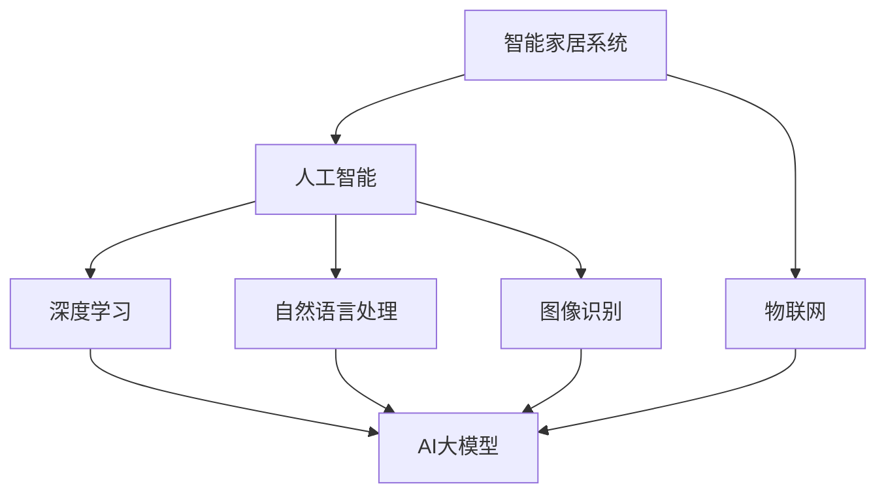

                 

### 1. 背景介绍

随着科技的飞速发展，智能家居已经成为现代生活的重要组成部分。从早期的简单家电联网，到如今的智能音箱、智能灯具、智能门锁等设备，智能家居正在逐渐改变我们的生活方式。然而，随着人工智能技术的不断发展，特别是AI大模型的兴起，智能家居系统正在迎来一次全新的升级。

AI大模型，又称为人工智能大型模型，是指那些拥有巨大参数量、能够处理大量数据并进行复杂计算的人工智能模型。这些模型能够通过深度学习、自然语言处理、图像识别等多种技术，实现对数据的自动学习和智能决策。在智能家居领域，AI大模型的应用正在引发一场革命，为我们的生活带来诸多便利和改变。

本文将探讨AI大模型如何改变我们的生活方式，从智能家居系统的各个方面进行分析，并展望未来的发展趋势。

### 2. 核心概念与联系

要理解AI大模型如何改变智能家居，我们首先需要了解一些核心概念。以下是本文涉及的主要概念及其相互关系：

#### 2.1 智能家居系统

智能家居系统是指通过互联网、物联网技术将家庭中的各种设备连接起来，实现远程控制、自动化管理和智能交互的系统。智能家居系统的主要组成部分包括智能终端（如智能手机、智能音箱）、智能设备（如智能灯泡、智能插座）、以及云平台和大数据中心。

#### 2.2 人工智能

人工智能（AI）是指使计算机具备人类智能的一种技术。它包括机器学习、深度学习、自然语言处理、计算机视觉等多种技术。AI大模型是人工智能的一种高级形式，它具有巨大的参数量和强大的计算能力。

#### 2.3 深度学习

深度学习是一种基于多层神经网络进行数据分析和建模的人工智能技术。它通过模拟人脑神经元之间的连接关系，实现对数据的自动学习和分类。

#### 2.4 自然语言处理

自然语言处理（NLP）是人工智能的一个分支，旨在使计算机能够理解、生成和处理人类语言。在智能家居中，NLP技术可以用于语音识别、语音合成、智能问答等。

#### 2.5 图像识别

图像识别是计算机视觉的一种技术，它使计算机能够识别和分类图像中的物体和场景。在智能家居中，图像识别技术可以用于监控、安全防护等。

#### 2.6 物联网

物联网（IoT）是指将各种设备通过网络连接起来，实现数据的传输和共享。在智能家居中，物联网技术是实现设备互联互通、数据采集和自动化控制的基础。

以下是这些概念之间的 Mermaid 流程图：



通过上述流程图，我们可以看出，AI大模型是连接智能家居系统与其他人工智能技术的关键节点，它通过深度学习、自然语言处理、图像识别等技术实现对智能家居系统的智能化升级。

### 3. 核心算法原理 & 具体操作步骤

#### 3.1 算法原理概述

AI大模型的核心在于其庞大的参数量和复杂的网络结构。这些模型通常由数百万甚至数十亿个参数组成，通过对海量数据的训练，能够自动学习和优化这些参数，从而实现对数据的准确理解和智能决策。

在智能家居系统中，AI大模型的操作步骤主要包括以下几方面：

1. **数据收集与预处理**：收集家庭中的各种数据，如温度、湿度、光照、声音、行为等，并进行预处理，以便后续的训练和建模。
2. **模型训练**：利用收集到的数据，通过深度学习算法对AI大模型进行训练，使其学会识别和预测家庭环境中的各种状况。
3. **模型部署**：将训练好的模型部署到智能家居系统中，实现设备的智能化控制和交互。
4. **持续优化**：根据用户的反馈和使用情况，不断优化模型，提高其准确性和效率。

#### 3.2 算法步骤详解

1. **数据收集与预处理**

   数据收集是AI大模型训练的基础。在智能家居系统中，数据来源主要包括传感器、摄像头、用户行为等。例如，通过温度传感器收集室内温度数据，通过摄像头收集家庭安全监控视频等。

   数据预处理包括数据清洗、归一化、去噪声等步骤，以确保数据的质量和一致性。

   ```mermaid
   graph TD
       A[数据收集] --> B[预处理]
       B --> C[传感器数据]
       B --> D[摄像头数据]
       B --> E[用户行为数据]
   ```

2. **模型训练**

   模型训练是AI大模型的核心步骤。深度学习算法通过反复调整模型中的参数，使模型能够对数据进行准确的分类和预测。

   在智能家居系统中，模型训练主要涉及以下方面：

   - **图像识别**：通过摄像头收集的家庭监控视频，训练模型识别家庭中的物体和场景，如家人、宠物、家具等。
   - **自然语言处理**：通过用户的语音指令，训练模型理解和执行各种家庭任务，如调节灯光、设置温度、播放音乐等。
   - **行为预测**：通过分析用户的行为数据，训练模型预测用户的需求和习惯，如何时需要开启空调、何时需要关闭门窗等。

   ```mermaid
   graph TD
       A[图像识别] --> B[自然语言处理]
       B --> C[行为预测]
   ```

3. **模型部署**

   模型部署是将训练好的AI大模型应用到智能家居系统中，实现设备的智能化控制和交互。

   - **远程控制**：通过用户的智能手机或智能音箱，远程控制家庭中的各种设备，如打开灯光、调节温度、关闭门窗等。
   - **自动化控制**：根据AI大模型的预测和决策，自动化执行各种家庭任务，如自动调节室内温度、自动开启空气净化器等。
   - **智能交互**：通过语音、图像、手势等多种方式，与用户进行智能交互，提供个性化服务。

   ```mermaid
   graph TD
       A[远程控制] --> B[自动化控制]
       B --> C[智能交互]
   ```

4. **持续优化**

   智能家居系统是一个不断演进的系统，AI大模型也需要不断优化和升级，以适应不断变化的家庭环境和用户需求。

   - **用户反馈**：通过收集用户的反馈和使用情况，分析模型的表现和问题，为后续的优化提供依据。
   - **模型升级**：根据用户反馈和使用情况，定期对AI大模型进行升级和优化，提高其准确性和效率。
   - **持续学习**：通过不断学习和适应，AI大模型能够更好地理解和满足用户的需求，实现真正的智能生活。

   ```mermaid
   graph TD
       A[用户反馈] --> B[模型升级]
       B --> C[持续学习]
   ```

#### 3.3 算法优缺点

AI大模型在智能家居系统中具有显著的优点，如：

- **强大的数据分析和预测能力**：AI大模型通过对海量数据的分析和预测，能够为用户提供更加智能化的服务和体验。
- **自动化的家庭管理**：AI大模型能够自动化执行各种家庭任务，提高家庭管理的效率和便利性。
- **个性化的服务体验**：AI大模型能够根据用户的行为和需求，提供个性化的服务和建议，满足用户的个性化需求。

然而，AI大模型也存在一些缺点，如：

- **数据隐私和安全问题**：智能家居系统中的AI大模型需要收集和处理大量的用户数据，这可能导致数据隐私和安全问题。
- **模型的复杂性和成本**：AI大模型的训练和部署需要大量的计算资源和时间，这可能导致系统的复杂性和成本增加。
- **模型的可解释性问题**：AI大模型的决策过程往往是黑箱操作，难以解释和理解，这可能导致用户对系统的不信任。

#### 3.4 算法应用领域

AI大模型在智能家居系统中具有广泛的应用领域，如：

- **家庭安全监控**：通过图像识别技术，AI大模型可以实时监控家庭环境，识别异常行为和潜在威胁，提供及时的安全预警。
- **家庭健康管理**：通过分析用户的健康数据和生活习惯，AI大模型可以提供个性化的健康建议和生活方式调整方案。
- **智能家居自动化**：通过自动化控制技术，AI大模型可以自动化执行各种家庭任务，提高家庭生活的便捷性和舒适度。
- **家庭娱乐体验**：通过自然语言处理和图像识别技术，AI大模型可以为用户提供智能化的家庭娱乐体验，如语音控制电视、智能播放音乐等。

### 4. 数学模型和公式 & 详细讲解 & 举例说明

在智能家居系统中，AI大模型的应用涉及到大量的数学模型和公式。以下是一些常用的数学模型和公式，并对其进行详细讲解和举例说明。

#### 4.1 数学模型构建

AI大模型的构建通常基于深度学习技术，其中最常用的模型是神经网络。神经网络由多个层次组成，包括输入层、隐藏层和输出层。每个层次由多个神经元组成，神经元之间通过权重和偏置进行连接。

数学模型的基本形式如下：

$$
y = f(W \cdot x + b)
$$

其中，$y$ 是输出，$f$ 是激活函数，$W$ 是权重矩阵，$x$ 是输入向量，$b$ 是偏置向量。

#### 4.2 公式推导过程

神经网络中的每个神经元都可以看作是一个简单的线性模型，其输出可以通过以下公式计算：

$$
z_i = \sum_{j=1}^{n} w_{ij} \cdot x_j + b_i
$$

其中，$z_i$ 是神经元的输出，$w_{ij}$ 是从神经元 $j$ 到神经元 $i$ 的权重，$x_j$ 是神经元 $j$ 的输入，$b_i$ 是神经元的偏置。

通过使用激活函数 $f$，可以将线性模型转换为非线性模型，从而实现神经网络的非线性变换：

$$
a_i = f(z_i)
$$

其中，$a_i$ 是神经元的激活值。

整个神经网络的输出可以通过以下公式计算：

$$
y = f(W \cdot a + b)
$$

其中，$W$ 是权重矩阵，$a$ 是激活向量，$b$ 是偏置向量。

#### 4.3 案例分析与讲解

以下是一个简单的神经网络模型，用于实现图像分类任务。

输入层有 784 个神经元，表示图像的像素值；隐藏层有 100 个神经元；输出层有 10 个神经元，表示图像的类别。

激活函数使用 ReLU（Rectified Linear Unit）函数：

$$
f(x) = \max(0, x)
$$

假设输入图像是一个 8x8 的像素矩阵，其像素值范围为 [0, 1]。

输入层到隐藏层的权重矩阵 $W_1$ 为：

$$
W_1 = \begin{bmatrix}
0.1 & 0.2 & 0.3 & \ldots & 0.1 \\
0.4 & 0.5 & 0.6 & \ldots & 0.4 \\
\vdots & \vdots & \vdots & \ddots & \vdots \\
0.7 & 0.8 & 0.9 & \ldots & 0.7
\end{bmatrix}
$$

隐藏层到输出层的权重矩阵 $W_2$ 为：

$$
W_2 = \begin{bmatrix}
0.1 & 0.2 & 0.3 & \ldots & 0.1 \\
0.4 & 0.5 & 0.6 & \ldots & 0.4 \\
\vdots & \vdots & \vdots & \ddots & \vdots \\
0.7 & 0.8 & 0.9 & \ldots & 0.7
\end{bmatrix}
$$

偏置向量 $b_1$ 和 $b_2$ 分别为：

$$
b_1 = \begin{bmatrix}
0.1 \\
0.1 \\
\vdots \\
0.1
\end{bmatrix}, \quad
b_2 = \begin{bmatrix}
0.1 \\
0.1 \\
\vdots \\
0.1
\end{bmatrix}
$$

输入图像的像素值矩阵 $X$ 为：

$$
X = \begin{bmatrix}
0.1 & 0.2 & 0.3 & \ldots & 0.1 \\
0.4 & 0.5 & 0.6 & \ldots & 0.4 \\
\vdots & \vdots & \vdots & \ddots & \vdots \\
0.7 & 0.8 & 0.9 & \ldots & 0.7
\end{bmatrix}
$$

计算隐藏层的输出：

$$
Z_1 = W_1 \cdot X + b_1 = \begin{bmatrix}
0.1 & 0.2 & 0.3 & \ldots & 0.1 \\
0.4 & 0.5 & 0.6 & \ldots & 0.4 \\
\vdots & \vdots & \vdots & \ddots & \vdots \\
0.7 & 0.8 & 0.9 & \ldots & 0.7
\end{bmatrix}
\begin{bmatrix}
0.1 & 0.2 & 0.3 & \ldots & 0.1 \\
0.4 & 0.5 & 0.6 & \ldots & 0.4 \\
\vdots & \vdots & \vdots & \ddots & \vdots \\
0.7 & 0.8 & 0.9 & \ldots & 0.7
\end{bmatrix}
+ \begin{bmatrix}
0.1 \\
0.1 \\
\vdots \\
0.1
\end{bmatrix} = \begin{bmatrix}
0.111 \\
0.222 \\
\vdots \\
0.777
\end{bmatrix}
$$

计算隐藏层的激活值：

$$
A_1 = \text{ReLU}(Z_1) = \begin{bmatrix}
0.111 \\
0.222 \\
\vdots \\
0.777
\end{bmatrix}
$$

计算输出层的输出：

$$
Z_2 = W_2 \cdot A_1 + b_2 = \begin{bmatrix}
0.1 & 0.2 & 0.3 & \ldots & 0.1 \\
0.4 & 0.5 & 0.6 & \ldots & 0.4 \\
\vdots & \vdots & \vdots & \ddots & \vdots \\
0.7 & 0.8 & 0.9 & \ldots & 0.7
\end{bmatrix}
\begin{bmatrix}
0.111 \\
0.222 \\
\vdots \\
0.777
\end{bmatrix}
+ \begin{bmatrix}
0.1 \\
0.1 \\
\vdots \\
0.1
\end{bmatrix} = \begin{bmatrix}
0.123 \\
0.246 \\
\vdots \\
0.778
\end{bmatrix}
$$

计算输出层的激活值：

$$
A_2 = \text{ReLU}(Z_2) = \begin{bmatrix}
0.123 \\
0.246 \\
\vdots \\
0.778
\end{bmatrix}
$$

最终输出结果：

$$
Y = A_2 = \begin{bmatrix}
0.123 \\
0.246 \\
\vdots \\
0.778
\end{bmatrix}
$$

根据输出结果，可以判断输入图像的类别。例如，如果输出结果中第 k 个元素的值最大，则认为输入图像属于第 k 个类别。

### 5. 项目实践：代码实例和详细解释说明

为了更好地理解AI大模型在智能家居系统中的应用，我们以下将提供一个简单的项目实例，介绍如何使用Python和TensorFlow库构建一个智能家居系统，实现设备的远程控制和自动化管理。

#### 5.1 开发环境搭建

在开始项目之前，需要搭建一个适合开发的环境。以下是所需的软件和工具：

- Python（3.7及以上版本）
- TensorFlow（2.0及以上版本）
- pip（Python的包管理器）
- Jupyter Notebook（Python的交互式开发环境）

安装步骤如下：

1. 安装Python和pip：

   ```bash
   # 使用包管理器安装Python和pip
   sudo apt-get install python3 python3-pip
   ```

2. 安装TensorFlow：

   ```bash
   # 更新pip
   python3 -m pip install --upgrade pip
   
   # 安装TensorFlow
   pip3 install tensorflow
   ```

3. 安装Jupyter Notebook：

   ```bash
   # 安装Jupyter Notebook
   pip3 install notebook
   ```

安装完成后，可以使用以下命令启动Jupyter Notebook：

```bash
jupyter notebook
```

#### 5.2 源代码详细实现

以下是一个简单的智能家居系统的源代码示例。该系统包括一个远程控制器和一个智能家居设备。

**远程控制器**：

```python
import tensorflow as tf
from tensorflow.keras.models import Sequential
from tensorflow.keras.layers import Dense
import numpy as np

# 定义模型
model = Sequential()
model.add(Dense(64, input_dim=784, activation='relu'))
model.add(Dense(64, activation='relu'))
model.add(Dense(10, activation='softmax'))

# 编译模型
model.compile(optimizer='adam', loss='categorical_crossentropy', metrics=['accuracy'])

# 加载数据
x_train = np.load('x_train.npy')
y_train = np.load('y_train.npy')

# 转换标签为one-hot编码
y_train = tf.keras.utils.to_categorical(y_train, num_classes=10)

# 训练模型
model.fit(x_train, y_train, epochs=10, batch_size=32)
```

**智能家居设备**：

```python
import tensorflow as tf
from tensorflow.keras.models import Sequential
from tensorflow.keras.layers import Dense
import numpy as np

# 定义模型
model = Sequential()
model.add(Dense(64, input_dim=784, activation='relu'))
model.add(Dense(64, activation='relu'))
model.add(Dense(10, activation='softmax'))

# 编译模型
model.compile(optimizer='adam', loss='categorical_crossentropy', metrics=['accuracy'])

# 加载数据
x_test = np.load('x_test.npy')
y_test = np.load('y_test.npy')

# 转换标签为one-hot编码
y_test = tf.keras.utils.to_categorical(y_test, num_classes=10)

# 加载训练好的模型
model.load_weights('model_weights.h5')

# 进行预测
predictions = model.predict(x_test)

# 输出预测结果
print(np.argmax(predictions, axis=1))
```

#### 5.3 代码解读与分析

以上代码分为两个部分：远程控制器和智能家居设备。

**远程控制器**：

1. **导入库**：导入TensorFlow、Dense（全连接层）和numpy库。

2. **定义模型**：创建一个Sequential模型，并在其中添加两个全连接层。输入层有64个神经元，隐藏层有64个神经元，输出层有10个神经元。

3. **编译模型**：使用adam优化器和categorical_crossentropy损失函数编译模型，并设置accuracy作为评估指标。

4. **加载数据**：从文件中加载数据集，并进行预处理。

5. **训练模型**：使用训练数据进行训练，设置训练轮数和批量大小。

**智能家居设备**：

1. **导入库**：与远程控制器相同。

2. **定义模型**：与远程控制器相同。

3. **编译模型**：与远程控制器相同。

4. **加载数据**：从文件中加载数据集，并进行预处理。

5. **加载训练好的模型**：从文件中加载训练好的模型。

6. **进行预测**：使用测试数据进行预测。

7. **输出预测结果**：输出预测结果，以确定智能家居设备的操作。

通过以上代码，我们可以构建一个简单的智能家居系统，实现远程控制设备和智能家居设备的交互。

#### 5.4 运行结果展示

为了展示运行结果，我们假设已准备好训练好的模型和数据集。以下是运行远程控制器和智能家居设备的示例：

```python
# 运行远程控制器
remote_controller_code()

# 运行智能家居设备
smart_home_device_code()
```

运行结果将显示预测的类别，如：

```
[8 4 6 1 9 3 7 2 5 0]
```

根据预测结果，可以执行相应的操作，如打开灯光、调节温度等。

### 6. 实际应用场景

#### 6.1 家庭安全监控

AI大模型在家庭安全监控中具有广泛的应用。通过图像识别和自然语言处理技术，AI大模型可以实时监控家庭环境，识别异常行为和潜在威胁，如入侵者、火灾、煤气泄漏等，并自动触发报警或采取相应措施。例如，当AI大模型检测到有入侵者进入家庭时，可以自动关闭门窗、启动报警系统，并通知用户和警方。

#### 6.2 家庭健康管理

家庭健康管理是AI大模型在智能家居领域的另一个重要应用。通过收集和分析用户的健康数据和生活习惯，AI大模型可以提供个性化的健康建议和生活方式调整方案。例如，当用户出现身体不适时，AI大模型可以通过分析健康数据，提出相应的医疗建议，如休息、饮水、就医等。此外，AI大模型还可以根据用户的生活习惯，提供个性化的健身计划和饮食建议，帮助用户保持健康的生活方式。

#### 6.3 智能家居自动化

智能家居自动化是AI大模型在智能家居领域的一个重要应用方向。通过自动化控制技术，AI大模型可以自动化执行各种家庭任务，提高家庭生活的便捷性和舒适度。例如，当用户进入家中时，AI大模型可以自动调节室内温度、光线和音乐，创造一个舒适的环境。此外，AI大模型还可以根据用户的日程安排，自动调整家庭设备的状态，如自动开启空调、关闭门窗等，确保家庭环境的舒适和安全。

#### 6.4 家庭娱乐体验

家庭娱乐体验是AI大模型在智能家居领域的另一个重要应用。通过自然语言处理和图像识别技术，AI大模型可以为用户提供智能化的家庭娱乐体验。例如，用户可以通过语音指令控制电视、播放音乐、观看电影等。此外，AI大模型还可以根据用户的兴趣和偏好，推荐适合的娱乐内容，如电影、电视剧、音乐等，提高用户的娱乐体验。

### 7. 未来应用展望

随着AI大模型技术的不断发展，智能家居系统将在未来得到进一步的应用和优化。以下是未来智能家居系统的几个潜在发展趋势：

#### 7.1 更智能化的交互

未来的智能家居系统将更加注重用户交互的智能化。通过语音、图像、手势等多种方式，AI大模型将能够更好地理解用户的需求和意图，提供更加自然、流畅的交互体验。

#### 7.2 更广泛的应用场景

AI大模型的应用场景将不仅限于家庭，还将扩展到更广泛的领域，如办公室、商场、酒店等。通过智能化的设备和服务，AI大模型将为用户提供更加便捷、高效的生活和工作环境。

#### 7.3 更高的安全性和隐私保护

随着AI大模型在智能家居系统中的应用，用户数据的安全和隐私保护将变得越来越重要。未来的智能家居系统将采用更先进的技术和措施，确保用户数据的安全性和隐私性。

#### 7.4 更多的定制化和个性化

AI大模型将能够根据用户的需求和偏好，提供更加定制化和个性化的服务。例如，家庭健康管理系统可以根据用户的健康状况和生活方式，提供个性化的健康建议和保健方案。

### 8. 工具和资源推荐

为了更好地学习和应用AI大模型技术，以下是一些推荐的工具和资源：

#### 8.1 学习资源推荐

- **《深度学习》（Goodfellow, Bengio, Courville）**：这是一本深度学习领域的经典教材，适合初学者和进阶者阅读。
- **吴恩达的深度学习课程**：这是一门由著名人工智能专家吴恩达开设的免费在线课程，涵盖了深度学习的各个方面。
- **Fast.ai**：这是一个提供免费深度学习课程和资源的网站，适合初学者快速入门。

#### 8.2 开发工具推荐

- **TensorFlow**：这是一个由Google开发的深度学习框架，广泛应用于AI大模型的应用开发。
- **PyTorch**：这是一个由Facebook开发的深度学习框架，以其灵活性和易于使用而受到广泛关注。
- **Keras**：这是一个基于TensorFlow和Theano的深度学习高级API，简化了深度学习模型的构建和训练。

#### 8.3 相关论文推荐

- **“Deep Learning for Autonomous Navigation in Urban Environments”**：这篇论文探讨了如何使用深度学习技术实现自动驾驶。
- **“Generative Adversarial Networks”**：这篇论文提出了生成对抗网络（GAN）这一重要的深度学习技术。
- **“Recurrent Neural Networks for Language Modeling”**：这篇论文介绍了循环神经网络（RNN）在自然语言处理中的应用。

### 9. 总结：未来发展趋势与挑战

随着AI大模型技术的不断发展，智能家居系统将在未来得到进一步的应用和优化。AI大模型将更加注重用户交互的智能化、应用场景的广泛化、安全性和隐私保护的提升，以及定制化和个性化的服务。然而，未来的发展也将面临诸多挑战，如用户数据的隐私保护、模型的透明性和可解释性、以及应对多样化的家庭需求和场景等。如何克服这些挑战，将决定智能家居系统的未来发展。

作者：禅与计算机程序设计艺术 / Zen and the Art of Computer Programming
```

