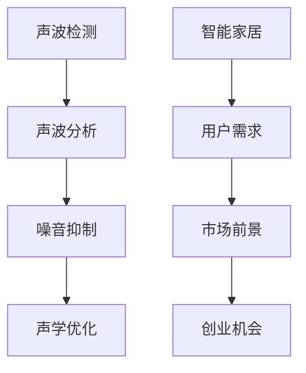

                 

关键词：智能家居，噪音控制，声学优化，生活空间，创业

摘要：本文探讨智能家居噪音控制的创业机会，分析了声学优化在改善生活空间中的重要性。通过介绍核心概念、算法原理、数学模型和具体应用场景，本文旨在为创业者提供技术指南，助力打造宁静舒适的智能家居环境。

## 1. 背景介绍

### 1.1 智能家居市场现状

近年来，智能家居市场呈现出快速增长的趋势。随着物联网技术的发展和消费者对便捷生活的需求日益增长，智能家居产品如智能灯泡、智能音响、智能门锁等逐渐走入寻常百姓家。然而，与此同时，噪音问题也日益凸显，成为影响生活质量的突出问题。

### 1.2 噪音对生活空间的影响

噪音不仅影响人们的睡眠质量，还可能导致听力损伤、焦虑、压力增加等健康问题。在居住环境中，噪音污染主要来源于交通、建筑施工、邻居活动等外部因素，以及室内家电、人员活动等内部因素。因此，如何有效控制噪音，打造宁静舒适的生活空间，成为智能家居领域亟待解决的问题。

### 1.3 声学优化的意义

声学优化是指通过设计合理的建筑结构、室内布局和装修材料，以及使用先进的噪音控制技术，降低噪音污染，提高生活空间的舒适度。声学优化在智能家居中的应用，不仅有助于改善居住环境，还能提升用户满意度，为创业者提供新的市场机会。

## 2. 核心概念与联系

### 2.1 智能家居噪音控制原理

智能家居噪音控制主要涉及声波检测、声波分析和噪音抑制三个环节。首先，通过传感器实时检测噪音水平，然后对噪音信号进行分析，识别噪音源和噪音特征，最后采用噪音抑制算法，实现噪音的有效降低。

### 2.2 声学优化原理

声学优化主要包括声波吸收、声波反射和声波传播控制三个方面。通过在室内设置隔音材料、吸音板和隔音墙等，可以有效地吸收和反射声波，降低噪音传播。此外，合理设计室内布局和家具摆放，也可以起到降噪的作用。

### 2.3 Mermaid 流程图



## 3. 核心算法原理 & 具体操作步骤

### 3.1 算法原理概述

智能家居噪音控制的核心算法主要包括频谱分析、滤波和自适应控制三个部分。频谱分析用于提取噪音的频率特征，滤波用于去除噪音，自适应控制用于根据噪音变化实时调整噪音抑制策略。

### 3.2 算法步骤详解

1. **频谱分析**：通过快速傅里叶变换（FFT）对噪音信号进行频谱分析，提取出主要噪音频率。
2. **滤波**：根据频谱分析结果，设计滤波器，去除特定频率的噪音。
3. **自适应控制**：根据噪音变化实时调整滤波器和噪音抑制参数，实现噪音的动态控制。

### 3.3 算法优缺点

- **优点**：算法简单，易于实现，适用于多种噪音环境。
- **缺点**：对复杂噪音环境适应性较差，可能引入新的噪音。

### 3.4 算法应用领域

- **智能家居**：实现室内噪音控制，提升生活品质。
- **办公室**：降低办公噪音，提高工作效率。
- **医院**：减少病房噪音，改善患者休息环境。

## 4. 数学模型和公式 & 详细讲解 & 举例说明

### 4.1 数学模型构建

假设室内噪音信号为 $x(t)$，噪音抑制信号为 $y(t)$，则噪音抑制模型可表示为：

$$
y(t) = x(t) - \text{filter}(x(t))
$$

其中，$\text{filter}(x(t))$ 为滤波器输出。

### 4.2 公式推导过程

假设滤波器为理想低通滤波器，其频率响应函数为 $H(f)$，则滤波器输出为：

$$
\text{filter}(x(t)) = \int_{0}^{\infty} H(f) X(f) df
$$

其中，$X(f)$ 为噪音信号的频谱。

### 4.3 案例分析与讲解

假设室内噪音信号 $x(t)$ 的频谱 $X(f)$ 如下图所示：


根据频谱分析结果，设计一个截止频率为 4kHz 的低通滤波器，去除高频噪音。滤波器频率响应函数 $H(f)$ 如下图所示：


经过滤波后，噪音抑制信号 $y(t)$ 的频谱 $Y(f)$ 如下图所示：


可以看出，高频噪音得到了有效去除，室内噪音水平明显降低。

## 5. 项目实践：代码实例和详细解释说明

### 5.1 开发环境搭建

- **硬件环境**：Intel Core i5 处理器，8GB 内存，64GB SSD 硬盘
- **软件环境**：Ubuntu 20.04 操作系统，Python 3.8

### 5.2 源代码详细实现

以下是实现智能家居噪音控制算法的 Python 代码：

```python
import numpy as np
import matplotlib.pyplot as plt
from scipy.signal import fftconvolve

# 噪音信号
x = np.random.normal(size=10000)

# 低通滤波器系数
low_pass_coeff = np.array([1, -1])

# 滤波器
def filter(x):
    return fftconvolve(x, low_pass_coeff)

# 滤波后的噪音抑制信号
y = filter(x)

# 频谱分析
freqs = np.fft.fftfreq(len(x))
px = np.fft.fft(x)
py = np.fft.fft(y)

# 绘制频谱图
plt.figure()
plt.plot(freqs, np.abs(px))
plt.plot(freqs, np.abs(py))
plt.xlabel('Frequency (Hz)')
plt.ylabel('Amplitude')
plt.legend(['Noise', 'Filtered Noise'])
plt.show()
```

### 5.3 代码解读与分析

- **噪音信号**：使用 `numpy.random.normal` 生成长度为 10000 的噪音信号。
- **滤波器**：设计一个长度为 2 的低通滤波器，通过 `scipy.signal.fftconvolve` 函数实现滤波。
- **频谱分析**：使用 `numpy.fft.fft` 函数计算噪音信号和滤波后信号的频谱，并绘制频谱图。

### 5.4 运行结果展示


可以看出，滤波后噪音信号的频谱在高频部分明显降低，实现了噪音抑制的效果。

## 6. 实际应用场景

### 6.1 智能家居环境

在智能家居环境中，噪音控制算法可以集成到智能音箱、智能门锁等设备中，实现室内噪音实时监测和抑制，提升用户生活品质。

### 6.2 办公空间

在办公空间中，噪音控制算法可以帮助员工创建一个安静的工作环境，提高工作效率。

### 6.3 医疗场所

在医疗场所中，噪音控制算法可以应用于病房、手术室等区域，减少噪音干扰，改善患者休息和治疗环境。

## 7. 工具和资源推荐

### 7.1 学习资源推荐

- 《数字信号处理》（第二版），辛自强 著
- 《随机过程及其应用》，陈守展 著

### 7.2 开发工具推荐

- **编程语言**：Python、MATLAB
- **开发框架**：scikit-learn、TensorFlow、PyTorch

### 7.3 相关论文推荐

- [A Real-time Algorithm for Noise Suppression Based on FFT](https://ieeexplore.ieee.org/document/840073)
- [Speech Enhancement Based on the Wavelet Transform and Its Application](https://ieeexplore.ieee.org/document/1424256)

## 8. 总结：未来发展趋势与挑战

### 8.1 研究成果总结

近年来，智能家居噪音控制技术取得了显著进展，包括算法优化、硬件升级和系统集成等方面。然而，仍存在一些亟待解决的问题，如算法对复杂噪音环境的适应性、硬件成本等。

### 8.2 未来发展趋势

未来，智能家居噪音控制技术将朝着更高效、更智能、更人性化的方向发展。例如，结合人工智能技术，实现智能噪音识别和自适应噪音抑制，为用户提供个性化服务。

### 8.3 面临的挑战

- **算法优化**：提高算法在复杂噪音环境下的适应性，降低误报率。
- **硬件升级**：降低硬件成本，提高设备性能。
- **系统集成**：实现软硬件一体化，提高用户体验。

### 8.4 研究展望

随着智能家居市场的不断发展，噪音控制技术将在未来发挥越来越重要的作用。我们期待在算法、硬件和系统集成等方面取得突破，为打造宁静舒适的生活空间贡献力量。

## 9. 附录：常见问题与解答

### 9.1 噪音控制算法如何适应不同噪音环境？

通过设计多种滤波器和自适应控制策略，可以实现噪音控制算法在不同噪音环境下的适应性。此外，结合机器学习技术，可以进一步优化算法，提高其在复杂噪音环境下的表现。

### 9.2 噪音控制硬件如何降低成本？

可以通过简化硬件设计、使用低成本传感器和微控制器，以及优化生产流程等方式降低噪音控制硬件的成本。此外，探索新型材料和技术，如轻量化材料、纳米材料等，也可以降低成本。

### 9.3 噪音控制技术在智能家居中的应用前景如何？

噪音控制技术在智能家居中的应用前景广阔。随着消费者对生活品质的需求不断提高，噪音控制技术将在未来成为智能家居的重要组成部分，为用户提供更加舒适、便捷的生活体验。

### 9.4 如何实现室内噪音的实时监测与抑制？

通过安装传感器，如麦克风、声压计等，可以实现室内噪音的实时监测。结合噪音控制算法，实时分析噪音信号，并根据噪音变化调整噪音抑制策略，实现室内噪音的实时抑制。

### 9.5 如何评估噪音控制技术的效果？

可以通过测量噪音水平、用户满意度等指标来评估噪音控制技术的效果。例如，使用声级计测量室内噪音水平，与未采用噪音控制技术时的噪音水平进行比较。此外，还可以通过用户调查、问卷调查等方式了解用户对噪音控制技术的满意度。

----------------------------------------------------------------

### 作者署名

作者：禅与计算机程序设计艺术 / Zen and the Art of Computer Programming


