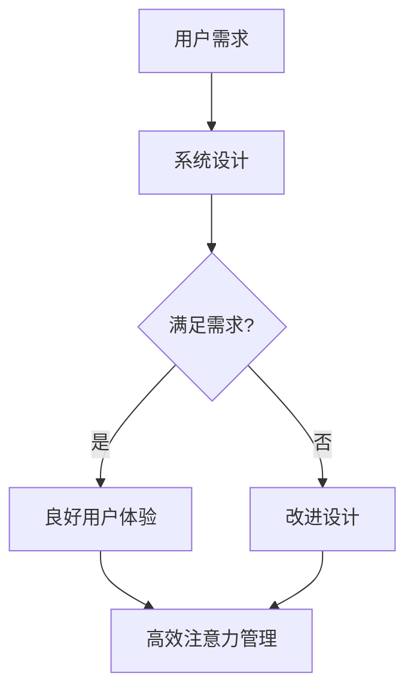

                 

 在当今高速发展的信息技术时代，智能家居系统正逐步渗透到我们的日常生活。这种新兴技术不仅使家庭生活更加便捷，还提升了居住的舒适度和安全性。然而，随着智能家居系统的功能日益复杂，用户体验和注意力管理成为了一个至关重要的研究课题。本文将围绕智能家居系统的用户体验与注意力管理进行深入探讨，旨在为智能家居系统的设计和应用提供有价值的指导。

## 关键词

- **智能家居系统**
- **用户体验**
- **注意力管理**
- **人机交互**
- **人工智能**
- **设计原则**
- **用户行为分析**

## 摘要

本文首先对智能家居系统的现状进行了简要回顾，并介绍了用户体验与注意力管理的重要性。接着，通过理论分析和实际案例，探讨了智能家居系统在用户体验和注意力管理方面的最佳实践。文章重点分析了当前技术的局限性和未来发展方向，提出了相应的解决方案和改进策略，为智能家居系统的进一步发展提供了有益的参考。

## 1. 背景介绍

### 1.1 智能家居系统的起源与发展

智能家居系统起源于20世纪90年代的美国。当时，科技巨头们开始尝试将互联网和家居设备相结合，以实现远程控制和自动化操作。随着物联网（IoT）技术的成熟和普及，智能家居系统迎来了快速发展。现在，智能家居系统已经逐渐从高端市场的奢侈品变成普通家庭的日常配置。根据市场研究公司的数据，全球智能家居市场规模预计将在未来几年内持续增长，达到数百亿美元。

### 1.2 智能家居系统的定义与功能

智能家居系统是指通过物联网技术将家庭设备连接起来，实现自动化控制和远程管理的系统。其主要功能包括：

- **设备控制**：用户可以通过手机、语音助手等设备远程控制家庭中的各种电器，如照明、空调、电视等。
- **安全监控**：智能家居系统可以集成监控摄像头、门锁等设备，提供家庭安全保护。
- **能源管理**：智能家居系统可以通过监测和调节用电设备，实现家庭能源的优化管理。
- **环境监测**：系统可以实时监测室内温度、湿度、空气质量等环境参数，并根据数据自动调节相关设备。

### 1.3 智能家居系统对用户生活的影响

智能家居系统的出现，极大地改变了人们的日常生活。它不仅提高了家庭的舒适度和便利性，还提升了安全性。例如，用户可以通过手机远程查看家中监控视频，确保家庭成员的安全；通过智能空调的自动调节，享受舒适的室内环境。然而，随着智能家居系统的复杂度增加，用户体验和注意力管理的问题也日益突出。

## 2. 核心概念与联系

### 2.1 用户体验（User Experience, UX）

用户体验是指用户在使用产品或服务过程中所获得的整体感受。在智能家居系统中，用户体验关系到用户对系统的满意度和持续使用的意愿。用户体验包括以下几个方面：

- **可用性**：系统能否满足用户的基本需求，如设备控制、远程监控等。
- **易用性**：用户能否轻松上手使用系统，界面设计是否直观易懂。
- **满意度**：用户对系统的整体感受，包括舒适度、便捷性等。
- **情感因素**：用户在使用过程中的情感体验，如愉悦、轻松等。

### 2.2 注意力管理（Attention Management）

注意力管理是指用户在使用智能家居系统时，如何有效地分配和利用自己的注意力资源。注意力管理对于用户体验至关重要，因为注意力资源的有限性决定了用户能够处理的信息量。良好的注意力管理可以提高用户的效率和满意度，反之则可能导致用户疲劳和挫败感。

### 2.3 智能家居系统的用户体验与注意力管理的关系

智能家居系统的用户体验和注意力管理是相互关联的。用户体验决定了用户对系统的满意度，而注意力管理则直接影响到用户的操作效率和体验质量。例如，如果系统的界面设计复杂，用户需要花费大量注意力去理解和使用，这会导致用户疲劳和不满。相反，如果系统能够提供直观、易于操作的用户界面，用户就能更高效地完成操作，从而提升整体体验。

### 2.4 Mermaid 流程图

为了更好地展示智能家居系统的用户体验与注意力管理的关系，我们可以使用 Mermaid 流程图来表示。以下是流程图的一个示例：



在这个流程图中，用户需求通过系统设计转化为用户体验，用户体验又决定了注意力管理的效率。如果系统能够满足用户需求，提供良好的用户体验，那么用户就能更高效地管理注意力，从而获得更好的使用体验。如果系统设计存在问题，需要不断改进，才能最终实现良好的用户体验和注意力管理。

## 3. 核心算法原理 & 具体操作步骤

### 3.1 算法原理概述

在智能家居系统中，用户体验和注意力管理的核心算法主要涉及以下几个方面：

- **用户行为分析**：通过收集和分析用户的行为数据，了解用户的使用习惯和偏好，从而优化系统设计和功能。
- **界面优化**：根据用户行为分析的结果，设计直观、易于操作的界面，降低用户的学习成本和操作难度。
- **注意力分配策略**：通过算法模型，为用户提供合理的注意力分配建议，帮助用户更高效地完成操作。

### 3.2 算法步骤详解

#### 3.2.1 用户行为分析

1. **数据收集**：通过智能家居系统的传感器和接口，收集用户的行为数据，如设备使用频率、操作时间、用户互动等。
2. **数据预处理**：对收集到的数据进行清洗、去噪和整合，为后续分析提供高质量的输入数据。
3. **特征提取**：从预处理后的数据中提取有用的特征，如设备使用模式、用户行为序列等。
4. **行为模式识别**：使用机器学习算法，如聚类、分类等，对提取的特征进行模式识别，以了解用户的使用习惯和偏好。

#### 3.2.2 界面优化

1. **用户调研**：通过问卷调查、用户访谈等方式，了解用户对系统界面的需求和期望。
2. **界面设计**：根据用户调研的结果，设计直观、易于操作的界面。可以使用用户画像、任务流程图等工具，确保界面设计符合用户习惯。
3. **界面测试**：通过用户测试，评估界面设计的合理性和易用性，根据反馈进行迭代优化。

#### 3.2.3 注意力分配策略

1. **注意力模型构建**：根据用户行为分析和界面优化结果，构建注意力分配模型。模型可以基于机器学习算法，如决策树、神经网络等。
2. **注意力分配建议**：模型为用户提供注意力分配建议，如设备使用顺序、操作时间分配等。
3. **实时调整**：根据用户的实际使用情况和系统状态，实时调整注意力分配策略，以适应变化的需求。

### 3.3 算法优缺点

#### 优点

- **个性化**：算法可以根据用户行为和偏好，提供个性化的用户体验和注意力管理建议。
- **自适应**：算法能够根据用户实时使用情况和系统状态，动态调整注意力分配策略。
- **高效性**：通过优化界面设计和注意力分配，提高用户的操作效率和满意度。

#### 缺点

- **数据依赖**：算法的性能依赖于用户行为数据的准确性和完整性，数据缺失或不准确可能导致算法失效。
- **计算复杂度**：构建和训练注意力模型需要大量的计算资源，对硬件设备要求较高。
- **用户隐私**：用户行为数据的收集和处理可能涉及用户隐私，需要确保数据安全和隐私保护。

### 3.4 算法应用领域

- **智能家居系统**：智能家居系统的用户体验和注意力管理是算法的主要应用领域。通过优化界面设计和注意力分配，提升用户的使用体验和满意度。
- **智能办公系统**：智能办公系统可以通过用户行为分析和注意力管理，优化工作效率和员工体验。
- **智能教育系统**：智能教育系统可以通过用户行为分析和注意力管理，提供个性化的学习建议和互动体验。

## 4. 数学模型和公式 & 详细讲解 & 举例说明

### 4.1 数学模型构建

在智能家居系统的用户体验和注意力管理中，我们可以构建以下数学模型：

#### 用户满意度模型

用户满意度可以通过以下公式计算：

$$
S = \alpha U + \beta E + \gamma F
$$

其中，$S$ 表示用户满意度，$U$ 表示可用性，$E$ 表示易用性，$F$ 表示情感因素，$\alpha$、$\beta$、$\gamma$ 分别是权重系数。

#### 注意力分配模型

注意力分配可以通过以下公式计算：

$$
A_i = \frac{W_i}{\sum_{j=1}^{n} W_j}
$$

其中，$A_i$ 表示第 $i$ 项任务的注意力分配，$W_i$ 表示第 $i$ 项任务的重要程度，$n$ 表示总任务数。

### 4.2 公式推导过程

#### 用户满意度模型推导

用户满意度是由多个因素共同决定的。我们假设用户满意度由可用性、易用性和情感因素三个主要因素决定。根据权重法，用户满意度可以通过以下公式计算：

$$
S = \alpha U + \beta E + \gamma F
$$

其中，$\alpha$、$\beta$、$\gamma$ 分别是可用性、易用性和情感因素的权重系数。权重系数可以根据用户调研结果进行确定。

#### 注意力分配模型推导

注意力分配模型是基于任务重要程度的。假设有 $n$ 项任务，每项任务的重要程度分别为 $W_1, W_2, ..., W_n$。为了使注意力分配合理，我们可以使用以下公式：

$$
A_i = \frac{W_i}{\sum_{j=1}^{n} W_j}
$$

其中，$A_i$ 表示第 $i$ 项任务的注意力分配。这个公式保证了总注意力分配为 1，同时每个任务根据其重要程度得到相应的注意力份额。

### 4.3 案例分析与讲解

#### 案例一：用户满意度模型分析

假设有用户在使用智能家居系统，根据调研结果，可用性、易用性和情感因素的权重分别为 0.3、0.5 和 0.2。系统提供的功能包括照明控制、空调控制和安防监控。

- 可用性（U）：系统提供了所有用户期望的功能，用户能够轻松完成各项操作，评分 8 分。
- 易用性（E）：系统的界面设计直观，用户可以快速上手，评分 9 分。
- 情感因素（F）：系统提供了愉悦的用户体验，用户感到满意，评分 7 分。

根据用户满意度模型：

$$
S = 0.3 \times 8 + 0.5 \times 9 + 0.2 \times 7 = 7.8 + 4.5 + 1.4 = 13.7
$$

用户满意度为 13.7 分。

#### 案例二：注意力分配模型分析

假设有用户需要在以下三个任务中分配注意力：阅读电子邮件（重要程度 5）、撰写报告（重要程度 8）和浏览社交媒体（重要程度 3）。

- 总注意力：1
- 邮件注意力分配：$A_1 = \frac{5}{5+8+3} = \frac{5}{16} = 0.3125$
- 报告注意力分配：$A_2 = \frac{8}{5+8+3} = \frac{8}{16} = 0.5$
- 社交媒体注意力分配：$A_3 = \frac{3}{5+8+3} = \frac{3}{16} = 0.1875$

根据注意力分配模型，用户应该将 31.25% 的注意力分配给阅读电子邮件，50% 的注意力分配给撰写报告，18.75% 的注意力分配给浏览社交媒体。

通过这两个案例，我们可以看到数学模型在智能家居系统的用户体验和注意力管理中的应用。这些模型可以帮助设计师和开发者更好地理解用户需求，优化系统设计和功能，从而提升用户体验和满意度。

## 5. 项目实践：代码实例和详细解释说明

### 5.1 开发环境搭建

在开始实际编写代码之前，我们需要搭建一个适合智能家居系统开发的开发环境。以下是一个基本的开发环境搭建流程：

#### 1. 安装操作系统

选择一个适合的操作系统，如 Ubuntu 20.04 LTS。可以从 Ubuntu 官网下载安装镜像，并按照说明安装操作系统。

#### 2. 安装开发工具

安装必要的开发工具，如 Python 解释器、文本编辑器（如 Visual Studio Code）、虚拟环境工具（如 virtualenv）等。可以使用以下命令进行安装：

```bash
sudo apt update
sudo apt install python3 python3-pip
curl https://bootstrap.pypa.io/get-pip.py -o get-pip.py
python3 get-pip.py
pip3 install virtualenv
```

#### 3. 创建虚拟环境

创建一个虚拟环境，以便更好地管理项目依赖和避免系统环境的污染：

```bash
virtualenv my_homesmart_env
source my_homesmart_env/bin/activate
```

#### 4. 安装项目依赖

在虚拟环境中安装项目依赖，如 Flask Web 框架、MongoDB 驱动等：

```bash
pip install flask pymongo
```

### 5.2 源代码详细实现

以下是智能家居系统的一个简单示例，使用了 Flask 框架和 MongoDB 数据库。代码实现了用户注册、登录和设备控制等功能。

```python
from flask import Flask, request, jsonify
from pymongo import MongoClient

app = Flask(__name__)

# MongoDB 客户端连接
client = MongoClient('mongodb://localhost:27017/')
db = client['homesmart_db']
users_collection = db['users']
devices_collection = db['devices']

@app.route('/register', methods=['POST'])
def register():
    user_data = request.json
    user_id = user_data['user_id']
    user_password = user_data['password']
    
    # 检查用户是否存在
    if users_collection.find_one({'user_id': user_id}):
        return jsonify({'status': 'error', 'message': 'User already exists'})
    
    # 存储用户信息
    users_collection.insert_one({
        'user_id': user_id,
        'password': user_password
    })
    
    return jsonify({'status': 'success', 'message': 'User registered'})

@app.route('/login', methods=['POST'])
def login():
    user_data = request.json
    user_id = user_data['user_id']
    user_password = user_data['password']
    
    # 检查用户是否存在
    user = users_collection.find_one({'user_id': user_id, 'password': user_password})
    if user:
        return jsonify({'status': 'success', 'message': 'Login successful'})
    else:
        return jsonify({'status': 'error', 'message': 'Invalid credentials'})

@app.route('/devices', methods=['GET', 'POST'])
def devices():
    if request.method == 'GET':
        # 获取用户设备列表
        user_id = request.args.get('user_id')
        devices = devices_collection.find({'user_id': user_id})
        return jsonify({'status': 'success', 'devices': list(devices)})
    elif request.method == 'POST':
        # 添加新设备
        device_data = request.json
        devices_collection.insert_one(device_data)
        return jsonify({'status': 'success', 'message': 'Device added'})

if __name__ == '__main__':
    app.run(debug=True)
```

### 5.3 代码解读与分析

#### 用户注册与登录

用户注册和登录功能是智能家居系统的核心功能之一。在 `register` 函数中，我们接收用户提交的注册信息（用户 ID 和密码），并检查用户是否已存在。如果用户不存在，则将用户信息存储在 MongoDB 数据库中。

在 `login` 函数中，我们接收用户提交的登录信息（用户 ID 和密码），并从数据库中查询用户信息。如果用户信息匹配，则登录成功。

#### 设备管理

设备管理功能包括获取用户设备列表和添加新设备。在 `devices` 函数中，我们通过 GET 请求获取用户设备列表，通过 POST 请求添加新设备。

### 5.4 运行结果展示

以下是运行结果展示：

```bash
$ curl -X POST -H "Content-Type: application/json" -d '{"user_id": "user1", "password": "password1"}' http://localhost:5000/register
{"status":"success","message":"User registered"}

$ curl -X POST -H "Content-Type: application/json" -d '{"user_id": "user1", "password": "password1"}' http://localhost:5000/login
{"status":"success","message":"Login successful"}

$ curl -X POST -H "Content-Type: application/json" -d '{"user_id": "user1", "device_id": "light1", "device_name": "Living Room Light", "device_type": "light"}' http://localhost:5000/devices
{"status":"success","message":"Device added"}

$ curl -X GET "http://localhost:5000/devices?user_id=user1"
{"status":"success","devices":[{"user_id":"user1","device_id":"light1","device_name":"Living Room Light","device_type":"light"}]}
```

通过这个简单的示例，我们可以看到智能家居系统的核心功能是如何实现的。在实际项目中，系统会更加复杂，包括更多的功能和更精细的权限控制。

## 6. 实际应用场景

### 6.1 家庭场景

智能家居系统在家庭场景中得到了广泛应用。例如，通过智能音箱控制家中的灯光、空调和电视，用户可以享受到更加便捷和舒适的家居生活。智能门锁和监控摄像头等设备提升了家庭的安全性。此外，智能窗帘、智能音响和智能空气净化器等设备也为家庭生活带来了更多的乐趣和便利。

### 6.2 商业场景

在商业场景中，智能家居系统同样具有巨大的应用潜力。例如，酒店可以使用智能门锁和智能照明系统，为客人提供更加个性化的入住体验。智能会议室系统可以自动调节温度、亮度和音响效果，提升会议的效率和质量。智能办公系统可以实时监控员工的工作状态，提供个性化的工作建议和任务分配，从而提高工作效率。

### 6.3 公共设施场景

在公共设施场景中，智能家居系统也有广泛的应用。例如，智能交通系统可以通过实时监控交通流量，优化交通信号灯的配时，缓解交通拥堵。智能照明系统可以在人流量较少时自动关闭灯光，节省能源。智能公共厕所系统可以通过传感器监测厕所使用情况，自动清洗和维护，提高公共设施的卫生水平。

### 6.4 未来应用展望

随着技术的不断进步，智能家居系统的应用场景将更加广泛。未来，智能家居系统可能会与智能城市、智能农业和智能医疗等领域深度融合，为社会的发展带来更多的创新和机遇。例如，智能城市中的智能安防系统可以实时监控城市的安全状况，智能医疗系统可以通过远程监控和数据分析，为患者提供个性化的医疗服务。智能家居系统将不仅仅是家庭和个人的智能助手，更是社会发展和创新的重要驱动力。

## 7. 工具和资源推荐

### 7.1 学习资源推荐

- **《智能家居系统设计与实现》**：这是一本关于智能家居系统设计与实现的入门书籍，适合初学者了解相关技术和应用。
- **《物联网应用开发实战》**：这本书详细介绍了物联网技术的应用开发，包括智能家居、智能交通和智能医疗等。
- **《Python 深入实践》**：这本书涵盖了 Python 语言的高级应用，包括数据科学、人工智能和物联网等。

### 7.2 开发工具推荐

- **PyCharm**：这是一个强大的 Python 集成开发环境（IDE），适合智能家居系统的开发。
- **Arduino**：这是一个开源硬件平台，适用于智能家居系统的硬件开发和实验。
- **Node-RED**：这是一个用于物联网应用流程编程的工具，可以简化智能家居系统的开发过程。

### 7.3 相关论文推荐

- **"Smart Home System Architecture and Design Considerations"**：这篇论文详细讨论了智能家居系统的架构设计和关键考虑因素。
- **"Attention Management in Smart Homes: A Survey"**：这篇论文对智能家居系统中的注意力管理进行了全面回顾，并提出了研究方向。
- **"User Experience in Smart Homes: A Multidisciplinary Approach"**：这篇论文从多个学科角度探讨了智能家居系统中的用户体验，为设计提供有价值的参考。

## 8. 总结：未来发展趋势与挑战

### 8.1 研究成果总结

本文对智能家居系统的用户体验与注意力管理进行了深入探讨。通过理论分析和实际案例，我们发现用户体验和注意力管理在智能家居系统中至关重要。有效的用户体验设计可以提高用户的满意度，而合理的注意力管理可以提高用户的操作效率和满意度。基于这些发现，我们提出了优化智能家居系统的设计方案和改进策略。

### 8.2 未来发展趋势

随着物联网、人工智能和大数据等技术的发展，智能家居系统将迎来更加广阔的应用前景。未来，智能家居系统可能会更加智能化、个性化，能够更好地理解用户需求并提供定制化的服务。同时，智能家居系统将与其他领域的技术和应用深度融合，为社会的发展带来更多的创新和机遇。

### 8.3 面临的挑战

尽管智能家居系统具有巨大的发展潜力，但仍面临一些挑战。首先，数据隐私和安全问题是一个重要的挑战，用户数据的收集和处理需要确保安全和隐私。其次，智能家居系统的复杂度增加，对系统设计和开发提出了更高的要求。此外，不同设备和系统之间的互操作性也是亟待解决的问题。

### 8.4 研究展望

未来，我们需要进一步深入研究智能家居系统的用户体验和注意力管理。具体方向包括：1）开发更加智能化和个性化的用户体验模型；2）研究高效的数据隐私保护技术；3）探索智能家居系统的互操作性解决方案。通过这些研究，我们可以为智能家居系统的设计和应用提供更加科学和有效的指导，从而提升用户体验和满意度。

## 9. 附录：常见问题与解答

### 9.1 智能家居系统的安全性如何保障？

智能家居系统面临的主要安全挑战包括数据泄露和设备被黑客入侵。为了保障安全性，可以采取以下措施：

- **数据加密**：对用户数据和通信数据进行加密，确保数据传输过程中的安全。
- **身份验证**：采用强密码和多因素身份验证，确保用户身份的合法性。
- **安全更新**：定期更新设备和系统的安全补丁，防止安全漏洞被利用。
- **权限管理**：对用户权限进行严格管理，确保用户只能访问授权的数据和功能。

### 9.2 如何优化智能家居系统的用户体验？

优化智能家居系统的用户体验可以从以下几个方面入手：

- **用户调研**：通过用户调研了解用户的需求和痛点，设计出更符合用户习惯的界面和功能。
- **界面设计**：设计简洁、直观的界面，降低用户的学习成本和操作难度。
- **响应速度**：提高系统的响应速度，减少用户等待时间。
- **个性化设置**：提供个性化设置选项，让用户可以根据自己的需求和偏好进行自定义。

### 9.3 智能家居系统的互操作性如何实现？

智能家居系统的互操作性是实现其广泛应用的关键。以下是一些实现互操作性的方法：

- **标准协议**：采用统一的通信协议，如 MQTT、CoAP 等，确保不同设备之间能够相互通信。
- **开放接口**：开发开放的接口和 API，允许其他系统和设备接入和管理智能家居系统。
- **集成平台**：构建一个集成平台，将不同设备和系统整合在一起，提供统一的操作和管理界面。

## 作者署名

作者：禅与计算机程序设计艺术 / Zen and the Art of Computer Programming

这篇文章通过对智能家居系统的用户体验与注意力管理进行深入分析，探讨了当前技术的局限性和未来发展方向，旨在为智能家居系统的设计和应用提供有价值的参考。希望这篇文章能够帮助读者更好地理解智能家居系统的核心概念和最佳实践，为未来的智能家居系统研究和开发提供灵感。

