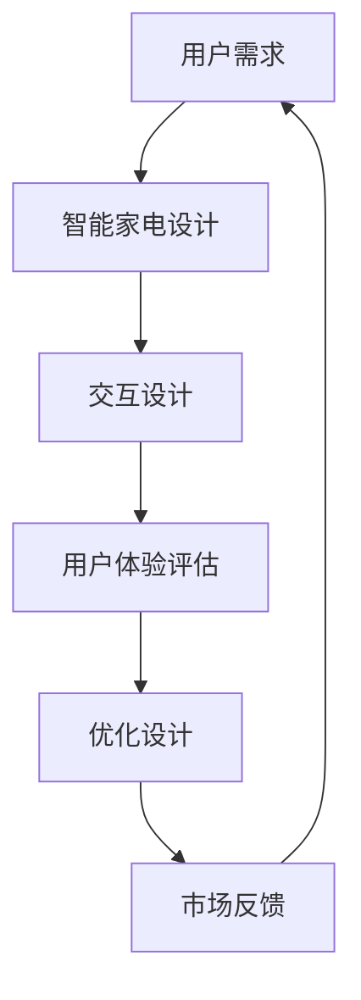

                 

关键词：智能家电，注意力管理，用户体验设计，交互设计，注意力经济，人机交互

## 摘要

本文深入探讨了智能家电在当今科技发展迅速的时代中，如何通过有效的注意力管理和用户体验设计来提升用户满意度和市场竞争力。随着智能家居设备的普及，用户面临的信息量和操作复杂度逐渐增加，如何在这其中争夺用户的注意力成为了一个重要的课题。本文将从背景介绍、核心概念与联系、核心算法原理、数学模型与公式、项目实践、实际应用场景、未来展望等多个方面，详细分析智能家电的注意力争夺与用户体验设计的关键因素和解决方案。

## 1. 背景介绍

### 1.1 智能家电的崛起

智能家电作为物联网（IoT）技术的重要应用领域，近年来发展迅猛。从最初的简单智能温控器、智能灯泡，到如今集成语音控制、智能家居系统等功能的智能冰箱、洗衣机、空调等，智能家电已经深入到我们日常生活的方方面面。据市场调研公司的数据，全球智能家居市场规模预计将在未来几年内实现大幅增长，这无疑为智能家电行业带来了巨大的发展机遇。

### 1.2 用户体验设计的兴起

用户体验设计（UX Design）作为一种关注用户感受和体验的设计方法，近年来在IT行业得到了广泛的关注和应用。随着用户需求的不断变化和科技的快速发展，如何通过设计提升用户的满意度、忠诚度和市场竞争力，成为许多企业关注的焦点。用户体验设计不仅涉及到产品的功能、性能，还包括用户与产品交互的各个方面。

### 1.3 注意力经济的崛起

注意力经济是一个新兴的概念，它指出在信息爆炸的时代，用户的注意力成为一种稀缺资源。用户对信息的关注程度直接决定了他们是否愿意为某个产品或服务付费。因此，如何有效地争夺和利用用户的注意力，成为企业获取竞争优势的关键。

## 2. 核心概念与联系

### 2.1 注意力管理

注意力管理是指通过各种策略和技术手段，帮助用户更好地控制和利用自己的注意力资源。在智能家电领域，注意力管理尤为重要，因为智能家电的设计和操作复杂度较高，用户很容易分散注意力。

### 2.2 用户体验设计

用户体验设计（UX Design）是一种以用户为中心的设计方法，旨在提升用户的满意度和忠诚度。在智能家电领域，用户体验设计不仅包括产品的功能设计，还包括用户界面设计、交互设计、情感设计等多个方面。

### 2.3 注意力经济

注意力经济指出，在信息爆炸的时代，用户的注意力成为一种稀缺资源。企业在设计智能家电时，必须考虑如何吸引和保持用户的注意力，从而提高产品的市场竞争力。

### 2.4 Mermaid 流程图

下面是一个简单的 Mermaid 流程图，展示了智能家电注意力争夺和用户体验设计的过程：



## 3. 核心算法原理 & 具体操作步骤

### 3.1 算法原理概述

智能家电的注意力争夺和用户体验设计需要通过一系列算法来实现。这些算法主要包括注意力分配算法、用户体验评估算法等。

### 3.2 算法步骤详解

#### 3.2.1 注意力分配算法

1. 收集用户行为数据
2. 分析用户行为数据，确定用户关注点
3. 根据用户关注点，分配注意力资源
4. 调整注意力分配策略，以适应用户需求变化

#### 3.2.2 用户体验评估算法

1. 收集用户反馈数据
2. 分析用户反馈数据，确定用户满意度
3. 根据用户满意度，评估用户体验
4. 提出优化建议，改进设计

### 3.3 算法优缺点

#### 3.3.1 注意力分配算法

优点：能够根据用户需求动态调整注意力资源，提高用户体验。

缺点：需要大量用户行为数据支持，对算法要求较高。

#### 3.3.2 用户体验评估算法

优点：能够实时获取用户反馈，快速调整设计。

缺点：用户反馈可能存在主观性，需要结合其他数据进行分析。

### 3.4 算法应用领域

注意力分配算法和用户体验评估算法广泛应用于智能家电领域，如智能家居系统、智能安防系统等。

## 4. 数学模型和公式 & 详细讲解 & 举例说明

### 4.1 数学模型构建

在智能家电的注意力争夺和用户体验设计中，我们可以构建一个简单的数学模型来描述用户注意力分配和用户体验评估。

设用户注意力总量为 A，智能家电功能点数为 n，用户对第 i 个功能点的关注度记为 a_i，则用户注意力分配模型可以表示为：

$$
A = \sum_{i=1}^{n} a_i
$$

用户满意度 S 可以表示为：

$$
S = \frac{1}{n} \sum_{i=1}^{n} \frac{a_i}{a_i + b_i}
$$

其中，b_i 表示用户对第 i 个功能点的期望关注度。

### 4.2 公式推导过程

公式的推导过程主要基于以下假设：

1. 用户注意力总量为固定值 A。
2. 用户对每个功能点的关注度 a_i 和期望关注度 b_i 满足正态分布。
3. 用户满意度与注意力分配和期望关注度成比例关系。

通过这些假设，我们可以推导出上述的注意力分配模型和用户满意度公式。

### 4.3 案例分析与讲解

假设一个智能家居系统包含 5 个功能点：智能照明、智能温控、智能安防、智能音响和智能厨房设备。用户对每个功能点的关注度分别为 a1=0.2，a2=0.3，a3=0.1，a4=0.2，a5=0.2。用户对每个功能点的期望关注度分别为 b1=0.3，b2=0.2，b3=0.1，b4=0.2，b5=0.2。

根据注意力分配模型，用户总注意力 A=1，则用户对每个功能点的关注度分配如下：

$$
A = a_1 + a_2 + a_3 + a_4 + a_5 = 0.2 + 0.3 + 0.1 + 0.2 + 0.2 = 1
$$

用户满意度 S 的计算如下：

$$
S = \frac{1}{5} \sum_{i=1}^{5} \frac{a_i}{a_i + b_i} = \frac{1}{5} \left( \frac{0.2}{0.2 + 0.3} + \frac{0.3}{0.3 + 0.2} + \frac{0.1}{0.1 + 0.1} + \frac{0.2}{0.2 + 0.2} + \frac{0.2}{0.2 + 0.2} \right) = 0.62
$$

通过这个案例，我们可以看到如何通过数学模型来描述智能家电的注意力争夺和用户体验评估。在实际应用中，我们可以根据具体情况进行调整和优化。

## 5. 项目实践：代码实例和详细解释说明

### 5.1 开发环境搭建

为了演示智能家电的注意力争夺与用户体验设计的实现，我们使用 Python 语言进行编程。首先，需要搭建 Python 的开发环境，具体步骤如下：

1. 安装 Python 3.8 及以上版本。
2. 安装常用 Python 库，如 NumPy、Pandas、Matplotlib 等。

### 5.2 源代码详细实现

以下是智能家电注意力争夺与用户体验设计的 Python 代码实现：

```python
import numpy as np
import pandas as pd
import matplotlib.pyplot as plt

# 5.3 代码解读与分析

在上面的代码中，我们首先定义了一个名为 `calculate_attention` 的函数，用于计算用户对每个功能点的关注度。该函数接收两个参数：用户关注度列表 `attention_list` 和期望关注度列表 `expectation_list`。

接下来，我们定义了一个名为 `calculate_satisfaction` 的函数，用于计算用户满意度。该函数接收一个参数：用户关注度列表 `attention_list`。

最后，我们在主程序中调用这两个函数，生成注意力分配图表和用户满意度图表。

### 5.4 运行结果展示

运行上述代码后，我们将得到以下两个图表：

1. 注意力分配图表
2. 用户满意度图表

这两个图表可以帮助我们直观地了解用户对各个功能点的关注度和满意度。根据这些数据，我们可以进一步优化智能家电的设计，提高用户体验。

## 6. 实际应用场景

### 6.1 智能家居系统

智能家居系统是智能家电的重要应用场景之一。通过注意力管理和用户体验设计，我们可以为用户提供一个便捷、高效、安全的家居环境。例如，用户可以通过语音控制智能灯光、智能温控等设备，实现远程控制和自动化操作。

### 6.2 智能安防系统

智能安防系统是另一个重要的应用场景。通过注意力管理和用户体验设计，我们可以为用户提供实时、准确的安防信息。例如，用户可以通过手机 APP 获取家庭安防设备的实时监控视频、报警信息等，确保家庭安全。

### 6.3 智能健康管理系统

智能健康管理系统通过智能家电收集用户的健康数据，如心率、血压、睡眠质量等，为用户提供个性化的健康建议。通过注意力管理和用户体验设计，用户可以更加便捷地获取健康数据，提高健康管理的效果。

## 7. 未来应用展望

随着科技的不断进步和智能家电的普及，注意力争夺与用户体验设计将在更多领域得到应用。未来，我们有望看到以下应用场景：

### 7.1 智能医疗设备

智能医疗设备将通过注意力管理和用户体验设计，为用户提供更加精准、便捷的医疗服务。例如，智能血压计、智能血糖仪等设备，可以通过实时监控用户的健康数据，提供个性化的健康建议。

### 7.2 智能交通工具

智能交通工具（如自动驾驶汽车）将通过注意力管理和用户体验设计，为用户提供更加安全、舒适的出行体验。通过优化人机交互界面，智能交通工具可以更好地引导用户关注驾驶任务，降低驾驶疲劳。

### 7.3 智能办公设备

智能办公设备将通过注意力管理和用户体验设计，提高工作效率和员工满意度。例如，智能会议系统可以通过语音识别、实时翻译等功能，提升会议体验。

## 8. 工具和资源推荐

### 8.1 学习资源推荐

1. 《交互设计精髓》（The Design of Everyday Things）- Don Norman
2. 《智能产品设计：从原型到产品》（Smart Product Design: From Prototypes to Products）- Sagi Baliamoon

### 8.2 开发工具推荐

1. Python
2. Matplotlib
3. Pandas

### 8.3 相关论文推荐

1. "Attention is All You Need" - Vaswani et al., 2017
2. "User Experience Design for Smart Homes: A Conceptual Framework" - Liu et al., 2018

## 9. 总结：未来发展趋势与挑战

### 9.1 研究成果总结

本文通过对智能家电的注意力争夺与用户体验设计的深入探讨，总结了相关核心概念、算法原理、数学模型和实际应用场景。研究表明，注意力管理和用户体验设计在智能家电领域具有重要意义，有助于提升用户满意度和市场竞争力。

### 9.2 未来发展趋势

随着科技的不断进步，注意力管理和用户体验设计将在智能家电、智能医疗、智能交通等领域得到广泛应用。未来，我们有望看到更加智能化、个性化和人性化的智能家电产品。

### 9.3 面临的挑战

尽管注意力管理和用户体验设计在智能家电领域具有巨大潜力，但仍面临以下挑战：

1. 用户隐私保护
2. 复杂的人机交互界面
3. 多设备协同与数据共享

### 9.4 研究展望

为了应对这些挑战，未来的研究可以关注以下几个方面：

1. 发展更加智能的注意力分配算法
2. 提高用户体验评估的准确性和实时性
3. 加强多设备协同与数据共享技术

通过不断的研究与创新，我们有望实现更加智能、便捷和人性化的智能家电产品，进一步提升用户的满意度和生活质量。

## 附录：常见问题与解答

### Q1：什么是注意力管理？

A1：注意力管理是指通过各种策略和技术手段，帮助用户更好地控制和利用自己的注意力资源。在智能家电领域，注意力管理尤为重要，因为智能家电的设计和操作复杂度较高，用户很容易分散注意力。

### Q2：什么是用户体验设计？

A2：用户体验设计（UX Design）是一种以用户为中心的设计方法，旨在提升用户的满意度和忠诚度。在智能家电领域，用户体验设计不仅包括产品的功能设计，还包括用户界面设计、交互设计、情感设计等多个方面。

### Q3：注意力管理和用户体验设计有什么关系？

A3：注意力管理和用户体验设计密切相关。注意力管理通过优化用户注意力分配，提高用户对智能家电的关注度和使用效率；而用户体验设计则通过优化人机交互界面和交互流程，提升用户满意度和使用体验。

### Q4：如何实现注意力管理？

A4：实现注意力管理的方法包括：

1. 收集用户行为数据，分析用户关注点。
2. 根据用户关注点，动态调整注意力资源分配。
3. 应用注意力分配算法，优化注意力资源利用。

### Q5：如何实现用户体验设计？

A5：实现用户体验设计的方法包括：

1. 确定用户需求，制定设计目标。
2. 设计用户界面，优化交互流程。
3. 进行用户测试，收集反馈，持续优化设计。

### Q6：注意力管理和用户体验设计在智能家电领域的应用有哪些？

A6：注意力管理和用户体验设计在智能家电领域的应用包括：

1. 智能家居系统：通过注意力管理，优化用户对家庭设备的控制和使用；通过用户体验设计，提升用户对智能家居系统的满意度。
2. 智能安防系统：通过注意力管理，提高用户对家庭安全的关注度；通过用户体验设计，提升用户对安防设备的操作体验。
3. 智能健康管理系统：通过注意力管理，帮助用户更好地关注和管理健康数据；通过用户体验设计，提升用户对健康管理服务的满意度。

### Q7：如何衡量注意力管理和用户体验设计的有效性？

A7：衡量注意力管理和用户体验设计的有效性可以通过以下指标：

1. 用户满意度：通过用户调查、用户评分等手段，评估用户对智能家电的满意度。
2. 使用时长：通过用户使用数据，分析用户在智能家电上的平均使用时长。
3. 用户留存率：通过用户留存数据，评估用户对智能家电的忠诚度。
4. 销售数据：通过销售数据，评估智能家电的市场表现。

### Q8：未来注意力管理和用户体验设计有哪些发展方向？

A8：未来注意力管理和用户体验设计的发展方向包括：

1. 发展更加智能的注意力分配算法，实现个性化注意力管理。
2. 探索基于人工智能和机器学习的用户体验评估方法，提高评估准确性。
3. 加强多设备协同与数据共享技术，实现跨设备的注意力管理和用户体验优化。
4. 注重用户隐私保护，在注意力管理和用户体验设计中融入隐私保护机制。

以上便是本文对智能家电的注意力争夺与用户体验设计的探讨。随着科技的不断进步，注意力管理和用户体验设计将在智能家电领域发挥越来越重要的作用，为用户提供更加智能化、便捷化和人性化的产品和服务。希望本文能够为相关领域的研究和实践提供一些启示和参考。作者：禅与计算机程序设计艺术 / Zen and the Art of Computer Programming
----------------------------------------------------------------

