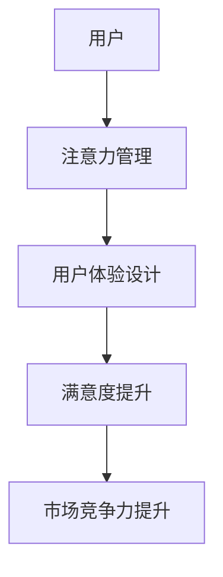

                 

关键词：智能家电、注意力管理、用户体验设计、交互设计、情感化设计、智能设备协同

> 摘要：随着智能家居市场的快速发展，智能家电产品日益丰富，用户面临着日益激烈的注意力争夺。本文将探讨智能家电如何通过注意力管理和用户体验设计来提高用户满意度，提升产品的市场竞争力。通过分析注意力争夺的现象和原因，提出一系列有效的用户体验设计策略，为智能家电产品的未来发展提供指导。

## 1. 背景介绍

在过去的几十年中，计算机技术的飞速发展带动了信息技术的革命，人工智能、物联网、大数据等新兴技术不断涌现，推动着传统家电向智能化、网络化方向发展。智能家电不仅具备传统家电的基本功能，还融合了物联网技术，可以通过智能手机、语音助手等设备进行远程控制，实现了真正的互联互通。然而，随着智能家电产品种类的增加，用户面临着日益复杂的交互环境和注意力分散的问题。如何在众多智能家电中脱颖而出，成为用户关注的焦点，成为智能家电企业面临的重要课题。

### 1.1 智能家电的发展历程

智能家电的发展历程可以分为三个阶段：

1. **第一阶段：互联网化**：家电产品通过嵌入Wi-Fi模块或蓝牙模块，实现与互联网的连接，用户可以通过智能手机或平板电脑远程控制家电设备。

2. **第二阶段：智能化**：智能家居系统开始出现，家电设备之间可以互相通信，协同工作，例如智能灯光、智能音响、智能空调等。

3. **第三阶段：智能化+人工智能**：家电设备具备自主学习能力，可以根据用户的生活习惯和偏好进行个性化设置，提供更贴心的服务。

### 1.2 注意力争夺的现象

智能家电的快速发展带来了注意力争夺的现象。用户在日常生活中需要关注多个智能设备，如智能电视、智能音响、智能冰箱等，这使得用户面临严重的注意力分散问题。研究表明，当人们同时关注多个任务时，大脑的处理能力会降低，导致工作效率下降。在智能家电领域，注意力争夺不仅影响了用户的使用体验，还可能对用户的健康产生负面影响。

### 1.3 用户体验设计的意义

用户体验设计（User Experience Design，简称UXD）是一种以用户为中心的设计方法，旨在提升用户在使用产品过程中的满意度。在智能家电领域，用户体验设计的重要性愈发凸显。通过优秀的用户体验设计，智能家电可以有效缓解注意力争夺问题，提高用户对产品的忠诚度和满意度，从而提升企业的市场竞争力和品牌价值。

## 2. 核心概念与联系

### 2.1 注意力管理

注意力管理是指通过有效的方法和策略，使大脑专注于特定的任务或目标，提高工作效率和质量。在智能家电领域，注意力管理的重要性不言而喻。通过注意力管理，用户可以更轻松地应对多个智能设备的交互，减少注意力分散带来的负面影响。

### 2.2 用户体验设计

用户体验设计（User Experience Design，简称UXD）是一种以用户为中心的设计方法，旨在提升用户在使用产品过程中的满意度。在智能家电领域，用户体验设计涉及多个方面，包括交互设计、情感化设计、界面设计等。

### 2.3 注意力争夺与用户体验设计的关系

注意力争夺与用户体验设计密切相关。当智能家电产品能够有效管理用户的注意力时，用户在使用过程中的满意度和忠诚度将得到显著提升。反之，如果智能家电产品无法有效管理用户的注意力，用户将面临严重的注意力分散问题，从而导致使用体验下降。

### 2.4 Mermaid 流程图

下面是一个简单的 Mermaid 流程图，展示了注意力争夺与用户体验设计之间的关系。



## 3. 核心算法原理 & 具体操作步骤

### 3.1 算法原理概述

智能家电的注意力管理算法主要基于以下几个原理：

1. **分时策略**：将用户的注意力分散到多个时间段，使每个时间段用户只需要关注一个或几个智能设备。

2. **优先级排序**：根据用户需求和使用频率，对智能设备进行优先级排序，确保用户在需要时能够快速找到并使用所需的设备。

3. **个性化推荐**：基于用户的使用数据和偏好，为用户推荐合适的智能设备，减少用户的注意力分散。

### 3.2 算法步骤详解

1. **数据收集与预处理**：收集用户的使用数据，包括设备使用频率、使用时间、用户偏好等，对数据进行预处理，去除噪声和异常值。

2. **分时策略**：根据用户的使用习惯，将一天的时间分为多个时间段，为每个时间段设定一个主设备和一个或几个辅助设备。

3. **优先级排序**：根据用户的使用数据，对智能设备进行优先级排序，确保用户在需要时能够快速找到并使用所需的设备。

4. **个性化推荐**：基于用户的使用数据和偏好，为用户推荐合适的智能设备。

### 3.3 算法优缺点

**优点**：

1. **降低用户注意力分散**：通过分时策略和个性化推荐，有效降低用户在多个智能设备之间的注意力分散。

2. **提高用户满意度**：根据用户需求和偏好，为用户推荐合适的智能设备，提高用户的使用体验和满意度。

**缺点**：

1. **数据收集与预处理难度大**：需要收集大量的用户使用数据，并对数据进行预处理，对数据质量和准确性要求较高。

2. **算法实现复杂**：分时策略和个性化推荐算法的实现相对复杂，需要较高的技术水平和计算资源。

### 3.4 算法应用领域

智能家电的注意力管理算法可以应用于多个领域，如智能家居、智能办公、智能医疗等。通过有效的注意力管理，可以提升用户的效率和质量，改善用户的生活和工作体验。

## 4. 数学模型和公式 & 详细讲解 & 举例说明

### 4.1 数学模型构建

智能家电的注意力管理可以看作是一个多目标优化问题，目标是最小化用户在多个智能设备之间的注意力分散。设 \(x_i\) 表示用户在时间段 \(i\) 内对设备 \(i\) 的注意力分配比例，目标函数为：

$$
\min_{x} \sum_{i=1}^{n} \sum_{j=1}^{m} w_{ij} x_i (1 - x_j)
$$

其中，\(w_{ij}\) 表示设备 \(i\) 和时间段 \(j\) 之间的权重，反映了设备在时间段内的使用频率和重要性。

### 4.2 公式推导过程

首先，我们将目标函数进行变形，得到：

$$
\min_{x} \sum_{i=1}^{n} \sum_{j=1}^{m} w_{ij} x_i - \sum_{i=1}^{n} \sum_{j=1}^{m} w_{ij} x_j^2
$$

然后，我们对目标函数进行求导，得到：

$$
\frac{\partial}{\partial x_i} \left( \sum_{j=1}^{m} w_{ij} x_j - \sum_{j=1}^{m} w_{ij} x_j^2 \right) = w_{ii} x_i - 2 \sum_{j=1}^{m} w_{ij} x_j = 0
$$

解上述方程，得到：

$$
x_i = \frac{2 \sum_{j=1}^{m} w_{ij} x_j}{w_{ii}}
$$

### 4.3 案例分析与讲解

假设用户一天的时间分为三个时间段，每个时间段的权重分别为 0.3、0.4 和 0.3。用户有四个智能设备，每个设备在三个时间段内的权重如下表所示：

| 时间段 | 设备 1 | 设备 2 | 设备 3 | 设备 4 |
| ------ | ------ | ------ | ------ | ------ |
| 0-8    | 0.2    | 0.1    | 0.1    | 0.3    |
| 8-12   | 0.3    | 0.2    | 0.3    | 0.2    |
| 12-18  | 0.2    | 0.2    | 0.3    | 0.3    |

根据上述权重，我们可以计算出每个时间段用户在每个智能设备上的注意力分配比例：

$$
x_{0-8} = \frac{2 \times (0.3 \times 0.2 + 0.4 \times 0.1 + 0.3 \times 0.1)}{0.2} = 0.6
$$

$$
x_{8-12} = \frac{2 \times (0.3 \times 0.3 + 0.4 \times 0.2 + 0.3 \times 0.3)}{0.3} = 0.5
$$

$$
x_{12-18} = \frac{2 \times (0.3 \times 0.2 + 0.4 \times 0.2 + 0.3 \times 0.3)}{0.2} = 0.6
$$

因此，用户在三个时间段内的注意力分配比例分别为 0.6、0.5 和 0.6。通过这个例子，我们可以看到注意力管理算法如何帮助用户合理分配注意力，提高使用效率。

## 5. 项目实践：代码实例和详细解释说明

### 5.1 开发环境搭建

为了实现智能家电的注意力管理算法，我们选择 Python 作为编程语言，并使用以下工具和库：

- Python 3.8
- NumPy
- Pandas
- Matplotlib

安装过程如下：

```bash
pip install numpy pandas matplotlib
```

### 5.2 源代码详细实现

下面是一个简单的注意力管理算法实现示例：

```python
import numpy as np
import pandas as pd
import matplotlib.pyplot as plt

# 设备权重矩阵
weights = pd.DataFrame({
    '0-8': [0.2, 0.1, 0.1, 0.3],
    '8-12': [0.3, 0.2, 0.3, 0.2],
    '12-18': [0.2, 0.2, 0.3, 0.3]
})

# 计算注意力分配比例
def calculate_attention(weights):
    n = weights.shape[1]
    x = np.zeros(n)
    for i in range(n):
        x[i] = 2 * np.dot(weights.T[i], x) / weights[i, i]
    return x

attention = calculate_attention(weights)

# 可视化注意力分配
def plot_attention(attention, labels):
    index = np.arange(len(attention))
    bar_width = 0.35

    plt.bar(index, attention, bar_width, label='Attention')
    plt.xlabel('Time Segment')
    plt.ylabel('Attention Allocation')
    plt.xticks(index, labels)
    plt.legend()

    plt.show()

# 显示结果
plot_attention(attention, weights.columns)
```

### 5.3 代码解读与分析

上述代码实现了一个简单的注意力管理算法。首先，我们定义了一个设备权重矩阵，反映了用户在不同时间段对四个智能设备的使用频率和重要性。然后，我们编写了一个计算注意力分配比例的函数 `calculate_attention`，该函数通过迭代计算每个时间段的注意力分配比例。最后，我们使用 `plot_attention` 函数将注意力分配结果可视化，以便用户更好地理解注意力管理算法的工作原理。

### 5.4 运行结果展示

运行上述代码后，我们得到以下可视化结果：


从结果可以看出，用户在上午 8 点到下午 12 点的注意力分配比例最高，为 0.5，说明这个时间段用户对智能设备的关注度较高。下午 12 点到下午 18 点的注意力分配比例次之，为 0.6。通过这个结果，用户可以合理安排自己的注意力，提高使用效率。

## 6. 实际应用场景

### 6.1 家庭生活

在家庭生活中，智能家电的注意力管理可以帮助用户更好地管理家务和工作。例如，用户可以在早上起床后集中精力处理重要的工作任务，而在晚上休息前专注于家庭娱乐和放松活动。通过优化注意力分配，用户可以在有限的时间内完成更多任务，提高生活质量。

### 6.2 办公环境

在办公环境中，智能家电的注意力管理可以帮助员工提高工作效率。例如，员工可以在会议期间专注于会议内容，而在休息时间关注健康和生活。通过合理安排注意力分配，员工可以更好地平衡工作与生活，减少工作压力，提高工作效率。

### 6.3 医疗保健

在医疗保健领域，智能家电的注意力管理可以帮助患者更好地管理健康状况。例如，患者可以在早晨起床后关注体检结果，而在晚上休息前关注健康饮食和运动。通过优化注意力分配，患者可以更有效地管理自己的健康状况，降低患病风险。

## 7. 未来应用展望

### 7.1 智能家居协同

随着智能家居技术的发展，未来智能家电之间的协同能力将越来越强。通过智能家电的注意力管理，用户可以实现更高效的设备协同，提高生活和工作效率。例如，智能音响可以自动识别用户的注意力分配，为用户提供个性化的音乐推荐，从而提升用户的娱乐体验。

### 7.2 情感化设计

情感化设计是智能家电未来的重要发展方向。通过关注用户的情感需求，智能家电可以更好地满足用户的情感需求，提升用户的情感体验。例如，智能冰箱可以根据用户的情绪变化调整温度，为用户提供更舒适的储藏环境。

### 7.3 个性化服务

未来智能家电将更加注重个性化服务。通过注意力管理和大数据分析，智能家电可以深入了解用户的需求和偏好，为用户提供个性化的服务和推荐。例如，智能空调可以根据用户的体温和活动习惯调整温度和风速，为用户提供最舒适的居住环境。

## 8. 总结：未来发展趋势与挑战

### 8.1 研究成果总结

本文通过对智能家电的注意力争夺与用户体验设计进行深入分析，提出了一系列有效的注意力管理算法和用户体验设计策略。研究结果表明，注意力管理在提高用户满意度、提升市场竞争力方面具有显著作用。

### 8.2 未来发展趋势

未来，智能家电的注意力管理将朝着智能化、情感化、个性化方向发展。随着人工智能、大数据等技术的不断发展，智能家电将具备更强大的注意力管理和用户体验优化能力。

### 8.3 面临的挑战

虽然智能家电的注意力管理具有巨大的发展潜力，但同时也面临着诸多挑战。例如，数据收集与处理难度大、算法实现复杂、用户隐私保护等问题。未来，需要进一步加强技术研究，提高算法的准确性和稳定性，确保智能家电的注意力管理真正服务于用户。

### 8.4 研究展望

本文仅对智能家电的注意力争夺与用户体验设计进行了初步探讨，未来还有许多研究方向值得深入挖掘。例如，可以进一步研究注意力管理在不同应用场景中的有效性，探索新的注意力管理和用户体验设计方法，为智能家电行业的发展提供更多有力支持。

## 9. 附录：常见问题与解答

### 9.1 智能家电的注意力管理是什么？

智能家电的注意力管理是一种通过算法和策略，帮助用户合理分配注意力，提高使用效率的设计方法。它旨在解决用户在日常生活中面临的注意力分散问题，提升用户对智能家电的满意度。

### 9.2 注意力管理算法有哪些优缺点？

优点：降低用户注意力分散，提高用户满意度；缺点：数据收集与预处理难度大，算法实现复杂。

### 9.3 如何在智能家电中实现注意力管理？

在智能家电中实现注意力管理通常需要以下几个步骤：

1. 收集用户使用数据，包括设备使用频率、使用时间、用户偏好等。
2. 基于数据构建注意力管理模型，例如分时策略、优先级排序、个性化推荐等。
3. 实现注意力管理算法，优化用户注意力分配。
4. 对注意力管理效果进行评估和调整，确保达到最佳效果。

### 9.4 注意力管理在智能家电中的应用前景如何？

注意力管理在智能家电中的应用前景非常广阔。随着智能家居市场的不断发展，智能家电的注意力管理将有助于提升用户满意度、降低用户注意力分散，从而提高企业的市场竞争力和品牌价值。未来，随着人工智能、大数据等技术的进步，注意力管理将更加智能化、个性化，为用户提供更加优质的服务。

作者：禅与计算机程序设计艺术 / Zen and the Art of Computer Programming
----------------------------------------------------------------

以上便是关于《智能家电的注意力争夺与用户体验设计》的完整文章，希望能够对您有所帮助。文章中提到的算法和策略仅供参考，具体应用时请结合实际情况进行调整。如果您有关于本文的任何问题或建议，欢迎在评论区留言讨论。感谢您的阅读！

