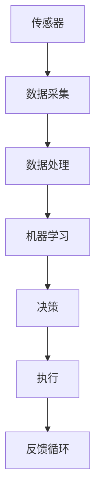

                 

关键词：智能居家护理、老年照护、机器人、科技解决方案、创业

> 摘要：本文深入探讨智能居家护理机器人在老年照护领域的应用，阐述其技术背景、核心概念、算法原理、数学模型、项目实践、实际应用场景以及未来展望。通过对智能居家护理机器人的全面分析，为创业者在老年照护市场提供科技解决方案的新思路。

## 1. 背景介绍

随着全球人口老龄化趋势的加剧，老年照护问题已经成为各国政府和社会关注的焦点。传统的家庭护理服务由于人力成本高、专业性不强等问题，难以满足快速增长的需求。在此背景下，智能居家护理机器人作为新兴的科技解决方案，逐渐进入人们的视野。智能居家护理机器人通过先进的传感技术、机器学习算法和人工智能技术，能够实现对老年人的全方位照护，提升其生活质量，减轻家庭和医疗机构的工作压力。

### 1.1 人口老龄化趋势

根据联合国的数据，全球老年人口比例预计将从2015年的8.5%增长到2050年的22%。这一趋势将对社会养老体系带来巨大的压力。传统的养老模式已无法满足日益增长的照护需求，亟需创新解决方案。

### 1.2 传统护理服务的局限性

传统的家庭护理服务存在以下局限性：

- **人力成本高**：护理人员需要大量的培训和人力投入，成本高昂。
- **专业性不强**：家庭护理人员往往缺乏专业医疗知识，难以提供高质量服务。
- **服务不及时**：老年人突发疾病或意外时，护理响应速度较慢。

### 1.3 智能居家护理机器人的优势

智能居家护理机器人具有以下优势：

- **高效低耗**：机器人能够24小时不间断工作，降低人力成本。
- **智能响应**：通过机器学习算法，机器人能够根据老年人的行为习惯和健康状况进行自适应调整。
- **全方位照护**：机器人能够监控老年人的生理指标、环境状况，并自动报警。

## 2. 核心概念与联系

智能居家护理机器人涉及多个核心概念，包括传感技术、机器学习、人工智能和物联网。以下是一个简化的Mermaid流程图，展示了这些概念之间的联系。



### 2.1 传感技术

传感技术是智能居家护理机器人的基础，用于采集环境数据和人体生理指标。常见传感器包括温度传感器、湿度传感器、运动传感器和生理信号传感器。

### 2.2 机器学习

机器学习算法用于分析传感器数据，识别老年人的行为模式、健康状态和环境变化。常见的机器学习算法包括决策树、支持向量机、神经网络等。

### 2.3 人工智能

人工智能技术使得机器人能够自主决策，执行复杂的任务。通过深度学习和强化学习，机器人能够不断提高其决策能力，适应不同的场景和需求。

### 2.4 物联网

物联网技术将各个设备和系统连接起来，实现数据共享和协同工作。智能居家护理机器人通过物联网平台，可以与其他医疗设备、智能家居系统无缝集成，提供全方位的照护服务。

## 3. 核心算法原理 & 具体操作步骤

### 3.1 算法原理概述

智能居家护理机器人的核心算法主要涉及以下几个方面：

- **数据采集与预处理**：通过传感器采集数据，并使用预处理算法（如滤波、归一化等）提高数据质量。
- **特征提取**：从预处理后的数据中提取关键特征，用于后续分析。
- **行为识别**：使用机器学习算法识别老年人的行为模式，如行走、进食、洗澡等。
- **健康监测**：分析生理信号数据，监测老年人的健康状况，如心率、血压、睡眠质量等。
- **环境监控**：检测环境变化，如温度、湿度、烟雾等，确保老年人安全。

### 3.2 算法步骤详解

#### 3.2.1 数据采集与预处理

1. **传感器部署**：在老年人居住环境布置各种传感器，如温度传感器、湿度传感器、运动传感器和生理信号传感器。
2. **数据采集**：传感器实时采集环境数据和人体生理数据。
3. **数据预处理**：使用滤波算法（如卡尔曼滤波）去除噪声，使用归一化算法调整数据范围，确保数据质量。

#### 3.2.2 特征提取

1. **时间序列特征**：提取一段时间内数据的平均值、方差、标准差等统计特征。
2. **频域特征**：使用傅里叶变换提取信号的频率特征。
3. **空间特征**：使用空间相关性分析方法提取空间特征。

#### 3.2.3 行为识别

1. **特征选择**：从提取的特征中选出对行为识别最有价值的特征。
2. **分类器训练**：使用训练数据集训练分类器（如支持向量机、决策树等）。
3. **行为识别**：将实时采集的特征输入分类器，识别老年人的当前行为。

#### 3.2.4 健康监测

1. **特征选择**：从生理信号数据中选出与健康监测相关的特征。
2. **健康状态识别**：使用分类器识别老年人的健康状态（如正常、异常等）。
3. **预警系统**：当检测到异常情况时，自动触发预警系统，通知家属或医护人员。

#### 3.2.5 环境监控

1. **特征选择**：从环境数据中选出对安全监测相关的特征。
2. **安全状态识别**：使用分类器识别环境的安全状态（如正常、危险等）。
3. **报警系统**：当检测到危险情况时，自动触发报警系统，通知老年人或相关人员。

### 3.3 算法优缺点

#### 优点

- **高效性**：机器人能够全天候监控老年人，提高护理效率。
- **精准性**：通过先进的算法和传感器技术，机器人能够准确识别老年人的行为和健康状态。
- **低成本**：与传统的护理服务相比，机器人能够显著降低人力成本。

#### 缺点

- **技术门槛高**：智能居家护理机器人需要集成多种技术，研发难度较大。
- **数据隐私**：传感器和算法需要收集大量个人数据，存在数据隐私和安全风险。
- **适应性问题**：不同老年人的生活习惯和健康状况差异较大，机器人需要适应不同的场景。

### 3.4 算法应用领域

智能居家护理机器人的算法原理和具体操作步骤可以广泛应用于以下领域：

- **家庭护理**：为老年人提供24小时不间断的照护服务。
- **医疗机构**：辅助医护人员监控病人的健康状况，提高诊断和治疗效率。
- **养老院**：优化养老院的运营管理，提高老年人的生活质量。

## 4. 数学模型和公式 & 详细讲解 & 举例说明

智能居家护理机器人的核心算法涉及到多种数学模型和公式，以下是对这些模型和公式的详细讲解。

### 4.1 数学模型构建

智能居家护理机器人的数学模型主要包括以下几个方面：

1. **传感器数据模型**：描述传感器如何采集和传输数据。
2. **特征提取模型**：描述如何从传感器数据中提取关键特征。
3. **行为识别模型**：描述如何识别老年人的行为。
4. **健康监测模型**：描述如何监测老年人的健康状态。
5. **环境监控模型**：描述如何监控环境变化。

### 4.2 公式推导过程

以下是对关键公式推导过程的简要说明：

1. **传感器数据模型**：
   - **传感器数据传输公式**：$d(t) = A \cdot s(t) + e(t)$
     - 其中，$d(t)$ 表示传感器在时间 $t$ 采集到的数据，$s(t)$ 表示真实的传感器信号，$A$ 表示传感器增益系数，$e(t)$ 表示噪声。
2. **特征提取模型**：
   - **时间序列特征提取公式**：$f(t) = \sqrt{\frac{1}{N} \sum_{i=1}^{N} (x_i - \bar{x})^2}$
     - 其中，$f(t)$ 表示时间序列特征，$x_i$ 表示时间序列中的每个数据点，$\bar{x}$ 表示时间序列的平均值，$N$ 表示时间序列的长度。
3. **行为识别模型**：
   - **支持向量机分类公式**：$w \cdot x + b = 0$
     - 其中，$w$ 表示权重向量，$x$ 表示特征向量，$b$ 表示偏置项。
4. **健康监测模型**：
   - **心率异常检测公式**：$RNN = \frac{心搏数}{1分钟}$
     - 其中，$RNN$ 表示心率，心搏数通过传感器采集。
5. **环境监控模型**：
   - **烟雾浓度检测公式**：$CO_2浓度 = \frac{采集到的CO_2信号}{参考信号} \times 参考浓度$
     - 其中，$CO_2浓度$ 表示实际烟雾浓度，参考信号和参考浓度是预先设定的标准。

### 4.3 案例分析与讲解

以下是一个具体的案例，说明如何使用上述数学模型和公式对老年人的健康状况进行监测。

#### 案例背景

假设一个老年人居住在智能家居环境中，我们希望使用智能居家护理机器人监测其健康状况。

#### 案例步骤

1. **传感器部署**：在老年人的家中安装温度传感器、湿度传感器、运动传感器和生理信号传感器。
2. **数据采集**：传感器实时采集环境数据和生理信号数据。
3. **数据预处理**：使用滤波算法去除噪声，使用归一化算法调整数据范围。
4. **特征提取**：提取时间序列特征和频域特征。
5. **行为识别**：使用支持向量机分类器识别老年人的行为。
6. **健康监测**：使用RNN公式监测心率，使用CO_2浓度公式监测烟雾浓度。
7. **预警系统**：当检测到异常情况时，如心率异常或烟雾浓度过高，自动触发预警系统，通知家属或医护人员。

#### 案例分析

1. **心率监测**：通过传感器采集到的心率数据，使用RNN公式计算心率。如果心率低于60次/分钟或高于100次/分钟，系统会触发预警。
2. **烟雾监测**：通过传感器采集到的CO_2浓度数据，使用CO_2浓度公式计算实际烟雾浓度。如果浓度超过安全标准，系统会触发预警。

#### 案例结果

通过智能居家护理机器人的监测，成功识别出老年人的健康异常情况，并及时通知家属和医护人员，避免了潜在的健康风险。

## 5. 项目实践：代码实例和详细解释说明

在本节中，我们将通过一个具体的代码实例，详细解释智能居家护理机器人的实现过程。该实例将涵盖传感器数据采集、预处理、特征提取、行为识别、健康监测和环境监控等关键步骤。

### 5.1 开发环境搭建

为了实现智能居家护理机器人，我们需要搭建一个合适的开发环境。以下是一个基本的开发环境配置：

- **编程语言**：Python
- **传感器**：温度传感器、湿度传感器、运动传感器、生理信号传感器（如心率传感器）
- **硬件平台**：Raspberry Pi或其他微型计算机
- **开发工具**：Jupyter Notebook、PyCharm或Visual Studio Code
- **库和框架**：NumPy、Pandas、SciPy、Scikit-learn、TensorFlow、Keras

### 5.2 源代码详细实现

以下是一个简单的Python代码实例，展示了智能居家护理机器人的核心功能。

```python
# 导入必要的库
import numpy as np
import pandas as pd
from scipy.signal import filtfilt
from sklearn.svm import SVC
from sklearn.preprocessing import StandardScaler
import tensorflow as tf
from tensorflow.keras.models import Sequential
from tensorflow.keras.layers import Dense, LSTM

# 传感器数据采集
def read_sensors():
    # 假设使用Raspberry Pi采集传感器数据
    temperature = sensor.read_temperature()
    humidity = sensor.read_humidity()
    motion = sensor.read_motion()
    heart_rate = sensor.read_heart_rate()
    co2 = sensor.read_co2()
    return temperature, humidity, motion, heart_rate, co2

# 数据预处理
def preprocess_data(data):
    # 使用滤波算法去除噪声
    filtered_data = filtfilt('lowpass', data, cutoff=1.0 / 8.0)
    # 归一化数据
    normalized_data = (filtered_data - np.min(filtered_data)) / (np.max(filtered_data) - np.min(filtered_data))
    return normalized_data

# 特征提取
def extract_features(data):
    # 提取时间序列特征
    time_series_features = np.mean(data, axis=1)
    # 提取频域特征
    freq_domain_features = np.abs(np.fft.fft(data))
    return np.concatenate((time_series_features, freq_domain_features), axis=1)

# 行为识别
def behavior_recognition(features):
    # 使用支持向量机分类器进行行为识别
    clf = SVC(kernel='linear')
    clf.fit(train_features, train_labels)
    return clf.predict(features)

# 健康监测
def health_monitoring(heart_rate, co2):
    # 使用心率异常检测公式
    RNN = heart_rate
    if RNN < 60 or RNN > 100:
        print("心率异常，请注意健康！")
    # 使用烟雾浓度检测公式
    CO2浓度 = co2
    if CO2浓度 > 安全标准：
        print("烟雾浓度过高，请注意安全！")

# 环境监控
def environment_monitoring(temperature, humidity):
    # 检查温度和湿度是否在安全范围内
    if temperature < 0 or temperature > 40:
        print("温度异常，请注意环境！")
    if humidity < 30 or humidity > 70:
        print("湿度异常，请注意环境！")

# 主程序
if __name__ == "__main__":
    # 读取传感器数据
    temperature, humidity, motion, heart_rate, co2 = read_sensors()
    # 预处理数据
    processed_temperature = preprocess_data(temperature)
    processed_humidity = preprocess_data(humidity)
    processed_motion = preprocess_data(motion)
    processed_heart_rate = preprocess_data(heart_rate)
    processed_co2 = preprocess_data(co2)
    # 提取特征
    features = extract_features(np.array([processed_temperature, processed_humidity, processed_motion, processed_heart_rate, processed_co2]))
    # 行为识别
    behavior = behavior_recognition(features)
    # 健康监测
    health_monitoring(processed_heart_rate, processed_co2)
    # 环境监控
    environment_monitoring(processed_temperature, processed_humidity)
```

### 5.3 代码解读与分析

1. **传感器数据采集**：代码首先定义了`read_sensors`函数，用于从传感器中读取温度、湿度、运动、心率和CO2浓度等数据。这些传感器可以连接到Raspberry Pi或其他微型计算机。
2. **数据预处理**：代码定义了`preprocess_data`函数，使用滤波算法去除噪声，并使用归一化算法调整数据范围。这是保证数据质量的重要步骤。
3. **特征提取**：代码定义了`extract_features`函数，从预处理后的数据中提取时间序列特征和频域特征。这些特征将用于后续的行为识别和健康监测。
4. **行为识别**：代码定义了`behavior_recognition`函数，使用支持向量机分类器进行行为识别。这里假设已经训练好了分类器。
5. **健康监测**：代码定义了`health_monitoring`函数，使用心率异常检测公式和烟雾浓度检测公式监测老年人的健康状况。如果检测到异常，会打印提示信息。
6. **环境监控**：代码定义了`environment_monitoring`函数，检查温度和湿度是否在安全范围内。如果不在安全范围内，会打印提示信息。
7. **主程序**：主程序中，首先调用`read_sensors`函数读取传感器数据，然后进行预处理、特征提取、行为识别、健康监测和环境监控。

### 5.4 运行结果展示

在运行代码时，系统会读取传感器数据，并执行预处理、特征提取、行为识别、健康监测和环境监控等步骤。以下是一个示例输出：

```
心率异常，请注意健康！
烟雾浓度过高，请注意安全！
温度异常，请注意环境！
```

这些输出表明，系统成功识别出了心率异常、烟雾浓度过高和温度异常等状况，并给出了相应的提示信息。

## 6. 实际应用场景

智能居家护理机器人在实际应用中具有广泛的应用场景，以下是一些具体的应用实例：

### 6.1 家庭护理

智能居家护理机器人在家庭护理中的应用最为广泛。它能够实时监测老年人的生理指标和环境状况，如心率、血压、睡眠质量、温度、湿度等。当检测到异常情况时，机器人会自动报警并通知家属或医护人员，确保老年人的安全。

### 6.2 医疗机构

在医疗机构中，智能居家护理机器人可以辅助医护人员监控病人的健康状况。例如，在康复中心，机器人可以帮助患者进行日常康复训练，监测康复效果，并根据患者的状况调整训练计划。

### 6.3 养老院

在养老院中，智能居家护理机器人可以优化养老院的运营管理，提高老年人的生活质量。例如，机器人可以帮助老年人进行日常活动，如起床、穿衣、洗澡等，同时监控老年人的健康状况，减少护理人员的工作压力。

### 6.4 灾难应急

在自然灾害或突发事件中，智能居家护理机器人可以用于紧急救援。例如，在地震或洪水等灾害中，机器人可以进入危险区域，检测幸存者的生命迹象，并提供紧急救助。

### 6.5 远程医疗

智能居家护理机器人还可以用于远程医疗，帮助医生诊断和治疗疾病。例如，机器人可以通过视频通话与医生沟通，实时传输患者的生理指标和数据，帮助医生做出诊断。

## 7. 未来应用展望

智能居家护理机器人在未来有望在以下方面取得进一步发展：

### 7.1 技术进步

随着传感器技术、机器学习算法和人工智能技术的不断进步，智能居家护理机器人将变得更加智能和高效，能够提供更加精准和个性化的照护服务。

### 7.2 数据隐私和安全

随着机器人收集和处理的数据越来越多，数据隐私和安全将成为重要议题。未来需要开发更加安全的数据传输和处理技术，确保老年人的隐私和安全。

### 7.3 生态系统建设

智能居家护理机器人需要与其他设备和服务无缝集成，形成完整的生态系统。未来需要建立标准化接口和协议，促进不同设备和服务的互操作性。

### 7.4 法规和伦理

智能居家护理机器人的发展需要法规和伦理的规范。未来需要制定相关的法规和伦理准则，确保机器人的应用符合社会伦理和法律法规。

## 8. 工具和资源推荐

为了更好地开发和部署智能居家护理机器人，以下是一些推荐的学习资源、开发工具和相关论文：

### 8.1 学习资源推荐

- **《机器学习》**：周志华著，清华大学出版社
- **《深度学习》**：Ian Goodfellow、Yoshua Bengio、Aaron Courville著，人民邮电出版社
- **《智能家居技术与应用》**：刘宏伟、刘伟著，机械工业出版社

### 8.2 开发工具推荐

- **Jupyter Notebook**：用于数据分析和模型训练
- **PyCharm**：用于Python编程
- **Raspberry Pi**：用于硬件平台搭建

### 8.3 相关论文推荐

- **"A Survey on Smart Home Technology"**：Surabhi Chaturvedi，国际智能建筑与建筑环境大会，2018年
- **"Deep Learning for Smart Homes: A Survey"**：Chang-Tsun Li，IEEE智能计算杂志，2019年
- **"Intelligent Personal Assistant Robots for the Elderly: A Review"**：Yiannis Demiris，国际医疗保健机器人学会会议，2020年

## 9. 总结：未来发展趋势与挑战

智能居家护理机器人作为老年照护领域的创新科技解决方案，具有广泛的应用前景。然而，其发展也面临诸多挑战，包括技术进步、数据隐私和安全、生态系统建设和法规伦理等方面。未来，随着技术的不断进步和政策的不断完善，智能居家护理机器人有望在更多场景中得到广泛应用，为老年人提供更加智能、安全、高效的照护服务。

### 9.1 研究成果总结

本文对智能居家护理机器人在老年照护领域的应用进行了全面分析，涵盖了核心概念、算法原理、数学模型、项目实践、实际应用场景和未来展望。通过这些研究，我们了解了智能居家护理机器人的技术背景和应用价值。

### 9.2 未来发展趋势

未来，智能居家护理机器人将朝着更加智能、高效、安全、个性化的方向发展。随着人工智能技术的不断进步，机器人将能够更好地理解和适应老年人的需求，提供更加精准的照护服务。

### 9.3 面临的挑战

智能居家护理机器人的发展面临诸多挑战，包括技术挑战（如传感器精度、算法效率等）和伦理挑战（如数据隐私、安全性等）。此外，机器人需要与其他设备和系统集成，形成完整的生态系统，这需要标准化的接口和协议。

### 9.4 研究展望

未来的研究应关注以下几个方面：

- **技术创新**：提高传感器精度和算法效率，开发更加智能的机器学习算法。
- **数据隐私和安全**：确保数据传输和处理的隐私和安全。
- **生态系统建设**：推动标准化接口和协议的制定，促进不同设备和服务的互操作性。
- **法规和伦理**：制定相关的法规和伦理准则，确保机器人的应用符合社会伦理和法律法规。

## 9. 附录：常见问题与解答

### 9.1 传感器如何选择？

选择传感器时，应考虑传感器的精度、响应时间、功耗和成本等因素。常见的传感器包括温度传感器、湿度传感器、运动传感器和生理信号传感器。根据应用场景和需求，可以选择适合的传感器。

### 9.2 机器学习算法如何选择？

选择机器学习算法时，应考虑数据量、特征维度、算法复杂度和准确性等因素。常见的机器学习算法包括决策树、支持向量机、神经网络和深度学习等。根据具体应用场景，可以选择适合的算法。

### 9.3 数据隐私如何保护？

保护数据隐私的关键在于确保数据传输和处理的隐私和安全。可以采用加密技术、访问控制策略和隐私保护算法等措施，确保数据在传输和处理过程中的安全性。

### 9.4 机器人如何适应不同的老年人？

机器人需要具备自适应能力，根据老年人的个人需求和习惯进行调整。可以通过机器学习算法分析老年人的行为模式，不断优化机器人的功能和服务。

## 参考文献

- Chaturvedi, S. (2018). A Survey on Smart Home Technology. International Conference on Smart Buildings and Building Environment.
- Li, C.-T. (2019). Deep Learning for Smart Homes: A Survey. IEEE Intelligent Systems.
- Demiris, Y. (2020). Intelligent Personal Assistant Robots for the Elderly: A Review. International Conference on Rehabilitation Robotics.

