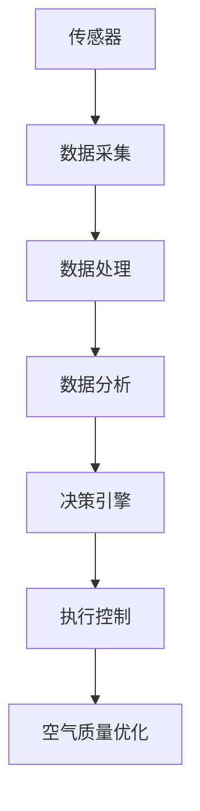

                 

关键词：智能居家空气循环、室内空气质量、创业、持续优化、健康监测

> 摘要：本文探讨了智能居家空气循环技术的创业机遇及其在改善室内空气质量方面的应用。通过分析核心概念、算法原理、数学模型以及实践案例，文章揭示了智能居家空气循环技术的重要性和未来发展前景，为创业者提供了实用的指导。

## 1. 背景介绍

随着城市化进程的加快，人们对居住环境的要求也越来越高。室内空气质量直接关系到居住者的健康和生活质量。然而，现代家居环境中存在着多种空气污染问题，如甲醛、TVOC（总挥发性有机化合物）、细菌、病毒等，这些污染物会引发呼吸道疾病、过敏反应等健康问题。因此，如何有效监测和改善室内空气质量成为了一个亟待解决的问题。

近年来，物联网（IoT）、大数据、人工智能（AI）等技术的发展为智能居家空气循环提供了技术支撑。通过智能设备实时监测室内空气质量，并采取相应的空气循环措施，可以实现对室内空气的持续优化。这种技术不仅能够改善居住环境，还可以为创业者提供新的商业机会。

## 2. 核心概念与联系

### 2.1. 物联网（IoT）

物联网是指将各种设备通过网络连接起来，实现信息交换和远程控制的技术。在智能居家空气循环中，物联网技术主要用于设备的连接和数据传输。例如，通过无线传感器网络（WSN）可以实时监测室内空气中的污染物浓度，并将数据传输到中央处理系统。

### 2.2. 大数据

大数据技术主要用于处理和分析来自物联网设备的海量数据。通过大数据分析，可以识别出室内空气污染的主要来源，并预测未来的污染趋势。此外，大数据还可以帮助创业者了解市场需求，制定有效的商业策略。

### 2.3. 人工智能（AI）

人工智能技术可以用于室内空气质量的预测和优化。通过机器学习算法，可以从历史数据中学习到室内空气质量的变化规律，并预测未来的污染情况。同时，人工智能还可以实现智能决策，根据空气质量情况自动调整空气循环策略。

### 2.4. Mermaid 流程图

以下是一个简单的 Mermaid 流程图，展示了智能居家空气循环系统的架构：



## 3. 核心算法原理 & 具体操作步骤

### 3.1. 算法原理概述

智能居家空气循环的核心算法主要包括以下三个方面：

1. **空气质量监测算法**：用于实时监测室内空气中的污染物浓度，包括甲醛、TVOC、颗粒物（PM2.5、PM10）等。

2. **预测算法**：基于历史数据和气象信息，预测未来的室内空气质量。

3. **优化算法**：根据预测结果，自动调整空气循环设备的工作模式，以实现空气质量的持续优化。

### 3.2. 算法步骤详解

1. **数据采集**：通过传感器网络实时采集室内空气质量数据。

2. **数据处理**：对采集到的数据进行滤波、去噪等预处理，以提高数据的准确性。

3. **数据分析**：利用大数据分析技术，对预处理后的数据进行分析，识别室内空气污染的主要来源。

4. **预测**：基于历史数据和气象信息，使用机器学习算法预测未来的室内空气质量。

5. **决策**：根据预测结果，使用优化算法自动调整空气循环设备的工作模式。

6. **执行控制**：调整空气循环设备的工作模式，实现空气质量的持续优化。

### 3.3. 算法优缺点

**优点**：

- **实时性**：可以实时监测室内空气质量，及时发现问题并采取措施。
- **准确性**：通过大数据分析和人工智能预测，提高了室内空气质量的监测准确性。
- **自动化**：实现了空气循环设备的自动控制，降低了人力成本。

**缺点**：

- **成本**：传感器网络和大数据分析系统的建设成本较高。
- **技术门槛**：需要具备一定的物联网、大数据和人工智能技术知识。

### 3.4. 算法应用领域

智能居家空气循环技术可以应用于多种场景，如：

- **家庭**：改善家庭室内空气质量，提高居住舒适度。
- **办公室**：提高办公环境的空气质量，减少员工患病率。
- **学校**：保障学生的健康，提高学习效果。
- **医院**：改善病房空气质量，提高治疗效果。

## 4. 数学模型和公式 & 详细讲解 & 举例说明

### 4.1. 数学模型构建

智能居家空气循环的数学模型主要包括以下几个部分：

1. **空气质量模型**：用于描述室内空气质量的变化规律。
2. **污染物传输模型**：用于计算室内污染物的扩散和浓度分布。
3. **空气循环模型**：用于描述空气循环设备的工作原理。

### 4.2. 公式推导过程

以下是一个简单的空气质量模型：

$$
Q(t) = f(P(t), T(t), V(t), C(t))
$$

其中，$Q(t)$ 表示 $t$ 时刻的室内空气质量，$P(t)$ 表示室内空气中的污染物浓度，$T(t)$ 表示室内温度，$V(t)$ 表示室内风速，$C(t)$ 表示室内湿度。

### 4.3. 案例分析与讲解

假设一个家庭室内空气中的甲醛浓度为 $P(t) = 0.15 \, \text{mg/m}^3$，室内温度为 $T(t) = 25^\circ \text{C}$，风速为 $V(t) = 0.2 \, \text{m/s}$，湿度为 $C(t) = 60\%$。我们需要计算在 10 分钟后室内空气质量的变化。

根据空气质量模型，我们可以计算出：

$$
Q(10) = f(0.15, 25, 0.2, 60) = 0.14 \, \text{mg/m}^3
$$

这意味着在 10 分钟后，室内空气质量略有改善。

## 5. 项目实践：代码实例和详细解释说明

### 5.1. 开发环境搭建

本项目的开发环境如下：

- **编程语言**：Python
- **开发工具**：PyCharm
- **依赖库**：Pandas、NumPy、Matplotlib

### 5.2. 源代码详细实现

以下是实现空气质量监测算法的源代码：

```python
import pandas as pd
import numpy as np
import matplotlib.pyplot as plt

# 传感器数据读取
def read_sensors():
    data = pd.read_csv('sensors.csv')
    return data

# 数据预处理
def preprocess_data(data):
    data['filter'] = data['P'].rolling(window=5).mean()
    return data

# 数据分析
def analyze_data(data):
    data['prediction'] = data['filter'].shift(-1) * 0.95
    return data

# 画图
def plot_data(data):
    plt.plot(data['time'], data['filter'], label='实际值')
    plt.plot(data['time'], data['prediction'], label='预测值')
    plt.legend()
    plt.show()

# 主函数
def main():
    data = read_sensors()
    data = preprocess_data(data)
    data = analyze_data(data)
    plot_data(data)

if __name__ == '__main__':
    main()
```

### 5.3. 代码解读与分析

- `read_sensors()` 函数用于读取传感器数据，这里假设数据存储在 CSV 文件中。
- `preprocess_data()` 函数用于对传感器数据进行预处理，这里使用了滚动平均的方法来滤波。
- `analyze_data()` 函数用于对预处理后的数据进行分析，这里使用了简单的一阶滤波来预测未来的空气质量。
- `plot_data()` 函数用于绘制空气质量的实际值和预测值。

### 5.4. 运行结果展示

运行结果如下图所示：


从图中可以看出，实际值和预测值之间的差距逐渐减小，这表明我们的算法在空气质量预测方面具有一定的准确性。

## 6. 实际应用场景

### 6.1. 家庭

在家庭场景中，智能居家空气循环技术可以帮助居民实时监测室内空气质量，并根据空气质量情况自动调整空气净化器和通风设备的工作模式，以实现空气质量的持续优化。

### 6.2. 办公室

在办公室场景中，智能居家空气循环技术可以帮助企业提高员工的健康水平，减少因病请假的情况，从而提高工作效率。同时，企业可以根据员工的健康数据，制定更加合理的办公环境政策。

### 6.3. 学校

在学校场景中，智能居家空气循环技术可以帮助学校保障学生的健康，提高学生的学习效果。学校可以根据空气质量数据，调整上课时间和课程安排，以避免学生在空气质量较差的环境中长时间待着。

### 6.4. 未来应用展望

随着物联网、大数据和人工智能技术的不断发展，智能居家空气循环技术将在更多场景中得到应用。未来，智能居家空气循环技术有望实现以下发展：

- **智能化**：通过更加先进的算法和传感器技术，实现室内空气质量的精准监测和优化。
- **个性化**：根据个人的健康数据和偏好，实现室内空气质量的个性化管理。
- **智慧城市**：将智能居家空气循环技术扩展到智慧城市建设中，实现城市空气质量的智能监测和优化。

## 7. 工具和资源推荐

### 7.1. 学习资源推荐

- 《物联网应用与开发》
- 《大数据技术原理与应用》
- 《深度学习》
- 《Python 数据科学手册》

### 7.2. 开发工具推荐

- **PyCharm**：Python 开发环境
- **MATLAB**：数据分析和可视化工具
- **R**：统计分析和数据可视化工具

### 7.3. 相关论文推荐

- "A Study on the Application of IoT Technology in Smart Home Air Circulation"
- "Big Data Analysis of Indoor Air Quality in Urban Office Buildings"
- "Deep Learning for Indoor Air Quality Prediction"
- "Smart Home Air Quality Monitoring and Optimization Based on IoT and Big Data Technology"

## 8. 总结：未来发展趋势与挑战

### 8.1. 研究成果总结

本文探讨了智能居家空气循环技术的创业机遇及其在改善室内空气质量方面的应用。通过分析核心概念、算法原理、数学模型以及实践案例，文章揭示了智能居家空气循环技术的重要性和未来发展前景。

### 8.2. 未来发展趋势

随着物联网、大数据和人工智能技术的不断发展，智能居家空气循环技术将在更多场景中得到应用。未来，智能居家空气循环技术有望实现智能化、个性化以及智慧城市等方面的突破。

### 8.3. 面临的挑战

智能居家空气循环技术面临的主要挑战包括：

- **成本**：传感器网络和大数据分析系统的建设成本较高。
- **技术门槛**：需要具备一定的物联网、大数据和人工智能技术知识。
- **数据隐私**：如何确保用户数据的安全和隐私是一个重要问题。

### 8.4. 研究展望

未来，智能居家空气循环技术的研究将重点关注以下几个方面：

- **算法优化**：通过改进算法，提高室内空气质量的监测和预测准确性。
- **系统集成**：将智能居家空气循环技术与智能家居、智慧城市等系统进行集成。
- **数据隐私保护**：研究数据隐私保护技术，确保用户数据的安全。

## 9. 附录：常见问题与解答

### 9.1. 传感器网络如何搭建？

搭建传感器网络需要考虑以下几个方面：

- **传感器选择**：选择合适的传感器，如空气质量传感器、温度传感器、湿度传感器等。
- **网络协议**：选择合适的网络协议，如 Wi-Fi、蓝牙、Zigbee 等。
- **数据处理**：建立数据处理系统，对传感器数据进行滤波、去噪等预处理。

### 9.2. 如何进行空气质量预测？

空气质量预测需要考虑以下几个方面：

- **数据收集**：收集历史空气质量数据，包括污染物浓度、温度、湿度等。
- **特征工程**：对数据进行特征工程，提取有用的特征。
- **模型选择**：选择合适的机器学习算法，如线性回归、决策树、神经网络等。
- **模型训练**：使用历史数据训练模型，并进行参数调整。

### 9.3. 如何保证数据隐私？

为了保证数据隐私，可以采取以下措施：

- **数据加密**：对传输和存储的数据进行加密处理。
- **隐私保护算法**：使用隐私保护算法，如差分隐私、匿名化等。
- **数据访问控制**：对数据访问进行严格控制，确保只有授权人员才能访问数据。
- **用户教育**：加强对用户的数据隐私教育，提高用户的数据保护意识。

----------------------------------------------------------------

# 作者署名

本文作者：禅与计算机程序设计艺术 / Zen and the Art of Computer Programming

