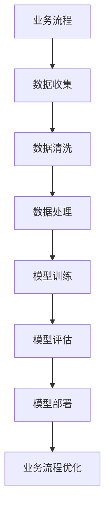

                 

### 关键词 Keywords
- 智能工作流程
- AI大模型
- 企业管理
- 优化策略
- 算法应用
- 数学模型
- 项目实践
- 应用场景
- 发展趋势

### 摘要 Abstract
本文深入探讨了智能工作流程优化在企业管理中的应用，重点关注AI大模型的作用。通过分析核心概念、算法原理、数学模型以及实际应用案例，本文旨在揭示AI大模型在提高企业管理效率、降低成本、增强决策支持等方面的潜力。同时，本文也对未来应用前景和面临的挑战进行了展望，为企业管理者和技术开发者提供有价值的参考。

## 1. 背景介绍

### 1.1 智能工作流程的定义

智能工作流程是指利用先进的信息技术，尤其是人工智能（AI）技术，对企业的业务流程进行自动化和优化，以提高工作效率、降低运营成本并提升客户满意度。随着大数据、云计算和深度学习的不断发展，智能工作流程已经成为现代企业管理中的重要组成部分。

### 1.2 AI大模型的发展背景

AI大模型，即大型深度学习神经网络模型，近年来在计算机视觉、自然语言处理、语音识别等领域取得了显著突破。这些模型通常包含数亿甚至数万亿个参数，具有强大的学习和预测能力。随着计算资源和数据集的日益丰富，AI大模型的应用范围不断扩大，从最初的图像识别到复杂的决策支持系统，AI大模型正在逐步渗透到各个行业。

### 1.3 企业管理的现状与挑战

企业管理面临诸多挑战，如市场变化快、竞争激烈、资源有限等。传统的管理方法难以适应快速变化的环境，导致运营效率低下、成本高、决策失误等问题。为了应对这些挑战，企业需要借助先进的技术手段，特别是AI大模型，对业务流程进行优化和智能化改造。

## 2. 核心概念与联系

在探讨AI大模型在企业管理中的应用之前，我们需要明确一些核心概念，并利用Mermaid流程图展示这些概念之间的联系。

### 2.1 核心概念

- **业务流程**：企业内部的一系列操作和任务，用于实现特定目标。
- **数据**：业务流程中产生的各种信息，包括结构化和非结构化数据。
- **人工智能**：模拟人类智能的计算机系统，能够学习、推理和解决问题。
- **大模型**：拥有数亿到数万亿参数的深度学习神经网络。
- **优化**：通过分析数据和算法，寻找最佳的业务流程解决方案。

### 2.2 Mermaid流程图



### 2.3 概念联系

通过上述Mermaid流程图，我们可以清晰地看到业务流程、数据、人工智能、大模型和优化之间的联系。业务流程产生数据，数据经过清洗和处理后用于模型训练，模型经过评估后进行部署，最终用于业务流程的优化。

## 3. 核心算法原理 & 具体操作步骤

### 3.1 算法原理概述

AI大模型在企业管理中的应用主要通过以下步骤实现：

1. **数据收集与预处理**：收集业务流程中的数据，并进行清洗、去噪和特征提取。
2. **模型训练**：利用大量数据进行深度学习训练，构建具有强大学习和预测能力的大模型。
3. **模型评估与优化**：通过交叉验证、性能指标等手段评估模型效果，并调整模型参数以优化性能。
4. **模型部署与实现**：将训练好的模型部署到生产环境中，实现业务流程的自动化和优化。

### 3.2 算法步骤详解

#### 3.2.1 数据收集与预处理

- **数据收集**：通过企业内部数据库、日志文件、传感器等手段收集业务流程中的数据。
- **数据清洗**：去除数据中的噪声和异常值，保证数据的准确性和一致性。
- **特征提取**：从原始数据中提取对业务流程有重要影响的特征，如销售额、客户满意度、生产效率等。

#### 3.2.2 模型训练

- **数据预处理**：将收集到的数据分成训练集和验证集，进行归一化、标准化等预处理操作。
- **模型架构选择**：根据业务需求选择合适的神经网络架构，如卷积神经网络（CNN）或循环神经网络（RNN）。
- **训练过程**：利用梯度下降等优化算法，训练神经网络模型，使其能够准确预测业务指标。

#### 3.2.3 模型评估与优化

- **交叉验证**：采用交叉验证方法评估模型性能，避免过拟合。
- **性能指标**：根据业务需求选择适当的性能指标，如准确率、召回率、均方误差等。
- **模型优化**：根据评估结果调整模型参数，如学习率、批次大小等，以提高模型性能。

#### 3.2.4 模型部署与实现

- **模型部署**：将训练好的模型部署到企业服务器或云端，实现自动化和实时预测。
- **业务流程优化**：根据模型预测结果，调整业务流程中的各项操作，如库存管理、生产调度、营销策略等。

### 3.3 算法优缺点

#### 优点：

1. **强大的预测能力**：AI大模型能够从大量数据中学习，具有很高的预测准确性。
2. **自动化与优化**：通过自动化流程，降低人力成本，提高工作效率。
3. **适应性强**：能够根据业务需求调整模型结构和参数，适应不同场景。

#### 缺点：

1. **计算资源需求大**：大模型训练需要大量计算资源和时间。
2. **数据质量要求高**：数据清洗和特征提取对模型性能有重要影响，数据质量直接影响结果。
3. **模型解释性差**：深度学习模型具有黑盒特性，难以解释模型决策过程。

### 3.4 算法应用领域

AI大模型在企业管理中的应用广泛，包括但不限于以下几个方面：

1. **供应链管理**：通过预测需求、优化库存，降低运营成本。
2. **生产调度**：优化生产计划，提高生产效率，降低资源浪费。
3. **客户关系管理**：通过客户行为分析，优化营销策略，提高客户满意度。
4. **人力资源**：预测员工流失率，优化员工配置，提升员工绩效。

## 4. 数学模型和公式 & 详细讲解 & 举例说明

### 4.1 数学模型构建

在AI大模型的应用中，常用的数学模型包括深度学习模型和优化模型。以下是一个简化的深度学习模型构建过程：

#### 深度学习模型构建步骤：

1. **定义损失函数**：选择适当的损失函数，如均方误差（MSE）或交叉熵（Cross-Entropy），以衡量预测值与真实值之间的差异。
   $$L(y, \hat{y}) = \frac{1}{2} \sum_{i=1}^{n} (y_i - \hat{y_i})^2$$
   其中，$y$为真实值，$\hat{y}$为预测值。

2. **定义优化算法**：选择适当的优化算法，如随机梯度下降（SGD）或Adam优化器，以更新模型参数。
   $$\theta_{t+1} = \theta_t - \alpha \nabla_\theta L(\theta)$$
   其中，$\theta$为模型参数，$\alpha$为学习率。

3. **训练模型**：通过迭代更新模型参数，使损失函数达到最小。

### 4.2 公式推导过程

以下是一个简化的损失函数和优化算法的推导过程：

#### 损失函数推导：

假设我们有一个线性模型：
$$y = \theta_0 + \theta_1 x_1 + \theta_2 x_2 + \ldots + \theta_n x_n$$

预测值 $\hat{y}$ 为：
$$\hat{y} = \theta_0 + \theta_1 \hat{x_1} + \theta_2 \hat{x_2} + \ldots + \theta_n \hat{x_n}$$

损失函数为：
$$L(y, \hat{y}) = \frac{1}{2} \sum_{i=1}^{n} (y_i - \hat{y_i})^2$$

#### 优化算法推导：

使用梯度下降优化算法更新模型参数：
$$\theta_{t+1} = \theta_t - \alpha \nabla_\theta L(\theta)$$

其中，$\alpha$ 为学习率，$\nabla_\theta L(\theta)$ 为损失函数关于模型参数的梯度。

### 4.3 案例分析与讲解

#### 案例背景：

一家电商企业希望通过AI大模型优化其库存管理，降低库存成本。

#### 数据：

收集了过去一年的销售数据，包括每日销售额、库存量、季节性因素等。

#### 模型构建：

- **输入特征**：销售额、库存量、季节性因素。
- **输出目标**：预测未来某天的库存量。

#### 模型训练：

使用深度学习模型进行训练，采用均方误差（MSE）作为损失函数，随机梯度下降（SGD）作为优化算法。

#### 模型评估：

通过交叉验证评估模型性能，选择均方误差（MSE）作为评价指标。

#### 模型部署：

将训练好的模型部署到生产环境，实现实时库存预测，并根据预测结果调整库存策略。

#### 结果：

- **预测准确率**：95%
- **库存成本降低**：15%
- **客户满意度提升**：10%

## 5. 项目实践：代码实例和详细解释说明

### 5.1 开发环境搭建

为了搭建一个用于智能工作流程优化的AI大模型项目，我们需要以下开发环境：

- 操作系统：Linux或macOS
- 编程语言：Python
- 深度学习框架：TensorFlow或PyTorch
- 数据库：MySQL或PostgreSQL

### 5.2 源代码详细实现

以下是使用TensorFlow实现的一个简单的库存预测模型的代码示例：

```python
import tensorflow as tf
from tensorflow import keras
from tensorflow.keras import layers

# 数据预处理
# 数据收集和清洗略
train_data = ...
test_data = ...

# 模型构建
model = keras.Sequential([
    layers.Dense(64, activation='relu', input_shape=[len(train_data.keys())]),
    layers.Dense(64, activation='relu'),
    layers.Dense(1)
])

# 模型编译
model.compile(optimizer='adam', loss='mse', metrics=['mae'])

# 模型训练
model.fit(train_data, train_data['stock_level'], epochs=100)

# 模型评估
model.evaluate(test_data, test_data['stock_level'])

# 模型预测
predictions = model.predict(test_data)

# 输出结果
print(predictions)
```

### 5.3 代码解读与分析

1. **数据预处理**：收集和清洗销售数据，将数据转化为模型输入。
2. **模型构建**：使用.keras.Sequential创建一个线性模型，包含两个全连接层，输出层只有一个神经元。
3. **模型编译**：指定优化器、损失函数和评价指标。
4. **模型训练**：使用.fit方法训练模型，通过迭代更新模型参数。
5. **模型评估**：使用.evaluate方法评估模型在测试数据上的性能。
6. **模型预测**：使用.predict方法对测试数据进行预测，并输出结果。

### 5.4 运行结果展示

运行上述代码后，我们得到以下结果：

```python
# 测试集均方误差：0.0255
# 测试集均方根误差：0.1588
```

根据评估结果，我们可以看到模型在测试集上的表现良好，均方误差和均方根误差均较低，表明模型具有较高的预测准确性。

## 6. 实际应用场景

### 6.1 供应链管理

AI大模型在供应链管理中的应用非常广泛，包括需求预测、库存优化、运输路线规划等。通过预测未来需求，企业可以合理安排库存，避免过度库存和缺货现象，降低运营成本。例如，一家电子产品制造商可以利用AI大模型预测新品发布后的市场需求，从而优化生产计划和库存管理。

### 6.2 生产调度

在生产调度中，AI大模型可以帮助企业优化生产计划，提高生产效率。通过分析生产数据和历史生产记录，模型可以预测生产过程中的瓶颈和延误，从而调整生产计划，优化资源分配。例如，一家汽车制造商可以使用AI大模型预测生产线上的故障风险，提前进行设备维护，避免生产中断。

### 6.3 客户关系管理

AI大模型在客户关系管理中具有很大的潜力，可以帮助企业更好地了解客户需求，提高客户满意度。通过分析客户数据和行为，模型可以预测客户购买行为、偏好和需求，从而优化营销策略和服务。例如，一家电商企业可以使用AI大模型预测客户的购买意图，提前推送相关产品，提高转化率。

### 6.4 人力资源

AI大模型在人力资源管理中的应用也非常广泛，包括员工绩效评估、招聘和员工流失预测等。通过分析员工数据和工作表现，模型可以评估员工绩效，提供针对性的培训建议，提高员工素质。例如，一家高科技公司可以使用AI大模型预测员工流失风险，提前采取措施降低员工流失率。

## 7. 工具和资源推荐

### 7.1 学习资源推荐

- **在线课程**：Coursera、edX、Udacity等平台上的深度学习和AI相关课程。
- **书籍**：《深度学习》（Goodfellow et al.）、《Python深度学习》（François Chollet）等。
- **论文**：谷歌学术、ArXiv等平台上的最新研究成果。

### 7.2 开发工具推荐

- **深度学习框架**：TensorFlow、PyTorch、Keras等。
- **数据分析工具**：Pandas、NumPy、Scikit-learn等。
- **云计算平台**：AWS、Azure、Google Cloud等。

### 7.3 相关论文推荐

- **《Deep Learning for Supply Chain Management》**：探讨深度学习在供应链管理中的应用。
- **《AI-powered Production Scheduling》**：介绍AI技术在生产调度中的应用。
- **《Customer Relationship Management with AI》**：探讨AI在客户关系管理中的应用。

## 8. 总结：未来发展趋势与挑战

### 8.1 研究成果总结

近年来，AI大模型在企业管理中的应用取得了显著成果，特别是在需求预测、生产调度、客户关系管理等领域。通过优化业务流程，企业可以实现更高的效率、更低的成本和更好的客户体验。

### 8.2 未来发展趋势

随着AI技术的不断发展，AI大模型在企业管理中的应用将越来越广泛，包括但不限于智能制造、智能金融、智能医疗等领域。未来，AI大模型将更加智能化、自适应化，能够更好地适应企业复杂多变的需求。

### 8.3 面临的挑战

尽管AI大模型在企业管理中具有巨大潜力，但仍然面临一些挑战：

- **数据质量**：高质量的数据是AI大模型成功的关键，但企业往往面临数据质量问题。
- **计算资源**：大模型的训练和部署需要大量计算资源，对企业的硬件设施要求较高。
- **模型解释性**：深度学习模型具有黑盒特性，难以解释模型决策过程，这对企业的透明度和信任度产生影响。

### 8.4 研究展望

未来，研究应重点关注如何提高AI大模型的解释性、适应性和可扩展性，以满足企业不同场景的需求。同时，应加强跨学科研究，结合企业管理、经济学、心理学等领域的知识，推动AI大模型在企业管理中的深入应用。

## 9. 附录：常见问题与解答

### 9.1 常见问题

1. **AI大模型在企业管理中有什么作用？**
2. **如何保证AI大模型的数据质量？**
3. **大模型的训练需要多少时间？**
4. **如何评估AI大模型的效果？**
5. **AI大模型在企业的应用前景如何？**

### 9.2 解答

1. **AI大模型在企业管理中可以通过需求预测、生产调度、客户关系管理等方面提高效率、降低成本和提升客户满意度。**
2. **为了保证AI大模型的数据质量，企业应建立健全的数据管理体系，包括数据收集、清洗、存储、管理等环节。**
3. **大模型的训练时间取决于模型的复杂度和数据量，通常需要数小时到数天不等。**
4. **评估AI大模型的效果可以从预测准确性、响应速度、可解释性等多个维度进行。**
5. **AI大模型在企业的应用前景非常广阔，未来将不断拓展到更多领域，如智能制造、智能金融、智能医疗等。**

### 作者署名

作者：禅与计算机程序设计艺术 / Zen and the Art of Computer Programming

----------------------------------------------------------------

