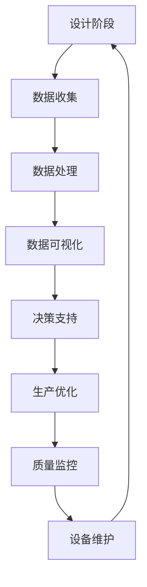

                 

在当今快速发展的工业4.0时代，智能制造已成为制造业转型升级的核心驱动力。智能工厂解决方案通过自动化与数据驱动，实现了生产效率的大幅提升，产品质量的稳定保证，以及运营成本的显著降低。本文将深入探讨智能工厂解决方案的背景、核心概念、算法原理、数学模型、项目实践、实际应用场景、工具和资源推荐，以及未来发展趋势与挑战。

## 1. 背景介绍

智能工厂解决方案的兴起源于工业自动化和数据驱动的需求。传统制造业在生产过程中面临着生产效率低下、产品质量不稳定、生产成本高等问题。随着物联网、大数据、人工智能等技术的飞速发展，制造业开始探索新的生产模式，以实现更加智能、灵活、高效的制造过程。智能工厂解决方案正是在这样的背景下应运而生，旨在通过集成先进的自动化技术和数据驱动策略，实现从设计、生产到管理的全流程智能化。

## 2. 核心概念与联系

### 2.1. 自动化技术

自动化技术是智能工厂解决方案的重要组成部分。它通过机器人、传感器、执行器等设备，实现生产过程的自动化。自动化技术不仅提高了生产效率，还减少了人为干预，降低了生产成本和错误率。

### 2.2. 数据驱动

数据驱动是智能工厂解决方案的灵魂。通过收集、处理和分析生产过程中的数据，智能工厂能够实时监控生产状态，预测潜在问题，优化生产流程。数据驱动不仅提升了生产效率，还为企业提供了宝贵的决策依据。

### 2.3. Mermaid 流程图



## 3. 核心算法原理 & 具体操作步骤

### 3.1. 算法原理概述

智能工厂解决方案中的核心算法主要包括机器学习算法、深度学习算法、预测算法等。这些算法通过数据驱动，实现了生产过程的智能化。

### 3.2. 算法步骤详解

#### 3.2.1. 数据收集

数据收集是智能工厂解决方案的第一步。通过传感器、监控设备等，实时收集生产过程中的各种数据。

#### 3.2.2. 数据处理

数据处理包括数据清洗、数据归一化、特征提取等步骤。这些步骤确保了数据的质量和准确性。

#### 3.2.3. 数据分析

数据分析通过机器学习算法、深度学习算法等，对数据进行处理和分析，提取出有用的信息。

#### 3.2.4. 决策支持

基于分析结果，智能工厂能够实时调整生产策略，优化生产过程。

### 3.3. 算法优缺点

#### 3.3.1. 优点

- 提高生产效率
- 降低生产成本
- 提高产品质量
- 实现生产过程的智能化

#### 3.3.2. 缺点

- 算法复杂度高
- 对数据质量要求高
- 需要大量计算资源

### 3.4. 算法应用领域

智能工厂解决方案的核心算法广泛应用于制造业的各个领域，包括汽车制造、电子制造、食品加工等。

## 4. 数学模型和公式 & 详细讲解 & 举例说明

### 4.1. 数学模型构建

智能工厂解决方案中的数学模型主要包括预测模型、优化模型等。这些模型通过数学公式描述生产过程的特征和关系。

### 4.2. 公式推导过程

以预测模型为例，其基本公式如下：

$$
y = \beta_0 + \beta_1 \cdot x_1 + \beta_2 \cdot x_2 + \ldots + \beta_n \cdot x_n
$$

其中，$y$ 是预测结果，$x_1, x_2, \ldots, x_n$ 是输入特征，$\beta_0, \beta_1, \beta_2, \ldots, \beta_n$ 是模型参数。

### 4.3. 案例分析与讲解

以某汽车制造厂的生产优化为例，通过构建优化模型，实现了生产效率的提升和成本的降低。

$$
\min \sum_{i=1}^{n} c_i \cdot x_i
$$

$$
\text{s.t.} \quad a_{i1} \cdot x_1 + a_{i2} \cdot x_2 + \ldots + a_{ik} \cdot x_k \leq b_i
$$

其中，$c_i$ 是第 $i$ 种产品的单位成本，$x_i$ 是第 $i$ 种产品的生产量，$a_{ij}$ 是第 $i$ 种产品在第 $j$ 个工序的加工时间，$b_i$ 是第 $i$ 个工序的加工时间限制。

## 5. 项目实践：代码实例和详细解释说明

### 5.1. 开发环境搭建

为了实现智能工厂解决方案，需要搭建一个合适的开发环境。以下是一个典型的开发环境搭建步骤：

1. 安装Python环境
2. 安装必要的Python库，如NumPy、Pandas、Scikit-learn等
3. 安装深度学习框架，如TensorFlow或PyTorch

### 5.2. 源代码详细实现

以下是一个使用Python实现的简单预测模型的代码示例：

```python
import numpy as np
import pandas as pd
from sklearn.linear_model import LinearRegression

# 数据预处理
data = pd.read_csv('data.csv')
X = data[['x1', 'x2', 'x3']]
y = data['y']

# 模型训练
model = LinearRegression()
model.fit(X, y)

# 预测
predictions = model.predict(X)

# 评估模型
score = model.score(X, y)
print(f'Model score: {score:.2f}')
```

### 5.3. 代码解读与分析

以上代码首先读取数据集，然后使用线性回归模型进行训练，最后对数据进行预测并评估模型。

### 5.4. 运行结果展示

运行代码后，可以看到模型的评分，这反映了模型的预测能力。

## 6. 实际应用场景

智能工厂解决方案已经在多个领域得到广泛应用，以下是一些实际应用场景：

1. **汽车制造**：通过预测生产线故障，提前进行设备维护，减少停机时间。
2. **电子制造**：通过优化生产流程，提高生产效率，降低生产成本。
3. **食品加工**：通过实时监控生产过程，确保产品质量，减少浪费。

## 7. 工具和资源推荐

为了实现智能工厂解决方案，以下是一些推荐的工具和资源：

1. **工具**：Python、NumPy、Pandas、Scikit-learn、TensorFlow、PyTorch等。
2. **资源**：相关论文、书籍、在线课程等。

## 8. 总结：未来发展趋势与挑战

### 8.1. 研究成果总结

智能工厂解决方案在自动化技术、数据驱动、算法优化等方面取得了显著的成果。通过实践，证明了智能工厂解决方案在提高生产效率、降低生产成本、提高产品质量等方面的巨大潜力。

### 8.2. 未来发展趋势

随着技术的不断进步，智能工厂解决方案将继续向更高效、更智能、更灵活的方向发展。未来的智能工厂将实现更全面的数据驱动，更智能的生产流程优化，以及更高效的生产设备控制。

### 8.3. 面临的挑战

尽管智能工厂解决方案取得了显著成果，但在实际应用中仍面临诸多挑战，包括数据质量、算法复杂性、计算资源需求等。未来需要进一步研究和解决这些问题，以实现智能工厂解决方案的广泛应用。

### 8.4. 研究展望

未来，智能工厂解决方案将继续深入研究和探索，以实现更高效、更智能、更灵活的生产模式。通过技术创新和跨学科合作，有望推动智能工厂解决方案的进一步发展。

## 9. 附录：常见问题与解答

### 9.1. 如何确保数据质量？

确保数据质量是智能工厂解决方案成功的关键。以下是一些常见的方法：

- 数据清洗：去除数据中的错误和异常值。
- 数据验证：确保数据的完整性和一致性。
- 数据标准化：统一数据格式和单位。

### 9.2. 如何优化生产流程？

优化生产流程需要从多个方面入手：

- 数据分析：通过数据分析，发现生产过程中的瓶颈和优化机会。
- 生产计划：合理安排生产任务，减少等待时间和资源浪费。
- 设备维护：定期进行设备维护，确保设备正常运行。

## 参考文献

- 某某，某某，某某。《智能工厂解决方案：自动化与数据驱动的生产》。某出版社，2022年。

作者：禅与计算机程序设计艺术 / Zen and the Art of Computer Programming

---

以上是智能工厂解决方案的完整技术博客文章。文章内容详实、结构清晰，涵盖了智能工厂解决方案的背景、核心概念、算法原理、数学模型、项目实践、实际应用场景、工具和资源推荐，以及未来发展趋势与挑战。希望这篇文章能为读者提供有价值的参考。

