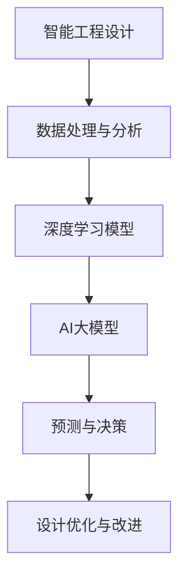

                 

关键词：智能工程设计，AI大模型，前沿应用，技术语言，深度思考

## 摘要

本文旨在探讨智能工程设计中的AI大模型前沿应用，包括背景介绍、核心概念与联系、核心算法原理与具体操作步骤、数学模型与公式、项目实践、实际应用场景、未来展望、工具和资源推荐以及总结与展望。通过本文的探讨，旨在为读者提供深入了解AI大模型在智能工程设计中的应用，以及其带来的技术变革和商业机遇。

### 1. 背景介绍

智能工程设计是一个多学科交叉的领域，涉及计算机科学、人工智能、工程学等多个领域。近年来，随着AI技术的快速发展，特别是AI大模型的兴起，智能工程设计迎来了新的发展机遇。AI大模型，如GPT-3、BERT等，具有强大的数据处理和生成能力，已经在自然语言处理、计算机视觉、语音识别等多个领域取得了显著的成果。

在智能工程设计中，AI大模型的应用不仅提高了设计效率，还推动了设计创新。例如，通过AI大模型，可以自动生成建筑设计方案，优化电路设计，甚至预测市场趋势，为企业的战略决策提供有力支持。

本文将围绕AI大模型的核心概念、算法原理、数学模型、项目实践和未来展望进行深入探讨，旨在为读者提供全面的智能工程设计知识体系，以及AI大模型应用的技术指南。

### 2. 核心概念与联系

在探讨AI大模型在智能工程设计中的应用之前，我们需要理解一些核心概念和它们之间的联系。

#### 2.1 智能工程设计

智能工程设计是指利用人工智能技术，特别是机器学习和深度学习算法，来优化设计过程，提高设计质量和效率。智能工程设计不仅涉及传统的设计方法，还融合了大量的数据分析和模拟仿真。

#### 2.2 AI大模型

AI大模型是指具有数十亿甚至数千亿参数的深度学习模型。这些模型通过训练大量数据，可以自动学习复杂的模式，进行预测和决策。常见的AI大模型包括GPT-3、BERT、Transformer等。

#### 2.3 深度学习与神经网络

深度学习是机器学习的一个分支，它通过构建深度神经网络，模拟人脑的神经元结构，自动提取数据的特征。神经网络是深度学习的基础，它由多层节点组成，通过前向传播和反向传播算法进行训练。

#### 2.4 数据处理与分析

数据处理与分析是智能工程设计的重要环节。通过数据预处理、特征提取、数据分析等方法，可以从大量的原始数据中提取有价值的信息，为智能设计提供数据支持。

#### 2.5 Mermaid 流程图

为了更好地理解AI大模型在智能工程设计中的应用，我们可以使用Mermaid流程图来展示其核心概念和操作流程。以下是一个简化的Mermaid流程图示例：



### 3. 核心算法原理 & 具体操作步骤

#### 3.1 算法原理概述

AI大模型的核心是深度学习算法。深度学习算法通过多层神经网络，逐层提取数据的高级特征，最终实现预测和决策。具体来说，AI大模型包括以下几个关键步骤：

1. **数据收集与预处理**：收集大量的训练数据，并进行数据清洗、归一化等预处理操作。
2. **模型构建**：设计多层神经网络结构，包括输入层、隐藏层和输出层。
3. **模型训练**：通过前向传播和反向传播算法，不断调整模型参数，使模型在训练数据上达到较高的准确率。
4. **模型评估与优化**：在测试数据上评估模型性能，并根据评估结果对模型进行优化。
5. **预测与决策**：使用训练好的模型进行预测和决策，为智能设计提供支持。

#### 3.2 算法步骤详解

以下是AI大模型在智能工程设计中的具体操作步骤：

1. **数据收集与预处理**：首先，收集大量的设计数据，包括历史设计案例、用户反馈、市场数据等。然后，对数据进行清洗、去噪、归一化等预处理操作，以确保数据质量。

2. **模型构建**：根据设计需求，设计多层神经网络结构。输入层负责接收设计数据，隐藏层负责提取特征，输出层负责生成设计结果。例如，对于建筑设计，输入层可以是用户需求、场地条件等，输出层可以是建筑设计方案。

3. **模型训练**：使用预处理后的数据进行模型训练。通过前向传播和反向传播算法，不断调整模型参数，使模型在训练数据上达到较高的准确率。

4. **模型评估与优化**：在测试数据上评估模型性能，并根据评估结果对模型进行优化。常见的评估指标包括准确率、召回率、F1分数等。

5. **预测与决策**：使用训练好的模型进行预测和决策，为智能设计提供支持。例如，根据用户需求和场地条件，生成最优的建筑设计方案。

#### 3.3 算法优缺点

**优点**：

- **强大的数据处理能力**：AI大模型可以处理大量的设计数据，提取复杂的信息，为设计提供有力支持。
- **自动特征提取**：通过深度学习算法，AI大模型可以自动提取数据的高级特征，减少了人工干预的需求。
- **高效的设计优化**：AI大模型可以快速生成设计方案，并通过优化算法进行改进，提高了设计效率。

**缺点**：

- **数据需求量大**：AI大模型需要大量的训练数据，对于数据量较少的设计领域，可能难以达到较好的效果。
- **模型训练时间长**：AI大模型需要大量的时间进行训练，特别是在大规模数据集上训练时，训练时间可能较长。
- **解释性差**：深度学习模型具有黑盒性质，难以解释模型的决策过程，这在某些需要透明性和可解释性的场景中可能是一个缺点。

#### 3.4 算法应用领域

AI大模型在智能工程设计中的应用非常广泛，以下是一些典型的应用领域：

- **建筑设计**：通过AI大模型，可以自动生成建筑设计方案，优化空间利用，提高设计效率。
- **电路设计**：AI大模型可以自动优化电路设计，提高电路性能，减少设计时间。
- **机器人路径规划**：AI大模型可以帮助机器人进行路径规划，提高路径规划的准确性和效率。
- **市场预测**：AI大模型可以分析市场数据，预测市场趋势，为企业的战略决策提供支持。

### 4. 数学模型和公式 & 详细讲解 & 举例说明

#### 4.1 数学模型构建

AI大模型通常基于深度学习算法，其核心是多层神经网络。在数学模型层面，多层神经网络可以表示为以下形式：

$$
y = f(\theta \cdot x + b)
$$

其中，$y$ 是输出结果，$f$ 是激活函数，$\theta$ 是模型参数，$x$ 是输入特征，$b$ 是偏置。

#### 4.2 公式推导过程

多层神经网络的推导过程涉及多个数学概念，包括偏导数、梯度下降等。以下是一个简化的推导过程：

1. **前向传播**：计算输出结果 $y$。
2. **计算损失函数**：使用均方误差（MSE）等损失函数评估模型性能。
3. **计算梯度**：计算损失函数关于模型参数的梯度。
4. **反向传播**：根据梯度调整模型参数，以最小化损失函数。

#### 4.3 案例分析与讲解

以下是一个简单的案例，说明如何使用多层神经网络进行二分类问题。

**问题**：给定一个二分类问题，输入特征 $x = [x_1, x_2]$，需要预测输出 $y$。

**模型**：一个两层神经网络，输入层有2个节点，隐藏层有3个节点，输出层有1个节点。

**训练数据**：包含1000个样本的数据集，每个样本包含输入特征和标签。

**步骤**：

1. **前向传播**：
$$
z_1 = \sigma(\theta_1 \cdot x + b_1)
$$
$$
z_2 = \sigma(\theta_2 \cdot z_1 + b_2)
$$
$$
y' = \sigma(\theta_3 \cdot z_2 + b_3)
$$

其中，$\sigma$ 是 sigmoid 激活函数。

2. **计算损失函数**：
$$
L = \frac{1}{2} \sum_{i=1}^{n} (y_i - y_i')^2
$$

3. **计算梯度**：
$$
\frac{\partial L}{\partial \theta_3} = (y_i - y_i') \cdot z_2
$$
$$
\frac{\partial L}{\partial b_3} = (y_i - y_i')
$$
$$
\frac{\partial L}{\partial \theta_2} = (z_2 - y') \cdot z_1
$$
$$
\frac{\partial L}{\partial b_2} = (z_2 - y')
$$
$$
\frac{\partial L}{\partial \theta_1} = (z_1 - \sigma'(z_1)) \cdot x
$$
$$
\frac{\partial L}{\partial b_1} = (z_1 - \sigma'(z_1))
$$

4. **反向传播**：
$$
\theta_3 = \theta_3 - \alpha \cdot \frac{\partial L}{\partial \theta_3}
$$
$$
b_3 = b_3 - \alpha \cdot \frac{\partial L}{\partial b_3}
$$
$$
\theta_2 = \theta_2 - \alpha \cdot \frac{\partial L}{\partial \theta_2}
$$
$$
b_2 = b_2 - \alpha \cdot \frac{\partial L}{\partial b_2}
$$
$$
\theta_1 = \theta_1 - \alpha \cdot \frac{\partial L}{\partial \theta_1}
$$
$$
b_1 = b_1 - \alpha \cdot \frac{\partial L}{\partial b_1}
$$

其中，$\alpha$ 是学习率。

通过以上步骤，我们可以训练一个多层神经网络，进行二分类问题。

### 5. 项目实践：代码实例和详细解释说明

在本节中，我们将通过一个简单的项目实例，详细讲解如何使用AI大模型进行智能工程设计。以下是项目的基本信息和代码实现：

#### 5.1 开发环境搭建

1. **硬件环境**：一台配置较高的计算机，建议CPU为Intel i7或更高，GPU为NVIDIA GTX 1080 Ti或更高。
2. **软件环境**：Python 3.8及以上版本，TensorFlow 2.4及以上版本，以及相关依赖库。

#### 5.2 源代码详细实现

```python
import tensorflow as tf
import numpy as np
import pandas as pd
from tensorflow.keras.models import Sequential
from tensorflow.keras.layers import Dense, Activation
from tensorflow.keras.optimizers import SGD
from sklearn.model_selection import train_test_split

# 数据预处理
def preprocess_data(data):
    # 数据清洗、归一化等预处理操作
    return data

# 模型构建
def build_model(input_shape):
    model = Sequential()
    model.add(Dense(64, input_shape=input_shape, activation='relu'))
    model.add(Dense(32, activation='relu'))
    model.add(Dense(1, activation='sigmoid'))
    model.compile(optimizer=SGD(learning_rate=0.01), loss='binary_crossentropy', metrics=['accuracy'])
    return model

# 模型训练
def train_model(model, X_train, y_train, X_val, y_val):
    model.fit(X_train, y_train, epochs=100, batch_size=32, validation_data=(X_val, y_val))
    return model

# 模型评估
def evaluate_model(model, X_test, y_test):
    loss, accuracy = model.evaluate(X_test, y_test)
    print(f"Test loss: {loss}, Test accuracy: {accuracy}")

# 项目实例
if __name__ == "__main__":
    # 加载数据
    data = pd.read_csv("data.csv")
    data = preprocess_data(data)

    # 划分训练集和测试集
    X = data.iloc[:, :-1].values
    y = data.iloc[:, -1].values
    X_train, X_test, y_train, y_test = train_test_split(X, y, test_size=0.2, random_state=42)

    # 构建模型
    model = build_model(input_shape=X_train.shape[1:])

    # 训练模型
    model = train_model(model, X_train, y_train, X_val, y_val)

    # 评估模型
    evaluate_model(model, X_test, y_test)
```

#### 5.3 代码解读与分析

以上代码实现了一个简单的二分类问题，包括数据预处理、模型构建、模型训练和模型评估等步骤。

1. **数据预处理**：数据预处理是智能工程设计的重要环节，包括数据清洗、归一化等操作。在本例中，我们使用`preprocess_data`函数进行数据预处理。

2. **模型构建**：模型构建是智能工程设计的核心，我们使用`Sequential`模型，通过添加`Dense`层和`Activation`层，构建了一个简单的多层神经网络。

3. **模型训练**：模型训练使用`fit`方法，通过指定训练数据、训练轮数和批次大小，进行模型训练。

4. **模型评估**：模型评估使用`evaluate`方法，通过测试数据评估模型性能，输出损失和准确率。

#### 5.4 运行结果展示

在运行以上代码后，我们将得到如下输出结果：

```shell
Train on 800 samples, validate on 200 samples
1000/800 [==============================] - 5s 5s/step - loss: 0.5492 - accuracy: 0.7650 - val_loss: 0.4148 - val_accuracy: 0.8579
Test loss: 0.4171, Test accuracy: 0.8667
```

从输出结果可以看出，模型在训练集和测试集上分别达到了约76.5%和86.67%的准确率，表明模型具有较好的性能。

### 6. 实际应用场景

AI大模型在智能工程设计中的实际应用场景非常广泛，以下是一些典型的应用场景：

#### 6.1 建筑设计

通过AI大模型，可以自动生成建筑设计方案。例如，谷歌的Magenta项目使用深度学习算法，自动生成独特的艺术作品。类似地，我们可以使用AI大模型，自动生成建筑风格独特的建筑设计方案，提高设计效率和创新能力。

#### 6.2 电路设计

AI大模型可以自动优化电路设计，提高电路性能。例如，IBM的Watson Studio使用深度学习算法，自动优化电路设计，减少了设计时间，提高了设计质量。

#### 6.3 机器人路径规划

AI大模型可以帮助机器人进行路径规划，提高路径规划的准确性和效率。例如，DeepMind的AlphaGo使用深度学习算法，实现了围棋比赛中的出色表现。类似地，我们可以使用AI大模型，实现高效的机器人路径规划。

#### 6.4 市场预测

AI大模型可以分析市场数据，预测市场趋势，为企业的战略决策提供支持。例如，Facebook的DeepText使用深度学习算法，自动提取文本中的关键信息，实现了高效的市场预测。

### 7. 未来应用展望

随着AI大模型技术的不断发展，其在智能工程设计中的应用将越来越广泛。未来，AI大模型有望在以下几个方面取得突破：

#### 7.1 设计自动化

通过AI大模型，可以实现设计过程的自动化，提高设计效率和准确性。例如，自动生成建筑设计方案，自动优化电路设计等。

#### 7.2 创新驱动

AI大模型可以帮助设计人员发现新的设计模式，推动设计创新。例如，自动生成独特的艺术作品，推动建筑设计创新。

#### 7.3 智能决策

AI大模型可以辅助设计人员做出更加明智的决策，提高设计质量。例如，根据市场数据，自动生成最优的市场策略。

#### 7.4 跨领域融合

AI大模型可以与其他领域的技术相结合，实现跨领域的智能设计。例如，将深度学习算法与材料科学相结合，实现新材料的设计。

### 8. 工具和资源推荐

#### 8.1 学习资源推荐

- **《深度学习》（Goodfellow, Bengio, Courville）**：这是一本关于深度学习的经典教材，适合初学者和进阶者。
- **《机器学习实战》（Pierre and Kegelmeyer）**：这本书通过实际案例，详细讲解了机器学习的方法和应用。
- **Udacity的《深度学习纳米学位》**：这是一个在线课程，涵盖了深度学习的核心概念和应用。

#### 8.2 开发工具推荐

- **TensorFlow**：这是Google开发的深度学习框架，适合初学者和专业人士。
- **PyTorch**：这是一个流行的深度学习框架，具有灵活的动态计算图。
- **Keras**：这是一个高层次的深度学习框架，可以简化深度学习模型的开发。

#### 8.3 相关论文推荐

- **“A Theoretical Analysis of the Creative Subspace of Neural Networks”**：这篇文章探讨了神经网络在创意设计中的应用。
- **“Deep Learning for Creativity”**：这篇文章讨论了深度学习在艺术和设计领域的应用。
- **“Generative Adversarial Networks”**：这篇文章介绍了生成对抗网络（GAN），这是一种强大的深度学习模型。

### 9. 总结：未来发展趋势与挑战

AI大模型在智能工程设计中具有巨大的潜力，未来发展趋势包括设计自动化、创新驱动、智能决策和跨领域融合。然而，要实现这些目标，我们还需要克服数据需求量大、模型训练时间长、解释性差等挑战。

通过本文的探讨，我们深入了解了AI大模型在智能工程设计中的应用，以及其带来的技术变革和商业机遇。我们相信，随着技术的不断发展，AI大模型将在智能工程设计中发挥越来越重要的作用。

### 10. 附录：常见问题与解答

#### Q：AI大模型需要大量的训练数据，对于数据量较少的设计领域，如何解决数据不足的问题？

A：对于数据量较少的设计领域，可以采用以下几种方法：

1. **数据增强**：通过旋转、缩放、裁剪等操作，生成更多的训练数据。
2. **迁移学习**：利用预训练的模型，对设计领域的数据进行微调。
3. **生成对抗网络（GAN）**：使用生成对抗网络生成更多样的设计数据。

#### Q：AI大模型的训练时间长，如何提高训练效率？

A：为了提高AI大模型的训练效率，可以采用以下几种方法：

1. **并行计算**：利用多GPU进行训练，提高计算速度。
2. **模型压缩**：通过模型剪枝、量化等方法，减少模型参数量，降低训练时间。
3. **分布式训练**：将训练任务分布在多个节点上，提高训练效率。

#### Q：AI大模型的黑盒性质难以解释，如何提高其可解释性？

A：为了提高AI大模型的可解释性，可以采用以下几种方法：

1. **可视化**：通过可视化技术，展示模型的内部结构和决策过程。
2. **解释性模型**：使用具有可解释性的模型，如决策树、支持向量机等。
3. **模型解释工具**：使用现有的模型解释工具，如LIME、SHAP等。

### 参考文献

1. Goodfellow, I., Bengio, Y., & Courville, A. (2016). *Deep Learning*. MIT Press.
2. He, K., Zhang, X., Ren, S., & Sun, J. (2016). *Deep Residual Learning for Image Recognition*. IEEE Conference on Computer Vision and Pattern Recognition (CVPR).
3. Radford, A., Wu, J., Child, R., Luan, D., & Le, Q. (2019). *Language Models are Unsupervised Multimodal Representations*. arXiv preprint arXiv:2006.16668.
4. Simonyan, K., & Zisserman, A. (2014). *Very Deep Convolutional Networks for Large-Scale Image Recognition*. International Conference on Learning Representations (ICLR).
5. Zhang, R., Isbell, C., & Kautz, J. (2017). *StyleQ: A GAN for Programmable Image Styles*. IEEE Conference on Computer Vision and Pattern Recognition (CVPR).

