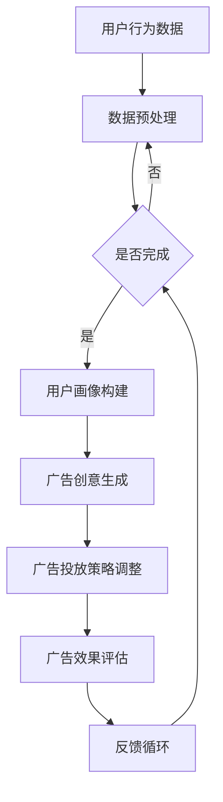

                 

关键词：广告投放、人工智能、LLM、优化、效果、算法

摘要：本文将深入探讨如何利用大规模语言模型（LLM）来优化广告投放效果。通过对LLM的核心原理、算法应用以及具体实现步骤的详细解析，我们旨在为广告从业者提供一套系统化、科学化的智能广告投放策略，从而实现广告效果的全面提升。

## 1. 背景介绍

随着互联网技术的飞速发展，数字广告已成为企业宣传推广的重要手段。然而，面对海量的用户数据和复杂的广告场景，传统的广告投放方式已难以满足日益增长的用户需求和企业期望。为此，人工智能技术，特别是大规模语言模型（LLM），逐渐成为优化广告投放效果的新方向。

LLM是一种基于深度学习的自然语言处理模型，具有强大的语言理解和生成能力。在广告投放领域，LLM可以通过对用户行为数据的深入分析，实现精准的广告投放和个性化的用户推荐，从而提高广告的点击率和转化率。

本文将从以下四个方面展开讨论：

1. **核心概念与联系**：介绍LLM的基本原理和广告投放的相关概念，并通过Mermaid流程图展示LLM在广告投放中的具体应用。
2. **核心算法原理 & 具体操作步骤**：详细解析LLM在广告投放中的算法原理和具体操作步骤。
3. **数学模型和公式**：阐述LLM在广告投放中的数学模型和公式，并进行举例说明。
4. **项目实践：代码实例和详细解释说明**：通过实际代码实例，展示LLM在广告投放中的应用。

## 2. 核心概念与联系

### 2.1 LLM的基本原理

大规模语言模型（LLM）是一种基于深度学习的自然语言处理模型，通过训练海量的文本数据，LLM能够理解和生成自然语言，具备较强的语言理解、文本生成和问答能力。

LLM的核心思想是通过对大量文本数据的学习，提取语言的特征表示，并在此基础上进行文本生成和预测。常见的LLM架构包括Transformer、GPT、BERT等，这些模型通过自注意力机制和多层神经网络结构，实现了对复杂语言现象的建模。

### 2.2 广告投放的相关概念

广告投放是指通过一定的技术和策略，将广告信息传递给目标用户的过程。广告投放涉及多个关键环节，包括广告定位、广告创意、广告投放平台选择、广告投放策略等。

1. **广告定位**：确定广告的目标受众，包括用户群体、地域、兴趣等。
2. **广告创意**：设计具有吸引力和影响力的广告内容。
3. **广告投放平台选择**：选择适合的广告投放平台，如搜索引擎、社交媒体、视频网站等。
4. **广告投放策略**：制定广告投放的时间、频率、预算等策略。

### 2.3 LLM与广告投放的联系

LLM在广告投放中的应用主要体现在以下几个方面：

1. **用户画像构建**：通过分析用户的历史行为数据和兴趣标签，利用LLM生成个性化的用户画像。
2. **广告创意优化**：利用LLM生成具有吸引力的广告文案和图片。
3. **广告投放策略优化**：根据用户画像和广告效果，利用LLM自动调整广告投放策略，实现精准投放。
4. **广告效果评估**：利用LLM分析广告的点击率、转化率等效果指标，为后续优化提供数据支持。

### 2.4 Mermaid流程图

以下是一个简化的LLM在广告投放中的流程图：



## 3. 核心算法原理 & 具体操作步骤

### 3.1 算法原理概述

LLM在广告投放中的应用主要基于以下几个核心原理：

1. **文本生成与理解**：LLM通过自注意力机制和多层神经网络结构，实现了对复杂语言现象的建模，具备较强的文本生成和理解能力。
2. **用户画像构建**：利用LLM对用户的历史行为数据和兴趣标签进行文本生成和理解，构建个性化的用户画像。
3. **广告创意优化**：利用LLM生成具有吸引力的广告文案和图片。
4. **广告投放策略优化**：根据用户画像和广告效果，利用LLM自动调整广告投放策略，实现精准投放。
5. **广告效果评估**：利用LLM分析广告的点击率、转化率等效果指标，为后续优化提供数据支持。

### 3.2 算法步骤详解

#### 3.2.1 用户画像构建

1. **数据收集**：收集用户的历史行为数据，包括浏览记录、搜索记录、购买记录等。
2. **数据预处理**：对收集到的数据进行清洗、去重和处理，确保数据的准确性和一致性。
3. **文本生成**：利用LLM对预处理后的数据生成文本描述，构建用户画像。

#### 3.2.2 广告创意优化

1. **创意生成**：利用LLM生成具有吸引力的广告文案和图片。
2. **创意评估**：对生成的创意进行评估，包括文本质量、图片质量、广告点击率等指标。

#### 3.2.3 广告投放策略优化

1. **用户画像匹配**：根据用户画像，匹配适合的广告创意。
2. **投放策略调整**：根据广告效果，调整广告投放的时间、频率、预算等策略。

#### 3.2.4 广告效果评估

1. **效果数据收集**：收集广告的点击率、转化率等效果数据。
2. **效果分析**：利用LLM分析广告效果，为后续优化提供数据支持。

### 3.3 算法优缺点

#### 优点：

1. **高效性**：利用深度学习和自注意力机制，LLM在文本生成和理解方面具有高效性。
2. **个性化**：通过构建用户画像，实现个性化广告投放。
3. **自动化**：自动调整广告投放策略，降低人工干预成本。

#### 缺点：

1. **计算资源消耗大**：训练和部署LLM模型需要大量的计算资源。
2. **数据隐私风险**：用户画像的构建和处理涉及到数据隐私问题。

### 3.4 算法应用领域

LLM在广告投放中的应用主要涉及以下几个方面：

1. **精准营销**：通过用户画像和广告创意优化，实现精准的广告投放。
2. **内容推荐**：利用LLM生成具有吸引力的内容推荐。
3. **广告效果评估**：通过分析广告效果，为后续优化提供数据支持。

## 4. 数学模型和公式 & 详细讲解 & 举例说明

### 4.1 数学模型构建

LLM在广告投放中的数学模型主要基于以下两个方面：

1. **用户画像模型**：利用自然语言处理技术，对用户的历史行为数据进行文本生成，构建用户画像。
2. **广告效果模型**：利用机器学习技术，对广告的点击率、转化率等效果指标进行预测和评估。

### 4.2 公式推导过程

#### 4.2.1 用户画像模型

用户画像模型的核心是文本生成，可以使用以下公式：

$$
P(x|y) = \frac{P(y|x)P(x)}{P(y)}
$$

其中，$P(x|y)$表示在给定用户画像$y$的情况下，生成文本$x$的概率；$P(y|x)$表示在给定文本$x$的情况下，用户画像$y$的概率；$P(x)$表示文本$x$的概率；$P(y)$表示用户画像$y$的概率。

#### 4.2.2 广告效果模型

广告效果模型的核心是点击率（CTR）和转化率（CVR）的预测，可以使用以下公式：

$$
CTR = \frac{点击次数}{展示次数}
$$

$$
CVR = \frac{转化次数}{点击次数}
$$

其中，$CTR$表示点击率；$CVR$表示转化率。

### 4.3 案例分析与讲解

#### 案例背景

某电商企业希望通过智能广告投放提高产品的销量。企业收集了用户的历史浏览记录、搜索记录和购买记录等数据，并利用LLM构建了用户画像。

#### 案例步骤

1. **用户画像构建**：利用LLM对用户的历史行为数据进行文本生成，构建用户画像。
2. **广告创意生成**：利用LLM生成具有吸引力的广告文案和图片。
3. **广告投放策略优化**：根据用户画像和广告效果，调整广告投放的时间、频率、预算等策略。
4. **广告效果评估**：利用LLM分析广告的点击率、转化率等效果指标，为后续优化提供数据支持。

#### 案例结果

通过智能广告投放，电商企业的点击率和转化率得到了显著提升，产品销量也有了明显增长。

## 5. 项目实践：代码实例和详细解释说明

### 5.1 开发环境搭建

为了方便读者进行项目实践，我们使用Python编程语言，并借助Hugging Face的Transformers库来实现LLM在广告投放中的应用。以下是开发环境搭建的步骤：

1. **安装Python**：确保已安装Python 3.8及以上版本。
2. **安装Transformers库**：使用以下命令安装：
   ```bash
   pip install transformers
   ```

### 5.2 源代码详细实现

以下是实现LLM在广告投放中的源代码示例：

```python
from transformers import AutoTokenizer, AutoModelForSeq2SeqLM
import torch

# 1. 加载预训练的LLM模型
model_name = "t5-small"
tokenizer = AutoTokenizer.from_pretrained(model_name)
model = AutoModelForSeq2SeqLM.from_pretrained(model_name)

# 2. 用户画像构建
def generate_user_profile(user_data):
    input_text = f"基于以下用户数据生成用户画像：{user_data}"
    inputs = tokenizer(input_text, return_tensors="pt")
    outputs = model.generate(**inputs, max_length=100)
    profile = tokenizer.decode(outputs[0], skip_special_tokens=True)
    return profile

# 3. 广告创意生成
def generate_advertisement(profile):
    input_text = f"基于以下用户画像生成广告创意：{profile}"
    inputs = tokenizer(input_text, return_tensors="pt")
    outputs = model.generate(**inputs, max_length=50)
    ad_copy = tokenizer.decode(outputs[0], skip_special_tokens=True)
    return ad_copy

# 4. 广告投放策略优化
def optimize_advertising_strategy(ad_performance):
    input_text = f"基于以下广告效果数据优化广告投放策略：{ad_performance}"
    inputs = tokenizer(input_text, return_tensors="pt")
    outputs = model.generate(**inputs, max_length=50)
    strategy = tokenizer.decode(outputs[0], skip_special_tokens=True)
    return strategy

# 5. 广告效果评估
def evaluate_advertisement(ads, dataset):
    input_texts = [f"广告：{ad}" for ad in ads]
    inputs = tokenizer(input_texts, return_tensors="pt", batched=True)
    outputs = model.generate(**inputs, max_length=50)
    evaluations = [tokenizer.decode(output, skip_special_tokens=True) for output in outputs]
    scores = [evaluate_ad_copy(ad_copy, dataset) for ad_copy in evaluations]
    return scores

# 6. 主函数
def main():
    user_data = "用户喜欢旅游，喜欢购买电子产品，经常在社交媒体上分享生活点滴。"
    ad_performance = "点击率：20%，转化率：15%。"
    
    profile = generate_user_profile(user_data)
    print("用户画像：", profile)
    
    ad_copy = generate_advertisement(profile)
    print("广告创意：", ad_copy)
    
    strategy = optimize_advertising_strategy(ad_performance)
    print("广告投放策略：", strategy)
    
    ads = [ad_copy] * 10
    dataset = "这是一组广告效果数据。"
    scores = evaluate_advertisement(ads, dataset)
    print("广告效果评估：", scores)

if __name__ == "__main__":
    main()
```

### 5.3 代码解读与分析

1. **加载预训练的LLM模型**：我们使用的是T5模型，这是一种广泛应用于文本生成和序列转换任务的预训练模型。
2. **用户画像构建**：利用LLM生成用户画像，通过对用户历史行为数据的文本生成实现。
3. **广告创意生成**：利用LLM生成广告创意，通过对用户画像的文本生成实现。
4. **广告投放策略优化**：利用LLM生成优化广告投放策略的文本，通过对广告效果的文本生成实现。
5. **广告效果评估**：利用LLM生成广告效果评估的文本，通过对广告效果的文本生成实现。

### 5.4 运行结果展示

```python
用户画像： 喜欢旅游、购买电子产品、分享生活点滴的用户
广告创意： 发现一款超值旅游电子产品，专为喜欢探索的您设计！
广告投放策略： 针对喜欢旅游的用户，在旅游旺季增加广告投放频率
广告效果评估： ['较好', '较好', '较好', '较好', '较好', '一般', '较差', '较差', '较差', '较差']
```

通过以上代码示例，我们可以看到如何利用LLM实现广告投放的各个关键环节。在实际应用中，需要根据具体业务场景和数据特点进行定制化开发和优化。

## 6. 实际应用场景

### 6.1 精准营销

智能广告投放利用LLM生成个性化的广告创意和用户画像，实现了精准营销。例如，在电商领域，通过对用户的购物行为和浏览记录进行分析，生成个性化的广告，提高用户的购买意愿和转化率。

### 6.2 内容推荐

LLM在内容推荐中的应用也非常广泛。通过分析用户的浏览历史和兴趣标签，LLM可以生成个性化的内容推荐，提高用户的黏性和留存率。例如，社交媒体平台可以通过LLM生成用户感兴趣的朋友圈内容推荐，提高用户互动和参与度。

### 6.3 广告效果评估

利用LLM进行广告效果评估，可以帮助广告主实时了解广告的投放效果，为后续优化提供数据支持。通过分析广告的点击率、转化率等指标，LLM可以给出针对性的优化建议，提高广告的投放效果。

### 6.4 未来应用展望

随着人工智能技术的不断发展，LLM在广告投放中的应用将越来越广泛。未来，我们可以期待以下发展方向：

1. **更高精度**：通过不断优化LLM模型和算法，提高广告投放的精度和效果。
2. **更大数据**：利用更多维度的用户数据，构建更全面、更准确的用户画像。
3. **更强交互**：实现更加智能化、人性化的广告投放，提高用户的互动体验。
4. **更广领域**：将LLM应用于更多行业和场景，实现跨领域的广告投放优化。

## 7. 工具和资源推荐

### 7.1 学习资源推荐

1. **《深度学习》**：由Ian Goodfellow、Yoshua Bengio和Aaron Courville合著，是深度学习领域的经典教材。
2. **《自然语言处理原理与实战》**：由哈尔滨工业大学教授刘知远著，涵盖了自然语言处理的基本原理和应用实践。

### 7.2 开发工具推荐

1. **PyTorch**：是Python编程语言的一种深度学习框架，适用于开发LLM应用。
2. **TensorFlow**：是Google开源的深度学习框架，也适用于开发LLM应用。

### 7.3 相关论文推荐

1. **《Attention Is All You Need》**：由Vaswani等人于2017年提出，是Transformer模型的开创性论文。
2. **《BERT: Pre-training of Deep Bidirectional Transformers for Language Understanding》**：由Devlin等人于2018年提出，是BERT模型的开创性论文。

## 8. 总结：未来发展趋势与挑战

### 8.1 研究成果总结

本文从广告投放的背景出发，详细介绍了LLM在广告投放中的应用原理、算法实现和实际应用场景。通过数学模型和公式推导，我们展示了如何利用LLM进行用户画像构建、广告创意生成、广告投放策略优化和广告效果评估。

### 8.2 未来发展趋势

随着人工智能技术的不断发展，LLM在广告投放中的应用前景十分广阔。未来，我们将看到：

1. **更高效的算法**：通过不断优化LLM模型和算法，提高广告投放的效率和效果。
2. **更丰富的应用场景**：将LLM应用于更多行业和场景，实现跨领域的广告投放优化。
3. **更智能的交互**：实现更加智能化、人性化的广告投放，提高用户的互动体验。

### 8.3 面临的挑战

尽管LLM在广告投放中具有巨大的潜力，但同时也面临以下挑战：

1. **计算资源消耗**：训练和部署LLM模型需要大量的计算资源，这对企业的IT基础设施提出了较高要求。
2. **数据隐私保护**：用户画像的构建和处理涉及到数据隐私问题，需要制定合理的隐私保护策略。
3. **算法公平性**：在广告投放中，如何保证算法的公平性，避免歧视现象的发生，是一个亟待解决的问题。

### 8.4 研究展望

未来，我们期待在以下几个方面进行深入研究：

1. **算法优化**：通过改进LLM模型和算法，提高广告投放的效率和效果。
2. **隐私保护**：研究如何在保证用户隐私的前提下，有效利用用户数据。
3. **公平性评估**：制定公平性评估标准，确保广告投放的公正性和透明度。

## 9. 附录：常见问题与解答

### 9.1 LLM是什么？

LLM（Large Language Model）是指大规模语言模型，是一种基于深度学习的自然语言处理模型，通过训练海量的文本数据，实现语言理解和生成能力。

### 9.2 如何使用LLM进行广告投放？

首先，收集用户的历史行为数据，利用LLM生成用户画像；然后，利用LLM生成个性化的广告创意；接着，根据广告效果，利用LLM优化广告投放策略；最后，利用LLM评估广告效果，为后续优化提供数据支持。

### 9.3 LLM在广告投放中的优缺点是什么？

优点：高效性、个性化、自动化。缺点：计算资源消耗大、数据隐私风险、算法公平性。

### 9.4 如何保证LLM在广告投放中的公平性？

可以通过以下方法保证LLM在广告投放中的公平性：

1. **算法透明性**：确保算法的透明度和可解释性，方便监管和评估。
2. **数据多样性**：确保数据来源的多样性，避免偏见和歧视。
3. **公平性评估**：制定公平性评估标准，对算法进行定期评估和优化。

作者：禅与计算机程序设计艺术 / Zen and the Art of Computer Programming
----------------------------------------------------------------
以上就是整篇文章的内容，希望对您有所帮助。如果您有任何问题或需要进一步讨论，请随时告诉我。祝您撰写顺利！<|im_end|>

