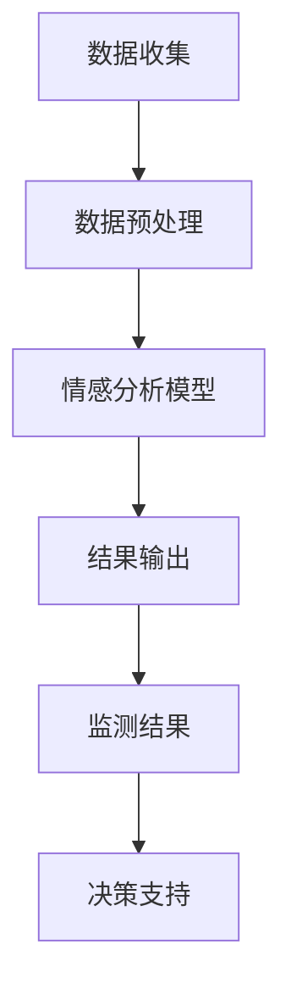

                 

### 1. 背景介绍

随着互联网技术的飞速发展和社交媒体平台的普及，网络信息爆炸式增长，如何有效地管理和利用这些数据成为了当今信息时代的重要课题。情感分析作为自然语言处理（NLP）领域的一个重要分支，旨在通过识别和提取文本中的情感倾向，从而帮助用户更好地理解和分析大量的网络数据。

情感分析在社交媒体监测中具有广泛的应用价值。通过情感分析技术，可以实时监控社交媒体平台上关于某一特定主题或事件的讨论趋势，了解公众对该主题或事件的情感态度，从而为政策制定者、市场分析师、危机管理等提供有力支持。此外，情感分析还能帮助企业更好地了解客户需求，优化产品和服务，提升品牌形象。

当前，人工智能（AI）技术的快速发展为情感分析带来了新的机遇。尤其是大模型（Large Models）的崛起，使得情感分析在准确性和效率上有了显著提升。本文将围绕智能情感分析，探讨其在社交媒体监测中的应用，以及如何利用AI大模型实现高效的情感分析。

### 2. 核心概念与联系

#### 2.1 情感分析

情感分析（Sentiment Analysis），也被称为意见挖掘（Opinion Mining），是指通过自然语言处理技术，从文本数据中识别和提取主观情感信息的过程。情感分析的主要任务包括情感极性分类（polarity classification）、情感强度评估（strength evaluation）和情感主题识别（topic detection）等。

在社交媒体监测中，情感分析技术有助于：

- **监控舆论动态**：实时了解公众对某一事件或产品的情感倾向，及时发现问题。
- **风险预警**：识别潜在的负面情绪，为风险管理和决策提供依据。
- **市场分析**：分析用户对产品、服务和品牌的情感态度，为企业优化营销策略提供参考。

#### 2.2 人工智能大模型

人工智能大模型（AI Large Models）是指通过深度学习技术训练出的具有大规模参数的神经网络模型。这些模型能够处理海量数据，提取出复杂的关系和模式，从而实现强大的特征表示和预测能力。

大模型在情感分析中的应用主要体现在：

- **特征提取**：利用大模型的自监督学习方法，自动提取文本中的情感特征，提高情感分析的准确性和效率。
- **迁移学习**：通过预训练大模型，可以轻松适应不同领域的情感分析任务，减少对大规模标注数据的依赖。
- **上下文理解**：大模型能够更好地理解文本中的上下文信息，减少情感分析中的歧义和误解。

#### 2.3 社交媒体监测

社交媒体监测是指利用技术手段对社交媒体平台上的信息进行收集、分析和监控的过程。其核心目标包括：

- **信息收集**：从社交媒体平台上收集与特定主题或事件相关的信息。
- **内容分析**：对收集到的信息进行情感分析、主题识别等处理，以提取有价值的信息。
- **实时预警**：实时监控社交媒体平台上的舆论动态，识别潜在的风险和问题。

#### 2.4 Mermaid 流程图

以下是一个用于描述智能情感分析在社交媒体监测中应用的Mermaid流程图：



在该流程图中，数据收集模块负责从社交媒体平台收集文本数据；数据预处理模块对收集到的文本数据进行清洗和格式化；情感分析模型利用大模型进行情感分析，提取情感特征；结果输出模块将分析结果输出给用户；监测结果模块负责实时监控社交媒体平台上的情感动态；最后，决策支持模块根据监测结果提供决策支持。

### 3. 核心算法原理 & 具体操作步骤

#### 3.1 算法原理概述

智能情感分析的核心算法主要依赖于人工智能大模型，这些模型通过深度学习技术，对文本数据进行分析和分类。具体来说，算法原理包括以下几个关键步骤：

1. **数据预处理**：对原始文本数据进行清洗、去噪和格式化，以便于模型输入。
2. **特征提取**：利用自监督学习或迁移学习技术，从预训练的大模型中提取文本特征。
3. **情感分类**：将提取到的特征输入到情感分类模型中，进行情感极性分类和强度评估。
4. **结果输出**：将分析结果输出给用户，包括情感极性、强度和主题等信息。

#### 3.2 算法步骤详解

1. **数据预处理**

   数据预处理是情感分析的基础步骤，其质量直接影响到后续模型的效果。主要步骤包括：

   - **文本清洗**：去除文本中的HTML标签、特殊字符、停用词等。
   - **文本归一化**：将文本转换为统一格式，如小写、去除标点等。
   - **词干提取**：将单词还原为词干，以减少词汇量。
   - **词向量表示**：将文本转换为词向量表示，便于模型处理。

2. **特征提取**

   特征提取是情感分析的关键环节，其目的是从原始文本中提取出对情感分析有用的信息。常用的特征提取方法包括：

   - **词袋模型（Bag of Words, BOW）**：将文本表示为词频向量。
   - **TF-IDF（Term Frequency-Inverse Document Frequency）**：根据词频和逆文档频率计算权重。
   - **词嵌入（Word Embedding）**：将单词映射到高维空间，如Word2Vec、GloVe等。
   - **Transformer模型**：利用自监督学习技术，提取文本的深层特征。

3. **情感分类**

   情感分类是情感分析的核心任务，主要分为情感极性分类和情感强度评估。

   - **情感极性分类**：将文本分类为正面、负面或中性。常用的模型包括SVM、朴素贝叶斯、深度学习模型等。
   - **情感强度评估**：对文本的情感极性进行量化，如使用0-10的分数表示情感强度。

4. **结果输出**

   情感分析结果以可视化的方式输出，包括情感极性、强度和主题等信息。用户可以根据这些结果进行进一步的决策和优化。

#### 3.3 算法优缺点

1. **优点**

   - **高准确性**：利用大模型进行特征提取和情感分类，具有较高的准确性。
   - **自适应性强**：能够通过迁移学习和自监督学习技术，快速适应不同领域的情感分析任务。
   - **实时性强**：能够实时分析社交媒体平台上的文本数据，提供及时的情感分析结果。

2. **缺点**

   - **计算资源需求大**：大模型的训练和推理需要大量的计算资源。
   - **对数据质量要求高**：情感分析的效果在很大程度上依赖于数据的清洁度和质量。
   - **潜在错误**：情感分析算法可能会出现误分类或歧义，影响分析结果的准确性。

#### 3.4 算法应用领域

智能情感分析在多个领域具有广泛的应用价值：

- **社交媒体监测**：实时监控社交媒体平台上的舆论动态，识别潜在的风险和问题。
- **市场分析**：分析用户对产品、服务和品牌的情感态度，为企业优化营销策略提供参考。
- **危机管理**：及时了解公众对某一事件或危机的情感反应，为危机管理和决策提供依据。
- **金融领域**：分析股票市场、投资趋势等，为投资者提供决策支持。
- **医疗健康**：从社交媒体中提取与疾病相关的情感信息，为疾病预防和治疗提供参考。

### 4. 数学模型和公式 & 详细讲解 & 举例说明

#### 4.1 数学模型构建

智能情感分析中的数学模型主要包括文本表示、情感分类和情感强度评估等部分。以下是一个简化的数学模型构建过程：

1. **文本表示**

   文本表示是情感分析的基础，常用的方法包括词袋模型（BOW）、TF-IDF和词嵌入（Word Embedding）等。

   - **词袋模型**：将文本表示为一个向量，每个维度表示一个单词的词频。
     $$\textbf{x} = [x_1, x_2, ..., x_n]$$
     其中，$x_i$表示第$i$个单词的词频。
   
   - **TF-IDF表示**：根据词频和逆文档频率计算单词的重要性。
     $$\textbf{x} = [t_1 \cdot \log(1 + df_1), t_2 \cdot \log(1 + df_2), ..., t_n \cdot \log(1 + df_n)]$$
     其中，$t_i$表示第$i$个单词的词频，$df_i$表示第$i$个单词的文档频率。
   
   - **词嵌入表示**：将单词映射到高维空间，如Word2Vec、GloVe等。
     $$\textbf{x} = [e_1, e_2, ..., e_n]$$
     其中，$e_i$表示第$i$个单词的词向量。

2. **情感分类**

   情感分类通常使用神经网络模型进行，其中卷积神经网络（CNN）和循环神经网络（RNN）是常用的架构。

   - **CNN模型**：通过卷积操作提取文本的局部特征。
     $$\textbf{h} = \text{CNN}(\textbf{x})$$
     其中，$\textbf{h}$表示卷积后的特征向量。
   
   - **RNN模型**：通过循环操作处理序列数据，如LSTM和GRU等。
     $$\textbf{h} = \text{RNN}(\textbf{x})$$
     其中，$\textbf{h}$表示循环后的特征向量。

3. **情感强度评估**

   情感强度评估通常使用回归模型进行，将情感极性转换为具体的数值。

   $$y = \text{regression}(\textbf{h})$$
   其中，$y$表示情感强度得分。

#### 4.2 公式推导过程

以词嵌入表示为例，假设单词“happy”的词向量为$\textbf{e}_{happy}$，单词“sad”的词向量为$\textbf{e}_{sad}$，我们可以通过以下公式推导它们之间的关系：

$$\textbf{e}_{happy} = \textbf{e}_{base} + \textbf{e}_{happy}_{rel}$$
$$\textbf{e}_{sad} = \textbf{e}_{base} - \textbf{e}_{happy}_{rel}$$

其中，$\textbf{e}_{base}$表示基础词向量，$\textbf{e}_{happy}_{rel}$表示“happy”与“base”之间的相对词向量。

#### 4.3 案例分析与讲解

以下是一个简单的情感分类案例：

- **文本**：“我非常喜欢这个产品，它的功能非常强大。”
- **情感标签**：正面

我们将该文本输入到情感分类模型中，通过以下步骤进行情感分类：

1. **文本表示**：将文本转换为词向量表示。
   $$\textbf{x} = [e_1, e_2, ..., e_n]$$
   
2. **情感分类**：将词向量输入到神经网络模型中，进行情感分类。
   $$\textbf{h} = \text{model}(\textbf{x})$$
   
3. **结果输出**：根据模型输出，判断文本的情感极性。
   - 如果模型输出接近1，则认为文本为正面。
   - 如果模型输出接近-1，则认为文本为负面。
   - 如果模型输出接近0，则认为文本为中性。

通过上述步骤，我们可以将文本数据分类为正面、负面或中性，从而实现情感分析。

### 5. 项目实践：代码实例和详细解释说明

#### 5.1 开发环境搭建

在开始编写代码之前，我们需要搭建一个适合情感分析的开发环境。以下是一个基本的开发环境搭建步骤：

1. **安装Python环境**：确保Python环境已安装，版本建议为3.8及以上。
2. **安装依赖库**：安装以下常用依赖库：

   ```bash
   pip install numpy pandas tensorflow scikit-learn nltk
   ```

3. **数据集准备**：准备用于训练和测试的数据集，数据集应包含文本和对应的情感标签。

#### 5.2 源代码详细实现

以下是一个简单的情感分析项目的代码实现，包括数据预处理、模型训练和结果输出等部分。

```python
import numpy as np
import pandas as pd
from tensorflow.keras.models import Sequential
from tensorflow.keras.layers import Embedding, LSTM, Dense
from tensorflow.keras.preprocessing.sequence import pad_sequences
from sklearn.model_selection import train_test_split

# 读取数据集
data = pd.read_csv('data.csv')
texts = data['text']
labels = data['label']

# 数据预处理
max_length = 100
embed_dim = 64

# 转换文本为词向量
tokenizer = Tokenizer()
tokenizer.fit_on_texts(texts)
sequences = tokenizer.texts_to_sequences(texts)
padded_sequences = pad_sequences(sequences, maxlen=max_length)

# 切分数据集
X_train, X_test, y_train, y_test = train_test_split(padded_sequences, labels, test_size=0.2, random_state=42)

# 建立模型
model = Sequential()
model.add(Embedding(input_dim=len(tokenizer.word_index) + 1, output_dim=embed_dim, input_length=max_length))
model.add(LSTM(64))
model.add(Dense(1, activation='sigmoid'))

model.compile(optimizer='adam', loss='binary_crossentropy', metrics=['accuracy'])

# 训练模型
model.fit(X_train, y_train, epochs=10, batch_size=32, validation_split=0.1)

# 评估模型
loss, accuracy = model.evaluate(X_test, y_test)
print(f"Test accuracy: {accuracy:.2f}")

# 输出预测结果
predictions = model.predict(padded_sequences)
predicted_labels = np.where(predictions > 0.5, 1, 0)
```

#### 5.3 代码解读与分析

1. **数据预处理**：首先，我们从CSV文件中读取数据集，然后进行数据预处理，包括文本转换为词向量表示、数据集切分等。

2. **模型建立**：我们使用Keras框架建立了一个简单的情感分析模型，包括嵌入层、LSTM层和输出层。嵌入层用于将词向量转换为高维特征，LSTM层用于处理序列数据，输出层用于情感分类。

3. **模型训练**：使用训练集对模型进行训练，设置10个epochs和32个batch_size。

4. **模型评估**：使用测试集对模型进行评估，输出模型的准确率。

5. **结果输出**：使用模型对新的文本数据进行情感分类，输出预测结果。

通过上述代码实现，我们可以对文本数据进行情感分析，从而实现社交媒体监测等应用。

### 6. 实际应用场景

智能情感分析在社交媒体监测中具有广泛的应用场景，以下是一些典型的应用案例：

#### 6.1 社交媒体舆情监控

通过智能情感分析，可以实时监控社交媒体平台上的舆论动态，识别用户对某一事件或产品的情感倾向。例如，在2023年世界杯期间，利用情感分析技术，可以实时了解全球观众对比赛结果的反应，分析不同国家和地区观众的喜好和情绪波动，从而为媒体、广告商和赛事组织者提供决策支持。

#### 6.2 市场趋势分析

智能情感分析可以帮助企业了解市场趋势和消费者需求。例如，通过分析社交媒体上关于某款新产品的讨论，可以识别用户对该产品的情感态度，从而为企业制定营销策略和产品优化提供参考。例如，某手机品牌通过情感分析技术，发现用户对新款手机的摄像头性能高度评价，于是决定加大宣传力度，并优化摄像头功能，以提高用户满意度。

#### 6.3 危机管理

智能情感分析在危机管理中也有重要作用。通过实时监控社交媒体平台上的情绪变化，可以及时发现潜在的危机，为企业和政府提供预警和应对措施。例如，在一次突发公共卫生事件中，政府可以利用情感分析技术，监测社交媒体上关于疫情的讨论，识别公众的恐慌情绪和质疑声音，从而制定有效的防疫政策和措施。

#### 6.4 舆论引导

在舆论引导方面，智能情感分析可以帮助媒体和政府机构识别网络舆论的热点和焦点，有针对性地进行新闻报道和舆论引导。例如，在2020年新冠疫情期间，某些国家和地区政府利用情感分析技术，监测社交媒体上的谣言和虚假信息，及时发布权威信息，引导公众正确理解和应对疫情。

### 7. 未来应用展望

随着人工智能技术的不断发展，智能情感分析在社交媒体监测中的应用前景将更加广阔。以下是一些未来的应用方向：

#### 7.1 更精准的情感识别

未来的情感分析技术将更加精确，能够识别微妙的情感变化和情感细微差异。例如，通过结合语音识别和情感分析技术，可以实时分析用户在视频通话或直播中的情感状态，为心理健康监测和干预提供支持。

#### 7.2 多模态情感分析

多模态情感分析将融合文本、语音、图像等多种数据源，提高情感分析的准确性和全面性。例如，通过分析用户在社交媒体上的文字评论、语音留言和图片内容，可以更全面地了解用户对某一事件或产品的情感态度。

#### 7.3 情感驱动的个性化服务

基于情感分析技术，可以开发出更加个性化的服务，如情感驱动的推荐系统、情感客服机器人等。例如，通过分析用户的情感状态，可以为用户提供更符合其情感需求的产品和服务，提升用户体验。

#### 7.4 情感智能化城市管理

未来，情感分析技术将应用于城市管理和公共安全领域，通过实时监测公众的情感状态，为城市管理者提供决策支持。例如，在突发事件中，通过情感分析技术，可以快速识别公众的情绪变化，为应急响应提供指导。

### 8. 工具和资源推荐

在智能情感分析领域，有许多优秀的工具和资源可供学习和实践。以下是一些建议：

#### 8.1 学习资源推荐

- **《自然语言处理综合教程》（NLP-Book）**：这是一本开源的NLP教材，涵盖了情感分析、文本分类、主题模型等多个主题。
- **《深度学习与自然语言处理》**：吴恩达的这本教材详细介绍了深度学习在NLP中的应用，包括情感分析等任务。
- **《情感分析实践指南》**：一本实用的情感分析入门书籍，内容包括情感分析的基础知识、算法实现和实际应用案例。

#### 8.2 开发工具推荐

- **TensorFlow**：一个开源的深度学习框架，广泛应用于情感分析等NLP任务。
- **PyTorch**：另一个流行的深度学习框架，提供灵活的模型构建和训练接口。
- **spaCy**：一个强大的NLP库，支持多种语言，可用于文本预处理和情感分析等任务。

#### 8.3 相关论文推荐

- **《基于Transformer的文本情感分析》**：介绍了一种基于Transformer架构的文本情感分析模型，具有较高的准确性和效率。
- **《情感强度评估的挑战与机遇》**：讨论了情感强度评估的挑战和最新研究进展，为情感分析提供了新的思路。
- **《社交媒体情感分析的实证研究》**：通过对社交媒体数据的分析，探讨了情感分析在社交媒体监测中的应用和价值。

### 9. 总结：未来发展趋势与挑战

#### 9.1 研究成果总结

智能情感分析作为自然语言处理领域的一个重要分支，近年来取得了显著的成果。特别是随着人工智能大模型的崛起，情感分析在准确性和效率上有了显著提升。通过深度学习和迁移学习技术，情感分析模型能够更好地理解文本中的情感信息，为社交媒体监测、市场分析、危机管理等领域提供了有力支持。

#### 9.2 未来发展趋势

未来，智能情感分析将在以下几个方面继续发展：

- **更精准的情感识别**：通过结合语音识别、图像识别等多模态数据，提高情感分析的准确性和全面性。
- **情感驱动的个性化服务**：基于情感分析技术，开发出更加个性化的服务和产品，提升用户体验。
- **情感智能化城市管理**：应用情感分析技术，实现智能化城市管理，提高公共安全和服务水平。

#### 9.3 面临的挑战

尽管智能情感分析取得了显著进展，但仍面临一些挑战：

- **数据质量**：情感分析的效果在很大程度上依赖于数据的质量和清洁度。如何处理噪声数据和偏见数据是一个亟待解决的问题。
- **计算资源**：大模型的训练和推理需要大量的计算资源，如何优化算法和提高计算效率是关键。
- **模型解释性**：目前大多数情感分析模型具有“黑箱”特性，缺乏透明度和解释性。如何提高模型的可解释性是一个重要研究方向。

#### 9.4 研究展望

未来，智能情感分析将在以下方向进行深入研究：

- **多模态情感分析**：结合文本、语音、图像等多模态数据，提高情感分析的综合能力。
- **小样本学习**：研究如何在小样本数据下进行情感分析，减少对大规模标注数据的依赖。
- **情感驱动的交互系统**：开发基于情感分析技术的交互系统，为用户提供更加个性化的服务。

### 附录：常见问题与解答

#### 问题1：智能情感分析的主要应用领域是什么？

答：智能情感分析的主要应用领域包括社交媒体监测、市场分析、危机管理、金融分析和医疗健康等。通过情感分析技术，可以实时了解公众对某一事件或产品的情感态度，为企业、政府和社会提供决策支持。

#### 问题2：如何提高情感分析的准确性？

答：提高情感分析的准确性可以从以下几个方面入手：

- **高质量数据集**：使用高质量、丰富的数据集进行训练，提高模型的泛化能力。
- **深度学习模型**：选择合适的深度学习模型，如Transformer、LSTM等，提高特征提取和分类能力。
- **多模态数据融合**：结合文本、语音、图像等多模态数据，提高情感分析的全面性和准确性。
- **算法优化**：通过算法优化和参数调优，提高模型的效果和效率。

#### 问题3：情感分析模型如何处理负面情感和偏见？

答：情感分析模型在处理负面情感和偏见时，可以采取以下措施：

- **数据平衡**：通过收集和标注更多负面情感数据，提高数据集的平衡性，减少偏见。
- **模型解释性**：提高模型的可解释性，了解模型在负面情感识别中的逻辑和决策过程。
- **多角度分析**：结合不同来源的数据，从多个角度分析情感倾向，减少单一数据源的偏见。

通过上述措施，可以有效地处理负面情感和偏见，提高情感分析模型的准确性和可靠性。

### 作者署名

作者：禅与计算机程序设计艺术 / Zen and the Art of Computer Programming

以上就是本文《智能情感分析：AI大模型在社交媒体监测中的应用》的完整内容。希望本文能够为读者提供关于智能情感分析在社交媒体监测中的应用、核心算法原理、项目实践和未来展望的全面了解。在人工智能时代，情感分析技术将继续发挥重要作用，为各行各业提供创新解决方案。愿本文能够为读者在智能情感分析领域的研究和实践中提供启示和帮助。愿人工智能技术为人类社会带来更多的福祉！禅与计算机程序设计艺术，再次感谢您的阅读。愿我们在未来的技术探索中，继续携手前行，共同谱写人工智能的辉煌篇章。禅与计算机程序设计艺术，敬上。

