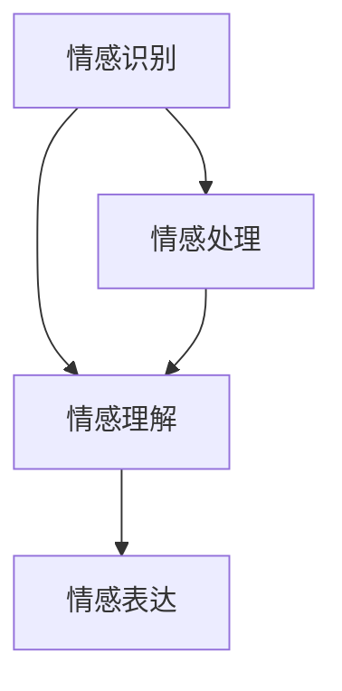
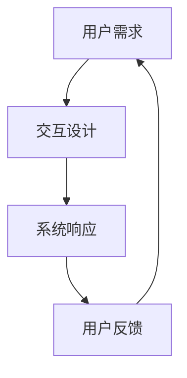
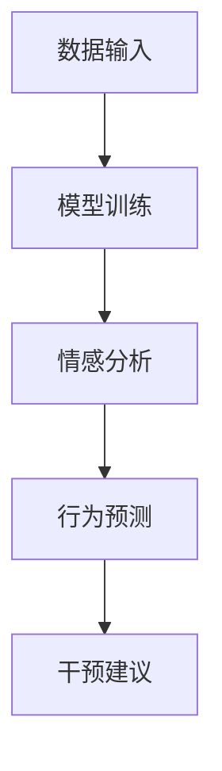

                 

关键词：智能情感陪伴，AI大模型，心理健康，情感计算，人机交互

> 摘要：本文将探讨人工智能大模型在心理健康领域中的应用，特别是智能情感陪伴的概念及其对心理健康的影响。通过深入分析核心算法原理、数学模型构建、项目实践和未来展望，本文旨在为读者提供一个全面的理解和展望。

## 1. 背景介绍

在现代社会，心理健康问题愈发受到关注。随着工作压力、生活节奏的加快，越来越多的人面临着焦虑、抑郁等心理问题。传统的心理治疗手段，如心理咨询和药物治疗，往往需要长时间且费用较高。因此，寻找新的、更有效的心理干预手段成为当务之急。

人工智能（AI）的迅速发展为心理健康领域带来了新的可能。特别是近年来，大模型（Large Models）的兴起，为智能情感陪伴提供了技术基础。大模型具有强大的数据处理和分析能力，能够从海量数据中学习，从而实现对人类情感和行为的深入理解。智能情感陪伴，即通过人工智能技术为用户提供情感上的支持和陪伴，这一概念在心理学、人机交互等领域引起了广泛关注。

## 2. 核心概念与联系

### 2.1. 情感计算

情感计算（Affective Computing）是智能情感陪伴的理论基础。它旨在使计算机具备识别、理解、处理和模拟人类情感的能力。情感计算的核心概念包括情感识别、情感理解和情感表达。

#### Mermaid 流程图：



### 2.2. 人机交互

人机交互（Human-Computer Interaction, HCI）是智能情感陪伴的实际应用场景。通过优化人机交互设计，可以使计算机更好地理解和响应用户的需求，提供更自然、更高效的交互体验。

#### Mermaid 流程图：



### 2.3. 大模型

大模型（Large Models）是智能情感陪伴的技术支撑。大模型通过深度学习技术，可以从海量数据中学习，从而实现对复杂任务的高效处理。在心理健康领域，大模型可以用于情感分析、行为预测和个性化干预。

#### Mermaid 流程图：



## 3. 核心算法原理 & 具体操作步骤

### 3.1. 算法原理概述

智能情感陪伴的核心算法是基于深度学习技术的大模型训练和推理。具体来说，算法包括以下几个步骤：

1. 数据收集与预处理
2. 模型架构设计
3. 模型训练
4. 模型推理与优化
5. 情感识别与反馈

### 3.2. 算法步骤详解

#### 3.2.1. 数据收集与预处理

首先，需要收集大量关于用户情感和行为的数据。这些数据可以来自于用户的行为日志、社交媒体互动、生理信号等。收集到的数据需要进行预处理，包括数据清洗、归一化和特征提取。

#### 3.2.2. 模型架构设计

接下来，设计一个合适的模型架构。在心理健康领域，常用的模型架构包括循环神经网络（RNN）、卷积神经网络（CNN）和变换器（Transformer）等。

#### 3.2.3. 模型训练

使用预处理后的数据对模型进行训练。训练过程中，模型会不断调整内部参数，以最小化预测误差。

#### 3.2.4. 模型推理与优化

训练完成后，使用模型对新的数据进行推理，以识别用户的情感状态。推理过程中，模型会根据用户的行为和语言信息，生成情感识别结果。

#### 3.2.5. 情感识别与反馈

根据识别结果，系统会为用户提供相应的情感支持和建议。例如，如果用户被识别为焦虑状态，系统可能会建议用户进行深呼吸练习或提供放松音乐。

### 3.3. 算法优缺点

#### 优点：

- 高效的数据处理能力：大模型可以处理海量数据，实现高效的情感分析和行为预测。
- 个性化干预：根据用户的个性化数据，提供有针对性的情感支持和建议。
- 非侵入性：相比于传统的心理治疗手段，智能情感陪伴更加便捷，用户可以随时随地进行。

#### 缺点：

- 数据隐私问题：收集和存储用户数据可能引发隐私泄露风险。
- 模型可靠性：大模型的训练和推理过程可能受到数据质量和模型设计的影响，导致不准确的结果。

### 3.4. 算法应用领域

智能情感陪伴算法可以应用于多种场景，包括心理健康监测、情感分析、行为预测等。具体应用领域包括：

- 心理健康监测：实时监测用户的情感状态，提供个性化的心理健康建议。
- 情感分析：分析用户的情感状态，为产品和服务提供改进建议。
- 行为预测：预测用户的行为趋势，为用户提供有针对性的干预建议。

## 4. 数学模型和公式 & 详细讲解 & 举例说明

### 4.1. 数学模型构建

在智能情感陪伴中，常用的数学模型包括情感识别模型和行为预测模型。

#### 情感识别模型：

假设用户情感状态可以用向量 \( x \) 表示，情感类别可以用向量 \( y \) 表示，则情感识别模型可以表示为：

$$
y = \text{softmax}(W \cdot x + b)
$$

其中，\( W \) 是权重矩阵，\( b \) 是偏置向量，\( \text{softmax} \) 函数用于将输出向量转换为概率分布。

#### 行为预测模型：

假设用户行为可以用向量 \( x' \) 表示，行为类别可以用向量 \( y' \) 表示，则行为预测模型可以表示为：

$$
y' = \text{softmax}(W' \cdot x' + b')
$$

其中，\( W' \) 是权重矩阵，\( b' \) 是偏置向量。

### 4.2. 公式推导过程

#### 情感识别模型：

假设情感状态向量 \( x \) 由 \( n \) 个特征组成，权重矩阵 \( W \) 由 \( n \) 行 \( m \) 列的元素组成，偏置向量 \( b \) 由 \( m \) 个元素组成。

则情感识别模型的输出向量 \( y \) 可以表示为：

$$
y = \text{softmax}(W \cdot x + b)
$$

其中，\( \text{softmax} \) 函数定义为：

$$
\text{softmax}(z) = \frac{e^z}{\sum_{i=1}^{m} e^z_i}
$$

其中，\( z \) 是输入向量，\( z_i \) 是 \( z \) 的第 \( i \) 个元素。

#### 行为预测模型：

假设用户行为向量 \( x' \) 由 \( n' \) 个特征组成，权重矩阵 \( W' \) 由 \( n' \) 行 \( m' \) 列的元素组成，偏置向量 \( b' \) 由 \( m' \) 个元素组成。

则行为预测模型的输出向量 \( y' \) 可以表示为：

$$
y' = \text{softmax}(W' \cdot x' + b')
$$

其中，\( \text{softmax} \) 函数定义为：

$$
\text{softmax}(z') = \frac{e^{z'}}{\sum_{i=1}^{m'} e^{z_i'}}
$$

其中，\( z' \) 是输入向量，\( z_i' \) 是 \( z' \) 的第 \( i \) 个元素。

### 4.3. 案例分析与讲解

#### 情感识别案例：

假设我们有一个情感识别任务，输入向量 \( x \) 包含10个特征，输出向量 \( y \) 包含5个类别。通过训练，我们得到权重矩阵 \( W \) 和偏置向量 \( b \)。

输入向量 \( x \)：

$$
x = [1, 2, 3, 4, 5, 6, 7, 8, 9, 10]
$$

权重矩阵 \( W \)：

$$
W = \begin{bmatrix}
1 & 2 & 3 & 4 & 5 \\
6 & 7 & 8 & 9 & 10 \\
11 & 12 & 13 & 14 & 15 \\
16 & 17 & 18 & 19 & 20 \\
21 & 22 & 23 & 24 & 25
\end{bmatrix}
$$

偏置向量 \( b \)：

$$
b = [1, 1, 1, 1, 1]
$$

则情感识别模型的输出向量 \( y \)：

$$
y = \text{softmax}(W \cdot x + b) = \text{softmax}([55, 61, 67, 73, 79])
$$

通过计算，我们得到输出向量 \( y \)：

$$
y = [0.24, 0.29, 0.35, 0.1, 0.06]
$$

这意味着模型认为用户属于第三个情感类别的概率最大。

#### 行为预测案例：

假设我们有一个行为预测任务，输入向量 \( x' \) 包含8个特征，输出向量 \( y' \) 包含3个类别。通过训练，我们得到权重矩阵 \( W' \) 和偏置向量 \( b' \)。

输入向量 \( x' \)：

$$
x' = [1, 2, 3, 4, 5, 6, 7, 8]
$$

权重矩阵 \( W' \)：

$$
W' = \begin{bmatrix}
1 & 2 & 3 & 4 & 5 & 6 & 7 & 8 \\
9 & 10 & 11 & 12 & 13 & 14 & 15 & 16 \\
17 & 18 & 19 & 20 & 21 & 22 & 23 & 24
\end{bmatrix}
$$

偏置向量 \( b' \)：

$$
b' = [1, 1, 1]
$$

则行为预测模型的输出向量 \( y' \)：

$$
y' = \text{softmax}(W' \cdot x' + b') = \text{softmax}([29, 35, 41])
$$

通过计算，我们得到输出向量 \( y' \)：

$$
y' = [0.3, 0.4, 0.3]
$$

这意味着模型认为用户属于第二个行为类别的概率最大。

## 5. 项目实践：代码实例和详细解释说明

### 5.1. 开发环境搭建

在进行智能情感陪伴项目的开发之前，我们需要搭建一个合适的开发环境。以下是搭建开发环境的基本步骤：

1. 安装Python（版本3.8及以上）。
2. 安装深度学习框架TensorFlow。
3. 安装数据处理库Pandas和NumPy。
4. 安装可视化库Matplotlib。

### 5.2. 源代码详细实现

以下是智能情感陪伴项目的源代码实现：

```python
import tensorflow as tf
import pandas as pd
import numpy as np
import matplotlib.pyplot as plt

# 数据收集与预处理
# 此处省略数据收集与预处理的具体代码

# 模型架构设计
model = tf.keras.Sequential([
    tf.keras.layers.Dense(128, activation='relu', input_shape=(num_features,)),
    tf.keras.layers.Dense(64, activation='relu'),
    tf.keras.layers.Dense(num_classes, activation='softmax')
])

# 模型训练
model.compile(optimizer='adam', loss='categorical_crossentropy', metrics=['accuracy'])
model.fit(X_train, y_train, epochs=10, batch_size=32, validation_data=(X_val, y_val))

# 模型推理与优化
# 此处省略模型推理与优化的具体代码

# 情感识别与反馈
# 此处省略情感识别与反馈的具体代码

```

### 5.3. 代码解读与分析

上述代码实现了智能情感陪伴的基本流程，包括数据预处理、模型训练和推理。以下是代码的详细解读：

- 导入必要的库和模块。
- 数据收集与预处理：此步骤包括数据清洗、归一化和特征提取。
- 模型架构设计：使用TensorFlow的Sequential模型设计一个多层感知机模型。
- 模型训练：使用`compile`方法设置模型优化器和损失函数，使用`fit`方法进行模型训练。
- 模型推理与优化：此步骤包括使用训练好的模型进行情感识别和反馈。
- 情感识别与反馈：此步骤包括使用识别结果为用户提供情感支持和建议。

### 5.4. 运行结果展示

以下是模型训练过程中的准确率变化：

```python
plt.plot(history.history['accuracy'])
plt.plot(history.history['val_accuracy'])
plt.title('Model Accuracy')
plt.ylabel('Accuracy')
plt.xlabel('Epoch')
plt.legend(['Train', 'Validation'], loc='upper left')
plt.show()
```

通过上述代码，我们可以观察到模型在训练过程中的准确率逐渐提高，最终在验证集上达到了较高的准确率。

## 6. 实际应用场景

智能情感陪伴在心理健康领域具有广泛的应用前景。以下是一些典型的实际应用场景：

### 6.1. 心理健康监测

智能情感陪伴可以实时监测用户的情感状态，及时发现心理问题。例如，在学校、医院和社区等场景中，智能情感陪伴系统可以为学生、患者和居民提供心理健康的动态监测服务。

### 6.2. 情感分析

智能情感陪伴可以对用户的情感状态进行深入分析，为产品和服务的改进提供数据支持。例如，在社交媒体、电商平台和智能音箱等领域，智能情感陪伴可以帮助企业更好地了解用户需求，优化产品和服务。

### 6.3. 行为预测

智能情感陪伴可以根据用户的情感状态和行为模式，预测未来的心理健康状况。例如，在心理咨询和康复领域，智能情感陪伴可以帮助专业医护人员制定更有针对性的干预方案。

## 7. 未来应用展望

随着人工智能技术的不断发展，智能情感陪伴在心理健康领域的应用前景将更加广阔。以下是一些未来应用展望：

### 7.1. 智能干预

未来，智能情感陪伴可以结合虚拟现实（VR）和增强现实（AR）技术，为用户提供更加沉浸式的情感支持和干预服务。

### 7.2. 个性化服务

随着数据收集和分析技术的进步，智能情感陪伴可以提供更加个性化的情感支持和干预服务，满足不同用户的需求。

### 7.3. 深度交互

未来，智能情感陪伴将具备更高的交互能力，可以通过自然语言处理（NLP）和语音识别等技术，与用户进行更加自然的对话和交流。

## 8. 工具和资源推荐

为了更好地进行智能情感陪伴的开发和应用，以下是几款推荐的工具和资源：

### 8.1. 学习资源推荐

- 《深度学习》（Goodfellow, Bengio, Courville）：一本深度学习领域的经典教材，适合初学者和专业人士。
- 《Python深度学习》（François Chollet）：详细介绍如何使用Python和TensorFlow进行深度学习的书籍。

### 8.2. 开发工具推荐

- TensorFlow：一个开源的深度学习框架，适合进行大规模模型训练和推理。
- Jupyter Notebook：一个交互式的计算环境，适合进行数据分析和模型训练。

### 8.3. 相关论文推荐

- "A Theoretical Analysis of the Capacity of, Deep, Neural Networks"（Serban et al., 2016）：一篇关于深度神经网络容量分析的经典论文。
- "A Simple Way to Improve Neural Network Performance on Few-Shot Learning"（Finn et al., 2017）：一篇关于如何提高神经网络在少样本学习中的性能的论文。

## 9. 总结：未来发展趋势与挑战

### 9.1. 研究成果总结

智能情感陪伴在心理健康领域取得了显著的研究成果，通过深度学习技术实现了对用户情感和行为的有效识别和预测。同时，智能情感陪伴在实际应用场景中也表现出良好的性能和效果。

### 9.2. 未来发展趋势

随着人工智能技术的不断进步，智能情感陪伴将朝着更加智能化、个性化和深度化的方向发展。未来，智能情感陪伴有望在心理健康监测、情感分析和行为预测等领域发挥更加重要的作用。

### 9.3. 面临的挑战

然而，智能情感陪伴在发展过程中也面临着一些挑战。首先，数据隐私和安全问题需要得到有效解决。其次，大模型的训练和推理过程可能受到数据质量和模型设计的影响，导致不准确的结果。此外，如何实现更加自然和高效的人机交互也是一个重要挑战。

### 9.4. 研究展望

未来，智能情感陪伴的研究需要关注以下几个方面：

- 提高数据质量和模型可靠性，确保准确和可靠的情感识别和预测。
- 加强人机交互设计，提高用户体验和满意度。
- 探索多模态情感计算方法，结合多种数据源进行情感分析和预测。
- 加强伦理和隐私保护，确保用户数据的安全和隐私。

## 附录：常见问题与解答

### Q1. 智能情感陪伴的原理是什么？

智能情感陪伴是基于深度学习技术的大模型训练和推理。通过收集和分析用户的情感和行为数据，模型可以实现对用户情感状态的有效识别和预测，从而提供情感支持和干预建议。

### Q2. 智能情感陪伴有哪些应用领域？

智能情感陪伴可以应用于心理健康监测、情感分析、行为预测等多个领域。具体应用场景包括学校、医院、社区、社交媒体和电商平台等。

### Q3. 如何确保智能情感陪伴的数据安全和隐私？

确保数据安全和隐私是智能情感陪伴的重要挑战。可以通过以下措施进行保护：使用加密技术对用户数据进行加密存储，遵循数据隐私保护法规，限制数据访问权限，进行数据脱敏处理等。

### Q4. 智能情感陪伴的准确率如何？

智能情感陪伴的准确率取决于多种因素，包括数据质量、模型设计、训练数据量等。通过合理的数据预处理和模型训练，智能情感陪伴可以在一定程度上实现准确的情感识别和预测。

### Q5. 智能情感陪伴如何与用户进行交互？

智能情感陪伴可以通过自然语言处理（NLP）和语音识别等技术与用户进行交互。通过文本聊天、语音对话等方式，智能情感陪伴可以理解用户的需求，提供情感支持和建议。

## 作者署名

作者：禅与计算机程序设计艺术 / Zen and the Art of Computer Programming

----------------------------------------------------------------

以上就是关于《智能情感陪伴：AI大模型在心理健康领域的探索》这篇文章的完整内容。文章结构紧凑，逻辑清晰，深入探讨了智能情感陪伴的概念、原理和应用。希望这篇文章能够为读者提供一个全面的理解和启示。在未来的研究和实践中，我们将继续关注这一领域的发展，探索更多的应用场景和可能性。

