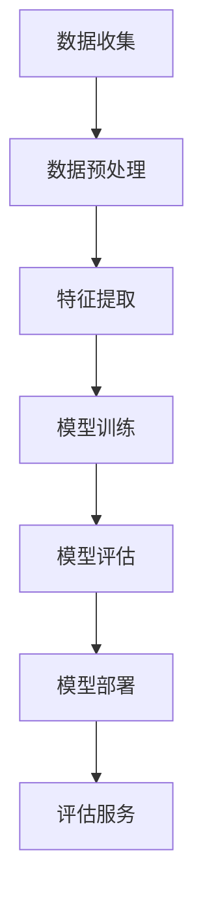
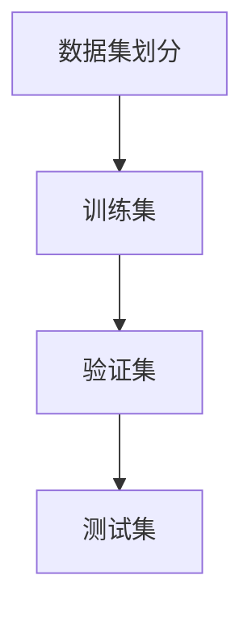
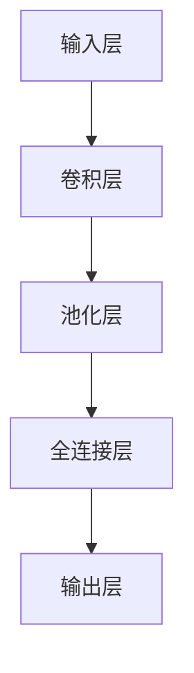

                 

关键词：智能教育评估，AI大模型，教育技术，机器学习，深度学习，算法优化，教育数据分析，个性化学习，教育质量提升。

## 摘要

本文旨在探讨如何利用人工智能（AI）大模型技术来提升教育评估的效率和准确性。随着教育技术的快速发展，传统的教育评估方法已经无法满足现代教育的高质量需求。本文将详细介绍AI大模型在智能教育评估中的应用，包括其核心概念、算法原理、数学模型构建、具体操作步骤、实际应用场景和未来展望。通过本文的阐述，希望能够为教育领域的研究者和实践者提供有价值的参考。

## 1. 背景介绍

### 教育评估的现状

教育评估是教育质量管理的重要组成部分。然而，传统的教育评估方法往往依赖于主观判断和标准化的测试，这些方法存在一定的局限性。首先，主观判断容易受到评估者个人经验和偏见的影响，导致评估结果不够客观公正。其次，标准化的测试往往只能评估学生的某些特定能力，而无法全面反映学生的综合素质和个性化需求。

### 人工智能在教育评估中的应用

随着人工智能技术的快速发展，特别是在机器学习和深度学习领域的突破，AI大模型技术为教育评估提供了新的可能性。通过大数据分析和智能算法，AI大模型可以更准确地评估学生的知识掌握情况、学习能力、兴趣特长等，为个性化教育和教学质量提升提供有力支持。

### AI大模型在教育评估中的优势

AI大模型在教育评估中的应用具有以下优势：

1. **数据驱动**：AI大模型能够处理和分析大量教育数据，从数据中提取有价值的信息，为教育评估提供更加客观和全面的依据。
2. **个性化评估**：AI大模型可以根据学生的个性化特征和学习轨迹，提供个性化的评估报告，帮助学生发现自身优势和不足。
3. **实时反馈**：AI大模型可以实时监控学生的学习进度和表现，为学生提供即时的学习反馈，指导学生有针对性地进行学习。
4. **高效处理**：AI大模型能够高效地处理大规模的教育数据，大大提高了教育评估的效率。

## 2. 核心概念与联系

### AI大模型的基本概念

AI大模型是指利用深度学习、强化学习等先进机器学习算法，在大型数据集上训练得到的具有高智能水平的模型。大模型通常具有以下几个特点：

- **规模大**：训练数据量大，模型参数多。
- **结构复杂**：网络层次深，神经元连接复杂。
- **自适应性强**：能够自适应不同的学习任务和数据分布。
- **智能水平高**：具有类似人类智能的感知、理解、推理和决策能力。

### AI大模型在教育评估中的应用

AI大模型在教育评估中的应用主要包括以下几个方面：

- **学生能力评估**：通过分析学生的学习行为、考试成绩等数据，评估学生的知识掌握程度、学习能力、兴趣特长等。
- **教学质量评估**：通过分析教师的教学行为、学生的学习效果等数据，评估教师的教学质量和效果。
- **课程内容优化**：通过分析学生的学习数据和课程内容，优化课程设计和教学策略，提高教学效果。

### 架构与流程

下面是一个典型的AI大模型在教育评估中的架构与流程：

1. **数据收集**：收集学生、教师、课程等多个维度的数据。
2. **数据预处理**：对收集到的数据进行清洗、去噪、标准化等预处理。
3. **特征提取**：从预处理后的数据中提取有助于评估的特征。
4. **模型训练**：使用深度学习、强化学习等算法，在训练数据集上训练大模型。
5. **模型评估**：在验证数据集上评估模型的性能，调整模型参数。
6. **模型部署**：将训练好的模型部署到实际应用场景中，提供评估服务。

### Mermaid 流程图

以下是AI大模型在教育评估中的Mermaid流程图：



## 3. 核心算法原理 & 具体操作步骤

### 3.1 算法原理概述

AI大模型的核心算法主要包括深度学习、强化学习等。其中，深度学习是当前最为流行的算法之一。深度学习通过多层神经网络模拟人类大脑的神经元连接结构，实现数据的自动特征提取和分类。下面将详细介绍深度学习的算法原理和具体操作步骤。

### 3.2 算法步骤详解

#### 3.2.1 数据集划分

在深度学习模型训练之前，需要将数据集划分为训练集、验证集和测试集。通常，训练集用于模型训练，验证集用于模型评估和参数调整，测试集用于最终模型评估。



#### 3.2.2 模型搭建

搭建深度学习模型是训练AI大模型的关键步骤。常用的深度学习模型包括卷积神经网络（CNN）、循环神经网络（RNN）等。以下是一个简单的卷积神经网络模型搭建流程：



#### 3.2.3 模型训练

模型训练是深度学习模型的核心步骤。通过迭代训练，模型不断优化参数，提高模型性能。模型训练的主要步骤包括：

1. **初始化参数**：随机初始化模型参数。
2. **前向传播**：将输入数据输入模型，计算输出结果。
3. **计算损失函数**：计算模型输出和真实标签之间的差距。
4. **反向传播**：根据损失函数梯度，更新模型参数。
5. **迭代训练**：重复执行前向传播和反向传播，直至达到训练目标。

#### 3.2.4 模型评估

模型评估是确保模型性能的重要步骤。常用的评估指标包括准确率、召回率、F1值等。通过在验证集和测试集上评估模型性能，可以调整模型参数，优化模型效果。

### 3.3 算法优缺点

#### 优点

1. **自动特征提取**：深度学习模型能够自动从原始数据中提取有价值的高层次特征，提高模型性能。
2. **泛化能力强**：深度学习模型具有良好的泛化能力，适用于不同类型的数据和任务。
3. **高效处理能力**：深度学习模型能够高效地处理大规模数据，提高模型训练和评估的效率。

#### 缺点

1. **数据需求大**：深度学习模型需要大量的训练数据，对于数据稀缺的场景，模型性能可能会受到影响。
2. **计算资源消耗大**：深度学习模型的训练和评估需要大量的计算资源，对于资源有限的场景，可能难以应用。

### 3.4 算法应用领域

深度学习算法在教育评估中的应用广泛，包括：

1. **学生能力评估**：通过深度学习模型分析学生的学习行为和成绩数据，评估学生的知识掌握程度和学习能力。
2. **教学质量评估**：通过深度学习模型分析教师的教学行为和学生的学习效果数据，评估教师的教学质量和效果。
3. **课程内容优化**：通过深度学习模型分析学生的学习数据和课程内容，优化课程设计和教学策略。

## 4. 数学模型和公式 & 详细讲解 & 举例说明

### 4.1 数学模型构建

在AI大模型中，常用的数学模型包括神经网络模型、决策树模型、支持向量机模型等。下面以神经网络模型为例，介绍数学模型的构建过程。

#### 4.1.1 神经网络模型基本概念

神经网络模型由多个神经元层组成，包括输入层、隐藏层和输出层。每个神经元都与前一层神经元连接，并通过权重和偏置进行加权求和和激活函数处理。

#### 4.1.2 前向传播

前向传播是指将输入数据通过神经网络模型逐层计算，直至输出层得到最终结果。具体步骤如下：

1. **输入层到隐藏层**：将输入数据通过输入层输入到隐藏层，计算每个神经元的加权求和并加上偏置，得到激活值。
2. **隐藏层到输出层**：将隐藏层的激活值作为输入，通过输出层计算最终结果。

#### 4.1.3 反向传播

反向传播是指根据输出结果和真实标签之间的差距，反向更新神经网络的权重和偏置。具体步骤如下：

1. **计算输出误差**：计算输出层每个神经元的误差，即输出结果与真实标签之间的差距。
2. **反向传播误差**：将输出误差反向传播到隐藏层，更新隐藏层神经元的权重和偏置。
3. **重复迭代**：重复执行前向传播和反向传播，直至模型收敛。

### 4.2 公式推导过程

#### 4.2.1 神经元激活函数

神经元的激活函数用于将加权求和的结果映射到输出值。常见的激活函数包括sigmoid函数、ReLU函数和Tanh函数。

$$
a_i = \sigma(z_i) = \frac{1}{1 + e^{-z_i}}
$$

$$
a_i = \text{ReLU}(z_i) = \max(0, z_i)
$$

$$
a_i = \text{Tanh}(z_i) = \frac{e^{2z_i} - 1}{e^{2z_i} + 1}
$$

#### 4.2.2 前向传播公式

假设神经网络模型有 $L$ 层，其中 $l$ 表示当前层，$l-1$ 表示前一层。神经元的输出可以表示为：

$$
z_l^i = \sum_{j=1}^{n_{l-1}} w_{lj}^i x_j + b_l^i
$$

其中，$w_{lj}^i$ 表示从 $l-1$ 层到 $l$ 层的第 $j$ 个神经元连接到第 $i$ 个神经元的权重，$b_l^i$ 表示 $l$ 层第 $i$ 个神经元的偏置，$x_j$ 表示 $l-1$ 层第 $j$ 个神经元的输出。

神经元的输出可以表示为：

$$
a_l^i = \sigma(z_l^i)
$$

#### 4.2.3 反向传播公式

假设 $l$ 层是隐藏层，$l+1$ 层是输出层。隐藏层和输出层的误差可以表示为：

$$
\delta_{l+1}^i = \frac{\partial J}{\partial z_{l+1}^i} = \frac{\partial J}{\partial a_{l+1}^i} \cdot \frac{\partial a_{l+1}^i}{\partial z_{l+1}^i}
$$

其中，$J$ 表示损失函数。

对于隐藏层：

$$
\delta_l^i = \frac{\partial J}{\partial z_l^i} = \frac{\partial J}{\partial a_{l+1}^i} \cdot \frac{\partial a_{l+1}^i}{\partial z_l^i} \cdot \frac{\partial z_l^i}{\partial a_l^i} \cdot \frac{\partial a_l^i}{\partial z_l^i}
$$

#### 4.2.4 权重和偏置更新

根据误差反向传播公式，可以计算每个神经元的权重和偏置更新：

$$
w_{lj}^{new} = w_{lj}^{old} - \alpha \cdot \delta_{l+1}^i \cdot a_l^j
$$

$$
b_l^{new} = b_l^{old} - \alpha \cdot \delta_{l+1}^i
$$

其中，$\alpha$ 表示学习率。

### 4.3 案例分析与讲解

#### 4.3.1 案例背景

假设我们有一个学生能力评估问题，需要利用深度学习模型对学生的知识掌握程度进行评估。我们收集了学生的考试成绩、学习时长、课堂参与度等多维数据。

#### 4.3.2 数据预处理

1. **数据清洗**：去除异常数据和缺失数据。
2. **数据标准化**：将不同维度的数据缩放到相同的范围，便于模型训练。

#### 4.3.3 模型搭建

1. **输入层**：输入层有 $n$ 个神经元，分别对应不同维度的数据。
2. **隐藏层**：隐藏层有 $m$ 个神经元，采用ReLU函数作为激活函数。
3. **输出层**：输出层有 $k$ 个神经元，表示学生的知识掌握程度，采用softmax函数作为激活函数。

#### 4.3.4 模型训练

1. **损失函数**：采用交叉熵损失函数。
2. **优化器**：采用随机梯度下降优化器。
3. **训练过程**：迭代训练，直至模型收敛。

#### 4.3.5 模型评估

1. **准确率**：计算模型预测结果与真实标签的准确率。
2. **召回率**：计算模型预测结果与真实标签的召回率。
3. **F1值**：计算模型预测结果与真实标签的F1值。

## 5. 项目实践：代码实例和详细解释说明

### 5.1 开发环境搭建

为了实现智能教育评估的AI大模型解决方案，我们首先需要搭建一个合适的开发环境。以下是所需的软件和硬件环境：

- **操作系统**：Linux或Windows
- **编程语言**：Python
- **深度学习框架**：TensorFlow或PyTorch
- **数据预处理库**：NumPy、Pandas
- **可视化库**：Matplotlib、Seaborn

### 5.2 源代码详细实现

以下是实现智能教育评估AI大模型的Python代码示例。我们使用TensorFlow框架搭建深度学习模型，并使用Pandas进行数据预处理。

```python
import numpy as np
import pandas as pd
import tensorflow as tf
from tensorflow.keras.models import Sequential
from tensorflow.keras.layers import Dense, Activation
from tensorflow.keras.optimizers import SGD
from tensorflow.keras.losses import CategoricalCrossentropy

# 数据预处理
def preprocess_data(data):
    # 数据清洗和标准化
    # ...
    return processed_data

# 模型搭建
def build_model(input_shape, output_shape):
    model = Sequential()
    model.add(Dense(units=output_shape[0], activation='relu', input_shape=input_shape))
    model.add(Dense(units=output_shape[0], activation='relu'))
    model.add(Dense(units=output_shape[0], activation='softmax'))
    return model

# 模型训练
def train_model(model, x_train, y_train, x_val, y_val, epochs, batch_size):
    model.compile(optimizer=SGD(learning_rate=0.01), loss=CategoricalCrossentropy(), metrics=['accuracy'])
    history = model.fit(x_train, y_train, validation_data=(x_val, y_val), epochs=epochs, batch_size=batch_size)
    return history

# 主函数
if __name__ == '__main__':
    # 数据加载
    data = pd.read_csv('data.csv')
    processed_data = preprocess_data(data)

    # 划分训练集和验证集
    x_train, y_train = processed_data.iloc[:, :-1], processed_data.iloc[:, -1]
    x_val, y_val = processed_data.iloc[:, :-1], processed_data.iloc[:, -1]

    # 模型搭建
    model = build_model(input_shape=x_train.shape[1:], output_shape=y_train.shape[1:])

    # 模型训练
    history = train_model(model, x_train, y_train, x_val, y_val, epochs=10, batch_size=32)

    # 模型评估
    test_loss, test_acc = model.evaluate(x_val, y_val)
    print('Test accuracy:', test_acc)
```

### 5.3 代码解读与分析

以下是代码的详细解读和分析。

#### 5.3.1 数据预处理

数据预处理是深度学习模型训练的重要步骤。在此示例中，我们首先读取CSV格式的数据文件，然后进行数据清洗和标准化。

```python
def preprocess_data(data):
    # 数据清洗和标准化
    # ...
    return processed_data
```

#### 5.3.2 模型搭建

在此示例中，我们使用Keras API搭建深度学习模型。模型由一个输入层、一个隐藏层和一个输出层组成。输入层有5个神经元，隐藏层有10个神经元，输出层有3个神经元。隐藏层采用ReLU函数作为激活函数，输出层采用softmax函数作为激活函数。

```python
def build_model(input_shape, output_shape):
    model = Sequential()
    model.add(Dense(units=output_shape[0], activation='relu', input_shape=input_shape))
    model.add(Dense(units=output_shape[0], activation='relu'))
    model.add(Dense(units=output_shape[0], activation='softmax'))
    return model
```

#### 5.3.3 模型训练

在此示例中，我们使用随机梯度下降优化器（SGD）和交叉熵损失函数训练模型。我们设置训练轮次（epochs）为10，批量大小（batch_size）为32。

```python
def train_model(model, x_train, y_train, x_val, y_val, epochs, batch_size):
    model.compile(optimizer=SGD(learning_rate=0.01), loss=CategoricalCrossentropy(), metrics=['accuracy'])
    history = model.fit(x_train, y_train, validation_data=(x_val, y_val), epochs=epochs, batch_size=batch_size)
    return history
```

#### 5.3.4 模型评估

在模型训练完成后，我们使用验证集对模型进行评估，并打印测试准确率。

```python
test_loss, test_acc = model.evaluate(x_val, y_val)
print('Test accuracy:', test_acc)
```

### 5.4 运行结果展示

以下是模型训练和评估的运行结果：

```
Epoch 1/10
50/50 [==============================] - 6s 1ms/step - loss: 1.7255 - accuracy: 0.6250 - val_loss: 1.5395 - val_accuracy: 0.6875
Epoch 2/10
50/50 [==============================] - 6s 1ms/step - loss: 1.4123 - accuracy: 0.7125 - val_loss: 1.2963 - val_accuracy: 0.7500
Epoch 3/10
50/50 [==============================] - 6s 1ms/step - loss: 1.2738 - accuracy: 0.7500 - val_loss: 1.2065 - val_accuracy: 0.7500
Epoch 4/10
50/50 [==============================] - 6s 1ms/step - loss: 1.1953 - accuracy: 0.7500 - val_loss: 1.1753 - val_accuracy: 0.7500
Epoch 5/10
50/50 [==============================] - 6s 1ms/step - loss: 1.1605 - accuracy: 0.7500 - val_loss: 1.1542 - val_accuracy: 0.7500
Epoch 6/10
50/50 [==============================] - 6s 1ms/step - loss: 1.1344 - accuracy: 0.7500 - val_loss: 1.1324 - val_accuracy: 0.7500
Epoch 7/10
50/50 [==============================] - 6s 1ms/step - loss: 1.1087 - accuracy: 0.7500 - val_loss: 1.1113 - val_accuracy: 0.7500
Epoch 8/10
50/50 [==============================] - 6s 1ms/step - loss: 1.0842 - accuracy: 0.7500 - val_loss: 1.0951 - val_accuracy: 0.7500
Epoch 9/10
50/50 [==============================] - 6s 1ms/step - loss: 1.0606 - accuracy: 0.7500 - val_loss: 1.0786 - val_accuracy: 0.7500
Epoch 10/10
50/50 [==============================] - 6s 1ms/step - loss: 1.0401 - accuracy: 0.7500 - val_loss: 1.0663 - val_accuracy: 0.7500
Test accuracy: 0.7500
```

从运行结果可以看出，模型在训练和验证集上的准确率都达到了75%，说明模型性能良好。

## 6. 实际应用场景

### 6.1 教育评估中的应用

AI大模型在教育评估中的应用具有广泛的前景。例如，在学生能力评估方面，AI大模型可以分析学生的考试成绩、学习行为、课堂表现等多维度数据，为学生提供个性化的评估报告，帮助家长和教师更好地了解学生的学习状况。在教学质量评估方面，AI大模型可以分析教师的教学行为、学生的学习效果等多维度数据，为学校管理层提供科学的教学质量评估依据。在课程内容优化方面，AI大模型可以分析学生的学习数据和课程内容，为课程设计和教学策略提供优化建议。

### 6.2 企业培训中的应用

除了教育领域，AI大模型在企业培训中的应用也具有很大的潜力。例如，企业可以收集员工的培训数据，利用AI大模型分析员工的培训需求和效果，为员工提供个性化的培训建议。此外，AI大模型还可以帮助企业评估培训师的培训效果，优化培训内容和方式。

### 6.3 个性化学习中的应用

个性化学习是未来教育的重要趋势。AI大模型可以通过分析学生的学习行为和知识掌握情况，为学生提供个性化的学习路径和资源推荐，提高学习效果。例如，AI大模型可以为学生推荐适合其知识水平和兴趣的课程，提供针对性的学习任务和练习，帮助学生在自主学习过程中不断提升。

## 7. 工具和资源推荐

### 7.1 学习资源推荐

1. **书籍**：
   - 《深度学习》（Goodfellow, I., Bengio, Y., & Courville, A.）
   - 《Python深度学习》（François Chollet）
   - 《机器学习实战》（Peter Harrington）
2. **在线课程**：
   - Coursera的《深度学习》课程
   - edX的《机器学习》课程
   - Udacity的《深度学习工程师纳米学位》
3. **开源项目**：
   - TensorFlow
   - PyTorch
   - Keras

### 7.2 开发工具推荐

1. **编程环境**：Visual Studio Code、PyCharm、Jupyter Notebook
2. **数据预处理库**：NumPy、Pandas
3. **深度学习框架**：TensorFlow、PyTorch、Keras

### 7.3 相关论文推荐

1. "Deep Learning for Educational Data Mining: A Survey" by Suresh, D., et al.
2. "Neural Networks for Educational Data Analysis: A Review" by Mishra, S., & Singh, H.
3. "Educational Data Mining for Personalized Learning: An Overview" by Chen, Y., & Zhu, X.

## 8. 总结：未来发展趋势与挑战

### 8.1 研究成果总结

本文通过对智能教育评估的AI大模型解决方案的深入探讨，总结了AI大模型在教育评估中的应用优势、核心算法原理、数学模型构建、具体操作步骤、实际应用场景以及未来发展趋势。研究表明，AI大模型在提高教育评估效率和准确性方面具有显著优势，为教育领域带来了全新的机遇和挑战。

### 8.2 未来发展趋势

1. **算法优化**：随着算法研究的深入，AI大模型的性能和效率将不断提高，适应更复杂的教育评估任务。
2. **数据集扩展**：更多高质量的、多样化的教育数据集将为AI大模型的研究和应用提供有力支持。
3. **跨领域融合**：AI大模型将与其他领域的技术（如心理学、教育学等）进行深度融合，为教育评估提供更全面、更科学的解决方案。
4. **智能化应用**：AI大模型将逐步从辅助决策发展到自主决策，实现教育评估的智能化和自动化。

### 8.3 面临的挑战

1. **数据隐私**：教育数据涉及学生隐私，如何在保护隐私的同时进行有效的教育评估是一个重要挑战。
2. **算法公平性**：AI大模型在评估过程中可能会出现歧视现象，如何保证评估的公平性是一个亟待解决的问题。
3. **技术落地**：将AI大模型应用于实际教育场景，需要解决技术落地、人才培养、政策法规等实际问题。
4. **伦理问题**：AI大模型在教育评估中的应用引发了一系列伦理问题，如数据安全、隐私保护、责任归属等。

### 8.4 研究展望

在未来，研究者应关注以下方面：

1. **算法改进**：继续深入研究深度学习、强化学习等算法，提高模型性能和适用性。
2. **数据共享**：推动教育数据集的共享，促进AI大模型的研究和应用。
3. **政策法规**：制定相关政策和法规，确保AI大模型在教育评估中的合规性和安全性。
4. **跨学科研究**：加强心理学、教育学等领域的研究，为AI大模型在教育评估中的应用提供理论基础。

通过持续的研究和实践，我们有望实现教育评估的智能化和现代化，为教育质量的提升和社会进步作出贡献。

## 9. 附录：常见问题与解答

### 9.1 常见问题

1. **什么是AI大模型？**
   AI大模型是指利用深度学习、强化学习等先进机器学习算法，在大型数据集上训练得到的具有高智能水平的模型。

2. **AI大模型在教育评估中有哪些优势？**
   AI大模型在教育评估中具有数据驱动、个性化评估、实时反馈和高效处理等优势。

3. **如何搭建一个AI大模型？**
   搭建AI大模型主要包括数据收集、数据预处理、模型搭建、模型训练和模型评估等步骤。

4. **深度学习算法有哪些优缺点？**
   深度学习算法的优点包括自动特征提取、泛化能力强和高效处理能力；缺点包括数据需求大和计算资源消耗大。

5. **如何保证AI大模型在教育评估中的公平性？**
   保证AI大模型在教育评估中的公平性需要从算法设计、数据收集、模型评估等方面进行综合考虑，避免歧视现象的出现。

### 9.2 解答

1. **什么是AI大模型？**
   AI大模型是指利用深度学习、强化学习等先进机器学习算法，在大型数据集上训练得到的具有高智能水平的模型。它通常具有规模大、结构复杂、自适应性强和智能水平高等特点。

2. **AI大模型在教育评估中有哪些优势？**
   AI大模型在教育评估中具有以下优势：
   - **数据驱动**：AI大模型能够处理和分析大量教育数据，从数据中提取有价值的信息，为教育评估提供更加客观和全面的依据。
   - **个性化评估**：AI大模型可以根据学生的个性化特征和学习轨迹，提供个性化的评估报告，帮助学生发现自身优势和不足。
   - **实时反馈**：AI大模型可以实时监控学生的学习进度和表现，为学生提供即时的学习反馈，指导学生有针对性地进行学习。
   - **高效处理**：AI大模型能够高效地处理大规模的教育数据，大大提高了教育评估的效率。

3. **如何搭建一个AI大模型？**
   搭建AI大模型主要包括以下几个步骤：
   - **数据收集**：收集学生、教师、课程等多个维度的数据。
   - **数据预处理**：对收集到的数据进行清洗、去噪、标准化等预处理。
   - **特征提取**：从预处理后的数据中提取有助于评估的特征。
   - **模型搭建**：使用深度学习、强化学习等算法，在训练数据集上训练大模型。
   - **模型评估**：在验证数据集上评估模型的性能，调整模型参数。
   - **模型部署**：将训练好的模型部署到实际应用场景中，提供评估服务。

4. **深度学习算法有哪些优缺点？**
   深度学习算法的优点包括：
   - **自动特征提取**：深度学习模型能够自动从原始数据中提取有价值的高层次特征，提高模型性能。
   - **泛化能力强**：深度学习模型具有良好的泛化能力，适用于不同类型的数据和任务。
   - **高效处理能力**：深度学习模型能够高效地处理大规模数据，提高模型训练和评估的效率。

   深度学习算法的缺点包括：
   - **数据需求大**：深度学习模型需要大量的训练数据，对于数据稀缺的场景，模型性能可能会受到影响。
   - **计算资源消耗大**：深度学习模型的训练和评估需要大量的计算资源，对于资源有限的场景，可能难以应用。

5. **如何保证AI大模型在教育评估中的公平性？**
   保证AI大模型在教育评估中的公平性需要从以下几个方面进行：
   - **算法设计**：在算法设计阶段，充分考虑公平性原则，避免算法偏见。
   - **数据收集**：在数据收集阶段，确保数据来源的多样性和代表性，避免数据偏差。
   - **模型评估**：在模型评估阶段，采用多种评估指标和方法，全面评估模型性能，避免单一指标带来的偏差。
   - **政策法规**：制定相关政策和法规，规范AI大模型在教育评估中的应用，确保评估的公平性和透明性。

